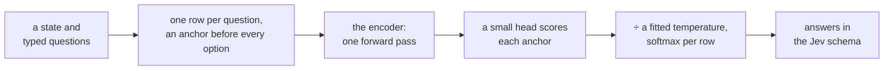

# sysone

> Jevify BERT-like encoders with sysone

sysone turns a pretrained encoder into a Jev-style typed-decision model: give it a state and typed questions (`choice`, `score`, `noul`) and get calibrated probabilities from one forward pass, over any option set named at request time. It packages the recipe [Laya](https://huggingface.co/convaiinnovations/laya) proved, an anchor token in front of every option, a small scorer on the anchors, proper-scoring-rule training and temperature calibration, as a fastai-shaped library: a one-line application API for the common case, and every layer below it reachable when the case is not common.

Every answer is read off the anchor rows and the schema is filled by code, so there is nothing to parse and no output tokens; k options are k anchors, so a trained model is zero-shot over new label sets; and several questions are several rows of one batch.



## The ten lines

```python
from sysone.text import TypedDecisions, decision_learner
from sysone import Decider

data  = TypedDecisions.from_hub("LocalLLaMA/typed-decisions", valid="test")
learn = decision_learner(data, "answerdotai/ModernBERT-large", train="head")  # frozen encoder, cached features
learn.lr_find()                       # LR range test, suggests a value
learn.fit_one_cycle(4, lr=1e-3)       # warmup + cosine, head LR and encoder LR separately
learn.calibrate()                     # temperatures per type and option count, on the held-out slice
learn.predict(state, questions)       # the Jev answer schema from the model in memory, before any export
learn.export("my-jev")                # head + sysone.json (template, budgets, temperatures), and Laya's format when it applies

jev = Decider.load("my-jev")          # the same answers from the exported folder, on CPU, CUDA or MPS
jev.predict(state, questions)         # choice / score / noul, probabilities, confidence
```

`train="lora"`, `"mica"` or `"full"` trains the encoder too; `decision_learner(data, "convaiinnovations/laya", init_from="convaiinnovations/laya", train="full")` fine-tunes Laya's own checkpoint as its notebook does; `sysone.multimodal` puts screenshots in the state with NeoMME, and `sysone.modernvbert` does the same with ModernVBERT; `sysone.protein` asks typed questions about protein sequences with ProtST, zero-shot from its joint space or with a head trained on its frozen towers; `sysone.zeroshot` answers without training, from a two-tower model's similarity or a masked language model's own prediction; `sysone.gliner` drives GLiNER2 models through their own package.

## What it answers

Three typed questions about one state, and the answers in the Jev schema. The model here is the fixture the notebooks test against, a random four-layer ModernBERT whose head trained for a few seconds, so its probabilities are close to uniform: what matters is the shape of the answers, one per question from one forward pass.

```python
import json, logging, tempfile
from pathlib import Path
logging.getLogger("transformers").setLevel(logging.ERROR)
from sysone.text import TypedDecisions, decision_learner
data = TypedDecisions.from_json("fixtures/typed_decisions_tiny.jsonl", valid=0.25)
learn = decision_learner(data, "fixtures/tiny-modernbert", train="head", preset="cpu", cache_dir=tempfile.mkdtemp())
learn.fit_one_cycle(3, lr=3e-3)
state = {"from": "user@acme.com", "body": "I was charged twice for invoice 4411 and I am cancelling if this is not fixed today."}
questions = {"department": {"type": "choice", "instructions": "Which department should handle this?",
                            "criteria": {"billing": "invoices, refunds", "technical": "bugs, outages"}},
             "urgency":    {"type": "score", "instructions": "How urgent is it?", "criteria": ["not urgent", "soon", "critical"]},
             "churn_risk": {"type": "noul", "instructions": "Does the user threaten to leave?"}}
learn.predict(state, questions)
```

```
{'department': {'type': 'choice',
  'choice': 'technical',
  'probabilities': {'billing': 0.5, 'technical': 0.5},
  'confidence': 0.0,
  'answer_confidence': 0.5},
 'urgency': {'type': 'score',
  'score': 1.0001,
  'legend': {'0': 'not urgent', '1': 'soon', '2': 'critical'},
  'probabilities': {'0': 0.3333, '1': 0.3333, '2': 0.3334},
  'confidence': 0.0,
  'answer_confidence': 0.3334},
 'churn_risk': {'type': 'noul',
  'noul': 0.5,
  'confidence': 0.5,
  'answer_confidence': 0.5}}
```

## Validated so far

Measured on 2026-09-26 and 27 on an M3 Pro (MPS, fp32), with the code in this repository:

| What | Result |
| --- | --- |
| Laya's published typed-decisions checkpoint, loaded with `Decider.load("convaiinnovations/laya/typed-decisions")`, on the 2,000 test decisions | **0.766 accuracy**, Laya's reported number; the same answer as `laya.Agent` on 200 of 200 compared decisions |
| Laya's multilingual checkpoint, `Decider.load("convaiinnovations/laya/multilingual")` (mmBERT's tokenizer, `<mask>` anchors, 1024-token rows) | the same probabilities as `laya.Agent` on 153 of 153 decisions, 30 test cases and a Spanish one |
| Head-only ModernBERT-large, frozen, anchors cached (the ten lines above) | 0.504 accuracy, below the dataset card's majority baseline (0.520): a frozen encoder never tuned for decisions carries little of the task. 12 minutes end to end, of which 58 s is training |
| Laya's general checkpoint, `convaiinnovations/laya`, zero-shot on the same test split | 0.362 accuracy: it was not trained on these four workflows |
| Laya's general encoder, frozen, under a new head (`decision_learner(data, "convaiinnovations/laya", train="head")`) | 0.560 accuracy, against ModernBERT-large's 0.504 under the same recipe: an encoder already trained on decisions gives a new head more to work with |
| Rows built by `RowBuilder` on Laya's template | token-for-token identical to Laya's `build_sequence` on every fixture row, on ModernBERT-large's tokenizer too |
| A sysone export in Laya's format | loads in `laya.Agent`, which returns the same answers; its logits match Laya's `DecisionModel` |
| RLCD | equal to the loss in Laya's fine-tuning notebook, pasted, under the same seed |
| NeoMME image rows | the image part, ids and two-axis positions, identical to NeoMME's processor |
| NeoMME-260M on real images, frozen, a head on its anchors | a 10-way digit choice from 100 MNIST images: 0.41 (chance 0.10), and 0.57 with the digits at 112 px; a hot-dog noul from 80 photos: 0.74 (chance 0.50); with LoRA, 0.33 and 0.72. Both took standardising NeoMME's vectors, and LoRA the plain scorer (the [images tutorial](nbs/tutorials/neomme_images.ipynb), with every output; the multimodal notebook, section 7) |
| ModernVBERT on the same images and recipes, frozen, a head on its anchors | the digit choice: 0.84, where NeoMME scored 0.31; the hot-dog noul: 0.94, where NeoMME scored 0.74; with LoRA on the text tower, 0.84 and 0.96. A probe on its image vectors reads 0.92 and 0.98 (the [ModernVBERT tutorial](nbs/tutorials/modernvbert_images.ipynb); the two encoders side by side in the [comparison](nbs/tutorials/neomme_vs_modernvbert.ipynb)) |
| ProtST-ESM1b loaded from its tensors alone (`sysone.protein`, no remote code), zero-shot on 600 DeepLoc test proteins | a 10-way location choice: 0.418 with ProtST's label texts as options, against 0.300 for the majority class, and 0.270 to 0.345 with other wordings; a membrane noul: 0.758, against 0.578 |
| The protein application: a pair head on ProtST's frozen towers, trained from vectors cached once for 1,200 proteins | 0.828 on the location choice, 0.906 on the membrane noul, 0.896 on four-way shortlists. At a 90% target, thresholds on the head's calibrated confidence act on 70% of the location questions, and the act head's on 57% (the [protein tutorial](nbs/tutorials/protein_decisions.ipynb), 13 minutes on the laptop) |

Not yet run: the full fine-tune on Kaggle's T4 pair that reproduces Laya's notebook from its released checkpoint (written in the text notebook, launched with `sysone run`, which needs credentials), GLiNER2.5-Decide on its real checkpoint, NeoMME on real screenshots rather than small image tasks, and the zero-shot suites.

## Install

```sh
pip install git+https://github.com/sgaseretto/sysonelib
```

Extras: `sysone[multimodal]` (pillow, torchvision, transformers ≥ 5.17 for NeoMME and ModernVBERT), `sysone[gliner]` (the `gliner2` package), `sysone[browser]` (the Mind2Web converters), `sysone[shortlist]` (sentence-transformers), `sysone[serve]` (FastAPI), `sysone[laya]` (Laya's runtime, for its export-compatibility check), `sysone[cloud]` (the Kaggle and Colab CLIs), `sysone[plots]`.

## How it is organised

| Layer | Modules | Holds |
| --- | --- | --- |
| Applications | `sysone.text`, `sysone.multimodal`, `sysone.modernvbert`, `sysone.protein`, `sysone.gliner` | `decision_learner` presets per modality: ModernBERT-large, NeoMME-260M, ModernVBERT, ProtST, GLiNER2 |
| High-level | `sysone.data`, `sysone.learner`, `sysone.inference`, `sysone.zeroshot`, `sysone.evaluate` | `TypedDecisions`, `Learner` (`lr_find`, `fit`, `fit_one_cycle`, `freeze`, `calibrate`, `export`), `Decider`, zero-shot deciders (`SimilarityDecider`, `VerbalizerDecider`), evaluation |
| Mid-level | `sysone.template`, `sysone.models`, `sysone.losses`, `sysone.cache`, `sysone.datasets` | `RowTemplate`, `RowBuilder`, transforms and side streams, `EncoderSpec`, `DecisionHead` (readouts, queries, the act head), stream encoders and cross-attention, regimes, soft CE and RLCD, temperatures, metrics and coverage, `FeatureCache`, converters |
| Low-level | `sysone.core` | `Question`, `Answer`, `Row`, `Batch`, the answer-schema filler |

Around them: `sysone.cloud` (Kaggle and Colab jobs) and `sysone.cli` (`sysone train | eval | predict | serve | run | jobs | publish`).

## Tutorials

- [NeoMME on images](nbs/tutorials/neomme_images.ipynb) trains the multimodal application on 100 MNIST digits (a 10-way choice) and 80 food photos (a hot-dog noul). Its outputs show every step: the rows the encoder reads and the image patches in them, the training curves, the answers image by image, and the confusions. It compares the default head, the linear head and LoRA, and measures what the image size changes.
- [ModernVBERT on images](nbs/tutorials/modernvbert_images.ipynb) runs the same two tasks on ModernVBERT, with the same records and recipes. Its outputs show the rows with the image as one 512-pixel tile of 64 image tokens, the three ways to train, the geometry of its vectors, and what more tiles change.
- [NeoMME and ModernVBERT, side by side](nbs/tutorials/neomme_vs_modernvbert.ipynb) trains both encoders on identical inputs, and compares their accuracy, calibration and cost, and where each one is wrong.
- [ProtST as a decision model](nbs/tutorials/protein_decisions.ipynb) asks three typed questions about each of 600 held-out proteins: a 10-way location choice, a membrane noul, and a four-way shortlist that lacks the right answer a third of the time. It answers them zero-shot with ProtST, comparing four ways to write the options. Then it trains a head on the frozen towers from 1,200 proteins and compares the two, compartment by compartment. It ends with when to act and when to escalate: Laya's act head against thresholds on the head's own confidence.

## Reading the notebooks

Read in order, the notebooks build the library up from its core, and each one explains its part with flow charts and with tensor diagrams drawn from the library's own tensors (the [figures](nbs/90_figures.ipynb) notebook draws them). Where the first implementation was wrong, or a reference implementation misbehaves, a *Finding* note says what happened, next to the evidence and the fix:

| Finding | Where |
| --- | --- |
| Laya's temperature fitter returns NaN on an underconfident model: LBFGS without a line search takes a secant step of −1,812 in log T at an inflection point | [losses](nbs/04_losses.ipynb#fitting-one) |
| RLCD's noise pulls its optimum towards distributions sharper than the gold, in proportion to σ², which is why σ is annealed | [losses](nbs/04_losses.ipynb#what-the-pieces-do) |
| A split by rows puts every held-out row's state in training; sysone splits by case | [data](nbs/02_data.ipynb#splits-by-case) |
| Laya's multilingual checkpoint anchors on `<mask>`, not `[MASK]` | [template](nbs/01_template.ipynb#laya-parity) |
| BERT's LoRA target names match nothing in ModernBERT, and a plain `Wo` would also match its MLP | [models](nbs/03_models.ipynb#regimes) |
| Unfreezing thawed the matrices MiCA keeps frozen | [models](nbs/03_models.ipynb#regimes) |
| A new `TrainingArguments` resets the accelerator of a live Trainer | [learner](nbs/05_learner.ipynb#running-the-trainer) |
| With length grouping, the Trainer shuffles evaluation rows too | [learner](nbs/05_learner.ipynb#predictions-and-metrics) |
| An export after `freeze` dropped the trained encoder; bf16 checkpoints were served in bf16 | [inference](nbs/06_inference.ipynb#laya-compatibility) |
| A sampled weights fingerprint misses most weight changes; the first cache served stale labels | [cache](nbs/07_cache.ipynb#the-key) |
| NeoMME's processor cannot build a decision row; what else did not work | [multimodal](nbs/20_neomme.ipynb#what-did-not-work-and-what-to-watch) |
| One channel carries 97% of NeoMME's vector norms: heads barely learned until they standardised their input, and LoRA with Laya's two-layer head collapsed on small tasks | [multimodal](nbs/20_neomme.ipynb#two-small-image-tasks-on-the-real-checkpoint) |
| A float16 feature cache quantises that channel, so `validate` and the `Decider` disagreed on the same model's calibration | [multimodal](nbs/20_neomme.ipynb#a-head-only-run) |
| ModernVBERT's processor enlarges every image to 2,048 px, so a 28-px digit takes 17 tiles and 1,127 tokens; at 1,536 px, a batch of 8 rows is 80 tiles, and it held 8 GB of GPU memory | [modernvbert](nbs/23_modernvbert.ipynb#a-head-only-run) |
| ModernVBERT's anchors have a dominant channel too, 58% of each vector's length, and standardising them lifts the digits from 0.67 to 0.84 | [ModernVBERT tutorial](nbs/tutorials/modernvbert_images.ipynb#does-modernvbert-need-standardising) |
| NeoMME reads MNIST digits better at 56–112 px than at 224, and a seeded split of stock photos leaves shoots on both sides | [images tutorial](nbs/tutorials/neomme_images.ipynb#one-more-setting-the-image-size) |
| The published Mind2Web converter misses ARIA labels, field values and `<select>` labels | [screens](nbs/21_screens.ipynb) |
| ProtST-BinaryLocalization labels membrane-bound proteins 0, which its card doesn't say | [protein tutorial](nbs/tutorials/protein_decisions.ipynb#the-data) |
| An embedder built on the spot switched ProtST's shared text tower into training mode, and peft needs a `base_model_prefix` on a stream encoder | [protein](nbs/22_protein.ipynb#zero-shot) |
| Laya's act head, trained on the rows the option head fits, ranked answers worse than the head's own confidence, and one threshold for every question acted on no shortlist | [protein tutorial](nbs/tutorials/protein_decisions.ipynb#acting-or-escalating) |

## Developer guide

sysone is written as [nbdev](https://nbdev.fast.ai/) notebooks: `nbs/` is the source, `sysone/` is generated by `nbdev-export` and never edited by hand, and the notebooks' examples are the test suite, run against tiny fixtures (`nbs/fixtures/`) so the whole suite runs offline on a CPU.

```sh
uv sync                               # the environment, with the package installed editable
uv run nbdev-export                   # notebooks -> sysone/
uv run nbdev-test --n-workers 4       # every notebook, top to bottom
uv run nbdev-clean                    # before committing
```

Cells marked `#| eval: false` need a GPU, a download or a network; the results of their last real run are pasted below them.

The tensor diagrams are SVG files in `nbs/images/`, drawn by `nbs/90_figures.ipynb` from the library's own functions with [tensordiagram](https://github.com/hardik-vala/tensordiagram); running that notebook (the test suite does) redraws them, byte for byte when nothing changed. The flow charts are [Mermaid](https://mermaid.js.org/) text in the markdown cells, which Quarto renders. The docs site builds with Quarto, which comes as a Python wheel in the `docs` group:

```sh
uv sync --group docs
uv run nbdev-docs                     # the site in _docs/; nbdev-preview serves it while you edit
```

nbdev's docs build re-runs every cell that imports something, in a fresh kernel that skips the others, so keep imports in cells of their own: a cell that imports and also uses a name from an earlier cell breaks the build.
