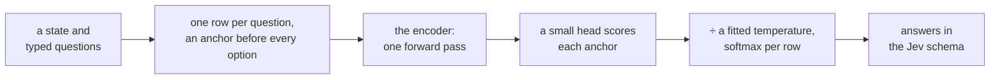

# sysone

> Jevify BERT-like encoders with sysone

sysone turns a pretrained encoder into a Jev-style typed-decision model: give it a state and typed questions (`choice`, `score`, `noul`) and get calibrated probabilities from one forward pass, over any option set named at request time. It packages the recipe [Laya](https://huggingface.co/convaiinnovations/laya) proved, an anchor token in front of every option, a small scorer on the anchors, proper-scoring-rule training and temperature calibration, as a fastai-shaped library: a one-line application API for the common case, and every layer below it reachable when the case is not common.

Every answer is read off the anchor rows and the schema is filled by code, so there is nothing to parse and no output tokens; k options are k anchors, so a trained model is zero-shot over new label sets; and several questions are several rows of one batch.



## The ten lines

```python
from sysone.text import TypedDecisions, decision_learner
from sysone import Decider, load_learner

data  = TypedDecisions.from_hub("LocalLLaMA/typed-decisions", valid="test")
learn = decision_learner(data, "answerdotai/ModernBERT-large", train="head")  # frozen encoder, cached features
learn.lr_find()                       # LR range test, suggests a value
learn.fit_one_cycle(4, lr=1e-3)       # warmup + cosine, head LR and encoder LR separately
learn.calibrate()                     # temperatures per type and option count, on the held-out slice
learn.predict(state, questions)       # the Jev answer schema from the model in memory, before any export
learn.export("my-jev")                # head + sysone.json (template, budgets, temperatures), and Laya's format when it applies

jev = Decider.load("my-jev")          # the same answers from the exported folder, on CPU, CUDA or MPS
jev.predict(state, questions)         # choice / score / noul, probabilities, confidence
learn = load_learner("my-jev", data)  # the learner back, on any machine: evaluate, interpret or train on
```

`train="lora"`, `"mica"` or `"full"` trains the encoder too; `decision_learner(data, "convaiinnovations/laya", init_from="convaiinnovations/laya", train="full")` fine-tunes Laya's own checkpoint as its notebook does; `sysone.multimodal` puts screenshots in the state, with ModernVBERT by default ([why](nbs/20_neomme.ipynb#which-encoder-by-default)) or with NeoMME (`decision_learner(data, "Hcompany/NeoMME-260M")`); `sysone.protein` asks typed questions about protein sequences with ProtST, zero-shot from its joint space or with a head trained on its frozen towers; `sysone.zeroshot` answers without training, from a two-tower model's similarity or a masked language model's own prediction; a GLiNER2 checkpoint is a text encoder like any other (with `head="gliner2"` and `init_from` set to the checkpoint, the head starts from its classifier), while `sysone.gliner` drives whole GLiNER2 models through their own package.

To see how good a model is, where it goes wrong and why: `metrics=[F1Score(), BalancedAccuracy()]` adds fastai-style metrics to what the learner reports every epoch ([metrics](nbs/04a_metrics.ipynb)); `Interpretation.from_learner(learn)` finds the worst decisions, the confusions and how confidence compares with being right; and `learn.explain(state, questions)` shows which tokens, pixels and residues moved each option's probability, by integrated gradients or by occlusion ([interpret](nbs/09a_interpret.ipynb), and the [interpretation tutorial](nbs/tutorials/08_interpretation.ipynb)).

To build a training set from data made for other models: converters turn classification, pair, rating and multi-label datasets into records ([datasets](nbs/08_datasets.ipynb)); `add_nouls`, `add_score`, `add_thresholds` and `add_none_of_these` ask one label in several shapes, and the `Nouls`, `NoneOfThese`, `AsScore`, `Thresholds` and `Rephrase` transforms draw those shapes anew every epoch, with one fixed draw for validation ([data](nbs/02_data.ipynb#one-label-several-questions)). The [reshaping tutorial](nbs/tutorials/09_reshaping_datasets.ipynb) does it for text, and the [game-log tutorial](nbs/tutorials/10_game_logs.ipynb) for the log of a system with rules.

To train elsewhere and keep track of it: `remote("train.ipynb", on="colab", hw="t4", data=..., push=...)` runs a notebook or a script as a job, in the background here or on Colab, Kaggle or SageMaker, on the hardware named (`cpu`, `t4x2`, `l4`, `tpu`, `trn1.2xlarge`, ...), and `jobs()` follows every job's progress in one table ([cloud](nbs/40_cloud.ipynb)). Every export carries a training record, the commit, packages, hardware, data and fits that made it ([record](nbs/05a_record.ipynb)); `learn.push_to_hub(repo)` publishes it with a model card written from that record ([hub](nbs/42_hub.ipynb)); `learn.track()` logs its training to MLflow ([track](nbs/44_track.ipynb)); `login("hf" | "kaggle" | "colab" | "aws")` signs in from a notebook ([auth](nbs/43_auth.ipynb)); and `deploy(export, on=...)` serves it in Docker or as a SageMaker endpoint, with `cloudformation` and `cdk_app` writing the infrastructure ([deploy](nbs/49_deploy.ipynb)). On TPUs and Trainium, the `tpu` and `neuron` presets keep XLA's graphs few ([xla](nbs/47_xla.ipynb)).

## What it answers

Three typed questions about one state, and the answers in the Jev schema. The model here is the fixture the notebooks test against, a random four-layer ModernBERT whose head trained for a few seconds, so its probabilities are close to uniform: what matters is the shape of the answers, one per question from one forward pass.

```python
import json, logging, tempfile
from pathlib import Path
logging.getLogger("transformers").setLevel(logging.ERROR)
from sysone.text import TypedDecisions, decision_learner
data = TypedDecisions.from_json("fixtures/typed_decisions_tiny.jsonl", valid=0.25)
learn = decision_learner(data, "fixtures/tiny-modernbert", train="head", preset="cpu", cache_dir=tempfile.mkdtemp())
learn.fit_one_cycle(3, lr=3e-3)
state = {"from": "user@acme.com", "body": "I was charged twice for invoice 4411 and I am cancelling if this is not fixed today."}
questions = {"department": {"type": "choice", "instructions": "Which department should handle this?",
                            "criteria": {"billing": "invoices, refunds", "technical": "bugs, outages"}},
             "urgency":    {"type": "score", "instructions": "How urgent is it?", "criteria": ["not urgent", "soon", "critical"]},
             "churn_risk": {"type": "noul", "instructions": "Does the user threaten to leave?"}}
learn.predict(state, questions)
```

```
{'department': {'type': 'choice',
  'choice': 'technical',
  'probabilities': {'billing': 0.4999, 'technical': 0.5001},
  'confidence': 0.0,
  'answer_confidence': 0.5001},
 'urgency': {'type': 'score',
  'score': 1.0002,
  'legend': {'0': 'not urgent', '1': 'soon', '2': 'critical'},
  'probabilities': {'0': 0.3333, '1': 0.3333, '2': 0.3334},
  'confidence': 0.0,
  'answer_confidence': 0.3334},
 'churn_risk': {'type': 'noul',
  'noul': 0.5,
  'confidence': 0.5,
  'answer_confidence': 0.5}}
```

## Validated so far

Measured between 2026-09-26 and 2026-10-01 on an M3 Pro (MPS, fp32), with the code in this repository:

| What | Result |
| --- | --- |
| Laya's published typed-decisions checkpoint, loaded with `Decider.load("convaiinnovations/laya/typed-decisions")`, on the 2,000 test decisions | **0.766 accuracy**, Laya's reported number; the same answer as `laya.Agent` on 200 of 200 compared decisions |
| Laya's multilingual checkpoint, `Decider.load("convaiinnovations/laya/multilingual")` (mmBERT's tokenizer, `<mask>` anchors, 1024-token rows) | the same probabilities as `laya.Agent` on 153 of 153 decisions, 30 test cases and a Spanish one |
| Head-only ModernBERT-large, frozen, anchors cached (the ten lines above) | 0.504 accuracy, below the dataset card's majority baseline (0.520): a frozen encoder never tuned for decisions carries little of the task. 12 minutes end to end, of which 58 s is training |
| Laya's general checkpoint, `convaiinnovations/laya`, zero-shot on the same test split | 0.362 accuracy: it was not trained on these four workflows |
| Laya's general encoder, frozen, under a new head (`decision_learner(data, "convaiinnovations/laya", train="head")`) | 0.560 accuracy, against ModernBERT-large's 0.504 under the same recipe: an encoder already trained on decisions gives a new head more to work with |
| GLiNER2.5-Decide's encoder, frozen, under a new head (`decision_learner(data, "fastino/GLiNER2.5-Decide")`) | 0.645 accuracy under the same recipe, the best frozen encoder measured so far; its own classifier, copied into the head with no training, scores 0.476 (the [text notebook's table](nbs/10_text.ipynb#regimes-on-the-laptop)) |
| Rows built by `RowBuilder` on Laya's template | token-for-token identical to Laya's `build_sequence` on every fixture row, on ModernBERT-large's tokenizer too |
| A sysone export in Laya's format | loads in `laya.Agent`, which returns the same answers; its logits match Laya's `DecisionModel` |
| RLCD | equal to the loss in Laya's fine-tuning notebook, pasted, under the same seed |
| NeoMME image rows | the image part, ids and two-axis positions, identical to NeoMME's processor |
| NeoMME-260M on real images, frozen, a head on its anchors | a 10-way digit choice from 100 MNIST images: 0.41 (chance 0.10), and 0.57 with the digits at 112 px; a hot-dog noul from 80 photos: 0.74 (chance 0.50); with LoRA, 0.33 and 0.72. Both took standardising NeoMME's vectors, and LoRA the plain scorer (the [images tutorial](nbs/tutorials/01_neomme_images.ipynb), with every output; the multimodal notebook, section 7) |
| ModernVBERT on the same images and recipes, frozen, a head on its anchors | the digit choice: 0.84, where NeoMME scored 0.31; the hot-dog noul: 0.94, where NeoMME scored 0.74; with LoRA on the text tower, 0.84 and 0.96. A probe on its image vectors reads 0.92 and 0.98 (the [ModernVBERT tutorial](nbs/tutorials/02_modernvbert_images.ipynb); the two encoders side by side in the [comparison](nbs/tutorials/03_neomme_vs_modernvbert.ipynb)) |
| ProtST-ESM1b loaded from its tensors alone (`sysone.protein`, no remote code), zero-shot on 600 DeepLoc test proteins | a 10-way location choice: 0.418 with ProtST's label texts as options, against 0.300 for the majority class, and 0.270 to 0.345 with other wordings; a membrane noul: 0.758, against 0.578 |
| The protein application: a pair head on ProtST's frozen towers, trained from vectors cached once for 1,200 proteins | 0.828 on the location choice, 0.906 on the membrane noul, 0.896 on four-way shortlists. At a 90% target, thresholds on the head's calibrated confidence act on 70% of the location questions, and the act head's on 57% (the [protein tutorial](nbs/tutorials/04_protein_decisions.ipynb), 13 minutes on the laptop) |
| GLiNER2.5-Decide zero-shot on Fastino's own benchmark (its published development split: 17 domains, 1,700 rows) | 0.629 over every head as the dataset card scores it (the card reports 0.602 on its hidden test split), 0.685 over the 26 single-label heads. sysone's GLiNER2 backend scores 0.693, and the encoder under the sysone head with the classifier copied in 0.684, giving the card's label on 95% of the decisions |
| Heads trained on half of each domain, scored on the other half | the copied classifier, trained: 0.684; a new head on the Decide encoder: 0.690; a new head on ModernBERT-large: 0.420 (the [GLiNER2.5-Decide tutorial](nbs/tutorials/05_gliner_decide.ipynb), 19 minutes on the laptop) |
| Web pages as text: Mind2Web's steps in JevForge's records, a 12-way element choice on 8 held-out websites, frozen encoders under a new head | NeoMME-260M 0.406, GLiNER2.5-Decide 0.393, ModernVBERT 0.384, ModernBERT-large 0.374, against 0.083 for guessing; GLiNER2's classifier, zero-shot, 0.244 (the [text tutorial](nbs/tutorials/06_web_text.ipynb), an hour on the laptop) |
| Web pages as screenshots: a pilot on 467 Multimodal-Mind2Web steps, 191 of them on 9 held-out websites | on the operation question, ModernVBERT with the screenshot 0.885 and NeoMME with it 0.812, against 0.801 for always CLICK; NeoMME without the screenshot 0.880. No head learned the 45-way element question from 276 steps: 0.14 to 0.21, against 0.12 for guessing (the [screens tutorial](nbs/tutorials/07_web_screens.ipynb), 32 minutes) |
| Interpreting the three applications (the [interpretation tutorial](nbs/tutorials/08_interpretation.ipynb), 17 minutes with warm feature caches) | emotions in tweets: LoRA on ModernBERT-large 0.768 accuracy and macro-F1 0.736, where the frozen default scores 0.453; digits 0.87 and hot dogs 0.938 with ModernVBERT; ProtST's location head 0.788, macro-F1 0.572. Integrated gradients' attributions added up for a tweet's answer, but not for the pixels or for one of two proteins, and its word scores correlated with occlusion's at a median of 0.21 |

Not yet run: the full fine-tune on Kaggle's T4 pair that reproduces Laya's notebook from its released checkpoint (written in the text notebook, launched with `sysone run`, which needs credentials), a full run of the screenshot comparison (the pilot's 276 training steps were too few to learn the element question), and the zero-shot suites.

## Install

```sh
pip install git+https://github.com/sgaseretto/sysonelib
```

Extras: `sysone[multimodal]` (pillow, torchvision, transformers ≥ 5.17 for NeoMME and ModernVBERT), `sysone[gliner]` (the `gliner2` package and peft, on the same transformers 5 as the rest), `sysone[browser]` (the Mind2Web converters), `sysone[shortlist]` (sentence-transformers), `sysone[serve]` (FastAPI), `sysone[laya]` (Laya's runtime, for its export-compatibility check), `sysone[cloud]` (the Kaggle and Colab CLIs; `uv tool install kaggle google-colab-cli` keeps them apart from the project), `sysone[mlflow]` (MLflow, for tracking and its local server), `sysone[aws]` (boto3 and the plugin for SageMaker's managed MLflow), `sysone[onnx]` (ONNX export of text models, served by `OnnxDecider` on onnxruntime), `sysone[plots]` (matplotlib, for the figures of `lr_find` and of the interpretations).

## How it is organised

| Layer | Modules | Holds |
| --- | --- | --- |
| Applications | `sysone.text`, `sysone.multimodal`, `sysone.protein` | `decision_learner` per kind of input, with the encoder's own defaults: text (ModernBERT-large by default; mmBERT, Laya's checkpoint, GLiNER2 checkpoints), images and text (ModernVBERT by default; NeoMME-260M), proteins (ProtST) |
| Encoder adapters | `sysone.multimodal` (NeoMME), `sysone.modernvbert`, `sysone.models` (GLiNER2's encoder) | the methods an encoder adds to sysone's generic functions (`processor_rows`, `default_image_side`, `prepare_processor`, `encoder_inputs`, `warm_start`), dispatched on its classes with plum |
| Backends | `sysone.zeroshot`, `sysone.gliner` | answers in the same schema without sysone's learner: zero-shot deciders (`SimilarityDecider`, `VerbalizerDecider`), and GLiNER2 through its own package |
| High-level | `sysone.data`, `sysone.learner`, `sysone.inference`, `sysone.evaluate`, `sysone.interpret` | `TypedDecisions`, `Learner` (`lr_find`, `fit`, `fit_one_cycle`, `freeze`, `calibrate`, `export`), `Decider`, evaluation, `Interpretation` and attributions (`explain`, `occlusion`) |
| Mid-level | `sysone.template`, `sysone.models`, `sysone.losses`, `sysone.metrics`, `sysone.cache`, `sysone.datasets` | `RowTemplate`, `RowBuilder`, transforms and side streams, `EncoderSpec`, `DecisionHead` (readouts, queries, the act head), stream encoders and cross-attention, regimes, soft CE and RLCD, temperatures, Laya's metrics and coverage, `Preds` and fastai-style metrics (`Metric`, `F1Score`, …), `FeatureCache`, converters |
| Operations | `sysone.record`, `sysone.hub`, `sysone.auth`, `sysone.track`, `sysone.cloud` with `sysone.colab`, `sysone.kaggle` and `sysone.aws`, `sysone.xla`, `sysone.deploy` | the training record in every export, publishing with a model card, logins, progress lines and MLflow, jobs on any backend and hardware (`remote`, `jobs`, `Local`, `Colab`, `Kaggle`, `SageMaker`, `CPU`, `GPU`, `TPU`, `Neuron`), XLA's fixed shapes and the Inferentia2 export, endpoints and infrastructure as code |
| Low-level | `sysone.core` | `Question` and its kinds (`Choice`, `Score`, `Noul`), `Answer`, `Row`, `Batch`, the answer schema's generic functions, sysone's dispatcher and `load_adapter` |

Around them: `sysone.cli` (`sysone train | eval | predict | serve | run | jobs | publish | login | whoami`).

Where behaviour depends on the kind of question or on the encoder, sysone uses generic functions: one name, a method per type, and the call picks the method that fits (multiple dispatch, with plum). The [core](nbs/00_core.ipynb#generic-functions-and-multiple-dispatch) notebook explains them from the ground up, with examples, and lists every one sysone has.

## Tutorials

- [NeoMME on images](nbs/tutorials/01_neomme_images.ipynb) trains the multimodal application on 100 MNIST digits (a 10-way choice) and 80 food photos (a hot-dog noul). Its outputs show every step: the rows the encoder reads and the image patches in them, the training curves, the answers image by image, and the confusions. It compares the default head, the linear head and LoRA, and measures what the image size changes.
- [ModernVBERT on images](nbs/tutorials/02_modernvbert_images.ipynb) runs the same two tasks on ModernVBERT, with the same records and recipes. Its outputs show the rows with the image as one 512-pixel tile of 64 image tokens, the three ways to train, the geometry of its vectors, and what more tiles change.
- [NeoMME and ModernVBERT, side by side](nbs/tutorials/03_neomme_vs_modernvbert.ipynb) trains both encoders on identical inputs, and compares their accuracy, calibration and cost, and where each one is wrong.
- [ProtST as a decision model](nbs/tutorials/04_protein_decisions.ipynb) asks three typed questions about each of 600 held-out proteins: a 10-way location choice, a membrane noul, and a four-way shortlist that lacks the right answer a third of the time. It answers them zero-shot with ProtST, comparing four ways to write the options. Then it trains a head on the frozen towers from 1,200 proteins and compares the two, compartment by compartment. It ends with when to act and when to escalate: Laya's act head against thresholds on the head's own confidence.
- [GLiNER2.5-Decide under the sysone head](nbs/tutorials/05_gliner_decide.ipynb) runs Fastino's decision model on its own benchmark three ways: as the dataset card scores it, through sysone's GLiNER2 backend, and with its encoder under the sysone head and its classifier copied in. It measures how closely they agree before any training, then trains heads on half of each domain and scores them on the other half, beside a new head on ModernBERT-large. On the way, it shows why a learning rate suggested by `lr_find` needs a look at its curve.
- [Web pages as text](nbs/tutorials/06_web_text.ipynb) takes Mind2Web's browser steps in JevForge's ready-made records, a choice among 12 page elements on websites the heads never saw. It compares four frozen encoders under the same head: ModernBERT-large, GLiNER2.5-Decide's encoder, and the multimodal application's NeoMME and ModernVBERT reading text alone.
- [Web pages as screenshots](nbs/tutorials/07_web_screens.ipynb) is a pilot on Multimodal-Mind2Web, 467 browser steps with their screenshots, streamed as 0.5 GB of a 13.6 GB set. It asks whether NeoMME or ModernVBERT reads the pages better and whether the screenshot helps at all. It explains how the rows were chosen, the crop and the row budgets, and what a full run would need.
- [Interpreting decisions](nbs/tutorials/08_interpretation.ipynb) trains the three applications on small tasks and looks inside each: emotions in tweets (the text application, with LoRA), handwritten digits and photos of hot dogs (the multimodal application), and where in the cell a protein lives (ProtST). It reports metrics beyond accuracy, finds the confusions and the confident mistakes, and compares how sure the answers are with how often they are right. Then it attributes answers to words, pixels and residues, by integrated gradients and by occlusion, checks the two against each other, and pools occlusion over many decisions to show what a model has learned: the words of each emotion, and a mitochondrial targeting presequence.
- [Reshaping datasets](nbs/tutorials/09_reshaping_datasets.ipynb) turns datasets made for other models into typed decisions, and asks each label in more than one shape: AG News's topics as a choice and as a statement per topic, restaurant reviews' aspects (several per review) as statements and their sentiment as a choice, a score and two thresholds, and MASSIVE's intents with their scenario as a second question and a third of them held out for a zero-shot test. It counts how many statements are true, softens labels that overlap, adds questions none of whose options is right, and draws statements and wordings anew every epoch, with one fixed draw for validation. Nothing is trained; the training runs are exercises.
- [Decisions from game logs](nbs/tutorials/10_game_logs.ipynb) turns 1,160 logged tic-tac-toe moves into about 27 questions each: what was played, what the rules allow, what a perfect player would do, and how the game ends. It pools boards logged more than once into shares of the moves played, adds each board's symmetric twins, and splits by board so that no twin crosses from training to validation. It runs in seconds, downloads nothing, and leaves the training runs as exercises.

## Reading the notebooks

Read in order, the notebooks build the library up from its core, and each one explains its part with flow charts and with tensor diagrams drawn from the library's own tensors (the [figures](nbs/90_figures.ipynb) notebook draws them). Where the first implementation was wrong, or a reference implementation misbehaves, a *Finding* note says what happened, next to the evidence and the fix:

| Finding | Where |
| --- | --- |
| Laya's temperature fitter returns NaN on an underconfident model: LBFGS without a line search takes a secant step of −1,812 in log T at an inflection point | [losses](nbs/04_losses.ipynb#fitting-one) |
| RLCD's noise pulls its optimum towards distributions sharper than the gold, in proportion to σ², which is why σ is annealed | [losses](nbs/04_losses.ipynb#what-the-pieces-do) |
| A split by rows puts every held-out row's state in training; sysone splits by case | [data](nbs/02_data.ipynb#splits-by-case) |
| Laya's multilingual checkpoint anchors on `<mask>`, not `[MASK]` | [template](nbs/01_template.ipynb#laya-parity) |
| BERT's LoRA target names match nothing in ModernBERT, and a plain `Wo` would also match its MLP | [models](nbs/03_models.ipynb#regimes) |
| Unfreezing thawed the matrices MiCA keeps frozen | [models](nbs/03_models.ipynb#regimes) |
| A new `TrainingArguments` resets the accelerator of a live Trainer | [learner](nbs/05_learner.ipynb#running-the-trainer) |
| With length grouping, the Trainer shuffles evaluation rows too | [learner](nbs/05_learner.ipynb#predictions-and-metrics) |
| An export after `freeze` dropped the trained encoder; bf16 checkpoints were served in bf16 | [inference](nbs/06_inference.ipynb#laya-compatibility) |
| A sampled weights fingerprint misses most weight changes; the first cache served stale labels | [cache](nbs/07_cache.ipynb#the-key) |
| NeoMME's processor cannot build a decision row; what else did not work | [multimodal](nbs/20_neomme.ipynb#what-did-not-work-and-what-to-watch) |
| One channel carries 97% of NeoMME's vector norms: heads barely learned until they standardised their input, and LoRA with Laya's two-layer head collapsed on small tasks | [multimodal](nbs/20_neomme.ipynb#two-small-image-tasks-on-the-real-checkpoint) |
| A float16 feature cache quantises that channel, so `validate` and the `Decider` disagreed on the same model's calibration | [multimodal](nbs/20_neomme.ipynb#a-head-only-run) |
| ModernVBERT's processor enlarges every image to 2,048 px, so a 28-px digit takes 17 tiles and 1,127 tokens; at 1,536 px, a batch of 8 rows is 80 tiles, and it held 8 GB of GPU memory | [modernvbert](nbs/23_modernvbert.ipynb#a-head-only-run) |
| ModernVBERT's anchors have a dominant channel too, 58% of each vector's length, and standardising them lifts the digits from 0.67 to 0.84 | [ModernVBERT tutorial](nbs/tutorials/02_modernvbert_images.ipynb#does-modernvbert-need-standardising) |
| NeoMME reads MNIST digits better at 56–112 px than at 224, and a seeded split of stock photos leaves shoots on both sides | [images tutorial](nbs/tutorials/01_neomme_images.ipynb#one-more-setting-the-image-size) |
| The published Mind2Web converter misses ARIA labels, field values and `<select>` labels | [screens](nbs/21_screens.ipynb) |
| ProtST-BinaryLocalization labels membrane-bound proteins 0, which its card doesn't say | [protein tutorial](nbs/tutorials/04_protein_decisions.ipynb#the-data) |
| An embedder built on the spot switched ProtST's shared text tower into training mode, and peft needs a `base_model_prefix` on a stream encoder | [protein](nbs/22_protein.ipynb#zero-shot) |
| Laya's act head, trained on the rows the option head fits, ranked answers worse than the head's own confidence, and one threshold for every question acted on no shortlist | [protein tutorial](nbs/tutorials/04_protein_decisions.ipynb#acting-or-escalating) |
| `gliner2` refuses an empty instruction, so the GLiNER2 backend stopped on questions without one; fixed, a question sent on its own gets the benchmark card's answer on all 2,600 decisions | [gliner backend](nbs/31_gliner_backend.ipynb#glinerdecider) |
| `lr_find`'s valley for the same new head on the same 850 rows was 1.4e-6 with one batch order and 6.6e-4 with another | [GLiNER2.5-Decide tutorial](nbs/tutorials/05_gliner_decide.ipynb#how-fast-to-train) |
| Tiled images shrank a cached head's training batch as well, so a sweep of image sizes compared batches of four rows with batches of one | [modernvbert](nbs/23_modernvbert.ipynb#a-head-only-run) |
| Image rows lost their case ids in the feature cache, so a per-case look at a multimodal learner's predictions put every row under one empty id | [cache](nbs/07_cache.ipynb#featurecache) |
| A Mind2Web question needs up to 1,500 tokens, so the multimodal presets cut each of 45 options to 8 tokens, and the screenshots are whole pages up to 40,000 pixels tall | [screens](nbs/21_screens.ipynb#on-real-rows) |
| A batch of integrated-gradient steps went through a side encoder as one row, since a side encoder encodes each distinct input once | [interpret](nbs/09a_interpret.ipynb#integrated-gradients) |
| Integrated gradients' attributions didn't add up on the real encoders: on frozen ModernBERT-large an option's log-probability is jagged along the line, and even 2,049 exact gradients miss its change by nats; through ModernVBERT's pixels and ESM's residues, the sums missed by a sixth to more than the whole change | [interpret](nbs/09a_interpret.ipynb#how-far-to-trust-an-attribution) |
| A protein's attribution held 20 GB, with eight integrated-gradient steps through ESM-1b at once; `attribute` now measures what a step keeps and batches to 2 GB | [interpret](nbs/09a_interpret.ipynb#how-far-to-trust-an-attribution) |
| The Colab CLI writes the code of every `colab exec`, its `--env` values included, to a local history file, so a token passed that way would sit there in plain text; jobs send secrets as an uploaded file instead | [colab](nbs/45_colab.ipynb) |
| MLflow 3.16's file store refuses to log, and a SQLite store puts artifacts in `./mlruns` under the current folder; sysone keeps them beside the database | [track](nbs/44_track.ipynb#mlflow) |
| floci runs SageMaker's training jobs and endpoints in Docker, but a training job's `Environment` does not reach the container and only `/opt/ml/model` is uploaded; jobs carry their settings in `job.json`, and their outputs in the model on an emulator | [aws](nbs/48_aws.ipynb) |
| The SageMaker Python SDK as an extra downgraded `rich` and `importlib-metadata` for every install, since `uv` locks one version for all extras; the SDK is installed beside sysone when wanted | [aws](nbs/48_aws.ipynb#with-the-sagemaker-python-sdk) |
| On Docker Desktop, the SageMaker SDK's local mode lost the model a job wrote: it mounts a folder it has not made, which Docker Desktop then makes inside its VM; `model_trainer` makes the folders first | [aws](nbs/48_aws.ipynb#with-the-sagemaker-python-sdk) |
| Compiling for Inferentia2 without the hardware needed the Neuron runtime library (from AWS's apt repository, not pip), `islpy==2026.1` (the compiler's `islpy~=2026.1` lets pip take a version that breaks it) and `libarchive`; with them, the tiny model compiles for `inf2` in a Linux container | [xla](nbs/47_xla.ipynb#inferentia2) |
| On PyTorch/XLA, transformers' default optimizer (the fused AdamW) has no kernel, and the loss's skipping of unanswerable rows stopped the graph at every step; the `tpu` and `neuron` presets use the unfused AdamW, and with every row answerable the loss runs on whole batches: the tiny model's second epoch compiled nothing new | [xla](nbs/47_xla.ipynb) |
| The Kaggle CLI decodes a kernel's live log as Latin-1, so every `█` of a progress bar arrived as `â` and two invisible characters; written back out as Latin-1, the log is UTF-8 again | [kaggle](nbs/46_kaggle.ipynb) |
| One poll's `colab exec` stayed connected for over two minutes, past its own timeout, on a VM busy training; a poll now gives up after 240 s, and `wait` polls again after a failed poll | [colab](nbs/45_colab.ipynb) |
| A Colab poll fetched a job's outputs while the runner was still packing them, and brought back 773 KB of a 59 MB head; the runner now renames the tarball into place when it is whole | [colab](nbs/45_colab.ipynb) |
| A `Decider` pickled as fastai pickles its learner, under transformers 5.17, would not load under Kaggle's 5.0, and a sysone learner cannot be pickled at all; `load_learner` rebuilds the learner from the export, which loaded under both | [inference](nbs/06_inference.ipynb#load_learner) |
| transformers 5.17's Trainer passes `every_n_layers` and `offload` to gradient checkpointing, which sysone's model refused, so every GPU preset stopped as training started on Colab's T4 | [models](nbs/03_models.ipynb) |
| On two GPUs, every process printed each progress line and wrote the export | [track](nbs/44_track.ipynb) |
| transformers drops the last partial batch of evaluation too: the `tpu` preset left up to 31 rows out of every metric, and the fixture's calibration split made no batch at all | [learner](nbs/05_learner.ipynb) |
| pip keeps an installed sysone of the same version, so a job on a SageMaker image would have run the image's code; uv replaces it | [cloud](nbs/40_cloud.ipynb) |
| A row built on read took its question from the case before the transforms ran, so no transform could add a question, and with `Shuffle` 10 of the fixture's 100 rows differed from the static build at epoch 0 | [data](nbs/02_data.ipynb#lazy-rows) |
| fast-decisions' restaurant reviews have aspects marked wrong: one describes a burger and is marked as not talking about the food | [reshaping tutorial](nbs/tutorials/09_reshaping_datasets.ipynb#several-labels-at-once) |

## Developer guide

sysone is written as [nbdev](https://nbdev.fast.ai/) notebooks: `nbs/` is the source, `sysone/` is generated by `nbdev-export` and never edited by hand, and the notebooks' examples are the test suite, run against tiny fixtures (`nbs/fixtures/`) so the whole suite runs offline on a CPU.

```sh
uv sync                               # the environment, with the package installed editable
uv run nbdev-export                   # notebooks -> sysone/
uv run nbdev-test --n-workers 4       # every notebook, top to bottom
uv run nbdev-clean                    # before committing
```

Cells marked `#| eval: false` need a GPU, a download or a network; the results of their last real run are pasted below them. Cells that need an account, Docker or other hardware carry a flag, and `nbdev-test` skips them unless it is given that flag: `hub`, `kaggle` and `colab` (a login), `mlflow` (a local MLflow server), `floci` (Docker, with floci and sysone's image), `xla` (Docker, a Linux container with torch_xla), `neuron` (the Neuron SDK), `sagemaker` (the SageMaker Python SDK). For example, `uv run nbdev-test --flags floci nbs/48_aws.ipynb`.

The tensor diagrams are SVG files in `nbs/images/`, drawn by `nbs/90_figures.ipynb` from the library's own functions with [tensordiagram](https://github.com/hardik-vala/tensordiagram); running that notebook (the test suite does) redraws them, byte for byte when nothing changed. The flow charts are [Mermaid](https://mermaid.js.org/) text in the markdown cells, which Quarto renders. The docs site builds with Quarto, which comes as a Python wheel in the `docs` group:

```sh
uv sync --group docs
uv run nbdev-docs                     # the site in _docs/; nbdev-preview serves it while you edit
```

nbdev's docs build re-runs every cell that imports something, in a fresh kernel that skips the others, so keep imports in cells of their own: a cell that imports and also uses a name from an earlier cell breaks the build.
