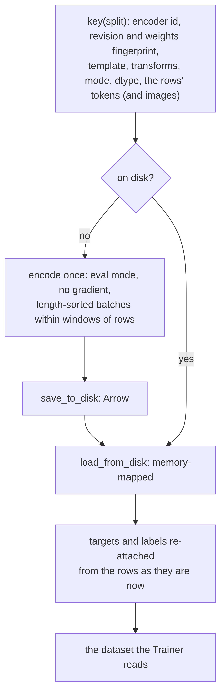

# cache


<!-- WARNING: THIS FILE WAS AUTOGENERATED! DO NOT EDIT! -->

With the encoder frozen, its output for a row never changes, so running
it every epoch is waste. The head-only regime runs it once: `masks` mode
stores the vectors at the anchors, k × width per row, which is all a
head without layers reads; `rows` mode stores the whole output, for the
two-layer head. The cache is an Arrow dataset on disk, memory-mapped
when read, keyed by everything the encoder’s outputs depend on: the
encoder (id, revision and a fingerprint of its weights), the template
and transforms, the rows’ tokens, and for image rows the images
themselves; a second run with the same encoder starts from it and any of
these changes rebuilds it. The gold is not part of the key: targets and
labels are read from the current rows every time, so correcting a label
never costs an encoder pass and never serves the old one. Option
shuffling and text augmentation are off while a cache is in use: its
rows are static.

How `features` serves a split:

<div>

<figure class=''>

<div>



</div>

</figure>

</div>

And what each mode keeps of one row:

<figure>

<figcaption aria-hidden="true">The encoder’s output for one row, and the
anchor vectors a masks cache keeps</figcaption>
</figure>

*Drawn in [figures](90_figures.ipynb#what-a-feature-cache-stores).*

``` python
FIX = "fixtures/tiny-modernbert"
recs = [json.loads(l) for l in Path("fixtures/typed_decisions_tiny.jsonl").read_text().splitlines()]
data = TypedDecisions.from_json("fixtures/typed_decisions_tiny.jsonl", valid=0.25, calib=0.25)
torch.manual_seed(0)
learn = sysone.learner.decision_learner(data, FIX, train="head", head="mlp", preset="cpu", loss="soft_ce")
learn
```

    Learner(fixtures/tiny-modernbert · regime head · head 0 layers/laya · cache None · loss soft_ce · 4,545 of 275,457 params train)

## The key

------------------------------------------------------------------------

<a
href="https://github.com/sgaseretto/sysonelib/blob/main/sysone/cache.py#L48"
target="_blank" style="float:right; font-size:smaller">source</a>

### images_fingerprint

``` python
def images_fingerprint(
    cases, keys:tuple=('image',)
)->str:
```

*A digest of the images a split’s states hold: each file’s path, size
and modification time, or the inline bytes*

------------------------------------------------------------------------

<a
href="https://github.com/sgaseretto/sysonelib/blob/main/sysone/cache.py#L40"
target="_blank" style="float:right; font-size:smaller">source</a>

### rows_fingerprint

``` python
def rows_fingerprint(
    rows
)->str:
```

*A digest of the rows’ ids, markers and types, and each side stream’s
ids*

------------------------------------------------------------------------

<a
href="https://github.com/sgaseretto/sysonelib/blob/main/sysone/cache.py#L30"
target="_blank" style="float:right; font-size:smaller">source</a>

### weights_fingerprint

``` python
def weights_fingerprint(
    module:torch.nn.modules.module.Module
)->str:
```

*A digest of a module’s weights from every tensor’s shape, sum and sum
of squares (one pass, no copies kept)*

------------------------------------------------------------------------

<a
href="https://github.com/sgaseretto/sysonelib/blob/main/sysone/cache.py#L26"
target="_blank" style="float:right; font-size:smaller">source</a>

### default_cache_dir

``` python
def default_cache_dir()->pathlib.Path:
```

*`SYSONE_CACHE`, else `~/.cache/sysone/features`*

``` python
enc_fp, rows_fp = weights_fingerprint(learn.model.encoder), rows_fingerprint(data.rows("train"))
test_eq(weights_fingerprint(learn.model.encoder), enc_fp)
test_ne(weights_fingerprint(torch.nn.Linear(3, 3)), enc_fp)
enc_fp, rows_fp
```

    ('1497513b9f787829', '672e788b2c9e4af1')

<div>

> **Finding: a sampled fingerprint misses most weight changes**
>
> The first
> [`weights_fingerprint`](https://sgaseretto.github.io/sysonelib/cache.html#weights_fingerprint)
> hashed the parameter count and the first 4,096 values of the first,
> middle and last tensors, which is cheap, and blind to everything else:
> nudging a norm inside the encoder left the key unchanged, so the cache
> would have served features of the old weights. It now digests every
> tensor’s name, shape, sum and sum of squares, one pass over the
> weights with no copies kept:

</div>

``` python
def sampled_fingerprint(module):
    "The first version: the parameter count and the first 4,096 values of the first, middle and last tensors"
    ps = list(module.parameters())
    h = hashlib.sha1(str(sum(p.numel() for p in ps)).encode())
    for p in (ps[0], ps[len(ps) // 2], ps[-1]): h.update(p.detach().float().flatten()[:4096].numpy().tobytes())
    return h.hexdigest()[:16]

enc = learn.model.encoder
before = sampled_fingerprint(enc), weights_fingerprint(enc)
enc.embeddings.norm.weight.data += 0.01
after = sampled_fingerprint(enc), weights_fingerprint(enc)
enc.embeddings.norm.weight.data -= 0.01
test_eq(after[0], before[0]); test_ne(after[1], before[1])
{"sampled": (before[0], after[0]), "every tensor": (before[1], after[1])}
```

    {'sampled': ('d4e2c143bd1f6c2e', 'd4e2c143bd1f6c2e'),
     'every tensor': ('1497513b9f787829', 'cfa0b5288824b5ca')}

## FeatureCache

------------------------------------------------------------------------

<a
href="https://github.com/sgaseretto/sysonelib/blob/main/sysone/cache.py#L63"
target="_blank" style="float:right; font-size:smaller">source</a>

### FeatureCache

``` python
def FeatureCache(
    model:sysone.models.EncoderDecisionModel, # its encoder is run; it must be frozen
    data:sysone.data.TypedDecisions, # bound data; the rows to encode
    mode:str='masks', # 'masks' (k × width per row) or 'rows' (n_tokens × width per row)
    cache_dir:NoneType=None, # default_cache_dir() when None
    batch_size:int=16, # rows per encoder pass
    dtype:str='float16', # storage dtype
):
```

*Encoder outputs at the anchors (`masks`) or at every position (`rows`),
computed once, stored as memory-mapped Arrow*

------------------------------------------------------------------------

<a
href="https://github.com/sgaseretto/sysonelib/blob/main/sysone/cache.py#L79"
target="_blank" style="float:right; font-size:smaller">source</a>

### FeatureCache.key

``` python
def key(
    split:str
)->str:
```

*The cache key of a split: everything the encoder’s outputs depend on*

`_encode` runs the encoder in eval mode over the rows and yields each
row with its features: its k option vectors (read the way the head reads
them, at the anchors or as span means), or the vectors at its n tokens.
A head that reads more gets it cached too: a side stream’s pooled vector
(`query`) and the row’s first position (`first`, for an act head).
Within a window of rows it batches them by length, so little of each
batch is padding, and moves each batch’s features off the device in one
transfer; rows still come out in their original order. A side stream (a
protein that several questions ask about) is encoded once for the whole
pass, under
[`stream_memo`](https://sgaseretto.github.io/sysonelib/models.html#stream_memo),
although its rows fall into different batches. Before the pass,
`_prefill_streams` encodes the distinct stream inputs sorted by their
own length. A batch of rows sorted by text length can hold proteins of
any length, and every one of them would be padded to the longest, so the
stream is filled in first, in batches of similar lengths. `features`
returns the cached dataset, computing it on the first call:

------------------------------------------------------------------------

<a
href="https://github.com/sgaseretto/sysonelib/blob/main/sysone/cache.py#L157"
target="_blank" style="float:right; font-size:smaller">source</a>

### FeatureCache.features

``` python
def features(
    split:str='train'
)->datasets.arrow_dataset.Dataset:
```

*The split’s rows with their cached features (computed on first use)*

``` python
cdir = Path(tempfile.mkdtemp())
fc = FeatureCache(learn.model, data, "masks", cache_dir=cdir)
t0 = time.time(); tr = fc.features("train"); first = time.time() - t0
t0 = time.time(); tr2 = fc.features("train"); second = time.time() - t0
tr, round(first, 3), round(second, 3)
```

    (Dataset({
         features: ['input_ids', 'markers', 'qtype', 'n_tokens', 'anchors', 'target', 'label', 'answerable', 'case', 'qid', 'case_idx', 'variant'],
         num_rows: 55
     }),
     0.114,
     0.042)

``` python
test_eq(len(tr), len(data.rows("train")))
test_eq([list(x) for x in tr["input_ids"]], data.rows("train")["input_ids"])      # length-sorted batches, original order
test_eq(tr[0]["anchors"].shape, (len(tr[0]["markers"]), learn.model.head.width))
test_eq(len(list(cdir.iterdir())), 1)    # the second call re-used the first's files
```

The cached anchors are exactly what the encoder gives at the markers, so
a head without layers scores them as it scores the live encoder’s output
(up to the float16 storage):

``` python
b = collate([tr[i] for i in range(6)], 3)
live = learn.model(**{k: v for k, v in b.items() if k not in ("anchors", "target", "label")})
cached = learn.model(**{k: v for k, v in b.items() if k not in ("target", "label")})
test_close(cached, live, eps=2e-2)
```

Changing the template changes the key, and so does training the encoder:

``` python
k0 = fc.key("train")
learn.model.encoder.embeddings.norm.weight.data += 0.01
test_ne(fc.key("train"), k0)
learn.model.encoder.embeddings.norm.weight.data -= 0.01
test_eq(fc.key("train"), k0)
```

<div>

> **Finding: the first cache served stale labels**
>
> The key leaves the gold out on purpose, since correcting a label
> should not cost an encoder pass. But the first cache also kept the
> targets it was built with, so a corrected label kept serving the old
> one. `features` now reads targets and labels from the current rows
> every time it opens a cache.

</div>

<div>

> **Finding: image rows lost their ids in the cache**
>
> Rows built on read (image rows, and rows with per-epoch augmentation)
> came back without the case, question and position the static rows
> carry, so a cache filled from image rows stored empty ids. Metrics
> were unaffected, since they read the gold and not the ids. But a
> per-case look at a multimodal learner’s cached predictions found every
> row under one empty id, and the [screens
> tutorial](tutorials/web_screens.ipynb)’s first run stopped on it.
> [`LazyRows`](https://sgaseretto.github.io/sysonelib/data.html#lazyrows)
> now returns the ids with each row. `features` also refreshes them from
> the current rows along with the gold, which repairs caches filled
> before the fix.

</div>

Changing the gold keeps the key, and the cache serves the new targets:

``` python
has_stop = lambda r: "stop" in r["questions"].get("action", {}).get("criteria", {})
relabel = [dict(r, gold={**r["gold"], "action": {"label": "stop"}}) if has_stop(r) else r for r in recs]
d2 = TypedDecisions.from_records(relabel[:15], valid=relabel[15:], calib=0).bind(learn.data.builder.tok, "laya")
d1 = TypedDecisions.from_records(recs[:15], valid=recs[15:], calib=0).bind(learn.data.builder.tok, "laya")
f1, f2 = FeatureCache(learn.model, d1, "masks", cache_dir=cdir), FeatureCache(learn.model, d2, "masks", cache_dir=cdir)
test_eq(f1.key("train"), f2.key("train"))
old, new = f1.features("train"), f2.features("train")
i = new["qid"].index("action")
test_eq((old["label"][i] != 3, new["label"][i], list(new["target"][i])), (True, 3, [0.0, 0.0, 0.0, 1.0]))
```

## Training from the cache

A learner made with `cache="masks"` trains from the cached anchors: its
datasets are the cached features, and the encoder never runs after the
first pass. `cache="rows"` does the same for a head with layers.

``` python
torch.manual_seed(0)
lc = sysone.learner.decision_learner(data, FIX, train="head", cache="masks", preset="cpu", loss="soft_ce", cache_dir=cdir)
t0 = time.time(); lc.fit_one_cycle(3, lr=3e-3); cached_time = time.time() - t0
lc.recorder.metrics[-1]["accuracy"], round(cached_time, 2)
```

    {'eval_loss': '1.191', 'eval_accuracy': '0.2', 'eval_soft_accuracy': '0.3767', 'eval_brier': '0.26', 'eval_kl': '0.4434', 'eval_tv': '0.366', 'eval_ece': '0.124', 'eval_score_mae': '0.838', 'eval_within_one': '0.6', 'eval_n': 25, 'eval_accuracy_choice': '0.1429', 'eval_accuracy_score': '0.2', 'eval_accuracy_noul': '0.25', 'eval_n_unanswerable': 0, 'eval_runtime': '0.0047', 'eval_samples_per_second': '5336', 'eval_steps_per_second': '426.9', 'epoch': '1'}
    {'loss': '1.233', 'grad_norm': '0.0003667', 'learning_rate': '0.002714', 'epoch': '1.429'}
    {'eval_loss': '1.191', 'eval_accuracy': '0.24', 'eval_soft_accuracy': '0.3767', 'eval_brier': '0.26', 'eval_kl': '0.4434', 'eval_tv': '0.366', 'eval_ece': '0.08404', 'eval_score_mae': '0.838', 'eval_within_one': '0.6', 'eval_n': 25, 'eval_accuracy_choice': '0', 'eval_accuracy_score': '0.4', 'eval_accuracy_noul': '0.25', 'eval_n_unanswerable': 0, 'eval_runtime': '0.0043', 'eval_samples_per_second': '5812', 'eval_steps_per_second': '464.9', 'epoch': '2'}
    {'loss': '1.21', 'grad_norm': '0.0002659', 'learning_rate': '0.0001297', 'epoch': '2.857'}
    {'eval_loss': '1.191', 'eval_accuracy': '0.28', 'eval_soft_accuracy': '0.3767', 'eval_brier': '0.26', 'eval_kl': '0.4434', 'eval_tv': '0.366', 'eval_ece': '0.04404', 'eval_score_mae': '0.838', 'eval_within_one': '0.6', 'eval_n': 25, 'eval_accuracy_choice': '0', 'eval_accuracy_score': '0.4', 'eval_accuracy_noul': '0.375', 'eval_n_unanswerable': 0, 'eval_runtime': '0.0044', 'eval_samples_per_second': '5730', 'eval_steps_per_second': '458.4', 'epoch': '3'}
    {'train_runtime': '0.0622', 'train_samples_per_second': '2652', 'train_steps_per_second': '337.6', 'train_loss': '1.23', 'epoch': '3'}

    (0.28, 0.37)

``` python
test_eq(lc.model.head.layers, 0)
test_eq("anchors" in lc.dataset("train").column_names, True)
test_eq(len(lc.recorder.metrics), 3)
lr_ = sysone.learner.decision_learner(data, FIX, train="head", cache="rows", preset="cpu", loss="soft_ce", cache_dir=cdir)
lr_.fit(1, lr=1e-3)
test_eq("hidden" in lr_.dataset("train").column_names, True)
```

    {'eval_loss': '1.191', 'eval_accuracy': '0.32', 'eval_soft_accuracy': '0.3767', 'eval_brier': '0.26', 'eval_kl': '0.4434', 'eval_tv': '0.366', 'eval_ece': '0.08401', 'eval_score_mae': '0.838', 'eval_within_one': '0.6', 'eval_n': 25, 'eval_accuracy_choice': '0.1429', 'eval_accuracy_score': '0.2', 'eval_accuracy_noul': '0.625', 'eval_n_unanswerable': 0, 'eval_runtime': '0.0161', 'eval_samples_per_second': '1555', 'eval_steps_per_second': '124.4', 'epoch': '1'}
    {'train_runtime': '0.1942', 'train_samples_per_second': '283.1', 'train_steps_per_second': '36.04', 'train_loss': '1.229', 'epoch': '1'}

A head that reads more than the anchors gets it cached beside them: here
an act head (the row’s first position is cached as `first`) over span
readouts, which train from the cache and score it exactly as the live
encoder’s output:

``` python
torch.manual_seed(0)
la = sysone.learner.decision_learner(data, FIX, train="head", cache="masks", preset="cpu", loss="soft_ce", cache_dir=cdir,
                                     act=True, readout="span", calibrate_after_fit=False)
la.fit(1, lr=1e-3)
ca = la.dataset("train")
test_eq(("first" in ca.column_names, ca[0]["first"].shape), (True, (la.model.head.width,)))
live = FeatureCache(la.model, data, "masks", cache_dir=Path(tempfile.mkdtemp())).key("train")
test_ne(live, FeatureCache(lc.model, data, "masks", cache_dir=cdir).key("train"))          # other vectors, another key
la.model.eval()
b = collate([data.rows("valid")[i] for i in range(4)], data.builder.tok.pad_token_id)
with torch.no_grad():
    lz, az = la.model(**{k: v for k, v in b.items() if k not in ("target", "label")})
    cv = la.dataset("valid")
    cz, caz = la.model(**{k: v for k, v in collate([cv[i] for i in range(4)]).items() if k not in ("target", "label")})
test_close(cz, lz, eps=1e-2); test_close(caz, az, eps=1e-2)
test_fail(lambda: sysone.learner.decision_learner(data, FIX, train="head", cache="masks", head="linear", act=True, preset="cpu",
                                                  cache_dir=cdir).fit_linear(), contains="alone")
```

    {'eval_loss': '1.52', 'eval_accuracy': '0.32', 'eval_soft_accuracy': '0.3753', 'eval_brier': '0.2634', 'eval_kl': '0.4492', 'eval_tv': '0.3658', 'eval_ece': '0.1037', 'eval_score_mae': '0.8417', 'eval_within_one': '0.6', 'eval_n': 25, 'eval_accuracy_choice': '0.1429', 'eval_accuracy_score': '0.2', 'eval_accuracy_noul': '0.625', 'eval_n_unanswerable': 0, 'eval_act_auroc': '0.6985', 'eval_act_brier': '0.2267', 'eval_runtime': '0.0056', 'eval_samples_per_second': '4446', 'eval_steps_per_second': '355.7', 'epoch': '1'}
    {'train_runtime': '0.0281', 'train_samples_per_second': '1960', 'train_steps_per_second': '249.4', 'train_loss': '1.6', 'epoch': '1'}

Unfreezing sets the cache aside, since features of a frozen encoder go
stale once it trains, and freezing brings it back:

``` python
lc.unfreeze()
test_eq((lc.cache, lc.model.frozen), (None, False))
lc.freeze()
test_eq(lc.cache, "masks")
```

## The linear head

SetFit’s recommended head is a logistic regression fitted on frozen
embeddings, in seconds on a CPU. Its counterpart here is
`head="linear"`: one weight vector shared by every anchor,
*z*<sub>*i*</sub> = *w*<sup>⊤</sup>*h*<sub>*m*<sub>*i*</sub></sub> + *b*,
softmaxed across the row, fitted on all cached training rows at once by
LBFGS on the soft cross-entropy, with an L2 penalty, and no
backpropagation through anything but the scorer. Features are
standardised for the fit and the standardisation is folded back into the
weights, so the result is a plain `Linear` scorer. It is the first
baseline a run can report, and a check that the cache holds what the
head needs.

------------------------------------------------------------------------

<a
href="https://github.com/sgaseretto/sysonelib/blob/main/sysone/cache.py#L195"
target="_blank" style="float:right; font-size:smaller">source</a>

### Learner.fit_linear

``` python
def fit_linear(
    l2:float=0.001, max_iter:int=200
)->dict:
```

*Fit a linear scorer on the cached anchors by LBFGS (needs cache=‘masks’
and head=‘linear’)*

``` python
torch.manual_seed(0)
llin = sysone.learner.decision_learner(data, FIX, train="head", head="linear", cache="masks", preset="cpu", cache_dir=cdir)
fit = llin.fit_linear()
fit, llin.validate()
```

    ({'train_loss': 0.9562579989433289, 'seconds': 0.06},
     {'accuracy': 0.44,
      'soft_accuracy': 0.408012961289173,
      'brier': 0.3349677548258288,
      'kl': 0.684707086938573,
      'tv': 0.3746062292806761,
      'ece': 0.27436781583365943,
      'score_mae': 0.6895297660196107,
      'within_one': 0.7,
      'n': 25,
      'accuracy_choice': 0.5714285714285714,
      'accuracy_score': 0.2,
      'accuracy_noul': 0.625,
      'n_unanswerable': 0})

``` python
from sysone.losses import soft_ce
```

``` python
test_eq(llin.model.head.scorer_kind, "linear")
A, M, T = _stack_anchors(llin.dataset("train"))
z = llin.model.head.forward_anchors(A, M, torch.zeros(len(A), dtype=torch.long))
test_close(float(soft_ce(z, T, M).detach()), fit["train_loss"], eps=1e-3)
test_fail(lambda: lc.fit_linear(), contains="head='linear'")
```

A head that standardises its own input (`standardize=True`, the
multimodal application’s default) takes the fit’s statistics itself, and
the scorer keeps the weights as fitted; it scores the cached anchors
with the same loss:

``` python
torch.manual_seed(0)
lstd = sysone.learner.decision_learner(data, FIX, train="head", head="linear", cache="masks", preset="cpu", cache_dir=cdir, standardize=True)
fit_s = lstd.fit_linear()
test_eq(lstd.model.head.standardizer_fitted, True)
z_s = lstd.model.head.forward_anchors(A, M, torch.zeros(len(A), dtype=torch.long))
test_close(float(soft_ce(z_s, T, M).detach()), fit_s["train_loss"], eps=1e-3)
test_close(fit_s["train_loss"], fit["train_loss"], eps=1e-4)          # the same fit, standardised in the head or folded into it
```

## What a cache costs

The size of a cache follows from the rows:
∑<sub>*i*</sub>*k*<sub>*i*</sub> × width × 2 bytes in `masks` mode,
∑<sub>*i*</sub>*n*<sub>*i*</sub> × width × 2 bytes in `rows` mode, in
float16.

------------------------------------------------------------------------

<a
href="https://github.com/sgaseretto/sysonelib/blob/main/sysone/cache.py#L222"
target="_blank" style="float:right; font-size:smaller">source</a>

### cache_size

``` python
def cache_size(
    rows, width:int, mode:str='masks', bytes_per:int=2
)->int:
```

*Bytes a feature cache of `rows` takes*

``` python
test_eq(cache_size(data.rows("train"), 64), sum(len(m) for m in data.rows("train")["markers"]) * 128)
{m: f"{cache_size(data.rows('train'), 64, m) / 1e3:.0f} kB" for m in ("masks", "rows")}
```

    {'masks': '25 kB', 'rows': '2114 kB'}

For the real thing, typed-decisions’ 6,000 training rows on
ModernBERT-large’s tokenizer and width:

``` python
from transformers import AutoTokenizer
td = TypedDecisions.from_hub("LocalLLaMA/typed-decisions", calib=0).bind(AutoTokenizer.from_pretrained("answerdotai/ModernBERT-large"), "laya")
rows = td.rows("train")
{m: f"{cache_size(rows, 1024, m) / 1e6:.0f} MB" for m in ("masks", "rows")}, len(rows)
```

    ({'masks': '44 MB', 'rows': '3575 MB'}, 6000)

That is 3.55 options and 291 tokens per row on average (76 of the 6,000
rows have their state cut at 512 tokens). `masks` mode fits in memory
anywhere; `rows` mode is memory-mapped from disk.
