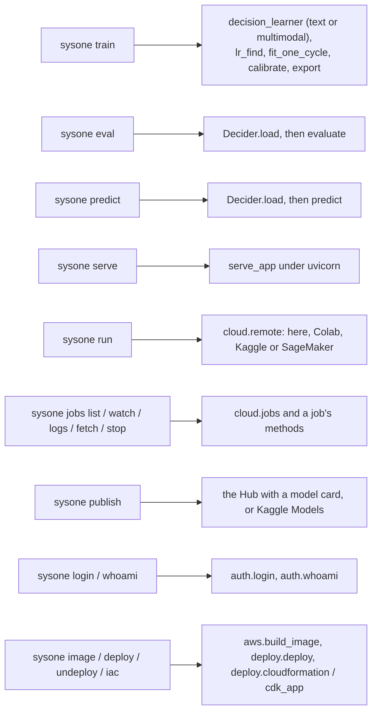

# cli


<!-- WARNING: THIS FILE WAS AUTOGENERATED! DO NOT EDIT! -->

Each command is a few lines over the library, so anything the command
line does, a script does the same way. The heavy imports happen inside
the commands, so `sysone --help` is instant.

<div>

<figure class=''>

<div>



</div>

</figure>

</div>

## train

`sysone train DATA ENCODER` is the ten-line example: data from a
JSON-lines file, a registry name or a Hub dataset, a learner for the
encoder (the text application’s defaults, or the multimodal one’s for a
multimodal encoder), one-cycle training, calibration, export.

------------------------------------------------------------------------

<a
href="https://github.com/sgaseretto/sysonelib/blob/main/sysone/cli.py#L34"
target="_blank" style="float:right; font-size:smaller">source</a>

### train

``` python
def train(
    data:str=<typer.models.ArgumentInfo object at 0x7f83541142f0>,
    encoder:str=<typer.models.ArgumentInfo object at 0x7f8354287d90>,
    output:pathlib.Path | None=<typer.models.OptionInfo object at 0x7f8354287ed0>,
    regime:str=<typer.models.OptionInfo object at 0x7f8354138050>,
    epochs:int=<typer.models.OptionInfo object at 0x7f8354138190>,
    lr:float | None=<typer.models.OptionInfo object at 0x7f83541382d0>,
    valid:str | None=<typer.models.OptionInfo object at 0x7f8354138410>,
    calib:float=<typer.models.OptionInfo object at 0x7f8354138550>,
    cache:str=<typer.models.OptionInfo object at 0x7f8354138690>,
    loss:str | None=<typer.models.OptionInfo object at 0x7f83541387d0>,
    preset:str | None=<typer.models.OptionInfo object at 0x7f8354138910>
):
```

*Train a decision model and export it*

## eval and predict

------------------------------------------------------------------------

<a
href="https://github.com/sgaseretto/sysonelib/blob/main/sysone/cli.py#L85"
target="_blank" style="float:right; font-size:smaller">source</a>

### predict

``` python
def predict(
    model:str=<typer.models.ArgumentInfo object at 0x7f8354139310>,
    questions:pathlib.Path=<typer.models.OptionInfo object at 0x7f8354139450>,
    state:str | None=<typer.models.OptionInfo object at 0x7f8354139590>,
    device:str | None=<typer.models.OptionInfo object at 0x7f83541396d0>
):
```

*Answer typed questions about one state*

------------------------------------------------------------------------

<a
href="https://github.com/sgaseretto/sysonelib/blob/main/sysone/cli.py#L64"
target="_blank" style="float:right; font-size:smaller">source</a>

### eval\_

``` python
def eval_(
    model:str=<typer.models.ArgumentInfo object at 0x7f8354138b90>,
    data:str=<typer.models.OptionInfo object at 0x7f8354138cd0>,
    split:str=<typer.models.OptionInfo object at 0x7f8354138e10>,
    n:int | None=<typer.models.OptionInfo object at 0x7f8354138f50>,
    by:str | None=<typer.models.OptionInfo object at 0x7f8354139090>
):
```

*Score a model on typed decisions or a zero-shot suite*

## serve

`sysone serve my-jev` runs the FastAPI app of `sysone.inference`
(`POST /v1/systemone`, `GET /health`); it needs `sysone[serve]`. For
Laya-format text exports `laya[serve]` serves the same route.

------------------------------------------------------------------------

<a
href="https://github.com/sgaseretto/sysonelib/blob/main/sysone/cli.py#L99"
target="_blank" style="float:right; font-size:smaller">source</a>

### serve

``` python
def serve(
    model:str=<typer.models.ArgumentInfo object at 0x7f8354139a90>,
    host:str=<typer.models.OptionInfo object at 0x7f8354139bd0>,
    port:int=<typer.models.OptionInfo object at 0x7f8354139d10>,
    device:str | None=<typer.models.OptionInfo object at 0x7f8354139e50>
):
```

*Serve POST /v1/systemone and GET /health*

## run, jobs and publish

------------------------------------------------------------------------

<a
href="https://github.com/sgaseretto/sysonelib/blob/main/sysone/cli.py#L251"
target="_blank" style="float:right; font-size:smaller">source</a>

### main

``` python
def main():
```

------------------------------------------------------------------------

<a
href="https://github.com/sgaseretto/sysonelib/blob/main/sysone/cli.py#L237"
target="_blank" style="float:right; font-size:smaller">source</a>

### iac

``` python
def iac(
    name:str=<typer.models.ArgumentInfo object at 0x7f8354141d10>,
    out:pathlib.Path=<typer.models.OptionInfo object at 0x7f8354141e50>,
    kind:str=<typer.models.OptionInfo object at 0x7f8354141f90>,
    instance:str=<typer.models.OptionInfo object at 0x7f83541420d0>,
    autoscale:str | None=<typer.models.OptionInfo object at 0x7f8354142210>,
    mlflow:bool=<typer.models.OptionInfo object at 0x7f8354142350>,
    image_uri:str=<typer.models.OptionInfo object at 0x7f8354142490>,
    model_data:str=<typer.models.OptionInfo object at 0x7f83541425d0>
):
```

*Write the infrastructure of a sysone endpoint as a CloudFormation
template or a CDK app*

------------------------------------------------------------------------

<a
href="https://github.com/sgaseretto/sysonelib/blob/main/sysone/cli.py#L228"
target="_blank" style="float:right; font-size:smaller">source</a>

### undeploy

``` python
def undeploy(
    name:str=<typer.models.ArgumentInfo object at 0x7f8354141950>,
    on:str=<typer.models.OptionInfo object at 0x7f8354141a90>,
    endpoint_url:str | None=<typer.models.OptionInfo object at 0x7f8354141bd0>
):
```

*Remove an endpoint `sysone deploy` made*

------------------------------------------------------------------------

<a
href="https://github.com/sgaseretto/sysonelib/blob/main/sysone/cli.py#L215"
target="_blank" style="float:right; font-size:smaller">source</a>

### deploy

``` python
def deploy(
    model:pathlib.Path=<typer.models.ArgumentInfo object at 0x7f83541411d0>,
    on:str=<typer.models.OptionInfo object at 0x7f8354141310>,
    hw:str | None=<typer.models.OptionInfo object at 0x7f8354141450>,
    name:str | None=<typer.models.OptionInfo object at 0x7f8354141590>,
    endpoint_url:str | None=<typer.models.OptionInfo object at 0x7f83541416d0>,
    serverless_mb:int | None=<typer.models.OptionInfo object at 0x7f8354141810>
):
```

*Serve an export: in Docker here, or as a SageMaker endpoint; prints the
endpoint*

------------------------------------------------------------------------

<a
href="https://github.com/sgaseretto/sysonelib/blob/main/sysone/cli.py#L203"
target="_blank" style="float:right; font-size:smaller">source</a>

### image

``` python
def image(
    gpu:bool=<typer.models.OptionInfo object at 0x7f8354140e10>,
    platform:str | None=<typer.models.OptionInfo object at 0x7f8354140f50>,
    tag:str | None=<typer.models.OptionInfo object at 0x7f8354141090>
):
```

*Build sysone’s image, which trains SageMaker jobs
([`train`](https://sgaseretto.github.io/sysonelib/cli.html#train)) and
serves endpoints
([`serve`](https://sgaseretto.github.io/sysonelib/cli.html#serve))*

------------------------------------------------------------------------

<a
href="https://github.com/sgaseretto/sysonelib/blob/main/sysone/auth.py#L248"
target="_blank" style="float:right; font-size:smaller">source</a>

### whoami

``` python
def whoami():
```

*The account each service uses on this machine*

------------------------------------------------------------------------

<a
href="https://github.com/sgaseretto/sysonelib/blob/main/sysone/auth.py#L243"
target="_blank" style="float:right; font-size:smaller">source</a>

### login

``` python
def login(
    service:str=<typer.models.ArgumentInfo object at 0x7f83541407d0>,
    local:bool=<typer.models.OptionInfo object at 0x7f8354140910>,
    profile:str | None=<typer.models.OptionInfo object at 0x7f8354140a50>,
    full:bool=<typer.models.OptionInfo object at 0x7f8354140b90>
):
```

*Log in to a service: the browser sign-ins print a URL (Kaggle and Colab
then ask for the code it shows)*

------------------------------------------------------------------------

<a
href="https://github.com/sgaseretto/sysonelib/blob/main/sysone/cli.py#L162"
target="_blank" style="float:right; font-size:smaller">source</a>

### publish

``` python
def publish(
    model:pathlib.Path=<typer.models.ArgumentInfo object at 0x7f835413b890>,
    to:str=<typer.models.OptionInfo object at 0x7f835413bb10>,
    repo:str | None=<typer.models.OptionInfo object at 0x7f835413bc50>,
    tag:str | None=<typer.models.OptionInfo object at 0x7f835413bd90>,
    revision:str | None=<typer.models.OptionInfo object at 0x7f835413bed0>,
    license:str | None=<typer.models.OptionInfo object at 0x7f8354140050>,
    card:bool=<typer.models.OptionInfo object at 0x7f8354140190>,
    owner:str | None=<typer.models.OptionInfo object at 0x7f83541402d0>,
    name:str | None=<typer.models.OptionInfo object at 0x7f8354140410>,
    private:bool=<typer.models.OptionInfo object at 0x7f8354140550>,
    dry_run:bool=<typer.models.OptionInfo object at 0x7f8354140690>
):
```

*Publish an export to the Hub (the default, with a model card) or to
Kaggle Models*

------------------------------------------------------------------------

<a
href="https://github.com/sgaseretto/sysonelib/blob/main/sysone/cli.py#L156"
target="_blank" style="float:right; font-size:smaller">source</a>

### jobs_stop

``` python
def jobs_stop(
    job:str=<typer.models.ArgumentInfo object at 0x7f835413b9d0>
):
```

*Stop a job*

------------------------------------------------------------------------

<a
href="https://github.com/sgaseretto/sysonelib/blob/main/sysone/cli.py#L148"
target="_blank" style="float:right; font-size:smaller">source</a>

### jobs_fetch

``` python
def jobs_fetch(
    job:str=<typer.models.ArgumentInfo object at 0x7f835413ae90>,
    dest:pathlib.Path | None=<typer.models.ArgumentInfo object at 0x7f835413b610>,
    sync:bool=<typer.models.OptionInfo object at 0x7f835413b750>
):
```

*Bring a finished job’s outputs here; prints the export’s folder*

------------------------------------------------------------------------

<a
href="https://github.com/sgaseretto/sysonelib/blob/main/sysone/cli.py#L142"
target="_blank" style="float:right; font-size:smaller">source</a>

### jobs_logs

``` python
def jobs_logs(
    job:str=<typer.models.ArgumentInfo object at 0x7f835413b4d0>
):
```

*Print a job’s log*

------------------------------------------------------------------------

<a
href="https://github.com/sgaseretto/sysonelib/blob/main/sysone/cli.py#L136"
target="_blank" style="float:right; font-size:smaller">source</a>

### jobs_watch

``` python
def jobs_watch(
    every:float=<typer.models.OptionInfo object at 0x7f835413b390>
):
```

*Refresh the table of running jobs until they end*

------------------------------------------------------------------------

<a
href="https://github.com/sgaseretto/sysonelib/blob/main/sysone/cli.py#L129"
target="_blank" style="float:right; font-size:smaller">source</a>

### jobs_list

``` python
def jobs_list(
    backend:str | None=<typer.models.OptionInfo object at 0x7f835413afd0>,
    active:bool=<typer.models.OptionInfo object at 0x7f835413b110>
):
```

*List jobs with their latest progress*

------------------------------------------------------------------------

<a
href="https://github.com/sgaseretto/sysonelib/blob/main/sysone/cli.py#L108"
target="_blank" style="float:right; font-size:smaller">source</a>

### run

``` python
def run(
    entry:pathlib.Path=<typer.models.ArgumentInfo object at 0x7f835413a0d0>,
    on:str=<typer.models.OptionInfo object at 0x7f835413a210>,
    hw:str | None=<typer.models.OptionInfo object at 0x7f835413a350>,
    data:str | None=<typer.models.OptionInfo object at 0x7f835413a490>,
    push:str | None=<typer.models.OptionInfo object at 0x7f835413a5d0>,
    track:bool=<typer.models.OptionInfo object at 0x7f835413a710>,
    experiment:str | None=<typer.models.OptionInfo object at 0x7f835413a850>,
    max_hours:float | None=<typer.models.OptionInfo object at 0x7f8354139950>,
    env:list[str] | None=<typer.models.OptionInfo object at 0x7f835413a990>,
    arg:list[str] | None=<typer.models.OptionInfo object at 0x7f835413aad0>,
    wait:bool=<typer.models.OptionInfo object at 0x7f835413ac10>,
    dry_run:bool=<typer.models.OptionInfo object at 0x7f835413ad50>
):
```

*Run a notebook or script as a job, here in the background or on Colab,
Kaggle or SageMaker*

## Trying it

On the fixtures, end to end: train, predict, evaluate, and a dry run of
a cloud job:

``` python
runner = CliRunner()
r = runner.invoke(app, ["--help"])
test_eq(r.exit_code, 0)
print(r.output)
```

                                                                                    
     Usage: root [OPTIONS] COMMAND [ARGS]...                                        
                                                                                    
     Jevify BERT-like encoders with sysone.                                         
                                                                                    
    ╭─ Options ────────────────────────────────────────────────────────────────────╮
    │ --help          Show this message and exit.                                  │
    ╰──────────────────────────────────────────────────────────────────────────────╯
    ╭─ Commands ───────────────────────────────────────────────────────────────────╮
    │ train    Train a decision model and export it                                │
    │ eval     Score a model on typed decisions or a zero-shot suite               │
    │ predict  Answer typed questions about one state                              │
    │ serve    Serve POST /v1/systemone and GET /health                            │
    │ run      Run a training script on Kaggle or Colab                            │
    │ publish  Publish an export to the Hub (the default) or to Kaggle Models      │
    │ jobs     Cloud jobs submitted with `sysone run`.                             │
    ╰──────────────────────────────────────────────────────────────────────────────╯

``` python
out = Path(tempfile.mkdtemp()) / "cli-jev"
os.environ["SYSONE_CACHE"] = tempfile.mkdtemp()
r = runner.invoke(app, ["train", "fixtures/typed_decisions_tiny.jsonl", "fixtures/tiny-modernbert", "--output", str(out),
                        "--epochs", "2", "--lr", "3e-3", "--valid", "0.25", "--preset", "cpu"])
if r.exit_code != 0: print(r.output); raise r.exception
test_eq((out / "sysone.json").exists(), True)
print(r.output[-400:])
```

    _per_second': '1977', 'train_steps_per_second': '273.7', 'train_loss': '0.9173', 'epoch': '2'}
    {"accuracy": 0.36, "soft_accuracy": 0.3767, "brier": 0.26, "kl": 0.4434, "tv": 0.366, "ece": 0.1159, "score_mae": 0.8379, "within_one": 0.6, "n": 25, "accuracy_choice": 0.4286, "accuracy_score": 0.3, "accuracy_noul": 0.375}
    exported to /var/folders/ym/y7_gxdb90s312g8bz06h3qqm0000gn/T/tmpcjz36ll1/cli-jev

``` python
qf = Path(tempfile.mkdtemp()) / "q.json"
qf.write_text(json.dumps({"urgent": {"type": "noul", "instructions": "This needs attention today."}}))
r = runner.invoke(app, ["predict", str(out), "--questions", str(qf), "--state", "The server room is flooding.", "--device", "cpu"])
test_eq(r.exit_code, 0)
test_eq(set(json.loads(r.output)["urgent"]), {"type", "noul", "confidence", "answer_confidence"})
```

``` python
r = runner.invoke(app, ["eval", str(out), "--data", "fixtures/typed_decisions_tiny.jsonl", "--n", "4"])
test_eq((r.exit_code, json.loads(r.output)["n"]), (0, 20))
```

``` python
os.environ["SYSONE_JOBS"] = str(Path(tempfile.mkdtemp()) / "jobs.json")
os.environ["SYSONE_JOBS_DIR"] = tempfile.mkdtemp()
script = Path(tempfile.mkdtemp()) / "train.py"; script.write_text("print('hi')\n")
r = runner.invoke(app, ["run", str(script), "--on", "kaggle", "--hw", "t4x2", "--push", "me/jev", "--dry-run"])
test_eq((r.exit_code, json.loads(r.output)["machine"], json.loads(r.output)["status"]), (0, "NvidiaTeslaT4", "dry-run"))
r = runner.invoke(app, ["run", str(script), "--on", "colab", "--hw", "a100", "--dry-run", "--env", "A=1"])
test_eq(json.loads(r.output)["machine"], "--gpu A100")
r = runner.invoke(app, ["run", str(script), "--on", "colab", "--hw", "t4x2", "--dry-run"])
test_eq((r.exit_code, "one GPU" in str(r.exception)), (1, True))
test_eq(runner.invoke(app, ["jobs", "list"]).exit_code, 0)
r = runner.invoke(app, ["publish", str(out), "--dry-run", "--repo", "me/jev", "--tag", "v1"])
pub = json.loads(r.output)
test_eq((pub["repo"], pub["private"], pub["tag"], "README.md" in pub["files"]), ("me/jev", True, "v1", True))
test_eq(runner.invoke(app, ["login", "aws", "--local"]).output.splitlines()[0], "export AWS_ENDPOINT_URL=http://localhost:4566")
infra = Path(tempfile.mkdtemp())
r = runner.invoke(app, ["iac", "my-jev", "--out", str(infra), "--autoscale", "1,4,100", "--mlflow"])
test_eq((r.exit_code, Path(r.output.strip()).name), (0, "my-jev.yaml"))
r = runner.invoke(app, ["iac", "my-jev", "--out", str(infra / "cdk"), "--kind", "cdk"])
test_eq(sorted(p.name for p in Path(r.output.strip()).iterdir()), ["app.py", "cdk.json", "requirements.txt", "template.json"])
r = runner.invoke(app, ["publish", str(out), "--to", "kaggle", "--owner", "me", "--name", "my-jev", "--dry-run"])
test_eq((r.exit_code, json.loads(r.output)["variation"][:4]), (0, ["kaggle", "models", "variations", "create"]))
```
