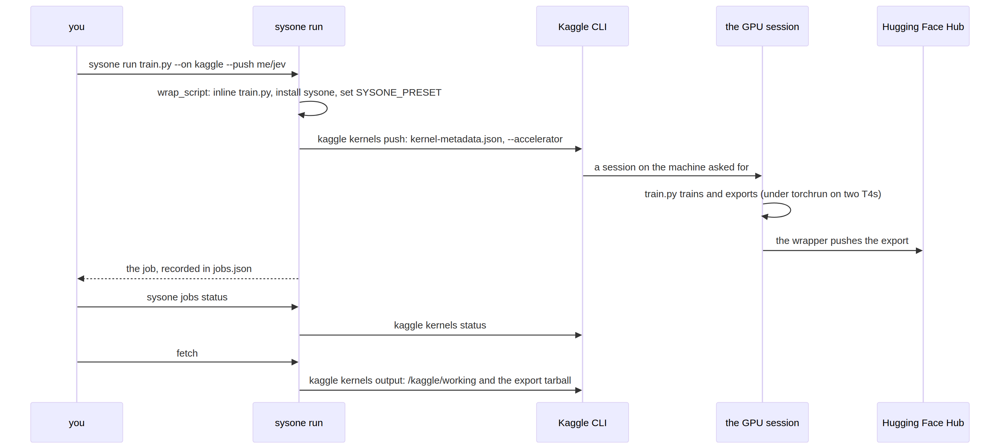

# cloud


<!-- WARNING: THIS FILE WAS AUTOGENERATED! DO NOT EDIT! -->

Full fine-tuning goes to rented GPUs; the laptop path is head-only.
`sysone.cloud` does not schedule, retry or manage infrastructure, which
the two CLIs already do: it writes what they need, calls them, and
records the job. The training script is the same file that runs locally;
the wrapper installs sysone on the machine, sets `SYSONE_PRESET` to the
machine’s hardware preset (read by `sysone.learner`), runs the script
(under `torchrun` on a multi-GPU machine), and pushes the export to the
Hub so results survive the session.

Both CLIs upload a single script: Kaggle sends only the `code_file`
named in its metadata, Colab sends one file as one cell. So the wrapper
inlines the user’s script and writes it back out on the machine. After
the script, it looks for the export in `SYSONE_OUTPUT`, else for the
newest folder holding a `sysone.json` (the script may call
`learn.export("my-jev")` wherever it likes), tars it, and pushes it; a
push that finds no export fails the job instead of passing quietly.

A job’s life on Kaggle (Colab differs in the middle: `colab run`
executes the file on a fresh VM, and `--keep` holds the VM for the
download):

<div>

<figure class=''>

<div>



</div>

</figure>

</div>

## The wrapper

------------------------------------------------------------------------

<a
href="https://github.com/sgaseretto/sysonelib/blob/main/sysone/cloud.py#L49"
target="_blank" style="float:right; font-size:smaller">source</a>

### wrap_script

``` python
def wrap_script(
    script:str | pathlib.Path, workdir:str, preset:str, gpus:int=1, push:str | None=None, install:str='sysone',
    output:str | None=None, env:dict | None=None, args:list | None=None
)->str:
```

*The single file a cloud machine runs: install sysone, run `script` with
`SYSONE_PRESET`, tar and push the export*

``` python
train_py = Path(tempfile.mkdtemp()) / "train.py"
train_py.write_text('from sysone.text import decision_learner, TypedDecisions\nprint("training")\n')
w = wrap_script(train_py, "/kaggle/working", "t4x2", gpus=2, push="user/my-jev", env={"SYSONE_DATA": "LocalLLaMA/typed-decisions"})
compile(w, "wrapper", "exec")
print(w[:600])
test_fail(lambda: wrap_script(Path("no/such/train.py"), "/w", "t4"), contains="no such training script")
test_fail(lambda: wrap_script("trian.py", "/w", "t4"), contains="no such training script")
```

    # generated by sysone.cloud: installs sysone, runs the training script, pushes the export to the Hub
    import glob, os, subprocess, sys, tarfile
    os.chdir('/kaggle/working')
    subprocess.run([sys.executable, "-m", "pip", "install", "-q", 'sysone'], check=True)
    os.environ.update({'SYSONE_PRESET': 't4x2', 'SYSONE_DATA': 'LocalLLaMA/typed-decisions'})
    os.environ.setdefault("SYSONE_OUTPUT", '/kaggle/working/export')
    open("sysone_train.py", "w").write('from sysone.text import decision_learner, TypedDecisions\nprint("training")\n')
    cmd = ([sys.executable, "-m", "torch.distributed.run", "--standalone", "-

Run with its subprocesses stubbed, the wrapper finds an export the
script wrote under a name of its own, tars it and pushes it, and fails
when a push finds nothing:

``` python
import sys, types, unittest.mock as mock
def run_wrapper(script_body, push="me/jev"):
    work = Path(tempfile.mkdtemp())
    code = wrap_script(script_body, str(work), "cpu", push=push)
    pushed = []
    api = types.SimpleNamespace(create_repo=lambda *a, **k: None, upload_folder=lambda **k: pushed.append(k["folder_path"]))
    def fake_run(cmd, check=False, **kw):      # pip install: skip; the training script: run it here
        if "sysone_train.py" in cmd: exec(compile(Path(work / "sysone_train.py").read_text(), "train", "exec"), {})
    with mock.patch("subprocess.run", fake_run), mock.patch.dict(sys.modules, {"huggingface_hub": types.SimpleNamespace(HfApi=lambda token=None: api)}):
        cwd = os.getcwd()
        try: exec(compile(code, "wrapper", "exec"), {})
        finally: os.chdir(cwd)
    return work, pushed

work, pushed = run_wrapper("import os, json\nos.makedirs('my-jev', exist_ok=True)\njson.dump({}, open('my-jev/sysone.json', 'w'))\n")
test_eq((len(pushed), Path(pushed[0]).name, (work / "sysone_export.tar.gz").exists()), (1, "my-jev", True))
test_fail(lambda: run_wrapper("print('trained, exported nothing')\n"), contains="wrote no export", exc=SystemExit)
```

    pushed my-jev to me/jev
    trained, exported nothing

``` python
assert "'SYSONE_PRESET': 't4x2'" in w and "--nproc_per_node" in w and "user/my-jev" in w
```

Each machine type gets its preset: Kaggle’s T4 accelerator is two T4s
(`t4x2`, DDP through torchrun), an L4 is `l4`, an A100 or H100 is
`a100`.

## Jobs

A submitted job is recorded in `~/.config/sysone/jobs.json` (or
`SYSONE_JOBS`), so `sysone jobs status` can list both backends’ jobs and
poll them; the files a job uploads are written under
`~/.cache/sysone/jobs` (or `SYSONE_JOBS_DIR`), where they can be read
before submitting.

------------------------------------------------------------------------

<a
href="https://github.com/sgaseretto/sysonelib/blob/main/sysone/cloud.py#L79"
target="_blank" style="float:right; font-size:smaller">source</a>

### save_job

``` python
def save_job(
    job:__main__.Job
)->__main__.Job:
```

------------------------------------------------------------------------

<a
href="https://github.com/sgaseretto/sysonelib/blob/main/sysone/cloud.py#L75"
target="_blank" style="float:right; font-size:smaller">source</a>

### load_jobs

``` python
def load_jobs()->list:
```

------------------------------------------------------------------------

<a
href="https://github.com/sgaseretto/sysonelib/blob/main/sysone/cloud.py#L70"
target="_blank" style="float:right; font-size:smaller">source</a>

### Job

``` python
def Job(
    backend:str, ref:str, script:str, machine:str, push:str | None=None, submitted:float=<factory>,
    folder:str | None=None, status:str='submitted'
)->None:
```

*A training run submitted to Kaggle or Colab*

------------------------------------------------------------------------

<a
href="https://github.com/sgaseretto/sysonelib/blob/main/sysone/cloud.py#L67"
target="_blank" style="float:right; font-size:smaller">source</a>

### jobs_dir

``` python
def jobs_dir()->pathlib.Path:
```

------------------------------------------------------------------------

<a
href="https://github.com/sgaseretto/sysonelib/blob/main/sysone/cloud.py#L66"
target="_blank" style="float:right; font-size:smaller">source</a>

### jobs_file

``` python
def jobs_file()->pathlib.Path:
```

``` python
os.environ["SYSONE_JOBS"] = str(Path(tempfile.mkdtemp()) / "jobs.json")
os.environ["SYSONE_JOBS_DIR"] = tempfile.mkdtemp()
save_job(Job("kaggle", "me/sysone-train", "train.py", "NvidiaTeslaT4"))
save_job(Job("kaggle", "me/sysone-train", "train.py", "NvidiaTeslaT4", status="complete"))
test_eq([(j.ref, j.status) for j in load_jobs()], [("me/sysone-train", "complete")])
```

## Running a CLI

Every call goes through
[`_cli`](https://sgaseretto.github.io/sysonelib/cloud.html#_cli), which
finds the executable (installed with `sysone[cloud]`), runs it, and,
with `dry_run=True`, only returns the command it would run. The Kaggle
CLI reports some failures on stdout with exit code 0
(`Kernel push error: …`, a status of `ERROR`), so its output is parsed,
not only its exit code.

------------------------------------------------------------------------

<a
href="https://github.com/sgaseretto/sysonelib/blob/main/sysone/cloud.py#L86"
target="_blank" style="float:right; font-size:smaller">source</a>

### CloudError

``` python
def CloudError(
    *args, **kwargs
):
```

*A cloud CLI reported a failure*

``` python
test_eq(_cli(["kaggle", "kernels", "list"], dry_run=True)["cmd"], ["kaggle", "kernels", "list"])
```

## Kaggle

[`kaggle_kernel`](https://sgaseretto.github.io/sysonelib/cloud.html#kaggle_kernel)
writes the folder `kaggle kernels push` uploads: the wrapped script and
`kernel-metadata.json` (a script kernel with internet on, the GPU given
as `machine_shape`, Kaggle datasets or models to mount).
[`kaggle_run`](https://sgaseretto.github.io/sysonelib/cloud.html#kaggle_run)
pushes it with `--accelerator` and a session timeout (12 hours at most),
[`kaggle_status`](https://sgaseretto.github.io/sysonelib/cloud.html#kaggle_status)
reads the status line (old CLIs print `"complete"`, current ones
`"KernelWorkerStatus.COMPLETE"`), and
[`kaggle_output`](https://sgaseretto.github.io/sysonelib/cloud.html#kaggle_output)
downloads `/kaggle/working`, the export tarball included.

------------------------------------------------------------------------

<a
href="https://github.com/sgaseretto/sysonelib/blob/main/sysone/cloud.py#L132"
target="_blank" style="float:right; font-size:smaller">source</a>

### kaggle_output

``` python
def kaggle_output(
    ref:str, dest, dry_run:bool=False
)->pathlib.Path:
```

*Download the kernel’s outputs (the export tarball among them) to
`dest`*

------------------------------------------------------------------------

<a
href="https://github.com/sgaseretto/sysonelib/blob/main/sysone/cloud.py#L127"
target="_blank" style="float:right; font-size:smaller">source</a>

### kaggle_status

``` python
def kaggle_status(
    ref:str, dry_run:bool=False
)->str:
```

*The kernel’s status*

------------------------------------------------------------------------

<a
href="https://github.com/sgaseretto/sysonelib/blob/main/sysone/cloud.py#L121"
target="_blank" style="float:right; font-size:smaller">source</a>

### parse_kaggle_status

``` python
def parse_kaggle_status(
    text:str
)->str:
```

*The status word of `kaggle kernels status` output: queued, running,
complete, error, cancelacknowledged*

------------------------------------------------------------------------

<a
href="https://github.com/sgaseretto/sysonelib/blob/main/sysone/cloud.py#L114"
target="_blank" style="float:right; font-size:smaller">source</a>

### kaggle_run

``` python
def kaggle_run(
    folder, accelerator:str='NvidiaTeslaT4', timeout:int=43200, dry_run:bool=False
)->__main__.Job:
```

*Push a kernel folder and record the job*

------------------------------------------------------------------------

<a
href="https://github.com/sgaseretto/sysonelib/blob/main/sysone/cloud.py#L99"
target="_blank" style="float:right; font-size:smaller">source</a>

### kaggle_kernel

``` python
def kaggle_kernel(
    script, slug:str, folder:NoneType=None, accelerator:str='NvidiaTeslaT4', push:str | None=None,
    install:str='sysone', datasets:list | None=None, models:list | None=None, private:bool=True,
    env:dict | None=None, args:list | None=None
)->pathlib.Path:
```

*A folder for `kaggle kernels push`: the wrapped script and its
kernel-metadata.json*

``` python
kf = kaggle_kernel(train_py, "me/sysone-typed-decisions", Path(tempfile.mkdtemp()) / "k", push="me/laya-td")
meta = json.loads((kf / "kernel-metadata.json").read_text())
meta
```

    {'id': 'me/sysone-typed-decisions',
     'title': 'Sysone Typed Decisions',
     'code_file': 'sysone_job.py',
     'language': 'python',
     'kernel_type': 'script',
     'is_private': True,
     'enable_gpu': True,
     'enable_internet': True,
     'machine_shape': 'NvidiaTeslaT4',
     'dataset_sources': [],
     'competition_sources': [],
     'kernel_sources': [],
     'model_sources': []}

``` python
test_eq((meta["code_file"], meta["kernel_type"], meta["machine_shape"], meta["enable_internet"]), ("sysone_job.py", "script", "NvidiaTeslaT4", True))
job = kaggle_run(kf, dry_run=True)
test_eq(job.ref, "me/sysone-typed-decisions")
test_eq(parse_kaggle_status('me/k has status "KernelWorkerStatus.COMPLETE"'), "complete")
test_eq(parse_kaggle_status('me/k has status "cancelAcknowledged"'), "cancelacknowledged")
test_fail(lambda: kaggle_kernel(train_py, "no-owner"), contains="owner/name")
```

## Colab

`colab run` executes one file on a fresh VM and releases it; `--timeout`
is not a run limit, so it is set above the job’s length (a low value
makes the CLI busy-wait and can fail a finished run), and `--keep` keeps
the VM so the export tarball can be downloaded with `colab download`
(single files only, which is why the wrapper tars the export) before
`colab stop`. For long jobs the wrapper’s Hub push is the safer way
back: a dropped connection ends the session.

------------------------------------------------------------------------

<a
href="https://github.com/sgaseretto/sysonelib/blob/main/sysone/cloud.py#L160"
target="_blank" style="float:right; font-size:smaller">source</a>

### colab_stop

``` python
def colab_stop(
    session:str, dry_run:bool=False
):
```

------------------------------------------------------------------------

<a
href="https://github.com/sgaseretto/sysonelib/blob/main/sysone/cloud.py#L154"
target="_blank" style="float:right; font-size:smaller">source</a>

### colab_download

``` python
def colab_download(
    session:str, dest, dry_run:bool=False
)->pathlib.Path:
```

*Download a kept session’s export tarball*

------------------------------------------------------------------------

<a
href="https://github.com/sgaseretto/sysonelib/blob/main/sysone/cloud.py#L139"
target="_blank" style="float:right; font-size:smaller">source</a>

### colab_run

``` python
def colab_run(
    script, gpu:str='L4', session:str | None=None, push:str | None=None, keep:bool=True, install:str='sysone',
    timeout:int=86400, env:dict | None=None, args:list | None=None, dry_run:bool=False, folder:NoneType=None
)->__main__.Job:
```

*Run a training script on a Colab GPU VM (kept for downloading the
export unless keep=False)*

``` python
cj = colab_run(train_py, gpu="l4", session="sysone-test", dry_run=True, folder=Path(tempfile.mkdtemp()))
test_eq((cj.backend, cj.machine), ("colab", "L4"))
assert "'SYSONE_PRESET': 'l4'" in Path(cj.script).read_text()
```

## run

[`run`](https://sgaseretto.github.io/sysonelib/cli.html#run) is what
`sysone run` calls: one script, one backend, one machine.
[`status`](https://sgaseretto.github.io/sysonelib/cloud.html#status)
refreshes and returns the recorded jobs, and
[`fetch`](https://sgaseretto.github.io/sysonelib/cloud.html#fetch) gets
a finished job’s export.

------------------------------------------------------------------------

<a
href="https://github.com/sgaseretto/sysonelib/blob/main/sysone/cloud.py#L188"
target="_blank" style="float:right; font-size:smaller">source</a>

### fetch

``` python
def fetch(
    job:__main__.Job, dest
)->pathlib.Path:
```

*Download a finished job’s export tarball and unpack it*

------------------------------------------------------------------------

<a
href="https://github.com/sgaseretto/sysonelib/blob/main/sysone/cloud.py#L179"
target="_blank" style="float:right; font-size:smaller">source</a>

### status

``` python
def status(
    refresh:bool=True
)->list:
```

*The recorded jobs, with Kaggle statuses refreshed*

------------------------------------------------------------------------

<a
href="https://github.com/sgaseretto/sysonelib/blob/main/sysone/cli.py#L104"
target="_blank" style="float:right; font-size:smaller">source</a>

### run

``` python
def run(
    script, on:str='kaggle', accelerator:str | None=None, gpu:str | None=None, slug:str | None=None,
    push:str | None=None, data:str | None=None, keep:bool=True, install:str='sysone', dry_run:bool=False, **kw
)->__main__.Job:
```

*Submit a training script to Kaggle or Colab*

``` python
j = run(train_py, on="kaggle", slug="me/sysone-demo", push="me/demo-jev", data="LocalLLaMA/typed-decisions", dry_run=True,
        folder=Path(tempfile.mkdtemp()))
test_eq(j.machine, "NvidiaTeslaT4")
test_fail(lambda: run(train_py, on="lambda"), contains="unknown backend")
```

## Publishing to Kaggle Models

The Hub is where exports go by default;
[`publish_kaggle`](https://sgaseretto.github.io/sysonelib/cloud.html#publish_kaggle)
also makes a Kaggle Model from an export folder, writing the two
metadata files the CLI reads and uploading the folder as a variation
(its subfolders zipped, which the CLI otherwise skips).

------------------------------------------------------------------------

<a
href="https://github.com/sgaseretto/sysonelib/blob/main/sysone/cloud.py#L199"
target="_blank" style="float:right; font-size:smaller">source</a>

### publish_kaggle

``` python
def publish_kaggle(
    path, owner:str, model:str, variation:str='default', license:str='Apache 2.0', framework:str='pyTorch',
    title:str | None=None, private:bool=True, dry_run:bool=False
)->dict:
```

*Create a Kaggle Model and upload an export folder as one of its
variations*

``` python
exp = Path(tempfile.mkdtemp()); (exp / "sysone.json").write_text("{}")
cmds = publish_kaggle(exp, "me", "my-jev", dry_run=True)
test_eq(cmds["variation"][-2:], ["-r", "zip"])
test_eq(json.loads((exp / "model-instance-metadata.json").read_text())["instanceSlug"], "default")
```

Out of scope on purpose: a job queue, cost tracking, notebooks as the
unit of work (scripts only, which both CLIs run), and any provider
without a CLI. The real runs need credentials (`kaggle auth login`, or
`KAGGLE_API_TOKEN`; `colab --auth oauth2` once, interactively) and an
`HF_TOKEN` secret for the push; with them, the reproduction of Laya’s
fine-tune in the text notebook is:

``` python
job = run("reproduce_laya.py", on="kaggle", accelerator="NvidiaTeslaT4", slug="me/sysone-laya-td", push="me/laya-typed-decisions")
status()
fetch(job, "laya-typed-decisions")
```
