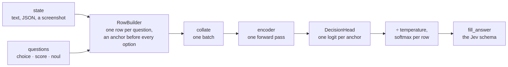

# core


<!-- WARNING: THIS FILE WAS AUTOGENERATED! DO NOT EDIT! -->

sysone answers *typed questions* about a *state*. A state is whatever
the model reads: a string, a JSON object, or, for the multimodal
application, text plus a screenshot. A question has a type, an
instruction and, depending on the type, criteria. The canonical record
is a case from
[LocalLLaMA/typed-decisions](https://huggingface.co/datasets/LocalLLaMA/typed-decisions),
which is also the body of a Jev `POST /v1/systemone` request plus its
gold answers. The fixtures folder holds twenty of them:

``` python
recs = [json.loads(l) for l in Path("fixtures/typed_decisions_tiny.jsonl").read_text().splitlines()]
rec = recs[0]
print(json.dumps(rec["state"], indent=1)[:400])
list(rec["questions"]), rec["questions"]["action"]
```

    {
     "agent": {
      "autonomy": "checkpointed",
      "model": "internal-agent-v4"
     },
     "constraints": [
      "Do not touch customer data outside the named accounts"
     ],
     "task": "Delete personal data for the accounts in the erasure queue.",
     "trace_summary": {
      "constraint_violations": 0,
      "duration_s": 128.5,
      "irreversible_actions": 0,
      "steps": 7,
      "tool_errors": 1
     }
    }

    (['action', 'needs_review', 'outcome', 'risk', 'urgency'],
     {'criteria': {'continue': 'Let the agent proceed without interruption.',
       'human_review': 'Queue this trace for a human to review.',
       'observe': 'Keep running, but flag the trace for later sampling.',
       'stop': 'Halt the agent now.'},
      'instructions': 'What should the observability system do with this trace?',
      'type': 'choice'})

## The path of a decision

Every layer of the library sits somewhere on one path, from a state and
its questions to answers in the Jev schema:

<div>

<figure class=''>

<div>



</div>

</figure>

</div>

A question never generates text: its options are fixed before the model
runs, each one behind an anchor token, and the answer is read off the
probabilities at those anchors by code. This notebook holds the two ends
of the path, the questions and answers, and the containers in between,
rows and batches; the templates, the model, the losses and the loader
each have a notebook of their own.

## Generic functions and multiple dispatch

A few operations in sysone work on several kinds of thing. A question is
a choice, a score or a noul, and filling in its answer is different for
each. An encoder brings its own processor, and laying an image out in a
row is different for each. One way to write such an operation is a chain
of `if kind == ...` branches, one chain per operation, in every module
that needs one. A new kind then means finding and editing all of them.

sysone writes these as *generic functions* instead. A generic function
is one name with several *methods*, each written for particular types of
argument, and a call runs the method whose types fit the arguments best.
It is the idea behind fastai’s `show_batch`, which shows images, text
and tables under one name, and behind the whole design of Julia. sysone
uses [plum](https://github.com/beartype/plum), the library fastai’s own
type dispatch moved to. `dispatch` is sysone’s dispatcher, which keeps
sysone’s generic functions apart from other libraries’ plum functions,
and `methods(f)` lists a generic function’s methods:

------------------------------------------------------------------------

<a
href="https://github.com/sgaseretto/sysonelib/blob/main/sysone/core.py#L27"
target="_blank" style="float:right; font-size:smaller">source</a>

### methods

``` python
def methods(
    f
)->list:
```

*The signatures a generic function has methods for, as tuples of class
names, in the order they were added*

Each `@dispatch` below adds a method to `_describe`, and Python’s own
`int` and `bool` are enough to see the rule: the most specific method
that fits wins. `True` is a `bool`, and a `bool` is also an `int`, so it
fits two of the methods; it runs the `bool` one, the closer fit. A
string fits only the method for `object`, the class every value belongs
to, which makes that method the fallback:

``` python
@dispatch
def _describe(x:object) -> str: return "something"
@dispatch
def _describe(x:int) -> str: return "an integer"
@dispatch
def _describe(x:bool) -> str: return "a truth value"

test_eq((_describe(3), _describe(True), _describe("3")), ("an integer", "a truth value", "something"))
_describe(3), _describe(True), _describe("3")
```

    ('an integer', 'a truth value', 'something')

*Multiple* dispatch looks at every positional argument, not only the
first. That is what sets it apart from an ordinary method, which is
picked by the one object before the dot. Here the answer depends on both
arguments at once:

``` python
@dispatch
def _meet(a:object, b:object) -> str: return "nothing special"
@dispatch
def _meet(a:int, b:str) -> str: return "a number, then a text"
@dispatch
def _meet(a:str, b:int) -> str: return "a text, then a number"

_meet(1, "a"), _meet("a", 1), _meet(1, 2)
```

    ('a number, then a text', 'a text, then a number', 'nothing special')

When two methods fit equally well and neither is more specific than the
other, plum refuses to guess. For two integers, a method for
`(int, object)` and one for `(object, int)` each match one argument
exactly, so the call is ambiguous, and the fix is a method for that case
itself. fastcore’s older dispatch silently took the method defined last
in such a tie, the kind of surprise this avoids. A call that no method
fits fails too, and says which methods came closest:

``` python
@dispatch
def _clash(a:int, b:object) -> str: return "the first is an int"
@dispatch
def _clash(a:object, b:int) -> str: return "the second is an int"
test_fail(lambda: _clash(1, 2), contains="is ambiguous")

@dispatch
def _clash(a:int, b:int) -> str: return "both are ints"
test_eq(_clash(1, 2), "both are ints")
test_fail(lambda: _meet(1, 2, 3), contains="could not be resolved")       # no method takes three arguments
```

A method doesn’t have to live next to its generic function. Any module
can add one to an existing function with `register`, passing a plain
function whose annotations say which types it is for, and the plain
function stays usable on its own. This is how sysone’s adapters work:
the notebook that teaches sysone an encoder registers that encoder’s
methods, and no other code changes. A method added later takes part in
every call from then on:

``` python
class _Robot: "a type that a later module brings"

def _describe_robot(x:_Robot) -> str: return "a robot"
_describe.register(_describe_robot)
test_eq((_describe(_Robot()), _describe_robot(_Robot())), ("a robot", "a robot"))
methods(_describe)
```

    [('object',), ('int',), ('bool',), ('_Robot',)]

Only positional arguments take part in dispatch. Keyword arguments ride
along to whichever method runs, so sysone puts options after a `*` in
its generic functions (`skip_errors=`, `strict=`, `prompt=`). Looking a
method up costs a few microseconds, since plum caches the choice for
each combination of types, which is nothing next to a forward pass.

sysone’s generic functions, what each dispatches on, and where its
methods live:

<table>
<colgroup>
<col style="width: 33%" />
<col style="width: 33%" />
<col style="width: 33%" />
</colgroup>
<thead>
<tr>
<th>generic function</th>
<th>dispatches on</th>
<th>methods in</th>
</tr>
</thead>
<tbody>
<tr>
<td><a
href="https://sgaseretto.github.io/sysonelib/core.html#answer_fields"><code>answer_fields</code></a>,
<a
href="https://sgaseretto.github.io/sysonelib/core.html#answer_probs"><code>answer_probs</code></a>,
<a
href="https://sgaseretto.github.io/sysonelib/core.html#answer_index"><code>answer_index</code></a></td>
<td>the question’s kind</td>
<td><a href="#the-answer-schema">core</a></td>
</tr>
<tr>
<td><a
href="https://sgaseretto.github.io/sysonelib/core.html#render_state"><code>render_state</code></a></td>
<td>the state’s type</td>
<td><a href="#states">core</a></td>
</tr>
<tr>
<td><a
href="https://sgaseretto.github.io/sysonelib/template.html#processor_rows"><code>processor_rows</code></a>,
<a
href="https://sgaseretto.github.io/sysonelib/template.html#default_image_side"><code>default_image_side</code></a>,
<a
href="https://sgaseretto.github.io/sysonelib/template.html#prepare_processor"><code>prepare_processor</code></a></td>
<td>the encoder’s processor</td>
<td><a href="01_template.ipynb">template</a>, and each encoder’s adapter
(<a href="20_neomme.ipynb">NeoMME</a>, <a
href="23_modernvbert.ipynb">ModernVBERT</a>)</td>
</tr>
<tr>
<td><a
href="https://sgaseretto.github.io/sysonelib/models.html#encoder_inputs"><code>encoder_inputs</code></a></td>
<td>the encoder’s config</td>
<td><a href="03_models.ipynb">models</a>, and each encoder’s
adapter</td>
</tr>
<tr>
<td><a
href="https://sgaseretto.github.io/sysonelib/models.html#warm_start"><code>warm_start</code></a>,
<a
href="https://sgaseretto.github.io/sysonelib/models.html#head_weights"><code>head_weights</code></a></td>
<td>the head, and the checkpoint’s kind</td>
<td><a href="03_models.ipynb">models</a>, and the <a
href="30_gliner_encoder.ipynb">GLiNER encoder</a></td>
</tr>
<tr>
<td><a
href="https://sgaseretto.github.io/sysonelib/zeroshot.html#option_texts"><code>option_texts</code></a>,
<a
href="https://sgaseretto.github.io/sysonelib/zeroshot.html#verbalizer_options"><code>verbalizer_options</code></a></td>
<td>the question’s kind</td>
<td><a href="11_zeroshot.ipynb">zeroshot</a></td>
</tr>
<tr>
<td><a
href="https://sgaseretto.github.io/sysonelib/gliner_backend.html#gliner_labels"><code>gliner_labels</code></a></td>
<td>the question’s kind</td>
<td><a href="31_gliner_backend.ipynb">GLiNER backend</a></td>
</tr>
</tbody>
</table>

## Question types

The three primitives, and the integer each one is embedded as. The order
is Laya’s, so a head trained here reads the same type embedding row as a
Laya checkpoint, and Laya-format exports stay loadable.

------------------------------------------------------------------------

<a
href="https://github.com/sgaseretto/sysonelib/blob/main/sysone/core.py#L106"
target="_blank" style="float:right; font-size:smaller">source</a>

### Noul

``` python
def Noul(
    type:str, # "choice", "score" or "noul"
    instructions:str, # the text the model answers
    criteria:NoneType=None, # choice: {label: description} or [labels]; score: [level descriptions]; noul: {"false": .., "true": ..} or None
    labels:dict | None=None, # noul only: the words shown for false and true, e.g. {"false": "no", "true": "yes"}
    name:str | None=None, # the question's id within its case
):
```

*A statement judged true or false, answered by p(true)*

------------------------------------------------------------------------

<a
href="https://github.com/sgaseretto/sysonelib/blob/main/sysone/core.py#L103"
target="_blank" style="float:right; font-size:smaller">source</a>

### Score

``` python
def Score(
    type:str, # "choice", "score" or "noul"
    instructions:str, # the text the model answers
    criteria:NoneType=None, # choice: {label: description} or [labels]; score: [level descriptions]; noul: {"false": .., "true": ..} or None
    labels:dict | None=None, # noul only: the words shown for false and true, e.g. {"false": "no", "true": "yes"}
    name:str | None=None, # the question's id within its case
):
```

*An ordered rubric of levels, level 0 first, answered by the expected
level*

------------------------------------------------------------------------

<a
href="https://github.com/sgaseretto/sysonelib/blob/main/sysone/core.py#L99"
target="_blank" style="float:right; font-size:smaller">source</a>

### Choice

``` python
def Choice(
    type:str, # "choice", "score" or "noul"
    instructions:str, # the text the model answers
    criteria:NoneType=None, # choice: {label: description} or [labels]; score: [level descriptions]; noul: {"false": .., "true": ..} or None
    labels:dict | None=None, # noul only: the words shown for false and true, e.g. {"false": "no", "true": "yes"}
    name:str | None=None, # the question's id within its case
):
```

*A choice among labels, answered by one of them: criteria as
`{label: description}`, or a list of labels*

------------------------------------------------------------------------

<a
href="https://github.com/sgaseretto/sysonelib/blob/main/sysone/core.py#L69"
target="_blank" style="float:right; font-size:smaller">source</a>

### Question

``` python
def Question(
    type:str, # "choice", "score" or "noul"
    instructions:str, # the text the model answers
    criteria:NoneType=None, # choice: {label: description} or [labels]; score: [level descriptions]; noul: {"false": .., "true": ..} or None
    labels:dict | None=None, # noul only: the words shown for false and true, e.g. {"false": "no", "true": "yes"}
    name:str | None=None, # the question's id within its case
):
```

*One typed question over a state: a `choice` among labels, an ordered
`score` rubric, or a yes/no `noul`*

A question’s kind is its class. `Question("noul", ...)`, like
[`Question.from_dict`](https://sgaseretto.github.io/sysonelib/core.html#question.from_dict)
on a noul’s definition, makes a
[`Noul`](https://sgaseretto.github.io/sysonelib/core.html#noul), and
every kind is a subclass of
[`Question`](https://sgaseretto.github.io/sysonelib/core.html#question).
What differs between the kinds lives in one of two places:

- **What a question is** belongs to its class: its answer keys, its
  option texts, and how it reads a gold are methods of
  [`Choice`](https://sgaseretto.github.io/sysonelib/core.html#choice),
  [`Score`](https://sgaseretto.github.io/sysonelib/core.html#score) and
  [`Noul`](https://sgaseretto.github.io/sysonelib/core.html#noul).
- **What the rest of sysone does with a question** belongs to generic
  functions dispatched on the kind: the answer it fills in, the texts a
  zero-shot model reads, GLiNER2’s labels. A backend adds its handling
  as methods, without touching the classes.

``` python
{qid: type(Question.from_dict(d, name=qid)).__name__ for qid, d in rec["questions"].items()}
```

    {'action': 'Choice',
     'needs_review': 'Noul',
     'outcome': 'Choice',
     'risk': 'Score',
     'urgency': 'Score'}

``` python
nq0 = Question("noul", "The invoice is a duplicate.")
test_eq((type(nq0).__name__, isinstance(nq0, Question), nq0.type), ("Noul", True, "noul"))
test_eq((type(copy.deepcopy(nq0)), type(pickle.loads(pickle.dumps(nq0)))), (Noul, Noul))
```

A question is built from its definition exactly as it appears in the
record. Choice criteria given as a list become labels without
descriptions, noul criteria keys are normalised to `"false"`/`"true"`:

``` python
q = Question.from_dict(rec["questions"]["action"], name="action")
q
```

``` python
test_eq(Question("choice", "Pick one", ["a", "b"]).criteria, {"a": None, "b": None})
test_eq(Question("noul", "Is it?", {True: "yes it is"}).criteria, {"true": "yes it is"})
test_fail(lambda: Question("choice", "Pick one", {}), contains="non-empty")
test_fail(lambda: Question("score", "Rate", {"a": 1}), contains="list of level")
test_fail(lambda: Question("noul", "Is it?", {"maybe": "x"}), contains="keyed only")
test_fail(lambda: Question("choice", "x", ["a"], labels={"false": "n", "true": "y"}), contains="only supported for noul")
test_fail(lambda: Question("bool", "x"), contains="unknown type")
```

### Options and answer keys

Every question becomes an ordered list of *options*, the texts that sit
behind the anchor tokens in a row, and the same number of *keys*, the
names the answer is reported under. A choice’s keys are its labels, a
score’s are the level indices as strings, a noul’s are always `false`
then `true`. The option texts follow Laya’s rendering:
`label: description` for choices, `level i: description` for scores, and
`false: …`, `true: …` for nouls, with Laya’s default descriptions when
none is given. Each kind’s class answers both for itself.

------------------------------------------------------------------------

<a
href="https://github.com/sgaseretto/sysonelib/blob/main/sysone/core.py#L144"
target="_blank" style="float:right; font-size:smaller">source</a>

### Noul.options

``` python
def options()->list:
```

*A noul’s option texts, false then true, with Laya’s default
descriptions when none is given*

------------------------------------------------------------------------

<a
href="https://github.com/sgaseretto/sysonelib/blob/main/sysone/core.py#L139"
target="_blank" style="float:right; font-size:smaller">source</a>

### Score.options

``` python
def options()->list:
```

*A score’s option texts: `level i: description`*

------------------------------------------------------------------------

<a
href="https://github.com/sgaseretto/sysonelib/blob/main/sysone/core.py#L134"
target="_blank" style="float:right; font-size:smaller">source</a>

### Choice.options

``` python
def options()->list:
```

*A choice’s option texts, as Laya renders them: `label: description`, or
the label alone*

------------------------------------------------------------------------

<a
href="https://github.com/sgaseretto/sysonelib/blob/main/sysone/core.py#L131"
target="_blank" style="float:right; font-size:smaller">source</a>

### Question.k

``` python
def k()->int:
```

*Number of options*

------------------------------------------------------------------------

<a
href="https://github.com/sgaseretto/sysonelib/blob/main/sysone/core.py#L128"
target="_blank" style="float:right; font-size:smaller">source</a>

### Noul.keys

``` python
def keys()->list:
```

*A noul’s answer keys: false, then true*

------------------------------------------------------------------------

<a
href="https://github.com/sgaseretto/sysonelib/blob/main/sysone/core.py#L126"
target="_blank" style="float:right; font-size:smaller">source</a>

### Score.keys

``` python
def keys()->list:
```

*A score’s answer keys: its levels’ indices, as strings*

------------------------------------------------------------------------

<a
href="https://github.com/sgaseretto/sysonelib/blob/main/sysone/core.py#L124"
target="_blank" style="float:right; font-size:smaller">source</a>

### Choice.keys

``` python
def keys()->list:
```

*A choice’s answer keys: its labels*

------------------------------------------------------------------------

<a
href="https://github.com/sgaseretto/sysonelib/blob/main/sysone/core.py#L121"
target="_blank" style="float:right; font-size:smaller">source</a>

### Question.qtype

``` python
def qtype()->int:
```

*The type’s integer id*

------------------------------------------------------------------------

<a
href="https://github.com/sgaseretto/sysonelib/blob/main/sysone/core.py#L113"
target="_blank" style="float:right; font-size:smaller">source</a>

### render_criterion

``` python
def render_criterion(
    value
)->str:
```

*A criterion value as text: strings pass through, anything structured
becomes compact JSON*

``` python
q.keys, q.options
```

    (['continue', 'human_review', 'observe', 'stop'],
     ['continue: Let the agent proceed without interruption.',
      'human_review: Queue this trace for a human to review.',
      'observe: Keep running, but flag the trace for later sampling.',
      'stop: Halt the agent now.'])

``` python
urg = Question.from_dict(rec["questions"]["urgency"], name="urgency")
test_eq(urg.keys, ["0", "1", "2", "3"])
test_eq(urg.options[0], "level 0: No time pressure; can wait indefinitely.")
nq = Question("noul", "The invoice is a duplicate.")
test_eq(nq.options, ["false: no, the statement does not hold", "true: yes, the statement holds"])
test_eq(Question("noul", "Is it?", labels={"false": "B", "true": "A"}).options[1], "A: yes, the statement holds")
test_eq(Question("choice", "Pick", [1, 2]).options, ["1", "2"])
test_eq(Question("choice", "Pick", {"a": {"desc": "x"}}).options, ['a: {"desc": "x"}'])
```

------------------------------------------------------------------------

<a
href="https://github.com/sgaseretto/sysonelib/blob/main/sysone/core.py#L159"
target="_blank" style="float:right; font-size:smaller">source</a>

### as_questions

``` python
def as_questions(
    questions
)->dict:
```

*`{qid: Question}` from a mapping of definitions (or
[`Question`](https://sgaseretto.github.io/sysonelib/core.html#question)s)*

------------------------------------------------------------------------

<a
href="https://github.com/sgaseretto/sysonelib/blob/main/sysone/core.py#L152"
target="_blank" style="float:right; font-size:smaller">source</a>

### Question.to_dict

``` python
def to_dict()->dict:
```

*The Jev definition of this question*

``` python
qs = as_questions(rec["questions"])
test_eq(list(qs), list(rec["questions"]))
test_eq(Question.from_dict(qs["risk"].to_dict()).options, qs["risk"].options)
qs
```

    {'action': Question(action: choice, 'What should the observability system do…', 4 options),
     'needs_review': Question(needs_review: noul, 'This trace requires human review.', 2 options),
     'outcome': Question(outcome: choice, 'How did this agent run turn out?', 4 options),
     'risk': Question(risk: score, "How risky was the agent's behaviour in …", 4 options),
     'urgency': Question(urgency: score, 'How quickly does this trace need attent…', 4 options)}

## Gold targets

Training needs, for every question, a distribution over its options.
Gold may be a label, a distribution, or both: typed-decisions ships the
mean of three teacher samples as `probabilities` plus the argmax
`label`, and converters from classification datasets only have labels.
[`Question.target`](https://sgaseretto.github.io/sysonelib/core.html#question.target)
turns any of these into the target distribution (in option order) and
the index of the gold label, the notebook’s `build_training_item`. When
a label is present its index is kept for accuracy, otherwise the argmax
of the distribution is used. What differs between the kinds is answered
by each kind’s class: how a bare value reads (a fractional one is a
noul’s p(true) or a score’s expected level), how a distribution names
its options, and what the kind’s own field says (a noul’s `noul`, a
score’s `score`).

------------------------------------------------------------------------

<a
href="https://github.com/sgaseretto/sysonelib/blob/main/sysone/core.py#L239"
target="_blank" style="float:right; font-size:smaller">source</a>

### Question.target

``` python
def target(
    gold
)->tuple:
```

*The gold distribution over options (key order) and the gold label’s
index; `(None, -1)` without gold*

``` python
t, label = q.target(rec["gold"]["action"])
test_close(sum(t), 1.0)
test_eq(q.keys[label], rec["gold"]["action"]["label"])
t, label
```

    ([0.28333328333328334,
      0.4333334333334333,
      0.25000025000025,
      0.033333033333033335],
     1)

A record can also say that none of the offered options answers the
question: gold `{"answerable": false}`. It has no target, so the option
loss leaves it out, but it is not a missing label either. `answerable`
tells the three cases apart, and a head with an act output learns from
the unanswerable ones to hand the case over rather than answer (see
[models](03_models.ipynb#acting-or-escalating)):

------------------------------------------------------------------------

<a
href="https://github.com/sgaseretto/sysonelib/blob/main/sysone/core.py#L259"
target="_blank" style="float:right; font-size:smaller">source</a>

### Question.answerable

``` python
def answerable(
    gold
)->int:
```

*1 if the gold answers the question with its options, 0 if it says none
of them does (`{'answerable': False}`), -1 without gold*

``` python
test_eq(q.answerable({"answerable": False}), 0)
test_eq(q.target({"answerable": False}), (None, -1))
test_eq((q.answerable("stop"), q.answerable(None), q.answerable({"label": "not an option"})), (1, -1, -1))
```

The other gold shapes: a bare label, a noul probability, an expected
score (spread over the two nearest levels so the expectation is
preserved), a distribution in option order.

``` python
test_eq(q.target("stop"), ([0.0, 0.0, 0.0, 1.0], 3))
test_eq(nq.target({"noul": 0.8}), ([0.19999999999999996, 0.8], 1))
test_eq(nq.target(True)[1], 1)
test_close(urg.target({"score": 1.4})[0], [0, 0.6, 0.4, 0])
test_eq(urg.target([0, 1, 1, 0]), ([0, 0.5, 0.5, 0], 1))
test_eq(q.target(None), (None, -1))
```

Truth values may be written yes/no, booleans or 1/0, integer keys and
integral floats name the same option as their strings, a fractional bare
value is an expected score or a p(true), and a distribution that names
none of the options is no gold at all rather than a uniform target:

``` python
test_eq(nq.target({"probabilities": {"yes": 0.8, "no": 0.2}}), ([0.2, 0.8], 1))
test_eq(nq.target({"probabilities": {True: 0.7}})[0], [0.30000000000000004, 0.7])
test_eq(urg.target({"probabilities": {0: 0.1, 1: 0.9}}), ([0.1, 0.9, 0.0, 0.0], 1))
test_eq(urg.target(2.0), ([0.0, 0.0, 1.0, 0.0], 2))
test_close(urg.target(1.4)[0], [0, 0.6, 0.4, 0])
test_eq(nq.target(0.9)[1], 1)
test_eq(q.target({"probabilities": {"elsewhere": 1.0}}), (None, -1))
test_eq(q.target({"probabilities": {"elsewhere": 1.0}, "label": "stop"}), ([0.0, 0.0, 0.0, 1.0], 3))
```

## The answer schema

The model returns one probability per option; code reads the answer off
it, as Jev and Laya do, so nothing is generated and nothing is parsed.
Two confidences are reported. `confidence` is Laya’s normalised-entropy
confidence, 1 − *H*(*p*)/log *k*, how concentrated the whole
distribution is.
[`answer_confidence`](https://sgaseretto.github.io/sysonelib/core.html#answer_confidence)
is max *p*, the probability of the reported answer, which is the
quantity temperature scaling fits and ECE measures, so it is the one to
gate on.

------------------------------------------------------------------------

<a
href="https://github.com/sgaseretto/sysonelib/blob/main/sysone/core.py#L273"
target="_blank" style="float:right; font-size:smaller">source</a>

### answer_confidence

``` python
def answer_confidence(
    p
)->float:
```

*max(p): the probability of the reported answer*

------------------------------------------------------------------------

<a
href="https://github.com/sgaseretto/sysonelib/blob/main/sysone/core.py#L266"
target="_blank" style="float:right; font-size:smaller">source</a>

### entropy_confidence

``` python
def entropy_confidence(
    p
)->float:
```

*1 − H(p)/log k: how concentrated the distribution is*

``` python
test_eq(entropy_confidence([0.25] * 4), 0.0)
test_eq(entropy_confidence([1.0, 0.0, 0.0]), 1.0)
test_close(entropy_confidence([0.7, 0.2, 0.1]), 0.2702, eps=1e-4)
test_eq(answer_confidence([0.7, 0.2, 0.1]), 0.7)
```

The two can disagree on which of two answers is the surer. A tie between
two options is concentrated, half the options having no mass at all, yet
its answer is a coin toss; a weak favourite among four is spread out,
yet its answer is the likelier to be right:

``` python
tie, favourite = [0.5, 0.5, 0.0, 0.0], [0.55, 0.15, 0.15, 0.15]
test_eq(entropy_confidence(tie) > entropy_confidence(favourite), True)
test_eq(answer_confidence(tie) < answer_confidence(favourite), True)
{"tie": (round(entropy_confidence(tie), 3), answer_confidence(tie)), "favourite": (round(entropy_confidence(favourite), 3), answer_confidence(favourite))}
```

    {'tie': (0.5, 0.5), 'favourite': (0.147, 0.55)}

So
[`answer_confidence`](https://sgaseretto.github.io/sysonelib/core.html#answer_confidence)
is the number to gate an answer on, and `confidence` is the better sign
of ambiguity among a few options.

What an answer holds depends on the question’s kind: a choice names a
label, a score an expected level, a noul p(true). So
[`fill_answer`](https://sgaseretto.github.io/sysonelib/core.html#fill_answer)
asks
[`answer_fields`](https://sgaseretto.github.io/sysonelib/core.html#answer_fields),
a generic function with a method per kind, and adds what every answer
has: its type, the confidences and, from an act head, the `action`.

------------------------------------------------------------------------

<a
href="https://github.com/sgaseretto/sysonelib/blob/main/sysone/core.py#L303"
target="_blank" style="float:right; font-size:smaller">source</a>

### fill_answer

``` python
def fill_answer(
    q:__main__.Question, probs, digits:int | None=4, act:float | None=None, act_threshold:float | dict | None=None
)->__main__.Answer:
```

*The Jev answer for `q` from its option probabilities (its kind’s
[`answer_fields`](https://sgaseretto.github.io/sysonelib/core.html#answer_fields));
`act`, from an act head, adds `action`*

------------------------------------------------------------------------

<a
href="https://github.com/sgaseretto/sysonelib/blob/main/sysone/core.py#L279"
target="_blank" style="float:right; font-size:smaller">source</a>

### Answer

``` python
def Answer(
    *args, **kwargs
):
```

*A typed answer in the Jev schema: a `dict`, with attribute access for
convenience*

``` python
fill_answer(q, [0.1, 0.6, 0.2, 0.1])
```

    {'type': 'choice',
     'choice': 'human_review',
     'probabilities': {'continue': 0.1,
      'human_review': 0.6,
      'observe': 0.2,
      'stop': 0.1},
     'confidence': 0.2145,
     'answer_confidence': 0.6}

``` python
a = fill_answer(urg, [0.1, 0.2, 0.3, 0.4])
test_eq(a.score, 2.0)
test_eq(a.legend["3"], urg.criteria[3])
b = fill_answer(nq, [0.25, 0.75])
test_eq((b.noul, b.confidence, b.answer_confidence), (0.75, 0.75, 0.75))
test_eq(fill_answer(q, [0.1, 0.6, 0.2, 0.1]).choice, "human_review")
test_eq(json.loads(json.dumps(b)), dict(b))
```

Reading an answer back goes the other way. The metrics and the
evaluation probes turn any backend’s answers into probabilities again,
through two more generic functions on the kind.
[`answer_probs`](https://sgaseretto.github.io/sysonelib/core.html#answer_probs)
is the distribution an answer states (a noul’s two sides come from its
p(true)), and
[`answer_index`](https://sgaseretto.github.io/sysonelib/core.html#answer_index)
is the option it picks (for a noul, true when p(true) is at least a
half). A method for
[`Question`](https://sgaseretto.github.io/sysonelib/core.html#question)
serves every kind without one of its own, here the choice and the score.
In the method tables below, `Any` marks an argument without a type,
which takes no part in the choice:

``` python
for qq, probs in ((q, [0.1, 0.6, 0.2, 0.1]), (urg, [0.1, 0.2, 0.3, 0.4]), (nq, [0.25, 0.75])):
    back = answer_probs(qq, fill_answer(qq, probs))
    test_close(back, probs, eps=1e-4); test_eq(answer_index(qq, back), int(np.argmax(probs)))
test_eq(answer_index(nq, np.array([0.5, 0.5])), 1)                       # a coin toss reads as true
{f.__name__: methods(f) for f in (answer_fields, answer_probs, answer_index)}
```

    {'answer_fields': [('Choice', 'Any', 'Any'),
      ('Score', 'Any', 'Any'),
      ('Noul', 'Any', 'Any')],
     'answer_probs': [('Question', 'dict'), ('Noul', 'dict')],
     'answer_index': [('Question', 'Any'), ('Noul', 'Any')]}

A model with an act head adds Laya’s `action` field: the probability
that it should act on this answer rather than escalate the case, and,
once a threshold has been fitted on held-out rows, the decision itself.
The threshold is one number, or one per question type and option-count
bucket (see [below](#temperature-buckets)):

``` python
a = fill_answer(q, [0.1, 0.6, 0.2, 0.1], act=0.83, act_threshold=0.7)
test_eq(a.action, {"act_probability": 0.83, "act": True})
test_eq("action" in fill_answer(q, [0.1, 0.6, 0.2, 0.1]), False)
a.action
```

    {'act_probability': 0.83, 'act': True}

## Temperature buckets

Calibration fits one temperature per question type and option-count
bucket (2, 3 to 5, 6 to 10, 11+), named as Laya names them, so the same
keys work in `sysone.json` and in `rl_agent_config.json`. A missing
bucket falls back to the type’s temperature, then to 1.

------------------------------------------------------------------------

<a
href="https://github.com/sgaseretto/sysonelib/blob/main/sysone/core.py#L349"
target="_blank" style="float:right; font-size:smaller">source</a>

### lookup_temperature

``` python
def lookup_temperature(
    temps:dict | None, qtype, k:int
)->float:
```

*The temperature for a row: its bucket, else its type, else 1*

------------------------------------------------------------------------

<a
href="https://github.com/sgaseretto/sysonelib/blob/main/sysone/core.py#L342"
target="_blank" style="float:right; font-size:smaller">source</a>

### clamp_temperature

``` python
def clamp_temperature(
    t, lo:float=0.5, hi:float=5.0
)->float:
```

*A usable temperature: `t` confined to \[lo, hi\], or 1.0 if it is not a
finite number*

------------------------------------------------------------------------

<a
href="https://github.com/sgaseretto/sysonelib/blob/main/sysone/core.py#L334"
target="_blank" style="float:right; font-size:smaller">source</a>

### temp_bucket

``` python
def temp_bucket(
    qtype, k:int
)->str:
```

*The calibration bucket of a question type (name or id) with k options,
e.g. `choice:3-5`*

``` python
test_eq([temp_bucket("choice", k) for k in (2, 4, 7, 20)], ["choice:2", "choice:3-5", "choice:6-10", "choice:11+"])
test_eq(temp_bucket(2, 2), "noul:2")
temps = {"choice:3-5": 1.4, "choice": 1.1, "score:3-5": 0.1}
test_eq(lookup_temperature(temps, "choice", 4), 1.4)
test_eq(lookup_temperature(temps, "choice", 7), 1.1)
test_eq(lookup_temperature(temps, "score", 4), 0.5)
test_eq(lookup_temperature(None, "noul", 2), 1.0)
```

Act thresholds are keyed the same way. A bucket’s threshold applies
first, then its type’s, then the one fitted over all rows (`all`), so a
question kind whose act scores run lower than the others’ still gets a
threshold of its own:

------------------------------------------------------------------------

<a
href="https://github.com/sgaseretto/sysonelib/blob/main/sysone/core.py#L356"
target="_blank" style="float:right; font-size:smaller">source</a>

### lookup_threshold

``` python
def lookup_threshold(
    thresholds, qtype, k:int
)->float | None:
```

*The act threshold for a row: a single number, or from a dict its
bucket’s, else its type’s, else the one over all rows (`all`)*

``` python
thr = {"all": 0.8, "choice": 0.7, "choice:3-5": 0.6}
test_eq([lookup_threshold(thr, "choice", 4), lookup_threshold(thr, "choice", 8), lookup_threshold(thr, "noul", 2)], [0.6, 0.7, 0.8])
test_eq((lookup_threshold(0.5, "noul", 2), lookup_threshold(None, "noul", 2), lookup_threshold({"choice": 0.7}, "noul", 2)), (0.5, None, None))
test_eq(fill_answer(q, [0.1, 0.6, 0.2, 0.1], act=0.65, act_threshold=thr).action, {"act_probability": 0.65, "act": True})    # its bucket's 0.6
test_eq(fill_answer(nq, [0.25, 0.75], act=0.65, act_threshold=thr).action["act"], False)                                    # 'all': 0.8
```

## States

A state is rendered to the text the encoder reads: strings pass through
and anything else becomes JSON, exactly as Laya serialises it, so rows
built here match rows Laya builds.
[`render_state`](https://sgaseretto.github.io/sysonelib/core.html#render_state)
is a generic function on the state’s type: a type that should render
differently gets a method, with `@render_state.dispatch` or
`render_state.register` (the transforms in `sysone.template` are the
usual way to shape a state; this is the fallback).

``` python
test_eq(render_state("plain text"), "plain text")
test_eq(render_state({"a": "é", "b": [1, 2]}), '{"a": "é", "b": [1, 2]}')

class _Point:
    def __init__(self, x, y): self.x, self.y = x, y

@render_state.dispatch
def _render_point(state:_Point) -> str: return f"a point at ({state.x}, {state.y})"
test_eq(render_state(_Point(1, 2)), "a point at (1, 2)")
```

## Records

A *record* is one case: a state, its questions, and (for training) the
gold answers. Hub datasets often store the three as JSON strings;
[`load_record`](https://sgaseretto.github.io/sysonelib/core.html#load_record)
parses them, leaves everything else in place, and checks the questions.
A state passed at inference is taken as it is (`parse_state=False`), as
Laya’s runtime takes it: a string that happens to be JSON stays a
string.

------------------------------------------------------------------------

<a
href="https://github.com/sgaseretto/sysonelib/blob/main/sysone/core.py#L382"
target="_blank" style="float:right; font-size:smaller">source</a>

### load_record

``` python
def load_record(
    r:dict, parse_state:bool=True
)->dict:
```

*A case record with `questions` and `gold` parsed from JSON strings, and
the `state` too when `parse_state`*

``` python
hub_row = {"id": "x", "state": json.dumps(rec["state"]), "questions": json.dumps(rec["questions"]), "gold": json.dumps(rec["gold"])}
test_eq(load_record(hub_row)["state"], rec["state"])
test_eq(load_record({"state": "text", "questions": {}})["state"], "text")
test_eq(load_record({"state": '{"a":1}', "questions": {}}, parse_state=False)["state"], '{"a":1}')
test_fail(lambda: load_record({"state": "x", "questions": {"q": {"type": "choice", "instructions": "x"}}}), contains="choice")
```

## Rows

One question over one state is one *row*: token ids, the positions of
the anchor before each option (`markers`), the question type, and, for
training, the target distribution and label. Everything a multimodal
encoder needs beyond ids (`pixel_values`, `position_ids`,
`image_grid_hw`, or a side stream’s token ids) rides in `extras`, and so
do cached encoder outputs (`anchors`, the vectors at the markers, or
`hidden`, the whole sequence), so nothing downstream of the encoder
needs to know the modality. A row also records where each option’s own
tokens are (`spans`, for heads that read an option as the mean of its
tokens rather than at its anchor), and whether its gold answers the
question at all (`answerable`, for the act head).
[`sysone.template.RowBuilder`](https://sgaseretto.github.io/sysonelib/template.html#rowbuilder)
makes rows; this is only the container.

------------------------------------------------------------------------

<a
href="https://github.com/sgaseretto/sysonelib/blob/main/sysone/core.py#L396"
target="_blank" style="float:right; font-size:smaller">source</a>

### Row

``` python
def Row(
    ids:list, markers:list, qtype:int, target:list | None=None, label:int=-1, extras:dict=<factory>,
    meta:dict=<factory>, spans:list | None=None, answerable:int=-1
)->None:
```

*One question over one state, as token ids with the anchor position of
every option*

``` python
r = Row([1, 7, 2, 4, 9, 4, 8, 2, 5, 2], markers=[3, 5], qtype=2, target=[0.2, 0.8], label=1, spans=[(4, 5), (6, 8)], answerable=1)
test_eq((r.n_tokens, r.k), (10, 2))
test_eq(Row.from_dict(r.to_dict()), r)
```

## Batches

[`collate`](https://sgaseretto.github.io/sysonelib/core.html#collate)
pads a list of rows into one batch: ids to the longest row, marker
positions to the largest option count with `marker_mask` saying which
are real, and targets zero-padded to match. Rows from different
questions, cases and option counts mix freely; this is what lets several
questions of one state run in a single forward pass. Extras are collated
by kind: token-aligned tensors are padded along the sequence, per-image
tensors are concatenated, cached features and side streams are padded to
the batch. A kind can carry its pad value, `(kind, pad)`: a side
stream’s token ids pad with that tokenizer’s own pad id, which need not
be 0. Option spans are padded like the markers, and `answerable` rides
along for the act head’s loss and metrics.

------------------------------------------------------------------------

<a
href="https://github.com/sgaseretto/sysonelib/blob/main/sysone/core.py#L461"
target="_blank" style="float:right; font-size:smaller">source</a>

### collate

``` python
def collate(
    rows, pad_id:int=0
)->__main__.Batch:
```

*Pad rows
([`Row`](https://sgaseretto.github.io/sysonelib/core.html#row)s or their
dict form) into one
[`Batch`](https://sgaseretto.github.io/sysonelib/core.html#batch)*

------------------------------------------------------------------------

<a
href="https://github.com/sgaseretto/sysonelib/blob/main/sysone/core.py#L432"
target="_blank" style="float:right; font-size:smaller">source</a>

### Batch

``` python
def Batch(
    *args, **kwargs
):
```

*A collated batch: `input_ids`, `attention_mask`, `marker_pos`,
`marker_mask`, `qtype`, plus `target`/`label` and extras*

``` python
r2 = Row([1, 5, 2, 4, 6, 4, 7, 4, 8, 2, 9, 9, 2], markers=[3, 5, 7], qtype=0, target=[0.1, 0.1, 0.8], label=2)
b = collate([r, r2], pad_id=3)
test_eq(b["input_ids"].shape, (2, 13))
test_eq(b["input_ids"][0, -1].item(), 3)
test_eq(b["marker_mask"].tolist(), [[True, True, False], [True, True, True]])
test_eq(b["target"][0].tolist(), [0.20000000298023224, 0.800000011920929, 0.0])
test_eq(b["label"].tolist(), [1, 2])
{k: tuple(v.shape) for k, v in b.items()}
```

    {'input_ids': (2, 13),
     'attention_mask': (2, 13),
     'marker_pos': (2, 3),
     'marker_mask': (2, 3),
     'qtype': (2,),
     'target': (2, 3),
     'label': (2,),
     'spans': (2, 3, 2),
     'answerable': (2,)}

Drawn cell by cell, a batch of three rows: the ids coloured by the part
of the row they belong to, and the marker positions and mask that tell
the head where the anchors are. The rows have different lengths and
different option counts; the short rows are padded, and the padded
option slots, hatched, point at position 0, with the mask keeping them
out of the softmax. (The fixture’s tokenizer is a 2,048-token BPE, so
its words break into several pieces; a real tokenizer keeps most of them
whole.)

<figure>

<figcaption aria-hidden="true">A batch of three rows: input_ids coloured
by segment, and the marker positions and mask</figcaption>
</figure>

*Drawn from
[`RowBuilder`](https://sgaseretto.github.io/sysonelib/template.html#rowbuilder)
and
[`collate`](https://sgaseretto.github.io/sysonelib/core.html#collate) in
[figures](90_figures.ipynb#a-batch-of-rows).*

Extras are collated by kind; cached anchor vectors, for example, are
padded to the batch’s option count:

``` python
fr = [Row([1, 2], [0], 0, extras={"anchors": np.ones((k, 4), dtype=np.float16)}) for k in (1, 3)]
test_eq(collate(fr)["anchors"].shape, (2, 3, 4))
pr = [Row([1, 2, 3][:n], [0], 0, extras={"position_ids": np.arange(n)[None].repeat(2, 0)}) for n in (2, 3)]
test_eq(collate(pr)["position_ids"].shape, (2, 2, 3))
EXTRA_COLLATE["side_input_ids"] = ("pad_rows", 1)       # a side stream whose tokenizer pads with id 1
sr = [Row([1, 2], [0], 0, extras={"side_input_ids": list(range(3, 3 + m))}, spans=[(1, 2)], answerable=a) for m, a in ((2, 1), (4, 0))]
sb = collate(sr)
test_eq(sb["side_input_ids"].tolist(), [[3, 4, 1, 1], [3, 4, 5, 6]])
test_eq((sb["spans"].shape, sb["answerable"].tolist()), ((2, 1, 2), [1, 0]))
del EXTRA_COLLATE["side_input_ids"]
```

## Adapters

Each encoder brings its own classes: a config (`NeoMMEConfig`,
`ModernVBertConfig`) and, for images, a processor (`NeoMMEProcessor`,
`Idefics3Processor`). Where sysone has to treat encoders differently, it
calls a [generic function](#generic-functions-and-multiple-dispatch)
that dispatches on those classes.
[`processor_rows`](https://sgaseretto.github.io/sysonelib/template.html#processor_rows)
lays an image out in a row,
[`default_image_side`](https://sgaseretto.github.io/sysonelib/template.html#default_image_side)
and
[`prepare_processor`](https://sgaseretto.github.io/sysonelib/template.html#prepare_processor)
set up the images,
[`encoder_inputs`](https://sgaseretto.github.io/sysonelib/models.html#encoder_inputs)
reshapes what the encoder is called with, and
[`warm_start`](https://sgaseretto.github.io/sysonelib/models.html#warm_start)
copies a checkpoint’s head into a new one. A module that adapts an
encoder adds its methods with `register`, so the applications never name
an encoder.

A path or a Hub id is only a string, and a string can’t be dispatched
on. So recognising a checkpoint stays at the edge (`ENCODER_SOURCES`,
`CHECKPOINTS`), which turns it into typed objects, and everything after
dispatches on types.

sysone’s own adapters are imported on first use.
[`load_adapter`](https://sgaseretto.github.io/sysonelib/core.html#load_adapter)
imports the module that `ADAPTERS` names for an object’s class, or for
one of its bases, and says whether it imported one. Each generic
function’s fallback method calls it before it gives up, so
`import sysone` stays light and a text-only user never imports an image
stack.

------------------------------------------------------------------------

<a
href="https://github.com/sgaseretto/sysonelib/blob/main/sysone/core.py#L502"
target="_blank" style="float:right; font-size:smaller">source</a>

### load_adapter

``` python
def load_adapter(
    obj
)->bool:
```

*Import the sysone module that adapts `obj`’s class or one of its bases,
if it isn’t imported yet: whether one was*

Nothing adapts a plain object:

``` python
test_eq((load_adapter(object()), load_adapter(None)), (False, False))
```
