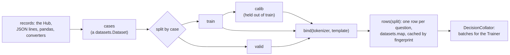
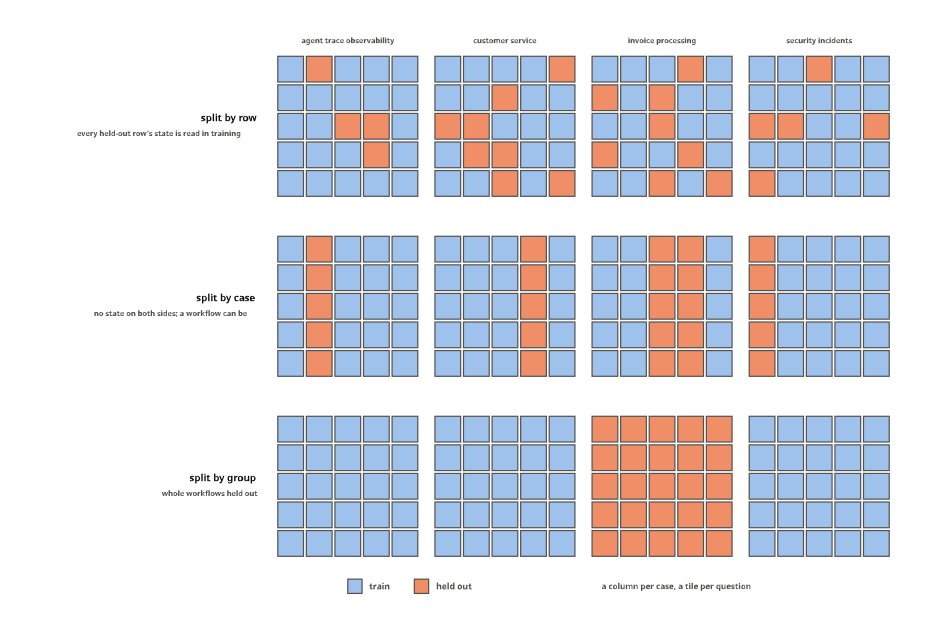
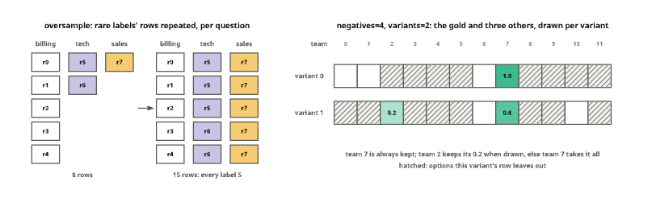
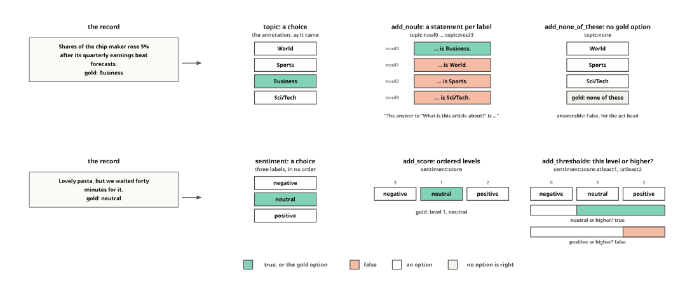
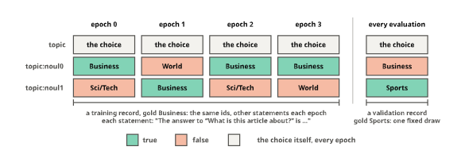

# data


<!-- WARNING: THIS FILE WAS AUTOGENERATED! DO NOT EDIT! -->

One record format serves every application: a case with a `state`, its
`questions` and, for training, the `gold` answers.
[`TypedDecisions`](https://sgaseretto.github.io/sysonelib/data.html#typeddecisions)
holds the cases of three splits,
[`train`](https://sgaseretto.github.io/sysonelib/cli.html#train),
`valid` for metrics, and `calib`, a slice of train held out for
temperature fitting. Splits are made by case, never by row, so the five
questions of one state always land in the same split, and calibration
never sees a row the model trained on (the Laya notebook’s own
correction). Rows are made later, once an encoder has been chosen,
because a row is token ids and the tokenizer is the encoder’s.

## Cases

Cases are stored as a `datasets.Dataset` with the state as text (JSON
for structured states, as typed-decisions stores it) and the questions
and gold as JSON strings. Heterogeneous question sets, five different
questions per workflow, would otherwise become one wide struct with
nulls.

The path from records to batches:

<div>

<figure class=''>

<div>



</div>

</figure>

</div>

------------------------------------------------------------------------

<a
href="https://github.com/sgaseretto/sysonelib/blob/main/sysone/data.py#L58"
target="_blank" style="float:right; font-size:smaller">source</a>

### case_record

``` python
def case_record(
    cases:datasets.arrow_dataset.Dataset, i:int
)->dict:
```

*Case i as a parsed record*

------------------------------------------------------------------------

<a
href="https://github.com/sgaseretto/sysonelib/blob/main/sysone/data.py#L49"
target="_blank" style="float:right; font-size:smaller">source</a>

### as_cases

``` python
def as_cases(
    ds
)->datasets.arrow_dataset.Dataset:
```

*A cases dataset from a `datasets.Dataset` with `state` and `questions`
columns (strings or structures)*

------------------------------------------------------------------------

<a
href="https://github.com/sgaseretto/sysonelib/blob/main/sysone/data.py#L38"
target="_blank" style="float:right; font-size:smaller">source</a>

### cases_from_records

``` python
def cases_from_records(
    records, prefix:str='case'
)->datasets.arrow_dataset.Dataset:
```

*A cases dataset from an iterable of records (dicts with `state`,
`questions`, optional `gold` and `id`)*

``` python
recs = [json.loads(l) for l in Path("fixtures/typed_decisions_tiny.jsonl").read_text().splitlines()]
cs = cases_from_records(recs)
cs
```

    Dataset({
        features: ['id', 'state', 'questions', 'gold', 'workflow'],
        num_rows: 20
    })

``` python
import pandas as pd
```

``` python
test_eq(case_record(cs, 3)["questions"], recs[3]["questions"])
test_eq(cs[0]["workflow"], "agent_trace_observability")
test_eq(as_cases(cs), cs)
test_eq(cases_from_records([{"state": "text", "questions": {}}])[0]["id"], "case_000000")
test_eq(case_record(cases_from_records([{"state": '"quoted" text', "questions": {}}]), 0)["state"], '"quoted" text')
test_eq(len(cases_from_records(pd.DataFrame({"state": ["a"], "questions": [{}], "when": [pd.Timestamp("2026-01-01")]}).to_dict("records"))), 1)
```

### Splits by case

[`split_cases`](https://sgaseretto.github.io/sysonelib/data.html#split_cases)
holds out a fraction (or a count) of cases with a seeded draw, keeping
both parts in their original order. With `groups` it holds out whole
groups instead, drawn in a seeded order until the fraction is reached,
so no group has cases on both sides. `groups` names a column of the
cases (a record’s top-level field, such as a sequence cluster id) or is
a function of the record:

------------------------------------------------------------------------

<a
href="https://github.com/sgaseretto/sysonelib/blob/main/sysone/data.py#L69"
target="_blank" style="float:right; font-size:smaller">source</a>

### split_cases

``` python
def split_cases(
    cases:datasets.arrow_dataset.Dataset, frac, seed:int=0, groups:NoneType=None
):
```

*Two datasets: the cases kept and the `frac` (a fraction or a count)
held out; with `groups`, whole groups are held out*

------------------------------------------------------------------------

<a
href="https://github.com/sgaseretto/sysonelib/blob/main/sysone/data.py#L63"
target="_blank" style="float:right; font-size:smaller">source</a>

### case_groups

``` python
def case_groups(
    cases:datasets.arrow_dataset.Dataset, groups
)->list:
```

*The group of each case: a column of the cases, or `groups(record)`*

``` python
a, b = split_cases(cs, 0.25)
test_eq((len(a), len(b)), (15, 5))
test_eq(set(a["id"]) & set(b["id"]), set())
test_eq(split_cases(cs, 0.25)[1]["id"], b["id"])
test_eq(split_cases(cs, 0)[1], None)
ga, gb = split_cases(cs, 0.25, groups="workflow")          # the fixture's 20 cases come from 4 workflows, 5 each
test_eq(set(ga["workflow"]) & set(gb["workflow"]), set())
test_eq(len(gb), 5)
test_eq(split_cases(cs, 0.25, groups=lambda r: r["workflow"])[1]["id"], gb["id"])
```

Why cases and not rows: the five questions of a case share one state, so
a split drawn over rows puts almost every held-out row’s state in
training too, and the validation score measures recall of states the
model has read:

``` python
row_ids = [(i, qid) for i in range(len(cs)) for qid in json.loads(cs[i]["questions"])]
held = set(random.Random(0).sample(range(len(row_ids)), len(row_ids) // 4))
seen = {row_ids[j][0] for j in range(len(row_ids)) if j not in held}
leaked = sum(row_ids[j][0] in seen for j in held) / len(held)
test_eq(leaked > 0.9, True)
f"a random quarter of the {len(row_ids)} rows held out: {leaked:.0%} of them ask about a state that training rows also contain; split by case: 0%"
```

    'a random quarter of the 100 rows held out: 100% of them ask about a state that training rows also contain; split by case: 0%'

The same leak recurs one level up whenever cases come in families:
proteins from one sequence cluster, photos from one shoot (the [images
tutorial](tutorials/01_neomme_images.ipynb#photos-from-the-same-shoot)
found 17 of 40 held-out hot dogs next to a training photo of the same
scene), messages from one user. A split by case keeps each case whole,
and a split by group keeps each family whole. The loaders take `groups=`
and pass it to both held-out splits.

<figure>

<figcaption aria-hidden="true">The fixture’s twenty cases, a column each
and a tile per question, under a split by row, by case and by
group</figcaption>
</figure>

The fixture’s cases under the three splits
([figures](90_figures.ipynb#splits-by-row-by-case-and-by-group)). Split
by row, the held-out tiles are scattered, and each shares its column,
its state, with tiles in training. Split by case, columns move whole,
but a held-out case’s workflow can still have cases in training; split
by group, whole workflows move.

## TypedDecisions

------------------------------------------------------------------------

<a
href="https://github.com/sgaseretto/sysonelib/blob/main/sysone/data.py#L88"
target="_blank" style="float:right; font-size:smaller">source</a>

### TypedDecisions

``` python
def TypedDecisions(
    train, # training cases: a `datasets.Dataset` or a list of records
    valid:NoneType=None, # validation cases, for metrics
    calib:NoneType=None, # held-out training cases, for temperature fitting
    template:sysone.template.RowTemplate | str | None=None, # row template; the encoder's default when None
    tfms:list | None=None, # transforms, run on every record at training and inference
    sampler:NoneType=None, # a `RowSampler`; every record once when None
    seed:int=0
):
```

*Typed-decision cases in train, valid and calib splits, and the token
rows a
[`RowBuilder`](https://sgaseretto.github.io/sysonelib/template.html#rowbuilder)
makes from them*

### Loaders

`from_records`, `from_json`, `from_pandas` and `from_hub` all make the
same object. `valid` takes a split name (a Hub split, or `"test"`) or a
fraction of train; `calib` holds out a fraction of the remaining train
cases, 10% by default. `from_hub` picks the `all` config when a dataset
has several and no config is named, as typed-decisions does. Each loader
also notes where the cases came from in `source`: a Hub dataset’s id,
config and revision, or a file’s name and hash, never its path. The
[training record](05a_record.ipynb) keeps it.

------------------------------------------------------------------------

<a
href="https://github.com/sgaseretto/sysonelib/blob/main/sysone/data.py#L158"
target="_blank" style="float:right; font-size:smaller">source</a>

### TypedDecisions.from_hub

``` python
def from_hub(
    path:str, config:str | None=None, split:str='train', valid:NoneType=None, calib:float=0.1,
    revision:str | None=None, seed:int=0, groups:NoneType=None, **kw
):
```

*Cases from a Hub dataset in the typed-decisions format; `valid` is a
split name or a fraction of `split`*

------------------------------------------------------------------------

<a
href="https://github.com/sgaseretto/sysonelib/blob/main/sysone/data.py#L142"
target="_blank" style="float:right; font-size:smaller">source</a>

### TypedDecisions.from_pandas

``` python
def from_pandas(
    df, valid:NoneType=None, calib:float=0.1, seed:int=0, groups:NoneType=None, **kw
):
```

*Cases from a DataFrame with `state` and `questions` (and `gold`)
columns*

------------------------------------------------------------------------

<a
href="https://github.com/sgaseretto/sysonelib/blob/main/sysone/data.py#L134"
target="_blank" style="float:right; font-size:smaller">source</a>

### TypedDecisions.from_json

``` python
def from_json(
    path, valid:NoneType=None, calib:float=0.1, seed:int=0, groups:NoneType=None, **kw
):
```

*Cases from a JSON-lines file, one record per line; `valid` may be a
second file*

------------------------------------------------------------------------

<a
href="https://github.com/sgaseretto/sysonelib/blob/main/sysone/data.py#L127"
target="_blank" style="float:right; font-size:smaller">source</a>

### read_jsonl

``` python
def read_jsonl(
    path
)->list:
```

*Records from a JSON-lines file (or a JSON list)*

------------------------------------------------------------------------

<a
href="https://github.com/sgaseretto/sysonelib/blob/main/sysone/data.py#L123"
target="_blank" style="float:right; font-size:smaller">source</a>

### file_ref

``` python
def file_ref(
    path
)->dict:
```

*A file’s name and SHA-256: enough to tell later whether a model was
trained on the same data, without its path*

------------------------------------------------------------------------

<a
href="https://github.com/sgaseretto/sysonelib/blob/main/sysone/data.py#L116"
target="_blank" style="float:right; font-size:smaller">source</a>

### TypedDecisions.from_records

``` python
def from_records(
    records, valid:NoneType=None, calib:float=0.1, seed:int=0, groups:NoneType=None, **kw
):
```

*Cases from a list of records; `groups` (a field or a function of the
record) keeps each group on one side of every split*

``` python
data = TypedDecisions.from_json("fixtures/typed_decisions_tiny.jsonl", valid=0.2, calib=0.1)
data
```

    TypedDecisions(14 train, 4 valid, 2 calib cases · template default · 0 tfms)

``` python
test_eq((data.source["kind"], data.source["files"][0]["name"]), ("file", "typed_decisions_tiny.jsonl"))
test_eq(len(data.source["files"][0]["sha256"]), 64)
test_eq(TypedDecisions.from_records([json.loads(l) for l in Path("fixtures/typed_decisions_tiny.jsonl").read_text().splitlines()]).source, {"kind": "records"})
```

``` python
test_eq({k: len(v) for k, v in data.cases.items()}, {"train": 14, "valid": 4, "calib": 2})
test_eq(TypedDecisions.from_records(recs, calib=0).cases["calib"], None)
gd = TypedDecisions.from_records(recs, valid=0.25, calib=0.2, groups="workflow")
test_eq(set(gd.cases["train"]["workflow"]) & (set(gd.cases["valid"]["workflow"]) | set(gd.cases["calib"]["workflow"])), set())
```

``` python
td = TypedDecisions.from_hub("LocalLLaMA/typed-decisions", valid="test")
td
```

    TypedDecisions(1080 train, 400 valid, 120 calib cases · template default · 0 tfms)

## Rows

`bind` gives the data a tokenizer (or a processor), a template and any
side streams, and `rows(split)` turns the split’s cases into rows with
`datasets.map`: one row per question, `input_ids`, `markers`, `qtype`,
the gold `target` and `label`, whether the gold `answerable` the
question, the option `spans`, each side stream’s ids and mask, the
length `n_tokens` for length-grouped batching, and the case and question
ids. A row without gold is dropped, since it has nothing to teach; an
unanswerable one is kept, with a zero target that the option loss skips,
because it teaches the act head to escalate. The map’s fingerprint is
the cases’ fingerprint plus the builder’s (template, transforms and
tokenizer), so a Hub dataset re-uses its cached rows on the next run
with the same encoder, and any change rebuilds them.

------------------------------------------------------------------------

<a
href="https://github.com/sgaseretto/sysonelib/blob/main/sysone/data.py#L184"
target="_blank" style="float:right; font-size:smaller">source</a>

### TypedDecisions.bind

``` python
def bind(
    tokenizer, template:sysone.template.RowTemplate | str | None=None, streams:NoneType=None
):
```

*Build rows with `tokenizer` (or a processor), `template` (else the
data’s, else the `auto` preset) and side `streams`*

------------------------------------------------------------------------

<a
href="https://github.com/sgaseretto/sysonelib/blob/main/sysone/data.py#L177"
target="_blank" style="float:right; font-size:smaller">source</a>

### row_features

``` python
def row_features(
    builder:sysone.template.RowBuilder | None=None
)->datasets.features.features.Features:
```

*The columns of a split’s rows: `ROW_FEATURES`, the option spans, and
each side stream’s ids and mask*

------------------------------------------------------------------------

<a
href="https://github.com/sgaseretto/sysonelib/blob/main/sysone/data.py#L225"
target="_blank" style="float:right; font-size:smaller">source</a>

### TypedDecisions.rows

``` python
def rows(
    split:str='train'
)->datasets.arrow_dataset.Dataset:
```

*The rows of a split (built once per binding)*

``` python
tok = AutoTokenizer.from_pretrained("fixtures/tiny-modernbert")
data.bind(tok, "laya")
tr = data.rows("train")
tr
```

    Dataset({
        features: ['input_ids', 'markers', 'qtype', 'target', 'label', 'answerable', 'n_tokens', 'case', 'qid', 'case_idx', 'variant', 'spans'],
        num_rows: 70
    })

``` python
test_eq(len(tr), 14 * 5)
test_eq(set(tr["qtype"]), {0, 1, 2})
r = Row.from_dict(tr[0])
test_eq([r.ids[m] for m in r.markers], [tok.mask_token_id] * r.k)
test_eq([r.ids[s - 1] for s, e in r.spans], [tok.mask_token_id] * r.k)
test_eq(len(data.rows("valid")), 20)
test_eq(set(tr["answerable"]), {1})
```

A side stream’s inputs are columns of the rows, and an unanswerable case
stays in: a record marked `{"answerable": false}` gives a row with a
zero target and `answerable` 0, while a case without gold gives no row.
The fixture’s text tokenizer stands in for a stream’s own tokenizer:

``` python
srecs = [dict(r, state={"text": r["state"] if isinstance(r["state"], str) else json.dumps(r["state"]), "notes": f"note {i}"}) for i, r in enumerate(recs[:4])]
q0 = next(iter(srecs[0]["questions"]))
srecs[1] = dict(srecs[1], gold={**srecs[1]["gold"], next(iter(srecs[1]["questions"])): {"answerable": False}})
sd = TypedDecisions.from_records(srecs, calib=0, tfms=[Stream("notes")]).bind(tok, "laya", streams=[TokenStream("notes", tok, max_len=16)])
srows = sd.rows("train")
test_eq({"notes_input_ids", "notes_attention_mask", "spans", "answerable"} <= set(srows.column_names), True)
test_eq(sorted(set(srows["answerable"])), [0, 1])
un = srows.filter(lambda r: r["answerable"] == 0)[0]
test_eq((sum(un["target"]), un["label"]), (0.0, -1))
test_eq(collate([srows[0], srows[1]])["notes_input_ids"].shape[0], 2)
```

### show_batch

`show_batch` prints rows with their anchors visible. Before a tokenizer
is bound it renders the template as text instead, which is enough to see
the layout:

------------------------------------------------------------------------

<a
href="https://github.com/sgaseretto/sysonelib/blob/main/sysone/data.py#L257"
target="_blank" style="float:right; font-size:smaller">source</a>

### TypedDecisions.show_batch

``` python
def show_batch(
    n:int=2, split:str='train', max_chars:int=300
):
```

*Print the first `n` rows of a split*

``` python
TypedDecisions.from_records(recs[:1], calib=0).show_batch(1)
```

    [CLS]choice question: What should the observability system do with this trace?[SEP][MASK] continue: Let the agent proceed without interruption.[MASK] human_review: Queue this trace for a human to revi … _violations": 0, "duration_s": 128.5, "irreversible_actions": 0, "steps": 7, "tool_errors": 1}}[SEP]

``` python
data.show_batch(2)
```

    [CLS] choice question: What should the observability system do with this trace? [SEP] [MASK] continue: Let the agent proceed without interruption. [MASK] human_review: Queue this trace for a human to  … violations": 0, "duration_s": 128.5, "irreversible_actions": 0, "steps": 7, "tool_errors": 1}} [SEP]
    markers [20, 31, 45, 60] · qtype choice · 163 tokens

    [CLS] noul question: This trace requires human review. [SEP] [MASK] false: No human attention is warranted. [MASK] true: A human should inspect this run. [SEP] {"agent": {"autonomy": "checkpointed", " … violations": 0, "duration_s": 128.5, "irreversible_actions": 0, "steps": 7, "tool_errors": 1}} [SEP]
    markers [15, 24] · qtype noul · 129 tokens

### Collation

[`DecisionCollator`](https://sgaseretto.github.io/sysonelib/data.html#decisioncollator)
pads a list of dataset rows into a
[`Batch`](https://sgaseretto.github.io/sysonelib/core.html#batch) for
`transformers.Trainer`; it is `core.collate` with the tokenizer’s pad
id, dropping the bookkeeping columns:

------------------------------------------------------------------------

<a
href="https://github.com/sgaseretto/sysonelib/blob/main/sysone/data.py#L285"
target="_blank" style="float:right; font-size:smaller">source</a>

### TypedDecisions.collator

``` python
def collator()->__main__.DecisionCollator:
```

*The collator for this data’s tokenizer*

------------------------------------------------------------------------

<a
href="https://github.com/sgaseretto/sysonelib/blob/main/sysone/data.py#L276"
target="_blank" style="float:right; font-size:smaller">source</a>

### DecisionCollator

``` python
def DecisionCollator(
    pad_id:int=0
):
```

*Collate dataset rows into a padded
[`Batch`](https://sgaseretto.github.io/sysonelib/core.html#batch)*

``` python
b = data.collator([tr[i] for i in range(6)])
test_eq(b["input_ids"].shape[0], 6)
test_eq(b["target"].shape, b["marker_mask"].shape)
{k: tuple(v.shape) for k, v in b.items()}
```

    {'input_ids': (6, 178),
     'attention_mask': (6, 178),
     'marker_pos': (6, 4),
     'marker_mask': (6, 4),
     'qtype': (6,),
     'target': (6, 4),
     'label': (6,),
     'spans': (6, 4, 2),
     'answerable': (6,)}

### Lazy rows

Two cases cannot be pre-built into a static dataset: augmentation that
must differ every epoch
([`Shuffle`](https://sgaseretto.github.io/sysonelib/template.html#shuffle),
a resampled negative set), and images, whose pixel values are megabytes
per row. For both, `lazy_rows` returns a dataset that builds each row
when it is read, from its case, with the current epoch’s randomness; its
`lengths` come from the static build so length-grouped sampling still
works.

------------------------------------------------------------------------

<a
href="https://github.com/sgaseretto/sysonelib/blob/main/sysone/data.py#L317"
target="_blank" style="float:right; font-size:smaller">source</a>

### TypedDecisions.needs_lazy_rows

``` python
def needs_lazy_rows()->bool:
```

*Whether training rows must be rebuilt on read (train-only transforms,
or a processor with images)*

------------------------------------------------------------------------

<a
href="https://github.com/sgaseretto/sysonelib/blob/main/sysone/data.py#L311"
target="_blank" style="float:right; font-size:smaller">source</a>

### TypedDecisions.lazy_rows

``` python
def lazy_rows(
    split:str='train'
)->__main__.LazyRows:
```

*Rows of a split, built on read*

------------------------------------------------------------------------

<a
href="https://github.com/sgaseretto/sysonelib/blob/main/sysone/data.py#L291"
target="_blank" style="float:right; font-size:smaller">source</a>

### LazyRows

``` python
def LazyRows(
    data:__main__.TypedDecisions, split:str='train'
):
```

*Rows built when read, from their case: for per-epoch augmentation and
for image rows*

``` python
sh = TypedDecisions.from_records(recs, calib=0, tfms=[Shuffle(seed=0)]).bind(tok, "laya")
test_eq(sh.needs_lazy_rows, True)
lz = sh.lazy_rows()
test_eq(len(lz), 100)
e0 = [lz[i]["input_ids"] for i in range(10)]
sh.tfms[0].set_epoch(1)
e1 = [lz[i]["input_ids"] for i in range(10)]
test_ne(e0, e1)                                   # new option orders in a new epoch
test_eq([sorted(x) for x in e0], [sorted(x) for x in e1])
test_close(sorted(lz[0]["target"]), sorted(sh.rows()[0]["target"]), eps=1e-6)
ids = ("case", "qid", "case_idx", "variant")
test_eq([{k: lz[i][k] for k in ids} for i in range(5)], [{k: sh.rows()[i][k] for k in ids} for i in range(5)])   # a row built on read knows its case
```

Rows are found again by their case’s position, not its id, so cases that
share an id (two converted datasets concatenated, say) still come back
as themselves:

``` python
twins = [dict(recs[0], id="same"), dict(recs[5], id="same")]
tw = TypedDecisions.from_records(twins, calib=0, tfms=[Shuffle()]).bind(tok, "laya")
for i, ci in ((0, 0), (5, 1)):
    ref = tw.builder.build_record(case_record(tw.cases["train"], ci), train=True)[0]
    test_eq((tw.lazy_rows()[i]["input_ids"], tw.lazy_rows()[i]["label"]), (ref.ids, ref.label))
```

A row is rebuilt from its whole case, transformed as the static build
transforms it, and only then cut down to its question. Two things depend
on that order. A transform may add questions, like the reshaping
transforms below, and the question a row stands for must exist before it
can be picked. And transforms that draw per case, like
[`Shuffle`](https://sgaseretto.github.io/sysonelib/template.html#shuffle),
then draw the same way for every question of the case, so at epoch 0 a
row built on read is exactly the static row:

``` python
sh0 = TypedDecisions.from_records(recs, calib=0, tfms=[Shuffle(seed=0)]).bind(tok, "laya")
lz0, st0 = sh0.lazy_rows(), sh0.rows()
test_eq([lz0[i]["input_ids"] for i in range(len(st0))], st0["input_ids"])
```

## Sampling

SetFit’s contrastive phase does not transfer: the softmax across a row’s
options already is a contrastive objective, the gold option against the
distractors the task designer wrote. Its sampling strategies do, adapted
to rows.
[`RowSampler`](https://sgaseretto.github.io/sysonelib/data.html#rowsampler)
has four:

- `all`: every record once, every option in its row (the default);
- `oversample`: repeat rows whose gold label is rare for their question,
  cycling through them (SetFit’s wrap-around oversampling) until every
  label of a question is as frequent as its commonest;
- `negatives=k`: for choice questions with more than k options, keep the
  gold option and k − 1 distractors drawn at random, renormalising the
  soft target over the kept ones (GLiNER’s negative sampling);
- `hard`: like `negatives`, but the distractors are the options most
  similar to the gold one under a sentence-transformer, so the row’s
  negatives are the confusable ones (needs `sentence-transformers`).

`negatives` and `hard` draw per record; `variants=n` draws n versions of
every record, which is how they combine with a static feature cache.

<figure>

<figcaption aria-hidden="true">RowSampler’s oversample, rare labels’
rows repeated until every label is as frequent as the commonest; and
negatives=4 with two variants, the gold option and three others in
each</figcaption>
</figure>

Two of the strategies on small examples
([figures](90_figures.ipynb#which-rows-an-epoch-sees)): `oversample`
cycles through a question’s rare labels’ rows until each label has as
many rows as the commonest, and `negatives=4` keeps the gold option and
three others in each variant, with the soft gold renormalised over the
options it kept.

------------------------------------------------------------------------

<a
href="https://github.com/sgaseretto/sysonelib/blob/main/sysone/data.py#L323"
target="_blank" style="float:right; font-size:smaller">source</a>

### RowSampler

``` python
def RowSampler(
    strategy:str='all', negatives:int | None=None, variants:int=1, model:str='BAAI/bge-small-en-v1.5', seed:int=0
):
```

*Which rows a training epoch sees: `all`, `oversample`, or `negatives=k`
/ `hard` distractor sampling*

------------------------------------------------------------------------

<a
href="https://github.com/sgaseretto/sysonelib/blob/main/sysone/data.py#L381"
target="_blank" style="float:right; font-size:smaller">source</a>

### RowSampler.resample

``` python
def resample(
    rows:datasets.arrow_dataset.Dataset
)->datasets.arrow_dataset.Dataset:
```

*Oversample rare labels per question, cycling through their rows*

------------------------------------------------------------------------

<a
href="https://github.com/sgaseretto/sysonelib/blob/main/sysone/data.py#L366"
target="_blank" style="float:right; font-size:smaller">source</a>

### RowSampler.expand

``` python
def expand(
    record:dict, builder:NoneType=None
)->list:
```

*The records one training record becomes (`variants` draws for the
negative strategies)*

``` python
many = {"state": "The printer on floor 3 is jammed again.",
        "questions": {"dept": {"type": "choice", "instructions": "Which team?",
                               "criteria": {f"team {i}": f"handles area {i}" for i in range(12)}}},
        "gold": {"dept": {"label": "team 7", "probabilities": {"team 7": 0.8, "team 2": 0.2}}}}
neg = RowSampler("negatives", negatives=4, variants=2)
vs = neg.expand(many)
test_eq(len(vs), 2)
test_eq(len(vs[0]["questions"]["dept"]["criteria"]), 4)
assert "team 7" in vs[0]["questions"]["dept"]["criteria"] and "team 7" in vs[1]["questions"]["dept"]["criteria"]
test_ne(list(vs[0]["questions"]["dept"]["criteria"]), list(vs[1]["questions"]["dept"]["criteria"]))
test_eq(sum(vs[0]["gold"]["dept"]["probabilities"].values()), 1.0)
```

``` python
ov = TypedDecisions.from_records(recs, calib=0, sampler=RowSampler("oversample")).bind(tok, "laya")
counts = Counter((q, l) for q, l in zip(ov.rows()["qid"], ov.rows()["label"]))
per_q = defaultdict(set)
for (q, l), c in counts.items(): per_q[q].add(c)
test_eq(all(len(v) == 1 for v in per_q.values()), True)   # every label of a question equally frequent
```

``` python
ng = TypedDecisions.from_records([many] * 3, calib=0, sampler=RowSampler("negatives", negatives=3, variants=2)).bind(tok, "laya")
test_eq(len(ng.rows()), 6)
test_eq(set(len(m) for m in ng.rows()["markers"]), {3})
```

Rows built on read follow the sampler too, variant by variant, and
integer labels keep their soft gold through the sampling:

``` python
ngl = TypedDecisions.from_records([many] * 3, calib=0, tfms=[Shuffle()], sampler=RowSampler("negatives", negatives=3, variants=2)).bind(tok, "laya")
test_eq([len(ngl.lazy_rows()[i]["markers"]) for i in range(6)], [3] * 6)
ints = {"state": "x", "questions": {"q": {"type": "choice", "instructions": "?", "criteria": list(range(10))}},
        "gold": {"q": {"label": 7, "probabilities": {"7": 0.7, "3": 0.3}}}}
kept = RowSampler("negatives", negatives=4).expand(ints)[0]
test_eq(Question.from_dict(kept["questions"]["q"]).target(kept["gold"]["q"])[0] != [0.25] * 4, True)
test_close(max(kept["gold"]["q"]["probabilities"].values()), 0.7 if 3 in kept["questions"]["q"]["criteria"] else 1.0)
```

## Shortlists

When a question has more options than a row can hold well (Laya degrades
above about twenty), a bi-encoder can shortlist them first:
[`Shortlist`](https://sgaseretto.github.io/sysonelib/data.html#shortlist)
embeds the option texts and the state, keeps the top k options by cosine
similarity, and the decision is made among those. Dropped options are
recorded in the record, so the
[`Decider`](https://sgaseretto.github.io/sysonelib/inference.html#decider)
reports them with probability 0 and a flag; the same transform builds
the training rows, so training and inference match. It is the
rerank-cookbook pattern, and the answer to wide label sets that does not
touch the budgets. It needs `sentence-transformers`.

------------------------------------------------------------------------

<a
href="https://github.com/sgaseretto/sysonelib/blob/main/sysone/data.py#L394"
target="_blank" style="float:right; font-size:smaller">source</a>

### Shortlist

``` python
def Shortlist(
    model:str='BAAI/bge-small-en-v1.5', k:int=12, min_options:int | None=None
):
```

*Keep the k options of each choice question most similar to the state
under a sentence-transformer*

``` python
sl = Shortlist(k=3)
out = sl(many)
out["questions"]["dept"]["criteria"], out["dropped"]["dept"]
```

## One label, several questions

An annotation answers one question, but the same fact can be asked in
other shapes. A choice among four topics is also four statements, one
per topic, of which one is true; that is the shape NLI-based zero-shot
classifiers answer (Yin et al. 2019) and TARS trains on (Halder et
al. 2020). A choice among ordered labels is also a score, and a score
with k levels is also k − 1 statements, “is the answer this level or
higher?”, which is how Frank and Hall (2001) reduce ordinal labels to
binary ones. A choice with its gold options removed is a question none
of its options answers, which is what the act head learns to hand over.

The functions below reshape one record:
[`add_nouls`](https://sgaseretto.github.io/sysonelib/data.html#add_nouls),
[`add_none_of_these`](https://sgaseretto.github.io/sysonelib/data.html#add_none_of_these),
[`add_score`](https://sgaseretto.github.io/sysonelib/data.html#add_score)
and
[`add_thresholds`](https://sgaseretto.github.io/sysonelib/data.html#add_thresholds).
Each keeps the question it reshapes (unless `keep=False`) and adds the
new ones under ids made from its id, each marked with `from`, the
question it was made from. Reshaping adds no fact the annotation did not
hold; it changes how often the model reads each state, and how often
each kind of answer is right, which the last part of this section
counts.

<figure>

<figcaption aria-hidden="true">A news article’s choice asked as four
statements and as a copy with no right option; a review’s sentiment
asked as a score and as two thresholds</figcaption>
</figure>

The two records below, reshaped
([figures](90_figures.ipynb#a-label-asked-in-several-shapes)): the news
article’s topic as four statements, one true, and as a copy with no
right option; the review’s sentiment as a score and as two thresholds.
Every colour is a gold the functions wrote from the one annotation.

### Choices as nouls

[`add_nouls`](https://sgaseretto.github.io/sysonelib/data.html#add_nouls)
asks a choice again as one noul per label, the statement that the answer
is that label. The default wording quotes the choice’s own instructions,
so the statement claims no more than the annotation did: that this label
is *the* answer. With `negatives=m`, only the gold labels and m others
become nouls, drawn by `rng`; with every label, a choice with k labels
gives k − 1 false statements for each true one. A soft gold carries over
(each label’s probability is its statement’s p(true)), and `soft`
qualifies a hard one: `{"Business": {"Sci/Tech": 0.2}}` makes the
statement “Sci/Tech” true with probability 0.2 when the gold is
Business, for labels that overlap.

------------------------------------------------------------------------

<a
href="https://github.com/sgaseretto/sysonelib/blob/main/sysone/data.py#L456"
target="_blank" style="float:right; font-size:smaller">source</a>

### add_nouls

``` python
def add_nouls(
    record:dict, qid:NoneType=None, negatives:int | None=None,
    statement:str='The answer to "{instructions}" is {option}.', soft:dict | None=None, keep:bool=True,
    rng:NoneType=None
)->dict:
```

*The record with its choice questions (or `qid`) also asked as nouls:
one per label, or per gold label and `negatives` others*

------------------------------------------------------------------------

<a
href="https://github.com/sgaseretto/sysonelib/blob/main/sysone/data.py#L441"
target="_blank" style="float:right; font-size:smaller">source</a>

### choice_nouls

``` python
def choice_nouls(
    q:sysone.core.Choice, gold:NoneType=None, keys:NoneType=None,
    statement:str='The answer to "{instructions}" is {option}.', soft:dict | None=None
)->list:
```

*A `(definition, gold)` noul per label of `q` (or of `keys`): the
statement that the answer is that label, as true as the gold makes it*

``` python
news = {"id": "n1", "state": "Shares of the chip maker rose 5% after its quarterly earnings beat forecasts.",
        "questions": {"topic": {"type": "choice", "instructions": "What is this article about?",
                                "criteria": ["World", "Sports", "Business", "Sci/Tech"]}},
        "gold": {"topic": "Business"}}
ex = add_nouls(news)
[(k, d["instructions"], ex["gold"][k]) for k, d in ex["questions"].items()]
```

    [('topic', 'What is this article about?', 'Business'),
     ('topic:noul0',
      'The answer to "What is this article about?" is Business.',
      {'label': 'true'}),
     ('topic:noul1',
      'The answer to "What is this article about?" is World.',
      {'label': 'false'}),
     ('topic:noul2',
      'The answer to "What is this article about?" is Sports.',
      {'label': 'false'}),
     ('topic:noul3',
      'The answer to "What is this article about?" is Sci/Tech.',
      {'label': 'false'})]

``` python
nouls = {k: g for k, g in ex["gold"].items() if k != "topic"}
test_eq(sorted(g["label"] for g in nouls.values()), ["false", "false", "false", "true"])
test_eq(all(ex["questions"][k]["from"] == {"question": "topic", "type": "choice"} for k in nouls), True)
two = add_nouls(news, negatives=1)
test_eq(list(two["questions"]), ["topic", "topic:noul0", "topic:noul1"])                 # the gold and one other
test_eq(sorted(two["gold"][k]["label"] for k in ("topic:noul0", "topic:noul1")), ["false", "true"])
soft = add_nouls(news, soft={"Business": {"Sci/Tech": 0.2}})
test_eq({soft["questions"][k]["instructions"].split(" is ")[-1]: soft["gold"][k] for k in soft["gold"] if k != "topic"},
        {"Business.": {"label": "true"}, "World.": {"label": "false"}, "Sports.": {"label": "false"}, "Sci/Tech.": {"noul": 0.2}})
mix = add_nouls(dict(news, gold={"topic": {"probabilities": {"Business": 0.7, "Sci/Tech": 0.3}}}), negatives=0)
test_eq(sorted(map(str, mix["gold"].values()))[:2], ["{'noul': 0.3}", "{'noul': 0.7}"])        # every label with probability, no other
test_eq([g for k, g in add_nouls(dict(news, gold={"topic": {"answerable": False}}))["gold"].items() if k != "topic"], [{"label": "false"}] * 4)
test_eq("topic" in add_nouls(news, keep=False)["questions"], False)
test_eq(add_nouls(news, statement="This article is mainly about {label}.")["questions"]["topic:noul0"]["instructions"].startswith("This article is mainly about "), True)
```

### None of these

[`add_none_of_these`](https://sgaseretto.github.io/sysonelib/data.html#add_none_of_these)
adds a copy of a choice without its gold options, for a fraction `frac`
of the records, chosen by their id. No option answers the copy, so its
gold is `{"answerable": False}`: the option loss skips its row, and the
act head learns from it to hand the case over instead of acting.

------------------------------------------------------------------------

<a
href="https://github.com/sgaseretto/sysonelib/blob/main/sysone/data.py#L480"
target="_blank" style="float:right; font-size:smaller">source</a>

### add_none_of_these

``` python
def add_none_of_these(
    record:dict, qid:NoneType=None, frac:float=1.0, seed:int=0
)->dict:
```

*For a `frac` of records, a copy of their choice questions (or `qid`)
without the gold options: a question none of its options answers*

``` python
nn = add_none_of_these(news)
test_eq((nn["questions"]["topic:none"]["criteria"], nn["gold"]["topic:none"]), (["World", "Sports", "Sci/Tech"], {"answerable": False}))
test_eq(Question.from_dict(nn["questions"]["topic:none"]).answerable(nn["gold"]["topic:none"]), 0)
test_eq(add_none_of_these(add_none_of_these(news))["questions"].keys(), nn["questions"].keys())     # a copy is not copied again
some = [add_none_of_these(dict(news, id=f"n{i}"), frac=0.3) for i in range(200)]
test_close(np.mean(["topic:none" in r["questions"] for r in some]), 0.3, eps=0.1)
```

### Ordered labels: scores and thresholds

A choice whose labels have an order (negative, neutral, positive) can
also be asked as a score, which knows the order:
[`add_score`](https://sgaseretto.github.io/sysonelib/data.html#add_score)
makes one with the labels as its levels.
[`add_thresholds`](https://sgaseretto.github.io/sysonelib/data.html#add_thresholds)
then asks a score as a noul per level above the first, “is the answer
this level or higher?”, true when the gold is at least that level; a
soft gold gives each threshold the probability of the levels above it.

------------------------------------------------------------------------

<a
href="https://github.com/sgaseretto/sysonelib/blob/main/sysone/data.py#L520"
target="_blank" style="float:right; font-size:smaller">source</a>

### add_thresholds

``` python
def add_thresholds(
    record:dict, qid:NoneType=None, statement:str='The answer to "{instructions}" is {level} or higher.',
    keep:bool=True
)->dict:
```

*The record with its score questions (or `qid`) also asked as nouls, one
per level above the first: is the answer that level or higher?*

------------------------------------------------------------------------

<a
href="https://github.com/sgaseretto/sysonelib/blob/main/sysone/data.py#L498"
target="_blank" style="float:right; font-size:smaller">source</a>

### add_score

``` python
def add_score(
    record:dict, qid:str, levels:list | None=None, instructions:str | None=None, keep:bool=True
)->dict:
```

*The record with choice `qid` also asked as a score, its labels in order
(`levels`, else the choice’s own order) as the levels*

``` python
review = {"id": "r1", "state": "Lovely pasta, but we waited forty minutes for it.",
          "questions": {"sentiment": {"type": "choice", "instructions": "What is the sentiment of this review?",
                                      "criteria": ["negative", "neutral", "positive"]}},
          "gold": {"sentiment": "neutral"}}
st = add_thresholds(add_score(review, "sentiment"))
[(k, d["type"], d["instructions"], st["gold"][k]) for k, d in st["questions"].items()]
```

    [('sentiment', 'choice', 'What is the sentiment of this review?', 'neutral'),
     ('sentiment:score',
      'score',
      'What is the sentiment of this review?',
      {'label': '1'}),
     ('sentiment:score:atleast1',
      'noul',
      'The answer to "What is the sentiment of this review?" is neutral or higher.',
      {'label': 'true'}),
     ('sentiment:score:atleast2',
      'noul',
      'The answer to "What is the sentiment of this review?" is positive or higher.',
      {'label': 'false'})]

``` python
test_eq(Question.from_dict(st["questions"]["sentiment:score"]).target(st["gold"]["sentiment:score"]), ([0.0, 1.0, 0.0], 1))
test_eq([st["gold"][f"sentiment:score:atleast{i}"]["label"] for i in (1, 2)], ["true", "false"])
half = add_thresholds(add_score(dict(review, gold={"sentiment": {"probabilities": {"neutral": 0.5, "positive": 0.5}}}), "sentiment"))
test_eq([half["gold"][f"sentiment:score:atleast{i}"] for i in (1, 2)], [{"label": "true"}, {"noul": 0.5}])
rev = add_score(review, "sentiment", levels=["positive", "neutral", "negative"], keep=False)
test_eq((list(rev["questions"]), rev["questions"]["sentiment:score"]["criteria"][0]), (["sentiment:score"], "positive"))
test_fail(lambda: add_score(review, "sentiment", levels=["bad", "good"]), contains="are not the labels")
```

### Drawn every epoch

The same reshapings run as training-only transforms, fastai-style
augmentation for questions:
[`Nouls`](https://sgaseretto.github.io/sysonelib/data.html#nouls),
[`NoneOfThese`](https://sgaseretto.github.io/sysonelib/data.html#noneofthese),
[`AsScore`](https://sgaseretto.github.io/sysonelib/data.html#asscore)
and
[`Thresholds`](https://sgaseretto.github.io/sysonelib/data.html#thresholds)
reshape every training record as its rows are built, and
[`Nouls`](https://sgaseretto.github.io/sysonelib/data.html#nouls) draws
its negatives and its wording (`statement` may be a list) anew every
epoch, which the learner’s epoch callback tells it. The question ids
stay the same from epoch to epoch (`topic:noul0`, `topic:noul1`, …; only
what each one asks changes), which is what lets a row be rebuilt from
its case.
[`Rephrase`](https://sgaseretto.github.io/sysonelib/data.html#rephrase)
varies the wording of the original questions the same way. None of them
runs at inference, and their parameters are saved with the export like
any transform.

Evaluation needs one fixed draw instead:
[`expand_records`](https://sgaseretto.github.io/sysonelib/data.html#expand_records)
reshapes a list of records as training would at a given epoch, and
[`TypedDecisions.expand_eval`](https://sgaseretto.github.io/sysonelib/data.html#typeddecisions.expand_eval)
does it to the valid and calib splits, so the metrics and the
temperatures (fitted per type and number of options) cover the new
questions. A frozen encoder with cached features reads its training rows
once, so with a cache, `expand_records(..., variants=n)` is how to give
it several draws; each copy keeps its source’s id as `parent`, for
`groups=`.

<figure>

<figcaption aria-hidden="true">Nouls(negatives=1) on a training record
at four epochs, the same two statement ids asking other labels, and a
validation record’s one fixed draw</figcaption>
</figure>

`Nouls(negatives=1)` on the news article at four epochs, and on a
validation article
([figures](90_figures.ipynb#drawn-every-epoch-fixed-for-evaluation)):
the ids `topic:noul0` and `topic:noul1` stay, the label each statement
names is drawn anew every epoch, and the validation record keeps its one
draw.

------------------------------------------------------------------------

<a
href="https://github.com/sgaseretto/sysonelib/blob/main/sysone/data.py#L575"
target="_blank" style="float:right; font-size:smaller">source</a>

### Rephrase

``` python
def Rephrase(
    wordings:dict, seed:int=0
):
```

*Ask questions in one of several wordings, drawn per record and epoch
(training only); `wordings` maps a question id to its wordings*

------------------------------------------------------------------------

<a
href="https://github.com/sgaseretto/sysonelib/blob/main/sysone/data.py#L569"
target="_blank" style="float:right; font-size:smaller">source</a>

### Thresholds

``` python
def Thresholds(
    qid:NoneType=None, statement:str='The answer to "{instructions}" is {level} or higher.', keep:bool=True
):
```

*Ask score questions as threshold nouls too
([`add_thresholds`](https://sgaseretto.github.io/sysonelib/data.html#add_thresholds))*

------------------------------------------------------------------------

<a
href="https://github.com/sgaseretto/sysonelib/blob/main/sysone/data.py#L561"
target="_blank" style="float:right; font-size:smaller">source</a>

### AsScore

``` python
def AsScore(
    qid:str, levels:list | None=None, instructions:str | None=None, keep:bool=True
):
```

*Ask an ordered choice as a score too
([`add_score`](https://sgaseretto.github.io/sysonelib/data.html#add_score))*

------------------------------------------------------------------------

<a
href="https://github.com/sgaseretto/sysonelib/blob/main/sysone/data.py#L555"
target="_blank" style="float:right; font-size:smaller">source</a>

### NoneOfThese

``` python
def NoneOfThese(
    qid:NoneType=None, frac:float=1.0, seed:int=0
):
```

*For a `frac` of records, add their choice questions without the gold
options
([`add_none_of_these`](https://sgaseretto.github.io/sysonelib/data.html#add_none_of_these))*

------------------------------------------------------------------------

<a
href="https://github.com/sgaseretto/sysonelib/blob/main/sysone/data.py#L547"
target="_blank" style="float:right; font-size:smaller">source</a>

### Nouls

``` python
def Nouls(
    qid:NoneType=None, negatives:int | None=None, statement:str='The answer to "{instructions}" is {option}.',
    soft:dict | None=None, keep:bool=True, seed:int=0
):
```

*Ask choice questions as nouls too
([`add_nouls`](https://sgaseretto.github.io/sysonelib/data.html#add_nouls)),
the negatives and the wording drawn anew each epoch*

------------------------------------------------------------------------

<a
href="https://github.com/sgaseretto/sysonelib/blob/main/sysone/data.py#L538"
target="_blank" style="float:right; font-size:smaller">source</a>

### Expansion

``` python
def Expansion(
    *args, **kwargs
):
```

*A training-only transform that adds questions to a record: drawn anew
each epoch, under question ids that stay the same*

------------------------------------------------------------------------

<a
href="https://github.com/sgaseretto/sysonelib/blob/main/sysone/data.py#L609"
target="_blank" style="float:right; font-size:smaller">source</a>

### question_stats

``` python
def question_stats(
    records
):
```

*Per kind of question (its type, what it was made from, whether an
option answers it): how many, per record, their options, and how often a
noul’s gold is true*

------------------------------------------------------------------------

<a
href="https://github.com/sgaseretto/sysonelib/blob/main/sysone/data.py#L599"
target="_blank" style="float:right; font-size:smaller">source</a>

### TypedDecisions.expand_eval

``` python
def expand_eval(
    splits:tuple=('valid', 'calib')
):
```

*Give `splits` one fixed draw of the expansions in `tfms`, so their
metrics and temperatures cover the questions training adds*

------------------------------------------------------------------------

<a
href="https://github.com/sgaseretto/sysonelib/blob/main/sysone/data.py#L586"
target="_blank" style="float:right; font-size:smaller">source</a>

### expand_records

``` python
def expand_records(
    records, tfms, epoch:int=0, variants:int=1
)->list:
```

*The records with the questions `tfms`’ expansions add, drawn as
training draws them at `epoch` (and the epochs after, for `variants` \>
1)*

``` python
nl = Nouls(negatives=1)
draws = [nl.expand(news, e) for e in range(4)]
test_eq({tuple(d["questions"]) for d in draws}, {("topic", "topic:noul0", "topic:noul1")})       # the same ids every epoch
negs = [next(d["questions"][k]["instructions"] for k in ("topic:noul0", "topic:noul1") if d["gold"][k]["label"] == "false") for d in draws]
test_eq(len(set(negs)) > 1, True)                                                                  # another negative in another epoch
nl.set_epoch(3); test_eq(nl(news), draws[3])
two_ways = Nouls(statement=["This article is about {label}.", 'Is "{label}" the answer to: {instructions}']).expand(news)
test_eq(len({d["instructions"].split(" ")[0] for k, d in two_ways["questions"].items() if k != "topic"}), 1)  # one wording per record and epoch
tf = [Nouls(negatives=2), NoneOfThese(frac=0.5), AsScore("sentiment"), Thresholds(), Rephrase({"topic": ["a?", "b?"]})]
test_eq(tfms_to_json(tfms_from_json(tfms_to_json(tf))), tfms_to_json(tf))                    # exports load them back
test_eq(apply_tfms(tf, news, train=False), news)                                              # never at inference
test_eq([r["questions"]["sentiment"]["instructions"] for r in expand_records([review], tf)], ["What is the sentiment of this review?"])  # Rephrase is not an expansion
vs = expand_records([news], [Nouls(negatives=1)], variants=3)
test_eq([(r["id"], r["parent"]) for r in vs], [("n1", "n1"), ("n1#1", "n1"), ("n1#2", "n1")])
question_stats([add_none_of_these(add_nouls(news)), add_thresholds(add_score(review, "sentiment"))])
```

<div>
<style scoped>
    .dataframe tbody tr th:only-of-type {
        vertical-align: middle;
    }
&#10;    .dataframe tbody tr th {
        vertical-align: top;
    }
&#10;    .dataframe thead th {
        text-align: right;
    }
</style>

<table class="dataframe" data-quarto-postprocess="true" data-border="1">
<thead>
<tr style="text-align: right;">
<th data-quarto-table-cell-role="th"></th>
<th data-quarto-table-cell-role="th">questions</th>
<th data-quarto-table-cell-role="th">per record</th>
<th data-quarto-table-cell-role="th">options</th>
<th data-quarto-table-cell-role="th">gold true</th>
</tr>
<tr>
<th data-quarto-table-cell-role="th">kind</th>
<th data-quarto-table-cell-role="th"></th>
<th data-quarto-table-cell-role="th"></th>
<th data-quarto-table-cell-role="th"></th>
<th data-quarto-table-cell-role="th"></th>
</tr>
</thead>
<tbody>
<tr>
<td data-quarto-table-cell-role="th">choice</td>
<td>2</td>
<td>1.0</td>
<td>3.5</td>
<td>NaN</td>
</tr>
<tr>
<td data-quarto-table-cell-role="th">noul from choice</td>
<td>4</td>
<td>2.0</td>
<td>2.0</td>
<td>0.25</td>
</tr>
<tr>
<td data-quarto-table-cell-role="th">choice from choice, none of
these</td>
<td>1</td>
<td>0.5</td>
<td>3.0</td>
<td>NaN</td>
</tr>
<tr>
<td data-quarto-table-cell-role="th">score from choice</td>
<td>1</td>
<td>0.5</td>
<td>3.0</td>
<td>NaN</td>
</tr>
<tr>
<td data-quarto-table-cell-role="th">noul from score</td>
<td>2</td>
<td>1.0</td>
<td>2.0</td>
<td>0.50</td>
</tr>
</tbody>
</table>

</div>

Through
[`TypedDecisions`](https://sgaseretto.github.io/sysonelib/data.html#typeddecisions),
the expansions reach the training rows, and rows built on read draw them
again in each epoch under the same ids; `expand_eval` gives the valid
split its fixed draw:

``` python
labels = ["World", "Sports", "Business", "Sci/Tech"]
rng = random.Random(0)
stories = [{"id": f"s{i}", "state": f"story number {i}",
            "questions": {"topic": {"type": "choice", "instructions": "What is this article about?", "criteria": labels}},
            "gold": {"topic": rng.choice(labels)}} for i in range(40)]
ed = TypedDecisions.from_records(stories, valid=0.25, calib=0.25, tfms=[Nouls(negatives=1), NoneOfThese(frac=0.5)]).expand_eval().bind(tok, "laya")
tr = ed.rows("train")
test_eq(Counter(q.split(":")[-1].rstrip("0123456789") for q in tr["qid"])["noul"], 2 * len(ed.cases["train"]))
test_eq(set(ed.rows("valid")["answerable"]), {0, 1})                  # the fixed draw has its none-of-these rows
test_eq(ed.needs_lazy_rows, True)
lzr = ed.lazy_rows()
test_eq([lzr[i]["input_ids"] for i in range(len(tr))], tr["input_ids"])     # epoch 0, built on read: the static rows
for t in ed.tfms: t.set_epoch(1)
test_eq([lzr[i]["qid"] for i in range(len(tr))], tr["qid"])
test_ne([lzr[i]["input_ids"] for i in range(len(tr))], tr["input_ids"])     # epoch 1: other negatives, same questions
ed.tfms[0].set_epoch(0); ed.tfms[1].set_epoch(0)
```
