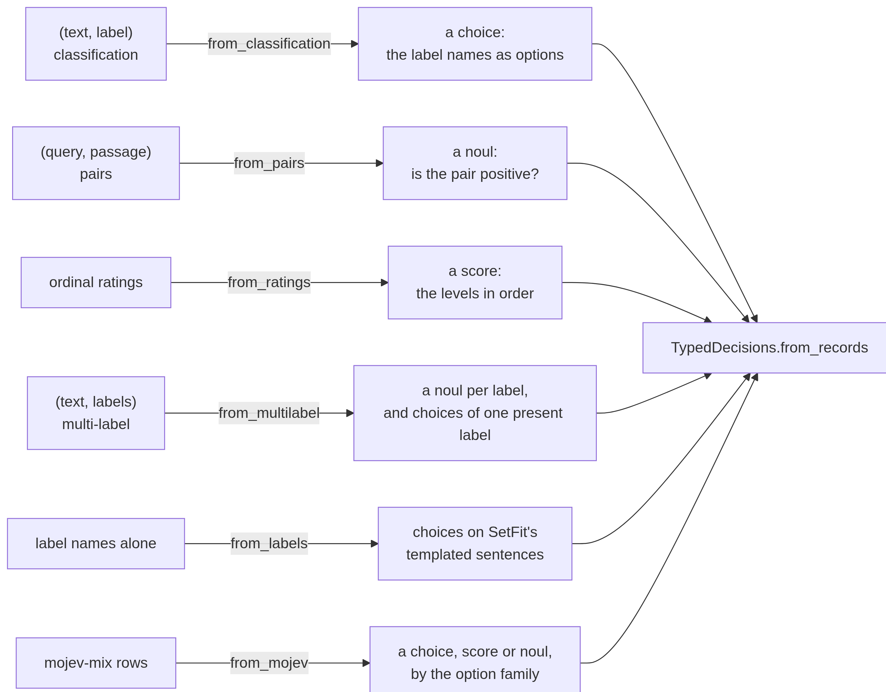

# datasets


<!-- WARNING: THIS FILE WAS AUTOGENERATED! DO NOT EDIT! -->

Every application reads one record format, the typed-decisions case.
Converters reshape other datasets into it once, each a short function
over rows: classification sets become one choice question, pairs become
a noul, ratings become a score, multi-label sets become a noul per
label, and label names alone become a synthetic training set. The
results feed
[`TypedDecisions.from_records`](https://sgaseretto.github.io/sysonelib/data.html#typeddecisions.from_records),
or its `from_registry` shortcut, and the reshaping functions and
transforms of [data](02_data.ipynb#one-label-several-questions) ask any
of them in more shapes.

<div>

<figure class=''>

<div>



</div>

</figure>

</div>

## Classification

A `(text, label)` dataset becomes one choice question per row, with the
label names as options, or a `{label: description}` dict when
descriptions help, and a one-hot gold. The label names are read off a
`ClassLabel` column when not given. This is how the evaluation suites
are built.

------------------------------------------------------------------------

<a
href="https://github.com/sgaseretto/sysonelib/blob/main/sysone/datasets.py#L41"
target="_blank" style="float:right; font-size:smaller">source</a>

### from_classification

``` python
def from_classification(
    ds, text:str='text', label:str='label', labels:NoneType=None, instructions:str='Which label fits this text?',
    qid:str='label', n:int | None=None, prefix:str='cls'
)->list:
```

*Choice records from a classification dataset; `text` is a column or a
function of the row*

``` python
toy = Dataset.from_dict({"text": ["the match ended 2-1", "shares fell 3%"], "label": [0, 1]})
from datasets import ClassLabel
toy = toy.cast_column("label", ClassLabel(names=["Sports", "Business"]))
recs = from_classification(toy, instructions="What is this news about?")
recs[1]
```

    {'id': 'cls_000001',
     'state': 'shares fell 3%',
     'questions': {'label': {'type': 'choice',
       'instructions': 'What is this news about?',
       'criteria': ['Sports', 'Business']}},
     'gold': {'label': {'label': 'Business'}}}

``` python
test_eq(recs[1]["gold"]["label"]["label"], "Business")
q = Question.from_dict(recs[0]["questions"]["label"])
test_eq(q.target(recs[0]["gold"]["label"]), ([1.0, 0.0], 0))
d = from_classification(toy, labels={"Sports": "games and athletes", "Business": "markets and companies"})
test_eq(Question.from_dict(d[0]["questions"]["label"]).options, ["Sports: games and athletes", "Business: markets and companies"])
```

A plain integer column (no `ClassLabel`, no names) is its own label set,
in numeric order, and each row keeps its own value:

``` python
plain = Dataset.from_dict({"text": [f"t{i}" for i in range(12)], "label": list(range(12))})
pr = from_classification(plain)
test_eq([r["gold"]["label"]["label"] for r in pr[:3]], ["0", "1", "2"])
test_eq(Question.from_dict(pr[0]["questions"]["label"]).keys[:3], ["0", "1", "2"])
test_eq(from_classification(Dataset.from_dict({"text": ["a"], "label": [3]}))[0]["gold"]["label"]["label"], "3")
```

## Pairs

A `(query, passage)` or `(premise, hypothesis)` pair becomes a noul: the
two texts are the state, the instruction is the statement, and the gold
is whether the pair’s label is the positive one. This is the rerank and
NLI shape.

------------------------------------------------------------------------

<a
href="https://github.com/sgaseretto/sysonelib/blob/main/sysone/datasets.py#L60"
target="_blank" style="float:right; font-size:smaller">source</a>

### from_pairs

``` python
def from_pairs(
    ds, first:str='premise', second:str='hypothesis', label:str='label', positive:int=0,
    instructions:str='The second text follows from the first.', names:tuple=('Premise', 'Hypothesis'),
    qid:str='holds', n:int | None=None, prefix:str='pair'
)->list:
```

*Noul records from a pair dataset: true when the row’s label is
`positive`*

``` python
nli = Dataset.from_dict({"premise": ["A dog runs."], "hypothesis": ["An animal moves."], "label": [0]})
test_eq(from_pairs(nli)[0]["gold"]["holds"]["label"], "true")
from_pairs(nli)[0]
```

    {'id': 'pair_000000',
     'state': 'Premise: A dog runs.\nHypothesis: An animal moves.',
     'questions': {'holds': {'type': 'noul',
       'instructions': 'The second text follows from the first.'}},
     'gold': {'holds': {'label': 'true'}}}

## Ratings

An ordinal rating becomes a score question with the levels as criteria,
index 0 first; the gold is the level’s index.

------------------------------------------------------------------------

<a
href="https://github.com/sgaseretto/sysonelib/blob/main/sysone/datasets.py#L72"
target="_blank" style="float:right; font-size:smaller">source</a>

### from_ratings

``` python
def from_ratings(
    ds, text:str='text', rating:str='rating', levels:list | None=None, instructions:str='How would you rate this?',
    qid:str='rating', offset:int | None=None, n:int | None=None, prefix:str='rating'
)->list:
```

*Score records from a ratings dataset; `offset` is the rating of level 0
(with `levels`, 1 for 1-based scales, else 0)*

``` python
rv = Dataset.from_dict({"text": ["awful", "fine", "superb"], "stars": [1, 3, 5]})
stars = ["terrible", "poor", "ok", "good", "excellent"]
rr = from_ratings(rv, rating="stars", levels=stars)
test_eq([r["gold"]["rating"]["label"] for r in rr], ["0", "2", "4"])
test_eq(Question.from_dict(rr[0]["questions"]["rating"]).k, 5)
top = from_ratings(Dataset.from_dict({"text": ["ok", "great"], "stars": [3.0, 5.0]}), rating="stars", levels=stars)
test_eq([r["gold"]["rating"]["label"] for r in top], ["2", "4"])      # a 1-based scale, even when only 3..5 occur
test_fail(lambda: from_ratings(rv, rating="stars", levels=stars[:3]), contains="do not fit")
```

## Multi-label sets

A multi-label set gives each text any number of labels at once (the
aspects a review talks about, the genres of a show). A choice can’t hold
that, since it has one answer, but a noul per label can: the statement
that the label applies, true for the labels present. This is the
binary-relevance reading of multi-label data. `labels` is a column
holding each row’s labels (names, or indices into a
`Sequence(ClassLabel)`’s names), or a list of 0/1 columns, one per
label.

Every label gives a noul by default; with `negatives=m`, a row keeps its
present labels and m absent ones, drawn once. `choices=c` adds c
single-answer choices, each a present label among absent ones (k options
in all), a shape that does have exactly one right option. The share of
true statements is the share of labels present, which can be far from a
half;
[`question_stats`](https://sgaseretto.github.io/sysonelib/data.html#question_stats)
in [data](02_data.ipynb#drawn-every-epoch) counts it.

------------------------------------------------------------------------

<a
href="https://github.com/sgaseretto/sysonelib/blob/main/sysone/datasets.py#L97"
target="_blank" style="float:right; font-size:smaller">source</a>

### from_multilabel

``` python
def from_multilabel(
    ds, text:str='text', labels:str='labels', names:list | None=None, statement:str='This text is about {label}.',
    qid:str='label', negatives:int | None=None, choices:int=0, k:int=4,
    instructions:str='Which of these is this text about?', n:int | None=None, prefix:str='ml', seed:int=0
)->list:
```

*Records from a multi-label set: a noul per label (or per present label
and `negatives` absent ones), and `choices` choices of one present label
among absent ones*

``` python
from datasets import ClassLabel, Sequence
ml = Dataset.from_dict({"text": ["great pasta, rude waiter", "cheap and spotless"], "aspects": [[0, 1], [2, 3]]})
ml = ml.cast_column("aspects", Sequence(ClassLabel(names=["food", "service", "price", "cleanliness"])))
mr = from_multilabel(ml, labels="aspects", statement="The review talks about the {label}.", qid="aspect", choices=1)
mr[0]
```

    {'id': 'ml_000000',
     'state': 'great pasta, rude waiter',
     'questions': {'aspect:food': {'type': 'noul',
       'instructions': 'The review talks about the food.'},
      'aspect:service': {'type': 'noul',
       'instructions': 'The review talks about the service.'},
      'aspect:price': {'type': 'noul',
       'instructions': 'The review talks about the price.'},
      'aspect:cleanliness': {'type': 'noul',
       'instructions': 'The review talks about the cleanliness.'},
      'aspect:choice0': {'type': 'choice',
       'instructions': 'Which of these is this text about?',
       'criteria': ['price', 'cleanliness', 'food']}},
     'gold': {'aspect:food': {'label': 'true'},
      'aspect:service': {'label': 'true'},
      'aspect:price': {'label': 'false'},
      'aspect:cleanliness': {'label': 'false'},
      'aspect:choice0': {'label': 'food'}}}

``` python
test_eq({k: g["label"] for k, g in mr[0]["gold"].items() if "choice" not in k},
        {"aspect:food": "true", "aspect:service": "true", "aspect:price": "false", "aspect:cleanliness": "false"})
c = Question.from_dict(mr[0]["questions"]["aspect:choice0"])
test_eq((c.k, mr[0]["gold"]["aspect:choice0"]["label"]), (3, "food"))          # food among the two absent labels
test_eq(sum(k in ("food", "service") for k in c.keys), 1)                     # one present label among absent ones
few = from_multilabel(ml, labels="aspects", negatives=1)
test_eq([len(r["questions"]) for r in few], [3, 3])                           # the two present labels and one absent
flags = Dataset.from_dict({"text": ["you idiot", "nice point"], "toxic": [1, 0], "insult": [1, 0], "threat": [0, 0]})
fr = from_multilabel(flags, labels=["toxic", "insult", "threat"], statement={"toxic": "This comment is toxic.", "insult": "This comment insults someone.", "threat": "This comment threatens someone."})
test_eq([[g["label"] for g in r["gold"].values()] for r in fr], [["true", "true", "false"], ["false", "false", "false"]])
test_eq(fr[1]["questions"]["label:insult"]["instructions"], "This comment insults someone.")
named = from_multilabel([{"text": "a", "tags": ["x", "z"]}, {"text": "b", "tags": ["y"]}], labels="tags")
test_eq([sorted(k for k, g in r["gold"].items() if g["label"] == "true") for r in named], [["label:x", "label:z"], ["label:y"]])
```

## Label names alone

Before any data exists, SetFit’s zero-shot trick bootstraps a head from
the label names:
[`get_templated_dataset`](https://sgaseretto.github.io/sysonelib/datasets.html#get_templated_dataset)
writes `sample_size` sentences per label from a template (“This sentence
is {}”), and
[`from_labels`](https://sgaseretto.github.io/sysonelib/datasets.html#from_labels)
wraps them as choice records. SetFit’s own function is used when
`setfit` is installed; otherwise an equivalent written from its
documented behaviour, since the function is a small pure `datasets`
recipe and SetFit’s trainer is not needed.

------------------------------------------------------------------------

<a
href="https://github.com/sgaseretto/sysonelib/blob/main/sysone/datasets.py#L136"
target="_blank" style="float:right; font-size:smaller">source</a>

### from_labels

``` python
def from_labels(
    labels, template:str='This sentence is {}', sample_size:int=2, instructions:str='Which label fits this text?',
    qid:str='label'
)->list:
```

*Choice records synthesised from label names (or a {label: description}
dict)*

------------------------------------------------------------------------

<a
href="https://github.com/sgaseretto/sysonelib/blob/main/sysone/datasets.py#L129"
target="_blank" style="float:right; font-size:smaller">source</a>

### get_templated_dataset

``` python
def get_templated_dataset(
    candidate_labels, template:str='This sentence is {}', sample_size:int=2
):
```

*Synthetic (text, label) rows from label names: SetFit’s function when
installed, an equivalent otherwise*

``` python
fl = from_labels(["billing", "technical", "sales"], template="This request is about {}.")
test_eq(len(fl), 6)
test_eq((fl[0]["state"], fl[0]["gold"]["label"]["label"]), ("This request is about billing.", "billing"))
test_eq(fl[5]["gold"]["label"]["label"], "sales")
```

## mojev-mix

[MoLeMo-Lab/mojev-mix](https://huggingface.co/datasets/MoLeMo-Lab/mojev-mix)
(MIT) holds 205,084 training rows from 18 generators, games, navigation
and agent traces, each a `context` ending in a JSON state, a list of
`options`, integer `preference` grades (higher is better, the correct
option usually 3) and the correct option in `labels`. Rows become
records: the text before `"\n\nState: "` is the instruction, the JSON
after it the state; ordinal families become score questions (their
options are listed in level order), a `["no", "yes"]` option pair
becomes a noul, everything else a choice. mojev itself trains with a
Plackett–Luce loss over the grades, not with soft targets; the soft
target here, a softmax of grade / τ, is sysone’s choice, so that the
grades reach RLCD as a distribution.

------------------------------------------------------------------------

<a
href="https://github.com/sgaseretto/sysonelib/blob/main/sysone/datasets.py#L168"
target="_blank" style="float:right; font-size:smaller">source</a>

### from_mojev

``` python
def from_mojev(
    ds, n:int | None=None, tau:float=1.0
)->list:
```

*Typed-decision records from mojev-mix rows*

------------------------------------------------------------------------

<a
href="https://github.com/sgaseretto/sysonelib/blob/main/sysone/datasets.py#L149"
target="_blank" style="float:right; font-size:smaller">source</a>

### mojev_record

``` python
def mojev_record(
    r:dict, i:int=0, tau:float=1.0
)->dict:
```

*A typed-decision record from one mojev-mix row*

------------------------------------------------------------------------

<a
href="https://github.com/sgaseretto/sysonelib/blob/main/sysone/datasets.py#L143"
target="_blank" style="float:right; font-size:smaller">source</a>

### grade_distribution

``` python
def grade_distribution(
    grades, tau:float=1.0
)->list:
```

*Soft targets from preference grades: softmax(grade / tau)*

``` python
row = {"context": "Choose a direction to keep the snake alive.\n\nState: {\"game\": \"snake\", \"direction\": \"up\"}",
       "options": {"answer": ["up", "right", "left"]}, "preference": {"answer": [3, 0, 0]}, "labels": {"answer": "up"},
       "source": "snake-v1", "grading": "flat"}
mr = mojev_record(row)
test_eq((mr["state"], mr["questions"]["answer"]["type"]), ({"game": "snake", "direction": "up"}, "choice"))
test_close(mr["gold"]["answer"]["probabilities"]["up"], np.exp(3) / (np.exp(3) + 2))
ordinal = dict(row, options={"answer": ["Black, 0", "Dark, 0.25", "Middle, 0.5", "Light, 0.75", "White, 1"]},
               preference={"answer": [0, 0, 1, 2, 3]}, labels={"answer": "White, 1"}, grading="ordinal")
test_eq((mojev_record(ordinal)["questions"]["answer"]["type"], mojev_record(ordinal)["gold"]["answer"]["label"]), ("score", "4"))
yn = dict(row, options={"answer": ["no", "yes"]}, preference={"answer": [0, 3]}, labels={"answer": "yes"}, grading="binary")
test_eq(Question.from_dict(mojev_record(yn)["questions"]["answer"]).target(mojev_record(yn)["gold"]["answer"])[1], 1)
```

## Evaluation suites

The classification sets Laya reports on, each as one choice question
with the label names as options, so any model can be scored zero-shot,
without task-specific training, and compared with published Laya and Jev
figures. The ids are ones `datasets` 5 loads (the old un-namespaced ids
and the script-based Banking77 and MASSIVE repositories no longer load);
underscores in intent names become spaces, so options read as words.

------------------------------------------------------------------------

<a
href="https://github.com/sgaseretto/sysonelib/blob/main/sysone/datasets.py#L189"
target="_blank" style="float:right; font-size:smaller">source</a>

### suite_records

``` python
def suite_records(
    name:str, n:int | None=None, split:str | None=None, seed:int=0
)->list:
```

*Choice records of an evaluation suite (a sample of `n` rows when
given)*

``` python
suite_records("banking77", n=3)[0]
```

## Unseen labels

A zero-shot claim needs labels the model never saw. Holding out cases is
not enough for that: every label still turns up in training, as an
answer or as an option.
[`split_labels`](https://sgaseretto.github.io/sysonelib/datasets.html#split_labels)
splits records by their gold for one question instead. Records whose
gold is one of the `held` labels go to the test side, as they are. The
others go to the training side, with the held labels taken out of that
question’s options, so the model meets them nowhere.

------------------------------------------------------------------------

<a
href="https://github.com/sgaseretto/sysonelib/blob/main/sysone/datasets.py#L203"
target="_blank" style="float:right; font-size:smaller">source</a>

### split_labels

``` python
def split_labels(
    records, qid:str, held
)->tuple:
```

*Training records, with the `held` labels taken out of question `qid`’s
options, and test records, those whose gold for `qid` is a held label*

``` python
asks = [("wake me up at seven", "alarm_set"), ("play some jazz", "play_music"), ("will it rain tomorrow", "weather_query")]
intents = [{"id": f"i{i}", "state": s, "gold": {"intent": g},
            "questions": {"intent": {"type": "choice", "instructions": "What does the user want?",
                                     "criteria": ["alarm_set", "alarm_query", "play_music", "weather_query"]}}} for i, (s, g) in enumerate(asks)]
seen, unseen = split_labels(intents, "intent", ["weather_query", "alarm_query"])
test_eq(([r["id"] for r in seen], [r["id"] for r in unseen]), (["i0", "i1"], ["i2"]))
test_eq(seen[0]["questions"]["intent"]["criteria"], ["alarm_set", "play_music"])
test_eq(len(unseen[0]["questions"]["intent"]["criteria"]), 4)                 # the test asks among every label
```

## Registry

`REGISTRY` names the datasets that already fit, with where they come
from, their size, what they ask, their license and their role;
`TypedDecisions.from_registry(name)` loads one. Laya-browser’s own
training data was never published and is not here; its recipe is the
browser converter in the screens notebook.

------------------------------------------------------------------------

<a
href="https://github.com/sgaseretto/sysonelib/blob/main/sysone/datasets.py#L253"
target="_blank" style="float:right; font-size:smaller">source</a>

### TypedDecisions.from_registry

``` python
def from_registry(
    name:str, **kw
):
```

*A registered dataset as
[`TypedDecisions`](https://sgaseretto.github.io/sysonelib/data.html#typeddecisions)*

------------------------------------------------------------------------

<a
href="https://github.com/sgaseretto/sysonelib/blob/main/sysone/datasets.py#L227"
target="_blank" style="float:right; font-size:smaller">source</a>

### register_dataset

``` python
def register_dataset(
    info:__main__.DatasetInfo
):
```

*Add a dataset to the registry*

------------------------------------------------------------------------

<a
href="https://github.com/sgaseretto/sysonelib/blob/main/sysone/datasets.py#L220"
target="_blank" style="float:right; font-size:smaller">source</a>

### DatasetInfo

``` python
def DatasetInfo(
    name:str, source:str, size:str, modality:str, primitives:str, license:str, role:str, load:object=None
)->None:
```

*A dataset sysone can load as typed decisions*

``` python
sorted(REGISTRY)
```

    ['ag_news',
     'banking77',
     'emotion',
     'massive',
     'mojev_mix',
     'typed_decisions',
     'xnli']

``` python
test_eq(REGISTRY["typed_decisions"].license, "Apache-2.0")
test_fail(lambda: TypedDecisions.from_registry("imagenet"), contains="unknown dataset")
```

``` python
TypedDecisions.from_registry("typed_decisions")
```
