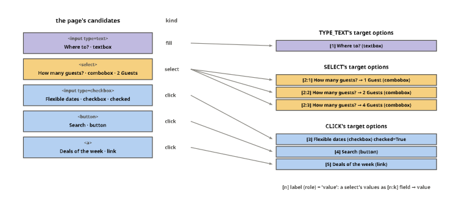
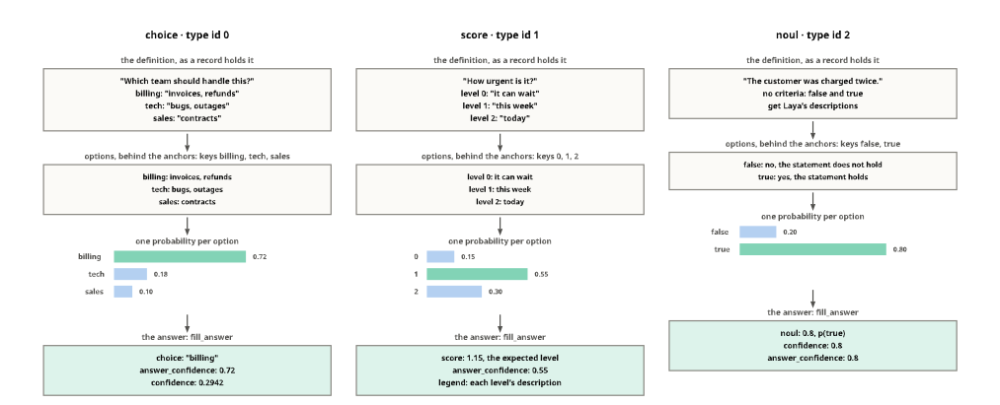
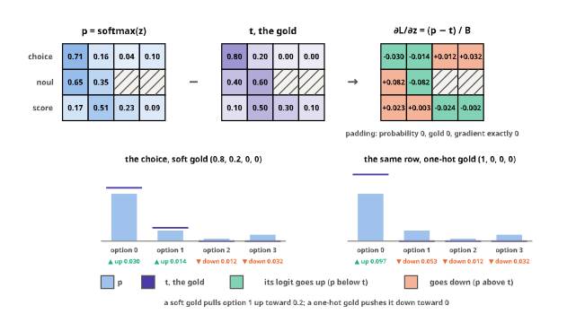
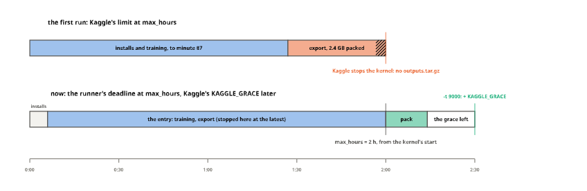
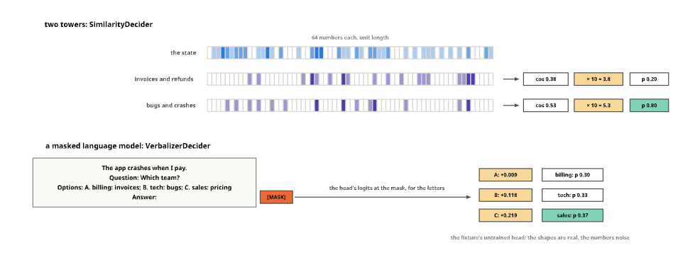

# figures


<!-- WARNING: THIS FILE WAS AUTOGENERATED! DO NOT EDIT! -->

The notebooks explain the tensor operations with diagrams: a batch of
rows, the gather at the anchors, the type embedding broadcast over a
row, the labels packed for the Trainer. They show the data the same way:
the questions one record becomes, how it is split, the options a page’s
elements become, a tutorial’s boards. Every diagram is drawn here, from
what the library itself produces
([`collate`](https://sgaseretto.github.io/sysonelib/core.html#collate),
[`RowBuilder`](https://sgaseretto.github.io/sysonelib/template.html#rowbuilder),
[`DecisionHead`](https://sgaseretto.github.io/sysonelib/models.html#decisionhead),
the reshaping functions, the converters, or a tutorial’s own code), so a
diagram cannot drift from the code it explains: when the code changes,
running this notebook redraws them, and the checks next to each figure
fail if the picture no longer matches the computation. Nothing here is
exported; the notebooks embed the SVG files with a link back to the
section that drew them.

tensordiagram draws one tensor at a time as SVG, without system
libraries; everything around the tensors (labels, arrows, brackets,
hatching for padding) is composed with
[chalk](https://chalk-diagrams.github.io), the drawing library
tensordiagram is built on. The helpers below are what that composition
needs.

## Helpers

A few facts about the two libraries shape the helpers. Chalk’s text has
no size of its own, so a label gets an explicit box, or layouts overlap
it. A 3-D tensor’s envelope covers only its front faces, so a figure
sizes its own background to include the top and side faces. Cells are
not named, so arrows need cell coordinates: tensordiagram centres 2-D
cell (r, c) at (c, r), and a 3-D cell (r, c, k) has its front face
centred at (c + ½ + ½k, r + ½ − ½k). The pictures of data share three
colours, `YES` for true or a gold option, `NO` for false and `OFF` for
what a question leaves out, and three pieces: `chip`, a word in a box,
`text_card`, lines in a card, and `legend`. chalk’s text is always
centred, so text meant to start at a point is placed by its estimated
width (`text_w`), and lines that must align go in a card, centred.

``` python
INK, INK2, MUTED = "#0b0b0b", "#52514e", "#898781"
SEGMENTS = {"special": "#c3c2b7", "question": "#86b6ef", "anchor": "#eb6834", "option": "#f4b89b", "state": "#8fd6b8", "pad": "#ffffff"}
PAL = dict(blue="#2a78d6", orange="#eb6834", aqua="#1baf7a", yellow="#eda100", violet="#4a3aa7", grey="#c3c2b7")

def tint(hexc, t=0.7):
    "`hexc` mixed with white (t = 1 is the colour itself)"
    r, g, b = (int(hexc[i:i + 2], 16) for i in (1, 3, 5))
    m = lambda c: round(c * t + 255 * (1 - t))
    return "#%02x%02x%02x" % (m(r), m(g), m(b))

def text_w(s, size): return 0.62 * size * max(len(s), 1)

def label(s, size=0.45, color=INK, x=0, y=0, align="c"):
    "Text at (x, y), centred or starting ('l') or ending ('r') there, with an explicit box"
    w = text_w(s, size)
    t = text(s, size).fill_color(Color(color)).line_width(0).with_envelope(rectangle(w, 1.3 * size))
    return t.translate(x + {"c": 0, "l": w / 2, "r": -w / 2}[align], y)

def seg(p, q, color=INK, w=None, dash=None):
    d = make_path([tuple(p), tuple(q)]).line_color(Color(color))
    if w is not None: d = d.line_width(w)
    return d.dashing(list(dash) if dash else [], 0)

def arrow(p, q, color=INK, head=0.22, w=None, dash=None):
    "A straight arrow from p to q with a filled head"
    p, q = P2(*p), P2(*q)
    u = (q - p) / (q - p).length; n = P2(-u.y, u.x); base = q - u * head * 1.6
    tip = make_path([tuple(q), tuple(base + n * head * 0.6), tuple(base - n * head * 0.6), tuple(q)], closed=True)
    return seg(p, base, color, w, dash) + tip.fill_color(Color(color)).line_color(Color(color)).line_width(0)

def hatch(x0, y0, x1, y1, color=MUTED, step=0.33):
    "45° hatching clipped to a rectangle: padded or masked cells"
    W, H, out, c = x1 - x0, y1 - y0, [], -(y1 - y0) + step
    while c < W - 1e-9:
        sx, sy, ex, ey = x0 + c, y1, x0 + c + H, y0
        if sx < x0: sy, sx = y1 - (x0 - sx), x0
        if ex > x1: ey, ex = y0 + (ex - x1), x1
        out.append(seg((sx, sy), (ex, ey), color)); c += step
    return concat(out)

def hbracket(x0, x1, y, txt, below=True, color=INK2, size=0.42, gap=0.32):
    "|-----| from x0 to x1 at height y, labelled under (or over) it"
    t = 0.14
    return concat([seg((x0, y), (x1, y), color), seg((x0, y - t), (x0, y + t), color), seg((x1, y - t), (x1, y + t), color),
                   label(txt, size, color, (x0 + x1) / 2, y + (gap + size / 2) * (1 if below else -1))])

class Placed:
    "A tensor diagram placed at (x, y): cell 0's centre for 1-D and 2-D, the front-top-left corner for 3-D"
    def __init__(self, d, x=0.0, y=0.0): self.d, self.x, self.y, self.shape = d, x, y, tuple(d.tensor_shape)
    @property
    def dia(self): return self.d.to_chalk_diagram().dashing([], 0).translate(self.x, self.y)
    def cell(self, *i):
        "Centre of cell i (its front face, for 3-D)"
        if len(self.shape) == 1: return P2(self.x, self.y + i[0])
        if len(self.shape) == 2: return P2(self.x + i[1], self.y + i[0])
        r, c, k = i
        return P2(self.x + c + 0.5 + 0.5 * k, self.y + r + 0.5 - 0.5 * k)
    def cell_box(self, *i): p = self.cell(*i); return (p.x - .5, p.y - .5, p.x + .5, p.y + .5)
    @property
    def bbox(self):
        "Visual extents (x0, y0, x1, y1), including a 3-D tensor's top and side faces"
        s = self.shape
        if len(s) == 1: return (self.x - .5, self.y - .5, self.x + .5, self.y + s[0] - .5)
        if len(s) == 2: return (self.x - .5, self.y - .5, self.x + s[1] - .5, self.y + s[0] - .5)
        R, C, D = s
        return (self.x, self.y - .5 * D, self.x + C + .5 * D, self.y + R)

def union(*bbs): return (min(b[0] for b in bbs), min(b[1] for b in bbs), max(b[2] for b in bbs), max(b[3] for b in bbs))

def figure(parts, extents, pad=0.4):
    "The parts over a white background that covers `extents`, which fixes the drawing's bounds"
    x0, y0, x1, y1 = extents
    back = rectangle(x1 - x0 + 2 * pad, y1 - y0 + 2 * pad).fill_color(Color("#ffffff")).line_width(0).translate((x0 + x1) / 2, (y0 + y1) / 2)
    return back + concat(parts)

IMAGES = Path("images")

def save(d, name, px_per_unit=30):
    "Write images/<name>.svg with chalk's pure-Python backend, with a viewBox so it scales down in a narrow page"
    IMAGES.mkdir(exist_ok=True)
    height = int(round(d.get_envelope().height * px_per_unit))
    with tempfile.TemporaryDirectory() as tmp:
        d.render_svg(f"{tmp}/f.svg", height=height, draw_height=400)
        svg = Path(f"{tmp}/f.svg").read_text()
    h, w = re.search(r'<svg[^>]*?height="(\d+)"[^>]*?width="(\d+)"', svg).groups()
    svg = svg.replace("<svg ", f'<svg viewBox="0 0 {w} {h}" ', 1)
    (IMAGES / f"{name}.svg").write_text(svg)
    return f"images/{name}.svg: {w} × {h} px, {len(svg) // 1024} kB"

YES, NO, OFF = tint(PAL["aqua"], .55), tint(PAL["orange"], .45), "#f3f2ee"     # true or the gold option, false, not part of the question

def legend(items, x, y, size=0.3):
    "Coloured swatches (a colour, or 'hatch') and their names in a row starting at x"
    parts = []
    for col, name in items:
        parts.append(rectangle(0.5, 0.5).fill_color(Color(OFF if col == "hatch" else col)).line_color(Color(INK2)).translate(x + 0.25, y))
        if col == "hatch": parts.append(hatch(x, y - .25, x + .5, y + .25, color=MUTED, step=0.12))
        parts.append(label(name, size, INK2, x + 0.65, y, align="l")); x += 1.4 + text_w(name, size)
    return parts

def chip(t, x, y, fill="#ffffff", size=0.3, w=None, h=0.72, color=INK):
    "Text in a box centred at (x, y), as wide as the text unless `w` is given"
    w = w or text_w(t, size) + 0.6
    return [rectangle(w, h).fill_color(Color(fill)).line_color(Color(INK2)).translate(x, y), label(t, size, color, x, y)]

def text_card(lines, x, y, w, size=0.3, lh=0.48):
    "Lines of text centred in a card whose top-left corner is at (x, y); the card's height"
    h = 0.5 + lh * len(lines)
    parts = [rectangle(w, h).fill_color(Color("#fbfaf7")).line_color(Color(MUTED)).translate(x + w / 2, y + h / 2)]
    parts += [label(t, size, INK, x + w / 2, y + 0.25 + lh * (j + .5)) for j, t in enumerate(lines)]
    return parts, h
```

## A batch of rows

Used in [core](00_core.ipynb#batches). Three questions over three
states, built by the fixture’s
[`RowBuilder`](https://sgaseretto.github.io/sysonelib/template.html#rowbuilder)
on Laya’s template and padded by
[`collate`](https://sgaseretto.github.io/sysonelib/core.html#collate):
every row is one question, with its own length and its own number of
options.

``` python
tok = AutoTokenizer.from_pretrained("fixtures/tiny-modernbert")
builder = RowBuilder(tok, "laya")
rows = [builder.build("refund me", {"type": "noul", "instructions": "Refund?", "criteria": {"false": "no", "true": "yes"}}),
        builder.build("app crashes", {"type": "choice", "instructions": "Team?", "criteria": ["billing", "tech", "sales"]}),
        builder.build("asap", {"type": "score", "instructions": "Urgent?", "criteria": ["no", "yes"]})]
batch = collate(rows, tok.pad_token_id)
{k: tuple(v.shape) for k, v in batch.items()}
```

    {'input_ids': (3, 32),
     'attention_mask': (3, 32),
     'marker_pos': (3, 3),
     'marker_mask': (3, 3),
     'qtype': (3,),
     'spans': (3, 3, 2),
     'answerable': (3,)}

Each position is labelled with the part of the row it belongs to, read
off the row itself: the opening token, the question up to the first
separator, each anchor and the option text behind it, the state after
the second separator, and the closing token.

``` python
def segments(row):
    "The segment of every position of a Laya-template row"
    out, stage = [], "question"
    for i, t in enumerate(row.ids):
        if i == 0 or t == tok.sep_token_id:
            out.append("special")
            if t == tok.sep_token_id: stage = {"question": "options", "options": "state"}.get(stage, stage)
        elif i in row.markers: out.append("anchor")
        else: out.append({"options": "option"}.get(stage, stage))
    return out

B, L = batch["input_ids"].shape
seg_of = np.full((B, L), "pad", dtype=object)
for r, row in enumerate(rows): seg_of[r, :row.n_tokens] = segments(row)
test_eq([[j for j in range(L) if seg_of[r, j] == "anchor"] for r in range(B)], [row.markers for row in rows])
short = lambda t: {"[CLS]": "C", "[SEP]": "S", "[MASK]": "M", "[PAD]": ""}.get(t, t.replace("Ġ", "")[:4])
names = np.full((B, L), "", dtype=object)
for r, row in enumerate(rows):
    for j, t in enumerate(row.ids): names[r, j] = short(tok.convert_ids_to_tokens(t))
```

``` python
ids = Placed(td.to_diagram(batch["input_ids"].numpy()).fill_color(lambda i, v: SEGMENTS[seg_of[i]]).fill_values(format=lambda i, v: names[i]), 0, 0)
mp = Placed(td.to_diagram(batch["marker_pos"].numpy()).fill_color(lambda i, v: SEGMENTS["anchor"] if batch["marker_mask"][i] else "#ffffff").fill_values(), 0, 5.2)
mm = Placed(td.to_diagram(batch["marker_mask"].int().numpy()).fill_color(lambda i, v: "#ffffff").fill_values(), 5.0, 5.2)
parts = [ids.dia, mp.dia, mm.dia]
for r in range(B):
    parts.append(label(f"row {r} · {QTYPE_NAMES[rows[r].qtype]}", 0.4, INK2, -0.8, r, align="r"))
    for k in range(batch["marker_mask"].shape[1]):
        if not batch["marker_mask"][r, k]: parts += [hatch(*mp.cell_box(r, k), color=INK2), hatch(*mm.cell_box(r, k), color=INK2)]
parts += [hbracket(-0.5, L - 0.5, B - 0.1, f"input_ids (batch = {B}, L = {L}): padded to the longest row"),
          label("marker_pos (batch, K)", 0.4, INK, -0.5, 4.3, align="l"), label("marker_mask (batch, K)", 0.4, INK, 4.5, 4.3, align="l")]
x = 10.5
for name, col in SEGMENTS.items():
    parts += [rectangle(0.7, 0.7).fill_color(Color(col)).line_color(Color(INK2)).translate(x, 5.7), label(name, 0.4, INK2, x + 0.55, 5.7, align="l")]
    x += 1.2 + text_w(name, 0.4)
save(figure(parts, union(ids.bbox, mp.bbox, mm.bbox, (-5.6, -0.5, L, 7.4))), "batch")
```

    'images/batch.svg: 1152 × 270 px, 111 kB'


## The gather at the anchors

Used in [models](03_models.ipynb#decisionhead). The head reads one
vector per option: the encoder’s output at that option’s anchor. For a
batch that is one `torch.gather` along the sequence axis, with
`marker_pos` repeated over the width; a padded option slot points at
position 0 and gathers a vector that `marker_mask` then hides. The
gather drawn is the head’s own, so scoring the gathered vectors equals
the head’s forward pass:

``` python
Bh, Lh, D = 2, 8, 4
h = torch.arange(Bh * Lh * D, dtype=torch.float32).reshape(Bh, Lh, D) / 10
marker_pos, marker_mask = torch.tensor([[1, 4, 6], [2, 5, 0]]), torch.tensor([[1, 1, 1], [1, 1, 0]]).bool()
qtype = torch.tensor([QTYPES["choice"], QTYPES["noul"]])
gathered = torch.gather(h, 1, marker_pos[:, :, None].expand(-1, -1, D))
head = DecisionHead(D, layers=0).eval()
test_close(head.score(gathered + head.type_emb(qtype)[:, None, :], marker_mask), head(h, torch.ones(Bh, Lh), marker_pos, marker_mask, qtype))
test_eq(gathered[1, 2], h[1, 0])        # the padded slot gathers position 0
```

``` python
KCOL = [PAL["blue"], PAL["orange"], PAL["aqua"]]
col_k = lambda b, k: PAL["grey"] if not marker_mask[b, k] else KCOL[k]
def src(i, v):
    b, l, _ = i
    for k in range(marker_pos.shape[1]):
        if marker_pos[b, k] == l and marker_mask[b, k]: return tint(col_k(b, k), .85)
    return "#f3f2ee"
H = Placed(td.to_diagram(h).fill_color(src), 0, 0)
O = Placed(td.to_diagram(gathered).fill_color(lambda i, v: tint(col_k(i[0], i[1]), .85)), 15.2, 0)
parts = [H.dia, O.dia]
for T_, n, nm in ((H, Lh, "L"), (O, marker_pos.shape[1], "K")):
    for c in range(n): parts.append(label(str(c), 0.3, MUTED, T_.x + c + .5, Bh + 0.35))
    for b in range(Bh): parts.append(label(f"b={b}", 0.34, INK2, T_.x - 0.25, b + .5, align="r"))
    parts.append(hbracket(T_.x, T_.x + n, Bh + 0.8, f"{nm} = {n}", size=0.38))
    parts += [seg((T_.x - .18, -.18), (T_.x - .18 + .5 * D, -.18 - .5 * D), INK2), label(f"width = {D}", 0.36, INK2, T_.x - 0.4, -.25 * D - .35, align="r")]
parts += [label("h: the encoder's output (batch, L, width)", 0.45, INK, H.x, -3.0, align="l"),
          label("anchors (batch, K, width)", 0.45, INK, O.x, -3.0, align="l")]
ax0, ax1 = H.bbox[2] + 0.6, O.x - 1.6
parts += [arrow((ax0, 1.0), (ax1, 1.0), INK2, head=0.25), label("gather(1, marker_pos)", 0.36, INK, (ax0 + ax1) / 2, 0.45)]
mp2 = Placed(td.to_diagram(marker_pos.numpy()).fill_color(lambda i, v: tint(col_k(*i), .85)).fill_values(font_size=0.4), 3.0, 5.4)
mm2 = Placed(td.to_diagram(marker_mask.int().numpy()).fill_color(lambda i, v: "#ffffff").fill_values(font_size=0.4), 8.0, 5.4)
parts += [mp2.dia, mm2.dia, hatch(*mp2.cell_box(1, 2), color=INK2), hatch(*mm2.cell_box(1, 2), color=INK2),
          label("marker_pos (batch, K)", 0.38, INK, mp2.x - 0.5, 4.45, align="l"), label("marker_mask (batch, K)", 0.38, INK, mm2.x - 0.5, 4.45, align="l"),
          label("anchors[b, k, :] = h[b, marker_pos[b, k], :]; the padded slot (b = 1, k = 2) gathers h[1, 0, :], and marker_mask hides it", 0.34, INK2, mp2.x - 0.5, 7.3, align="l")]
save(figure(parts, union(H.bbox, O.bbox, (H.x - 2.4, -3.4, O.bbox[2] + 0.3, 7.7))), "anchor_gather")
```

    'images/anchor_gather.svg: 924 × 357 px, 140 kB'


## The type embedding, broadcast over a row

Used in [models](03_models.ipynb#decisionhead). Before its layers, the
head adds a learned vector for the question’s type to every position of
the row: one row of `type_emb.weight` per example, picked by `qtype`,
given a length-1 sequence axis with `[:, None, :]` and broadcast along
the row’s length, so no copy is made. This is how one head answers three
kinds of question: the same anchors read differently when the row is a
score rather than a choice.

``` python
Bt, Lt, Dt = 2, 6, 4
W = torch.tensor([[0.2, -0.1, 0.4, 0.0], [-0.3, 0.5, 0.1, 0.2], [0.1, 0.3, -0.2, -0.4]])    # type_emb.weight: choice, score, noul
qt = torch.tensor([QTYPES["choice"], QTYPES["noul"]])
hb = torch.zeros(Bt, Lt, Dt)
e = W[qt][:, None, :]                                          # (batch, 1, width)
test_eq(e.shape, (Bt, 1, Dt)); test_eq((hb + e).shape, (Bt, Lt, Dt))
emb = torch.nn.Embedding(3, Dt); emb.weight.data = W
test_eq(emb(qt).detach()[:, None, :], e)                                # what DecisionHead.forward adds
```

``` python
TCOL = {0: PAL["orange"], 1: PAL["violet"], 2: PAL["aqua"]}
rowcol = lambda b: TCOL[int(qt[b])]
fmt1 = lambda i, v: f"{v:+.1f}"
parts = []
q_ = Placed(td.to_diagram(qt.numpy()).fill_color(lambda i, v: tint(TCOL[int(v)], .7)).fill_values(font_size=0.42), 0.8, 0)
W_ = Placed(td.to_diagram(W.numpy()).fill_color(lambda i, v: tint(TCOL[i[0]], .45)).fill_values(font_size=0.3, format=fmt1), 4.6, -0.5)
E_ = Placed(td.to_diagram(W[qt].numpy()).fill_color(lambda i, v: tint(rowcol(i[0]), .7)).fill_values(font_size=0.3, format=fmt1), 12.6, 0)
parts += [q_.dia, W_.dia, E_.dia, label("qtype (batch,)", 0.38, INK, q_.x, -1.05), label("type_emb.weight (3, width)", 0.38, INK, W_.x + 1.5, -1.55),
          label("type_emb(qtype) (batch, width)", 0.38, INK, E_.x + 1.5, -1.05)]
for b in range(Bt): parts.append(label(f"b={b}", 0.32, MUTED, q_.x - 0.65, b, align="r"))
for name, i in QTYPES.items(): parts.append(label(name, 0.3, INK2, W_.x - 0.65, W_.y + i, align="r"))
parts += [arrow((q_.x + 0.7, 0.5), (W_.x - 1.9, 0.5), INK2, head=0.2), label("picks rows", 0.3, INK2, (q_.x + W_.x - 1.2) / 2, 0.1),
          arrow((W_.x + Dt - 0.3, 0.5), (E_.x - 0.7, 0.5), INK2, head=0.2)]
y3 = 5.2
H_ = Placed(td.to_diagram(hb).fill_color("#f3f2ee"), 0, y3)
Eb = Placed(td.to_diagram(torch.zeros(Bt, Lt, Dt)).fill_color(lambda i, v: tint(rowcol(i[0]), .8)).fill_opacity(lambda i, v: 1.0 if i[1] == 0 else 0.22), 11.0, y3)
O_ = Placed(td.to_diagram(hb + e).fill_color(lambda i, v: tint(rowcol(i[0]), .45)), 22.0, y3)
parts += [H_.dia, Eb.dia, O_.dia]
for T_, nm in ((H_, "h (batch, L, width)"), (Eb, "type_emb(qtype)[:, None, :] (batch, 1, width)"), (O_, "h + type_emb(qtype)[:, None, :]")):
    parts.append(label(nm, 0.36, INK, T_.x, y3 - Dt / 2 - 0.75, align="l"))
    for b in range(Bt): parts.append(label(f"b={b}", 0.3, MUTED, T_.x - 0.2, y3 + b + .5, align="r"))
    parts.append(hbracket(T_.x, T_.x + (1 if T_ is Eb else Lt), y3 + Bt + 0.35, "1" if T_ is Eb else f"L = {Lt}", size=0.34))
parts += [label("broadcast along L: no copy", 0.3, INK2, Eb.x + 1 + (Lt - 1) / 2, y3 + Bt + 0.7),
          label("+", 0.9, INK, (H_.bbox[2] + Eb.x) / 2 - 0.1, y3 + 1.0), label("=", 0.9, INK, (Eb.bbox[2] + O_.x) / 2 - 0.1, y3 + 1.0),
          arrow((E_.x + 0.5, 1.75), (Eb.x + 0.8, y3 - Dt / 2 - 1.15), INK2, head=0.2), label("[:, None, :]", 0.32, INK2, E_.x + 1.0, (1.9 + y3 - Dt / 2 - 1.2) / 2, align="l")]
save(figure(parts, union(H_.bbox, O_.bbox, q_.bbox, (-1.6, -2.0, O_.bbox[2] + 0.2, y3 + Bt + 1.2))), "type_embedding")
```

    'images/type_embedding.svg: 977 × 336 px, 219 kB'


## The masked softmax

Used in [models](03_models.ipynb#decisionhead) and
[losses](04_losses.ipynb#soft-cross-entropy). A batch mixes rows with
different option counts, so every row’s logits are padded to the batch’s
K; the head writes −10<sup>4</sup> into the padded slots, and the
softmax across the options gives them a probability of exactly 0, so
they take no probability mass and, in the loss, no gradient.

``` python
zs = torch.tensor([[2.0, 0.5, -1.0, 0.0], [0.3, -0.3, 0.0, 0.0], [0.1, 1.2, 0.4, -0.5]])
ms = torch.tensor([[1, 1, 1, 1], [1, 1, 0, 0], [1, 1, 1, 1]]).bool()
zm = zs.masked_fill(~ms, -1e4)                                 # what DecisionHead.score does to padded slots
ps = torch.softmax(zm, -1)
test_eq(ps[~ms].abs().max().item(), 0.0)
test_close(ps.sum(-1), torch.ones(3))
```

``` python
fmtz = lambda i, v: "−10⁴" if v <= -1e3 else f"{v:.2f}"
cell_col = lambda i, v: SEGMENTS["option"] if ms[i] else "#f3f2ee"
Zp = Placed(td.to_diagram(zm.numpy()).fill_color(cell_col).fill_values(format=fmtz, font_size=0.3), 0, 0)
Pp = Placed(td.to_diagram(ps.numpy()).fill_color(cell_col).fill_values(format=lambda i, v: f"{v:.2f}", font_size=0.3), 7.5, 0)
parts = [Zp.dia, Pp.dia, label("logits (batch, K)", 0.4, INK, -0.5, -1.1, align="l"), label("p = softmax over K", 0.4, INK, 7.0, -1.1, align="l"),
         arrow((Zp.bbox[2] + 0.4, 1), (Pp.bbox[0] - 0.4, 1), INK2, head=0.2), label("softmax(dim=-1)", 0.32, INK2, (Zp.bbox[2] + Pp.bbox[0]) / 2, 0.45)]
for r, name in enumerate(("choice, k = 4", "noul, k = 2", "score, k = 4")): parts.append(label(name, 0.32, MUTED, -0.8, r, align="r"))
for T_ in (Zp, Pp):
    for k in (2, 3): parts.append(hatch(*T_.cell_box(1, k), color=INK2, step=0.5))
save(figure(parts, union(Zp.bbox, Pp.bbox, (-4.0, -1.6, Pp.bbox[2], 3.0))), "masked_softmax")
```

    'images/masked_softmax.svg: 475 × 162 px, 27 kB'


## A row and its budgets

Used in [template](01_template.ipynb#rowbuilder). A row built with small
budgets, so all of them bind: every option is its anchor and at most
`option_tokens` tokens, the question and its options share
`head_max_len`, and the state gets what is left of `max_len`, cut on the
right.

``` python
small = RowBuilder(tok, RowTemplate.preset("laya").replace(max_len=40, head_max_len=24, option_tokens=3))
rb = small.build("the customer writes that the invoice was charged twice and asks for the money back today",
                 {"type": "choice", "instructions": "Which team?", "criteria": {"billing": "invoices, refunds", "tech": "bugs, outages", "sales": "contracts"}})
sg = segments(rb)
first_sep, second_sep = [j for j, t in enumerate(rb.ids) if t == tok.sep_token_id][:2]
test_eq((rb.n_tokens, len(rb.markers)), (40, 3))
test_eq(all(b - a <= 1 + 3 for a, b in zip(rb.markers, rb.markers[1:] + [second_sep])), True)   # anchor + at most 3 tokens
test_eq((first_sep - 1) + (second_sep - first_sep - 1), 24)     # the question run and the options fill head_max_len; the question was cut to fit
```

``` python
rn = [short(tok.convert_ids_to_tokens(t)) for t in rb.ids]
R_ = Placed(td.to_diagram(np.array(rb.ids)[None]).fill_color(lambda i, v: SEGMENTS[sg[i[1]]]).fill_values(format=lambda i, v: rn[i[1]], font_size=0.28), 0, 0)
parts = [R_.dia]
ends = rb.markers[1:] + [second_sep]
for k, (a, b) in enumerate(zip(rb.markers, ends)): parts.append(hbracket(a - 0.45, b - 0.55, -0.85, f"option {k}: ≤ 1 + 3", below=False, size=0.28, gap=0.25))
parts += [hbracket(0.55, first_sep - 0.55, -0.85, "question: what is left of 24", below=False, size=0.28, gap=0.25),
          hbracket(-0.45, second_sep + 0.45, 0.8, "the question and its options: head_max_len = 24", size=0.32),
          hbracket(second_sep + 0.55, rb.n_tokens - 1.55, 0.8, "the state: the rest of max_len = 40, cut on the right", size=0.32),
          hbracket(-0.45, rb.n_tokens - 0.55, 2.2, f"the row: max_len = {rb.n_tokens} tokens", size=0.32)]
save(figure(parts, (-0.8, -2.2, rb.n_tokens, 3.2)), "row_budgets")
```

    'images/row_budgets.svg: 1247 × 186 px, 43 kB'


## Labels packed for the Trainer

Used in [learner](05_learner.ipynb#decisiontrainer). `prediction_step`
hands the Trainer one tensor per batch, (batch, K, 5): the target, the
marker mask, the question type, the label and whether the gold answers
the question at all (for the act head), each broadcast over the options.
Batches have different K, and the Trainer’s evaluation loop joins them
with `nested_concat`, padding with −100; the packing puts the options on
the axis that gets padded, and the mask channel is what tells a real
option from padding when
[`unpack_labels`](https://sgaseretto.github.io/sysonelib/learner.html#unpack_labels)
reads them back.

``` python
from transformers.trainer_pt_utils import nested_concat
```

``` python
gold_rows = [builder.build("refund me", {"type": "noul", "instructions": "Refund?", "criteria": {"false": "no", "true": "yes"}}, {"noul": 0.8}),
             builder.build("app crashes", {"type": "choice", "instructions": "Team?", "criteria": ["billing", "tech", "sales"]}, {"label": "tech"}),
             builder.build("asap", {"type": "score", "instructions": "Urgent?", "criteria": ["no", "yes"]}, {"score": 0.9}),
             builder.build("hello", {"type": "noul", "instructions": "Spam?", "criteria": {"false": "no", "true": "yes"}}, {"noul": 0.1})]
pa, pb = pack_labels(collate(gold_rows[:2], 0)), pack_labels(collate(gold_rows[2:], 0))
joined = nested_concat(pa, pb, padding_index=-100)
test_eq((tuple(pa.shape), tuple(pb.shape), tuple(joined.shape)), ((2, 3, 5), (2, 2, 5), (4, 3, 5)))
from sysone.learner import unpack_labels
tg, mk, qq, lb = unpack_labels(joined.numpy())
test_eq(mk.sum(-1).tolist(), [2, 3, 2, 2])
```

``` python
CH = [("target", PAL["blue"]), ("marker mask", PAL["grey"]), ("qtype", PAL["violet"]), ("label", PAL["aqua"]), ("answerable", PAL["orange"])]
parts, x = [], 0.0
fmtp = lambda i, v: "−100" if v == -100 else (f"{v:.1f}" if abs(v - round(v)) > 1e-6 else f"{int(v)}")
for c, (name, colr) in enumerate(CH):
    P_ = Placed(td.to_diagram(joined[..., c].numpy()).fill_color(lambda i, v, colr=colr: "#ffffff" if v == -100 else tint(colr, .45)).fill_values(format=fmtp, font_size=0.3), x, 0)
    parts += [P_.dia, label(f"[..., {c}] {name}", 0.36, INK, x - 0.5, -1.0, align="l")]
    for r in range(4):
        for k in range(3):
            if joined[r, k, c] == -100: parts.append(hatch(*P_.cell_box(r, k), color=MUTED, step=0.5))
    x += 4.6
parts += [label("batch 1 (K = 3)", 0.32, INK2, -0.8, 0.5, align="r"), label("batch 2 (K = 2)", 0.32, INK2, -0.8, 2.5, align="r"),
          seg((-0.7, 1.5), (x - 1.1, 1.5), INK2, dash=[4, 3]),
          label("nested_concat(batch 1, batch 2, padding_index=-100): the options axis is padded, the batches stacked", 0.32, INK2, -0.5, 4.2, align="l")]
save(figure(parts, (-4.2, -1.5, x - 1.0, 4.6)), "pack_labels")
```

    'images/pack_labels.svg: 810 × 207 px, 62 kB'


## What a feature cache stores

Used in [cache](07_cache.ipynb). A frozen encoder gives the same output
for a row every epoch, so it runs once. `rows` mode keeps the whole
output, a vector per position, which a head with layers needs; `masks`
mode keeps only the vectors at the anchors, k per row instead of n,
which is all a head without layers reads.

``` python
row_c = gold_rows[1]
hid = torch.arange(row_c.n_tokens * 4, dtype=torch.float32).reshape(row_c.n_tokens, 4).T      # (width, n): positions along the axis
anc = hid[:, row_c.markers]
test_eq(anc.shape, (4, len(row_c.markers)))
```

``` python
is_m = lambda j: j in row_c.markers
Hc = Placed(td.to_diagram(hid.numpy()).fill_color(lambda i, v: SEGMENTS["anchor"] if is_m(i[1]) else SEGMENTS["question"] if sg_c[i[1]] == "question" else "#e8e7e1"), 0, 0) if (sg_c := segments(row_c)) else None
Ac = Placed(td.to_diagram(anc.numpy()).fill_color(SEGMENTS["anchor"]), row_c.n_tokens + 3.0, 0)
parts = [Hc.dia, Ac.dia, hbracket(-0.5, row_c.n_tokens - 0.5, 3.8, f"rows mode: n × width per row (n = {row_c.n_tokens} here; 291 on average for typed-decisions: 3.6 GB)", size=0.34),
         hbracket(Ac.x - 0.5, Ac.x + len(row_c.markers) - 0.5, 3.8, f"masks mode: k × width (k = {len(row_c.markers)}; 3.55 on average: 44 MB)", size=0.34),
         arrow((Hc.bbox[2] + 0.3, 1.5), (Ac.bbox[0] - 0.3, 1.5), INK2, head=0.2), label("keep the anchors", 0.3, INK2, (Hc.bbox[2] + Ac.bbox[0]) / 2, 0.95),
         label("the encoder's output for one row (width × positions)", 0.38, INK, -0.5, -1.0, align="l")]
save(figure(parts, (-0.8, -1.5, Ac.bbox[2] + 9.5, 5.0)), "cache_modes")
```

    'images/cache_modes.svg: 1367 × 219 px, 57 kB'


## NeoMME’s two-axis positions

Used in [multimodal](20_neomme.ipynb). NeoMME reads an image as `<doc>`,
the marker ``, then a grid of patch placeholders with a `<row>`
after each row of patches, and gives every position two coordinates.
Text runs along the diagonal (both coordinates equal); patch (r, c) of a
grid that opens at d sits at (d + 2 + r, d + 2 + c); text after the grid
resumes on the diagonal past both of the grid’s axes. The positions are
[`neomme_positions`](https://sgaseretto.github.io/sysonelib/neomme.html#neomme_positions)’
own:

``` python
from sysone.multimodal import neomme_positions
```

``` python
gh, gw, n_text = 2, 3, 6
kinds = ["<doc>", ""] + (["patch"] * gw + ["<row>"]) * gh + ["text"] * n_text
pos = neomme_positions(len(kinds), image_at=1, h=gh, w=gw)
test_eq(pos[:, :2].tolist(), [[0, 1], [0, 1]])
test_eq(pos[:, 2].tolist(), [2, 2]); test_eq(pos[:, 2 + gw + 1].tolist(), [3, 2])        # patch (0, 0), then patch (1, 0)
test_eq((pos[0, -n_text:] == pos[1, -n_text:]).all().item(), True)                          # text is back on the diagonal
```

``` python
KC = {"<doc>": "#c3c2b7", "": PAL["violet"], "patch": tint(PAL["violet"], .35), "<row>": tint(PAL["violet"], .7), "text": SEGMENTS["state"]}
Tk = Placed(td.to_diagram(np.zeros((1, len(kinds)))).fill_color(lambda i, v: KC[kinds[i[1]]]).fill_values(format=lambda i, v: {"patch": "p", "text": "t"}.get(kinds[i[1]], kinds[i[1]][1:-1][:3]), font_size=0.26), 0, 0)
Pz = Placed(td.to_diagram(pos.numpy()).fill_color(lambda i, v: tint(KC[kinds[i[1]]], .6)).fill_values(font_size=0.34), 0, 2.0)
parts = [Tk.dia, Pz.dia, label("tokens", 0.34, INK2, -0.8, 0, align="r"), label("axis 0", 0.34, INK2, -0.8, 2, align="r"), label("axis 1", 0.34, INK2, -0.8, 3, align="r"),
         hbracket(1.55, 1.45 + gh * (gw + 1), -0.9, f"a {gh} × {gw} patch grid, a <row> after each row", below=False, size=0.32, gap=0.25),
         label("position_ids (2, n): the row the model reads, per axis", 0.36, INK, -0.5, 4.3, align="l")]
save(figure(parts, (-2.4, -1.8, len(kinds), 4.8)), "neomme_positions")
```

    'images/neomme_positions.svg: 576 × 222 px, 45 kB'


## RLCD’s noise draws

Used in [losses](04_losses.ipynb#rlcd). For one row with three real
options in a batch padded to K = 4, four draws: the noise is zeroed on
the padded slot by the mask, then each draw is shifted so its real
options sum to zero, because softmax cannot see a shift of all the
logits and the part of the noise along it would only add variance. These
are RLCD’s two lines, applied to fixed draws:

``` python
m1, k1 = torch.tensor([True, True, True, False]), 3
raw = torch.tensor([[0.3, -0.1, 0.5, 0.2], [-0.4, 0.2, 0.1, -0.3], [0.2, 0.3, 0.4, 0.1], [-0.1, -0.5, 0.2, 0.4]]) * m1
proj = (raw - raw.sum(-1, keepdim=True) / k1) * m1               # rlcd_loss: eps = (eps - eps.sum(-1, keepdim=True) / k) * mask
test_close(proj.sum(-1), torch.zeros(4))
test_eq(proj[:, 3].abs().max().item(), 0.0)
```

``` python
fmtn = lambda i, v: f"{round(float(v), 2) + 0.0:+.2f}"     # no "-0.00"
cn = lambda i, v: "#f3f2ee" if not m1[i[1]] else tint(PAL["blue"], .3 + 0.6 * min(1, abs(v) / 0.5))
Rn = Placed(td.to_diagram(raw.numpy()).fill_color(cn).fill_values(format=fmtn, font_size=0.28), 0, 0)
Sr = Placed(td.to_diagram(raw.sum(-1, keepdim=True).numpy()).fill_color("#ffffff").fill_values(format=fmtn, font_size=0.28), 4.6, 0)
Pn = Placed(td.to_diagram(proj.numpy()).fill_color(cn).fill_values(format=fmtn, font_size=0.28), 8.6, 0)
Sp = Placed(td.to_diagram(proj.sum(-1, keepdim=True).numpy()).fill_color("#ffffff").fill_values(format=fmtn, font_size=0.28), 13.2, 0)
parts = [Rn.dia, Sr.dia, Pn.dia, Sp.dia, label("draws ε · mask (G, K)", 0.36, INK, -0.5, -1.0, align="l"), label("Σ", 0.4, INK, 4.6, -1.6),
         label("ε − its mean (real options)", 0.36, INK, 8.1, -1.0, align="l"), label("Σ", 0.4, INK, 13.2, -1.6),
         arrow((Sr.bbox[2] + 0.3, 1.5), (Pn.bbox[0] - 0.3, 1.5), INK2, head=0.2), label("minus the mean", 0.28, INK2, (Sr.bbox[2] + Pn.bbox[0]) / 2, 0.95)]
for T_ in (Rn, Pn):
    for g in range(4): parts.append(hatch(*T_.cell_box(g, 3), color=MUTED, step=0.5))
for g in range(4): parts.append(label(f"g={g}", 0.3, MUTED, -0.8, g, align="r"))
save(figure(parts, (-2.0, -1.5, Sp.bbox[2], 3.6)), "rlcd_noise")
```

    'images/rlcd_noise.svg: 495 × 177 px, 46 kB'


## A masked diffusion model

Used in [mdlm](24_mdlm.ipynb). Four figures, drawn on
`fixtures/tiny-a2d-qwen3`, the random two-layer model laid out like the
real checkpoint, with a Qwen-shaped tokenizer: its numbers mean nothing,
but every shape is the code’s own.

``` python
ftok = AutoTokenizer.from_pretrained("fixtures/tiny-a2d-qwen3")
fenc = AutoModel.from_pretrained("fixtures/tiny-a2d-qwen3", attn_implementation="eager").eval()
test_eq(type(fenc).__name__, "A2DQwen3Model")
clean = lambda t: t.replace("Ġ", "").replace("Ċ", "⏎")
```

### Masking, at a growing time t

Used in [mdlm](24_mdlm.ipynb). How the checkpoint was trained: every
token gets a time at which it is masked, so at time t each token is
masked with probability t, and a token masked at t is masked at every
later time. The model learns to predict the masked tokens from the rest;
writing runs from t = 1, all masks, back to text. Each word of the
sentence is one token of the fixture’s vocabulary:

``` python
sentence = " the customer was late with the refund for the order and the money"
words = ftok.tokenize(sentence)
test_eq(len(words), len(sentence.split()))                                  # a token per word, in the fixture's vocabulary
u = torch.rand(len(words), generator=torch.Generator().manual_seed(1))     # the time at which each token is masked
ts = [0.0, 0.25, 0.5, 0.75, 1.0]
masked = torch.stack([u < t for t in ts])                                   # masked at t, so masked at every later time
test_eq((masked[0].any().item(), masked[-1].all().item()), (False, True))
test_eq(bool((masked[1:].int() >= masked[:-1].int()).all()), True)
```

``` python
wn = [clean(w) for w in words]
Wd = Placed(td.to_diagram(np.ones((len(ts), len(words)))).fill_color(lambda i, v: tint(PAL["orange"], .6) if masked[i] else "#f3f2ee")
            .fill_values(format=lambda i, v: "mask" if masked[i] else wn[i[1]], font_size=0.2), 0, 0)
parts = [Wd.dia]
for r, t in enumerate(ts): parts.append(label(f"t = {t:g}", 0.34, INK2, -0.75, r, align="r"))
xr = len(words) + 0.2
parts += [arrow((xr, -0.2), (xr, len(ts) - 0.8), INK2, head=0.2), label("training: mask more", 0.32, INK2, xr + 0.3, 0.6, align="l"),
          label("predict the masked tokens", 0.32, INK2, xr + 0.3, 1.1, align="l"),
          arrow((xr + 5.6, len(ts) - 0.8), (xr + 5.6, -0.2), PAL["aqua"], head=0.2), label("writing: unmask", 0.32, INK2, xr + 5.9, 2.6, align="l"),
          label("from all masks to text", 0.32, INK2, xr + 5.9, 3.1, align="l"),
          label("each token is masked at its own random time t; the model learns to fill every mask from the tokens around it", 0.32, INK2, -0.5, len(ts) + 0.3, align="l")]
save(figure(parts, (-2.2, -0.9, xr + 11.0, len(ts) + 0.7)), "mdlm_masking")
```


### Attention, one way and both ways

Used in [mdlm](24_mdlm.ipynb#a-bidirectional-qwen3). The fixture’s
weights run twice on a padded batch of two rows: as transformers’ own
`Qwen3Model`, which attends causally, and as
[`A2DQwen3Model`](https://sgaseretto.github.io/sysonelib/mdlm.html#a2dqwen3model).
The weights drawn are the first head’s, in the first layer, for the
shorter row, read off the models’ outputs (eager attention,
`output_attentions=True`):

``` python
pair = [" the customer was late", " the refund for the order was two days late"]
enc_ids = [ftok(t).input_ids for t in pair]
L2 = max(map(len, enc_ids))
ids2 = torch.full((2, L2), ftok.pad_token_id); att2 = torch.zeros_like(ids2)
for r, x in enumerate(enc_ids): ids2[r, :len(x)], att2[r, :len(x)] = torch.tensor(x), 1
causal = Qwen3Model(fenc.config).eval(); causal.load_state_dict(fenc.state_dict())       # the same weights, transformers' own causal Qwen3
with torch.no_grad():
    a_causal = causal(input_ids=ids2, attention_mask=att2, output_attentions=True).attentions[0][0, 0]
    a_bi = fenc(input_ids=ids2, attention_mask=att2, output_attentions=True).attentions[0][0, 0]
n0 = int(att2[0].sum())
test_eq(bool((a_causal[:n0, :n0][torch.ones(n0, n0, dtype=torch.bool).triu(1)] == 0).all()), True)   # causal: nothing after the query
test_eq(bool((a_bi[:n0, :n0] > 0).all()), True)                                                         # bidirectional: every real token
test_eq((bool((a_causal[:n0, n0:] == 0).all()), bool((a_bi[:n0, n0:] == 0).all())), (True, True))       # and no padding, either way
```

``` python
qn = [clean(t) if i < n0 else "pad" for i, t in enumerate(ftok.convert_ids_to_tokens(ids2[0].tolist()))]
def shade(a):
    top = float(a[:n0, :n0].max())
    return lambda i, v: "#f3f2ee" if i[0] >= n0 or a[i] == 0 else tint(PAL["blue"], 0.15 + 0.85 * float(a[i]) / top)
C1 = Placed(td.to_diagram(a_causal.numpy()).fill_color(shade(a_causal)), 0, 0)
C2 = Placed(td.to_diagram(a_bi.numpy()).fill_color(shade(a_bi)), L2 + 4.5, 0)
parts = [C1.dia, C2.dia]
for T_, title in ((C1, "Qwen3Model: causal"), (C2, "A2DQwen3Model: both ways")):
    parts.append(label(title, 0.42, INK, T_.x - 0.5, -2.3, align="l"))
    for j in range(L2):
        parts.append(label(qn[j], 0.26, MUTED, T_.x + j, -0.95))
        parts.append(label(qn[j], 0.26, MUTED, T_.x - 0.7, j, align="r"))
        for r in range(L2):
            if r >= n0 or float((a_causal if T_ is C1 else a_bi)[r, j]) == 0: parts.append(hatch(*T_.cell_box(r, j), color=MUTED, step=0.45))
    parts.append(label("key →", 0.28, INK2, T_.x + L2 - 0.5, -1.55, align="r"))
parts += [label("query ↓", 0.28, INK2, C1.x - 0.7, -1.55, align="r"),
          label("attention weights of one head, one row of a padded batch: hatched cells get none", 0.32, INK2, C1.x - 2.2, L2 + 0.2, align="l")]
save(figure(parts, (C1.x - 3.6, -2.8, C2.bbox[2] + 0.3, L2 + 0.6)), "mdlm_attention")
```


### Yes against No at each mask

Used in [mdlm](24_mdlm.ipynb#reading-a-decision-yes-against-no) and
[models](03_models.ipynb#a-language-models-own-yes-and-no). A choice and
a yes/no question in the `jev` layout, built by the fixture’s
[`RowBuilder`](https://sgaseretto.github.io/sysonelib/template.html#rowbuilder).
The hidden state at each mask, dotted with E\[Yes\] − E\[No\], is the
option’s score; the `yesno` head, untrained, gives exactly these scores,
and reads the yes/no question’s one mask as (no, yes) = (0, s):

``` python
spec_a = EncoderSpec.from_pretrained("fixtures/tiny-a2d-qwen3"); jb = spec_a.builder()
state = "I was charged twice for invoice 4411."
team = {"type": "choice", "instructions": "Which team should handle this?",
        "criteria": {"billing": "invoices, refunds", "tech": "bugs, outages", "sales": "contracts"}}
row = jb.build(state, team)
with torch.no_grad(): hrow = fenc(input_ids=torch.tensor([row.ids])).last_hidden_state[0]
E = fenc.get_input_embeddings().weight.detach()
d = E[ftok("Yes", add_special_tokens=False).input_ids[0]] - E[ftok("No", add_special_tokens=False).input_ids[0]]
s = torch.stack([hrow[m] @ d for m in row.markers]); p = torch.softmax(s, 0)
yh = DecisionHead(fenc.config.hidden_size, layers=0, scorer="yesno").init_yesno(fenc, ftok).eval()
z = yh(hrow[None], torch.ones(1, len(row.ids)), torch.tensor([row.markers]), torch.ones(1, 3, dtype=torch.bool), torch.tensor([QTYPES["choice"]]))
test_close(z[0], s, eps=1e-4)                                      # untrained, the head is the model's own Yes against No
nrow = jb.build(state, {"type": "noul", "instructions": "The customer was charged twice."})
test_eq(len(set(nrow.markers)), 1)                                 # a yes/no question has one mask, read as (no, yes)
with torch.no_grad(): hn = fenc(input_ids=torch.tensor([nrow.ids])).last_hidden_state[0]
sn = hn[nrow.markers[0]] @ d
zn = yh(hn[None], torch.ones(1, len(nrow.ids)), torch.tensor([nrow.markers]), torch.ones(1, 2, dtype=torch.bool), torch.tensor([QTYPES["noul"]]))
test_close(torch.softmax(zn[0], 0)[1], torch.sigmoid(sn), eps=1e-5)
```

``` python
def row_lines(r):
    "The row's text as (line, ends in a mask) pairs; what follows a mask on its line gets a line of its own"
    out = []
    for ln in ftok.decode(r.ids).split("\n"):
        if not ln: continue
        pre, *post = ln.split(ftok.mask_token)
        out.append((pre.rstrip(), bool(post)))
        if post and post[0]: out.append((post[0], False))
    return out
SZ, LH, SHOW, PADC = 0.34, 0.72, 6, 0.6
fmt2 = lambda i, v: f"{v:+.2f}"
def card(lines, y0, width):
    "Lines centred in a card whose top is at y0: the parts, each masked line's y, and the card's bottom"
    parts, ys = [], []
    for j, (txt, masked_) in enumerate(lines):
        y = y0 + PADC + j * LH
        parts.append(label(txt, SZ, MUTED if "<|im_" in txt else INK, width / 2, y))
        if masked_: ys.append(y)
    h = 2 * PADC + (len(lines) - 1) * LH
    return [rectangle(width, h).fill_color(Color("#fbfaf7")).line_color(Color(MUTED)).translate(width / 2, y0 + h / 2)] + parts, ys, y0 + h
def mask_box(x, y): return [rectangle(0.9, 0.55).fill_color(Color(tint(PAL["orange"], .75))).line_color(Color(PAL["orange"])).translate(x, y), label("mask", 0.26, INK, x, y)]
def vec(v, x, y, col, fmt=fmt2, size=0.22): return Placed(td.to_diagram(np.asarray(v, dtype=float).reshape(1, -1)).fill_color(tint(col, .4)).fill_values(format=fmt, font_size=size), x, y)

lines = row_lines(row)
nlines = row_lines(nrow); nlines = nlines[[t for t, _ in nlines].index("Question:"):]
W = max(text_w(t, SZ) for t, _ in lines + nlines) + 1.0
parts, mask_y, bottom = card(lines, 0, W)
xm, xh = W + 1.0, W + 2.9
xs, xp = xh + SHOW + 1.5, xh + SHOW + 4.1
yd = mask_y[0] - 2.4
dv = vec(d[:SHOW], xh, yd, PAL["violet"])
parts += [dv.dia, label("d = E[Yes] − E[No]: two rows of the model's output layer", SZ, INK, xh - 0.5, yd - 0.85, align="l"),
          label("…", 0.3, MUTED, xh + SHOW - 0.35, yd), label("h at the mask (6 of its 64 numbers)", 0.3, INK2, xh - 0.5, mask_y[0] - 0.85, align="l"),
          label("s = h · d", 0.32, INK, xs, mask_y[0] - 0.85), label("p: softmax", 0.32, INK, xp, mask_y[0] - 0.85)]
for k, (m, y) in enumerate(zip(row.markers, mask_y)):
    hv, sv, pv = vec(hrow[m, :SHOW], xh, y, PAL["blue"]), vec([s[k]], xs, y, PAL["yellow"], size=0.24), vec([p[k]], xp, y, PAL["aqua"], lambda i, v: f"{v:.2f}", 0.24)
    parts += [seg((W, y), (xm - 0.45, y), MUTED, dash=(0.08, 0.12))] + mask_box(xm, y) + [hv.dia, sv.dia, pv.dia, label("…", 0.3, MUTED, xh + SHOW - 0.35, y),
              arrow((xm + 0.5, y), (xh - 0.6, y), INK2, head=0.15), arrow((xh + SHOW, y), (xs - 0.6, y), INK2, head=0.15),
              arrow((xs + 0.6, y), (xp - 0.6, y), INK2, head=0.15), label(list(team["criteria"])[k], 0.3, INK2, xp + 0.7, y, align="l")]
# a yes/no question: its own card, one mask, p(true) = σ(s)
y0n = bottom + 1.5
parts.append(label("a yes/no question, after the same system message and state, ends with one mask:", 0.32, INK2, 0, y0n - 0.6, align="l"))
nparts, ny, nbottom = card(nlines, y0n, W)
yq = ny[0]
hn_, sn_ = vec(hn[nrow.markers[0], :SHOW], xh, yq, PAL["blue"]), vec([sn], xs, yq, PAL["yellow"], size=0.24)
pn_ = vec([torch.sigmoid(sn)], xp, yq, PAL["aqua"], lambda i, v: f"{v:.2f}", 0.24)
parts += nparts + [seg((W, yq), (xm - 0.45, yq), MUTED, dash=(0.08, 0.12))] + mask_box(xm, yq) + [hn_.dia, sn_.dia, pn_.dia,
          label("…", 0.3, MUTED, xh + SHOW - 0.35, yq), arrow((xm + 0.5, yq), (xh - 0.6, yq), INK2, head=0.15),
          arrow((xh + SHOW, yq), (xs - 0.6, yq), INK2, head=0.15), arrow((xs + 0.6, yq), (xp - 0.6, yq), INK2, head=0.15),
          label("σ(s): p(true)", 0.3, INK2, xp + 0.7, yq, align="l"),
          label("one forward pass gives the hidden state h at every mask; an option's score is the model's Yes logit minus its No logit there (the fixture's random numbers)",
                0.3, INK2, 0, nbottom + 0.6, align="l")]
save(figure(parts, (-0.3, yd - 1.3, xp + 3.2, nbottom + 1.0)), "mdlm_yesno")
```


### Unmasking, block by block

Used in [mdlm](24_mdlm.ipynb#writing-system-two).
[`mdlm_sample`](https://sgaseretto.github.io/sysonelib/mdlm.html#mdlm_sample)
writes 12 tokens in 6 steps, in blocks of 6, traced by recording the
sequence each step starts from (its calls to
[`lm_logits`](https://sgaseretto.github.io/sysonelib/mdlm.html#lm_logits)):

``` python
prompt = ftok.apply_chat_template([{"role": "user", "content": "Which team?"}], tokenize=False, add_generation_prompt=True, enable_thinking=False)
pids = torch.tensor([ftok(prompt, add_special_tokens=False).input_ids])
states, real_logits = [], mdlm.lm_logits
def recording(model, x, at, attention_mask=None):
    states.append(x[0].clone())                                      # the sequence each step starts from
    return real_logits(model, x, at, attention_mask)
mdlm.lm_logits = recording
try:
    with torch.no_grad(): out = mdlm.mdlm_sample(fenc.config, fenc, pids, tokenizer=ftok, max_new_tokens=12, steps=6, block_size=6)
finally: mdlm.lm_logits = real_logits
trace = torch.stack(states + [out[0]])[:, pids.shape[1]:]               # (steps + 1, 12): the answer before each step, and at the end
still = trace == ftok.mask_token_id
filled_at = (~still).int().argmax(0)                                     # the step that unmasked each position
test_eq((bool(still[0].all()), bool(still[-1].any())), (True, False))
test_eq([int((still[r] & ~still[r + 1]).sum()) for r in range(6)], [2] * 6)       # two positions a step
test_eq((int(filled_at[:6].max()), int(filled_at[6:].min())), (3, 4))            # the first block is full before the second starts
test_ne(filled_at[:6].tolist(), sorted(filled_at[:6].tolist()))                   # inside a block, the order is the model's confidence, not position
```

``` python
STEPC = [tint(PAL["aqua"], t) for t in (0.3, 0.45, 0.6, 0.75, 0.9, 1.0)]
Ud = Placed(td.to_diagram(np.ones(tuple(trace.shape))).fill_color(lambda i, v: tint(PAL["orange"], .6) if still[i] else STEPC[int(filled_at[i[1]]) - 1])
            .fill_values(format=lambda i, v: "" if still[i] else str(int(filled_at[i[1]])), font_size=0.26), 0, 0)
parts = [Ud.dia, rectangle(2.6, trace.shape[0]).fill_color(Color("#f3f2ee")).line_color(Color(MUTED)).translate(-2.3, (trace.shape[0] - 1) / 2),
         label("prompt", 0.32, INK2, -2.3, (trace.shape[0] - 1) / 2)]
for r in range(trace.shape[0]):
    parts.append(label("start" if r == 0 else f"after step {r}", 0.3, INK2, -3.9, r, align="r"))
    for j in range(trace.shape[1]):
        if still[r, j]: parts.append(hatch(*Ud.cell_box(r, j), color=PAL["orange"], step=0.4))
parts += [hbracket(-0.45, 5.45, -0.9, "block 1: steps 1 to 3", below=False, size=0.3, gap=0.25),
          hbracket(5.55, 11.45, -0.9, "block 2: steps 4 to 6", below=False, size=0.3, gap=0.25),
          label("12 masks after the prompt, 6 steps: each step keeps the 2 most confident predictions of the current block; the number is the step that kept it",
                0.3, INK2, -5.4, trace.shape[0] + 0.1, align="l")]
save(figure(parts, (-6.2, -1.9, trace.shape[1] + 0.2, trace.shape[0] + 0.5)), "mdlm_unmasking")
```


## Decisions from game logs

Used in [game logs](tutorials/10_game_logs.ipynb). The boards are drawn
from the tutorial’s own functions and data: its code cells run here in a
namespace of their own (all but the exercises, which train models), so
when the tutorial changes, so do its figures.

``` python
def tutorial_ns(name) -> dict:
    "What a tutorial's code cells define, run in a fresh namespace; cells the docs don't run (`#| eval: false`) are left out"
    ns = {}
    for c in json.loads(Path(f"tutorials/{name}.ipynb").read_text())["cells"]:
        src = "".join(c["source"])
        if c["cell_type"] == "code" and "#| eval: false" not in src:
            with contextlib.redirect_stdout(io.StringIO()): exec(src, ns)
    return ns

G = tutorial_ns("10_game_logs")

def sq(x, y, s, i): "Centre of square i of a board whose top-left corner is at (x, y)"; return P2(x + (i % 3 + .5) * s, y + (i // 3 + .5) * s)

def board(b, x, y, s=0.8, fill=lambda i: "#ffffff", off=(), text=None):
    "Board `b` with its top-left corner at (x, y): square i filled with `fill(i)`, hatched when in `off`, its mark or else its number (or `text(i)`)"
    parts = []
    for i in range(9):
        c = sq(x, y, s, i)
        parts.append(rectangle(s, s).fill_color(Color(fill(i))).line_color(Color(INK2)).translate(c.x, c.y))
        if i in off: parts.append(hatch(c.x - s / 2, c.y - s / 2, c.x + s / 2, c.y + s / 2, color=MUTED, step=0.22 * s))
        t = text(i) if text else None
        if t: parts.append(label(t, 0.3 * s, INK, c.x, c.y))
        elif b[i] != ".": parts.append(label(b[i], 0.55 * s, INK, c.x, c.y))
        else: parts.append(label(str(i + 1), 0.3 * s, MUTED, c.x, c.y))
    return parts
```

### One logged move, many questions

Used in [game logs](tutorials/10_game_logs.ipynb). The tutorial’s
running example, O to play and square 9 logged, made into its record by
the tutorial’s `record`; each small board draws one question, or one
family of statements, of that record:

``` python
gb, gsq = "....O.XX.", 9
gr = G["record"](gb, gsq, "example")
Q, A = gr["questions"], gr["gold"]
truth = lambda g: g.get("label") == "true"
num = lambda t: int(re.search(r"square (\d)", t, re.I).group(1)) - 1             # the square a statement names, from 0
free = [i for i in range(9) if gb[i] == "."]
played = {num(Q[k]["instructions"]): truth(A[k]) for k in Q if k.startswith("legal_move:noul")}
legal = {int(k[6:]) - 1: truth(A[k]) for k in Q if k.startswith("legal:")}
good = {int(k[5:]) - 1: truth(A[k]) for k in Q if k.startswith("good:")}
best = {int(k) - 1: p for k, p in A["best_move"]["probabilities"].items()}
outcome = Q["outcome"]["criteria"][int(A["outcome"]["label"])]
none_opts = [int(k) - 1 for k in Q["best_move:none"]["criteria"]]
fam = {"the log": [k for k in Q if k.startswith(("move", "legal_move"))], "the rules": [k for k in Q if k.startswith(("legal:", "win_now", "threat"))],
       "a perfect player": [k for k in Q if k.startswith(("best_move", "good:", "outcome"))]}
test_eq(len(Q), 28); test_eq({k: len(v) for k, v in fam.items()}, {"the log": 8, "the rules": 11, "a perfect player": 9})
test_eq((sorted(played) == free, [i for i, t in played.items() if t], [i for i, t in legal.items() if t] == free), (True, [8], True))
test_eq((best, [i for i, t in good.items() if t], outcome, A["win_now"]["label"], A["threat"]["label"]), ({8: 1.0}, [8], "a draw", "false", "true"))
test_eq((none_opts, A["best_move:none"]), ([i for i in free if i != 8], {"answerable": False}))
```

``` python
S, PW, RH, X0 = 0.8, 9.6, 5.0, 6.0
cap = lambda lines, x, y: [label(t, 0.3, INK if j == 0 else INK2, x, y + 0.48 * j) for j, t in enumerate(lines)]
slot = lambda col, row: (X0 + col * PW + PW / 2 - 1.5 * S, 0.9 + row * RH)
def panel(col, row, parts_b, lines):
    "A small board, drawn at its slot, and its caption under it"
    return parts_b + cap(lines, X0 + col * PW + PW / 2, 0.9 + row * RH + 3 * S + 0.55)
yb = 0.9 + RH + 1.5 * S - 1.95                                          # the big board, level with the middle row
parts = board(gb, 0, yb, s=1.3, fill=lambda i: YES if i == gsq - 1 else "#ffffff")
parts += [label("O to play", 0.36, INK, 1.95, yb - 0.6), label("logged: O played square 9", 0.32, INK2, 1.95, yb + 3.9 + 0.5),
          label(f"one move, {len(Q)} questions", 0.32, INK2, 1.95, yb + 3.9 + 1.0)]
heads = [f"what the log says · {len(fam['the log'])} questions", f"what the rules say · {len(fam['the rules'])} questions",
         f"what a perfect player says · {len(fam['a perfect player'])} questions"]
for r, h in enumerate(heads):
    parts += [label(h, 0.4, INK, X0 + 1.5 * PW, 0.35 + r * RH), arrow((4.2, yb + 1.95), (X0 + 0.6, 0.9 + r * RH + 1.5 * S), INK2, head=0.18)]
# the log
x, y = slot(0, 0); parts += panel(0, 0, board(gb, x, y, S, fill=lambda i: YES if i == gsq - 1 else "#ffffff"), ["move: which square did O play?", "a choice among all nine → 9"])
x, y = slot(1, 0); parts += panel(1, 0, board(gb, x, y, S, fill=lambda i: YES if i == gsq - 1 else ("#ffffff" if i in free else OFF), off=[i for i in range(9) if i not in free]),
                                  ["legal_move: the same question,", "among the six free squares → 9"])
x, y = slot(2, 0); parts += panel(2, 0, board(gb, x, y, S, fill=lambda i: (YES if played[i] else NO) if i in played else OFF, off=[i for i in range(9) if i not in played]),
                                  ["six statements: O played square N.", "one true, five false"])
# the rules
x, y = slot(0.5, 1); parts += panel(0.5, 1, board(gb, x, y, S, fill=lambda i: YES if legal[i] else NO), ["nine statements: O can play square N.", "six true, three false"])
x, y = slot(1.5, 1)
a, b_, c_ = (sq(x, y, S, i) for i in (6, 7, 8))
parts += panel(1.5, 1, board(gb, x, y, S) + [seg(a - P2(0.3 * S, 0), b_, PAL["orange"], w=0.12), seg(b_, c_ + P2(0.3 * S, 0), PAL["orange"], w=0.12, dash=(0.25, 0.18))],
               ["win_now: O can complete a line → false", "threat: X could complete one next → true"])
# a perfect player
x, y = slot(0, 2); parts += panel(0, 2, board(gb, x, y, S, fill=lambda i: (YES if good[i] else NO) if i in good else OFF, off=[i for i in range(9) if i not in good]),
                                  ["best_move: a choice, its gold 1.00 on 9;", "six statements: square N is one of the best"])
x, y = slot(1, 2)
for j, t in enumerate(Q["outcome"]["criteria"]):
    cx = x + 1.5 * S + (j - 1) * 2.4
    parts += [rectangle(2.3, 0.9).fill_color(Color(YES if t == outcome else "#ffffff")).line_color(Color(INK2)).translate(cx, y + 1.5 * S), label(t, 0.3, INK, cx, y + 1.5 * S)]
parts += cap(["outcome: with perfect play, how does it end?", "a score with three levels → a draw"], X0 + 1.5 * PW, 0.9 + 2 * RH + 3 * S + 0.55)
x, y = slot(2, 2); parts += panel(2, 2, board(gb, x, y, S, fill=lambda i: "#ffffff" if i in none_opts else OFF, off=[i for i in range(9) if i not in none_opts]),
                                  ["best_move:none: the same choice", "without square 9 → none of these"])
parts += legend([(YES, "true, or the gold option"), (NO, "false"), ("#ffffff", "an option"), ("hatch", "not in the question")], X0 + 2.0, 0.9 + 3 * RH + 0.1)
save(figure(parts, (-0.3, -0.2, X0 + 3 * PW, 0.9 + 3 * RH + 0.5)), "game_questions")
```


### A board logged many times

Used in [game
logs](tutorials/10_game_logs.ipynb#boards-seen-more-than-once). The
board the tutorial pools, X in a corner and O to play, as its logged
moves: each a one-hot target over the free squares, and their mean, the
pooled record’s soft gold:

``` python
pb = G["b"]
moves = G["log"][G["log"].board == pb].square.tolist()
pfree = [i + 1 for i in G["legal"](pb)]
counts = Counter(moves)
order = sorted(moves, key=lambda m: (-counts[m], m))                              # the moves grouped by square, most played first
onehot = np.array([[float(m == f) for m in order] for f in pfree])                # (free squares, logged moves)
shares = onehot.mean(1)
pooled = G["pooled_move"](pb, G["played"][pb])
test_eq((pb, len(moves), counts[5]), ("........X", 19, 12))
test_close(shares, [pooled["gold"]["legal_move"]["probabilities"].get(str(f), 0.0) for f in pfree])
pbest = G["best_moves"](pb)
test_eq(pbest, [4])                                                                # square 5, the only move that keeps the draw
```

``` python
OH = Placed(td.to_diagram(onehot).fill_color(lambda i, v: YES if v else "#ffffff"), 0, 0)
SH = Placed(td.to_diagram(shares[:, None]).fill_color(lambda i, v: tint(PAL["aqua"], 0.12 + 0.7 * v / shares.max()) if v else "#ffffff")
            .fill_values(format=lambda i, v: f"{v:.2f}" if v else "0", font_size=0.3), len(order) + 2.6, 0)
parts = [OH.dia, SH.dia]
for r, f in enumerate(pfree): parts.append(label(f"square {f}", 0.3, INK2, -0.7, r, align="r"))
parts += [hbracket(-0.5, len(order) - 0.5, len(pfree) - 0.1, f"the {len(order)} logged moves, one per column, grouped by square: each a one-hot target", size=0.32),
          arrow((len(order) - 0.2, 3.5), (SH.x - 0.75, 3.5), INK2, head=0.2), label("mean", 0.3, INK2, (len(order) + SH.x) / 2 - 0.2, 3.0),
          label("shares", 0.32, INK, SH.x, -1.0)]
bx, BS = SH.x + 2.4, 1.3
by_ = 3.5 - 1.5 * BS
sh = dict(zip([f - 1 for f in pfree], shares))
parts += [arrow((SH.x + 0.75, 3.5), (bx - 0.3, 3.5), INK2, head=0.2)]
parts += board(pb, bx, by_, BS, fill=lambda i: tint(PAL["aqua"], 0.12 + 0.7 * sh[i] / shares.max()) if sh.get(i) else "#ffffff", text=lambda i: " " if i in sh else None)
for i, v in sh.items():
    c = sq(bx, by_, BS, i)
    parts += [label(str(i + 1), 0.26, MUTED, c.x, c.y - 0.32 * BS), label(f"{v:.2f}" if v else "0", 0.34, INK, c.x, c.y + 0.1 * BS)]
parts += [rectangle(BS + 0.16, BS + 0.16).fill_opacity(0).line_color(Color(INK)).line_width(0.2).translate(sq(bx, by_, BS, i).x, sq(bx, by_, BS, i).y) for i in pbest]
parts += [label(f"one board, logged {len(moves)} times: X in a corner, O to play", 0.36, INK, (len(order) - 1) / 2, -1.0),
          label("the pooled gold, on the board;", 0.32, INK, bx + 1.5 * BS, by_ + 3 * BS + 0.55), label("framed: the solver's only best move", 0.3, INK2, bx + 1.5 * BS, by_ + 3 * BS + 1.0),
          label("O to play", 0.32, INK, bx + 1.5 * BS, by_ - 0.55)]
save(figure(parts, (-2.6, -1.6, bx + 3 * BS + 0.6, len(pfree) + 0.9)), "game_pooled")
```


### Eight boards for one

Used in [game logs](tutorials/10_game_logs.ipynb#eight-boards-for-one).
The running example’s eight versions, by the tutorial’s `SYMS` and
[`transform`](https://sgaseretto.github.io/sysonelib/template.html#transform),
with the logged square mapped along; under each board, the string the
code knows it by, and `canon`, the smallest of the eight:

``` python
SY, tr = G["SYMS"], G["transform"]
vers = [(tr(gb, P), P.index(gsq - 1)) for P in SY]                              # each version and where O played in it
test_eq(len({v for v, _ in vers}), 8)
test_eq(min(v for v, _ in vers), G["canon"](gb))
test_eq({G["value"](v) for v, _ in vers}, {G["value"](gb)})
test_eq(all(G["best_moves"](v) == [m] for v, m in vers), True)                  # the best move turns with the board
```

``` python
BS, GX, GY = 1.0, 5.0, 6.2
cn = G["canon"](gb)
parts = []
for k, (v, m) in enumerate(vers):
    x, y = (k // 2) * GX, (k % 2) * GY
    parts += board(v, x, y, BS, fill=lambda i, m=m: YES if i == m else "#ffffff")
    parts.append(label(v, 0.34, PAL["blue"] if v == cn else INK2, x + 1.5, y + 3.55))
    if v == cn: parts += [rectangle(3.5, 4.4).fill_opacity(0).line_color(Color(PAL["blue"])).line_width(0.3).translate(x + 1.5, y + 1.75),
                          label("canon: the smallest string", 0.3, PAL["blue"], x + 1.5, y + 4.35)]
for k in range(3):
    parts += [arrow((k * GX + 3.25, 1.5), ((k + 1) * GX - 0.25, 1.5), INK2, head=0.18)]
parts += [label("a quarter turn", 0.28, INK2, (3.25 + GX - 0.25) / 2, 0.95)]
ci = [v for v, _ in vers].index(cn)
for k in range(4): parts.append(arrow((k * GX + 1.5, 4.75 if ci == 2 * k else 3.95), (k * GX + 1.5, GY - (0.55 if ci == 2 * k + 1 else 0.25)), INK2, head=0.18))
parts += [label("mirror", 0.28, INK2, 2.25, (4.45 + GY) / 2, align="l"),
          label("O played square 9 on the first board: on every version the logged square, filled, is where the same move lands", 0.3, INK2, 1.5 * GX + 1.5, GY + 5.1)]
save(figure(parts, (-0.4, -0.3, 3 * GX + 3.4, GY + 5.5)), "game_symmetry")
```


### A split by record and a split by board

Used in [game
logs](tutorials/10_game_logs.ipynb#a-split-that-keeps-twins-apart). The
tutorial’s two splits of the symmetric records, `by_record` and
`by_board`, for the first ten boards of the log that were logged once
and have eight distinct versions: a row per board, named by `canon`, a
tile per version, coloured by the side it lands on:

``` python
by_canon = {}
for r in G["twins"]: by_canon.setdefault(r["canon"], []).append(r["id"])
rows10 = [c for c, ids in by_canon.items() if len(ids) == 8][:10]
side = lambda data: {i: s for s in ("train", "valid", "calib") for i in data.cases[s]["id"]}
splits = {"split by record": G["by_record"], "split by board: groups=\"canon\"": G["by_board"]}
sides = {k: side(d) for k, d in splits.items()}
leaks = {k: G["leak"](d) for k, d in splits.items()}
test_eq(list(leaks.values()), [1.0, 0.0])
grid = {k: [[sd[i] for i in by_canon[c]] for c in rows10] for k, sd in sides.items()}
mixed = {k: sum(len(set(g)) > 1 for g in rows) for k, rows in grid.items()}
test_eq(list(mixed.values())[1], 0)                                            # by board, a board's versions share a side
test_eq(list(mixed.values())[0] >= 8, True)                                    # by record, most boards straddle the split
```

``` python
SIDEC = {"train": tint(PAL["blue"], .45), "valid": tint(PAL["orange"], .75), "calib": tint(PAL["yellow"], .7)}
parts, x = [], 0.0
for name, rows in grid.items():
    T_ = Placed(td.to_diagram(np.zeros((len(rows), 8))).fill_color(lambda i, v, rows=rows: SIDEC[rows[i[0]][i[1]]]), x, 0)
    parts += [T_.dia, label(name, 0.36, INK, x + 3.5, -1.55), label(f"validation boards with a version in training: {leaks[name]:.0%}", 0.3, INK2, x + 3.5, -1.0)]
    for r, row in enumerate(rows):
        if len(set(row)) > 1 and "valid" in row: parts.append(label("✗", 0.34, PAL["orange"], x + 8.0, r))
    x += 11.5
for r, c in enumerate(rows10): parts.append(label(c, 0.3, INK2, -0.75, r, align="r"))
parts += [label("a board's eight versions, a tile each", 0.3, INK2, 3.5, len(rows10) + 0.1), label("the same records", 0.3, INK2, 11.5 + 3.5, len(rows10) + 0.1),
          label("✗ a board in validation whose twins are in training", 0.3, INK2, 3.5, len(rows10) + 0.75)]
parts += legend([(SIDEC["train"], "train"), (SIDEC["valid"], "valid"), (SIDEC["calib"], "calib")], 13.0, len(rows10) + 0.75)
save(figure(parts, (-4.2, -2.1, 11.5 + 8.6, len(rows10) + 1.2)), "game_split")
```


### Statements drawn per epoch

Used in [game
logs](tutorials/10_game_logs.ipynb#more-negatives-every-epoch). The
tutorial’s
[`Nouls`](https://sgaseretto.github.io/sysonelib/data.html#nouls) draw,
the played square and one other, at three epochs of training, and the
one fixed draw validation gets from
[`expand_records`](https://sgaseretto.github.io/sysonelib/data.html#expand_records):

``` python
r0 = G["logged_move"](gb, gsq)
r0 = {**r0, "questions": {k: q for k, q in r0["questions"].items() if ":" not in k}}
nd = G["Nouls"]("legal_move", negatives=1, statement="{instructions} Square {label}.")
def asked(x): return {num(x["questions"][k]["instructions"]): truth(x["gold"][k]) for k in x["questions"] if ":" in k}
draws = []
for e in range(3):
    nd.set_epoch(e); draws.append((f"epoch {e}", asked(G["apply_tfms"]([nd], r0, train=True))))
draws.append(("validation: one fixed draw", asked(G["expand_records"]([r0], [nd])[0])))
test_eq(draws[3][1], draws[0][1])                                                                          # expand_records draws as epoch 0 does
test_eq(all(sorted(t for t in d.values()) == [False, True] and d.get(gsq - 1) for _, d in draws), True)   # the played square and one other
test_eq(len({min(d) for _, d in draws[:3]}) > 1, True)                                                     # a different other across epochs
```

``` python
BS, GX = 1.0, 4.6
parts = []
for k, (name, d) in enumerate(draws):
    x = k * GX + (0.8 if k == 3 else 0)
    parts += board(gb, x, 0, BS, fill=lambda i, d=d: (YES if d[i] else NO) if i in d else ("#ffffff" if gb[i] == "." else OFF), off=[i for i in range(9) if gb[i] != "."])
    parts.append(label(name, 0.32, INK, x + 1.5, -0.6))
    parts.append(label("asks " + " and ".join(str(i + 1) for i in sorted(d)), 0.3, INK2, x + 1.5, 3.55))
parts += [seg((3 * GX - 0.4, -0.9), (3 * GX - 0.4, 3.9), MUTED, dash=(0.1, 0.1)),
          label("training: drawn anew each epoch", 0.3, INK2, 1.5 * GX - 0.5, 4.3), label("epoch 0's draw, every time", 0.3, INK2, 3 * GX + 2.3, 4.3)]
parts += legend([(YES, "asked, true"), (NO, "asked, false"), ("#ffffff", "free, not asked")], 1.0, 5.1)
save(figure(parts, (-0.4, -1.1, 3 * GX + 4.2, 5.5)), "game_epochs")
```


## Cases, splits and reshaped questions

Used in [data](02_data.ipynb) and the [reshaping
tutorial](tutorials/09_reshaping_datasets.ipynb). Four figures drawn
from `sysone.data`’s own functions, on 02_data’s examples: a news
article and a restaurant review, the fixture’s twenty cases, and a
choice among twelve teams.

``` python
news = {"id": "n1", "state": "Shares of the chip maker rose 5% after its quarterly earnings beat forecasts.",
        "questions": {"topic": {"type": "choice", "instructions": "What is this article about?", "criteria": ["World", "Sports", "Business", "Sci/Tech"]}},
        "gold": {"topic": "Business"}}
review = {"id": "r1", "state": "Lovely pasta, but we waited forty minutes for it.",
          "questions": {"sentiment": {"type": "choice", "instructions": "What is the sentiment of this review?", "criteria": ["negative", "neutral", "positive"]}},
          "gold": {"sentiment": "neutral"}}
```

### A label asked in several shapes

Used in [data](02_data.ipynb#one-label-several-questions) and the
[reshaping tutorial](tutorials/09_reshaping_datasets.ipynb). The two
records of 02_data reshaped by
[`add_nouls`](https://sgaseretto.github.io/sysonelib/data.html#add_nouls),
[`add_none_of_these`](https://sgaseretto.github.io/sysonelib/data.html#add_none_of_these),
[`add_score`](https://sgaseretto.github.io/sysonelib/data.html#add_score)
and
[`add_thresholds`](https://sgaseretto.github.io/sysonelib/data.html#add_thresholds);
the colours are the golds the functions wrote:

``` python
rn = add_none_of_these(add_nouls(news))
rs = add_thresholds(add_score(review, "sentiment"))
said = lambda r, k: r["questions"][k]["instructions"].split(" is ")[-1].rstrip(".")      # the label a statement names
nouls_ = {said(rn, k): rn["gold"][k]["label"] == "true" for k in rn["questions"] if ":noul" in k}
test_eq(nouls_, {"Business": True, "World": False, "Sports": False, "Sci/Tech": False})
test_eq((rn["questions"]["topic:none"]["criteria"], rn["gold"]["topic:none"]), (["World", "Sports", "Sci/Tech"], {"answerable": False}))
levels = rs["questions"]["sentiment:score"]["criteria"]
test_eq((levels, rs["gold"]["sentiment:score"]), (["negative", "neutral", "positive"], {"label": "1"}))
atleast = {i: rs["gold"][f"sentiment:score:atleast{i}"]["label"] == "true" for i in (1, 2)}
test_eq(atleast, {1: True, 2: False})
```

``` python
PW, CW = 8.6, 8.2                                    # a panel's width, the cards' width
def title(t, sub, x, y): return [label(t, 0.34, INK, x, y), label(sub, 0.28, INK2, x, y + 0.45)]
parts, rows_y = [], (0.0, 7.4)
for r_, y0, gold_, lines in ((news, rows_y[0], "Business", textwrap.wrap(news["state"], 34)), (review, rows_y[1], "neutral", textwrap.wrap(review["state"], 34))):
    cp, ch = text_card(lines + [f"gold: {gold_}"], 0, y0 + 1.2, CW)
    parts += cp + [label("the record", 0.34, INK, CW / 2, y0 + 0.6), arrow((CW + 0.2, y0 + 2.6), (CW + 1.3, y0 + 2.6), INK2, head=0.18)]
X1 = CW + 1.6                                         # the first panel's left edge
xc = lambda j: X1 + j * PW + PW / 2                   # a panel's centre
y = rows_y[0]
parts += title("topic: a choice", "the annotation, as it came", xc(0), y + 0.6)
for j, o in enumerate(news["questions"]["topic"]["criteria"]): parts += chip(o, xc(0), y + 1.8 + j * 0.9, YES if o == "Business" else "#ffffff", w=3.4)
parts += title("add_nouls: a statement per label", "topic:noul0 … topic:noul3", xc(1), y + 0.6)
for j, k in enumerate(k for k in rn["questions"] if ":noul" in k):
    parts += chip(f"… is {said(rn, k)}.", xc(1) + 0.6, y + 1.8 + j * 0.9, YES if nouls_[said(rn, k)] else NO, w=4.2) + [label(k.split(":")[1], 0.26, MUTED, xc(1) - 2.3, y + 1.8 + j * 0.9, align="r")]
parts += [label('"The answer to “What is this article about?” is …"', 0.26, INK2, xc(1), y + 5.5)]
parts += title("add_none_of_these: no gold option", "topic:none", xc(2), y + 0.6)
for j, o in enumerate(rn["questions"]["topic:none"]["criteria"]): parts += chip(o, xc(2), y + 1.8 + j * 0.9, w=3.4)
parts += chip("gold: none of these", xc(2), y + 1.8 + 3 * 0.9, OFF, w=3.4) + [label("answerable: False, for the act head", 0.26, INK2, xc(2), y + 5.5)]
y = rows_y[1]
parts += title("sentiment: a choice", "three labels, in no order", xc(0), y + 0.6)
for j, o in enumerate(review["questions"]["sentiment"]["criteria"]): parts += chip(o, xc(0), y + 1.8 + j * 0.9, YES if o == "neutral" else "#ffffff", w=3.4)
def scale(xm, ym, fill):
    "The three levels in a row, left to right, with their numbers over them"
    out = []
    for i, l in enumerate(levels):
        cx = xm + (i - 1) * 2.55
        out += chip(l, cx, ym, fill(i), w=2.3) + [label(str(i), 0.26, MUTED, cx, ym - 0.62)]
    return out
parts += title("add_score: ordered levels", "sentiment:score", xc(1), y + 0.6) + scale(xc(1), y + 2.4, lambda i: YES if i == 1 else "#ffffff")
parts += [label("gold: level 1, neutral", 0.28, INK2, xc(1), y + 3.4)]
parts += title("add_thresholds: this level or higher?", "sentiment:score:atleast1, :atleast2", xc(2), y + 0.6) + scale(xc(2), y + 2.4, lambda i: "#ffffff")
for i, yb_ in ((1, y + 3.3), (2, y + 4.5)):
    x0, x0b, x1b = xc(2) - 2.55 - 1.15, xc(2) + (i - 1) * 2.55 - 1.15, xc(2) + 2.55 + 1.15     # the scale, and from level i to the top
    parts += [rectangle(x1b - x0, 0.55).fill_color(Color("#ffffff")).line_color(Color(INK2)).translate((x0 + x1b) / 2, yb_),
              rectangle(x1b - x0b, 0.55).fill_color(Color(YES if atleast[i] else NO)).line_color(Color(INK2)).translate((x0b + x1b) / 2, yb_),
              label(f"{levels[i]} or higher? {'true' if atleast[i] else 'false'}", 0.26, INK2, (x0 + x1b) / 2, yb_ + 0.55)]
parts += legend([(YES, "true, or the gold option"), (NO, "false"), ("#ffffff", "an option"), (OFF, "no option is right")], X1 + 2.0, rows_y[1] + 6.3)
save(figure(parts, (-0.3, -0.1, X1 + 3 * PW, rows_y[1] + 6.7)), "reshape_shapes")
```


### Drawn every epoch, fixed for evaluation

Used in [data](02_data.ipynb#drawn-every-epoch) and the [reshaping
tutorial](tutorials/09_reshaping_datasets.ipynb#training-data-that-changes-every-epoch).
`Nouls(negatives=1)` on the news article at four epochs of training, and
on another article, as
[`expand_records`](https://sgaseretto.github.io/sysonelib/data.html#expand_records)
gives a validation record its one fixed draw:

``` python
other = {**news, "id": "n2", "state": "The striker scored twice as the home side won the derby.", "gold": {"topic": "Sports"}}
nl = Nouls(negatives=1)
def asks(r): return [(said(r, k), r["gold"][k]["label"] == "true") for k in ("topic:noul0", "topic:noul1")]
train_draws = [asks(nl.expand(news, e)) for e in range(4)]
valid_draw = asks(expand_records([other], [nl])[0])
test_eq(all(sorted(t for _, t in d) == [False, True] and ("Business", True) in d for d in train_draws), True)
test_eq(len({tuple(sorted(d)) for d in train_draws}) > 1, True)                     # another negative in another epoch
test_eq(("Sports", True) in valid_draw, True)
```

``` python
CWd, RHd = 2.7, 0.95
cols = [(f"epoch {e}", d) for e, d in enumerate(train_draws)] + [("every evaluation", valid_draw)]
parts = []
for c, (name, d) in enumerate(cols):
    x = c * (CWd + 0.3) + (0.9 if c == 4 else 0)
    parts.append(label(name, 0.3, INK, x, -0.9))
    parts += chip("the choice", x, 0, OFF, w=CWd, h=0.8)
    for j, (lab, t) in enumerate(d): parts += chip(lab, x, (j + 1) * RHd, YES if t else NO, w=CWd, h=0.8)
for j, qid in enumerate(("topic", "topic:noul0", "topic:noul1")): parts.append(label(qid, 0.3, INK2, -1.6, j * RHd, align="r"))
xv = 4 * (CWd + 0.3) + 0.9
parts += [seg((xv - 1.95, -1.2), (xv - 1.95, 2.6), MUTED, dash=(0.1, 0.1)),
          hbracket(-CWd / 2, 3 * (CWd + 0.3) + CWd / 2, 2.55, "a training record, gold Business: the same ids, other statements each epoch", size=0.28),
          hbracket(xv - CWd / 2, xv + CWd / 2, 2.55, "a validation record", size=0.28),
          label("gold Sports: one fixed draw", 0.28, INK2, xv, 3.35),
          label('each statement: "The answer to \u201cWhat is this article about?\u201d is …"', 0.28, INK2, 1.5 * (CWd + 0.3), 3.35)]
parts += legend([(YES, "true"), (NO, "false"), (OFF, "the choice itself, every epoch")], 1.0, 4.2)
save(figure(parts, (-3.7, -1.4, xv + CWd / 2 + 0.2, 4.6)), "reshape_epochs")
```


### Which rows an epoch sees

Used in [data](02_data.ipynb#sampling). Two of
[`RowSampler`](https://sgaseretto.github.io/sysonelib/data.html#rowsampler)’s
strategies, on their own: `oversample` on eight rows of one question
whose gold labels are uneven, and `negatives=4` with two variants on
02_data’s choice among twelve teams, whose soft gold is team 7 (0.8) and
team 2 (0.2):

``` python
uneven = Dataset.from_dict({"qid": ["team"] * 8, "label": [0] * 5 + [1] * 2 + [2], "row": list(range(8))})
kept_rows = RowSampler("oversample").resample(uneven)
by_label = {l: [r for r, l2 in zip(kept_rows["row"], kept_rows["label"]) if l2 == l] for l in range(3)}
test_eq({l: len(v) for l, v in by_label.items()}, {0: 5, 1: 5, 2: 5})                # every label as frequent as the commonest
test_eq(by_label[2], [7] * 5)
many = {"state": "The printer on floor 3 is jammed again.",
        "questions": {"dept": {"type": "choice", "instructions": "Which team?", "criteria": {f"team {i}": f"handles area {i}" for i in range(12)}}},
        "gold": {"dept": {"label": "team 7", "probabilities": {"team 7": 0.8, "team 2": 0.2}}}}
variants = RowSampler("negatives", negatives=4, variants=2).expand(many)
kept_opts = [{int(k.split()[1]): float(v["gold"]["dept"]["probabilities"].get(k, 0.0)) for k in v["questions"]["dept"]["criteria"]} for v in variants]
test_eq([len(k) for k in kept_opts], [4, 4])
test_eq(all(7 in k for k in kept_opts), True)
test_close([sum(k.values()) for k in kept_opts], [1.0, 1.0])
```

``` python
TEAMC = ["#ffffff", tint(PAL["violet"], .3), tint(PAL["yellow"], .55)]
NAMES = ["billing", "tech", "sales"]
parts = [label("oversample: rare labels' rows repeated, per question", 0.34, INK, 4.4, -1.6)]
for l in range(3):
    x = l * 1.6
    parts += [label(NAMES[l], 0.28, INK2, x, -0.8), label(NAMES[l], 0.28, INK2, x + 5.4, -0.8)]
    for j in range(5):
        if j < [5, 2, 1][l]:
            parts += chip(f"r{[0, 5, 7][l] + j}", x, j, TEAMC[l], size=0.26, w=1.2, h=0.8)
        rr = by_label[l][j]
        parts += chip(f"r{rr}", x + 5.4, j, TEAMC[l], size=0.26, w=1.2, h=0.8)
parts += [arrow((4.0, 2.0), (4.7, 2.0), INK2, head=0.18), label("8 rows", 0.28, INK2, 1.6, 4.9), label(f"{len(kept_rows)} rows: every label 5", 0.28, INK2, 7.0, 4.9)]
X2 = 13.0
parts += [label("negatives=4, variants=2: the gold and three others, drawn per variant", 0.34, INK, X2 + 5.5, -1.6)]
for i in range(12): parts.append(label(str(i), 0.26, MUTED, X2 + i, -0.8))
parts.append(label("team", 0.28, INK2, X2 - 0.8, -0.8, align="r"))
for v, k in enumerate(kept_opts):
    y = 0.6 + v * 1.6
    parts.append(label(f"variant {v}", 0.28, INK2, X2 - 0.8, y, align="r"))
    for i in range(12):
        fill = (tint(PAL["aqua"], 0.25 + 0.6 * k[i]) if k[i] else "#ffffff") if i in k else OFF
        parts += [rectangle(1, 1).fill_color(Color(fill)).line_color(Color(INK2)).translate(X2 + i, y)]
        if i not in k: parts.append(hatch(X2 + i - .5, y - .5, X2 + i + .5, y + .5, color=MUTED, step=0.22))
        elif k[i]: parts.append(label(f"{k[i]:.1f}", 0.26, INK, X2 + i, y))
parts += [label("team 7 is always kept; team 2 keeps its 0.2 when drawn, else team 7 takes it all", 0.28, INK2, X2 + 5.5, 4.0),
          label("hatched: options this variant's row leaves out", 0.28, INK2, X2 + 5.5, 4.5)]
save(figure(parts, (-0.9, -2.1, X2 + 11.8, 5.3)), "row_sampler")
```


### Splits by row, by case and by group

Used in [data](02_data.ipynb#splits-by-case). The fixture’s twenty
cases, five questions each, from four workflows; a tile per row, a
column per case. Held out: a random quarter of the rows, as 02_data’s
finding draws it; a quarter of the cases by
[`split_cases`](https://sgaseretto.github.io/sysonelib/data.html#split_cases);
and a quarter by `split_cases(..., groups="workflow")`:

``` python
recs = [json.loads(l) for l in Path("fixtures/typed_decisions_tiny.jsonl").read_text().splitlines()]
cs = cases_from_records(recs)
ids, flows = cs["id"], cs["workflow"]
qs_of = [list(json.loads(q)) for q in cs["questions"]]                     # each workflow asks its own five questions
test_eq({len(q) for q in qs_of}, {5})
row_ids = [(i, q) for i in range(len(cs)) for q in qs_of[i]]
held_rows = {row_ids[j] for j in random.Random(0).sample(range(len(row_ids)), len(row_ids) // 4)}        # the finding's draw
held_case = set(split_cases(cs, 0.25)[1]["id"])
held_group = set(split_cases(cs, 0.25, groups="workflow")[1]["id"])
splits3 = {"by row": lambda i, q: (i, q) in held_rows, "by case": lambda i, q: ids[i] in held_case, "by group": lambda i, q: ids[i] in held_group}
def leak(f):
    "The share of cases with a held-out row whose state training also reads"
    held = {i for i, q in row_ids if f(i, q)}
    return sum(any(not f(i, q) for q in qs_of[i]) for i in held) / len(held)
test_eq([leak(f) for f in splits3.values()], [1.0, 0.0, 0.0])
both = lambda held: {flows[i] for i in range(len(ids)) if ids[i] in held} & {flows[i] for i in range(len(ids)) if ids[i] not in held}
test_eq((len(both(held_case)) > 0, both(held_group)), (True, set()))      # by case, a workflow can sit on both sides; by group, none does
```

``` python
HELD, KEPT = tint(PAL["orange"], .75), tint(PAL["blue"], .45)
gx = lambda i: i + (i // 5) * 0.5                                                                       # a gap between workflows
parts, y0 = [], 0.0
notes = {"by row": "every held-out row's state is read in training",
         "by case": "no state on both sides; a workflow can be",
         "by group": "whole workflows held out"}
for name, f in splits3.items():
    parts.append(label(f"split {name}", 0.34, INK, -0.9, y0 + 1.7, align="r"))
    parts.append(label(notes[name], 0.26, INK2, -0.9, y0 + 2.25, align="r"))
    for i in range(len(ids)):
        for j, q in enumerate(qs_of[i]):
            parts += [rectangle(0.9, 0.9).fill_color(Color(HELD if f(i, q) else KEPT)).line_color(Color(INK2)).translate(gx(i), y0 + j)]
    y0 += 6.3
for w in range(4): parts.append(label(flows[w * 5].replace("_", " "), 0.26, INK2, gx(w * 5 + 2), -1.0))
parts += legend([(KEPT, "train"), (HELD, "held out")], 2.0, y0 - 0.8) + [label("a column per case, a tile per question", 0.28, INK2, 13.5, y0 - 0.8)]
save(figure(parts, (-9.0, -1.5, gx(19) + 0.6, y0 - 0.4)), "split_levels")
```


## Attributions

Used in [interpret](09a_interpret.ipynb#attributions). Two figures: the
line integrated gradients integrates along, and occlusion’s windows.

### The line from the baseline to the row

Used in [interpret](09a_interpret.ipynb#integrated-gradients). Above, a
row of the fixture’s
[`RowBuilder`](https://sgaseretto.github.io/sysonelib/template.html#rowbuilder),
with the parts
[`row_segments`](https://sgaseretto.github.io/sysonelib/interpret.html#row_segments)
finds, at five points of the line: the state’s tokens move from `[PAD]`,
the baseline, to their own embeddings, and the question and its options
stay. Below, what integrated gradients does with an option’s log-odds f
along that line. The curves are stand-ins, since the fixture’s model has
nothing to explain: a smooth rise, and one with the jagged wiggle the
real encoders showed. The points are `gauss_legendre(8)`’s; the sum of
the slopes there, weighted, is the sum of all the attributions:

``` python
ig_rec = {"state": " the customer was charged twice", "questions": {"team": {"type": "choice", "instructions": "Team?", "criteria": ["billing", "tech", "sales"]}}}
ig_row = builder.build(ig_rec["state"], ig_rec["questions"]["team"])
ig_texts, ig_segs = token_texts(tok, ig_row.ids), row_segments(builder, ig_row, ig_rec)
moves = [s == "state" for s in ig_segs]
test_eq("".join(t for t, m in zip(ig_texts, moves) if m), ig_rec["state"])
nodes, weights = gauss_legendre(8)
smooth = lambda a: -1.1 + 3.2 * torch.sigmoid(9 * (a - 0.45))
jagged = lambda a: smooth(a) + 0.15 * torch.sin(2 * math.pi * 15 * a) * (0.4 + a)
def ig_sum(f):
    "Σ w_k f'(α_k) at the rule's points: what the attributions add up to"
    a = torch.tensor(nodes, dtype=torch.float64, requires_grad=True)
    f(a).sum().backward()
    return float((torch.tensor(weights) * a.grad).sum())
change = lambda f: float(f(torch.tensor(1.0, dtype=torch.float64)) - f(torch.tensor(0.0, dtype=torch.float64)))
test_close(ig_sum(smooth), change(smooth), eps=1e-3)                      # smooth: the attributions add up
test_eq(ig_sum(jagged) < 0 < change(jagged), True)                        # jagged: eight points miss the change, even its sign
```

``` python
ALPHAS = [0.0, 0.25, 0.5, 0.75, 1.0]
short_t = lambda t: {"[CLS]": "C", "[SEP]": "S", "[MASK]": "M"}.get(t, t.strip()[:5] or "␣")
def ig_cell(i, v):
    r, j = i
    if not moves[j]: return SEGMENTS[ig_segs[j].split(" ")[0]] if ig_segs[j].split(" ")[0] in SEGMENTS else SEGMENTS["option"]
    return tint(SEGMENTS["state"], 0.08 + 0.92 * ALPHAS[r]) if ALPHAS[r] else "#ffffff"
L_ = len(ig_row.ids)
Rw = Placed(td.to_diagram(np.zeros((len(ALPHAS), L_))).fill_color(ig_cell)
            .fill_values(format=lambda i, v: ("PAD" if moves[i[1]] and ALPHAS[i[0]] == 0 else short_t(ig_texts[i[1]])), font_size=0.24), 0, 0)
parts = [Rw.dia, label("the state's tokens fade in from [PAD]; the question and options stay", 0.34, INK, (L_ - 1) / 2, -1.0)]
for r, a in enumerate(ALPHAS): parts.append(label(f"α = {a:g}", 0.3, INK2, -0.8, r, align="r"))
first = moves.index(True)
parts += [hbracket(first - 0.45, L_ - 1.55, len(ALPHAS) - 0.1, "the state: x' + α (x − x')", size=0.3),
          hbracket(0.55, first - 1.55, len(ALPHAS) - 0.1, "the question and the options: their own tokens all along", size=0.3)]
# the two curves along α
def plot(f, x0, y0, title, W=11.0, H=4.2):
    "f on [0, 1], the rule's points and their slopes, and the change against the weighted sum, in a box at (x0, y0)"
    a = torch.linspace(0, 1, 400, dtype=torch.float64)
    ys = f(a).numpy(); lo, hi = -1.6, 2.6
    X = lambda t: x0 + float(t) * W; Y = lambda v: y0 + H - (float(v) - lo) / (hi - lo) * H
    out = [rectangle(W, H).fill_color(Color("#ffffff")).line_color(Color(MUTED)).translate(x0 + W / 2, y0 + H / 2),
           make_path([(X(t), Y(v)) for t, v in zip(a.numpy(), ys)]).line_color(Color(PAL["blue"])).line_width(0.15),
           label(title, 0.32, INK, x0 + W / 2, y0 - 0.5)]
    at = torch.tensor(nodes, dtype=torch.float64, requires_grad=True)
    f(at).sum().backward()
    for t, v, g in zip(nodes, f(torch.tensor(nodes, dtype=torch.float64)).numpy(), at.grad.numpy()):
        u = P2(W, -g * H / (hi - lo)); u = u / u.length * 0.45                # the slope, drawn at a fixed length
        out += [seg(P2(X(t), Y(v)) - u, P2(X(t), Y(v)) + u, PAL["orange"], w=0.12),
                circle(0.09).fill_color(Color(PAL["orange"])).line_width(0).translate(X(t), Y(v))]
    v0, v1 = float(f(torch.tensor(0.0, dtype=torch.float64))), float(f(torch.tensor(1.0, dtype=torch.float64)))
    out += [seg((X(0), Y(v0)), (X(1) + 0.4, Y(v0)), MUTED, dash=(0.1, 0.1)), arrow((X(1) + 0.4, Y(v0)), (X(1) + 0.4, Y(v1)), INK2, head=0.15),
            label(f"Δ = f(x) − f(x') = {v1 - v0:+.2f}", 0.28, INK2, X(1) + 0.7, (Y(v0) + Y(v1)) / 2, align="l"),
            label(f"Σ of the attributions = {ig_sum(f):+.2f}", 0.28, PAL["orange"] if abs(ig_sum(f) - (v1 - v0)) > 0.1 else INK2, X(1) + 0.7, (Y(v0) + Y(v1)) / 2 + 0.55, align="l"),
            label("α = 0: the baseline", 0.26, MUTED, x0 + 1.4, y0 + H + 0.4), label("α = 1: the row", 0.26, MUTED, x0 + W - 1.1, y0 + H + 0.4)]
    return out
yp = len(ALPHAS) + 2.6
parts += plot(smooth, 0, yp, "a smooth line: eight points are enough") + plot(jagged, 17.5, yp, "a jagged line, like the real encoders': they are not")
parts += [label("the option's log-odds f along the line; dots: the 8 points of the rule, with the slope there", 0.3, INK2, 14.0, yp + 5.4)]
save(figure(parts, (-2.3, -1.6, 35.0, yp + 5.8)), "ig_line")
```


### Occlusion’s windows

Used in [interpret](09a_interpret.ipynb#occlusion).
[`occlusion`](https://sgaseretto.github.io/sysonelib/interpret.html#occlusion)
on a backend simple enough to check: it adds 2 to billing’s logit when
it reads *refund* and 1.5 when it reads *charged*. With windows of two
words, a stride of one, each window is one question to the backend, and
a word’s score is the mean drop of the windows that hid it:

``` python
class KeywordBackend:
    "A backend that reads keywords: each adds to one option's logit"
    W = {"refund": {"billing": 2.0}, "charged": {"billing": 1.5}, "crashes": {"tech": 2.0}}
    def predict(self, state, questions):
        out = {}
        for qid, q in questions.items():
            z = {o: sum(self.W.get(w, {}).get(o, 0.0) for w in str(state).split()) for o in q["criteria"]}
            e = {o: math.exp(v) for o, v in z.items()}
            out[qid] = {"choice": max(z, key=z.get), "probabilities": {o: v / sum(e.values()) for o, v in e.items()}}
        return out

sentence, kb = "the customer was charged twice and wants a refund", KeywordBackend()
oc2 = occlusion(kb, sentence, ig_rec["questions"], window=2, stride=1)
oc1 = occlusion(kb, sentence, ig_rec["questions"], window=1)
wds = sentence.split()
lo_ = lambda s: (lambda p: math.log(p / (1 - p)))(kb.predict(s, ig_rec["questions"])["team"]["probabilities"]["billing"])
wins = [(a, a + 2) for a in range(len(wds) - 1)]
drops = [lo_(sentence) - lo_(" ".join(wds[:a] + wds[b:])) for a, b in wins]
test_close(oc2.parts["words"].scores[0], [np.mean([d for (a, b), d in zip(wins, drops) if a <= i < b]) for i in range(len(wds))])
test_close(oc1.parts["words"].scores[0], [1.5 if w == "charged" else 2.0 if w == "refund" else 0.0 for w in wds])
```

``` python
def green_red(v, vmax): return tint("#16a34a" if v > 0 else "#dc2626", 0.1 + 0.75 * min(1, abs(v) / vmax)) if abs(v) > 1e-9 else "#ffffff"
WC = 1.9                                                                  # a word's width
parts = [label("windows of two words, a stride of one: each hides two words and asks again", 0.34, INK, len(wds) * WC / 2, -1.3)]
for j, w in enumerate(wds): parts.append(label(w, 0.3, INK, j * WC + WC / 2, -0.45))
for r, ((a, b), d) in enumerate(zip(wins, drops)):
    for j in range(len(wds)):
        x = j * WC + WC / 2
        parts.append(rectangle(WC - 0.1, 0.8).fill_color(Color(OFF if a <= j < b else "#ffffff")).line_color(Color(MUTED)).translate(x, r * 0.95 + 0.5))
        if a <= j < b: parts.append(hatch(x - WC / 2 + 0.05, r * 0.95 + 0.1, x + WC / 2 - 0.05, r * 0.95 + 0.9, color=INK2, step=0.25))
    parts += chip(f"{d:+.2f}", len(wds) * WC + 1.0, r * 0.95 + 0.5, green_red(d, 2.0), size=0.28, w=1.4, h=0.8)
parts.append(label("drop", 0.3, INK, len(wds) * WC + 1.0, -0.45))
yb = len(wins) * 0.95 + 0.9
for k, (name, oc) in enumerate((("each word's score: the mean drop of the windows that hid it", oc2), ("with windows of one word: each word alone", oc1))):
    y = yb + 0.4 + k * 1.9
    parts.append(label(name, 0.3, INK2, len(wds) * WC / 2, y - 0.25))
    for j, (w, v) in enumerate(zip(wds, oc.parts["words"].scores[0])):
        parts += chip(f"{v:+.2f}" if v else "0", j * WC + WC / 2, y + 0.5, green_red(v, 2.0), size=0.28, w=WC - 0.1, h=0.8)
parts += [label("drop: how far billing's log-odds fell; green, hiding the word lowered billing, so it was evidence for it", 0.28, INK2, len(wds) * WC / 2, yb + 4.4)]
save(figure(parts, (-0.4, -1.8, len(wds) * WC + 2.0, yb + 4.8)), "occlusion_windows")
```


## Browser steps

Used in [screens](21_screens.ipynb). Two figures on a small page in
Mind2Web’s shape, through `sysone.datasets`’ converter: how a page’s
elements become the target options of each operation, and what the
operation question offers.

``` python
page = """<html><body><div backend_node_id="1"><text backend_node_id="2">Find hotel deals</text>
<input backend_node_id="10" type="text" placeholder="Where to?" input_value=""/>
<select backend_node_id="11" aria_label="How many guests?"><option backend_node_id="12">1 Guest</option>
<option backend_node_id="13" option_selected="true">2 Guests</option><option backend_node_id="14">4 Guests</option></select>
<input backend_node_id="15" type="checkbox" aria_label="Flexible dates" input_checked="true"/>
<button backend_node_id="16"><text backend_node_id="17">Search</text></button>
<a backend_node_id="18" title="Deals of the week">Deals</a></div></body></html>"""
TAGS = {10: "input", 11: "select", 15: "input", 16: "button", 18: "a"}
def step_of(op, value, pos, negs):
    "One recorded action on the page: its operation, its element and the candidates it was recorded with"
    c = lambda i: {"tag": TAGS[i], "backend_node_id": str(i), "attributes": json.dumps({"backend_node_id": str(i)})}
    return {"cleaned_html": page, "operation": {"op": op, "value": value, "original_op": op}, "pos_candidates": [c(pos)], "neg_candidates": [c(i) for i in negs]}
```

### A page’s elements as target options

Used in [screens](21_screens.ipynb#one-step-one-record). The page’s five
candidate elements, their kind, role and state as the converter reads
them, and the option each becomes in its operation’s target question; a
`<select>` becomes one option per value. The converter numbers the
candidates after shuffling them; here they are numbered in the page’s
order:

``` python
soup = BeautifulSoup(page, "html.parser")
els = [soup.find(attrs={"backend_node_id": str(i)}) for i in TAGS]
OPS_OF = {"fill": "TYPE_TEXT", "select": "SELECT", "click": "CLICK"}
lists = {o: [] for o in OPERATIONS}                                        # operation -> [(element index, option text)]
for n, el in enumerate(els, 1):
    lab, role, st = element_label(el), element_role(el), element_state(el)
    if element_kind(el) == "select":
        for k, v in enumerate((o.get_text(" ", strip=True) for o in el.find_all("option")), 1):
            lists["SELECT"].append((n, _option_text(f"{n}:{k}", f"{lab} → {v}", role, {})))
    else: lists[OPS_OF[element_kind(el)]].append((n, _option_text(n, lab, role, st)))
test_eq({o: len(v) for o, v in lists.items()}, {"CLICK": 3, "TYPE_TEXT": 1, "SELECT": 3})
rec_sel = mind2web_record({"website": "travelzoo", "confirmed_task": "Find hotel deals in Las Vegas for four adults.", "action_reprs": []}, 0,
                          action=step_of("SELECT", "4 Guests", 11, [10, 15, 16, 18]))
strip = lambda t: re.sub(r"^\[[\d:]+\] ", "", t)
test_eq(sorted(strip(t) for t in rec_sel["questions"]["select_target"]["criteria"].values()), sorted(strip(t) for _, t in lists["SELECT"]))
```

``` python
KINDC = {"fill": tint(PAL["violet"], .35), "select": tint(PAL["yellow"], .5), "click": tint(PAL["blue"], .35)}
parts, ys = [], {}
for n, el in enumerate(els, 1):
    y = (n - 1) * 1.5
    kind, st = element_kind(el), element_state(el)
    tag = f"<{el.name}" + (f" type={el.attrs['type']}" if el.name == "input" else "") + ">"
    extra = f" · {st['current_value']}" if st.get("current_value") else (" · checked" if st.get("checked") else "")
    parts += [rectangle(7.4, 1.2).fill_color(Color(KINDC[kind])).line_color(Color(INK2)).translate(3.7, y),
              label(tag, 0.26, INK2, 3.7, y - 0.27), label(f"{element_label(el)} · {element_role(el)}{extra}", 0.28, INK, 3.7, y + 0.22),
              label(kind, 0.28, INK2, 8.0, y, align="l")]
    ys[n] = y
parts += [label("the page's candidates", 0.34, INK, 3.7, -1.3), label("kind", 0.3, INK2, 8.5, -1.3)]
xo, y = 14.5, -0.6
for o in ("TYPE_TEXT", "SELECT", "CLICK"):
    parts.append(label(f"{o}'s target options", 0.32, INK, xo + 4.6, y))
    y += 0.75
    for n, t in lists[o]:
        parts += chip(t, xo + 4.6, y, KINDC[{v: k for k, v in OPS_OF.items()}[o]], size=0.27, w=9.2, h=0.62)
        parts.append(arrow((9.6, ys[n]), (xo - 0.2, y), MUTED, head=0.12))
        y += 0.72
    y += 0.5
parts.append(label("[n] label (role) = 'value': a select's values as [n:k] field → value", 0.28, INK2, xo + 4.6, y + 0.1))
save(figure(parts, (-0.3, -1.8, xo + 9.5, y + 0.5)), "screens_targets")
```



### What the operation question offers

Used in [screens](21_screens.ipynb#one-step-one-record). Three steps on
the page, as
[`mind2web_record`](https://sgaseretto.github.io/sysonelib/screens.html#mind2web_record)
writes their operation question: by default it offers the operations its
candidates allow, and the step’s own element is always among them, so
the operations offered give the answer away. The rule “the rarest action
offered” (SELECT, then TYPE_TEXT, then CLICK, as in Mind2Web’s training
steps) gets all three right; with `operations="all"` it says SELECT
every time:

``` python
STEPS = [("type 'las vegas' into Where to?", step_of("TYPE", "las vegas", 10, [16, 18])),
         ("select 4 Guests for How many guests?", step_of("SELECT", "4 Guests", 11, [16, 18])),
         ("click Search", step_of("CLICK", "", 16, [15, 18]))]
RARE = ["SELECT", "TYPE_TEXT", "CLICK"]                                    # rarest first, by Mind2Web's training shares
goal = {"website": "travelzoo", "confirmed_task": "Find hotel deals in Las Vegas for four adults.", "action_reprs": []}
menus = {mode: [] for mode in ("offered", "all")}
for mode in menus:
    for _, st_ in STEPS:
        r = mind2web_record(goal, 0, action=st_, operations=mode)
        offered = [k for k in Question.from_dict(r["questions"]["operation"]).keys if k in OPERATIONS]
        menus[mode].append((offered, r["gold"]["operation"]["label"], next(o for o in RARE if o in offered)))
test_eq([m[0] for m in menus["offered"]], [["CLICK", "TYPE_TEXT"], ["CLICK", "SELECT"], ["CLICK"]])
test_eq([m[2] == m[1] for m in menus["offered"]], [True, True, True])          # the rule reads the answer off the menu
test_eq([m[2] for m in menus["all"]], ["SELECT"] * 3)
```

``` python
parts, X = [], {"offered": 0.0, "all": 13.2}
for mode, x0 in X.items():
    parts.append(label(f'operations="{mode}"' + (" (the default)" if mode == "offered" else ""), 0.34, INK, x0 + 5.6, -1.6))
    for s, (offered, gold_op, pick) in enumerate(menus[mode]):
        y = s * 1.6
        for j, o in enumerate(("CLICK", "TYPE_TEXT", "SELECT")):
            cx = x0 + 2.3 + j * 3.3
            if o in offered: parts += chip(o, cx, y, YES if o == gold_op else "#ffffff", size=0.27, w=3.0, h=0.7)
            else: parts += [rectangle(3.0, 0.7).fill_color(Color(OFF)).line_color(Color(MUTED)).translate(cx, y), hatch(cx - 1.5, y - 0.35, cx + 1.5, y + 0.35, color=MUTED, step=0.25)]
            if o == pick: parts.append(label("▲ the rule", 0.24, PAL["orange"] if pick != gold_op else INK2, cx, y + 0.62))
    right = sum(p == g for _, g, p in menus[mode])
    parts.append(label(f"the rarest action offered: right on {right} of 3", 0.3, INK2, x0 + 5.6, 4.45))
for s, (name, _) in enumerate(STEPS): parts.append(label(name, 0.28, INK2, -0.2, s * 1.6, align="r"))
parts += legend([(YES, "the step's operation"), ("#ffffff", "offered"), ("hatch", "not offered")], 1.0, 5.3)
parts.append(label("the controls (WAIT, SCROLL_DOWN, SCROLL_UP, DONE, BLOCKED) are offered on every step, either way", 0.28, INK2, 11.0, 6.1))
save(figure(parts, (-7.4, -2.1, 24.6, 6.5)), "screens_offered")
```


## Questions, from definition to answer

Used in [core](00_core.ipynb#question-types) and
[template](01_template.ipynb#answer-slots-and-shared-slots). Two figures
on three short questions: what each kind of question becomes on its way
to an answer, and where a row puts the positions the head reads.

``` python
kinds3 = {"choice": {"type": "choice", "instructions": "Which team should handle this?",
                     "criteria": {"billing": "invoices, refunds", "tech": "bugs, outages", "sales": "contracts"}},
          "score": {"type": "score", "instructions": "How urgent is it?", "criteria": ["it can wait", "this week", "today"]},
          "noul": {"type": "noul", "instructions": "The customer was charged twice."}}
qs3 = {k: Question.from_dict(d, name=k) for k, d in kinds3.items()}
probs3 = {"choice": [0.72, 0.18, 0.10], "score": [0.15, 0.55, 0.30], "noul": [0.2, 0.8]}               # what a model might say
answers3 = {k: fill_answer(q, probs3[k]) for k, q in qs3.items()}
test_eq([qs3[k].keys for k in qs3], [["billing", "tech", "sales"], ["0", "1", "2"], ["false", "true"]])
test_eq((answers3["choice"]["choice"], answers3["score"]["score"], answers3["noul"]["noul"]), ("billing", 1.15, 0.8))
test_eq([QTYPES[k] for k in qs3], [0, 1, 2])
```

### Three kinds of question

Used in [core](00_core.ipynb#question-types). A question of each kind
from its definition to its answer: the options a row puts behind its
anchors and the keys answers are reported under (`options`, `keys`), one
probability per option, here made up, and the fields
[`fill_answer`](https://sgaseretto.github.io/sysonelib/core.html#fill_answer)
writes from them:

``` python
CW3, GAP3 = 10.2, 0.9
def box(lines, x, y, title, fill="#fbfaf7", size=0.28):
    "A titled card of centred lines, its top-left corner at (x, y); its bottom"
    h = 0.45 + 0.44 * len(lines)
    out = [label(title, 0.28, INK2, x + CW3 / 2, y - 0.3), rectangle(CW3, h).fill_color(Color(fill)).line_color(Color(MUTED)).translate(x + CW3 / 2, y + h / 2)]
    out += [label(t, size, INK, x + CW3 / 2, y + 0.22 + 0.44 * (j + .5)) for j, t in enumerate(lines)]
    return out, y + h
fmt_def = {"choice": lambda d: [f'{k}: "{v}"' for k, v in d["criteria"].items()],
           "score": lambda d: [f'level {i}: "{c}"' for i, c in enumerate(d["criteria"])],
           "noul": lambda d: ["no criteria: false and true", "get Laya's descriptions"]}
parts = []
for c, (kind, q) in enumerate(qs3.items()):
    x = c * (CW3 + GAP3)
    parts.append(label(f"{kind} · type id {q.qtype}", 0.36, INK, x + CW3 / 2, -1.2))
    b, y = box([f'"{q.instructions}"'] + fmt_def[kind](kinds3[kind]), x, 0, "the definition, as a record holds it")
    parts += b + [arrow((x + CW3 / 2, y + 0.1), (x + CW3 / 2, y + 0.75), INK2, head=0.15)]
    b, y = box([f"{o}" for o in q.options], x, y + 1.2, "options, behind the anchors: keys " + ", ".join(q.keys), size=0.26)
    parts += b + [arrow((x + CW3 / 2, y + 0.1), (x + CW3 / 2, y + 0.75), INK2, head=0.15)]
    y += 1.25
    parts.append(label("one probability per option", 0.28, INK2, x + CW3 / 2, y - 0.3))
    for j, (key, p) in enumerate(zip(q.keys, probs3[kind])):
        yy = y + 0.25 + j * 0.62
        parts += [label(key, 0.26, INK2, x + 2.2, yy, align="r"),
                  rectangle(6.5 * p, 0.42).fill_color(Color(YES if j == int(np.argmax(probs3[kind])) else tint(PAL["blue"], .35))).line_width(0).translate(x + 2.5 + 3.25 * p, yy),
                  label(f"{p:.2f}", 0.24, INK2, x + 2.7 + 6.5 * p, yy, align="l")]
    y += 0.25 + 3 * 0.62 + 0.1
    parts.append(arrow((x + CW3 / 2, y + 0.1), (x + CW3 / 2, y + 0.75), INK2, head=0.15))
    a = answers3[kind]
    shown = {"choice": lambda: [f'choice: "{a["choice"]}"', f'answer_confidence: {a["answer_confidence"]}', f'confidence: {a["confidence"]}'],
             "score": lambda: [f'score: {a["score"]}, the expected level', f'answer_confidence: {a["answer_confidence"]}', "legend: each level's description"],
             "noul": lambda: [f'noul: {a["noul"]}, p(true)', f'confidence: {a["confidence"]}', f'answer_confidence: {a["answer_confidence"]}']}[kind]()
    b, y = box(shown, x, y + 1.2, "the answer: fill_answer", fill=tint(PAL["aqua"], .15))
    parts += b
save(figure(parts, (-0.3, -1.7, 3 * CW3 + 2 * GAP3 + 0.3, y + 0.4)), "question_kinds")
```



### Anchors before, slots after

Used in [template](01_template.ipynb#answer-slots-and-shared-slots). Two
questions over one state, built by the fixture’s
[`RowBuilder`](https://sgaseretto.github.io/sysonelib/template.html#rowbuilder)
twice: on Laya’s template, an anchor token before each option; on the
template of *Answer slots and shared slots*, a slot after each option,
and one slot for both sides of a yes/no question. The marked tokens are
the row’s `markers`, the positions the head reads, one per option:

``` python
yn = RowTemplate(start=None, sep=None, end=None, row="Q: {instructions}\n{options}\n{state}", option="{text}: {mask}", option_sep="\n",
                 kinds={"noul": {"header": "Answer:", "option": "{mask}", "sep": ""}})
two_q = {"state": "The parcel arrived two days late.", "questions": {
    "mood": {"type": "choice", "instructions": "How does the customer feel?", "criteria": {"Positive": "satisfied", "Negative": "dissatisfied"}},
    "late": {"type": "noul", "instructions": "The delivery was late."}}}
layouts = {"Laya: an anchor before each option": RowBuilder(tok, "laya").build_record(two_q),
           "a slot after each option, one slot for a yes/no question": RowBuilder(tok, yn).build_record(two_q)}
def words_of(row):
    "The row's tokens joined into words, as (text, the markers at it, whether it is a special token); a line break is ⏎"
    out, special, new = [], set(tok.all_special_ids), True
    for i, (t, tid) in enumerate(zip(token_texts(tok, row.ids), row.ids)):
        m = [k for k, p in enumerate(row.markers) if p == i]
        if tid in special or m: out.append([t.strip(), m, tid in special]); new = True; continue
        if "\n" in t: out.append(["⏎", [], False]); new = True
        if t[:1] in (" ", "\n"): new = True
        if not t.strip(): continue
        if new: out.append([t.strip(), [], False]); new = False
        else: out[-1][0] += t.strip()
    return out
test_eq([len(r.markers) for r in layouts["Laya: an anchor before each option"]], [2, 2])
late_slot = layouts["a slot after each option, one slot for a yes/no question"][1]
test_eq(len(set(late_slot.markers)), 1)                                        # one slot, read for both sides
```

``` python
parts, y = [], 0.0
for name, (mood_row, late_row) in layouts.items():
    parts.append(label(name, 0.34, INK, 0, y, align="l"))
    y += 1.0
    for qname, row in (("choice", mood_row), ("noul", late_row)):
        parts.append(label(qname, 0.28, INK2, -0.4, y, align="r"))
        x = 0.0
        for w, m, sp in words_of(row):
            ww = text_w(w, 0.26) + 0.35
            fill = SEGMENTS["anchor"] if m else (SEGMENTS["special"] if sp or w == "⏎" else "#ffffff")
            parts += chip(w, x + ww / 2, y, fill, size=0.26, w=ww, h=0.62)
            if m:
                keys = [Question.from_dict(two_q["questions"]["mood" if qname == "choice" else "late"]).keys[k] for k in m]
                parts.append(label("marker → " + " and ".join(keys), 0.24, PAL["orange"], x + ww / 2, y + 0.62))
            x += ww + 0.08
        y += 1.6
    y += 0.4
parts += [label("a head reads the encoder's vector at each marker: before its option (Laya), or at the slot after it, where a language model would write its answer", 0.28, INK2, 0, y - 0.2, align="l")]
save(figure(parts, (-1.6, -0.6, 37.5, y + 0.2)), "row_layouts")
```


## The soft cross-entropy’s gradient

Used in [losses](04_losses.ipynb#soft-cross-entropy). The losses
notebook’s toy batch (a four-option choice, a noul padded to four slots,
a four-level score) through
[`soft_ce`](https://sgaseretto.github.io/sysonelib/losses.html#soft_ce)
and autograd: the probabilities, the gold, and the gradient at every
logit, (*p* − *t*)/*B*, which pushes each option toward its gold and
leaves padding alone. Below, the choice row again with a one-hot gold in
place of its soft one:

``` python
lg = torch.tensor([[2.0, 0.5, -1.0, 0.0], [0.3, -0.3, -1e4, -1e4], [0.1, 1.2, 0.4, -0.5]])
tg = torch.tensor([[0.8, 0.2, 0.0, 0.0], [0.4, 0.6, 0.0, 0.0], [0.1, 0.5, 0.3, 0.1]])
mk = torch.tensor([[1, 1, 1, 1], [1, 1, 0, 0], [1, 1, 1, 1]]).bool()
def grad_of(target):
    z = lg.clone().requires_grad_(True); soft_ce(z, target, mk).backward(); return z.grad
gr = grad_of(tg)
pr = torch.softmax(lg.masked_fill(~mk, -1e4), -1)
test_close(gr, (pr - tg) / 3, eps=1e-6)
test_eq(gr[~mk].abs().max().item(), 0.0)
onehot_t = tg.clone(); onehot_t[0] = torch.tensor([1.0, 0.0, 0.0, 0.0])
g1 = grad_of(onehot_t)
test_eq((bool(gr[0, 1] < 0), bool(g1[0, 1] > 0)), (True, True))          # soft: option 1 pulled up; one-hot: pushed down
```

``` python
PUSH_UP, PUSH_DOWN = tint(PAL["aqua"], .55), tint(PAL["orange"], .5)
gcol = lambda i, v: OFF if not mk[i] else (PUSH_UP if v < -1e-9 else PUSH_DOWN if v > 1e-9 else "#ffffff")
f2 = lambda i, v: "" if not mk[i] else f"{v:.2f}"
f3 = lambda i, v: "" if not mk[i] else f"{v:+.3f}"
Pm = Placed(td.to_diagram(pr.numpy()).fill_color(lambda i, v: tint(PAL["blue"], 0.1 + 0.6 * v) if mk[i] else OFF).fill_values(format=f2, font_size=0.3), 0, 0)
Tm = Placed(td.to_diagram(tg.numpy()).fill_color(lambda i, v: tint(PAL["violet"], 0.1 + 0.55 * v) if mk[i] else OFF).fill_values(format=f2, font_size=0.3), 6.2, 0)
Gm = Placed(td.to_diagram(gr.numpy()).fill_color(gcol).fill_values(format=f3, font_size=0.28), 12.4, 0)
parts = [Pm.dia, Tm.dia, Gm.dia, label("p = softmax(z)", 0.36, INK, 1.5, -1.0), label("t, the gold", 0.36, INK, 7.7, -1.0),
         label("∂L/∂z = (p − t) / B", 0.36, INK, 13.9, -1.0), label("−", 0.5, INK2, 4.6, 1.0), label("→", 0.5, INK2, 10.8, 1.0)]
for T_ in (Pm, Tm, Gm):
    for k in (2, 3): parts.append(hatch(*T_.cell_box(1, k), color=INK2, step=0.4))
for r, name in enumerate(("choice", "noul", "score")): parts.append(label(name, 0.3, INK2, -0.8, r, align="r"))
parts += [label("padding: probability 0, gold 0, gradient exactly 0", 0.28, INK2, 13.9, 3.0)]
# the choice row, soft gold against one-hot gold
def bars(x0, y0, t, g, title):
    "Option bars of p with the gold marked, and which way the gradient pushes each logit"
    out = [label(title, 0.32, INK, x0 + 3.6, y0 - 0.6)]
    H = 2.6
    for i in range(4):
        cx = x0 + 0.9 + i * 1.8
        out += [rectangle(1.0, H * float(pr[0, i])).fill_color(Color(tint(PAL["blue"], .45))).line_width(0).translate(cx, y0 + H - H * float(pr[0, i]) / 2),
                seg((cx - 0.7, y0 + H - H * float(t[i])), (cx + 0.7, y0 + H - H * float(t[i])), PAL["violet"], w=0.15),
                label(f"option {i}", 0.26, INK2, cx, y0 + H + 0.35)]
        up = float(g[0, i]) < 0
        out.append(label(("▲ up" if up else "▼ down") + f" {abs(float(g[0, i])):.3f}", 0.24, PAL["aqua"] if up else PAL["orange"], cx, y0 + H + 0.8))
    out.append(seg((x0, y0 + H), (x0 + 7.2, y0 + H), MUTED))
    return out
yb = 4.6
parts += bars(1.0, yb, tg[0], gr, "the choice, soft gold (0.8, 0.2, 0, 0)") + bars(10.6, yb, onehot_t[0], g1, "the same row, one-hot gold (1, 0, 0, 0)")
parts += legend([(tint(PAL["blue"], .45), "p"), (PAL["violet"], "t, the gold"), (PUSH_UP, "its logit goes up (p below t)"), (PUSH_DOWN, "goes down (p above t)")], 1.0, yb + 4.2)
parts.append(label("a soft gold pulls option 1 up toward 0.2; a one-hot gold pushes it down toward 0", 0.28, INK2, 9.0, yb + 5.0))
save(figure(parts, (-2.0, -1.5, 18.6, yb + 5.4)), "soft_ce_grad")
```



## An image as tiles and tokens

Used in [modernvbert](23_modernvbert.ipynb). The fixture’s ModernVBERT
processor, set by
[`idefics3_prepare`](https://sgaseretto.github.io/sysonelib/modernvbert.html#idefics3_prepare)
to tile at 128 pixels, cuts a four-colour image into 2 × 2 tiles of 64
pixels and adds the whole image shrunk to one tile, the global view;
[`idefics3_block`](https://sgaseretto.github.io/sysonelib/modernvbert.html#idefics3_block)
lays them out as tokens, a tile tag and four `<image>` tokens each (64
at the checkpoint’s 512-pixel tiles), and
[`pixel_tiles`](https://sgaseretto.github.io/sysonelib/template.html#pixel_tiles)
reads the colours back (`<fake>` is `<fake_token_around_image>`, and the
newlines between rows of tiles are left out). Below, what
[`tiles_for`](https://sgaseretto.github.io/sysonelib/modernvbert.html#tiles_for)
gives at the checkpoint’s sizes:

``` python
QUARTERS = [(200, 30, 30), (30, 170, 60), (40, 60, 200), (240, 240, 240)]          # top left, top right, bottom left, bottom right
quarters = PILImage.new("RGB", (128, 128))
for c, xy in zip(QUARTERS, [(0, 0), (64, 0), (0, 64), (64, 64)]): quarters.paste(c, xy + (xy[0] + 64, xy[1] + 64))
vb_spec = EncoderSpec.from_pretrained("fixtures/tiny-modernvbert")
p128 = AutoProcessor.from_pretrained("fixtures/tiny-modernvbert")
test_eq(idefics3_prepare(p128, 128), 5)                                                  # 2 × 2 tiles and the global view
b128 = RowBuilder(p128, vb_spec.template, [Image(side=128)])
vrow = b128.build_record({"state": {"text": "", "image": quarters}, "questions": {"c": {"type": "choice", "instructions": "Which colour?", "criteria": ["a", "b"]}}})[0]
stitched, gview = pixel_tiles(b128.processor, vrow, np.ones((1,) + tuple(vrow.extras["pixel_values"].shape)))[0]
quad = lambda a, h: [a[y:y + h, x:x + h].reshape(-1, 3).mean(0) for y, x in ((0, 0), (0, h), (h, 0), (h, h))]
tile_cols, global_cols = quad(stitched, 64), quad(gview, 32)
test_close(np.array(tile_cols) * 255, np.array(QUARTERS, dtype=float), eps=6)
ids_blk = idefics3_block(b128, quarters)[0]
toks = vb_spec.tokenizer.convert_ids_to_tokens(list(ids_blk))
groups, cur = [], None                                                                    # (tile tag, its tokens)
for t in toks:
    if t.startswith("<row_") or t == "<global-img>": cur = [t, []]; groups.append(cur)
    elif t == "<image>" and cur is not None: cur[1].append(t)
test_eq([(g, len(v)) for g, v in groups], [("<row_1_col_1>", 4), ("<row_1_col_2>", 4), ("<row_2_col_1>", 4), ("<row_2_col_2>", 4), ("<global-img>", 4)])
sides = [512, 1024, 1536, 2048]
test_eq([tiles_for(s) for s in sides], [1, 5, 10, 17])
```

``` python
hexc = lambda c: "#%02x%02x%02x" % tuple(int(round(float(v) * 255)) for v in c)
parts = [label("the image, 128 px", 0.32, INK, 2.0, -0.6)]
for k, c in enumerate(tile_cols):                                                         # the image as read back
    parts.append(rectangle(2.0, 2.0).fill_color(Color(hexc(c))).line_color(Color(INK2)).translate(1.0 + 2.0 * (k % 2), 1.0 + 2.0 * (k // 2)))
parts.append(arrow((4.3, 2.0), (5.5, 2.0), INK2, head=0.18))
parts.append(label("tiles of 64 px, and the global view", 0.32, INK, 8.6, -0.6))
for k, c in enumerate(tile_cols):
    x, y = 6.0 + 2.3 * (k % 2), 0.0 + 2.3 * (k // 2)
    parts += [rectangle(1.9, 1.9).fill_color(Color(hexc(c))).line_color(Color(INK2)).translate(x + 0.95, y + 0.95),
              label(groups[k][0][1:-1].replace("_", " "), 0.22, INK if k == 3 else "#ffffff", x + 0.95, y + 0.95)]
for k, c in enumerate(global_cols):
    parts.append(rectangle(0.95, 0.95).fill_color(Color(hexc(c))).line_color(Color(INK2)).translate(11.0 + 0.95 * (k % 2) + 0.475, 1.05 + 0.95 * (k // 2) + 0.475))
parts += [label("global view", 0.24, INK2, 11.95, 3.4)]
parts.append(arrow((13.3, 2.0), (14.5, 2.0), INK2, head=0.18))
parts.append(label("the image block in the row", 0.32, INK, 19.0, -0.6))
gc = tile_cols + [np.mean(global_cols, 0)]
for k, (tag, imgs) in enumerate(groups):
    y = k * 0.85
    fill = tint(hexc(gc[k]), 0.55)
    parts += chip("<fake>", 15.6, y, OFF, size=0.22, w=1.4, h=0.6) + chip(tag, 17.6, y, fill, size=0.22, w=2.4, h=0.6) + \
             chip(f"<image> × {len(imgs)}", 20.4, y, fill, size=0.22, w=2.8, h=0.6)
parts += chip("<fake>", 15.6, len(groups) * 0.85, OFF, size=0.22, w=1.4, h=0.6)
# tokens at the checkpoint's sizes
yb = 5.6
parts.append(label("at the checkpoint's 512-pixel tiles: <image> tokens per image, by the side it is enlarged to (tiles_for)", 0.3, INK, 11.0, yb))
for k, s in enumerate(sides):
    n = tiles_for(s); w = 64 * n / 1088 * 14.0
    y = yb + 0.8 + k * 0.75
    parts += [label(f"{s:,} px", 0.26, INK2, 3.6, y, align="r"), rectangle(w, 0.5).fill_color(Color(tint(PAL["blue"], .5))).line_width(0).translate(4.0 + w / 2, y),
              label(f"{n} tile{'s' if n > 1 else ''}: {64 * n:,}" + (" (the checkpoint's default)" if s == 2048 else " (one tile: sysone's default)" if s == 512 else ""),
                    0.26, INK2, 4.2 + w, y, align="l")]
save(figure(parts, (-0.4, -1.1, 22.5, yb + 3.9)), "modernvbert_tiles")
```


## A Kaggle job’s two deadlines

Used in [kaggle](46_kaggle.ipynb#starting-and-following-a-kernel). A job
with `max_hours=2`, as the diffusion model’s first LoRA run had: then,
Kaggle’s limit was the job’s two hours, and packing a 2.4 GB export ran
past it (the finding’s numbers); now the runner stops the entry at
`max_hours`, counted from the kernel’s start, and Kaggle’s limit, which
[`submit_kaggle`](https://sgaseretto.github.io/sysonelib/kaggle.html#submit_kaggle)
passes as `-t`, comes `KAGGLE_GRACE` later:

``` python
max_h = 2
limit_then, deadline, limit_now = 60 * max_h, 60 * max_h, min(60 * max_h + KAGGLE_GRACE // 60, 12 * 60)      # minutes; Kaggle allows 12 h at most
test_eq((KAGGLE_GRACE, limit_now), (1800, 150))
U = 0.15                                                                                   # units per minute
def span(a, b, y, col, txt, cut=False):
    "A bar from minute a to minute b at height y, its text inside; a cut bar ends ragged"
    out = [rectangle((b - a) * U, 0.8).fill_color(Color(col)).line_color(Color(INK2)).translate((a + b) / 2 * U, y), label(txt, 0.26, INK, (a + b) / 2 * U, y)]
    if cut: out.append(hatch(b * U - 0.5, y - 0.4, b * U, y + 0.4, color=INK, step=0.15))
    return out
def mark(t, y0, y1, txt, col=INK, below=False):
    return [seg((t * U, y0), (t * U, y1), col, w=0.12, dash=(0.15, 0.1)), label(txt, 0.26, col, t * U, (y1 + 0.35) if below else (y0 - 0.35))]
parts = [label("the first run: Kaggle's limit at max_hours", 0.32, INK, 0, -0.9, align="l")]
parts += span(0, 87, 0.4, tint(PAL["blue"], .45), "installs and training, to minute 87") + \
         span(87, limit_then, 0.4, tint(PAL["orange"], .55), "export, 2.4 GB packed", cut=True)
parts += mark(limit_then, -0.4, 1.2, "Kaggle stops the kernel: no outputs.tar.gz", PAL["orange"], below=True)
y2 = 4.0
parts.append(label("now: the runner's deadline at max_hours, Kaggle's KAGGLE_GRACE later", 0.32, INK, 0, y2 - 1.3, align="l"))
parts += span(0, 6, y2, OFF, "") + span(6, deadline, y2, tint(PAL["blue"], .45), "the entry: training, export (stopped here at the latest)") + \
         span(deadline, deadline + 14, y2, tint(PAL["aqua"], .5), "pack") + span(deadline + 14, limit_now, y2, "#ffffff", "the grace left")
parts += mark(deadline, y2 - 0.8, y2 + 0.8, f"max_hours = {max_h} h, from the kernel's start", INK2, below=True)
parts += mark(limit_now, y2 - 0.8, y2 + 0.8, f"-t {limit_now * 60}: + KAGGLE_GRACE", PAL["aqua"])
parts += [label("installs", 0.22, INK2, 3 * U, y2 - 0.65)]
for m in range(0, limit_now + 1, 30):
    parts += [seg((m * U, y2 + 2.0), (m * U, y2 + 2.2), MUTED), label(f"{m // 60}:{m % 60:02d}", 0.24, MUTED, m * U, y2 + 2.55)]
parts.append(seg((0, y2 + 2.0), (limit_now * U, y2 + 2.0), MUTED))
save(figure(parts, (-0.4, -1.4, limit_now * U + 4.6, y2 + 3.0)), "kaggle_timeline")
```



## Zero-shot answers, two ways

Used in [zeroshot](11_zeroshot.ipynb). The two deciders without a
trained head, on the zeroshot notebook’s examples. Above,
[`SimilarityDecider`](https://sgaseretto.github.io/sysonelib/zeroshot.html#similaritydecider)
with the notebook’s stand-in two-tower model, character trigrams hashed
into 64 dimensions: the state and each option’s text become unit
vectors, and an option’s logit is the scale times their cosine. Below,
[`VerbalizerDecider`](https://sgaseretto.github.io/sysonelib/zeroshot.html#verbalizerdecider)
on the fixture’s ModernBERT, whose masked-LM head is untrained: the
options get letters in one prompt, and an option’s logit is the model’s
logit for its letter at the prompt’s mask, a cousin of the [diffusion
model’s reading](#yes-against-no-at-each-mask), which reads Yes against
No at a mask after every option:

``` python
class HashEmbedder(Embedder):
    "Character trigrams hashed into 64 dimensions: the zeroshot notebook's stand-in two-tower model"
    def embed(self, items):
        out = np.zeros((len(items), 64), np.float32)
        for i, s in enumerate(items):
            s = f"  {str(s).lower()}  "
            for j in range(len(s) - 2): out[i, int(hashlib.md5(s[j:j + 3].encode()).hexdigest(), 16) % 64] += 1
        return out
he = HashEmbedder()
zq = {"type": "choice", "instructions": "Which team?", "criteria": {"billing": "invoices and refunds", "tech": "bugs and crashes"}}
zstate = "the app crashes with a bug on start, fix it today, urgent"
zans = SimilarityDecider(he, he, scale=10).predict(zstate, {"dept": zq})["dept"]
otexts = option_texts(Question.from_dict(zq))
vs_, vo = he([zstate]), he(otexts)
cos = (vo @ vs_[0]).astype(float)
test_close(np.exp(10 * cos) / np.exp(10 * cos).sum(), [zans["probabilities"][k] for k in ("billing", "tech")], eps=1e-3)
torch.manual_seed(0)                                                             # the fixture has no masked-LM head: it starts random
vd = VerbalizerDecider(AutoModelForMaskedLM.from_pretrained("fixtures/tiny-modernbert"), AutoTokenizer.from_pretrained("fixtures/tiny-modernbert"), device="cpu")
vq = {"type": "choice", "instructions": "Which team?", "criteria": {"billing": "invoices", "tech": "bugs", "sales": "pricing"}}
vstate = "The app crashes when I pay."
vids, vm, vv = vd._ids(vstate, Question.from_dict(vq, name="dept"))
with torch.no_grad(): vlog = vd.model(input_ids=torch.tensor([vids])).logits[0, vm, vv].float()
vans = vd.predict(vstate, {"dept": vq})["dept"]
test_close(torch.softmax(vlog, 0).numpy(), [vans["probabilities"][k] for k in ("billing", "tech", "sales")], eps=1e-3)
```

``` python
CWZ = 0.22                                                                       # a strip cell's width
def strip(v, x, y, col):
    "A vector as a strip of cells starting at x, shaded by value"
    top = max(float(np.max(v)), 1e-9)
    return [rectangle(CWZ, 0.6).fill_color(Color(tint(col, 0.08 + 0.9 * float(w) / top) if w > 0 else "#ffffff")).line_color(Color("#d9d8d2"))
            .translate(x + (j + .5) * CWZ, y) for j, w in enumerate(v)]
parts = [label("two towers: SimilarityDecider", 0.36, INK, 0, -1.4, align="l")]
rows_ = [("the state", vs_[0], PAL["blue"])] + [(t, v, PAL["violet"]) for t, v in zip(otexts, vo)]
for r, (name, v, col) in enumerate(rows_):
    y = r * 1.3
    parts += strip(v, 8.6, y, col) + [label(name if len(name) < 34 else name[:32] + "…", 0.28, INK2, 8.2, y, align="r")]
parts.append(label("64 numbers each, unit length", 0.26, MUTED, 8.6 + 32 * CWZ, -0.75))
xc_ = 8.6 + 64 * CWZ + 1.4
for r, (k, c) in enumerate(zip(("billing", "tech"), cos), 1):
    y = r * 1.3
    parts += [arrow((xc_ - 0.9, y), (xc_ - 0.1, y), INK2, head=0.15)] + chip(f"cos {c:.2f}", xc_ + 1.2, y, "#ffffff", size=0.26, w=2.2, h=0.62) + \
             chip(f"× 10 = {10 * c:.1f}", xc_ + 3.8, y, tint(PAL["yellow"], .4), size=0.26, w=2.4, h=0.62) + \
             chip(f"p {zans['probabilities'][k]:.2f}", xc_ + 6.3, y, YES if k == zans["choice"] else "#ffffff", size=0.26, w=1.9, h=0.62)
# the verbalizer
yv = 5.2
parts.append(label("a masked language model: VerbalizerDecider", 0.36, INK, 0, yv - 0.6, align="l"))
plines = vd.tokenizer.decode(vids).replace("[CLS]", "").replace("[MASK]", "").replace("[SEP]", "").strip().split("\n")
test_eq(plines[-1].strip(), "Answer:")
cp_, ch_ = text_card(plines, 0, yv, 11.0)
parts += cp_
ym = yv + 0.25 + 0.48 * (len(plines) - 0.5)                                       # the last line, where the mask sits
parts += chip("[MASK]", 11.0 + 1.0, ym, SEGMENTS["anchor"], size=0.26, w=1.6, h=0.62)
xa = 22.0
parts.append(arrow((12.9, ym), (xa - 0.4, ym), INK2, head=0.15))
parts.append(label("the head's logits at the mask, for the letters", 0.26, INK2, (12.9 + xa) / 2, ym - 0.45))
for j, (k, z_, p_) in enumerate(zip(("billing", "tech", "sales"), vlog.tolist(), torch.softmax(vlog, 0).tolist())):
    y = ym - 1.1 + j * 1.0
    parts += chip(f"{chr(65 + j)}: {z_:+.3f}", xa + 1.3, y, tint(PAL["yellow"], .4), size=0.26, w=2.6, h=0.62) + \
             chip(f"{k}: p {p_:.2f}", xa + 4.6, y, YES if k == vans["choice"] else "#ffffff", size=0.26, w=3.0, h=0.62)
parts.append(label("the fixture's untrained head: the shapes are real, the numbers noise", 0.26, MUTED, xa + 3.0, ym + 2.0))
save(figure(parts, (-0.4, -1.9, xc_ + 7.6, ym + 2.4)), "zeroshot_two_ways")
```


