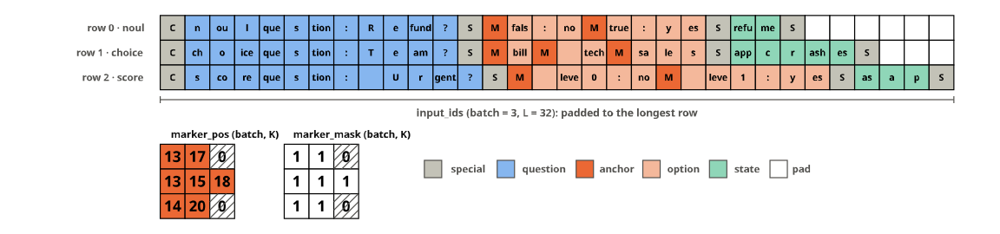
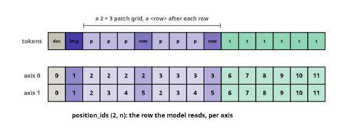

# figures


<!-- WARNING: THIS FILE WAS AUTOGENERATED! DO NOT EDIT! -->

The notebooks explain the tensor operations with diagrams: a batch of
rows, the gather at the anchors, the type embedding broadcast over a
row, the labels packed for the Trainer. Every diagram is drawn here,
from tensors that the library itself produces
([`collate`](https://sgaseretto.github.io/sysonelib/core.html#collate),
[`RowBuilder`](https://sgaseretto.github.io/sysonelib/template.html#rowbuilder),
[`DecisionHead`](https://sgaseretto.github.io/sysonelib/models.html#decisionhead)),
so a diagram cannot drift from the code it explains: when the code
changes, running this notebook redraws them, and the checks next to each
figure fail if the picture no longer matches the computation. Nothing
here is exported; the notebooks embed the SVG files with a link back to
the section that drew them.

tensordiagram draws one tensor at a time as SVG, without system
libraries; everything around the tensors (labels, arrows, brackets,
hatching for padding) is composed with
[chalk](https://chalk-diagrams.github.io), the drawing library
tensordiagram is built on. The helpers below are what that composition
needs.

## Helpers

A few facts about the two libraries shape the helpers. Chalk’s text has
no size of its own, so a label gets an explicit box, or layouts overlap
it. A 3-D tensor’s envelope covers only its front faces, so a figure
sizes its own background to include the top and side faces. Cells are
not named, so arrows need cell coordinates: tensordiagram centres 2-D
cell (r, c) at (c, r), and a 3-D cell (r, c, k) has its front face
centred at (c + ½ + ½k, r + ½ − ½k).

``` python
INK, INK2, MUTED = "#0b0b0b", "#52514e", "#898781"
SEGMENTS = {"special": "#c3c2b7", "question": "#86b6ef", "anchor": "#eb6834", "option": "#f4b89b", "state": "#8fd6b8", "pad": "#ffffff"}
PAL = dict(blue="#2a78d6", orange="#eb6834", aqua="#1baf7a", yellow="#eda100", violet="#4a3aa7", grey="#c3c2b7")

def tint(hexc, t=0.7):
    "`hexc` mixed with white (t = 1 is the colour itself)"
    r, g, b = (int(hexc[i:i + 2], 16) for i in (1, 3, 5))
    m = lambda c: round(c * t + 255 * (1 - t))
    return "#%02x%02x%02x" % (m(r), m(g), m(b))

def text_w(s, size): return 0.62 * size * max(len(s), 1)

def label(s, size=0.45, color=INK, x=0, y=0, align="c"):
    "Text at (x, y), centred or starting ('l') or ending ('r') there, with an explicit box"
    w = text_w(s, size)
    t = text(s, size).fill_color(Color(color)).line_width(0).with_envelope(rectangle(w, 1.3 * size))
    return t.translate(x + {"c": 0, "l": w / 2, "r": -w / 2}[align], y)

def seg(p, q, color=INK, w=None, dash=None):
    d = make_path([tuple(p), tuple(q)]).line_color(Color(color))
    if w is not None: d = d.line_width(w)
    return d.dashing(list(dash) if dash else [], 0)

def arrow(p, q, color=INK, head=0.22, w=None, dash=None):
    "A straight arrow from p to q with a filled head"
    p, q = P2(*p), P2(*q)
    u = (q - p) / (q - p).length; n = P2(-u.y, u.x); base = q - u * head * 1.6
    tip = make_path([tuple(q), tuple(base + n * head * 0.6), tuple(base - n * head * 0.6), tuple(q)], closed=True)
    return seg(p, base, color, w, dash) + tip.fill_color(Color(color)).line_color(Color(color)).line_width(0)

def hatch(x0, y0, x1, y1, color=MUTED, step=0.33):
    "45° hatching clipped to a rectangle: padded or masked cells"
    W, H, out, c = x1 - x0, y1 - y0, [], -(y1 - y0) + step
    while c < W - 1e-9:
        sx, sy, ex, ey = x0 + c, y1, x0 + c + H, y0
        if sx < x0: sy, sx = y1 - (x0 - sx), x0
        if ex > x1: ey, ex = y0 + (ex - x1), x1
        out.append(seg((sx, sy), (ex, ey), color)); c += step
    return concat(out)

def hbracket(x0, x1, y, txt, below=True, color=INK2, size=0.42, gap=0.32):
    "|-----| from x0 to x1 at height y, labelled under (or over) it"
    t = 0.14
    return concat([seg((x0, y), (x1, y), color), seg((x0, y - t), (x0, y + t), color), seg((x1, y - t), (x1, y + t), color),
                   label(txt, size, color, (x0 + x1) / 2, y + (gap + size / 2) * (1 if below else -1))])

class Placed:
    "A tensor diagram placed at (x, y): cell 0's centre for 1-D and 2-D, the front-top-left corner for 3-D"
    def __init__(self, d, x=0.0, y=0.0): self.d, self.x, self.y, self.shape = d, x, y, tuple(d.tensor_shape)
    @property
    def dia(self): return self.d.to_chalk_diagram().dashing([], 0).translate(self.x, self.y)
    def cell(self, *i):
        "Centre of cell i (its front face, for 3-D)"
        if len(self.shape) == 1: return P2(self.x, self.y + i[0])
        if len(self.shape) == 2: return P2(self.x + i[1], self.y + i[0])
        r, c, k = i
        return P2(self.x + c + 0.5 + 0.5 * k, self.y + r + 0.5 - 0.5 * k)
    def cell_box(self, *i): p = self.cell(*i); return (p.x - .5, p.y - .5, p.x + .5, p.y + .5)
    @property
    def bbox(self):
        "Visual extents (x0, y0, x1, y1), including a 3-D tensor's top and side faces"
        s = self.shape
        if len(s) == 1: return (self.x - .5, self.y - .5, self.x + .5, self.y + s[0] - .5)
        if len(s) == 2: return (self.x - .5, self.y - .5, self.x + s[1] - .5, self.y + s[0] - .5)
        R, C, D = s
        return (self.x, self.y - .5 * D, self.x + C + .5 * D, self.y + R)

def union(*bbs): return (min(b[0] for b in bbs), min(b[1] for b in bbs), max(b[2] for b in bbs), max(b[3] for b in bbs))

def figure(parts, extents, pad=0.4):
    "The parts over a white background that covers `extents`, which fixes the drawing's bounds"
    x0, y0, x1, y1 = extents
    back = rectangle(x1 - x0 + 2 * pad, y1 - y0 + 2 * pad).fill_color(Color("#ffffff")).line_width(0).translate((x0 + x1) / 2, (y0 + y1) / 2)
    return back + concat(parts)

IMAGES = Path("images")

def save(d, name, px_per_unit=30):
    "Write images/<name>.svg with chalk's pure-Python backend, with a viewBox so it scales down in a narrow page"
    IMAGES.mkdir(exist_ok=True)
    height = int(round(d.get_envelope().height * px_per_unit))
    with tempfile.TemporaryDirectory() as tmp:
        d.render_svg(f"{tmp}/f.svg", height=height, draw_height=400)
        svg = Path(f"{tmp}/f.svg").read_text()
    h, w = re.search(r'<svg[^>]*?height="(\d+)"[^>]*?width="(\d+)"', svg).groups()
    svg = svg.replace("<svg ", f'<svg viewBox="0 0 {w} {h}" ', 1)
    (IMAGES / f"{name}.svg").write_text(svg)
    return f"images/{name}.svg: {w} × {h} px, {len(svg) // 1024} kB"
```

## A batch of rows

Used in [core](00_core.ipynb#batches). Three questions over three
states, built by the fixture’s
[`RowBuilder`](https://sgaseretto.github.io/sysonelib/template.html#rowbuilder)
on Laya’s template and padded by
[`collate`](https://sgaseretto.github.io/sysonelib/core.html#collate):
every row is one question, with its own length and its own number of
options.

``` python
tok = AutoTokenizer.from_pretrained("fixtures/tiny-modernbert")
builder = RowBuilder(tok, "laya")
rows = [builder.build("refund me", {"type": "noul", "instructions": "Refund?", "criteria": {"false": "no", "true": "yes"}}),
        builder.build("app crashes", {"type": "choice", "instructions": "Team?", "criteria": ["billing", "tech", "sales"]}),
        builder.build("asap", {"type": "score", "instructions": "Urgent?", "criteria": ["no", "yes"]})]
batch = collate(rows, tok.pad_token_id)
{k: tuple(v.shape) for k, v in batch.items()}
```

    {'input_ids': (3, 32),
     'attention_mask': (3, 32),
     'marker_pos': (3, 3),
     'marker_mask': (3, 3),
     'qtype': (3,),
     'spans': (3, 3, 2),
     'answerable': (3,)}

Each position is labelled with the part of the row it belongs to, read
off the row itself: the opening token, the question up to the first
separator, each anchor and the option text behind it, the state after
the second separator, and the closing token.

``` python
def segments(row):
    "The segment of every position of a Laya-template row"
    out, stage = [], "question"
    for i, t in enumerate(row.ids):
        if i == 0 or t == tok.sep_token_id:
            out.append("special")
            if t == tok.sep_token_id: stage = {"question": "options", "options": "state"}.get(stage, stage)
        elif i in row.markers: out.append("anchor")
        else: out.append({"options": "option"}.get(stage, stage))
    return out

B, L = batch["input_ids"].shape
seg_of = np.full((B, L), "pad", dtype=object)
for r, row in enumerate(rows): seg_of[r, :row.n_tokens] = segments(row)
test_eq([[j for j in range(L) if seg_of[r, j] == "anchor"] for r in range(B)], [row.markers for row in rows])
short = lambda t: {"[CLS]": "C", "[SEP]": "S", "[MASK]": "M", "[PAD]": ""}.get(t, t.replace("Ġ", "")[:4])
names = np.full((B, L), "", dtype=object)
for r, row in enumerate(rows):
    for j, t in enumerate(row.ids): names[r, j] = short(tok.convert_ids_to_tokens(t))
```

``` python
ids = Placed(td.to_diagram(batch["input_ids"].numpy()).fill_color(lambda i, v: SEGMENTS[seg_of[i]]).fill_values(format=lambda i, v: names[i]), 0, 0)
mp = Placed(td.to_diagram(batch["marker_pos"].numpy()).fill_color(lambda i, v: SEGMENTS["anchor"] if batch["marker_mask"][i] else "#ffffff").fill_values(), 0, 5.2)
mm = Placed(td.to_diagram(batch["marker_mask"].int().numpy()).fill_color(lambda i, v: "#ffffff").fill_values(), 5.0, 5.2)
parts = [ids.dia, mp.dia, mm.dia]
for r in range(B):
    parts.append(label(f"row {r} · {QTYPE_NAMES[rows[r].qtype]}", 0.4, INK2, -0.8, r, align="r"))
    for k in range(batch["marker_mask"].shape[1]):
        if not batch["marker_mask"][r, k]: parts += [hatch(*mp.cell_box(r, k), color=INK2), hatch(*mm.cell_box(r, k), color=INK2)]
parts += [hbracket(-0.5, L - 0.5, B - 0.1, f"input_ids (batch = {B}, L = {L}): padded to the longest row"),
          label("marker_pos (batch, K)", 0.4, INK, -0.5, 4.3, align="l"), label("marker_mask (batch, K)", 0.4, INK, 4.5, 4.3, align="l")]
x = 10.5
for name, col in SEGMENTS.items():
    parts += [rectangle(0.7, 0.7).fill_color(Color(col)).line_color(Color(INK2)).translate(x, 5.7), label(name, 0.4, INK2, x + 0.55, 5.7, align="l")]
    x += 1.2 + text_w(name, 0.4)
save(figure(parts, union(ids.bbox, mp.bbox, mm.bbox, (-5.6, -0.5, L, 7.4))), "batch")
```

    'images/batch.svg: 1152 × 270 px, 111 kB'



## The gather at the anchors

Used in [models](03_models.ipynb#decisionhead). The head reads one
vector per option: the encoder’s output at that option’s anchor. For a
batch that is one `torch.gather` along the sequence axis, with
`marker_pos` repeated over the width; a padded option slot points at
position 0 and gathers a vector that `marker_mask` then hides. The
gather drawn is the head’s own, so scoring the gathered vectors equals
the head’s forward pass:

``` python
Bh, Lh, D = 2, 8, 4
h = torch.arange(Bh * Lh * D, dtype=torch.float32).reshape(Bh, Lh, D) / 10
marker_pos, marker_mask = torch.tensor([[1, 4, 6], [2, 5, 0]]), torch.tensor([[1, 1, 1], [1, 1, 0]]).bool()
qtype = torch.tensor([QTYPES["choice"], QTYPES["noul"]])
gathered = torch.gather(h, 1, marker_pos[:, :, None].expand(-1, -1, D))
head = DecisionHead(D, layers=0).eval()
test_close(head.score(gathered + head.type_emb(qtype)[:, None, :], marker_mask), head(h, torch.ones(Bh, Lh), marker_pos, marker_mask, qtype))
test_eq(gathered[1, 2], h[1, 0])        # the padded slot gathers position 0
```

``` python
KCOL = [PAL["blue"], PAL["orange"], PAL["aqua"]]
col_k = lambda b, k: PAL["grey"] if not marker_mask[b, k] else KCOL[k]
def src(i, v):
    b, l, _ = i
    for k in range(marker_pos.shape[1]):
        if marker_pos[b, k] == l and marker_mask[b, k]: return tint(col_k(b, k), .85)
    return "#f3f2ee"
H = Placed(td.to_diagram(h).fill_color(src), 0, 0)
O = Placed(td.to_diagram(gathered).fill_color(lambda i, v: tint(col_k(i[0], i[1]), .85)), 15.2, 0)
parts = [H.dia, O.dia]
for T_, n, nm in ((H, Lh, "L"), (O, marker_pos.shape[1], "K")):
    for c in range(n): parts.append(label(str(c), 0.3, MUTED, T_.x + c + .5, Bh + 0.35))
    for b in range(Bh): parts.append(label(f"b={b}", 0.34, INK2, T_.x - 0.25, b + .5, align="r"))
    parts.append(hbracket(T_.x, T_.x + n, Bh + 0.8, f"{nm} = {n}", size=0.38))
    parts += [seg((T_.x - .18, -.18), (T_.x - .18 + .5 * D, -.18 - .5 * D), INK2), label(f"width = {D}", 0.36, INK2, T_.x - 0.4, -.25 * D - .35, align="r")]
parts += [label("h: the encoder's output (batch, L, width)", 0.45, INK, H.x, -3.0, align="l"),
          label("anchors (batch, K, width)", 0.45, INK, O.x, -3.0, align="l")]
ax0, ax1 = H.bbox[2] + 0.6, O.x - 1.6
parts += [arrow((ax0, 1.0), (ax1, 1.0), INK2, head=0.25), label("gather(1, marker_pos)", 0.36, INK, (ax0 + ax1) / 2, 0.45)]
mp2 = Placed(td.to_diagram(marker_pos.numpy()).fill_color(lambda i, v: tint(col_k(*i), .85)).fill_values(font_size=0.4), 3.0, 5.4)
mm2 = Placed(td.to_diagram(marker_mask.int().numpy()).fill_color(lambda i, v: "#ffffff").fill_values(font_size=0.4), 8.0, 5.4)
parts += [mp2.dia, mm2.dia, hatch(*mp2.cell_box(1, 2), color=INK2), hatch(*mm2.cell_box(1, 2), color=INK2),
          label("marker_pos (batch, K)", 0.38, INK, mp2.x - 0.5, 4.45, align="l"), label("marker_mask (batch, K)", 0.38, INK, mm2.x - 0.5, 4.45, align="l"),
          label("anchors[b, k, :] = h[b, marker_pos[b, k], :]; the padded slot (b = 1, k = 2) gathers h[1, 0, :], and marker_mask hides it", 0.34, INK2, mp2.x - 0.5, 7.3, align="l")]
save(figure(parts, union(H.bbox, O.bbox, (H.x - 2.4, -3.4, O.bbox[2] + 0.3, 7.7))), "anchor_gather")
```

    'images/anchor_gather.svg: 924 × 357 px, 140 kB'


## The type embedding, broadcast over a row

Used in [models](03_models.ipynb#decisionhead). Before its layers, the
head adds a learned vector for the question’s type to every position of
the row: one row of `type_emb.weight` per example, picked by `qtype`,
given a length-1 sequence axis with `[:, None, :]` and broadcast along
the row’s length, so no copy is made. This is how one head answers three
kinds of question: the same anchors read differently when the row is a
score rather than a choice.

``` python
Bt, Lt, Dt = 2, 6, 4
W = torch.tensor([[0.2, -0.1, 0.4, 0.0], [-0.3, 0.5, 0.1, 0.2], [0.1, 0.3, -0.2, -0.4]])    # type_emb.weight: choice, score, noul
qt = torch.tensor([QTYPES["choice"], QTYPES["noul"]])
hb = torch.zeros(Bt, Lt, Dt)
e = W[qt][:, None, :]                                          # (batch, 1, width)
test_eq(e.shape, (Bt, 1, Dt)); test_eq((hb + e).shape, (Bt, Lt, Dt))
emb = torch.nn.Embedding(3, Dt); emb.weight.data = W
test_eq(emb(qt).detach()[:, None, :], e)                                # what DecisionHead.forward adds
```

``` python
TCOL = {0: PAL["orange"], 1: PAL["violet"], 2: PAL["aqua"]}
rowcol = lambda b: TCOL[int(qt[b])]
fmt1 = lambda i, v: f"{v:+.1f}"
parts = []
q_ = Placed(td.to_diagram(qt.numpy()).fill_color(lambda i, v: tint(TCOL[int(v)], .7)).fill_values(font_size=0.42), 0.8, 0)
W_ = Placed(td.to_diagram(W.numpy()).fill_color(lambda i, v: tint(TCOL[i[0]], .45)).fill_values(font_size=0.3, format=fmt1), 4.6, -0.5)
E_ = Placed(td.to_diagram(W[qt].numpy()).fill_color(lambda i, v: tint(rowcol(i[0]), .7)).fill_values(font_size=0.3, format=fmt1), 12.6, 0)
parts += [q_.dia, W_.dia, E_.dia, label("qtype (batch,)", 0.38, INK, q_.x, -1.05), label("type_emb.weight (3, width)", 0.38, INK, W_.x + 1.5, -1.55),
          label("type_emb(qtype) (batch, width)", 0.38, INK, E_.x + 1.5, -1.05)]
for b in range(Bt): parts.append(label(f"b={b}", 0.32, MUTED, q_.x - 0.65, b, align="r"))
for name, i in QTYPES.items(): parts.append(label(name, 0.3, INK2, W_.x - 0.65, W_.y + i, align="r"))
parts += [arrow((q_.x + 0.7, 0.5), (W_.x - 1.9, 0.5), INK2, head=0.2), label("picks rows", 0.3, INK2, (q_.x + W_.x - 1.2) / 2, 0.1),
          arrow((W_.x + Dt - 0.3, 0.5), (E_.x - 0.7, 0.5), INK2, head=0.2)]
y3 = 5.2
H_ = Placed(td.to_diagram(hb).fill_color("#f3f2ee"), 0, y3)
Eb = Placed(td.to_diagram(torch.zeros(Bt, Lt, Dt)).fill_color(lambda i, v: tint(rowcol(i[0]), .8)).fill_opacity(lambda i, v: 1.0 if i[1] == 0 else 0.22), 11.0, y3)
O_ = Placed(td.to_diagram(hb + e).fill_color(lambda i, v: tint(rowcol(i[0]), .45)), 22.0, y3)
parts += [H_.dia, Eb.dia, O_.dia]
for T_, nm in ((H_, "h (batch, L, width)"), (Eb, "type_emb(qtype)[:, None, :] (batch, 1, width)"), (O_, "h + type_emb(qtype)[:, None, :]")):
    parts.append(label(nm, 0.36, INK, T_.x, y3 - Dt / 2 - 0.75, align="l"))
    for b in range(Bt): parts.append(label(f"b={b}", 0.3, MUTED, T_.x - 0.2, y3 + b + .5, align="r"))
    parts.append(hbracket(T_.x, T_.x + (1 if T_ is Eb else Lt), y3 + Bt + 0.35, "1" if T_ is Eb else f"L = {Lt}", size=0.34))
parts += [label("broadcast along L: no copy", 0.3, INK2, Eb.x + 1 + (Lt - 1) / 2, y3 + Bt + 0.7),
          label("+", 0.9, INK, (H_.bbox[2] + Eb.x) / 2 - 0.1, y3 + 1.0), label("=", 0.9, INK, (Eb.bbox[2] + O_.x) / 2 - 0.1, y3 + 1.0),
          arrow((E_.x + 0.5, 1.75), (Eb.x + 0.8, y3 - Dt / 2 - 1.15), INK2, head=0.2), label("[:, None, :]", 0.32, INK2, E_.x + 1.0, (1.9 + y3 - Dt / 2 - 1.2) / 2, align="l")]
save(figure(parts, union(H_.bbox, O_.bbox, q_.bbox, (-1.6, -2.0, O_.bbox[2] + 0.2, y3 + Bt + 1.2))), "type_embedding")
```

    'images/type_embedding.svg: 977 × 336 px, 219 kB'


## The masked softmax

Used in [models](03_models.ipynb#decisionhead) and
[losses](04_losses.ipynb#soft-cross-entropy). A batch mixes rows with
different option counts, so every row’s logits are padded to the batch’s
K; the head writes −10<sup>4</sup> into the padded slots, and the
softmax across the options gives them a probability of exactly 0, so
they take no probability mass and, in the loss, no gradient.

``` python
zs = torch.tensor([[2.0, 0.5, -1.0, 0.0], [0.3, -0.3, 0.0, 0.0], [0.1, 1.2, 0.4, -0.5]])
ms = torch.tensor([[1, 1, 1, 1], [1, 1, 0, 0], [1, 1, 1, 1]]).bool()
zm = zs.masked_fill(~ms, -1e4)                                 # what DecisionHead.score does to padded slots
ps = torch.softmax(zm, -1)
test_eq(ps[~ms].abs().max().item(), 0.0)
test_close(ps.sum(-1), torch.ones(3))
```

``` python
fmtz = lambda i, v: "−10⁴" if v <= -1e3 else f"{v:.2f}"
cell_col = lambda i, v: SEGMENTS["option"] if ms[i] else "#f3f2ee"
Zp = Placed(td.to_diagram(zm.numpy()).fill_color(cell_col).fill_values(format=fmtz, font_size=0.3), 0, 0)
Pp = Placed(td.to_diagram(ps.numpy()).fill_color(cell_col).fill_values(format=lambda i, v: f"{v:.2f}", font_size=0.3), 7.5, 0)
parts = [Zp.dia, Pp.dia, label("logits (batch, K)", 0.4, INK, -0.5, -1.1, align="l"), label("p = softmax over K", 0.4, INK, 7.0, -1.1, align="l"),
         arrow((Zp.bbox[2] + 0.4, 1), (Pp.bbox[0] - 0.4, 1), INK2, head=0.2), label("softmax(dim=-1)", 0.32, INK2, (Zp.bbox[2] + Pp.bbox[0]) / 2, 0.45)]
for r, name in enumerate(("choice, k = 4", "noul, k = 2", "score, k = 4")): parts.append(label(name, 0.32, MUTED, -0.8, r, align="r"))
for T_ in (Zp, Pp):
    for k in (2, 3): parts.append(hatch(*T_.cell_box(1, k), color=INK2, step=0.5))
save(figure(parts, union(Zp.bbox, Pp.bbox, (-4.0, -1.6, Pp.bbox[2], 3.0))), "masked_softmax")
```

    'images/masked_softmax.svg: 475 × 162 px, 27 kB'


## A row and its budgets

Used in [template](01_template.ipynb#rowbuilder). A row built with small
budgets, so all of them bind: every option is its anchor and at most
`option_tokens` tokens, the question and its options share
`head_max_len`, and the state gets what is left of `max_len`, cut on the
right.

``` python
small = RowBuilder(tok, RowTemplate.preset("laya").replace(max_len=40, head_max_len=24, option_tokens=3))
rb = small.build("the customer writes that the invoice was charged twice and asks for the money back today",
                 {"type": "choice", "instructions": "Which team?", "criteria": {"billing": "invoices, refunds", "tech": "bugs, outages", "sales": "contracts"}})
sg = segments(rb)
first_sep, second_sep = [j for j, t in enumerate(rb.ids) if t == tok.sep_token_id][:2]
test_eq((rb.n_tokens, len(rb.markers)), (40, 3))
test_eq(all(b - a <= 1 + 3 for a, b in zip(rb.markers, rb.markers[1:] + [second_sep])), True)   # anchor + at most 3 tokens
test_eq((first_sep - 1) + (second_sep - first_sep - 1), 24)     # the question run and the options fill head_max_len; the question was cut to fit
```

``` python
rn = [short(tok.convert_ids_to_tokens(t)) for t in rb.ids]
R_ = Placed(td.to_diagram(np.array(rb.ids)[None]).fill_color(lambda i, v: SEGMENTS[sg[i[1]]]).fill_values(format=lambda i, v: rn[i[1]], font_size=0.28), 0, 0)
parts = [R_.dia]
ends = rb.markers[1:] + [second_sep]
for k, (a, b) in enumerate(zip(rb.markers, ends)): parts.append(hbracket(a - 0.45, b - 0.55, -0.85, f"option {k}: ≤ 1 + 3", below=False, size=0.28, gap=0.25))
parts += [hbracket(0.55, first_sep - 0.55, -0.85, "question: what is left of 24", below=False, size=0.28, gap=0.25),
          hbracket(-0.45, second_sep + 0.45, 0.8, "the question and its options: head_max_len = 24", size=0.32),
          hbracket(second_sep + 0.55, rb.n_tokens - 1.55, 0.8, "the state: the rest of max_len = 40, cut on the right", size=0.32),
          hbracket(-0.45, rb.n_tokens - 0.55, 2.2, f"the row: max_len = {rb.n_tokens} tokens", size=0.32)]
save(figure(parts, (-0.8, -2.2, rb.n_tokens, 3.2)), "row_budgets")
```

    'images/row_budgets.svg: 1247 × 186 px, 43 kB'


## Labels packed for the Trainer

Used in [learner](05_learner.ipynb#decisiontrainer). `prediction_step`
hands the Trainer one tensor per batch, (batch, K, 5): the target, the
marker mask, the question type, the label and whether the gold answers
the question at all (for the act head), each broadcast over the options.
Batches have different K, and the Trainer’s evaluation loop joins them
with `nested_concat`, padding with −100; the packing puts the options on
the axis that gets padded, and the mask channel is what tells a real
option from padding when
[`unpack_labels`](https://sgaseretto.github.io/sysonelib/learner.html#unpack_labels)
reads them back.

``` python
from transformers.trainer_pt_utils import nested_concat
```

``` python
gold_rows = [builder.build("refund me", {"type": "noul", "instructions": "Refund?", "criteria": {"false": "no", "true": "yes"}}, {"noul": 0.8}),
             builder.build("app crashes", {"type": "choice", "instructions": "Team?", "criteria": ["billing", "tech", "sales"]}, {"label": "tech"}),
             builder.build("asap", {"type": "score", "instructions": "Urgent?", "criteria": ["no", "yes"]}, {"score": 0.9}),
             builder.build("hello", {"type": "noul", "instructions": "Spam?", "criteria": {"false": "no", "true": "yes"}}, {"noul": 0.1})]
pa, pb = pack_labels(collate(gold_rows[:2], 0)), pack_labels(collate(gold_rows[2:], 0))
joined = nested_concat(pa, pb, padding_index=-100)
test_eq((tuple(pa.shape), tuple(pb.shape), tuple(joined.shape)), ((2, 3, 5), (2, 2, 5), (4, 3, 5)))
from sysone.learner import unpack_labels
tg, mk, qq, lb = unpack_labels(joined.numpy())
test_eq(mk.sum(-1).tolist(), [2, 3, 2, 2])
```

``` python
CH = [("target", PAL["blue"]), ("marker mask", PAL["grey"]), ("qtype", PAL["violet"]), ("label", PAL["aqua"]), ("answerable", PAL["orange"])]
parts, x = [], 0.0
fmtp = lambda i, v: "−100" if v == -100 else (f"{v:.1f}" if abs(v - round(v)) > 1e-6 else f"{int(v)}")
for c, (name, colr) in enumerate(CH):
    P_ = Placed(td.to_diagram(joined[..., c].numpy()).fill_color(lambda i, v, colr=colr: "#ffffff" if v == -100 else tint(colr, .45)).fill_values(format=fmtp, font_size=0.3), x, 0)
    parts += [P_.dia, label(f"[..., {c}] {name}", 0.36, INK, x - 0.5, -1.0, align="l")]
    for r in range(4):
        for k in range(3):
            if joined[r, k, c] == -100: parts.append(hatch(*P_.cell_box(r, k), color=MUTED, step=0.5))
    x += 4.6
parts += [label("batch 1 (K = 3)", 0.32, INK2, -0.8, 0.5, align="r"), label("batch 2 (K = 2)", 0.32, INK2, -0.8, 2.5, align="r"),
          seg((-0.7, 1.5), (x - 1.1, 1.5), INK2, dash=[4, 3]),
          label("nested_concat(batch 1, batch 2, padding_index=-100): the options axis is padded, the batches stacked", 0.32, INK2, -0.5, 4.2, align="l")]
save(figure(parts, (-4.2, -1.5, x - 1.0, 4.6)), "pack_labels")
```

    'images/pack_labels.svg: 810 × 207 px, 62 kB'


## What a feature cache stores

Used in [cache](07_cache.ipynb). A frozen encoder gives the same output
for a row every epoch, so it runs once. `rows` mode keeps the whole
output, a vector per position, which a head with layers needs; `masks`
mode keeps only the vectors at the anchors, k per row instead of n,
which is all a head without layers reads.

``` python
row_c = gold_rows[1]
hid = torch.arange(row_c.n_tokens * 4, dtype=torch.float32).reshape(row_c.n_tokens, 4).T      # (width, n): positions along the axis
anc = hid[:, row_c.markers]
test_eq(anc.shape, (4, len(row_c.markers)))
```

``` python
is_m = lambda j: j in row_c.markers
Hc = Placed(td.to_diagram(hid.numpy()).fill_color(lambda i, v: SEGMENTS["anchor"] if is_m(i[1]) else SEGMENTS["question"] if sg_c[i[1]] == "question" else "#e8e7e1"), 0, 0) if (sg_c := segments(row_c)) else None
Ac = Placed(td.to_diagram(anc.numpy()).fill_color(SEGMENTS["anchor"]), row_c.n_tokens + 3.0, 0)
parts = [Hc.dia, Ac.dia, hbracket(-0.5, row_c.n_tokens - 0.5, 3.8, f"rows mode: n × width per row (n = {row_c.n_tokens} here; 291 on average for typed-decisions: 3.6 GB)", size=0.34),
         hbracket(Ac.x - 0.5, Ac.x + len(row_c.markers) - 0.5, 3.8, f"masks mode: k × width (k = {len(row_c.markers)}; 3.55 on average: 44 MB)", size=0.34),
         arrow((Hc.bbox[2] + 0.3, 1.5), (Ac.bbox[0] - 0.3, 1.5), INK2, head=0.2), label("keep the anchors", 0.3, INK2, (Hc.bbox[2] + Ac.bbox[0]) / 2, 0.95),
         label("the encoder's output for one row (width × positions)", 0.38, INK, -0.5, -1.0, align="l")]
save(figure(parts, (-0.8, -1.5, Ac.bbox[2] + 9.5, 5.0)), "cache_modes")
```

    'images/cache_modes.svg: 1367 × 219 px, 57 kB'


## NeoMME’s two-axis positions

Used in [multimodal](20_neomme.ipynb). NeoMME reads an image as `<doc>`,
the marker ``, then a grid of patch placeholders with a `<row>`
after each row of patches, and gives every position two coordinates.
Text runs along the diagonal (both coordinates equal); patch (r, c) of a
grid that opens at d sits at (d + 2 + r, d + 2 + c); text after the grid
resumes on the diagonal past both of the grid’s axes. The positions are
[`neomme_positions`](https://sgaseretto.github.io/sysonelib/neomme.html#neomme_positions)’
own:

``` python
from sysone.multimodal import neomme_positions
```

``` python
gh, gw, n_text = 2, 3, 6
kinds = ["<doc>", ""] + (["patch"] * gw + ["<row>"]) * gh + ["text"] * n_text
pos = neomme_positions(len(kinds), image_at=1, h=gh, w=gw)
test_eq(pos[:, :2].tolist(), [[0, 1], [0, 1]])
test_eq(pos[:, 2].tolist(), [2, 2]); test_eq(pos[:, 2 + gw + 1].tolist(), [3, 2])        # patch (0, 0), then patch (1, 0)
test_eq((pos[0, -n_text:] == pos[1, -n_text:]).all().item(), True)                          # text is back on the diagonal
```

``` python
KC = {"<doc>": "#c3c2b7", "": PAL["violet"], "patch": tint(PAL["violet"], .35), "<row>": tint(PAL["violet"], .7), "text": SEGMENTS["state"]}
Tk = Placed(td.to_diagram(np.zeros((1, len(kinds)))).fill_color(lambda i, v: KC[kinds[i[1]]]).fill_values(format=lambda i, v: {"patch": "p", "text": "t"}.get(kinds[i[1]], kinds[i[1]][1:-1][:3]), font_size=0.26), 0, 0)
Pz = Placed(td.to_diagram(pos.numpy()).fill_color(lambda i, v: tint(KC[kinds[i[1]]], .6)).fill_values(font_size=0.34), 0, 2.0)
parts = [Tk.dia, Pz.dia, label("tokens", 0.34, INK2, -0.8, 0, align="r"), label("axis 0", 0.34, INK2, -0.8, 2, align="r"), label("axis 1", 0.34, INK2, -0.8, 3, align="r"),
         hbracket(1.55, 1.45 + gh * (gw + 1), -0.9, f"a {gh} × {gw} patch grid, a <row> after each row", below=False, size=0.32, gap=0.25),
         label("position_ids (2, n): the row the model reads, per axis", 0.36, INK, -0.5, 4.3, align="l")]
save(figure(parts, (-2.4, -1.8, len(kinds), 4.8)), "neomme_positions")
```

    'images/neomme_positions.svg: 576 × 222 px, 45 kB'



## RLCD’s noise draws

Used in [losses](04_losses.ipynb#rlcd). For one row with three real
options in a batch padded to K = 4, four draws: the noise is zeroed on
the padded slot by the mask, then each draw is shifted so its real
options sum to zero, because softmax cannot see a shift of all the
logits and the part of the noise along it would only add variance. These
are RLCD’s two lines, applied to fixed draws:

``` python
m1, k1 = torch.tensor([True, True, True, False]), 3
raw = torch.tensor([[0.3, -0.1, 0.5, 0.2], [-0.4, 0.2, 0.1, -0.3], [0.2, 0.3, 0.4, 0.1], [-0.1, -0.5, 0.2, 0.4]]) * m1
proj = (raw - raw.sum(-1, keepdim=True) / k1) * m1               # rlcd_loss: eps = (eps - eps.sum(-1, keepdim=True) / k) * mask
test_close(proj.sum(-1), torch.zeros(4))
test_eq(proj[:, 3].abs().max().item(), 0.0)
```

``` python
fmtn = lambda i, v: f"{round(float(v), 2) + 0.0:+.2f}"     # no "-0.00"
cn = lambda i, v: "#f3f2ee" if not m1[i[1]] else tint(PAL["blue"], .3 + 0.6 * min(1, abs(v) / 0.5))
Rn = Placed(td.to_diagram(raw.numpy()).fill_color(cn).fill_values(format=fmtn, font_size=0.28), 0, 0)
Sr = Placed(td.to_diagram(raw.sum(-1, keepdim=True).numpy()).fill_color("#ffffff").fill_values(format=fmtn, font_size=0.28), 4.6, 0)
Pn = Placed(td.to_diagram(proj.numpy()).fill_color(cn).fill_values(format=fmtn, font_size=0.28), 8.6, 0)
Sp = Placed(td.to_diagram(proj.sum(-1, keepdim=True).numpy()).fill_color("#ffffff").fill_values(format=fmtn, font_size=0.28), 13.2, 0)
parts = [Rn.dia, Sr.dia, Pn.dia, Sp.dia, label("draws ε · mask (G, K)", 0.36, INK, -0.5, -1.0, align="l"), label("Σ", 0.4, INK, 4.6, -1.6),
         label("ε − its mean (real options)", 0.36, INK, 8.1, -1.0, align="l"), label("Σ", 0.4, INK, 13.2, -1.6),
         arrow((Sr.bbox[2] + 0.3, 1.5), (Pn.bbox[0] - 0.3, 1.5), INK2, head=0.2), label("minus the mean", 0.28, INK2, (Sr.bbox[2] + Pn.bbox[0]) / 2, 0.95)]
for T_ in (Rn, Pn):
    for g in range(4): parts.append(hatch(*T_.cell_box(g, 3), color=MUTED, step=0.5))
for g in range(4): parts.append(label(f"g={g}", 0.3, MUTED, -0.8, g, align="r"))
save(figure(parts, (-2.0, -1.5, Sp.bbox[2], 3.6)), "rlcd_noise")
```

    'images/rlcd_noise.svg: 495 × 177 px, 46 kB'


