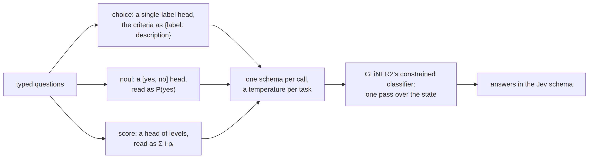

# GLiNER backend


<!-- WARNING: THIS FILE WAS AUTOGENERATED! DO NOT EDIT! -->

Route A put GLiNER2.5-Decide’s encoder under the sysone head. Route B
keeps the whole model and drives it through the `gliner2` package
(`sysone[gliner]`): a choice becomes a single-label head with the
criteria as `{label: description}` and the instructions as the head’s
prompt, a noul a `["yes", "no"]` head read as P(yes), a score a head of
string levels read as Σ i·pᵢ. Full distributions come from GLiNER2’s
constrained classifier, whose single-label heads are softmaxed, so the
distribution is proper; multi-label heads are sigmoids and are never
used for typed decisions. Several questions of one call share one row,
GLiNER2’s own batching, and answers come back in the Jev schema like
every other backend.

`gliner2` 2.0.0 installs without its `local` extra and then runs on the
transformers 5 stack sysone uses (its extras pin transformers below 5;
the package itself does not need it), so it can share an environment
with the rest of sysone; it does need `peft` even for inference. What
this route gives up: the feature cache (the labels sit in the input, so
encoder outputs change with the label set), `lr_find`, the presets and
RLCD (GLiNER2’s loss is a binary cross-entropy on the true labels, so
soft targets collapse to the label), and Laya’s export format.

<div>

<figure class=''>

<div>



</div>

</figure>

</div>

## Questions as heads

Each kind of question becomes a GLiNER2 classification head in its own
way, so
[`gliner_labels`](https://sgaseretto.github.io/sysonelib/gliner_backend.html#gliner_labels)
is a [generic
function](00_core.ipynb#generic-functions-and-multiple-dispatch) with a
method per kind: a choice’s labels are its keys, a score’s are its
levels, and a noul’s are `yes` and `no`.

------------------------------------------------------------------------

<a
href="https://github.com/sgaseretto/sysonelib/blob/main/sysone/gliner.py#L43"
target="_blank" style="float:right; font-size:smaller">source</a>

### gliner_tasks

``` python
def gliner_tasks(
    questions, temperatures:dict | None=None
)->list:
```

*One single-label task per question: name, labels (with descriptions),
prompt and temperature*

``` python
from pathlib import Path
```

``` python
recs = [json.loads(l) for l in Path("fixtures/typed_decisions_tiny.jsonl").read_text().splitlines()]
tasks = gliner_tasks(recs[0]["questions"], {"noul:2": 1.5})
[(t["task"], t["names"], t["temperature"]) for t in tasks]
```

    [('action', ['continue', 'human_review', 'observe', 'stop'], 1.0),
     ('needs_review', ['yes', 'no'], 1.5),
     ('outcome', ['failure', 'harmful', 'partial', 'success'], 1.0),
     ('risk', ['0', '1', '2', '3'], 1.0),
     ('urgency', ['0', '1', '2', '3'], 1.0)]

``` python
t = {x["task"]: x for x in tasks}
test_eq(t["needs_review"]["names"], ["yes", "no"])
test_eq(t["needs_review"]["labels"]["yes"], recs[0]["questions"]["needs_review"]["criteria"]["true"])
test_eq((t["needs_review"]["temperature"], t["action"]["temperature"]), (1.5, 1.0))
test_eq(t["risk"]["names"], ["0", "1", "2", "3"])
```

## GlinerDecider

[`GlinerDecider.predict`](https://sgaseretto.github.io/sysonelib/gliner_backend.html#glinerdecider.predict)
builds one constrained-classifier schema for the call, a single-label
task per question at its calibrated temperature (GLiNER2 applies it
inside its softmax), runs it on the state’s text, and reads each task’s
full distribution back into the question’s key order. The classifier
call is a function of the text and the tasks,
`classify(text, tasks) -> {task: {label: p}}`; the default one uses
`gliner2`, and a stand-in makes the mapping testable without it.
`.model` is the loaded `AutoExtractor`, so `extract_entities`,
`extract_relations`, `extract_json` and `create_schema()` are one
attribute away.

------------------------------------------------------------------------

<a
href="https://github.com/sgaseretto/sysonelib/blob/main/sysone/gliner.py#L70"
target="_blank" style="float:right; font-size:smaller">source</a>

### GlinerDecider

``` python
def GlinerDecider(
    model:NoneType=None, temperatures:dict | None=None, classify:NoneType=None, digits:int | None=4,
    name:str='gliner2'
):
```

*Typed answers in the Jev schema from a GLiNER2 model*

------------------------------------------------------------------------

<a
href="https://github.com/sgaseretto/sysonelib/blob/main/sysone/gliner.py#L61"
target="_blank" style="float:right; font-size:smaller">source</a>

### gliner2_classify

``` python
def gliner2_classify(
    model
):
```

*The classify function of a loaded GLiNER2 model: full distributions
from its constrained classifier*

------------------------------------------------------------------------

<a
href="https://github.com/sgaseretto/sysonelib/blob/main/sysone/gliner.py#L53"
target="_blank" style="float:right; font-size:smaller">source</a>

### gliner2_schema

``` python
def gliner2_schema(
    tasks
):
```

*GLiNER2’s classification schema for
[`gliner_tasks`](https://sgaseretto.github.io/sysonelib/gliner_backend.html#gliner_tasks):
a single-label task per question, its instructions as the prompt*

With a stand-in classifier that returns fixed distributions, the answers
come back in the schema, a noul’s `yes` read as P(true), a score’s
levels as its expected level:

``` python
def fake_classify(text, tasks):
    return {t["task"]: {n: (i + 1) / sum(range(1, len(t["names"]) + 1)) for i, n in enumerate(t["names"])} for t in tasks}

gd = GlinerDecider(classify=fake_classify)
ans = gd.predict(recs[0]["state"], recs[0]["questions"])
ans["needs_review"], ans["risk"]["score"]
```

    ({'type': 'noul',
      'noul': 0.3333,
      'confidence': 0.6667,
      'answer_confidence': 0.6667},
     2.0)

``` python
test_close(ans["needs_review"]["noul"], 1 / 3, eps=1e-4)                  # "yes" is the first of two labels: p = 1/3
test_close(ans["risk"]["score"], sum(i * (i + 1) / 10 for i in range(4)), eps=1e-4)
test_eq(ans["action"]["choice"], list(recs[0]["questions"]["action"]["criteria"])[-1])
```

<div>

> **Finding: gliner2 refuses an empty instruction**
>
> On the real checkpoint, the backend stopped on the first question that
> had no instructions. The heads of Fastino’s benchmark have none, just
> a name and labels, and `gliner2` refuses an empty string as a prompt:
> it takes `None` for no prompt.
> [`gliner2_schema`](https://sgaseretto.github.io/sysonelib/gliner_backend.html#gliner2_schema)
> now passes `None`, and then a question sent on its own makes exactly
> the call the benchmark’s card scores. On the card’s 2,600 single-label
> decisions, the backend gives the card’s label every time (the
> `eval: false` cell below; the [GLiNER2.5-Decide
> tutorial](tutorials/gliner_decide.ipynb) runs the rest of the
> comparison). `gliner2` also refuses parentheses and its own markers
> (`[P]`, `[L]` and the rest) inside instructions and labels, because it
> writes them into the row as they are. None of the typed-decisions
> questions contain them.

</div>

``` python
if importlib.util.find_spec("gliner2") is not None:            # with the gliner extra installed
    s = gliner2_schema(gliner_tasks({"q": {"type": "choice", "instructions": "", "criteria": ["a", "b"]},
                                     "r": {"type": "noul", "instructions": "It holds."}}))
    test_eq((s.task_spec("q").instruction, s.task_spec("r").instruction), (None, "It holds."))
```

``` python
import torch
from huggingface_hub import snapshot_download
from gliner2 import AutoExtractor
files = sorted(Path(snapshot_download("fastino/fast-decisions", repo_type="dataset")).glob("*.jsonl"))
rows = [json.loads(l) for f in files for l in f.read_text().splitlines()]
model = AutoExtractor.from_pretrained("fastino/GLiNER2.5-Decide").to("mps" if torch.backends.mps.is_available() else "cpu")
gd = GlinerDecider(model)
same = [gd.predict(r["input"], {h["task"]: {"type": "choice", "instructions": "", "criteria": h["labels"]}})[h["task"]]["choice"]
        == model.classify_text(r["input"], {h["task"]: h["labels"]})[h["task"]]
        for r in rows for h in r["output"]["classifications"] if not h["multi_label"]]
sum(same), len(same)          # (2600, 2600) on 2026-09-29, an M3 Pro
```

## Training data

[`gliner_example`](https://sgaseretto.github.io/sysonelib/gliner_backend.html#gliner_example)
writes one record in GLiNER2’s training format: the state as `input`,
and under `output.classifications` one entry per question with gold, its
labels, the gold label as a one-element list (GLiNER2’s trainer requires
a list), the instructions as the prompt and the descriptions. Extraction
annotations a record carries (`entities`, `relations`,
`json_structures`) pass through untouched, so one file can train
decisions and extraction together.

------------------------------------------------------------------------

<a
href="https://github.com/sgaseretto/sysonelib/blob/main/sysone/gliner.py#L123"
target="_blank" style="float:right; font-size:smaller">source</a>

### write_gliner_jsonl

``` python
def write_gliner_jsonl(
    records, path
)->pathlib.Path:
```

*A GLiNER2 training file from typed-decision records*

------------------------------------------------------------------------

<a
href="https://github.com/sgaseretto/sysonelib/blob/main/sysone/gliner.py#L108"
target="_blank" style="float:right; font-size:smaller">source</a>

### gliner_example

``` python
def gliner_example(
    record:dict
)->dict:
```

*One GLiNER2 training example from a typed-decision record*

``` python
ex = gliner_example(recs[0])
[c | {"prompt": c["prompt"][:30]} for c in ex["output"]["classifications"]][:2]
```

    [{'task': 'action',
      'labels': ['continue', 'human_review', 'observe', 'stop'],
      'true_label': ['human_review'],
      'prompt': 'What should the observability ',
      'label_descriptions': {'continue': 'Let the agent proceed without interruption.',
       'human_review': 'Queue this trace for a human to review.',
       'observe': 'Keep running, but flag the trace for later sampling.',
       'stop': 'Halt the agent now.'}},
     {'task': 'needs_review',
      'labels': ['yes', 'no'],
      'true_label': ['yes'],
      'prompt': 'This trace requires human revi',
      'label_descriptions': {'yes': 'A human should inspect this run.',
       'no': 'No human attention is warranted.'}}]

``` python
c = {x["task"]: x for x in ex["output"]["classifications"]}
test_eq(c["action"]["true_label"], ["human_review"])
test_eq(c["needs_review"]["true_label"], ["yes"])
test_eq(c["urgency"]["true_label"], ["1"])
test_eq(json.loads(Path(write_gliner_jsonl(recs[:3], Path(tempfile.mkdtemp()) / "t.jsonl")).read_text().splitlines()[2])["input"][:1], "{")
```

## GlinerLearner

[`GlinerLearner`](https://sgaseretto.github.io/sysonelib/gliner_backend.html#glinerlearner)
writes the splits to JSONL and drives GLiNER2’s `ExtractorTrainer`:
`train="head"` is LoRA on the classification head alone, the
frozen-encoder variant; `"lora"` adds the encoder’s projections;
`"full"` trains everything at GLiNER2’s two learning rates (encoder
1e-5, heads 5e-4). `calibrate` fits one temperature per type and
option-count bucket on the held-out slice, from the log-probabilities
the model reports at temperature 1, and the decider applies them through
the classifier’s own temperature. `export` writes GLiNER2’s format, a
merged model or, with `merge=False`, the PEFT adapter of a LoRA run,
plus `sysone_gliner.json` with the temperatures;
[`Decider.load`](https://sgaseretto.github.io/sysonelib/inference.html#decider.load)
recognises both.

------------------------------------------------------------------------

<a
href="https://github.com/sgaseretto/sysonelib/blob/main/sysone/gliner.py#L133"
target="_blank" style="float:right; font-size:smaller">source</a>

### GlinerLearner

``` python
def GlinerLearner(
    data:sysone.data.TypedDecisions, model:str='fastino/GLiNER2.5-Decide', train:str='head', path:NoneType=None,
    **config
):
```

*Fine-tune a GLiNER2 checkpoint on typed decisions with GLiNER2’s own
trainer*

------------------------------------------------------------------------

<a
href="https://github.com/sgaseretto/sysonelib/blob/main/sysone/gliner.py#L201"
target="_blank" style="float:right; font-size:smaller">source</a>

### GlinerLearner.export

``` python
def export(
    path, merge:bool=True
)->pathlib.Path:
```

*Write GLiNER2’s format (merged weights, or the adapter with
merge=False) and sysone_gliner.json*

------------------------------------------------------------------------

<a
href="https://github.com/sgaseretto/sysonelib/blob/main/sysone/gliner.py#L191"
target="_blank" style="float:right; font-size:smaller">source</a>

### GlinerLearner.calibrate

``` python
def calibrate(
    split:str='calib', min_rows:int=10
)->dict:
```

*Temperatures per type and bucket from the log-probabilities (at
temperature 1) on held-out rows*

Calibration works on any classify function, so the stand-in shows it: a
classifier that is sure of the wrong answer half the time is told to
soften:

``` python
from sysone.data import TypedDecisions
```

``` python
data = TypedDecisions.from_records(recs, calib=0)
gl = GlinerLearner(data, "stand-in")
def overconfident(text, tasks):
    return {t["task"]: {n: (0.97 if i == len(text) % len(t["names"]) else 0.03 / (len(t["names"]) - 1)) for i, n in enumerate(t["names"])}
            for t in tasks}
gl.model, gl.classify = object(), overconfident
gl.data.cases["calib"] = gl.data.cases["train"]
temps = gl.calibrate(min_rows=5)
temps
```

    {'choice': 5.0,
     'choice:3-5': 5.0,
     'score': 5.0,
     'score:3-5': 5.0,
     'noul': 5.0,
     'noul:2': 5.0}

``` python
assert all(v > 1 for v in temps.values())
test_eq(Path(gl.jsonl("train")).exists(), True)
```

The one-call learner, and the Decide checkpoint end to end (needs
`sysone[gliner]` and the 1.9 GB checkpoint):

------------------------------------------------------------------------

<a
href="https://github.com/sgaseretto/sysonelib/blob/main/sysone/gliner.py#L212"
target="_blank" style="float:right; font-size:smaller">source</a>

### decision_learner

``` python
def decision_learner(
    data:sysone.data.TypedDecisions, model:str='fastino/GLiNER2.5-Decide', train:str='head', **config
)->__main__.GlinerLearner:
```

*A
[`GlinerLearner`](https://sgaseretto.github.io/sysonelib/gliner_backend.html#glinerlearner):
LoRA on the classification head (`head`), plus the encoder (`lora`), or
everything (`full`)*

``` python
data  = TypedDecisions.from_hub("LocalLLaMA/typed-decisions", valid="test")
learn = decision_learner(data, "fastino/GLiNER2.5-Decide", train="head")
learn.fit(3)                     # ExtractorTrainer: LoRA on the classification head, task_lr 5e-4
learn.calibrate()                # a temperature per bucket, applied through the classifier's own temperature
learn.export("decide-ft")        # GLiNER2 format + sysone_gliner.json

from sysone.inference import Decider
jev = Decider.load("decide-ft")   # a GlinerDecider
jev.predict(state, questions)
text = "Invoice 4411 was paid twice by Acme Ltd; contact Dana Reyes for the refund."
jev.model.extract_entities(text, ["invoice number", "company", "person"])       # gliner2, untouched
```
