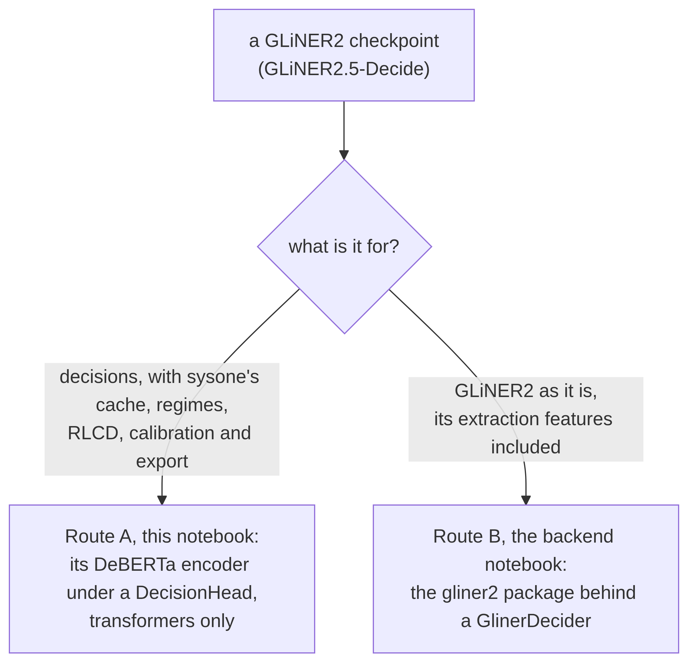

# GLiNER encoder


<!-- WARNING: THIS FILE WAS AUTOGENERATED! DO NOT EDIT! -->

[GLiNER2.5-Decide](https://huggingface.co/fastino/GLiNER2.5-Decide)
(Apache-2.0) is already a slot-scoring decision model: GLiNER2’s
classification head is Laya’s slot head with a learned anchor, `[L]`, in
place of `[MASK]`. Its encoder can sit under the sysone head with no new
dependency, which gives a decision-tuned encoder as the frozen backbone
of the cached-features path. This notebook follows the encoder outline
of the NeoMME notebook.

Two ways to use a GLiNER2 checkpoint, one notebook each:

<div>

<figure class=''>

<div>



</div>

</figure>

</div>

## 1. Load and inspect

A GLiNER2 checkpoint holds `config.json` (`model_type: extractor`,
`architecture: span` or `boundary`), `encoder_config/config.json` (a
`deberta-v2` config for Decide: 24 layers, width 1,024, relative
attention with 256 buckets), the tokenizer (DeBERTa-v3’s vocabulary plus
ten schema tokens,
`[SEP_STRUCT] [SEP_TEXT] [P] [C] [E] [R] [L] [EXAMPLE] [OUTPUT] [DESCRIPTION]`),
and one `model.safetensors` with every tensor: the encoder under an
`encoder.` prefix, the classifier MLP (`classifier.0`, width → 2 ×
width, ReLU, `classifier.2`, → 1; `classifier.3` on boundary
checkpoints, which have a dropout in between), and span and count heads.
A tiny checkpoint in the same layout, a two-layer DeBERTa-v2:

``` python
GLINER_TOKENS = ["[SEP_STRUCT]", "[SEP_TEXT]", "[P]", "[C]", "[E]", "[R]", "[L]", "[EXAMPLE]", "[OUTPUT]", "[DESCRIPTION]"]

def tiny_gliner(path, architecture="span"):
    path = Path(path); path.mkdir(parents=True, exist_ok=True)
    tok = AutoTokenizer.from_pretrained("fixtures/tiny-modernbert")
    tok.add_special_tokens({"additional_special_tokens": GLINER_TOKENS})
    tok.save_pretrained(path)
    cfg = DebertaV2Config(vocab_size=len(tok), hidden_size=64, num_hidden_layers=2, num_attention_heads=2, intermediate_size=128,
                          max_position_embeddings=512, relative_attention=True, position_buckets=32, pos_att_type=["p2c", "c2p"],
                          share_att_key=True, norm_rel_ebd="layer_norm", position_biased_input=False, type_vocab_size=0,
                          pad_token_id=tok.pad_token_id)
    cfg.save_pretrained(path / "encoder_config")
    torch.manual_seed(0)
    enc = AutoModel.from_config(cfg, attn_implementation="eager")
    sd = {f"encoder.{k}": v for k, v in enc.state_dict().items()}
    H = cfg.hidden_size; last = "3" if architecture == "boundary" else "2"
    sd |= {"classifier.0.weight": torch.randn(2 * H, H) * 0.1, "classifier.0.bias": torch.zeros(2 * H),
           f"classifier.{last}.weight": torch.randn(1, 2 * H) * 0.1, f"classifier.{last}.bias": torch.zeros(1),
           "span_rep.span_rep_layer.out_project.0.weight": torch.randn(4, 4), "count_pred.0.weight": torch.randn(4, 4)}
    save_file({k: v.contiguous() for k, v in sd.items()}, str(path / "model.safetensors"))
    (path / "config.json").write_text(json.dumps({"model_type": "extractor", "architecture": architecture, "max_width": 8,
                                                  "counting_layer": "count_lstm", "model_name": "microsoft/deberta-v3-large"}))
    return path, enc, sd

ck, ref_enc, ref_sd = tiny_gliner(Path(tempfile.mkdtemp()) / "tiny-decide")
sorted(p.name for p in ck.iterdir()), sorted({k.split(".")[0] for k in ref_sd})
```

    (['config.json',
      'encoder_config',
      'model.safetensors',
      'tokenizer.json',
      'tokenizer_config.json'],
     ['classifier', 'count_pred', 'encoder', 'span_rep'])

## 2. Loading the encoder

The encoder is built from `encoder_config` and filled from the tensors
whose names end in its own parameter names, with the prefix discovered
from the embedding matrix rather than assumed. The load is strict: every
parameter of the encoder must land, including the resized vocabulary,
and the span and count tensors are dropped. DeBERTa-v2 has no SDPA
kernel, so it runs with eager attention. About fifty lines, and no
`gliner2` import.

------------------------------------------------------------------------

<a
href="https://github.com/sgaseretto/sysonelib/blob/main/sysone/models.py#L884"
target="_blank" style="float:right; font-size:smaller">source</a>

### load_gliner_encoder

``` python
def load_gliner_encoder(
    src:str, revision:str | None=None, dtype:NoneType=None
):
```

*The encoder of a GLiNER2 checkpoint, built from `encoder_config` and
loaded strictly from `model.safetensors`*

------------------------------------------------------------------------

<a
href="https://github.com/sgaseretto/sysonelib/blob/main/sysone/models.py#L857"
target="_blank" style="float:right; font-size:smaller">source</a>

### is_gliner_checkpoint

``` python
def is_gliner_checkpoint(
    src:str, revision:str | None=None
)->bool:
```

*Whether `src` (a folder or Hub repo) is a GLiNER2 checkpoint: an
extractor config and an encoder_config folder*

``` python
enc = load_gliner_encoder(str(ck))
test_eq(all(torch.equal(enc.state_dict()[k], ref_enc.state_dict()[k]) for k in ref_enc.state_dict()), True)
test_eq(is_gliner_checkpoint(str(ck)), True)
test_eq(is_gliner_checkpoint("fixtures/tiny-modernbert"), False)
```

A checkpoint that lacks part of the encoder is refused, rather than
loaded with random layers:

``` python
from safetensors.torch import load_file
```

``` python
bad = Path(tempfile.mkdtemp()) / "bad"
tiny_gliner(bad)
t = load_file(str(bad / "model.safetensors")); t.pop("encoder.encoder.layer.1.output.dense.weight")
save_file(t, str(bad / "model.safetensors"))
test_fail(lambda: load_gliner_encoder(str(bad)), contains="partial encoder load")
```

## 3. The template

The `gliner` preset mirrors the layout GLiNER2 trains on,
`( [P] task: prompt ( [L] label … ) ) [SEP_TEXT] text`, with the
question type as the task and `[L]` as the anchor. GLiNER2’s processor
adds no `[CLS]` or `[SEP]` around it (it tokenizes each word, label and
bracket on its own), so the preset has no start or end token; this
differs from an earlier sketch of the layout with `[CLS]` and `[SEP]`.
GLiNER2 also lowercases the text and ends it with a period;
`Lower(instructions=False, options=False)` reproduces the first if
wanted. The `laya` template works unchanged on the same tokenizer too,
with DeBERTa’s own `[CLS]`, `[SEP]` and `[MASK]`; since the public
DeBERTa-v3 weights are a discriminator without a masked-LM head,
`[MASK]` starts weaker there than `[L]`, which was trained on GLiNER2’s
data and the decision post-training, so `gliner` is the one to try
first.

``` python
RowTemplate.preset("gliner")
```

    RowTemplate(gliner: '{start}( [P] {type}: {instructions} ( {options} ) ){sep}{state}{end}', option='{mask} {text}', mask='[L]', budgets 512/192/48)

How close the preset comes to GLiNER2, measured on the real checkpoint
over the 2,600 single-label decisions of Fastino’s benchmark (its
development split; the [GLiNER2.5-Decide
tutorial](tutorials/05_gliner_decide.ipynb) has the setup, with each
head’s name as the question’s instructions). With the classifier copied
into the head and no training, the preset gives the same label as
GLiNER2 itself on 95.0% of them. Writing the instructions where the
preset writes the type
(`row="{start}( [P] {instructions} ( {options} ) ){sep}{state}{end}"`),
with the text lower-cased (`Lower(instructions=False, options=False)`),
raises that to 98.6%, and the median of the largest gap between the two
models’ probabilities falls from 0.019 to 0.005. Accuracy doesn’t move:
0.665 with the preset and 0.664 with the closer row, against GLiNER2’s
0.665. What remains is what a template cannot express: GLiNER2 tokenizes
the text word by word, and adds a period to a text that lacks one.

## 4. The spec

[`EncoderSpec.from_pretrained`](https://sgaseretto.github.io/sysonelib/models.html#encoderspec.from_pretrained)
recognises a GLiNER2 checkpoint through `ENCODER_SOURCES`: the config is
the encoder’s, the tokenizer is the checkpoint’s, the template is
`gliner`, and the loader is the strict one above.

``` python
spec = EncoderSpec.from_pretrained(str(ck))
spec
```

    EncoderSpec(/var/folders/ym/y7_gxdb90s312g8bz06h3qqm0000gn/T/tmpmggu55sq/tiny-decide: deberta-v2, width 64, context 512, text, template gliner)

``` python
test_eq((spec.source, spec.family, spec.template.name, spec.width), ("gliner2-checkpoint", "deberta-v2", "gliner", 64))
b = spec.builder()
row = b.build("Duplicate charge on invoice #4411", {"type": "choice", "instructions": "Which department should handle this request?",
              "criteria": {"billing": "invoices, payments, refunds", "technical": "bugs, outages"}})
print(show_row(row, spec.tokenizer))
test_eq([row.ids[m] for m in row.markers], [spec.tokenizer.convert_tokens_to_ids("[L]")] * 2)
test_eq(row.ids[0] == spec.tokenizer.cls_token_id, False)
```

    ( [P] choice: Which department should handle this request? ( [L] billing: invoices, payments, refunds [L] technical: bugs, outages ) ) [SEP_TEXT] Duplicate charge on invoice #4411
    markers [21, 32] · qtype choice · 58 tokens

## 5. One forward pass, and the classifier as a warm start

The checkpoint’s classifier is an MLP on each `[L]` vector;
`DecisionHead(width, layers=0, scorer="gliner2", init_from=checkpoint)`
copies it into the scorer and zeroes the type embedding. This module
adds the
[`GlinerCheckpoint`](https://sgaseretto.github.io/sysonelib/gliner_encoder.html#glinercheckpoint)
kind to `CHECKPOINTS`, and GLiNER2’s method to
[`warm_start`](https://sgaseretto.github.io/sysonelib/models.html#warm_start).
So a head-only sysone model on the `gliner` template scores options
exactly as the checkpoint’s classifier scores its labels, softmaxed
across the row as GLiNER2’s single-label heads are, before any training;
fine-tuning then starts there rather than from a random head. Laya’s
head remains the default for every other encoder.

------------------------------------------------------------------------

<a
href="https://github.com/sgaseretto/sysonelib/blob/main/sysone/models.py#L916"
target="_blank" style="float:right; font-size:smaller">source</a>

### gliner_warm_start

``` python
def gliner_warm_start(
    head:sysone.models.DecisionHead, ckpt:__main__.GlinerCheckpoint, *, strict:bool=True
)->sysone.models.DecisionHead:
```

*Copy a GLiNER2 checkpoint’s classifier MLP into a `gliner2` scorer, and
zero the type embedding*

------------------------------------------------------------------------

<a
href="https://github.com/sgaseretto/sysonelib/blob/main/sysone/models.py#L914"
target="_blank" style="float:right; font-size:smaller">source</a>

### GlinerCheckpoint

``` python
def GlinerCheckpoint(
    src:str, subfolder:str | None=None
):
```

*A GLiNER2 checkpoint: its classifier MLP starts a `gliner2` scorer*

``` python
head = DecisionHead(spec.width, layers=0, scorer="gliner2", init_from=str(ck))
model = EncoderDecisionModel(spec.load_encoder(), head, spec).eval()
batch = collate([row], spec.tokenizer.pad_token_id)
with torch.no_grad():
    ours = model(**{k: v for k, v in batch.items() if k not in ("target", "label")})
    h = ref_enc.eval()(input_ids=batch["input_ids"], attention_mask=batch["attention_mask"]).last_hidden_state[0, row.markers]
    clf = nn.Sequential(nn.Linear(64, 128), nn.ReLU(), nn.Linear(128, 1))
    clf.load_state_dict({"0.weight": ref_sd["classifier.0.weight"], "0.bias": ref_sd["classifier.0.bias"],
                         "2.weight": ref_sd["classifier.2.weight"], "2.bias": ref_sd["classifier.2.bias"]})
    test_close(ours[0], clf(h).squeeze(-1), eps=1e-5)
ours.softmax(-1)
```

    tensor([[0.5000, 0.5000]])

Boundary checkpoints (GLiNER2.5-multi-Decide) keep their last classifier
layer at index 3; the warm start maps it:

``` python
ckb, _, sdb = tiny_gliner(Path(tempfile.mkdtemp()) / "tiny-boundary", architecture="boundary")
hb = DecisionHead(64, layers=0, scorer="gliner2", init_from=str(ckb))
test_eq(torch.equal(hb.scorer[2].weight, sdb["classifier.3.weight"]), True)
test_fail(lambda: DecisionHead(64, layers=0, init_from=str(ckb)), contains="scorer='gliner2'")
```

## 6. A head-only run

Route A is the text application,
[`sysone.text.decision_learner`](https://sgaseretto.github.io/sysonelib/text.html#decision_learner),
with a GLiNER2 checkpoint as the encoder: the cache, every regime, RLCD,
calibration and the Laya-shaped export all apply (the Laya format itself
is written only for ModernBERT-family encoders, which Laya’s runtimes
load).

``` python
from sysone.data import TypedDecisions
from sysone.text import decision_learner
```

``` python
data = TypedDecisions.from_json("fixtures/typed_decisions_tiny.jsonl", valid=0.25, calib=0)
learn = decision_learner(data, str(ck), head="gliner2", init_from=str(ck), preset="cpu", loss="soft_ce", cache_dir=tempfile.mkdtemp())
learn.fit(2, lr=1e-3)
learn.show_batch(1)
```

    {'loss': '1.215', 'grad_norm': '0.0003907', 'learning_rate': '0.001', 'epoch': '1'}
    {'eval_loss': '1.191', 'eval_accuracy': '0.24', 'eval_soft_accuracy': '0.3767', 'eval_brier': '0.26', 'eval_kl': '0.4434', 'eval_tv': '0.366', 'eval_ece': '0.08402', 'eval_score_mae': '0.838', 'eval_within_one': '0.6', 'eval_n': 25, 'eval_accuracy_choice': '0', 'eval_accuracy_score': '0.2', 'eval_accuracy_noul': '0.5', 'eval_n_unanswerable': 0, 'eval_runtime': '0.0048', 'eval_samples_per_second': '5173', 'eval_steps_per_second': '413.8', 'epoch': '1'}
    {'loss': '1.215', 'grad_norm': '0.0003254', 'learning_rate': '0.001', 'epoch': '2'}
    {'eval_loss': '1.191', 'eval_accuracy': '0.12', 'eval_soft_accuracy': '0.3767', 'eval_brier': '0.26', 'eval_kl': '0.4434', 'eval_tv': '0.366', 'eval_ece': '0.204', 'eval_score_mae': '0.838', 'eval_within_one': '0.6', 'eval_n': 25, 'eval_accuracy_choice': '0', 'eval_accuracy_score': '0.1', 'eval_accuracy_noul': '0.25', 'eval_n_unanswerable': 0, 'eval_runtime': '0.0051', 'eval_samples_per_second': '4916', 'eval_steps_per_second': '393.2', 'epoch': '2'}
    {'train_runtime': '0.061', 'train_samples_per_second': '2459', 'train_steps_per_second': '327.8', 'train_loss': '1.215', 'epoch': '2'}
    ( [P] choice: What should the observability system do with this trace? ( [L] continue: Let the agent proceed without interruption. [L] human_review: Queue this trace for a human to review. [L] observe … raint_violations": 0, "duration_s": 128.5, "irreversible_actions": 0, "steps": 7, "tool_errors": 1}}
    markers [20, 31, 45, 60] · qtype choice · 166 tokens

``` python
test_eq((learn.model.head.scorer_kind, learn.data.builder.template.name, learn.cache), ("gliner2", "gliner", "masks"))
```

``` python
data  = TypedDecisions.from_hub("LocalLLaMA/typed-decisions", valid="test")
learn = decision_learner(data, "fastino/GLiNER2.5-Decide", head="gliner2", init_from="fastino/GLiNER2.5-Decide")   # template "gliner": [L] as the anchor
learn.validate()                                                              # the checkpoint's classifier, before training
learn.fit_one_cycle(4, lr=learn.lr_find().valley)
learn.calibrate()
learn.validate()
learn.export("decide-head")
```

On the real checkpoint (2026-09-29, M3 Pro, MPS, fp32), on
typed-decisions’ 2,000 test decisions, the checkpoint’s classifier
scores 0.476 before training and 0.641 after, at lr_find’s valley of
2.1e-3. A new head on the same anchors,
`decision_learner(data, "fastino/GLiNER2.5-Decide")`, scores 0.645, so
the warm start buys nothing once the head trains on 5,400 rows. That is
still the best frozen backbone in the [text notebook’s
table](10_text.ipynb#regimes-on-the-laptop), 0.085 above Laya’s encoder
and 0.14 above ModernBERT-large’s. Filling the cache for the 8,000 rows
took 29 minutes, and each fit about a minute. On Fastino’s own
benchmark, the [GLiNER2.5-Decide
tutorial](tutorials/05_gliner_decide.ipynb) compares this route with
GLiNER2 itself, zero-shot and trained.

## 7. What to watch

- **Precision.** DeBERTa-v3-large’s attention overflows in fp16; train
  in bf16 or fp32. The cached path runs the encoder once, so fp32 on a
  laptop costs little.
- **Tokenization.** Decide’s `tokenizer.json` was re-saved by
  transformers 5 with an NFC normaliser, where DeBERTa-v3’s own is NFKC;
  ASCII text is unaffected, ligatures and full-width characters are not.
  `unicodedata.normalize("NFKC", text)` in a transform is the defensive
  choice.
- **Not carried over.** GLiNER2’s word-level `max_len` and chunking, its
  span and count heads, and its constraint decoder: Route A is decisions
  only. Its extraction features stay in `gliner2`; see the GLiNER
  backend notebook.
- **Decide-1B** is a ModernBERT (`ettin-enc-from-dec-1b`, width 1,792),
  not a DeBERTa: its embedding matrix is `tok_embeddings`, which the
  prefix discovery handles, and its attention runs on SDPA.
