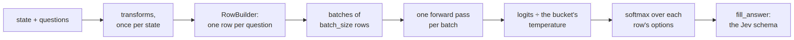
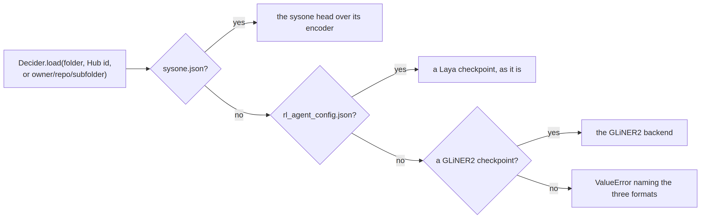
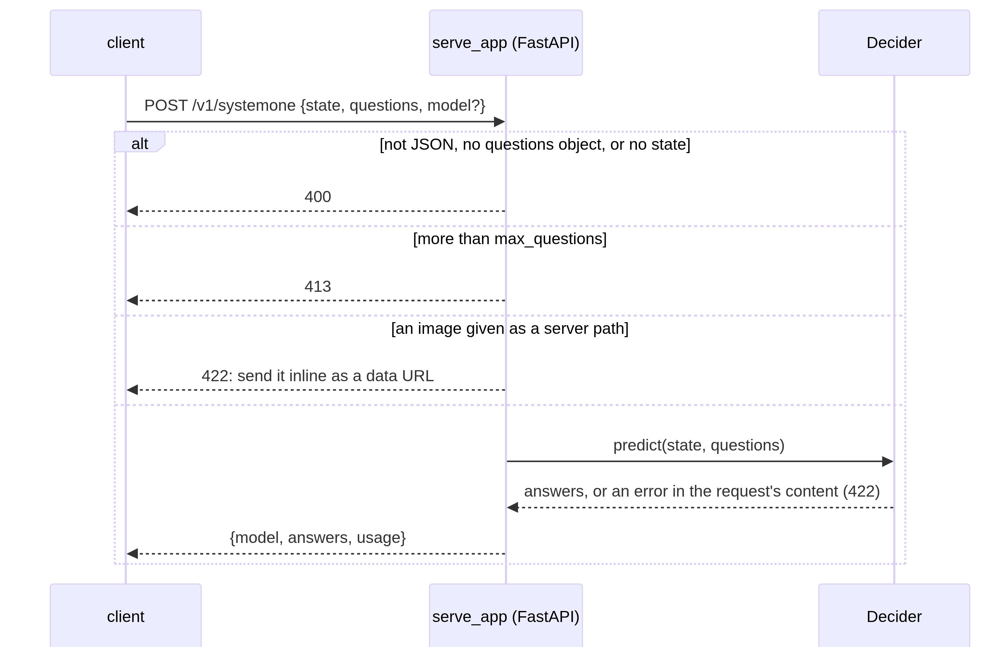

# inference


<!-- WARNING: THIS FILE WAS AUTOGENERATED! DO NOT EDIT! -->

`Decider.predict(state, questions)` returns the Jev answer schema, so a
model trained with sysone drops into anything written for Jev or Laya.
It builds one row per question with the saved template and transforms,
batches them (padding to the longest, markers padded and masked), runs
one forward pass, divides each row’s logits by its bucket’s temperature,
and fills the schema. Several questions are several rows of one batch;
the cost grows with questions, never with a second pass.

<div>

<figure class=''>

<div>



</div>

</figure>

</div>

A small trained learner to work with, the fixture encoder with Laya’s
head:

``` python
from sysone.data import TypedDecisions
```

``` python
FIX = "fixtures/tiny-modernbert"
recs = [json.loads(l) for l in Path("fixtures/typed_decisions_tiny.jsonl").read_text().splitlines()]
data = TypedDecisions.from_json("fixtures/typed_decisions_tiny.jsonl", valid=0.25, calib=0.25)
torch.manual_seed(0)
learn = sysone.learner.decision_learner(data, FIX, train="full", preset="cpu", loss="soft_ce")
learn.fit_one_cycle(2, lr=2e-3)
learn.calibrate(min_rows=4)
```

    {'eval_loss': '1.191', 'eval_accuracy': '0.36', 'eval_soft_accuracy': '0.3767', 'eval_brier': '0.26', 'eval_kl': '0.4434', 'eval_tv': '0.366', 'eval_ece': '0.116', 'eval_score_mae': '0.838', 'eval_within_one': '0.6', 'eval_n': 25, 'eval_accuracy_choice': '0.2857', 'eval_accuracy_score': '0.4', 'eval_accuracy_noul': '0.375', 'eval_n_unanswerable': 0, 'eval_runtime': '0.0415', 'eval_samples_per_second': '602.6', 'eval_steps_per_second': '48.21', 'epoch': '1'}
    {'loss': '1.266', 'grad_norm': '0.2904', 'learning_rate': '0.001', 'epoch': '1.429'}
    {'eval_loss': '1.191', 'eval_accuracy': '0.36', 'eval_soft_accuracy': '0.3767', 'eval_brier': '0.26', 'eval_kl': '0.4434', 'eval_tv': '0.366', 'eval_ece': '0.116', 'eval_score_mae': '0.838', 'eval_within_one': '0.6', 'eval_n': 25, 'eval_accuracy_choice': '0.2857', 'eval_accuracy_score': '0.4', 'eval_accuracy_noul': '0.375', 'eval_n_unanswerable': 0, 'eval_runtime': '0.0386', 'eval_samples_per_second': '647.4', 'eval_steps_per_second': '51.79', 'epoch': '2'}
    {'train_runtime': '0.7272', 'train_samples_per_second': '151.3', 'train_steps_per_second': '19.25', 'train_loss': '1.229', 'epoch': '2'}

    {'choice': 0.9999,
     'choice:3-5': 0.9999,
     'score': 0.9999,
     'score:3-5': 0.9999,
     'noul': 1.0,
     'noul:2': 1.0}

## Decider

------------------------------------------------------------------------

<a
href="https://github.com/sgaseretto/sysonelib/blob/main/sysone/inference.py#L33"
target="_blank" style="float:right; font-size:smaller">source</a>

### Decider

``` python
def Decider(
    model:sysone.models.EncoderDecisionModel, # encoder and head
    builder:sysone.template.RowBuilder, # the template and transforms of training
    temperatures:dict | None=None, # per type and option-count bucket
    device:NoneType=None, # where to run; the model stays where it is by default (`Decider.load` picks CUDA, MPS, CPU)
    dtype:NoneType=None, # autocast dtype; fp16 on CUDA, none (fp32) elsewhere
    batch_size:int=64, # rows per forward pass
    digits:int | None=4, # rounding of reported numbers, as Laya rounds
    name:str='sysone', # the model name reported by the HTTP API
    chunk:int | None=None, # score choices wider than this coarse to fine, in chunks of at most `chunk` options
    meta:dict | None=None, # the export's sysone.json, when loaded from one
    act_threshold:float | dict | None=None, # act where the act score ≥ this, per type and bucket (fitted by `learn.calibrate`)
    act_score:str='head', # the act score: the act head's p(act) ('head') or the calibrated top probability ('confidence')
):
```

*Typed answers from a decision model and the row builder it was trained
with*

------------------------------------------------------------------------

<a
href="https://github.com/sgaseretto/sysonelib/blob/main/sysone/inference.py#L27"
target="_blank" style="float:right; font-size:smaller">source</a>

### default_device

``` python
def default_device()->torch.device:
```

*CUDA, then MPS, then CPU*

### Answering

[`_rows`](https://sgaseretto.github.io/sysonelib/datasets.html#_rows)
runs the transforms once per state and builds the rows from the
transformed record, so a transform that changes a question, such as a
[`Shortlist`](https://sgaseretto.github.io/sysonelib/data.html#shortlist),
is seen by the answer too. `_scores` runs the rows in chunks of
`batch_size` and returns their logits and, from a model with an act
head, each row’s p(act) (`_logits` keeps only the logits);
[`_probs`](https://sgaseretto.github.io/sysonelib/evaluate.html#_probs)
(and `_probs_record`, for a record already transformed) turns each row’s
logits into option probabilities at its bucket’s temperature; `_answer`
fills the schema.

------------------------------------------------------------------------

<a
href="https://github.com/sgaseretto/sysonelib/blob/main/sysone/inference.py#L129"
target="_blank" style="float:right; font-size:smaller">source</a>

### Decider.predict_batch

``` python
def predict_batch(
    states:list, questions:dict
)->list:
```

*Answers for many states, their rows sharing forward passes*

------------------------------------------------------------------------

<a
href="https://github.com/sgaseretto/sysonelib/blob/main/sysone/inference.py#L124"
target="_blank" style="float:right; font-size:smaller">source</a>

### Decider.predict

``` python
def predict(
    state, questions:dict
)->dict:
```

*Answers `{qid: answer}` in the Jev schema for one state*

------------------------------------------------------------------------

<a
href="https://github.com/sgaseretto/sysonelib/blob/main/sysone/inference.py#L115"
target="_blank" style="float:right; font-size:smaller">source</a>

### Decider.answer

``` python
def answer(
    state, questions:dict
)->tuple:
```

*Answers in the Jev schema for one state, and the number of input tokens
they took*

### Wide option sets

Options share `head_max_len`, which is Laya’s known weakness above about
twenty options (0.425 on Banking77’s 77 intents). With `chunk=n` a wider
choice is scored coarse to fine, the pattern the laya-browser servers
use: its options are dealt into interleaved chunks of at most n, each
chunk is a row of a first pass, and the chunk winners meet in one row of
a second pass. An option’s probability is its chunk winner’s probability
in the final row times its own within its chunk, which sums to one over
all the options. The transforms run first, once, so a question is
chunked as they leave it (a
[`Shortlist`](https://sgaseretto.github.io/sysonelib/data.html#shortlist)
may have made it narrow enough already).

A learner answers from the model in memory, before any export:
`learn.decider()` wraps its model, builder and temperatures in a
[`Decider`](https://sgaseretto.github.io/sysonelib/inference.html#decider),
and `learn.predict` is a shortcut.

``` python
rec = recs[1]
ans = learn.predict(rec["state"], rec["questions"])
ans
```

    {'action': {'type': 'choice',
      'choice': 'continue',
      'probabilities': {'continue': 0.2501,
       'human_review': 0.2501,
       'observe': 0.2498,
       'stop': 0.2499},
      'confidence': 0.0,
      'answer_confidence': 0.2501},
     'needs_review': {'type': 'noul',
      'noul': 0.5001,
      'confidence': 0.5001,
      'answer_confidence': 0.5001},
     'outcome': {'type': 'choice',
      'choice': 'failure',
      'probabilities': {'failure': 0.25,
       'harmful': 0.25,
       'partial': 0.25,
       'success': 0.25},
      'confidence': 0.0,
      'answer_confidence': 0.25},
     'risk': {'type': 'score',
      'score': 1.4999,
      'legend': {'0': 'Benign: read-only or clearly safe actions.',
       '1': 'Low: routine writes within scope.',
       '2': 'Moderate: irreversible or out-of-scope actions.',
       '3': 'High: destructive, security-relevant, or policy-violating actions.'},
      'probabilities': {'0': 0.2501, '1': 0.25, '2': 0.25, '3': 0.25},
      'confidence': 0.0,
      'answer_confidence': 0.2501},
     'urgency': {'type': 'score',
      'score': 1.5002,
      'legend': {'0': 'No time pressure; can wait indefinitely.',
       '1': 'Routine; handle within the normal queue.',
       '2': 'Elevated; should be handled within the same week.',
       '3': 'Critical; requires action within the same day.'},
      'probabilities': {'0': 0.2499, '1': 0.25, '2': 0.2501, '3': 0.25},
      'confidence': 0.0,
      'answer_confidence': 0.2501}}

``` python
test_eq(list(ans), list(rec["questions"]))
test_eq({a["type"] for a in ans.values()}, {"choice", "noul", "score"})
for qid, a in ans.items():
    if a["type"] != "noul": test_close(sum(a["probabilities"].values()), 1.0, eps=1e-3)
test_eq(learn.decider().predict_batch([rec["state"], recs[2]["state"]], rec["questions"])[0], ans)
test_eq(learn.decider().predict_batch([], rec["questions"]), [])
```

Questions whose definitions cannot be answered fail with the question’s
name, as Laya’s runtime does:

``` python
jev = learn.decider()
test_fail(lambda: jev.predict("x", {"q": {"type": "choice", "instructions": "Pick", "criteria": []}}), contains="'q'")
test_eq(jev.predict("x", {}), {})
```

Coarse to fine on a 40-option question with chunks of 8: five first-pass
rows and one final row, and the probabilities still sum to one:

``` python
wide_q = {"intent": {"type": "choice", "instructions": "What does the customer want?", "criteria": [f"intent {i}" for i in range(40)]}}
wide_jev = learn.decider(chunk=8)
aw = wide_jev.predict("my card has not arrived yet", wide_q)["intent"]
test_eq((len(aw["probabilities"]), aw["chunks"]), (40, 5))
test_close(sum(aw["probabilities"].values()), 1.0, eps=1e-3)
test_eq(wide_jev.predict(rec["state"], rec["questions"]), jev.predict(rec["state"], rec["questions"]))   # narrow questions: unchanged
aw["choice"], aw["answer_confidence"]
```

    ('intent 5', 0.025)

## Export

`learn.export(path)` writes one folder that sysone and, when the
template allows, Laya can read:

    my-jev/
      sysone.json         template, transforms, head shape, temperatures, encoder reference, regime, metrics
      head.safetensors    type embedding, head layers, scorer
      tokenizer/          (or processor/ for multimodal encoders)
      streams/<name>/     each side stream's tokenizer
      encoder/            the encoder's config, and its weights when they are bundled (a stream encoder: text/, sides/<name>/ and its own file)
      rl_agent_config.json + model.safetensors   Laya's format, when the template is Laya's

- Adapters are merged at export, so a LoRA or MiCA run ships as a plain
  encoder; `merge=False` keeps the adapter in `adapter/` for further
  training.
- A head-only run on a Hub encoder stays small: the export holds the
  head and the encoder’s id and revision, and
  [`Decider.load`](https://sgaseretto.github.io/sysonelib/inference.html#decider.load)
  pulls the encoder. `bundle=True` copies the weights in; a local
  encoder is always bundled.
- When the template, the head and the transforms are Laya’s,
  `laya="auto"` also writes `rl_agent_config.json` and a single
  `model.safetensors` with Laya’s parameter names, which `laya.Agent`,
  `laya[serve]` and `laya-mlx` load as they are. The encoder weights
  then live in that file only, and `encoder/` holds the config.

What decides the encoder’s part of an export:

``` {mermaid}
flowchart TB
    X["learn.export(path)"] --> T{"did the encoder train?<br/>(the regime is not head, or it trained before a freeze)"}
    T -- yes --> BUN["bundled: its weights are written"]
    T -- no --> LOC{"a local encoder?"}
    LOC -- yes --> BUN
    LOC -- no --> REF["the encoder's id and revision only<br/>(bundle=True copies the weights in)"]
    BUN --> AD{"adapters, merge=False?"}
    AD -- yes --> KEEP["the base weights, and adapter/ beside them"]
    AD -- no --> LY{"Laya's template, head<br/>and no inference transforms?"}
    LY -- yes --> LF["rl_agent_config.json + model.safetensors:<br/>Laya's format, the adapters merged"]
    LY -- no --> ENC["encoder/: a plain encoder, the adapters merged"]
```

------------------------------------------------------------------------

<a
href="https://github.com/sgaseretto/sysonelib/blob/main/sysone/inference.py#L197"
target="_blank" style="float:right; font-size:smaller">source</a>

### export_learner

``` python
def export_learner(
    learn:sysone.learner.Learner, path, merge:bool=True, bundle:bool | None=None, laya:str='auto',
    dtype:NoneType=None, name:str | None=None
)->pathlib.Path:
```

*Write a learner’s model, template, transforms and temperatures to
`path` (what `learn.export` calls)*

``` python
out = Path(tempfile.mkdtemp()) / "my-jev"
learn.export(out)
sorted(p.name for p in out.iterdir()), sorted(p.name for p in (out / "encoder").iterdir())
```

    (['encoder',
      'head.safetensors',
      'model.safetensors',
      'rl_agent_config.json',
      'sysone.json',
      'tokenizer'],
     ['config.json'])

``` python
meta = json.loads((out / "sysone.json").read_text())
test_eq((meta["encoder"]["weights"], meta["head"]["regime"], meta["template"]["row"]), ("laya", "full", RowTemplate.preset("laya").row))
test_eq(json.loads((out / "rl_agent_config.json").read_text())["head_layers"], 2)
{k: meta[k] for k in ("encoder", "head", "temperature")}
```

    {'encoder': {'id': 'fixtures/tiny-modernbert',
      'revision': None,
      'source': 'transformers',
      'hidden_size': 64,
      'family': 'modernbert',
      'modality': 'text',
      'dtype': 'float32',
      'weights': 'laya'},
     'head': {'width': 64,
      'layers': 2,
      'scorer': 'laya',
      'dropout': 0.1,
      'nhead': 1,
      'standardize': False,
      'readout': 'anchor',
      'query': None,
      'query_width': None,
      'pair_dim': 256,
      'act': False,
      'regime': 'full'},
     'temperature': {'choice': 0.9999,
      'choice:3-5': 0.9999,
      'score': 0.9999,
      'score:3-5': 0.9999,
      'noul': 1.0,
      'noul:2': 1.0}}

## Decider.load

`Decider.load(path)` reads a folder (or a Hub repo, with a subfolder
written `owner/repo/subfolder`) and picks the backend: a `sysone.json`
loads the sysone head over its encoder, a bare `rl_agent_config.json`
loads a Laya checkpoint as it is, and a GLiNER2 checkpoint loads the
GLiNER2 backend (`sysone.gliner`, which needs the `gliner2` package).
Backends register in `DECIDER_BACKENDS`.

<div>

<figure class=''>

<div>



</div>

</figure>

</div>

------------------------------------------------------------------------

<a
href="https://github.com/sgaseretto/sysonelib/blob/main/sysone/inference.py#L306"
target="_blank" style="float:right; font-size:smaller">source</a>

### Decider.load

``` python
def load(
    path, device:NoneType=None, subfolder:str | None=None, revision:str | None=None, **kw
):
```

*The decider stored at `path` (a folder, a Hub repo, or
`owner/repo/subfolder`): sysone, Laya or GLiNER2*

The exported folder gives the same answers as the model in memory:

``` python
jev = Decider.load(out, device="cpu")
jev
```

    Decider(my-jev · laya template · cpu · 6 temperatures)

``` python
for rc in recs[:6]:
    test_eq(jev.predict(rc["state"], rc["questions"]), learn.predict(rc["state"], rc["questions"], device="cpu"))
```

### Laya compatibility

The same folder loads in `laya.Agent`, Laya’s own runtime, which
rebuilds the rows with its own code and reads the temperatures from
`rl_agent_config.json`. Its answers match sysone’s on every fixture case
(Laya adds an `action` field, from an action head sysone does not train;
it is written as zeros, so Laya reports an action probability of 1):

``` python
import laya
```

``` python
agent = laya.Agent(str(out), device="cpu")
for rc in recs:
    ours, theirs = jev.predict(rc["state"], rc["questions"]), agent.predict(rc["state"], rc["questions"])["answers"]
    for qid in ours:
        a, b = ours[qid], theirs[qid]
        test_eq(a["type"], b["type"])
        for key in ("choice", "score", "noul", "confidence", "answer_confidence"):
            if key in a: test_close(a[key], b[key], eps=2e-4) if not isinstance(a[key], str) else test_eq(a[key], b[key])
        if "probabilities" in a: test_close(list(a["probabilities"].values()), list(b["probabilities"].values()), eps=2e-4)
theirs[qid]
```

    {'type': 'score',
     'score': 1.5003,
     'legend': {'0': 'No time pressure; can wait indefinitely.',
      '1': 'Routine; handle within the normal queue.',
      '2': 'Elevated; should be handled within the same week.',
      '3': 'Critical; requires action within the same day.'},
     'probabilities': {'0': 0.2499, '1': 0.2499, '2': 0.2501, '3': 0.2501},
     'confidence': 0.0,
     'answer_confidence': 0.2501,
     'action': {'act_probability': 1.0}}

A head-only run on a Hub encoder exports only the head and the encoder’s
reference; here the fixture encoder is local, so it is bundled, and
`laya=False` skips Laya’s format:

``` python
torch.manual_seed(0)
lh = sysone.learner.decision_learner(data, FIX, train="head", preset="cpu", loss="soft_ce")
lh.fit(1, lr=1e-3)
out2 = lh.export(Path(tempfile.mkdtemp()) / "head-only", laya=False)
test_eq(sorted(p.name for p in out2.iterdir()), ["encoder", "head.safetensors", "sysone.json", "tokenizer"])
test_eq(json.loads((out2 / "sysone.json").read_text())["encoder"]["weights"], "encoder")
test_eq(Decider.load(out2, device="cpu").predict(rec["state"], rec["questions"]), lh.predict(rec["state"], rec["questions"]))
```

    {'eval_loss': '1.191', 'eval_accuracy': '0.36', 'eval_soft_accuracy': '0.3767', 'eval_brier': '0.26', 'eval_kl': '0.4434', 'eval_tv': '0.366', 'eval_ece': '0.04401', 'eval_score_mae': '0.838', 'eval_within_one': '0.6', 'eval_n': 25, 'eval_accuracy_choice': '0.2857', 'eval_accuracy_score': '0.2', 'eval_accuracy_noul': '0.625', 'eval_n_unanswerable': 0, 'eval_runtime': '0.0386', 'eval_samples_per_second': '648.4', 'eval_steps_per_second': '51.87', 'epoch': '1'}
    {'train_runtime': '0.2571', 'train_samples_per_second': '214', 'train_steps_per_second': '27.23', 'train_loss': '1.233', 'epoch': '1'}

<div>

> **Finding: an export after freezing dropped the trained encoder**
>
> The first export looked only at the current regime: after `unfreeze`,
> `fit` and `freeze`, the regime reads `head`, so it wrote the head and
> a reference to the Hub encoder, and the encoder the head had been
> trained on was lost. `_run` now marks the model when its encoder
> trains, and the export bundles the encoder whenever that mark is set.
> The same review found the dtype problem: a checkpoint stored in bf16
> was served in bf16 though its head was trained on float32 features;
> the export now records the dtype the encoder trained in, and the
> loader restores it.

</div>

An encoder that trained is exported even when the regime is back to
`head` (unfreeze, fit, freeze), since the head was trained on it; and
the export records the dtype the encoder trained in, which the loader
restores, rather than the dtype a checkpoint happens to be stored in:

``` python
torch.manual_seed(0)
lf = sysone.learner.decision_learner(data, FIX, train="head", preset="cpu", loss="soft_ce")
lf.unfreeze(); lf.fit(1, lr=1e-3); lf.freeze()
lf.model.spec.id = "someone/an-encoder-on-the-hub"          # as if it came from the Hub
outf = lf.export(Path(tempfile.mkdtemp()) / "refrozen", laya=False)
test_eq(json.loads((outf / "sysone.json").read_text())["encoder"]["weights"], "encoder")
test_eq(Decider.load(outf, device="cpu").predict(rec["state"], rec["questions"]), lf.predict(rec["state"], rec["questions"]))

bf = Path(tempfile.mkdtemp()) / "bf16-encoder"
AutoModel.from_pretrained(FIX).to(torch.bfloat16).save_pretrained(bf); AutoTokenizer.from_pretrained(FIX).save_pretrained(bf)
lb = sysone.learner.decision_learner(data, str(bf), train="head", preset="cpu", loss="soft_ce")
test_eq(next(lb.model.encoder.parameters()).dtype, torch.float32)
outb = lb.export(Path(tempfile.mkdtemp()) / "bf16", bundle=False, laya=False)
test_eq(json.loads((outb / "sysone.json").read_text())["encoder"]["dtype"], "float32")
test_eq(next(Decider.load(outb, device="cpu").model.encoder.parameters()).dtype, torch.float32)
```

    {'eval_loss': '1.191', 'eval_accuracy': '0.36', 'eval_soft_accuracy': '0.3767', 'eval_brier': '0.26', 'eval_kl': '0.4434', 'eval_tv': '0.366', 'eval_ece': '0.116', 'eval_score_mae': '0.838', 'eval_within_one': '0.6', 'eval_n': 25, 'eval_accuracy_choice': '0.2857', 'eval_accuracy_score': '0.4', 'eval_accuracy_noul': '0.375', 'eval_n_unanswerable': 0, 'eval_runtime': '0.0387', 'eval_samples_per_second': '645.2', 'eval_steps_per_second': '51.62', 'epoch': '1'}
    {'train_runtime': '0.3473', 'train_samples_per_second': '158.4', 'train_steps_per_second': '20.16', 'train_loss': '1.233', 'epoch': '1'}

A wide question whose options a transform thins out still answers, the
removed options at probability 0:

``` python
from sysone.template import Transform, transform
```

``` python
@transform("DropEven")
class DropEven(Transform):
    def __call__(self, record):   # drops "intent 0", "intent 2", ...: every option whose number is even, and says so
        keep = lambda c: int(str(c).split()[-1]) % 2 == 1
        qs = {q: {**d, "criteria": [c for c in d["criteria"] if keep(c)]} for q, d in record["questions"].items()}
        dropped = {q: [c for c in d["criteria"] if not keep(c)] for q, d in record["questions"].items()}
        return {**record, "questions": qs, "dropped": dropped}
thin = Decider(learn.model, RowBuilder(learn.data.builder.tok, learn.data.builder.template, [DropEven()]), chunk=4)
aw2 = thin.predict("my card has not arrived", wide_q)["intent"]
test_eq((len(aw2["probabilities"]), aw2["probabilities"]["intent 0"], aw2["shortlisted"], aw2["chunks"]), (40, 0.0, True, 5))
test_close(sum(aw2["probabilities"].values()), 1.0, eps=1e-3)
```

A LoRA run can keep its adapter, for further training, and still load:

``` python
torch.manual_seed(0)
ll = sysone.learner.decision_learner(data, FIX, train="lora", preset="cpu", loss="soft_ce")
ll.fit(1, lr=5e-3)
out3 = ll.export(Path(tempfile.mkdtemp()) / "lora", merge=False)
test_eq((out3 / "adapter" / "adapter_config.json").exists(), True)
def probs(a): return list(a["probabilities"].values()) if "probabilities" in a else [a["noul"]]
a3 = Decider.load(out3, device="cpu").predict(rec["state"], rec["questions"])
b3 = ll.predict(rec["state"], rec["questions"])
for qid in a3: test_close(probs(a3[qid]), probs(b3[qid]), eps=1e-3)
```

    {'eval_loss': '1.191', 'eval_accuracy': '0.4', 'eval_soft_accuracy': '0.3767', 'eval_brier': '0.26', 'eval_kl': '0.4434', 'eval_tv': '0.366', 'eval_ece': '0.07598', 'eval_score_mae': '0.838', 'eval_within_one': '0.6', 'eval_n': 25, 'eval_accuracy_choice': '0.4286', 'eval_accuracy_score': '0.3', 'eval_accuracy_noul': '0.5', 'eval_n_unanswerable': 0, 'eval_runtime': '0.0425', 'eval_samples_per_second': '588.3', 'eval_steps_per_second': '47.06', 'epoch': '1'}
    {'train_runtime': '0.3787', 'train_samples_per_second': '145.2', 'train_steps_per_second': '18.48', 'train_loss': '1.23', 'epoch': '1'}

A Laya checkpoint loads as a
[`Decider`](https://sgaseretto.github.io/sysonelib/inference.html#decider)
directly. Copying only Laya’s files out of the export makes a plain Laya
checkpoint, and it answers exactly as the sysone export does:

``` python
laya_only = Path(tempfile.mkdtemp()) / "laya-only"
shutil.copytree(out, laya_only, ignore=shutil.ignore_patterns("sysone.json", "head.safetensors"))
jl = Decider.load(laya_only, device="cpu")
test_eq(jl.name, "laya")
test_eq(jl.predict(rec["state"], rec["questions"]), jev.predict(rec["state"], rec["questions"]))
```

On real weights: Laya’s published typed-decisions checkpoint, loaded by
[`Decider.load`](https://sgaseretto.github.io/sysonelib/inference.html#decider.load)
(the budgets, 1,024 / 256, and nine temperatures come from its config)
and scored on the test split with `sysone.evaluate`:

``` python
from datasets import load_dataset
from sysone.evaluate import evaluate
laya_td = Decider.load("convaiinnovations/laya/typed-decisions")
evaluate(laya_td, load_dataset("LocalLLaMA/typed-decisions", "all", split="test"), by="workflow")
```

The run, pasted (2026-09-26, M3 Pro, MPS, fp32):

    accuracy 0.766 (choice 0.733, score 0.723, noul 0.857) on 2,000 decisions; soft accuracy 0.509, Brier 0.066, KL 0.122,
    ECE 0.213, score MAE 0.242, within one level 0.995; latency p50 444 ms per case (five questions, one forward pass)
    by workflow: agent_trace_observability 0.730, customer_service 0.764, invoice_processing 0.804, security_incidents 0.766

0.766 is the accuracy Laya’s fine-tuning notebook reports for this
checkpoint. On the first 40 test cases, 200 decisions, `laya.Agent` on
the same checkpoint gives the same answer to every one, with
probabilities within 0.002 of sysone’s (float noise on MPS; the mean
difference is 0.0002).

### Side streams and the act head in an export

An export of a model with side streams saves each stream’s tokenizer
under `streams/`, the stream encoder as transformers folders plus its
own small file, and the head’s whole shape: its readout, its query and
its act head. The act threshold fitted by `calibrate` goes into
`sysone.json`, and the loaded
[`Decider`](https://sgaseretto.github.io/sysonelib/inference.html#decider)
reports `action` exactly as the learner’s did. On the fixture, a stream
of free-text notes stands in for a protein: the tiny ModernBERT reads
the row, a tiny ESM reads the notes, and a pair head scores the options
against the notes’ vector:

``` python
from transformers import AutoConfig, EsmConfig, EsmModel
```

``` python
def notes_spec():
    "A spec whose encoder is the fixture's text encoder beside a tiny ESM over a `notes` stream"
    tk = AutoTokenizer.from_pretrained(FIX)
    def loader(spec, dtype=torch.float32, **kw):
        torch.manual_seed(0)
        side = EsmModel(EsmConfig(vocab_size=len(tk), hidden_size=32, num_hidden_layers=1, num_attention_heads=2, intermediate_size=64,
                                  max_position_embeddings=64, pad_token_id=tk.pad_token_id, position_embedding_type="absolute",
                                  token_dropout=False), add_pooling_layer=False)
        special = (tk.cls_token_id, tk.sep_token_id, tk.pad_token_id)
        return StreamEncoder(AutoModel.from_pretrained(FIX, dtype=dtype), {"notes": SideEncoder(side, special)}).to(dtype)
    return EncoderSpec(FIX, AutoConfig.from_pretrained(FIX), tk, loader=loader, streams=[TokenStream("notes", tk, max_len=24)])

srecs = [dict(r, state={"text": json.dumps(r["state"]), "notes": f"note {i}: the customer wrote {i % 3} times"}) for i, r in enumerate(recs)]
sdata = TypedDecisions.from_records(srecs, valid=0.25, calib=0.25, tfms=[Stream("notes")])
torch.manual_seed(0)
slearn = sysone.learner.decision_learner(sdata, notes_spec(), train="head", preset="cpu", loss="soft_ce", head="pair",
                                         query="stream:notes", act=True, calibrate_after_fit=False)
slearn.fit(1, lr=1e-3); slearn.calibrate(act_accuracy=0.5)
sq = srecs[1]
before = slearn.predict(sq["state"], sq["questions"])
sout = slearn.export(Path(tempfile.mkdtemp()) / "notes-jev")
sjev = Decider.load(sout, device="cpu")
test_eq(sjev.predict(sq["state"], sq["questions"]), before)
test_eq(sorted(p.name for p in (sout / "streams").iterdir()), ["notes"])
test_eq((sout / "encoder" / "stream_encoder.json").exists(), True)
test_eq(sjev.act_threshold, slearn.act_threshold)
next(iter(before.values()))
```

    {'eval_loss': '1.464', 'eval_accuracy': '0.24', 'eval_soft_accuracy': '0.3767', 'eval_brier': '0.26', 'eval_kl': '0.4434', 'eval_tv': '0.366', 'eval_ece': '0.08419', 'eval_score_mae': '0.8379', 'eval_within_one': '0.6', 'eval_n': 25, 'eval_accuracy_choice': '0.1429', 'eval_accuracy_score': '0.2', 'eval_accuracy_noul': '0.375', 'eval_n_unanswerable': 0, 'eval_act_auroc': '0.6667', 'eval_act_brier': '0.1778', 'eval_runtime': '0.0385', 'eval_samples_per_second': '649.7', 'eval_steps_per_second': '51.98', 'epoch': '1'}
    {'train_runtime': '0.1417', 'train_samples_per_second': '388.1', 'train_steps_per_second': '49.39', 'train_loss': '1.553', 'epoch': '1'}

    {'type': 'choice',
     'choice': 'stop',
     'probabilities': {'continue': 0.25,
      'human_review': 0.25,
      'observe': 0.25,
      'stop': 0.25},
     'confidence': 0.0,
     'answer_confidence': 0.25,
     'action': {'act_probability': 0.1058, 'act': False}}

``` python
slearn.calibrate(act_accuracy=0.5, act_score="confidence")          # the other rule, exported and loaded back
cjev = Decider.load(slearn.export(Path(tempfile.mkdtemp()) / "notes-conf"), device="cpu")
test_eq((cjev.act_score, cjev.predict(sq["state"], sq["questions"])), ("confidence", slearn.predict(sq["state"], sq["questions"])))
```

``` python
test_eq("action" in next(iter(before.values())), True)
```

## ONNX

For serving a text model on CPUs without PyTorch,
[`export_onnx`](https://sgaseretto.github.io/sysonelib/inference.html#export_onnx)
writes an ordinary export plus `model.onnx`: the encoder and the head as
one graph that returns a score for every position. The gather at the
anchors and the softmax stay outside the graph, in numpy, so one graph
serves any number of options.
[`OnnxDecider`](https://sgaseretto.github.io/sysonelib/inference.html#onnxdecider)
runs it with onnxruntime (`sysone[onnx]`) and answers as the
[`Decider`](https://sgaseretto.github.io/sysonelib/inference.html#decider)
does; it is a
[`Decider`](https://sgaseretto.github.io/sysonelib/inference.html#decider)
whose logits come from the graph.

``` {mermaid}
flowchart LR
    subgraph ONNX["model.onnx (any batch, any length)"]
        I["input_ids,<br/>attention_mask, qtype"] --> E["encoder"] --> H["head layers<br/>and scorer"] --> S["a score for every<br/>position (batch, L)"]
    end
    S --> GA["numpy: the scores<br/>at marker_pos"] --> SM["softmax over<br/>the options"]
```

Keeping the gather outside the graph is what lets one exported graph
serve questions with any number of options: the graph never sees K.

------------------------------------------------------------------------

<a
href="https://github.com/sgaseretto/sysonelib/blob/main/sysone/inference.py#L347"
target="_blank" style="float:right; font-size:smaller">source</a>

### OnnxDecider

``` python
def OnnxDecider(
    session, builder:sysone.template.RowBuilder, temperatures:dict | None=None, batch_size:int=64,
    digits:int | None=4, name:str='sysone', chunk:int | None=None, meta:dict | None=None
):
```

*A
[`Decider`](https://sgaseretto.github.io/sysonelib/inference.html#decider)
whose logits come from an exported ONNX graph run by onnxruntime*

------------------------------------------------------------------------

<a
href="https://github.com/sgaseretto/sysonelib/blob/main/sysone/inference.py#L326"
target="_blank" style="float:right; font-size:smaller">source</a>

### export_onnx

``` python
def export_onnx(
    learn:sysone.learner.Learner, path, **kw
)->pathlib.Path:
```

*An export (see
[`export_learner`](https://sgaseretto.github.io/sysonelib/inference.html#export_learner))
with the model as `model.onnx` beside it*

------------------------------------------------------------------------

<a
href="https://github.com/sgaseretto/sysonelib/blob/main/sysone/inference.py#L316"
target="_blank" style="float:right; font-size:smaller">source</a>

### PositionScores

``` python
def PositionScores(
    model:sysone.models.EncoderDecisionModel
):
```

*The encoder and the head as one module that scores every position: the
graph
[`export_onnx`](https://sgaseretto.github.io/sysonelib/inference.html#export_onnx)
writes*

``` python
test_fail(lambda: export_onnx(slearn, Path(tempfile.mkdtemp()) / "x"), contains="PyTorch")   # a side stream and an act head: PyTorch only
```

``` python
out4 = export_onnx(learn, Path(tempfile.mkdtemp()) / "onnx-jev")
ox = OnnxDecider.load(out4)
for rc in recs[:6]:
    a, b = ox.predict(rc["state"], rc["questions"]), jev.predict(rc["state"], rc["questions"])
    for qid in a: test_close(probs(a[qid]), probs(b[qid]), eps=2e-4)
ox, (out4 / "model.onnx").stat().st_size
```

    (OnnxDecider(onnx-jev · onnxruntime · 6 temperatures), 669769)

## Serving

`serve_app(decider)` is the forty-line FastAPI app: `POST /v1/systemone`
takes the Jev request body (`state`, `questions`, an optional `model`)
and answers `{model, answers, usage}`, and `GET /health` reports the
model and device. Malformed bodies get 400 and unanswerable questions
422, as Laya’s server does, and so does any other error in the request’s
content (a field a transform needs, an unreadable image). Images travel
inline, as base64 data URLs: a path in `state.image` would make the
server open files of its own choosing on a client’s behalf, so paths are
refused unless `allow_image_paths=True`. For Laya-format text exports,
`laya[serve]` serves the same route; this app covers what Laya’s
runtimes cannot load (other templates, multimodal encoders).
`sysone serve my-jev` runs it (needs `sysone[serve]`).

<div>

<figure class=''>

<div>



</div>

</figure>

</div>

------------------------------------------------------------------------

<a
href="https://github.com/sgaseretto/sysonelib/blob/main/sysone/inference.py#L383"
target="_blank" style="float:right; font-size:smaller">source</a>

### serve_app

``` python
def serve_app(
    decider:__main__.Decider, max_questions:int=64, allow_image_paths:bool=False
):
```

*A FastAPI app answering `POST /v1/systemone` and `GET /health` with
`decider`*

``` python
from fastapi.testclient import TestClient
```

``` python
client = TestClient(serve_app(jev))
r = client.post("/v1/systemone", json={"state": rec["state"], "questions": rec["questions"], "model": "jev-latest"})
test_eq(r.status_code, 200)
test_eq(r.json()["answers"], json.loads(json.dumps(jev.predict(rec["state"], rec["questions"]))))
test_eq(client.post("/v1/systemone", json={"state": "x", "questions": {"q": {"type": "rank", "instructions": "?"}}}).status_code, 422)
test_eq(client.post("/v1/systemone", content=b"not json").status_code, 400)
test_eq(client.post("/v1/systemone", json={"state": {"image": "/etc/passwd", "text": "x"}, "questions": rec["questions"]}).status_code, 422)
client.get("/health").json(), r.json()["usage"]
```

    ({'status': 'ok', 'model': 'my-jev', 'device': 'cpu'},
     {'input_tokens': 923, 'output_tokens': 0})
