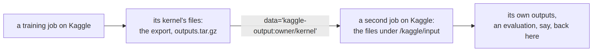

# kaggle


<!-- WARNING: THIS FILE WAS AUTOGENERATED! DO NOT EDIT! -->

A Kaggle kernel runs one uploaded file, so a sysone job on Kaggle is the
[runner](40_cloud.ipynb#the-jobs-files) with the job’s folder embedded
in it: `kaggle kernels push` uploads that file with a
`kernel-metadata.json` (the accelerator, internet on, the datasets to
mount), and the kernel unpacks the job into `/kaggle/working/sysone_job`
and runs it. Its log is followed live (`kaggle kernels logs -f`, in a
background process writing the job’s log here), its status polled
(`kaggle kernels status`), and at the end `kaggle kernels output` brings
`outputs.tar.gz` back. The runner stops a job at its `max_hours` and
Kaggle stops the kernel half an hour later (`KAGGLE_GRACE`), so a job
that runs long still packs its outputs; a kernel Kaggle stops first
keeps the files it wrote, but not the tarball.

What Kaggle does not allow shapes the rest:

- **No secrets reach a pushed kernel**: Kaggle’s secrets are attached to
  a notebook in its editor, and the CLI has no way to pass one. So a job
  with `push=` does not push from Kaggle; `job.fetch()` pushes the
  export from here, with your Hub login. For the same reason a job
  cannot read a private Hub dataset; local data goes to Kaggle as a
  private Kaggle dataset instead.
- **No way to stop a kernel from the CLI**: `job.stop()` gives the
  kernel’s page, where Kaggle’s Stop button is.
- **Quotas and limits**: about 30 GPU hours and 20 TPU hours a week, 12
  hours per session (9 on TPUs), 20 GB of outputs. Accounts need a
  verified phone number for internet access, which the job uses to
  install sysone.

------------------------------------------------------------------------

<a
href="https://github.com/sgaseretto/sysonelib/blob/main/sysone/kaggle.py#L33"
target="_blank" style="float:right; font-size:smaller">source</a>

### kaggle_owner

``` python
def kaggle_owner(
    b:sysone.cloud.Kaggle
)->str:
```

*The account jobs go under: the backend’s owner, KAGGLE_USERNAME, or the
CLI’s logged-in user*

------------------------------------------------------------------------

<a
href="https://github.com/sgaseretto/sysonelib/blob/main/sysone/kaggle.py#L23"
target="_blank" style="float:right; font-size:smaller">source</a>

### run_kaggle

``` python
def run_kaggle(
    args:list, timeout:float=600, check:bool=True
)->str:
```

*Run a `kaggle` command and return its output; Kaggle reports some
failures with exit code 0, so its output is read too*

------------------------------------------------------------------------

<a
href="https://github.com/sgaseretto/sysonelib/blob/main/sysone/kaggle.py#L21"
target="_blank" style="float:right; font-size:smaller">source</a>

### KaggleError

``` python
def KaggleError(
    *args, **kwargs
):
```

*The Kaggle CLI reported a failure*

## Hardware and data

Kaggle names its accelerators itself; a T4 machine always has two
(`GPU("T4", 2)`, which trains with both through `torchrun`). As of
September 2026 the P100 is gone, and TPU pushes from the CLI may get a
machine without a TPU (Kaggle’s issue 1197), which the runner’s `start`
line shows.

------------------------------------------------------------------------

<a
href="https://github.com/AnswerDotAI/nbdev/blob/main/nbdev/showdoc.py#LNone"
target="_blank" style="float:right; font-size:smaller">source</a>

### show_doc

``` python
def show_doc(
    sym, # Symbol to document
    renderer:NoneType=None, # Optional renderer (defaults to markdown)
    name:str | None=None, # Optionally override displayed name of `sym`
    title_level:int=3, # Heading level to use for symbol name
):
```

*Show signature and docstring for `sym`*

------------------------------------------------------------------------

<a
href="https://github.com/AnswerDotAI/nbdev/blob/main/nbdev/showdoc.py#LNone"
target="_blank" style="float:right; font-size:smaller">source</a>

### show_doc

``` python
def show_doc(
    sym, # Symbol to document
    renderer:NoneType=None, # Optional renderer (defaults to markdown)
    name:str | None=None, # Optionally override displayed name of `sym`
    title_level:int=3, # Heading level to use for symbol name
):
```

*Show signature and docstring for `sym`*

------------------------------------------------------------------------

<a
href="https://github.com/AnswerDotAI/nbdev/blob/main/nbdev/showdoc.py#LNone"
target="_blank" style="float:right; font-size:smaller">source</a>

### show_doc

``` python
def show_doc(
    sym, # Symbol to document
    renderer:NoneType=None, # Optional renderer (defaults to markdown)
    name:str | None=None, # Optionally override displayed name of `sym`
    title_level:int=3, # Heading level to use for symbol name
):
```

*Show signature and docstring for `sym`*

``` python
test_eq([machine(Kaggle(), h) for h in (CPU(), GPU("T4", 2), GPU("L4"), GPU("H100"))], ["cpu", "NvidiaTeslaT4", "NvidiaL4X1", "NvidiaH100"])
test_fail(lambda: machine(Kaggle(), GPU("G4")), contains="Kaggle's GPUs")
test_fail(lambda: machine(Kaggle(), TPU("v5e-1")), contains="Kaggle's TPUs")
```

Data reaches a kernel in three ways: a Kaggle dataset is mounted under
`/kaggle/input` (the runner finds it there by name), local data up to
`KAGGLE_SHIP_MB` travels inside the kernel’s file, and larger local data
becomes a private Kaggle dataset first
([`kaggle_dataset`](https://sgaseretto.github.io/sysonelib/kaggle.html#kaggle_dataset)).
A public Hub dataset is downloaded by the job.

A finished kernel’s files are a fourth source,
`kaggle-output:owner/kernel`: Kaggle mounts them as one of the new
kernel’s sources, and the runner finds them under `/kaggle/input` by the
kernel’s name, so a second job reads the first one’s export without it
coming here:

<div>

<figure class=''>

<div>



</div>

</figure>

</div>

------------------------------------------------------------------------

<a
href="https://github.com/sgaseretto/sysonelib/blob/main/sysone/kaggle.py#L83"
target="_blank" style="float:right; font-size:smaller">source</a>

### kaggle_dataset

``` python
def kaggle_dataset(
    path, ref:str, private:bool=True, dry_run:bool=False
)->str:
```

*Upload a file or folder as a Kaggle dataset `owner/slug` (a new version
when it exists); returns its ref*

------------------------------------------------------------------------

<a
href="https://github.com/AnswerDotAI/nbdev/blob/main/nbdev/showdoc.py#LNone"
target="_blank" style="float:right; font-size:smaller">source</a>

### show_doc

``` python
def show_doc(
    sym, # Symbol to document
    renderer:NoneType=None, # Optional renderer (defaults to markdown)
    name:str | None=None, # Optionally override displayed name of `sym`
    title_level:int=3, # Heading level to use for symbol name
):
```

*Show signature and docstring for `sym`*

------------------------------------------------------------------------

<a
href="https://github.com/AnswerDotAI/nbdev/blob/main/nbdev/showdoc.py#LNone"
target="_blank" style="float:right; font-size:smaller">source</a>

### show_doc

``` python
def show_doc(
    sym, # Symbol to document
    renderer:NoneType=None, # Optional renderer (defaults to markdown)
    name:str | None=None, # Optionally override displayed name of `sym`
    title_level:int=3, # Heading level to use for symbol name
):
```

*Show signature and docstring for `sym`*

------------------------------------------------------------------------

<a
href="https://github.com/AnswerDotAI/nbdev/blob/main/nbdev/showdoc.py#LNone"
target="_blank" style="float:right; font-size:smaller">source</a>

### show_doc

``` python
def show_doc(
    sym, # Symbol to document
    renderer:NoneType=None, # Optional renderer (defaults to markdown)
    name:str | None=None, # Optionally override displayed name of `sym`
    title_level:int=3, # Heading level to use for symbol name
):
```

*Show signature and docstring for `sym`*

``` python
test_eq(stage(KaggleData("me/emotions"), Kaggle(), "SYSONE_DATA"), {"kaggle_datasets": ["me/emotions"], "find": {"SYSONE_DATA": "/kaggle/input/**/emotions"}})
test_eq(list(stage(LocalPath(str(Path("fixtures/typed_decisions_tiny.jsonl").resolve())), Kaggle(), "SYSONE_DATA")), ["ship"])
test_eq(stage(KaggleOutput("me/train-run"), Kaggle(), "SYSONE_DATA_RUN"),
        {"kaggle_kernels": ["me/train-run"], "find": {"SYSONE_DATA_RUN": "/kaggle/input/**/train-run"}})      # another kernel's files
```

## Starting and following a kernel

------------------------------------------------------------------------

<a
href="https://github.com/AnswerDotAI/nbdev/blob/main/nbdev/showdoc.py#LNone"
target="_blank" style="float:right; font-size:smaller">source</a>

### show_doc

``` python
def show_doc(
    sym, # Symbol to document
    renderer:NoneType=None, # Optional renderer (defaults to markdown)
    name:str | None=None, # Optionally override displayed name of `sym`
    title_level:int=3, # Heading level to use for symbol name
):
```

*Show signature and docstring for `sym`*

------------------------------------------------------------------------

<a
href="https://github.com/AnswerDotAI/nbdev/blob/main/nbdev/showdoc.py#LNone"
target="_blank" style="float:right; font-size:smaller">source</a>

### show_doc

``` python
def show_doc(
    sym, # Symbol to document
    renderer:NoneType=None, # Optional renderer (defaults to markdown)
    name:str | None=None, # Optionally override displayed name of `sym`
    title_level:int=3, # Heading level to use for symbol name
):
```

*Show signature and docstring for `sym`*

------------------------------------------------------------------------

<a
href="https://github.com/AnswerDotAI/nbdev/blob/main/nbdev/showdoc.py#LNone"
target="_blank" style="float:right; font-size:smaller">source</a>

### show_doc

``` python
def show_doc(
    sym, # Symbol to document
    renderer:NoneType=None, # Optional renderer (defaults to markdown)
    name:str | None=None, # Optionally override displayed name of `sym`
    title_level:int=3, # Heading level to use for symbol name
):
```

*Show signature and docstring for `sym`*

------------------------------------------------------------------------

<a
href="https://github.com/AnswerDotAI/nbdev/blob/main/nbdev/showdoc.py#LNone"
target="_blank" style="float:right; font-size:smaller">source</a>

### show_doc

``` python
def show_doc(
    sym, # Symbol to document
    renderer:NoneType=None, # Optional renderer (defaults to markdown)
    name:str | None=None, # Optionally override displayed name of `sym`
    title_level:int=3, # Heading level to use for symbol name
):
```

*Show signature and docstring for `sym`*

------------------------------------------------------------------------

<a
href="https://github.com/sgaseretto/sysonelib/blob/main/sysone/kaggle.py#L123"
target="_blank" style="float:right; font-size:smaller">source</a>

### parse_kaggle_status

``` python
def parse_kaggle_status(
    text:str
)->str:
```

*The status word in `kaggle kernels status` output: queued, running,
complete, error or cancelacknowledged*

------------------------------------------------------------------------

<a
href="https://github.com/sgaseretto/sysonelib/blob/main/sysone/kaggle.py#L100"
target="_blank" style="float:right; font-size:smaller">source</a>

### kernel_folder

``` python
def kernel_folder(
    b:sysone.cloud.Kaggle, job:sysone.cloud.Job
)->pathlib.Path:
```

*The folder `kaggle kernels push` uploads: the runner with the job
embedded, and kernel-metadata.json*

<div>

> **Finding: a kernel stopped at its time limit keeps its files, not its
> tarball**
>
> The first LoRA run on the [diffusion model](24_mdlm.ipynb) trained for
> 87 minutes of its two hours, then exported, and the export held a full
> copy of the 2.4 GB base model beside the 40 MB adapter. Packing that
> into `outputs.tar.gz` took the kernel past its limit, and Kaggle
> stopped it (`CANCEL_ACKNOWLEDGED`): there was no tarball to fetch,
> though the run itself had finished. Kaggle keeps the files a stopped
> kernel wrote, and `kaggle kernels output --file-pattern` brought back
> the adapter alone, 50 MB. Since then the runner stops a job at its own
> `max_hours`, counted from the kernel’s start, and Kaggle stops the
> kernel `KAGGLE_GRACE` later; and an export that keeps an adapter over
> a model on the Hub holds the adapter alone (the
> [inference](06_inference.ipynb#export) notebook).

</div>

<figure>

<figcaption aria-hidden="true">A two-hour job on Kaggle: the first run
packing a 2.4 GB export past Kaggle’s limit, and now the runner’s
deadline at max_hours with Kaggle’s limit KAGGLE_GRACE
later</figcaption>
</figure>

The two deadlines, drawn
([figures](90_figures.ipynb#a-kaggle-jobs-two-deadlines)). The first run
had one, Kaggle’s, at the job’s two hours, and the export was still
being packed when it came. Now the runner keeps its own at `max_hours`,
counting the installs, and stops the entry there if it is still running,
which leaves the kernel `KAGGLE_GRACE`, half an hour, to write
`status.json` and pack `outputs.tar.gz` before Kaggle’s limit.

``` python
test_eq(parse_kaggle_status('me/k has status "KernelWorkerStatus.COMPLETE"'), "complete")
test_eq(parse_kaggle_status('me/k has status "cancelAcknowledged"'), "cancelacknowledged")
```

## A job on a stand-in Kaggle

As for Colab, a stand-in for the `kaggle` CLI runs the whole round trip
here: it runs a pushed kernel’s file with `/kaggle` mapped to a
temporary folder, reports its status, streams its log and hands out its
outputs.

``` python
fake_bin, fake_kaggle = Path(tempfile.mkdtemp()), Path(tempfile.mkdtemp())
(fake_bin / "kaggle").write_text(f"""#!{sys.executable}
import glob, json, os, shutil, subprocess, sys, time
root = os.environ["FAKE_KAGGLE_ROOT"]
a = sys.argv[1:]
open(os.path.join(root, "calls.log"), "a").write(json.dumps(a) + "\\n")
def opt(name, default=None): return a[a.index(name) + 1] if name in a else default
def state(ref): return os.path.join(root, ref.replace("/", "__"))
if a[:2] == ["config", "view"]: print("username: me")
elif a[:2] == ["kernels", "push"]:
    kf = opt("-p"); meta = json.load(open(os.path.join(kf, "kernel-metadata.json")))
    src = open(os.path.join(kf, meta["code_file"])).read().replace("/kaggle", os.path.join(root, "kaggle"))
    os.makedirs(state(meta["id"]), exist_ok=True); open(os.path.join(state(meta["id"]), "run.py"), "w").write(src)
    log = open(os.path.join(state(meta["id"]), "log"), "ab")
    p = subprocess.Popen([sys.executable, os.path.join(state(meta["id"]), "run.py")], stdout=log, stderr=subprocess.STDOUT, start_new_session=True)
    open(os.path.join(state(meta["id"]), "pid"), "w").write(str(p.pid)); print("Kernel version 1 successfully pushed.")
elif a[:2] == ["kernels", "status"]:
    s = state(a[2]); pid = int(open(os.path.join(s, "pid")).read())
    try: os.kill(pid, 0); alive = not os.path.exists(os.path.join(root, "kaggle/working/sysone_job/outputs.tar.gz"))
    except OSError: alive = False
    st = "RUNNING" if alive else ("COMPLETE" if '"complete"' in open(os.path.join(root, "kaggle/working/sysone_job/outputs/status.json")).read() else "ERROR")
    print(f'{{a[2]}} has status "KernelWorkerStatus.{{st}}"')
elif a[:2] == ["kernels", "logs"]:
    s = state(a[-1]); pos = 0
    while True:
        data = open(os.path.join(s, "log"), "rb").read(); sys.stdout.write(data[pos:].decode("latin-1" if "-f" in a else "utf-8")); sys.stdout.flush(); pos = len(data)
        done = os.path.exists(os.path.join(root, "kaggle/working/sysone_job/outputs.tar.gz"))
        if "-f" not in a or done: sys.stdout.write(open(os.path.join(s, "log"), "rb").read()[pos:].decode("latin-1" if "-f" in a else "utf-8")); break
        time.sleep(0.5)
elif a[:2] == ["kernels", "output"]:
    dest = opt("-p"); os.makedirs(os.path.join(dest, "sysone_job"), exist_ok=True)
    shutil.copy(os.path.join(root, "kaggle/working/sysone_job/outputs.tar.gz"), os.path.join(dest, "sysone_job", "outputs.tar.gz"))
else: sys.exit(f"fake kaggle: {{a}} not implemented")
""")
(fake_bin / "kaggle").chmod(0o755)
os.environ |= {"PATH": f"{fake_bin}{os.pathsep}{os.environ['PATH']}", "FAKE_KAGGLE_ROOT": str(fake_kaggle), "KAGGLE_USERNAME": "me",
               "SYSONE_JOBS": str(Path(tempfile.mkdtemp()) / "jobs.json"), "SYSONE_JOBS_DIR": tempfile.mkdtemp()}
```

``` python
script = Path(tempfile.mkdtemp()) / "train.py"
script.write_text("""import os
from sysone.data import TypedDecisions
from sysone.learner import decision_learner
from sysone.cloud import job_input, job_output
data = TypedDecisions.from_json(job_input("data"), valid=0.25, calib=0.2)
learn = decision_learner(data, os.environ["ENCODER"], train="head", logging_steps=1, disable_tqdm=True)
learn.fit(1, lr=1e-3)
learn.export(job_output())
""")
kj = remote(script, on="kaggle", hw="cpu", data="fixtures/typed_decisions_tiny.jsonl", env={"ENCODER": str(Path("fixtures/tiny-modernbert").resolve())},
            install=False)
test_eq(kj.ref, f"me/{kj.id}")
kj.wait(every=2, logs=False)
test_eq(kj.status, "complete")
assert [r for r in kj.progress() if r["event"] == "log"]          # followed live
assert "█" in kj.logs() and "â" not in kj.logs()                  # progress bars intact (see the finding below)
meta = json.loads((Path(kj.folder) / "kernel" / "kernel-metadata.json").read_text())
test_eq((meta["enable_gpu"], meta["enable_internet"], meta["is_private"], "machine_shape" in meta), (False, True, True, False))
rec = json.loads(Path("fixtures/typed_decisions_tiny.jsonl").read_text().splitlines()[0])
test_eq(set(Decider.load(kj.fetch(), device="cpu").predict(rec["state"], rec["questions"])), set(rec["questions"]))
test_fail(lambda: kj.stop(), contains="kaggle.com/code/me/")
```

<div>

> **Finding: the Kaggle CLI garbles the text of a live log**
>
> `kaggle kernels logs -f` reads Kaggle’s live log stream, which comes
> without a charset, so `requests` decodes its UTF-8 as Latin-1. On the
> first real kernel every `█` of a progress bar arrived as `â` and two
> invisible characters, and accented text would arrive the same way.
> Latin-1 maps each byte to one character, so writing that text back out
> as Latin-1 restores the original bytes: the follower runs the CLI with
> `PYTHONIOENCODING=latin-1`. The stand-in streams its log as the CLI
> does, and the test above finds its progress bars intact. Should the
> CLI decode UTF-8 one day, characters beyond Latin-1 would show as
> escapes, not garbled.

</div>

``` python
os.environ["PATH"] = os.environ["PATH"].split(os.pathsep, 1)[1]; del os.environ["FAKE_KAGGLE_ROOT"], os.environ["KAGGLE_USERNAME"]
```

The stand-in kernel ran with this machine’s Python, which has sysone
already (`install=False`). A real kernel gets the wheel of this
checkout, packed into the runner with the rest of the job, and installs
it first:

``` python
wj = remote(script, on="kaggle", hw="cpu", data="fixtures/typed_decisions_tiny.jsonl", env={"ENCODER": "answerdotai/ModernBERT-base"}, dry_run=True)
whl = json.loads((Path(wj.folder) / "job.json").read_text())["install"][0]
test_eq((whl.startswith("sysone-"), whl.endswith(".whl"), (Path(wj.folder) / whl).exists()), (True, True, True))
oj = remote(script, on="kaggle", hw="cpu", data="kaggle-output:me/train-run", install=False, dry_run=True)       # reads another kernel's files
oj.ref = "me/eval-run"
meta = json.loads((kernel_folder(Kaggle(owner="me"), oj) / "kernel-metadata.json").read_text())
test_eq((meta["kernel_sources"], json.loads((Path(oj.folder) / "job.json").read_text())["find"]), (["me/train-run"], {"SYSONE_DATA": "/kaggle/input/**/train-run"}))
```

## Publishing to Kaggle Models

The Hub is where exports go by default;
[`publish_kaggle`](https://sgaseretto.github.io/sysonelib/kaggle.html#publish_kaggle)
also makes a Kaggle Model of an export, writing the two metadata files
the CLI reads and uploading the folder as a variation (its subfolders
zipped, which the CLI otherwise skips).

------------------------------------------------------------------------

<a
href="https://github.com/sgaseretto/sysonelib/blob/main/sysone/kaggle.py#L172"
target="_blank" style="float:right; font-size:smaller">source</a>

### publish_kaggle

``` python
def publish_kaggle(
    path, owner:str, model:str, variation:str='default', license:str='Apache 2.0', framework:str='pyTorch',
    title:str | None=None, private:bool=True, dry_run:bool=False
)->dict:
```

*Create a Kaggle Model and upload an export folder as one of its
variations*

``` python
exp = Path(tempfile.mkdtemp()); (exp / "sysone.json").write_text("{}")
cmds = publish_kaggle(exp, "me", "my-jev", dry_run=True)
test_eq(cmds["variation"][-2:], ["-r", "zip"])
test_eq(json.loads((exp / "model-instance-metadata.json").read_text())["instanceSlug"], "default")
```

## On real Kaggle

These cells need the Kaggle CLI and a login
(`sysone.auth.login("kaggle")`); they are flagged `kaggle`, so the tests
skip them unless run with `--flags kaggle`. The tiny training runs on a
CPU kernel, then on two T4s.

``` python
real = remote(script, on="kaggle", hw="cpu", data="fixtures/typed_decisions_tiny.jsonl", env={"ENCODER": "answerdotai/ModernBERT-base"})
real.wait(every=30)
test_eq(real.status, "complete")
Decider.load(real.fetch(), device="cpu").predict(rec["state"], rec["questions"])
```

``` python
t4 = remote(script, on="kaggle", hw="t4x2", data="fixtures/typed_decisions_tiny.jsonl", env={"ENCODER": "answerdotai/ModernBERT-base"})
t4.wait(every=30)
test_eq(t4.status, "complete")
```
