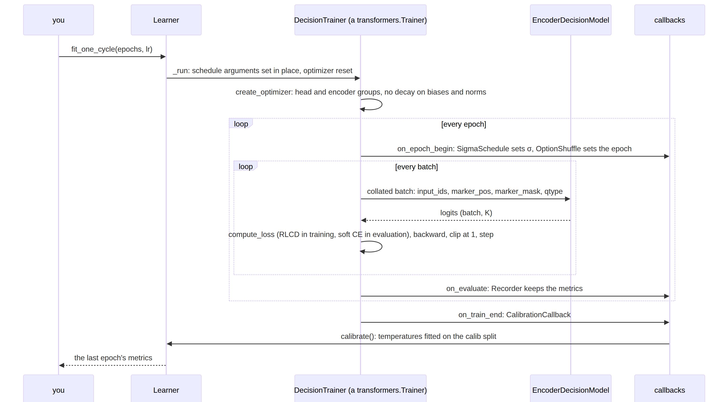
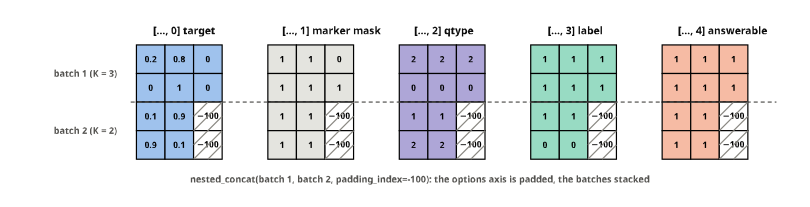

# learner


<!-- WARNING: THIS FILE WAS AUTOGENERATED! DO NOT EDIT! -->

Training is `transformers.Trainer` with two overrides, the loss and the
optimizer groups, plus what Laya’s notebook does by hand: the RLCD loss,
discriminative learning rates, the σ schedule and a calibration pass on
held-out rows. The training loop, mixed precision, gradient
accumulation, checkpointing, distributed training and the reporters are
the Trainer’s, untouched. On top sit fastai’s verbs: `lr_find`, `fit`,
`fit_one_cycle`, `freeze`, `unfreeze`,
[`freeze_to`](https://sgaseretto.github.io/sysonelib/models.html#freeze_to).

The fixtures again: twenty cases and the tiny ModernBERT.

``` python
FIX = "fixtures/tiny-modernbert"
data = TypedDecisions.from_json("fixtures/typed_decisions_tiny.jsonl", valid=0.25, calib=0.2)
spec = EncoderSpec.from_pretrained(FIX)
data.bind(spec.tokenizer, spec.template)
data
```

## How a fit runs

One call to `fit_one_cycle`, from the verb to the temperatures:

<div>

<figure class=''>

<div>



</div>

</figure>

</div>

Everything in the loop is the Trainer’s own; sysone supplies the loss,
the optimizer groups, two schedules and five callbacks.

## DecisionTrainer

`compute_loss` pops the targets, runs the model and applies the loss; in
evaluation it uses soft cross-entropy, since RLCD’s noise would make the
evaluation loss jitter. `prediction_step` returns the logits and, packed
into one tensor, what the metrics need per row: the target, the marker
mask, the type and the label. The Trainer pads everything it gathers
across batches with -100, so the packing puts the options on the axis it
pads and the mask tells real options from padding. Evaluation reads rows
in order, so predictions line up with the dataset.

------------------------------------------------------------------------

<a
href="https://github.com/sgaseretto/sysonelib/blob/main/sysone/learner.py#L44"
target="_blank" style="float:right; font-size:smaller">source</a>

### unpack_answerable

``` python
def unpack_answerable(
    packed
):
```

*Each row’s answerability from
[`pack_labels`](https://sgaseretto.github.io/sysonelib/learner.html#pack_labels)
output (1 answerable, 0 not, -1 no gold)*

------------------------------------------------------------------------

<a
href="https://github.com/sgaseretto/sysonelib/blob/main/sysone/learner.py#L38"
target="_blank" style="float:right; font-size:smaller">source</a>

### unpack_labels

``` python
def unpack_labels(
    packed
):
```

*targets, masks, qtypes, labels from
[`pack_labels`](https://sgaseretto.github.io/sysonelib/learner.html#pack_labels)
output gathered by the Trainer (padded with -100)*

------------------------------------------------------------------------

<a
href="https://github.com/sgaseretto/sysonelib/blob/main/sysone/learner.py#L29"
target="_blank" style="float:right; font-size:smaller">source</a>

### pack_labels

``` python
def pack_labels(
    b
)->torch.Tensor:
```

*Target, marker mask, question type, label and answerability of a batch
as one (batch, K, 5) tensor*

``` python
b = data.collator([data.rows()[i] for i in range(4)])
tg, mk, qt, lb = unpack_labels(np.pad(pack_labels(b).numpy(), ((0, 0), (0, 2), (0, 0)), constant_values=-100))
test_eq(mk, np.pad(b["marker_mask"].numpy(), ((0, 0), (0, 2))))
test_eq((qt, lb), (b["qtype"].numpy(), b["label"].numpy()))
```

The packing, for two evaluation batches with different option counts:
the Trainer joins them with `nested_concat`, padding the options axis
with −100, and the mask channel is what tells real options from padding
when
[`unpack_labels`](https://sgaseretto.github.io/sysonelib/learner.html#unpack_labels)
reads them back.

<figure>

<figcaption aria-hidden="true">Two packed batches joined by the Trainer,
padded with -100</figcaption>
</figure>

*Drawn with
[`pack_labels`](https://sgaseretto.github.io/sysonelib/learner.html#pack_labels)
and the Trainer’s `nested_concat` in
[figures](90_figures.ipynb#labels-packed-for-the-trainer).*

------------------------------------------------------------------------

<a
href="https://github.com/sgaseretto/sysonelib/blob/main/sysone/learner.py#L57"
target="_blank" style="float:right; font-size:smaller">source</a>

### DecisionTrainer

``` python
def DecisionTrainer(
    *args, loss_fn:NoneType=None, lr_head:float | None=None, lr_encoder:float | None=None, act_weight:float=0.5,
    **kwargs
):
```

*A `Trainer` with the decision loss, head and encoder learning rates,
and an optional LR-range or one-cycle schedule*

`create_optimizer` builds four groups, head and encoder (or its
adapters), each split by the Trainer’s own no-decay rule for biases and
norms. The head’s groups come first, so the learning rate the Trainer
logs is the head’s. `create_scheduler` adds two schedules the Trainer
lacks: the exponential ramp of the LR range test and torch’s exact
`OneCycleLR`; both scale every group, so the encoder keeps its ratio to
the head.

------------------------------------------------------------------------

<a
href="https://github.com/sgaseretto/sysonelib/blob/main/sysone/learner.py#L119"
target="_blank" style="float:right; font-size:smaller">source</a>

### DecisionTrainer.create_scheduler

``` python
def create_scheduler(
    num_training_steps:int, optimizer:NoneType=None
):
```

*Setup the scheduler. The optimizer of the trainer must have been set up
either before this method is called or* passed as an argument.

Args: num_training_steps (int): The number of training steps to do.

Returns: `torch.optim.lr_scheduler.LRScheduler`: The learning rate
scheduler instance.

------------------------------------------------------------------------

<a
href="https://github.com/sgaseretto/sysonelib/blob/main/sysone/learner.py#L103"
target="_blank" style="float:right; font-size:smaller">source</a>

### DecisionTrainer.create_optimizer

``` python
def create_optimizer(
    model:NoneType=None
):
```

*Setup the optimizer.*

We provide a reasonable default that works well. If you want to use
something else, you can pass a tuple in the Trainer’s init through
`optimizers`, or subclass and override this method in a subclass.

Returns: `torch.optim.Optimizer`: The optimizer instance.

## TrainingArguments

`TrainingArguments` is used as is.
[`training_args`](https://sgaseretto.github.io/sysonelib/learner.html#training_args)
fills in what decision training wants: no checkpoints, no reporters, the
column names our collator reads, length-grouped batches on the
precomputed `n_tokens`, clipping at 1 and weight decay 0.01, and the
arguments of the current transformers version where they were renamed
(`warmup_steps` as a ratio replaced `warmup_ratio`,
`train_sampling_strategy` replaced `group_by_length`).

------------------------------------------------------------------------

<a
href="https://github.com/sgaseretto/sysonelib/blob/main/sysone/learner.py#L150"
target="_blank" style="float:right; font-size:smaller">source</a>

### training_args

``` python
def training_args(
    output_dir, **kw
)->transformers.training_args.TrainingArguments:
```

*`TrainingArguments` with sysone’s defaults, overridable by keyword*

### Hardware presets

Presets are plain dictionaries of `TrainingArguments`, to print and
edit. `macbook` is MPS in fp32 with small batches, meant for head-only
runs with the cache (bf16 runs on MPS but costs accuracy on some
encoders); `t4` and `t4x2` are fp16 with gradient checkpointing and 8 ×
4 accumulation, the notebook’s shape (for `t4x2`, launch with
`torchrun --nproc_per_node=2`); `l4` and `a100` are bf16. `tpu` and
`neuron` are bf16 and train on full batches only
(`dataloader_drop_last`), while evaluation and prediction still see
every row, the last batch shorter (one more graph for XLA to compile,
once); a learner with either prepares its batches and step for XLA (see
[xla](47_xla.ipynb)). `SYSONE_PRESET` picks one from the environment,
which is how [jobs](40_cloud.ipynb) choose the preset of the machine
they run on.

------------------------------------------------------------------------

<a
href="https://github.com/sgaseretto/sysonelib/blob/main/sysone/learner.py#L176"
target="_blank" style="float:right; font-size:smaller">source</a>

### default_preset

``` python
def default_preset()->str:
```

*`SYSONE_PRESET`, else a guess from the hardware*

``` python
args = training_args(tempfile.mkdtemp(), **PRESETS["cpu"])
test_eq((args.device.type, args.save_strategy, args.label_names, args.remove_unused_columns), ("cpu", "no", ["target"], False))
PRESETS["t4"]
```

## Callbacks

Five small callbacks do what the notebook did by hand.
[`SigmaSchedule`](https://sgaseretto.github.io/sysonelib/learner.html#sigmaschedule)
anneals RLCD’s σ once per epoch;
[`OptionShuffle`](https://sgaseretto.github.io/sysonelib/learner.html#optionshuffle)
tells the
[`Shuffle`](https://sgaseretto.github.io/sysonelib/template.html#shuffle)
transforms which epoch it is;
[`Recorder`](https://sgaseretto.github.io/sysonelib/learner.html#recorder)
keeps the losses and the evaluation metrics;
[`LRFinder`](https://sgaseretto.github.io/sysonelib/learner.html#lrfinder)
records the loss at every step of the range test and stops the run when
the smoothed loss passes four times its best;
[`CalibrationCallback`](https://sgaseretto.github.io/sysonelib/learner.html#calibrationcallback)
fits the temperatures on the held-out slice when training ends, however
the training was started. A sixth,
[`FitLog`](https://sgaseretto.github.io/sysonelib/learner.html#fitlog),
notes each fit for the [training record](05a_record.ipynb): what was
asked for (epochs, learning rates, schedule, batch size, precision) and
what it took (steps, seconds, peak memory). The range test of `lr_find`
is not a fit, so it is left out.

------------------------------------------------------------------------

<a
href="https://github.com/sgaseretto/sysonelib/blob/main/sysone/learner.py#L252"
target="_blank" style="float:right; font-size:smaller">source</a>

### LRFinder

``` python
def LRFinder(
    factor:float=4.0, beta:float=0.98, stop_div:bool=True
):
```

*Record (lr, loss) every step and stop when the smoothed loss diverges*

------------------------------------------------------------------------

<a
href="https://github.com/sgaseretto/sysonelib/blob/main/sysone/learner.py#L228"
target="_blank" style="float:right; font-size:smaller">source</a>

### FitLog

``` python
def FitLog(
    learner
):
```

*One entry per fit for the training record: what was asked for (epochs,
learning rates, schedule, batch) and what it took*

------------------------------------------------------------------------

<a
href="https://github.com/sgaseretto/sysonelib/blob/main/sysone/learner.py#L218"
target="_blank" style="float:right; font-size:smaller">source</a>

### peak_memory_gb

``` python
def peak_memory_gb(
    device:str, mps_bytes:int=0
)->float | None:
```

*The most memory a fit used: CUDA’s peak since the last reset, the MPS
driver’s largest allocation seen, or the process’s peak RSS*

------------------------------------------------------------------------

<a
href="https://github.com/sgaseretto/sysonelib/blob/main/sysone/learner.py#L212"
target="_blank" style="float:right; font-size:smaller">source</a>

### CalibrationCallback

``` python
def CalibrationCallback(
    learner
):
```

*Fit the learner’s temperatures on its calib split when training ends*

------------------------------------------------------------------------

<a
href="https://github.com/sgaseretto/sysonelib/blob/main/sysone/learner.py#L204"
target="_blank" style="float:right; font-size:smaller">source</a>

### Recorder

``` python
def Recorder():
```

*Training losses and evaluation metrics, per step and per epoch*

------------------------------------------------------------------------

<a
href="https://github.com/sgaseretto/sysonelib/blob/main/sysone/learner.py#L198"
target="_blank" style="float:right; font-size:smaller">source</a>

### OptionShuffle

``` python
def OptionShuffle(
    tfms
):
```

*Give every transform with `set_epoch` the current epoch
([`Shuffle`](https://sgaseretto.github.io/sysonelib/template.html#shuffle),
[`Rephrase`](https://sgaseretto.github.io/sysonelib/data.html#rephrase),
an
[`Expansion`](https://sgaseretto.github.io/sysonelib/data.html#expansion)),
so option orders, wordings and added questions change between epochs*

------------------------------------------------------------------------

<a
href="https://github.com/sgaseretto/sysonelib/blob/main/sysone/learner.py#L192"
target="_blank" style="float:right; font-size:smaller">source</a>

### SigmaSchedule

``` python
def SigmaSchedule(
    loss
):
```

*Anneal RLCD’s σ once per epoch*

## Learner

[`Learner`](https://sgaseretto.github.io/sysonelib/learner.html#learner)
holds the data, the model, the loss, the regime and the Trainer.
`learn.trainer` is the raw `transformers.Trainer`, with its arguments at
`learn.args`; the verbs below change only the schedule-related arguments
before each run, so anything else set there sticks. `lr` is one value
for the head, the encoder getting a quarter of it (Laya’s ratio: 1e-4
and 2.5e-5), or a pair `(encoder, head)`.

------------------------------------------------------------------------

<a
href="https://github.com/sgaseretto/sysonelib/blob/main/sysone/learner.py#L272"
target="_blank" style="float:right; font-size:smaller">source</a>

### Learner

``` python
def Learner(
    data:sysone.data.TypedDecisions, # cases, bound to the encoder's tokenizer
    model:sysone.models.EncoderDecisionModel, # encoder and head, regime already set
    loss:NoneType=None, # 'soft_ce', 'rlcd', a callable, or the data's default
    cache:str | None=None, # 'masks' or 'rows' to train a frozen encoder's head from cached features
    lr:float=0.0001, # head LR, or (encoder, head)
    preset:str | None=None, # a key of PRESETS; SYSONE_PRESET or the hardware's by default
    path:NoneType=None, # where the Trainer writes; a temporary folder by default
    cache_dir:NoneType=None, # where feature caches live; ~/.cache/sysone/features by default
    cache_dtype:str='float16', # how a feature cache stores the vectors; float32 for an encoder whose vectors float16 cannot hold
    calibrate_after_fit:bool=True, # fit temperatures on the calib split after every fit
    callbacks:list | None=None, # extra TrainerCallbacks
    act_weight:float=0.5, # the act head's loss weight, beside the option loss
    metrics:list | None=None, # more metrics, beside Laya's: functions of a `Preds`, or `Metric`s (see metrics)
    **args
):
```

*Data, model, loss and a
[`DecisionTrainer`](https://sgaseretto.github.io/sysonelib/learner.html#decisiontrainer),
with fastai’s training verbs*

------------------------------------------------------------------------

<a
href="https://github.com/sgaseretto/sysonelib/blob/main/sysone/learner.py#L345"
target="_blank" style="float:right; font-size:smaller">source</a>

### Learner.dataset

``` python
def dataset(
    split:str='train'
):
```

*What the Trainer reads for a split: cached features, rows built on
read, or static rows*

``` python
torch.manual_seed(0)
model = set_regime(EncoderDecisionModel(spec.load_encoder(), DecisionHead(spec.width, layers=1), spec), "full")
learn = Learner(data, model, preset="cpu", logging_steps=1)
learn
```

``` python
test_eq(learn.trainer.lr_head, 1e-4); test_eq(learn.trainer.lr_encoder, 2.5e-5)
assert isinstance(learn.loss, RLCD)    # typed-decisions gold is a distribution
test_eq(len(learn.dataset("train")), len(data.rows("train")))
```

### Running the Trainer

`_run` is the one place the Trainer runs: it sets the schedule-related
arguments on `learn.args`, resets the optimizer so new learning rates
apply, points the Trainer at the right datasets, trains, and puts the
arguments back. It also notes on the model when the encoder has trained,
so an export after a later `freeze()` still carries the trained encoder.
With a feature cache the length grouping is off (there is no sequence to
pad), and so is the `n_tokens` column’s role.

A head built with `standardize=True` needs the statistics of the
encoder’s vectors before it trains; `_run` and `lr_find` fit them on
first use, from the cached anchors when there is a cache, and otherwise
from one pass of the encoder over up to `n` training rows (the anchors
for a head without layers, every position for one with layers):

------------------------------------------------------------------------

<a
href="https://github.com/sgaseretto/sysonelib/blob/main/sysone/learner.py#L389"
target="_blank" style="float:right; font-size:smaller">source</a>

### Learner.fit_standardizer

``` python
def fit_standardizer(
    n:int=512, batch_size:int=8
):
```

*Fit the head’s per-dimension standardisation on up to `n` training
rows*

``` python
torch.manual_seed(0)
ls = Learner(data, set_regime(EncoderDecisionModel(spec.load_encoder(), DecisionHead(spec.width, layers=0, standardize=True), spec), "head"), preset="cpu", calibrate_after_fit=False)
test_eq(ls.model.head.standardizer_fitted, False)
ls._run(1, 1e-3)
test_eq(ls.model.head.standardizer_fitted, True)
test_eq(ls.model.head.in_std.min().item() > 0, True)
```

<div>

> **Finding: a new TrainingArguments resets the Trainer’s accelerator**
>
> The first `_run` built a fresh `TrainingArguments` for every run.
> Creating one resets accelerate’s global state
> (`TrainingArguments.__post_init__` sets up the device, which calls
> `AcceleratorState._reset_state()`), and the Trainer’s accelerator,
> built from that state, is left without it: the next training step
> fails. `_run` therefore sets its fields on the live arguments and puts
> them back afterwards. What a second arguments object does to a
> learner:

</div>

``` python
TrainingArguments(tempfile.mkdtemp(), use_cpu=True, report_to="none")     # what building fresh arguments for a run does
test_fail(lambda: learn._run(1, 1e-3), contains="AcceleratorState")
learn.trainer.create_accelerator_and_postprocess()                          # rebuild the accelerator, so the notebook can go on
```

### Predictions and metrics

`get_preds` runs the Trainer’s prediction loop over a split and returns
the logits with everything the metrics need, as a
[\[`Preds`\](https://sgaseretto.github.io/sysonelib/metrics.html#preds)](04a_metrics.ipynb#preds):
the gold, the masks, the kinds and labels, each row’s p(act) with an act
head, and each row’s question, case and option keys (`row_meta` and
`option_keys` read them off the split’s rows, in the order the Trainer
reads them). `validate` turns them into the notebook’s metrics,
calibrated with the fitted temperatures unless told otherwise, plus,
once an act threshold is fitted, the coverage and the accuracy on the
cases acted on.

------------------------------------------------------------------------

<a
href="https://github.com/sgaseretto/sysonelib/blob/main/sysone/learner.py#L467"
target="_blank" style="float:right; font-size:smaller">source</a>

### Learner.validate

``` python
def validate(
    split:str='valid', calibrated:bool=True, metrics:list | None=None
)->dict:
```

*The notebook’s metrics on a split, the learner’s own `metrics`, and any
more given here*

------------------------------------------------------------------------

<a
href="https://github.com/sgaseretto/sysonelib/blob/main/sysone/learner.py#L439"
target="_blank" style="float:right; font-size:smaller">source</a>

### Learner.get_preds

``` python
def get_preds(
    split:str='valid'
)->sysone.metrics.Preds:
```

*Every row of a split as a
[`Preds`](https://sgaseretto.github.io/sysonelib/metrics.html#preds):
logits, gold, masks, kinds and labels, p(act) with an act head, each
row’s question, case and option keys, and the learner’s temperatures*

------------------------------------------------------------------------

<a
href="https://github.com/sgaseretto/sysonelib/blob/main/sysone/learner.py#L424"
target="_blank" style="float:right; font-size:smaller">source</a>

### Learner.option_keys

``` python
def option_keys(
    split:str='valid'
)->list:
```

*Each row’s option keys, in the order the Trainer reads a held-out split
(looked up once per split)*

------------------------------------------------------------------------

<a
href="https://github.com/sgaseretto/sysonelib/blob/main/sysone/learner.py#L416"
target="_blank" style="float:right; font-size:smaller">source</a>

### Learner.row_meta

``` python
def row_meta(
    split:str='valid'
)->dict:
```

*Each row’s question id, case index and case id, in the order the
Trainer reads the split*

### calibrate

One temperature per question type and option-count bucket, fitted on the
held-out calibration slice and never on training rows; the Decider
divides each row’s logits by its bucket’s temperature. With no calib
split it falls back to the validation split, with a warning, since those
rows are held out too. With an act head it also fits the act thresholds
on the same rows, per question type and option-count bucket as the
temperatures are: the lowest p(act) at which the cases acted on are
still right `act_accuracy` of the time (0.9 by default), which the
Decider reports as `action.act`. `act_score="confidence"` puts the
thresholds on the calibrated top probability instead, and it works for a
model without an act head too. The learner remembers the choice, so the
calibration after a later fit keeps it.

------------------------------------------------------------------------

<a
href="https://github.com/sgaseretto/sysonelib/blob/main/sysone/learner.py#L480"
target="_blank" style="float:right; font-size:smaller">source</a>

### Learner.calibrate

``` python
def calibrate(
    split:str='calib', min_rows:int=10, act_accuracy:float | None=0.9, act_score:str | None=None
)->dict:
```

*Fit temperatures per question type and option-count bucket on held-out
rows, and act thresholds on p(act) or (‘confidence’) the calibrated top
probability*

### fit and fit_one_cycle

`fit` warms up and then holds the learning rate; `fit_one_cycle` warms
up for `pct_start` of the steps and then follows a cosine to zero,
through the Trainer’s own scheduler, or torch’s exact `OneCycleLR` with
`onecycle=True`. Both return the last epoch’s metrics; the calibration
callback has fitted the temperatures by then.

------------------------------------------------------------------------

<a
href="https://github.com/sgaseretto/sysonelib/blob/main/sysone/learner.py#L505"
target="_blank" style="float:right; font-size:smaller">source</a>

### Learner.fit_one_cycle

``` python
def fit_one_cycle(
    epochs:int, lr:NoneType=None, pct_start:float=0.25, onecycle:bool=False, **args
):
```

*Train for `epochs` with warmup then cosine annealing (`onecycle=True`:
torch’s OneCycleLR)*

------------------------------------------------------------------------

<a
href="https://github.com/sgaseretto/sysonelib/blob/main/sysone/learner.py#L499"
target="_blank" style="float:right; font-size:smaller">source</a>

### Learner.fit

``` python
def fit(
    epochs:int, lr:NoneType=None, warmup:float=0.1, **args
):
```

*Train for `epochs`: linear warmup, then a constant learning rate*

``` python
torch.manual_seed(0)
before = {k: v.clone() for k, v in learn.model.state_dict().items()}
res = learn.fit_one_cycle(2, lr=1e-3)
res
```

``` python
test_eq(len(learn.recorder.metrics), 2)
assert all(math.isfinite(l) for l in learn.recorder.losses)
changed = [k for k, v in learn.model.state_dict().items() if not torch.equal(v, before[k])]
assert any(k.startswith("head.") for k in changed) and any(k.startswith("encoder.") for k in changed)
test_eq(set(learn.temperatures) <= {"choice", "score", "noul", "choice:3-5", "choice:2", "score:3-5", "noul:2"}, True)
```

``` python
fl = learn.fit_log.fits
test_eq((len(fl), fl[0]["schedule"], fl[0]["epochs"], fl[0]["lr_head"], fl[0]["device"], fl[0]["precision"]), (1, "cosine", 2, 1e-3, "cpu", "fp32"))
assert fl[0]["steps"] > 0 and fl[0]["seconds"] >= 0 and math.isfinite(fl[0]["final_loss"])
fl[0]
```

The three schedules, as the Trainer and `create_scheduler` build them,
for a run of 100 steps at a head learning rate of 10⁻³. Both groups
follow the same shape, the encoder at a quarter of the head:

<details class="code-fold">
<summary>figure code</summary>

``` python
def lr_curve(kind, steps=100, head=1e-3, warmup=0.25):
    "The learning rate of each group at every step, from the scheduler a run would build"
    ps = [torch.nn.Parameter(torch.zeros(1)) for _ in range(2)]
    opt = torch.optim.AdamW([{"params": [ps[0]], "lr": head}, {"params": [ps[1]], "lr": head / 4}])
    if kind == "onecycle":
        sch = torch.optim.lr_scheduler.OneCycleLR(opt, max_lr=[head, head / 4], total_steps=steps, pct_start=warmup, anneal_strategy="cos", cycle_momentum=False)
    else: sch = get_scheduler(kind, opt, num_warmup_steps=int(warmup * steps), num_training_steps=steps)
    out = []
    for _ in range(steps): out.append([g["lr"] for g in opt.param_groups]); opt.step(); sch.step()
    return np.array(out)
curves = {"fit: constant after 10% warmup": lr_curve("constant_with_warmup", warmup=0.1),
          "fit_one_cycle: cosine after 25% warmup": lr_curve("cosine"), "fit_one_cycle(onecycle=True)": lr_curve("onecycle")}
fig, axs = plt.subplots(1, 3, figsize=(10, 2.3), sharey=True)
for ax, (name, c) in zip(axs, curves.items()):
    ax.plot(c[:, 0], label="head"); ax.plot(c[:, 1], label="encoder: a quarter"); ax.set_title(name); ax.set_xlabel("step")
axs[0].set_ylabel("learning rate"); axs[0].legend(); plt.tight_layout(); plt.show()
```

</details>

The metrics on the validation split, calibrated with the temperatures
the fit just produced, and a recalibration with a lower row threshold
(the fixture is tiny):

``` python
p = learn.get_preds("valid")
test_eq(p["logits"].shape[0], len(data.rows("valid")))
test_eq(p["masks"].sum(-1).tolist(), [len(m) for m in data.rows("valid")["markers"]])
learn.validate()
```

<div>

> **Finding: the Trainer groups evaluation rows by length too**
>
> The check just above, that the predicted rows come back in the
> dataset’s order, failed at first. With
> `train_sampling_strategy="group_by_length"`, which sysone uses to cut
> padding in training, transformers’ `_get_eval_sampler` groups the
> evaluation rows by length as well, so
> [`predict`](https://sgaseretto.github.io/sysonelib/cli.html#predict)
> returns them shuffled. The metrics computed inside the loop are
> unaffected, since the labels travel with the predictions, but anything
> that joins predictions back to rows by position (answers per case,
> accuracy per workflow) would be scrambled.
> [`DecisionTrainer`](https://sgaseretto.github.io/sysonelib/learner.html#decisiontrainer)
> keeps evaluation sequential:

</div>

``` python
valid_rows = learn.dataset("valid")
grouped, ours = list(Trainer._get_eval_sampler(learn.trainer, valid_rows)), list(learn.trainer._get_eval_sampler(valid_rows))
test_eq(ours, list(range(len(valid_rows))))
test_ne(grouped, ours)
grouped
```

``` python
learn.calibrate(min_rows=5)
```

The temperatures come from the callback, so they are fitted however
training starts, here through the raw Trainer:

``` python
calls, calibrate = [], learn.calibrate
learn.calibrate = lambda *a, **k: calls.append(1) or calibrate(min_rows=4)   # the fixture's calib slice is tiny
learn.temperatures = {}
learn._run(1, 1e-3)                   # learn.trainer.train() with the schedule arguments set
del learn.calibrate
test_eq(len(calls), 1); assert learn.temperatures
```

The optimizer groups carry the discriminative learning rates, and the
no-decay rule holds in both parts:

``` python
[(g["name"], g["lr"], g["weight_decay"], len(g["params"])) for g in learn.trainer.optimizer.param_groups]
```

``` python
g = {x["name"]: x for x in learn.trainer.optimizer.param_groups}
test_eq(sorted(g), ["encoder/decay", "encoder/no_decay", "head/decay", "head/no_decay"])
test_eq(learn.trainer.optimizer.param_groups[0]["name"], "head/decay")
```

### Metrics

[`decision_metrics`](https://sgaseretto.github.io/sysonelib/losses.html#decision_metrics)
is always computed, and `metrics=[...]` adds more columns, fastai’s way:
functions of a
[`Preds`](https://sgaseretto.github.io/sysonelib/metrics.html#preds), or
[`Metric`](https://sgaseretto.github.io/sysonelib/metrics.html#metric)s
that bind arguments, keep a metric to one kind of question or rename it
(see [metrics](04a_metrics.ipynb)). The learner computes them after
every epoch on the valid split, so the recorder keeps a history of each,
and `validate` computes them on any split, plus any more given to it.
Per-question metrics such as macro-F1 group the rows by question and
count classes by option key, as
[`answer_metrics`](https://sgaseretto.github.io/sysonelib/losses.html#answer_metrics)
does, since `get_preds` knows both.

``` python
from sysone.metrics import F1Score, Metric, f1_score, log_loss, top_k_accuracy
```

``` python
torch.manual_seed(0)
lm = Learner(data, set_regime(EncoderDecisionModel(spec.load_encoder(), DecisionHead(spec.width, layers=1), spec), "full"), preset="cpu",
             calibrate_after_fit=False, metrics=[F1Score(), Metric(f1_score, qtype="noul"), top_k_accuracy])
lm.fit(2, 1e-3)
test_eq([k for k in ("f1_score", "f1_score_noul", "top_k_accuracy") if k in lm.recorder.metrics[-1]], ["f1_score", "f1_score_noul", "top_k_accuracy"])
v, pv = lm.validate(metrics=[log_loss]), lm.get_preds()
test_close(v["f1_score"], f1_score(pv)); test_eq("log_loss" in v, True)
test_eq((len(pv.qids), len(pv.option_keys), pv.n), (len(lm.dataset("valid")),) * 3)
test_eq([pv.option_keys[i][int(pv.labels[i])] for i in range(3)],
        [str(as_questions(case_record(data.cases["valid"], c)["questions"])[q].keys[int(l)]) for c, q, l in zip(pv.case_idx[:3], pv.qids[:3], pv.labels[:3])])
{k: round(v[k], 3) for k in ("accuracy", "f1_score", "f1_score_noul", "top_k_accuracy", "log_loss")}
```

### Freezing

`freeze` trains the head only, `unfreeze` everything, `freeze_to(n)` all
but the embeddings and the first n layers. With a feature cache
configured, freezing turns it back on and unfreezing turns it off, since
features cached from a frozen encoder go stale once it trains.

------------------------------------------------------------------------

<a
href="https://github.com/sgaseretto/sysonelib/blob/main/sysone/learner.py#L528"
target="_blank" style="float:right; font-size:smaller">source</a>

### Learner.freeze_to

``` python
def freeze_to(
    n:int
):
```

*Freeze the encoder’s embeddings and first n layers*

------------------------------------------------------------------------

<a
href="https://github.com/sgaseretto/sysonelib/blob/main/sysone/learner.py#L520"
target="_blank" style="float:right; font-size:smaller">source</a>

### Learner.unfreeze

``` python
def unfreeze():
```

*Train the encoder too (its adapters, for a LoRA model); the feature
cache is set aside*

------------------------------------------------------------------------

<a
href="https://github.com/sgaseretto/sysonelib/blob/main/sysone/learner.py#L513"
target="_blank" style="float:right; font-size:smaller">source</a>

### Learner.freeze

``` python
def freeze():
```

*Train the head only (and use the feature cache, if one is configured)*

``` python
learn.freeze()
test_eq(learn.model.n_params()["trainable"], learn.model.n_params()["head"])
learn.freeze_to(2)
test_eq([all(p.requires_grad for p in l.parameters()) for l in encoder_layers(learn.model.encoder)], [False, False, True, True])
learn.unfreeze()
test_eq(learn.model.frozen, False)
test_eq(getattr(learn.model, "encoder_trained", False), True)     # it trained in the fit above
```

### lr_find

The learning-rate range test: from `start` to `end` in `steps`
exponential steps, recording the loss, stopping when it diverges. The
model and optimizer state are restored afterwards, so it can run at any
point, and its steps stay out of `learn.recorder`, which holds the
training history. It suggests two values:
[`valley`](https://sgaseretto.github.io/sysonelib/learner.html#valley),
fastai’s default, the middle of the longest stretch where the loss
falls, and
[`steep`](https://sgaseretto.github.io/sysonelib/learner.html#steep),
where it falls fastest. With matplotlib installed, `plot=True` draws the
curve.

------------------------------------------------------------------------

<a
href="https://github.com/sgaseretto/sysonelib/blob/main/sysone/learner.py#L554"
target="_blank" style="float:right; font-size:smaller">source</a>

### steep

``` python
def steep(
    lrs, losses
):
```

*The LR where the loss falls fastest against log LR*

------------------------------------------------------------------------

<a
href="https://github.com/sgaseretto/sysonelib/blob/main/sysone/learner.py#L542"
target="_blank" style="float:right; font-size:smaller">source</a>

### valley

``` python
def valley(
    lrs, losses
):
```

*fastai’s valley: halfway along the longest run over which the loss
keeps falling*

------------------------------------------------------------------------

<a
href="https://github.com/sgaseretto/sysonelib/blob/main/sysone/learner.py#L535"
target="_blank" style="float:right; font-size:smaller">source</a>

### SuggestedLRs

``` python
def SuggestedLRs(
    *args, **kwargs
):
```

*Learning rates suggested by `lr_find`*

``` python
lr_grid = list(np.logspace(-6, 0, 60))
toy = [3.0 - 2.5 / (1 + np.exp(-(np.log10(l) + 3.5) * 3)) + 8 * max(0, np.log10(l) + 1.5) ** 2 for l in lr_grid]
sv, ss = valley(lr_grid, toy), steep(lr_grid, toy)
lr_min = lr_grid[int(np.argmin(toy))]
assert 1e-5 < sv < lr_min and 1e-5 < ss < lr_min   # both on the falling side of the curve
sv, ss
```

Why not the minimum? At the lowest point of the curve the loss is about
to blow up: the learning rate is at the edge of what training tolerates,
and on a real run the smoothed curve lags behind the steps as well. The
suggestions sit on the long descent before it,
[`steep`](https://sgaseretto.github.io/sysonelib/learner.html#steep)
where the loss falls fastest and
[`valley`](https://sgaseretto.github.io/sysonelib/learner.html#valley)
halfway along the longest stretch over which it keeps falling:

<details class="code-fold">
<summary>figure code</summary>

``` python
fig, ax = plt.subplots(figsize=(5, 2.5))
ax.plot(lr_grid, toy, color="gray", lw=1.2); ax.set_xscale("log")
for name, v, c in (("steep", ss, "C1"), ("valley", sv, "C0"), ("minimum", lr_min, "C3")): ax.axvline(v, ls="--", color=c, lw=1, label=f"{name} {v:.1e}")
ax.set_xlabel("learning rate"); ax.set_ylabel("loss"); ax.legend(); plt.tight_layout(); plt.show()
```

</details>

------------------------------------------------------------------------

<a
href="https://github.com/sgaseretto/sysonelib/blob/main/sysone/learner.py#L584"
target="_blank" style="float:right; font-size:smaller">source</a>

### Learner.plot_lr_find

``` python
def plot_lr_find(
    sugg:NoneType=None
):
```

*Plot the last `lr_find` curve (needs matplotlib)*

------------------------------------------------------------------------

<a
href="https://github.com/sgaseretto/sysonelib/blob/main/sysone/learner.py#L562"
target="_blank" style="float:right; font-size:smaller">source</a>

### Learner.lr_find

``` python
def lr_find(
    start:float=1e-07, end:float=1.0, steps:int=100, stop_div:bool=True, plot:bool=False
)->__main__.SuggestedLRs:
```

*LR range test: suggests
[`valley`](https://sgaseretto.github.io/sysonelib/learner.html#valley)
and
[`steep`](https://sgaseretto.github.io/sysonelib/learner.html#steep),
and restores the model afterwards*

``` python
learn.freeze()
w0, history = learn.model.head.scorer[1].weight.clone(), list(learn.recorder.losses)
sugg = learn.lr_find(start=1e-5, end=10, steps=40)
test_eq(torch.equal(learn.model.head.scorer[1].weight, w0), True)    # the model is restored
test_eq(learn.recorder.losses, history)                              # and the training history
assert 1e-5 <= sugg.valley <= 10 and len(learn.lr_curve[0]) > 5
sugg
```

``` python
test_eq([f["schedule"] for f in learn.fit_log.fits], ["cosine", "cosine"])   # fit_one_cycle and _run; the range test is not a fit
```

`show_batch` prints training rows as the model reads them:

------------------------------------------------------------------------

<a
href="https://github.com/sgaseretto/sysonelib/blob/main/sysone/learner.py#L596"
target="_blank" style="float:right; font-size:smaller">source</a>

### Learner.show_batch

``` python
def show_batch(
    n:int=2, split:str='train', max_chars:int=300
):
```

*Print the first `n` rows of a split with their anchors visible*

``` python
learn.show_batch(1)
```

### Answers and exports

`decider`,
[`predict`](https://sgaseretto.github.io/sysonelib/cli.html#predict) and
`export` hand over to `sysone.inference`, where the
[`Decider`](https://sgaseretto.github.io/sysonelib/inference.html#decider)
and the export layout live; they import it when first called, so a
learner has every verb whichever module it came from;
[\[`load_learner`\](https://sgaseretto.github.io/sysonelib/inference.html#load_learner)](06_inference.ipynb#load_learner)
turns an export back into a learner. On several GPUs (`torchrun`), every
process runs the script, and `export` writes from the main process while
the others wait:

------------------------------------------------------------------------

<a
href="https://github.com/sgaseretto/sysonelib/blob/main/sysone/learner.py#L614"
target="_blank" style="float:right; font-size:smaller">source</a>

### Learner.export

``` python
def export(
    path, **kw
):
```

*Write the model, template, transforms and temperatures to `path` (see
[`sysone.inference.export_learner`](https://sgaseretto.github.io/sysonelib/inference.html#export_learner));
on several GPUs, the main process writes*

------------------------------------------------------------------------

<a
href="https://github.com/sgaseretto/sysonelib/blob/main/sysone/learner.py#L609"
target="_blank" style="float:right; font-size:smaller">source</a>

### Learner.predict

``` python
def predict(
    state, questions:dict, **kw
)->dict:
```

*Answers in the Jev schema from the model in memory*

------------------------------------------------------------------------

<a
href="https://github.com/sgaseretto/sysonelib/blob/main/sysone/learner.py#L602"
target="_blank" style="float:right; font-size:smaller">source</a>

### Learner.decider

``` python
def decider(
    **kw
):
```

*A
[`sysone.inference.Decider`](https://sgaseretto.github.io/sysonelib/inference.html#decider)
over the learner’s model in memory*

``` python
learn.trainer.is_world_process_zero = lambda: False      # as on another process of a run on several GPUs
test_eq(learn.export(Path(tempfile.mkdtemp()) / "not-main").exists(), False)
del learn.trainer.is_world_process_zero
```

## decision_learner

The one-call learner: an encoder id, a regime and a head shape (with
`standardize=True`, a head that standardises the encoder’s vectors
first). [`train`](https://sgaseretto.github.io/sysonelib/cli.html#train)
is `head`, `lora`, `mica`, `full` or a peft config. `head` is `laya`
(Laya’s head, two layers), `mlp` (Laya’s scorer alone), `linear` (a
linear map) or `yesno` (a generative model’s own Yes/No at each answer
slot, see [models](03_models.ipynb#a-language-models-own-yes-and-no),
with `yesno` naming the two tokens); a feature cache implies a head
without layers for `masks`. The text and multimodal applications wrap it
with their own default encoders and templates.

------------------------------------------------------------------------

<a
href="https://github.com/sgaseretto/sysonelib/blob/main/sysone/gliner.py#L212"
target="_blank" style="float:right; font-size:smaller">source</a>

### decision_learner

``` python
def decision_learner(
    data:sysone.data.TypedDecisions, encoder, train:str='head', cache:str | None=None, template:NoneType=None,
    head:str='laya', head_layers:int | None=None, init_from:str | None=None, loss:NoneType=None, lr:NoneType=None,
    preset:str | None=None, dtype:NoneType=None, lora:dict | None=None, standardize:bool=False, readout:str='anchor',
    query:str | None=None, act:bool=False, pair_dim:int=256, yesno:tuple=('Yes', 'No'), **kw
)->__main__.Learner:
```

*A
[`Learner`](https://sgaseretto.github.io/sysonelib/learner.html#learner)
for `data` on the encoder `encoder` (a Hub id, a folder or an
[`EncoderSpec`](https://sgaseretto.github.io/sysonelib/models.html#encoderspec)),
with regime
[`train`](https://sgaseretto.github.io/sysonelib/cli.html#train)*

``` python
learn2 = decision_learner(TypedDecisions.from_json("fixtures/typed_decisions_tiny.jsonl", valid=0.25), FIX, train="lora",
                          preset="cpu", loss="soft_ce")
learn2
```

``` python
test_eq(learn2.model.regime, "lora")
test_eq(learn2.model.head.layers, 2)
test_fail(lambda: decision_learner(data, FIX, train="full", cache="masks", preset="cpu"), contains="frozen encoder")
learn2.fit(1, lr=1e-3)
for dt in ("float16", "float32"):     # the cache stores the vectors in the dtype the learner asks for
    lc = decision_learner(data, FIX, train="head", cache="masks", preset="cpu", cache_dtype=dt, cache_dir=tempfile.mkdtemp())
    test_eq(lc.dataset("train").features["anchors"].dtype, dt)
```

The GPU presets checkpoint the encoder’s activations
(`gradient_checkpointing=True`), which the trainer turns on as training
starts; one LoRA epoch with it, on the CPU:

``` python
lg = decision_learner(TypedDecisions.from_json("fixtures/typed_decisions_tiny.jsonl", valid=0.25), FIX, train="lora", preset="cpu",
                      gradient_checkpointing=True, calibrate_after_fit=False)
lg.fit(1, lr=1e-3)
test_eq(lg.model.encoder.is_gradient_checkpointing, True)
```

With the `tpu` preset (here on the CPU, in fp32), training drops the
last partial batch, which keeps XLA’s shapes fixed, while evaluation
sees every validation row, and the calibration after the fit runs on its
split:

``` python
lx = decision_learner(TypedDecisions.from_json("fixtures/typed_decisions_tiny.jsonl", valid=0.25, calib=0.2), FIX, train="head", preset="tpu",
                      bf16=False, use_cpu=True)
lx.fit(1, lr=1e-3)
test_eq((lx.trainer.state.global_step, lx.recorder.metrics[-1]["n"]), (len(lx.dataset("train")) // 16, len(lx.dataset("valid"))))
```

<div>

> **Finding: the XLA presets evaluated on full batches only**
>
> transformers applies `dataloader_drop_last` to evaluation and
> prediction as well as training. With the `tpu` preset’s 32-row
> evaluation batches, the fixture’s 25 validation rows made no batch at
> all: the fit reported no metrics, and the calibration after it stopped
> on an empty prediction. On a real validation set, up to 31 rows would
> have been left out of every metric.
> [`DecisionTrainer`](https://sgaseretto.github.io/sysonelib/learner.html#decisiontrainer)
> now builds its evaluation and prediction loaders without it, so their
> last batch is shorter, one more shape for XLA to compile once.

</div>

An act head trains beside the option head. Here a quarter of the
fixture’s cases say that none of the options answers their first
question, and the learner fits the act threshold with the temperatures:

``` python
arecs = [json.loads(l) for l in Path("fixtures/typed_decisions_tiny.jsonl").read_text().splitlines()]
for r in arecs[::4]: r["gold"] = {**r["gold"], next(iter(r["questions"])): {"answerable": False}}
adata = TypedDecisions.from_records(arecs, valid=0.25, calib=0.25)
torch.manual_seed(0)
alearn = decision_learner(adata, FIX, train="head", preset="cpu", loss="soft_ce", act=True, calibrate_after_fit=False, logging_steps=1)
test_eq(sorted(set(adata.rows("train")["answerable"])), [0, 1])
alearn.fit(2, lr=1e-3)
alearn.calibrate(act_accuracy=0.5)
am = alearn.validate()
test_eq({"act_auroc", "act_brier", "n_unanswerable", "coverage", "acted_accuracy"} <= set(am), True)
test_eq(alearn.act_threshold is not None, True)
{k: am[k] for k in ("accuracy", "n", "n_unanswerable", "act_auroc", "coverage", "acted_accuracy")} | {"act_threshold": alearn.act_threshold}
```

The thresholds are a dict, one per question type and option-count bucket
wherever the calib split has enough rows, plus `all`.
`act_score="confidence"` fits them on the calibrated top probability
instead, which needs no act head. Here the fixture’s plain learner,
which has none, reports `action` after that calibration, with its answer
confidence as the score:

``` python
test_eq(isinstance(alearn.act_threshold, dict) and "all" in alearn.act_threshold, True)
torch.manual_seed(0)
clearn = decision_learner(adata, FIX, train="head", preset="cpu", loss="soft_ce", calibrate_after_fit=False)
clearn.fit(1, lr=1e-3)
test_fail(lambda: clearn.calibrate(act_score="head"), contains="needs an act head")
clearn.calibrate(act_accuracy=0.5, act_score="confidence")
ca = next(iter(clearn.predict(arecs[1]["state"], arecs[1]["questions"]).values()))
test_eq((clearn.act_score, ca["action"]["act_probability"]), ("confidence", ca["answer_confidence"]))
test_eq({"coverage", "acted_accuracy"} <= set(clearn.validate()), True)
ca["action"]
```
