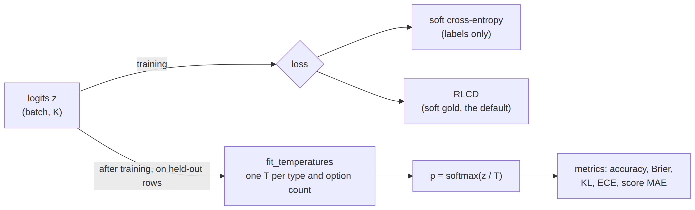
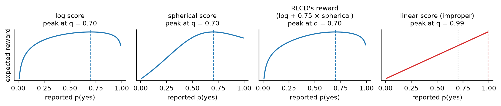
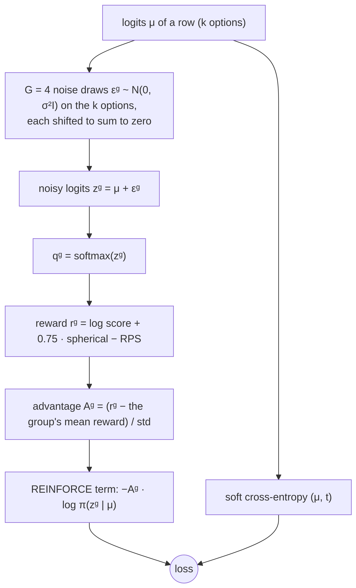
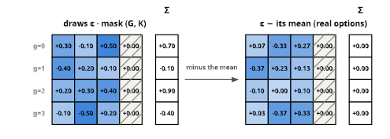
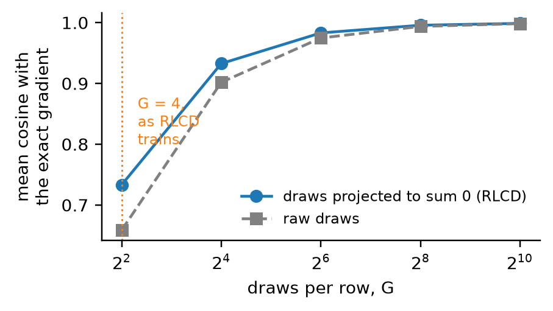
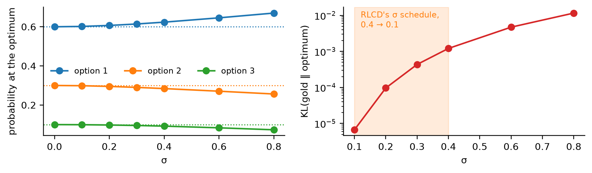
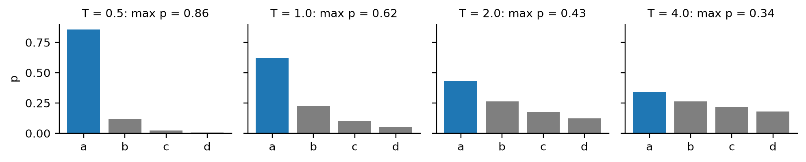
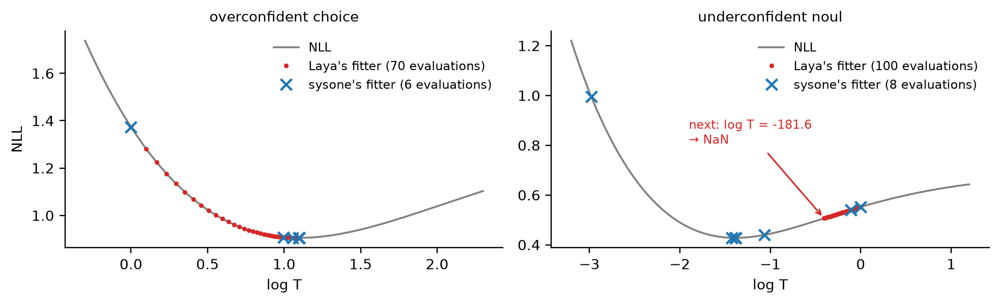
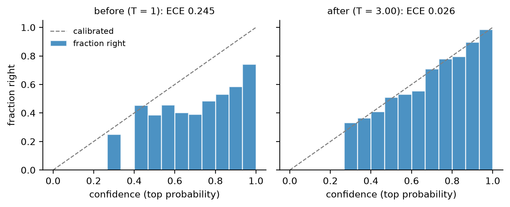
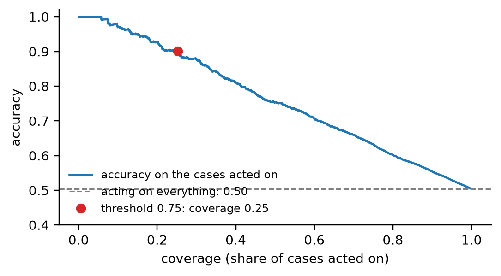

# losses


<!-- WARNING: THIS FILE WAS AUTOGENERATED! DO NOT EDIT! -->

A decision model is fitted twice. During training, a loss moves the
weights until the probabilities at the anchors put their mass where the
gold does. After training, one number per bucket of questions, a
temperature, is fitted on rows the model never saw, so that a
probability of 0.8 is right about 80% of the time. The metrics then
check both:

<div>

<figure class=''>

<div>



</div>

</figure>

</div>

A batch reaches the loss as logits (batch, K), the gold distributions
over each row’s options (batch, K, zero-padded), the marker mask saying
which of the K slots are real, and the question types. Any callable with
that signature works as a loss.

A toy batch: a four-option choice, a noul, and a four-level score whose
gold is spread over neighbouring levels. The noul has two options, so
its last two slots are padding, held at −10<sup>4</sup>:

``` python
logits = torch.tensor([[2.0, 0.5, -1.0, 0.0], [0.3, -0.3, -1e4, -1e4], [0.1, 1.2, 0.4, -0.5]])
target = torch.tensor([[0.8, 0.2, 0.0, 0.0], [0.4, 0.6, 0.0, 0.0], [0.1, 0.5, 0.3, 0.1]])
mask = torch.tensor([[1, 1, 1, 1], [1, 1, 0, 0], [1, 1, 1, 1]]).bool()
qtype = torch.tensor([QTYPES["choice"], QTYPES["noul"], QTYPES["score"]])
```

## Soft cross-entropy

The cross-entropy of each row’s option probabilities against its gold
distribution, the teacher’s probabilities or a one-hot label,

$$\mathcal{L}\_{\mathrm{CE}} = -\frac{1}{B}\sum\_{b=1}^{B}\sum\_{i=1}^{k_b} t\_{b,i}\\\log p\_{b,i}, \qquad p_b = \mathrm{softmax}(z_b).$$

It is the default when the data has labels only, and always the
evaluation loss, since it has no noise.

------------------------------------------------------------------------

<a
href="https://github.com/sgaseretto/sysonelib/blob/main/sysone/losses.py#L21"
target="_blank" style="float:right; font-size:smaller">source</a>

### soft_ce

``` python
def soft_ce(
    logits, target, mask, qtype:NoneType=None
):
```

*Mean cross-entropy of each row’s option logits against its gold
distribution*

``` python
manual = np.mean([-(target[i, :k] * torch.log_softmax(logits[i, :k], -1)).sum().item() for i, k in enumerate([4, 2, 4])])
test_close(soft_ce(logits, target, mask).item(), manual, eps=1e-5)
```

Its gradient with respect to a logit is the gap between the probability
the model gives that option and the gold’s,
∂ℒ/∂*z*<sub>*b*, *i*</sub> = (*p*<sub>*b*, *i*</sub> − *t*<sub>*b*, *i*</sub>)/*B*:
every option of a row moves at once, towards its gold probability, in
proportion to how wrong it is. A padded slot has probability 0 and
target 0 (the [masked softmax](03_models.ipynb#decisionhead) that makes
it so is drawn in the models notebook), so its gradient is exactly zero,
and padding needs no special case in the backward pass:

``` python
z = logits.clone().requires_grad_(True)
soft_ce(z, target, mask).backward()
p = torch.softmax(logits.masked_fill(~mask, -1e4), -1)
test_close(z.grad, (p - target) / len(z), eps=1e-6)
test_eq(z.grad[~mask].abs().max().item(), 0.0)
z.grad
```

    tensor([[-0.0300, -0.0139,  0.0118,  0.0320],
            [ 0.0819, -0.0819,  0.0000,  0.0000],
            [ 0.0231,  0.0030, -0.0238, -0.0023]])

## Proper scoring rules

A scoring rule pays a reported distribution *q* once the outcome *i* is
known: the log score pays log *q*<sub>*i*</sub>, the spherical score
*q*<sub>*i*</sub>/‖*q*‖. A rule is *strictly proper* when its expected
payment under the true distribution *t*,
∑<sub>*i*</sub>*t*<sub>*i*</sub> *S*(*q*, *i*), is highest at *q* = *t*
and nowhere else. A model paid by a proper rule earns most by reporting
what it believes, so it is paid for calibration and not only for the
argmax.

RLCD’s reward is the log score plus a weight of the spherical score,
minus, for ordered score questions, the *ranked probability score*,
$\frac{1}{k-1}\sum_j (Q_j - T_j)^2$ over the cumulative distributions
*Q* and *T*, which charges for probability placed far from the gold
level. The function is Laya’s
[`proper_reward`](https://sgaseretto.github.io/sysonelib/losses.html#proper_reward),
vendored (Apache-2.0, Convai Innovations) so the core installs without
Laya.

------------------------------------------------------------------------

<a
href="https://github.com/sgaseretto/sysonelib/blob/main/sysone/losses.py#L27"
target="_blank" style="float:right; font-size:smaller">source</a>

### proper_reward

``` python
def proper_reward(
    q, target, qtype, mask, w_sph:float=0.5, w_rps:float=1.0, log_floor:float=-9.21
):
```

*Log score + w_sph × spherical score − w_rps × ranked probability score
(score questions only); from Laya*

<details open class="code-fold">
<summary>Exported source</summary>

``` python
def proper_reward(q, target, qtype, mask, w_sph:float=0.5, w_rps:float=1.0, log_floor:float=-9.21):
    "Log score + w_sph × spherical score − w_rps × ranked probability score (score questions only); from Laya"
    q = q * mask
    logq = torch.log(q.clamp_min(1e-12)).clamp_min(log_floor)
    log_score = (target * logq).sum(-1)
    sph = (target * q).sum(-1) / q.norm(dim=-1).clamp_min(1e-9)
    r = log_score + w_sph * sph
    is_score = (qtype == QTYPES["score"]).float()
    if is_score.any():
        k = mask.sum(-1).clamp(min=2).float()
        cdf_q, cdf_t = torch.cumsum(q, -1), torch.cumsum(target, -1)
        rps = (((cdf_q - cdf_t) ** 2) * mask).sum(-1) / (k - 1)
        r = r - w_rps * rps * is_score
    return r
```

</details>

On a yes/no question whose true probability is 0.7, the expected reward
of each part of RLCD’s reward, computed with
[`proper_reward`](https://sgaseretto.github.io/sysonelib/losses.html#proper_reward)
itself, peaks at a report of 0.7. The linear score
∑<sub>*i*</sub>*t*<sub>*i*</sub>*q*<sub>*i*</sub> looks just as
reasonable and is not proper: it peaks at 1, paying the model to be
overconfident.

<details class="code-fold">
<summary>figure code</summary>

``` python
qg = torch.linspace(0.01, 0.99, 197)
Q2, T2 = torch.stack([1 - qg, qg], -1), torch.tensor([[0.3, 0.7]])
m2, ch1 = torch.ones(1, 2).bool(), torch.tensor([QTYPES["choice"]])
logs = proper_reward(Q2, T2, ch1, m2, w_sph=0.0)
curves = {"log score": logs, "spherical score": proper_reward(Q2, T2, ch1, m2, w_sph=1.0) - logs,
          "RLCD's reward\n(log + 0.75 × spherical)": proper_reward(Q2, T2, ch1, m2, w_sph=0.75),
          "linear score (improper)": (Q2 * T2).sum(-1)}
fig, axs = plt.subplots(1, 4, figsize=(10, 2.2), sharex=True)
for ax, (name, c) in zip(axs, curves.items()):
    best = qg[c.argmax()].item()
    ax.plot(qg, c, color="C3" if "improper" in name else "C0")
    ax.axvline(0.7, color="gray", ls=":", lw=1); ax.axvline(best, color="C3" if "improper" in name else "C0", ls="--", lw=1)
    ax.set_title(f"{name}\npeak at q = {best:.2f}"); ax.set_yticks([]); ax.set_xlabel("reported p(yes)")
axs[0].set_ylabel("expected reward"); plt.tight_layout(); plt.show()
```

</details>



On a score question the order of the levels matters too. With the gold
on level 1 of 4 and all the reported mass on one level, the log score
cannot tell a near miss from a far one (both give the gold level zero
probability and hit the floor, log 10<sup>−4</sup> ≈ −9.21); the ranked
probability score charges a near miss a third and a miss by two levels
two thirds:

``` python
gold1, m4, sc = torch.tensor([[0.0, 1.0, 0.0, 0.0]]), torch.ones(1, 4).bool(), torch.tensor([QTYPES["score"]])
rep = torch.eye(4)                                  # all the mass on level 0, 1, 2 or 3
as_choice = proper_reward(rep, gold1, torch.tensor([QTYPES["choice"]]), m4)
as_score = proper_reward(rep, gold1, sc, m4)
pd.DataFrame({"log score": proper_reward(rep, gold1, sc, m4, w_sph=0.0, w_rps=0.0).numpy(),
              "RPS charged": (as_choice - as_score).numpy(), "reward on a score question": as_score.numpy()},
             index=[f"all on level {j}" for j in range(4)]).round(3)
```

<div>
<style scoped>
    .dataframe tbody tr th:only-of-type {
        vertical-align: middle;
    }
&#10;    .dataframe tbody tr th {
        vertical-align: top;
    }
&#10;    .dataframe thead th {
        text-align: right;
    }
</style>

<table class="dataframe" data-quarto-postprocess="true" data-border="1">
<thead>
<tr style="text-align: right;">
<th data-quarto-table-cell-role="th"></th>
<th data-quarto-table-cell-role="th">log score</th>
<th data-quarto-table-cell-role="th">RPS charged</th>
<th data-quarto-table-cell-role="th">reward on a score question</th>
</tr>
</thead>
<tbody>
<tr>
<td data-quarto-table-cell-role="th">all on level 0</td>
<td>-9.21</td>
<td>0.333</td>
<td>-9.543</td>
</tr>
<tr>
<td data-quarto-table-cell-role="th">all on level 1</td>
<td>0.00</td>
<td>0.000</td>
<td>0.500</td>
</tr>
<tr>
<td data-quarto-table-cell-role="th">all on level 2</td>
<td>-9.21</td>
<td>0.333</td>
<td>-9.543</td>
</tr>
<tr>
<td data-quarto-table-cell-role="th">all on level 3</td>
<td>-9.21</td>
<td>0.667</td>
<td>-9.877</td>
</tr>
</tbody>
</table>

</div>

Reporting the gold distribution itself beats reporting its argmax, and a
near miss costs less than a far one:

``` python
t = torch.tensor([[0.1, 0.5, 0.3, 0.1]]); m = torch.ones(1, 4).bool()
honest = proper_reward(t, t, sc, m)
argmax = proper_reward(torch.tensor([[0.0, 1.0, 0.0, 0.0]]), t, sc, m)
near = proper_reward(torch.tensor([[0.0, 0.0, 1.0, 0.0]]), t, sc, m)
far = proper_reward(torch.tensor([[1.0, 0.0, 0.0, 0.0]]), t, sc, m)
assert honest > argmax > near and near > far - 1e-6
honest.item(), argmax.item(), near.item(), far.item()
```

    (-0.8682824969291687,
     -4.414999961853027,
     -6.423666477203369,
     -8.565666198730469)

## RLCD

Laya’s training loss, from its fine-tuning notebook. Soft cross-entropy
pays the log score only. RLCD pays all of the reward above, spherical
score and RPS included, and pays it through reinforcement learning,
which needs no gradient of the reward, only its value. The logits *μ* of
a row are read as the mean of a Gaussian *policy* over logit vectors,
and one step of the loss is:

<div>

<figure class=''>

<div>



</div>

</figure>

</div>

1.  **Explore.** Draw *G* = 4 noisy copies of the logits,
    *z*<sup>*g*</sup> = *μ* + *ε*<sup>*g*</sup>, with Gaussian noise on
    the row’s real options only, and subtract from each draw its mean
    over the options.
2.  **Score.** Softmax each copy and reward it with the proper scoring
    rules against the gold.
3.  **Compare.** A copy’s *advantage* is its reward minus its group’s
    mean reward (the GRPO baseline), divided by the standard deviation
    of all the advantages in the batch.
4.  **Reinforce.** A Gaussian policy has
    log *π*(*z* ∣ *μ*) = −‖*z* − *μ*‖<sup>2</sup>/2*σ*<sup>2</sup> up to
    a constant, so the term
    −*A*<sup>*g*</sup>log *π*(*z*<sup>*g*</sup> ∣ *μ*) has gradient
    −*A*<sup>*g*</sup> *ε*<sup>*g*</sup>/*σ*<sup>2</sup> with respect to
    *μ*. The logits move towards the copies that scored better than
    their group and away from those that scored worse. Averaged over
    draws this estimates the gradient of the noisy policy’s expected
    reward: the score-function (REINFORCE) estimator.
5.  **Guide.** Soft cross-entropy is added with weight 1, an exact,
    low-variance gradient towards the gold beside the noisy one.

σ is annealed from 0.4 to 0.1 over training. RLCD is the default loss
when the gold is a distribution, as typed-decisions’ is.

Step 1 on one row with three real options in a batch padded to four: the
mask zeroes the noise on the padded slot, and subtracting each draw’s
mean over the real options leaves draws that sum to zero, the only part
of the noise a softmax can see:

<figure>

<figcaption aria-hidden="true">Four noise draws before and after the
projection, with their sums</figcaption>
</figure>

*Drawn with RLCD’s two lines of projection in
[figures](90_figures.ipynb#rlcds-noise-draws).*

------------------------------------------------------------------------

<a
href="https://github.com/sgaseretto/sysonelib/blob/main/sysone/losses.py#L43"
target="_blank" style="float:right; font-size:smaller">source</a>

### rlcd_loss

``` python
def rlcd_loss(
    logits, target, mask, qtype, sigma:float=0.4, group_size:int=4, w_sph:float=0.75, w_rps:float=1.0,
    ce_weight:float=1.0, generator:NoneType=None
):
```

*REINFORCE on proper scoring rewards over `group_size` noisy copies of
the logits, plus soft cross-entropy*

<details open class="code-fold">
<summary>Exported source</summary>

``` python
def rlcd_loss(logits, target, mask, qtype, sigma:float=0.4, group_size:int=4, w_sph:float=0.75, w_rps:float=1.0,
              ce_weight:float=1.0, generator=None):
    "REINFORCE on proper scoring rewards over `group_size` noisy copies of the logits, plus soft cross-entropy"
    logits, mask = logits.float(), mask.bool()
    k = mask.sum(-1, keepdim=True).float()
    eps = torch.randn((group_size,) + logits.shape, device=logits.device, generator=generator) * sigma * mask
    eps = (eps - eps.sum(-1, keepdim=True) / k) * mask
    z = logits.detach().unsqueeze(0) + eps
    q = torch.softmax(z.masked_fill(~mask, -1e4), -1)
    with torch.no_grad():
        r = proper_reward(q, target.unsqueeze(0), qtype, mask, w_sph=w_sph, w_rps=w_rps)
        adv = r - r.mean(0, keepdim=True)
        adv = adv / (adv.std() + 1e-6)
    logp = -(((z - logits.unsqueeze(0)) ** 2) * mask).sum(-1) / (2 * sigma ** 2)
    loss_rl = -(adv * logp).mean()
    loss_ce = -(target * torch.log_softmax(logits.masked_fill(~mask, -1e4), -1)).sum(-1).mean()
    return loss_rl + ce_weight * loss_ce
```

</details>

The same seed gives the notebook’s number exactly; here is the
notebook’s code, pasted, next to it:

``` python
def notebook_loss(logits, mask, target, qtype, GROUP_SIZE=4, sigma=0.4, GRAD_ACCUM=1):
    # pasted from laya_finetune_typed_decisions_2xT4_kaggle.ipynb, train_ddp.py, steps 1-3
    from laya.common import proper_reward
    device = logits.device
    k = mask.sum(-1, keepdim=True).float()
    eps = torch.randn((GROUP_SIZE,) + logits.shape, device=device) * sigma * mask
    eps = (eps - eps.sum(-1, keepdim=True) / k) * mask
    z = logits.detach().unsqueeze(0) + eps
    q = torch.softmax(z.masked_fill(~mask, -1e4), -1)
    with torch.no_grad():
        r = proper_reward(q, target.unsqueeze(0), qtype, mask, w_sph=0.75, w_rps=1.0)
        adv = r - r.mean(0, keepdim=True)
        adv = adv / (adv.std() + 1e-6)
    logp = -(((z - logits.unsqueeze(0)) ** 2) * mask).sum(-1) / (2 * sigma ** 2)
    loss_rl = -(adv * logp).mean()
    loss_ce = -(target * torch.log_softmax(logits.masked_fill(~mask, -1e4), -1)).sum(-1).mean()
    return (loss_rl + 1.0 * loss_ce) / GRAD_ACCUM
```

``` python
torch.manual_seed(0); ours = rlcd_loss(logits, target, mask, qtype, sigma=0.4)
torch.manual_seed(0); theirs = notebook_loss(logits, mask, target, qtype)
test_eq(ours.item(), theirs.item())
ours.item()
```

    -0.040978074073791504

### What the pieces do

Three experiments on free logits, where nothing but the loss is in play,
show what each piece contributes.

**The projection removes noise that changes nothing.** Softmax ignores a
shift of all the logits by the same amount,
softmax(*z* + *c***1**) = softmax(*z*), so the part of a noise draw
along **1** changes no reward and only adds noise to the gradient
estimate; subtracting each draw’s mean removes it. Below, RLCD’s
estimate from G draws is compared with the exact gradient of the noisy
policy’s expected reward, computed by differentiating through 200,000
draws (the reparameterisation trick), for a four-level score question:

``` python
mu = torch.tensor([[0.5, -0.2, 0.1, -0.4]]); t4 = torch.tensor([[0.1, 0.5, 0.3, 0.1]])
reward = lambda z: proper_reward(torch.softmax(z, -1), t4, sc, m4, w_sph=0.75)

def draws(n, sigma, project, gen):
    eps = torch.randn(n, 1, 4, generator=gen) * sigma
    return eps - eps.mean(-1, keepdim=True) if project else eps

def exact_grad(sigma=0.4, n=200_000):
    "∇μ E[r(softmax(μ + ε))], differentiating through the draws"
    m_ = mu.clone().requires_grad_(True)
    reward(m_ + draws(n, sigma, True, torch.Generator().manual_seed(1))).mean().backward()
    return m_.grad[0]

def reinforce_grad(G, gen, sigma=0.4, project=True):
    "RLCD's estimate of the same gradient from G draws: the mean of Aᵍ εᵍ / σ²"
    eps = draws(G, sigma, project, gen)
    r = reward(mu + eps); adv = r - r.mean(0, keepdim=True)
    return (adv[..., None] * eps / sigma ** 2).mean(0)[0]

g_exact, gen = exact_grad(), torch.Generator().manual_seed(0)
Gs = [4, 16, 64, 256, 1024]
cos = {p: [np.mean([F.cosine_similarity(reinforce_grad(G, gen, project=p), g_exact, 0).item() for _ in range(300)]) for G in Gs]
       for p in (True, False)}
along_ones = {p: np.std([reinforce_grad(4, gen, project=p).sum().item() for _ in range(300)]) for p in (True, False)}
assert all(a > b for a, b in zip(cos[True][:3], cos[False][:3])) and along_ones[True] < 1e-5
pd.DataFrame({"projected": cos[True], "raw draws": cos[False]}, index=[f"G = {G}" for G in Gs]).round(3), along_ones
```

    (          projected  raw draws
     G = 4         0.733      0.659
     G = 16        0.933      0.902
     G = 64        0.983      0.975
     G = 256       0.996      0.994
     G = 1024      0.999      0.998,
     {True: np.float64(4.5389115940765663e-08),
      False: np.float64(0.5524720921532368)})

<details class="code-fold">
<summary>figure code</summary>

``` python
fig, ax = plt.subplots(figsize=(4.2, 2.4))
ax.plot(Gs, cos[True], "o-", label="draws projected to sum 0 (RLCD)"); ax.plot(Gs, cos[False], "s--", color="gray", label="raw draws")
ax.axvline(4, color="C1", ls=":", lw=1); ax.text(5, 0.8, "G = 4,\nas RLCD\ntrains", color="C1", fontsize=8)
ax.set_xscale("log", base=2); ax.set_xlabel("draws per row, G"); ax.set_ylabel("mean cosine with\nthe exact gradient")
ax.legend(loc="lower right"); plt.tight_layout(); plt.show()
```

</details>



With four draws, as RLCD trains, one estimate points the right way on
average (a mean cosine of about 0.7) and is far from exact; the
cross-entropy term is what keeps a step reliable. The projection helps
at every group size, and leaves nothing at all along **1** (the standard
deviation of that component, printed above, is 0 against about 0.5 for
raw draws).

**σ moves the optimum, which is why it is annealed.** The average of the
softmaxes of noisy logits is flatter than the softmax of their mean, so
the logits that maximise the noisy policy’s expected reward are
*sharper* than the gold: the policy over-sharpens to make up for its own
noise. The optimum, found by LBFGS over a fixed set of draws, for a
three-option question with gold (0.6, 0.3, 0.1):

``` python
t3, m3, ch = torch.tensor([[0.6, 0.3, 0.1]]), torch.ones(1, 3).bool(), torch.tensor([QTYPES["choice"]])
base = torch.randn(20_000, 1, 3, generator=torch.Generator().manual_seed(0)); base = base - base.mean(-1, keepdim=True)

def noisy_optimum(sigma):
    "softmax of the logits that maximise the expected reward of N(μ, σ²) noisy copies"
    mu_ = torch.log(t3).clone().requires_grad_(True)
    opt = torch.optim.LBFGS([mu_], max_iter=200, line_search_fn="strong_wolfe")
    def closure():
        opt.zero_grad(); loss = -proper_reward(torch.softmax(mu_ + sigma * base, -1), t3, ch, m3, w_sph=0.75).mean()
        loss.backward(); return loss
    opt.step(closure)
    return torch.softmax(mu_.detach(), -1)[0]

sigmas = [0.0, 0.1, 0.2, 0.3, 0.4, 0.6, 0.8]
opt_p = torch.stack([noisy_optimum(s) for s in sigmas])
kl = (t3 * (t3 / opt_p).log()).sum(-1)
assert kl[1] < 1e-4 < kl[4] and (kl[1:].diff() > 0).all()
pd.DataFrame(opt_p.numpy(), columns=["p₁ (gold 0.6)", "p₂ (gold 0.3)", "p₃ (gold 0.1)"], index=[f"σ = {s}" for s in sigmas]).assign(**{"KL(gold ‖ p)": kl.numpy()}).round(4)
```

<div>
<style scoped>
    .dataframe tbody tr th:only-of-type {
        vertical-align: middle;
    }
&#10;    .dataframe tbody tr th {
        vertical-align: top;
    }
&#10;    .dataframe thead th {
        text-align: right;
    }
</style>

<table class="dataframe" data-quarto-postprocess="true" data-border="1">
<thead>
<tr style="text-align: right;">
<th data-quarto-table-cell-role="th"></th>
<th data-quarto-table-cell-role="th">p₁ (gold 0.6)</th>
<th data-quarto-table-cell-role="th">p₂ (gold 0.3)</th>
<th data-quarto-table-cell-role="th">p₃ (gold 0.1)</th>
<th data-quarto-table-cell-role="th">KL(gold ‖ p)</th>
</tr>
</thead>
<tbody>
<tr>
<td data-quarto-table-cell-role="th">σ = 0.0</td>
<td>0.6000</td>
<td>0.3000</td>
<td>0.1000</td>
<td>0.0000</td>
</tr>
<tr>
<td data-quarto-table-cell-role="th">σ = 0.1</td>
<td>0.6018</td>
<td>0.2988</td>
<td>0.0995</td>
<td>0.0000</td>
</tr>
<tr>
<td data-quarto-table-cell-role="th">σ = 0.2</td>
<td>0.6068</td>
<td>0.2953</td>
<td>0.0980</td>
<td>0.0001</td>
</tr>
<tr>
<td data-quarto-table-cell-role="th">σ = 0.3</td>
<td>0.6143</td>
<td>0.2902</td>
<td>0.0955</td>
<td>0.0004</td>
</tr>
<tr>
<td data-quarto-table-cell-role="th">σ = 0.4</td>
<td>0.6236</td>
<td>0.2841</td>
<td>0.0922</td>
<td>0.0012</td>
</tr>
<tr>
<td data-quarto-table-cell-role="th">σ = 0.6</td>
<td>0.6457</td>
<td>0.2707</td>
<td>0.0836</td>
<td>0.0047</td>
</tr>
<tr>
<td data-quarto-table-cell-role="th">σ = 0.8</td>
<td>0.6701</td>
<td>0.2564</td>
<td>0.0735</td>
<td>0.0116</td>
</tr>
</tbody>
</table>

</div>

<details class="code-fold">
<summary>figure code</summary>

``` python
fig, (a1, a2) = plt.subplots(1, 2, figsize=(8, 2.4))
for i, g in enumerate(t3[0]):
    a1.plot(sigmas, opt_p[:, i], "o-", color=f"C{i}", label=f"option {i + 1}"); a1.axhline(g, color=f"C{i}", ls=":", lw=1)
a1.set_xlabel("σ"); a1.set_ylabel("probability at the optimum"); a1.legend(ncol=3, loc="center left")
a2.semilogy(sigmas[1:], kl[1:], "o-", color="C3"); a2.axvspan(0.1, 0.4, color="C1", alpha=0.15)
a2.text(0.12, kl[1:].max() * 0.4, "RLCD's σ schedule,\n0.4 → 0.1", color="C1", fontsize=8)
a2.set_xlabel("σ"); a2.set_ylabel("KL(gold ‖ optimum)")
plt.tight_layout(); plt.show()
```

</details>



The bias grows with σ², invisible at σ = 0.1 and a KL of about 0.001 at
0.4. Annealing σ from 0.4 to 0.1 explores widely early, when the logits
are far from any optimum, and ends on an objective whose optimum is the
gold.

**It converges, and keeps moving.** A few hundred steps of RLCD on free
logits bring the reported distributions to the gold:

``` python
def train_free(loss_fn, steps=300, seed=0):
    torch.manual_seed(seed)
    z = torch.zeros(3, 4, requires_grad=True); opt = torch.optim.Adam([z], lr=0.05); hist = []
    for _ in range(steps):
        opt.zero_grad(); loss_fn(z).backward(); opt.step()
        hist.append(torch.softmax(z.detach().masked_fill(~mask, -1e4), -1))
    return torch.stack(hist)

h_rlcd = train_free(lambda z: rlcd_loss(z, target, mask, qtype, sigma=0.2))
h_ce = train_free(lambda z: soft_ce(z, target, mask))
test_close(h_rlcd[-1], target, eps=0.08)
{"RLCD": h_rlcd[-100:].std(0).max().item(), "soft CE": h_ce[-100:].std(0).max().item()}
```

    {'RLCD': 0.020456813275814056, 'soft CE': 0.0009159934124909341}

The numbers above are the largest standard deviation of any probability
over the last 100 steps. The advantages are normalised to unit spread,
so the REINFORCE term’s gradient keeps its size as the model improves,
where the cross-entropy’s shrinks to zero at the optimum: RLCD’s
iterates keep jittering around the answer, and its logged training loss
is noisier than a cross-entropy’s. The learning rate’s decay to zero
(cosine, or one-cycle) is what lets a run settle.

[`RLCD`](https://sgaseretto.github.io/sysonelib/losses.html#rlcd) wraps
the loss with its σ schedule; the learner’s
[`SigmaSchedule`](https://sgaseretto.github.io/sysonelib/learner.html#sigmaschedule)
callback sets the progress at every epoch, as the notebook anneals σ
once per epoch:

------------------------------------------------------------------------

<a
href="https://github.com/sgaseretto/sysonelib/blob/main/sysone/losses.py#L62"
target="_blank" style="float:right; font-size:smaller">source</a>

### RLCD

``` python
def RLCD(
    sigma:tuple=(0.4, 0.1), group_size:int=4, w_sph:float=0.75, w_rps:float=1.0, ce_weight:float=1.0
):
```

*Laya’s RLCD loss with σ annealed from `sigma[0]` to `sigma[1]` over
training*

``` python
loss = RLCD()
test_eq([(loss.set_epoch(e, 4), round(loss.sigma, 3))[1] for e in range(4)], [0.4, 0.3, 0.2, 0.1])
```

[`get_loss`](https://sgaseretto.github.io/sysonelib/losses.html#get_loss)
resolves a name or a callable, and picks the default from the data: RLCD
when some gold targets are distributions, soft cross-entropy when every
target is one-hot.

------------------------------------------------------------------------

<a
href="https://github.com/sgaseretto/sysonelib/blob/main/sysone/losses.py#L79"
target="_blank" style="float:right; font-size:smaller">source</a>

### get_loss

``` python
def get_loss(
    loss:NoneType=None, targets:NoneType=None
):
```

*The loss callable for a name (‘soft_ce’, ‘rlcd’), a callable, or the
data’s default*

------------------------------------------------------------------------

<a
href="https://github.com/sgaseretto/sysonelib/blob/main/sysone/losses.py#L75"
target="_blank" style="float:right; font-size:smaller">source</a>

### is_soft

``` python
def is_soft(
    targets
)->bool:
```

*Whether any target distribution is not one-hot (an unanswerable row’s
zero target does not count)*

``` python
test_eq(get_loss(targets=[[0, 1], [1, 0, 0]]), soft_ce)
assert isinstance(get_loss(targets=[[0.2, 0.8]]), RLCD)
test_fail(lambda: get_loss("hinge"), contains="unknown loss")
```

## Temperature scaling

### What a temperature does

After training, the logits of every row in a bucket are divided by one
number, *p* = softmax(*z*/*T*). *T* \> 1 flattens the distribution, for
a model that is too sure of itself; *T* \< 1 sharpens it, for one that
is not sure enough. Dividing all of a row’s logits by the same positive
number never changes their order, so the answer never changes, only how
confident it is: calibration moves Brier, KL and ECE and leaves accuracy
where it was (the head-only ModernBERT-large run in the text notebook:
0.504 before and after).

<details class="code-fold">
<summary>figure code</summary>

``` python
zt = torch.tensor([2.0, 1.0, 0.2, -0.5])
fig, axs = plt.subplots(1, 4, figsize=(9, 1.9), sharey=True)
for ax, T in zip(axs, (0.5, 1.0, 2.0, 4.0)):
    pt = torch.softmax(zt / T, -1)
    ax.bar(range(4), pt, color=["C0"] + ["C7"] * 3); ax.set_title(f"T = {T}: max p = {pt.max():.2f}")
    ax.set_xticks(range(4), ["a", "b", "c", "d"])
axs[0].set_ylabel("p"); plt.tight_layout(); plt.show()
```

</details>



### Fitting one

The temperature of a bucket is the one that minimises the negative
log-likelihood of the gold distributions over held-out rows,

$$\mathrm{NLL}(T) = -\frac{1}{N}\sum\_{n=1}^{N}\sum\_{i} t\_{n,i}\\\log\mathrm{softmax}(z_n / T)\_i,$$

Laya’s `fit_one_temp`. The rows must be held out: on rows the model
trained on it is near-certain and near-correct, so the fit would sharpen
it further whatever it does on new rows;
[`fit_temperatures`](https://sgaseretto.github.io/sysonelib/losses.html#fit_temperatures)
only ever sees the calibration slice. In *β* = 1/*T* the NLL is convex
(its second derivative is the variance of *z* under *p*), so it has a
single minimum; like Laya, sysone fits *u* = log *T*, which keeps *T*
positive but is not convex, as the finding below shows. Values are
clamped to \[0.5, 5\], the range Laya’s runtime applies, and `trace`, a
list, collects every evaluation of the fit.

------------------------------------------------------------------------

<a
href="https://github.com/sgaseretto/sysonelib/blob/main/sysone/losses.py#L88"
target="_blank" style="float:right; font-size:smaller">source</a>

### fit_temperature

``` python
def fit_temperature(
    logits, targets, masks, min_rows:int=10, trace:list | None=None
):
```

*The temperature minimising the gold-distribution NLL of `logits` (rows,
K), or None with fewer than `min_rows`*

<details open class="code-fold">
<summary>Exported source</summary>

``` python
def fit_temperature(logits, targets, masks, min_rows:int=10, trace:list|None=None):
    "The temperature minimising the gold-distribution NLL of `logits` (rows, K), or None with fewer than `min_rows`"
    if len(logits) < min_rows: return None
    M = torch.as_tensor(np.asarray(masks)).bool()
    Z = torch.as_tensor(np.asarray(logits), dtype=torch.float32).masked_fill(~M, -1e4)
    T = torch.as_tensor(np.asarray(targets), dtype=torch.float32)
    def nll(log_t):
        logp = torch.log_softmax(Z / log_t.exp(), -1)
        # padded slots are masked out rather than multiplied by a zero target: a step to a tiny T sends
        # their logits to -inf, and 0 × -inf would poison the loss with NaN
        return -torch.where(M, T * logp, torch.zeros_like(logp)).sum(-1).mean()
    log_t = torch.zeros(1, requires_grad=True)
    opt = torch.optim.LBFGS([log_t], lr=1.0, max_iter=100, line_search_fn="strong_wolfe")
    def closure():
        opt.zero_grad(); loss = nll(log_t); loss.backward()
        if trace is not None: trace.append((log_t.item(), loss.item()))
        return loss
    opt.step(closure)
    t = log_t.exp().item()
    if not math.isfinite(t):  # a grid over [0.05, 20] as the fallback, should the optimiser ever fail
        grid = torch.linspace(math.log(0.05), math.log(20), 200)
        with torch.no_grad(): t = grid[torch.stack([nll(g) for g in grid]).argmin()].exp().item()
    return clamp_temperature(t)
```

</details>

Two synthetic buckets to fit, with gold distributions known by
construction: an overconfident model whose logits are three times too
large, which wants *T* = 3, and an underconfident noul model whose
logits are four times too small, which wants *T* = 0.25 (the clamp
raises that to 0.5 when it is stored):

``` python
g = torch.Generator().manual_seed(0)
true_z = torch.randn(400, 4, generator=g) * 1.5
gold = torch.softmax(true_z, -1)
over = (3 * true_z, gold, torch.ones(400, 4).bool())
under = (0.25 * true_z[200:, :2], torch.softmax(true_z[200:, :2], -1), torch.ones(200, 2).bool())
T3 = fit_temperature(*over)
test_close(T3, 3.0, eps=0.05)
T3
```

    2.999999523162842

The convexity in *β*, checked with autograd on the underconfident
bucket: the first derivative of the NLL is the mean of
∑<sub>*i*</sub>(*p*<sub>*i*</sub> − *t*<sub>*i*</sub>)*z*<sub>*i*</sub>
and the second is the mean variance of *z* under *p*, which cannot be
negative. The optimiser works in log *T* all the same, and there the
curvature can vanish, which is what the finding below is about.

``` python
Zu, Tu, _ = under
beta = torch.tensor(1.0, requires_grad=True)
nll_beta = -(Tu * torch.log_softmax(Zu * beta, -1)).sum(-1).mean()
d1, = torch.autograd.grad(nll_beta, beta, create_graph=True)
d2, = torch.autograd.grad(d1, beta)
pu = torch.softmax(Zu, -1)
test_close(d1, ((pu - Tu) * Zu).sum(-1).mean(), eps=1e-5)
test_close(d2, ((pu * Zu ** 2).sum(-1) - (pu * Zu).sum(-1) ** 2).mean(), eps=1e-5)
d1.item(), d2.item()
```

    (-0.10632878541946411, 0.06328226625919342)

<div>

> **Finding: Laya’s fitter returns NaN on an underconfident model**
>
> Laya’s notebook fits the temperature with `LBFGS(lr=0.1)` and no line
> search. Run verbatim on the two buckets above, it gets the
> overconfident one right after 70 evaluations; on the underconfident
> one it creeps towards the answer for 37 evaluations, then jumps to
> *T* ≈ 10<sup>−79</sup> and returns NaN. sysone’s fitter adds a
> strong-Wolfe line search and two guards, and needs 6 to 8 evaluations
> for either bucket.

</div>

Laya’s function, pasted from the notebook, with one line added to record
its evaluations:

``` python
def laya_fit_one_temp(sel, trace=None):
    # pasted from laya_finetune_typed_decisions_2xT4_kaggle.ipynb (Apache-2.0, Convai Innovations); `trace` added
    if len(sel) < 10:
        return 1.0
    kmax = max(len(z) for z, _ in sel)
    Z = torch.full((len(sel), kmax), -1e4)
    T = torch.zeros((len(sel), kmax))
    for i, (z, t) in enumerate(sel):
        Z[i, :len(z)] = torch.tensor(z)
        T[i, :len(t)] = torch.tensor(t, dtype=torch.float32)
    log_t = torch.zeros(1, requires_grad=True)
    opt = torch.optim.LBFGS([log_t], lr=0.1, max_iter=100)
    def closure():
        opt.zero_grad()
        loss = -(T * torch.log_softmax(Z / log_t.exp(), -1)).sum(-1).mean()
        loss.backward()
        if trace is not None: trace.append((log_t.item(), loss.item(), log_t.grad.item()))   # added
        return loss
    opt.step(closure)
    return float(torch.clamp(log_t.exp(), 0.1, 10.0).item())

as_sel = lambda Z, T, M: [(z[m].tolist(), t[m].tolist()) for z, t, m in zip(Z, T, M)]
runs = {}
for name, bucket in {"overconfident choice (wants T = 3)": over, "underconfident noul (wants T = 0.25)": under}.items():
    tl, ts = [], []
    runs[name] = dict(laya_T=laya_fit_one_temp(as_sel(*bucket), tl), laya_evals=len(tl),
                      sysone_T=fit_temperature(*bucket, trace=ts), sysone_evals=len(ts), traces=(tl, ts))
table = pd.DataFrame(runs).T.drop(columns="traces"); table
```

<div>
<style scoped>
    .dataframe tbody tr th:only-of-type {
        vertical-align: middle;
    }
&#10;    .dataframe tbody tr th {
        vertical-align: top;
    }
&#10;    .dataframe thead th {
        text-align: right;
    }
</style>

<table class="dataframe" data-quarto-postprocess="true" data-border="1">
<thead>
<tr style="text-align: right;">
<th data-quarto-table-cell-role="th"></th>
<th data-quarto-table-cell-role="th">laya_T</th>
<th data-quarto-table-cell-role="th">laya_evals</th>
<th data-quarto-table-cell-role="th">sysone_T</th>
<th data-quarto-table-cell-role="th">sysone_evals</th>
</tr>
</thead>
<tbody>
<tr>
<td data-quarto-table-cell-role="th">overconfident choice (wants T =
3)</td>
<td>2.995789</td>
<td>70</td>
<td>3.0</td>
<td>6</td>
</tr>
<tr>
<td data-quarto-table-cell-role="th">underconfident noul (wants T =
0.25)</td>
<td>NaN</td>
<td>100</td>
<td>0.5</td>
<td>8</td>
</tr>
</tbody>
</table>

</div>

``` python
test_eq(math.isnan(runs["underconfident noul (wants T = 0.25)"]["laya_T"]), True)
test_eq(runs["underconfident noul (wants T = 0.25)"]["sysone_T"], 0.5)          # 0.25, clamped
assert all(r["sysone_evals"] <= 10 for r in runs.values())
```

Why it happens. Without a line search, torch’s LBFGS takes a fixed tenth
(`lr=0.1`) of the step its curvature model proposes, which is why it
creeps. It has no curvature to start from, so it estimates it from the
last move *s* and the change in slope *y* that move caused; in one
dimension its step is the secant step, −*g* *s*/*y*. The NLL in log *T*
has an inflection point: going down from *T* = 1 its slope first grows,
from 0.106 to 0.116, before falling to 0 at the minimum. Near the
inflection the slope stops changing, *y* → 0, and the secant step
explodes. The last evaluations of Laya’s run on the underconfident
bucket:

``` python
tl = runs["underconfident noul (wants T = 0.25)"]["traces"][0]
bad = next(i for i, (u, l, g_) in enumerate(tl) if not math.isfinite(l))
pd.DataFrame([dict(evaluation=i, log_T=u, T=math.exp(u) if math.isfinite(u) else float("nan"), nll=l, slope=g_) for i, (u, l, g_) in enumerate(tl)][bad - 4:bad + 2]).set_index("evaluation")
```

<div>
<style scoped>
    .dataframe tbody tr th:only-of-type {
        vertical-align: middle;
    }
&#10;    .dataframe tbody tr th {
        vertical-align: top;
    }
&#10;    .dataframe thead th {
        text-align: right;
    }
</style>

<table class="dataframe" data-quarto-postprocess="true" data-border="1">
<thead>
<tr style="text-align: right;">
<th data-quarto-table-cell-role="th"></th>
<th data-quarto-table-cell-role="th">log_T</th>
<th data-quarto-table-cell-role="th">T</th>
<th data-quarto-table-cell-role="th">nll</th>
<th data-quarto-table-cell-role="th">slope</th>
</tr>
<tr>
<th data-quarto-table-cell-role="th">evaluation</th>
<th data-quarto-table-cell-role="th"></th>
<th data-quarto-table-cell-role="th"></th>
<th data-quarto-table-cell-role="th"></th>
<th data-quarto-table-cell-role="th"></th>
</tr>
</thead>
<tbody>
<tr>
<td data-quarto-table-cell-role="th">33</td>
<td>-0.370238</td>
<td>6.905702e-01</td>
<td>0.510493</td>
<td>0.116144</td>
</tr>
<tr>
<td data-quarto-table-cell-role="th">34</td>
<td>-0.381852</td>
<td>6.825960e-01</td>
<td>0.509144</td>
<td>0.116186</td>
</tr>
<tr>
<td data-quarto-table-cell-role="th">35</td>
<td>-0.393471</td>
<td>6.747111e-01</td>
<td>0.507794</td>
<td>0.116206</td>
</tr>
<tr>
<td data-quarto-table-cell-role="th">36</td>
<td>-0.405091</td>
<td>6.669159e-01</td>
<td>0.506444</td>
<td>0.116205</td>
</tr>
<tr>
<td data-quarto-table-cell-role="th">37</td>
<td>-181.649902</td>
<td>1.289584e-79</td>
<td>NaN</td>
<td>NaN</td>
</tr>
<tr>
<td data-quarto-table-cell-role="th">38</td>
<td>NaN</td>
<td>NaN</td>
<td>NaN</td>
<td>NaN</td>
</tr>
</tbody>
</table>

</div>

``` python
(u0, _, g0), (u1, _, g1) = tl[bad - 2], tl[bad - 1]
{"move s": u1 - u0, "change in slope y": g1 - g0, "secant step −g·s/y": -g1 * (u1 - u0) / (g1 - g0), "jump taken": tl[bad][0] - u1}
```

    {'move s': -0.01162061095237732,
     'change in slope y': -7.450580596923828e-07,
     'secant step −g·s/y': -1812.447051409781,
     'jump taken': -181.2448110282421}

The slope changed by less than a millionth (−7 × 10<sup>−7</sup>) while
the point moved by 0.012, so the secant step is −1, 812 in log *T*; a
tenth of it is taken, and the jump lands at log *T* = −181.6,
*T* = 10<sup>−79</sup>, where *z*/*T* overflows float32 and the
log-softmax of ∞ − ∞ is NaN. Every evaluation after that is NaN, and so
is the returned temperature. The curve, with both fitters’ evaluations
on it:

<details class="code-fold">
<summary>figure code</summary>

``` python
fig, axs = plt.subplots(1, 2, figsize=(9, 2.8))
for ax, (name, bucket), (lo, hi) in zip(axs, {"overconfident choice": over, "underconfident noul": under}.items(), ((-0.3, 2.3), (-3.2, 1.2))):
    tl, ts = runs[next(k for k in runs if k.startswith(name))]["traces"]
    Zb, Tb, Mb = bucket
    us = torch.linspace(lo, hi, 400)
    ax.plot(us, [-(Tb * torch.log_softmax(Zb / math.exp(u), -1)).sum(-1).mean().item() for u in us], color="gray", lw=1.2, label="NLL")
    fin = [(u, l) for u, l, _ in tl if math.isfinite(l)]
    ax.plot(*zip(*fin), ".", color="C3", ms=4, label=f"Laya's fitter ({len(tl)} evaluations)")
    ax.plot(*zip(*ts), "x", color="C0", ms=7, mew=1.5, label=f"sysone's fitter ({len(ts)} evaluations)")
    if len(fin) < len(tl):
        ax.annotate(f"next: log T = {tl[len(fin)][0]:.1f}\n→ NaN", xy=fin[-1], xytext=(-1.9, fin[-1][1] + 0.3),
                    arrowprops=dict(arrowstyle="->", color="C3"), color="C3", fontsize=8)
    ax.set_title(name); ax.set_xlabel("log T"); ax.legend(loc="upper right")
axs[0].set_ylabel("NLL"); plt.tight_layout(); plt.show()
```

</details>



The fix is a line search. With `line_search_fn="strong_wolfe"` a step is
tried before it is taken, and kept only if it lowers the loss enough
(the Armijo condition) and leaves the slope flatter (the curvature
condition); a trial at *T* = 10<sup>−79</sup> fails the first and is cut
back. It also takes whole steps where they work, hence 6 to 8
evaluations instead of 70 to 100. Two guards stay for anything the line
search does not catch. Padded slots are masked with `torch.where` rather
than multiplied by their zero targets, because a trial at a tiny *T*
sends their logits to −∞, and 0 × (−∞) is NaN even though the slot
should contribute nothing:

``` python
z_pad, t_pad, m_pad = torch.tensor([[1.0, 0.5, -1e4]]), torch.tensor([[0.7, 0.3, 0.0]]), torch.tensor([[True, True, False]])
logp = torch.log_softmax(z_pad / 1e-36, -1)         # the padded slot: -1e4 / 1e-36 is -inf in float32
multiplied, masked = (t_pad * logp).sum(), torch.where(m_pad, t_pad * logp, torch.zeros_like(logp)).sum()
test_eq((math.isnan(multiplied), math.isfinite(masked)), (True, True))
logp, multiplied, masked
```

    (tensor([[ 0.0000e+00, -5.0000e+35,        -inf]]),
     tensor(nan),
     tensor(-1.5000e+35))

and, if the result is still not finite, a grid over *T* ∈ \[0.05, 20\]
picks the temperature.

### Buckets

[`fit_temperatures`](https://sgaseretto.github.io/sysonelib/losses.html#fit_temperatures)
fits one temperature per question type, then one per type and
option-count bucket (`choice:2`, `choice:3-5`, `choice:6-10`,
`choice:11+`) where the bucket has at least `min_rows` rows. Different
kinds of question need different corrections: the head-only
ModernBERT-large run of the text notebook fitted 0.97 for choices, 1.17
for scores and 1.53 for nouls.

------------------------------------------------------------------------

<a
href="https://github.com/sgaseretto/sysonelib/blob/main/sysone/losses.py#L113"
target="_blank" style="float:right; font-size:smaller">source</a>

### fit_temperatures

``` python
def fit_temperatures(
    logits, targets, masks, qtypes, min_rows:int=10
)->dict:
```

*Temperatures per question type (`choice`) and per type and option-count
bucket (`choice:3-5`); unanswerable rows sit out*

``` python
Z = torch.cat([2 * true_z[:200], torch.cat([0.25 * true_z[200:, :2], torch.full((200, 2), -1e4)], 1)])
Tg = torch.cat([gold[:200], torch.cat([torch.softmax(true_z[200:, :2], -1), torch.zeros(200, 2)], 1)])
M = torch.cat([torch.ones(200, 4), torch.cat([torch.ones(200, 2), torch.zeros(200, 2)], 1)]).bool()
Q = torch.tensor([QTYPES["choice"]] * 200 + [QTYPES["noul"]] * 200)
temps = fit_temperatures(Z, Tg, M, Q)
test_close(temps["choice:3-5"], 2.0, eps=0.05)
test_eq(temps["noul:2"], 0.5)    # logits 4× too small want T = 0.25; the clamp stops at 0.5
temps
```

    {'choice': 2.0, 'choice:3-5': 2.0, 'noul': 0.5, 'noul:2': 0.5}

## Metrics

The definitions are those of Laya’s evaluation cell, so a sysone run is
comparable with the published numbers. Per decision: accuracy (the
argmax against the gold label; for a noul, p(true) ≥ 0.5 against the
gold truth value), and for choice and noul questions soft accuracy
∑*p* *g*, Brier ∑(*p* − *g*)<sup>2</sup>, total variation and KL from
gold; for score questions the absolute error of the expected level and
whether it is within one level.

The *expected calibration error* sorts decisions into bins by their top
probability and compares, in each bin, the mean confidence with the
fraction that was right:
$\mathrm{ECE} = \sum_b \frac{n_b}{N}\\\lvert \mathrm{conf}\_b - \mathrm{acc}\_b\rvert$.
A calibrated model’s decisions at confidence 0.8 are right 80% of the
time and score 0.
[`ece_score`](https://sgaseretto.github.io/sysonelib/losses.html#ece_score)
is Laya’s, vendored.

------------------------------------------------------------------------

<a
href="https://github.com/sgaseretto/sysonelib/blob/main/sysone/losses.py#L132"
target="_blank" style="float:right; font-size:smaller">source</a>

### ece_score

``` python
def ece_score(
    conf, correct, bins:int=15
)->float:
```

*Expected calibration error across equal-width confidence bins; from
Laya*

<details open class="code-fold">
<summary>Exported source</summary>

``` python
def ece_score(conf, correct, bins:int=15) -> float:
    "Expected calibration error across equal-width confidence bins; from Laya"
    conf, correct = np.asarray(conf, dtype=float), np.asarray(correct, dtype=float)
    if len(conf) == 0: return float("nan")
    edges = np.linspace(0, 1, bins + 1)
    e = 0.0
    for i, (lo, hi) in enumerate(zip(edges[:-1], edges[1:])):
        sel = (conf >= lo if i == 0 else conf > lo) & (conf <= hi)
        if sel.any(): e += sel.mean() * abs(conf[sel].mean() - correct[sel].mean())
    return float(e)
```

</details>

``` python
rng = np.random.default_rng(0)
c = rng.uniform(0.3, 1, 20000)
test_close(ece_score(c, rng.uniform(size=c.shape) < c), 0.0, eps=0.01)   # calibrated: confidence = hit rate
test_close(ece_score(np.full(1000, 0.9), np.zeros(1000)), 0.9)
```

A reliability diagram draws the bins. For an overconfident model (logits
three times too large, outcomes drawn from the true probabilities), the
temperature fitted on one half of the rows closes the gap on the other
half, without changing a single answer:

``` python
g2 = torch.Generator().manual_seed(1)
zc = torch.randn(4000, 4, generator=g2) * 1.5
y = torch.multinomial(torch.softmax(zc, -1), 1, generator=g2)[:, 0]     # outcomes drawn from the true probabilities
model_z, fit_half, test_half = 3 * zc, slice(0, 2000), slice(2000, 4000)
T_fit = fit_temperature(model_z[fit_half], torch.softmax(zc[fit_half], -1), torch.ones(2000, 4).bool())
rel = {}
for name, T in (("before (T = 1)", 1.0), (f"after (T = {T_fit:.2f})", T_fit)):
    p_ = torch.softmax(model_z[test_half] / T, -1)
    rel[name] = (p_.max(-1).values.numpy(), (p_.argmax(-1) == y[test_half]).numpy())
eces = {k: round(ece_score(*v), 4) for k, v in rel.items()}
assert list(eces.values())[1] < list(eces.values())[0] / 3
test_eq(*[v[1].mean() for v in rel.values()])                          # same answers, same accuracy
eces
```

    {'before (T = 1)': 0.2449, 'after (T = 3.00)': 0.026}

<details class="code-fold">
<summary>figure code</summary>

``` python
fig, axs = plt.subplots(1, 2, figsize=(7, 2.9), sharey=True)
edges = np.linspace(0, 1, 16)
for ax, (name, (conf, ok)) in zip(axs, rel.items()):
    idx = np.clip(np.digitize(conf, edges[1:-1]), 0, 14)
    acc = np.array([ok[idx == b].mean() if (idx == b).any() else np.nan for b in range(15)])
    ax.bar(edges[:-1], acc, width=1 / 15, align="edge", color="C0", alpha=0.8, edgecolor="white", label="fraction right")
    ax.plot([0, 1], [0, 1], "--", color="gray", lw=1, label="calibrated")
    ax.set_title(f"{name}: ECE {eces[name]:.3f}"); ax.set_xlabel("confidence (top probability)")
axs[0].set_ylabel("fraction right"); axs[0].legend(loc="upper left"); plt.tight_layout(); plt.show()
```

</details>



The per-decision values and their summary:

------------------------------------------------------------------------

<a
href="https://github.com/sgaseretto/sysonelib/blob/main/sysone/losses.py#L167"
target="_blank" style="float:right; font-size:smaller">source</a>

### decision_metrics

``` python
def decision_metrics(
    logits, targets, masks, qtypes, labels, temperatures:dict | None=None, act:NoneType=None,
    answerable:NoneType=None
)->dict:
```

*Accuracy, soft accuracy, Brier, KL, TV, ECE, score MAE and within-one
over rows of logits; with `act` (p(act) per row), the act head’s*

``` python
mets = decision_metrics(logits, target, mask, qtype, [0, 1, 1])
test_eq((mets["accuracy_choice"], mets["accuracy_noul"], mets["accuracy_score"]), (1.0, 0.0, 1.0))
un = decision_metrics(torch.cat([logits, logits[:1]]), torch.cat([target, torch.zeros_like(target[:1])]), torch.cat([mask, mask[:1]]),
                      torch.cat([qtype, qtype[:1]]), [0, 1, 1, -1])
test_eq((un["n"], un["n_unanswerable"], un["accuracy"]), (3, 1, mets["accuracy"]))       # an unanswerable row sits out
mets
```

    {'accuracy': 0.6666666666666666,
     'soft_accuracy': 0.535318819554862,
     'brier': 0.07049416370793506,
     'kl': 0.13321175235327481,
     'tv': 0.1885558478352801,
     'ece': 0.47554012344538243,
     'score_mae': 0.1547819781773363,
     'within_one': 1.0,
     'n': 3,
     'accuracy_choice': 1.0,
     'accuracy_score': 1.0,
     'accuracy_noul': 0.0,
     'n_unanswerable': 0}

[`macro_f1`](https://sgaseretto.github.io/sysonelib/losses.html#macro_f1)
averages each class’s F1, per question, so a model that answers only the
frequent classes cannot hide behind accuracy:

------------------------------------------------------------------------

<a
href="https://github.com/sgaseretto/sysonelib/blob/main/sysone/losses.py#L182"
target="_blank" style="float:right; font-size:smaller">source</a>

### macro_f1

``` python
def macro_f1(
    gold, pred
)->float:
```

*The mean over the gold labels of each label’s F1*

``` python
test_eq(macro_f1(list("aabbc"), list("aabbc")), 1.0)
test_close(macro_f1(list("aaaab"), list("aaaaa")), (8 / 9 + 0) / 2, eps=1e-6)      # a: F1 8/9; b, never predicted: 0
```

## The act head

A model with an act head (see
[models](03_models.ipynb#acting-or-escalating)) says, beside its answer,
whether it should act on it. Its training signal is whether acting would
have been right: act (class 0) where the gold is among the options and
the top option is the gold, escalate (class 1) where it is not, either
because the model is wrong or because the record says none of the
options answers the question. Rows without gold teach it nothing. The
targets come from the option head’s current answers, so they change as
the option head learns: early on most answers are wrong and the act head
learns to escalate, and it learns to act as the answers get better.

The act probability then answers a selective-prediction question: acting
only above a threshold, how often does the model act (coverage), and how
often is it right when it does?
[`coverage_curve`](https://sgaseretto.github.io/sysonelib/losses.html#coverage_curve)
traces that trade-off from the most confident case down, and
[`pick_threshold`](https://sgaseretto.github.io/sysonelib/losses.html#pick_threshold)
fits the threshold on held-out rows, for a target accuracy on the cases
acted on, or a target coverage.

------------------------------------------------------------------------

<a
href="https://github.com/sgaseretto/sysonelib/blob/main/sysone/losses.py#L234"
target="_blank" style="float:right; font-size:smaller">source</a>

### act_metrics

``` python
def act_metrics(
    act, right, answerable:NoneType=None
)->dict:
```

*How well p(act) separates the rows to act on (answerable and answered
right) from the rest*

------------------------------------------------------------------------

<a
href="https://github.com/sgaseretto/sysonelib/blob/main/sysone/losses.py#L228"
target="_blank" style="float:right; font-size:smaller">source</a>

### selective_metrics

``` python
def selective_metrics(
    conf, correct, threshold
)->dict:
```

*Coverage, and accuracy on the cases acted on, when acting where
`conf >= threshold` (one threshold, or one per case)*

------------------------------------------------------------------------

<a
href="https://github.com/sgaseretto/sysonelib/blob/main/sysone/losses.py#L218"
target="_blank" style="float:right; font-size:smaller">source</a>

### pick_threshold

``` python
def pick_threshold(
    conf, correct, accuracy:float | None=None, coverage:float | None=None
)->float:
```

*The act threshold: the lowest keeping accuracy ≥ `accuracy` on the
cases acted on (inf if none does), or the one acting on a `coverage`
share*

------------------------------------------------------------------------

<a
href="https://github.com/sgaseretto/sysonelib/blob/main/sysone/losses.py#L212"
target="_blank" style="float:right; font-size:smaller">source</a>

### coverage_curve

``` python
def coverage_curve(
    conf, correct
)->dict:
```

*Coverage and accuracy when acting only on the cases at or above each
confidence, from the most confident down*

------------------------------------------------------------------------

<a
href="https://github.com/sgaseretto/sysonelib/blob/main/sysone/losses.py#L203"
target="_blank" style="float:right; font-size:smaller">source</a>

### auroc

``` python
def auroc(
    scores, labels
)->float:
```

*Area under the ROC curve of `scores` against binary `labels` (NaN when
one class is missing)*

------------------------------------------------------------------------

<a
href="https://github.com/sgaseretto/sysonelib/blob/main/sysone/losses.py#L198"
target="_blank" style="float:right; font-size:smaller">source</a>

### act_loss

``` python
def act_loss(
    act_logits, logits, label, answerable
):
```

*The act head’s cross-entropy against
[`act_targets`](https://sgaseretto.github.io/sysonelib/losses.html#act_targets)*

------------------------------------------------------------------------

<a
href="https://github.com/sgaseretto/sysonelib/blob/main/sysone/losses.py#L192"
target="_blank" style="float:right; font-size:smaller">source</a>

### act_targets

``` python
def act_targets(
    logits, label, answerable
):
```

*The act head’s targets: 0 (act) where the gold is among the options and
the top option is it, 1 (escalate) where not, -100 without gold*

``` python
zz = torch.tensor([[2.0, 0.1, 0.0], [0.1, 2.0, 0.0], [1.0, 0.0, 0.0], [0.0, 1.0, 0.0]])
lab, ans = torch.tensor([0, 0, -1, 1]), torch.tensor([1, 1, 0, -1])
test_eq(act_targets(zz, lab, ans).tolist(), [0, 1, 1, -100])          # right, wrong, unanswerable, no gold
test_eq(act_loss(torch.zeros(4, 2, requires_grad=True), zz, lab, ans).item() > 0, True)
rng = np.random.default_rng(0)
conf_ = rng.uniform(size=2000); right_ = rng.uniform(size=2000) < conf_       # confidence tracks correctness
tau = pick_threshold(conf_, right_, accuracy=0.9)
sm = selective_metrics(conf_, right_, tau)
test_eq(sm["acted_accuracy"] >= 0.9 and 0 < sm["coverage"] < 0.5, True)
test_close(pick_threshold(conf_, right_, coverage=0.25), np.quantile(conf_, 0.75), eps=0.01)
test_close(auroc(conf_, right_), 0.83, eps=0.02)
{"threshold": round(tau, 3)} | {k: round(v, 3) for k, v in sm.items()}
```

    {'threshold': 0.754, 'coverage': 0.253, 'acted_accuracy': 0.901}

<details class="code-fold">
<summary>figure code</summary>

``` python
cv = coverage_curve(conf_, right_)
fig, ax = plt.subplots(figsize=(5, 2.8))
ax.plot(cv["coverage"], cv["accuracy"], color="C0", lw=1.5, label="accuracy on the cases acted on")
ax.axhline(right_.mean(), color="gray", ls="--", lw=1, label=f"acting on everything: {right_.mean():.2f}")
ax.plot([sm["coverage"]], [sm["acted_accuracy"]], "o", color="C3", label=f"threshold {tau:.2f}: coverage {sm['coverage']:.2f}")
ax.set(xlabel="coverage (share of cases acted on)", ylabel="accuracy", ylim=(0.4, 1.02)); ax.legend(fontsize=8, frameon=False, loc="lower left")
plt.tight_layout(); plt.show()
```

</details>



One threshold for every question is a blunt rule when question kinds
differ. A kind whose act scores run lower than the others’, say a short
list that often lacks the right answer, falls below a threshold set by
the confident kinds and is never acted on, however good its answers are.
[`fit_thresholds`](https://sgaseretto.github.io/sysonelib/losses.html#fit_thresholds)
fits a threshold per question type and per option-count bucket, as the
temperatures are fitted, wherever a group has `min_rows` rows, plus one
over all rows (`all`) for the rest. Each group then meets the target on
its own. Here, a noul whose scores run high and a choice whose scores
run low: the single threshold never acts on the choice, and the
per-bucket ones act on both at the target accuracy:

------------------------------------------------------------------------

<a
href="https://github.com/sgaseretto/sysonelib/blob/main/sysone/losses.py#L251"
target="_blank" style="float:right; font-size:smaller">source</a>

### row_thresholds

``` python
def row_thresholds(
    thresholds, qtypes, ks
)->numpy.ndarray:
```

*Each row’s act threshold
([`lookup_threshold`](https://sgaseretto.github.io/sysonelib/core.html#lookup_threshold)),
for
[`selective_metrics`](https://sgaseretto.github.io/sysonelib/losses.html#selective_metrics)*

------------------------------------------------------------------------

<a
href="https://github.com/sgaseretto/sysonelib/blob/main/sysone/losses.py#L241"
target="_blank" style="float:right; font-size:smaller">source</a>

### fit_thresholds

``` python
def fit_thresholds(
    scores, right, qtypes, ks, accuracy:float=0.9, min_rows:int=10
)->dict:
```

*Act thresholds for accuracy ≥ `accuracy` on the cases acted on: over
all rows (`all`), and per question type and option-count bucket with ≥
`min_rows` rows*

``` python
rng = np.random.default_rng(1)
s_noul, s_choice = rng.uniform(0.6, 1.0, 400), rng.uniform(0.2, 0.6, 400)                  # the choice's scores run lower
r_noul, r_choice = rng.uniform(size=400) < (s_noul - 0.1), rng.uniform(size=400) < (s_choice + 0.35)
sc, rt = np.r_[s_noul, s_choice], np.r_[r_noul, r_choice]
qt, kk = np.r_[np.full(400, 2), np.zeros(400, int)], np.r_[np.full(400, 2), np.full(400, 4)]
ths = fit_thresholds(sc, rt, qt, kk, accuracy=0.85)
test_eq(set(ths), {"all", "noul", "noul:2", "choice", "choice:3-5"})
one, per = selective_metrics(sc, rt, ths["all"]), selective_metrics(sc, rt, row_thresholds(ths, qt, kk))
on_choice = lambda t: float((s_choice >= t).mean())
test_eq((on_choice(ths["all"]) < 0.05, on_choice(ths["choice:3-5"]) > 0.1, per["coverage"] > one["coverage"]), (True, True, True))
{"one threshold": {k: round(v, 3) for k, v in one.items()} | {"acts on the choice": round(on_choice(ths["all"]), 3)},
 "per bucket": {k: round(v, 3) for k, v in per.items()} | {"acts on the choice": round(on_choice(ths["choice:3-5"]), 3)}}
```

    {'one threshold': {'coverage': 0.001,
      'acted_accuracy': 1.0,
      'acts on the choice': 0.0},
     'per bucket': {'coverage': 0.33,
      'acted_accuracy': 0.852,
      'acts on the choice': 0.657}}

[`answer_metrics`](https://sgaseretto.github.io/sysonelib/losses.html#answer_metrics)
computes the same values from answers in the Jev schema, the way the
notebook scores `laya.Agent.predict` on the test split, so any backend
that returns the schema, a sysone
[`Decider`](https://sgaseretto.github.io/sysonelib/inference.html#decider),
a Laya agent, a GLiNER2 decider or a remote Jev endpoint, can be scored
the same way. It reads each answer back with
[`answer_probs`](https://sgaseretto.github.io/sysonelib/core.html#answer_probs)
and
[`answer_index`](https://sgaseretto.github.io/sysonelib/core.html#answer_index),
the core’s [generic functions](00_core.ipynb#the-answer-schema) on the
question’s kind:

------------------------------------------------------------------------

<a
href="https://github.com/sgaseretto/sysonelib/blob/main/sysone/losses.py#L256"
target="_blank" style="float:right; font-size:smaller">source</a>

### answer_metrics

``` python
def answer_metrics(
    cases
)->dict:
```

*Notebook metrics over `(questions, answers, gold)` triples, one per
case, with macro-F1 per question and, for answers with `action`, the act
head’s*

``` python
qs = {"a": {"type": "choice", "instructions": "x", "criteria": ["u", "v"]}, "b": {"type": "noul", "instructions": "y"},
      "c": {"type": "score", "instructions": "z", "criteria": ["0", "1", "2"]}}
ans = {"a": fill_answer(Question.from_dict(qs["a"]), [0.7, 0.3]), "b": fill_answer(Question.from_dict(qs["b"]), [0.4, 0.6]),
       "c": fill_answer(Question.from_dict(qs["c"]), [0.1, 0.2, 0.7])}
gold = {"a": {"label": "u"}, "b": {"noul": 0.3}, "c": {"label": "2", "probabilities": {"0": 0, "1": 0.2, "2": 0.8}}}
am = answer_metrics([(qs, ans, gold)])
test_eq((am["accuracy"], am["n"], am["macro_f1"]), (2 / 3, 3, 2 / 3))
test_close(am["score_mae"], abs(1.6 - 1.8))
am
```

    {'accuracy': 0.6666666666666666,
     'soft_accuracy': 0.58,
     'brier': 0.18,
     'kl': 0.27023092066277227,
     'tv': 0.3,
     'ece': 0.4,
     'score_mae': 0.20000000000000018,
     'within_one': 1.0,
     'n': 3,
     'accuracy_choice': 1.0,
     'accuracy_score': 1.0,
     'accuracy_noul': 0.0,
     'macro_f1': 0.6666666666666666}

``` python
iq = {"n": {"type": "choice", "instructions": "Pick a number", "criteria": [1, 2, 3]}}
oracle = [(iq, {"n": fill_answer(Question.from_dict(iq["n"]), np.eye(3)[g])}, {"n": {"label": g + 1}}) for g in (0, 1, 2)]
test_eq(answer_metrics(oracle)["accuracy"], 1.0)                                                # integer labels, in memory
test_eq(answer_metrics(json.loads(json.dumps(oracle)))["accuracy"], 1.0)                        # and over JSON
qa = Question.from_dict(qs["a"])
acting = [(qs, {"a": fill_answer(qa, [0.9, 0.1], act=0.9, act_threshold=0.5)}, {"a": {"label": "u"}}),        # acts, right
          (qs, {"a": fill_answer(qa, [0.2, 0.8], act=0.3, act_threshold=0.5)}, {"a": {"label": "u"}}),        # escalates, would be wrong
          (qs, {"a": fill_answer(qa, [0.6, 0.4], act=0.2, act_threshold=0.5)}, {"a": {"answerable": False}})] # escalates, none is right
amx = answer_metrics(acting)
test_eq((amx["n"], amx["coverage"], amx["acted_accuracy"], amx["unanswerable_acted"], amx["act_auroc"]), (2, 1 / 3, 1.0, 0.0, 1.0))
```
