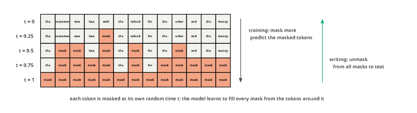
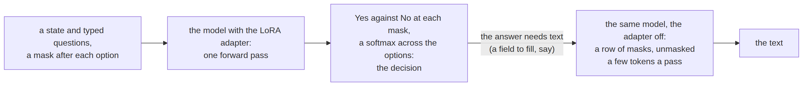
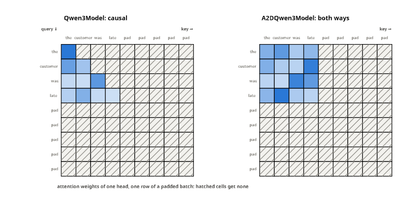
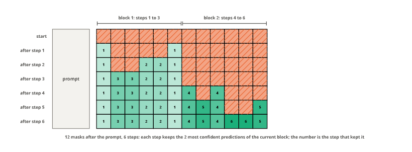

# mdlm


<!-- WARNING: THIS FILE WAS AUTOGENERATED! DO NOT EDIT! -->

A *masked diffusion language model* (MDLM) is trained to fill in masked
tokens anywhere in a text, not only the next one. It writes by starting
from a row of masks and unmasking a few at a time, most confident first,
each step one pass over the whole sequence. To fill a gap it reads both
sides of it, so every token attends to every other: its attention is
bidirectional, like an encoder’s.

That makes it two things at once for sysone:

- a **decision model** (System One): put a mask after each option and
  read, in one forward pass, how strongly the model wants to write *Yes*
  there rather than *No*. That is how
  [jev-dllm](https://github.com/zhouzihao11/jev-dllm) uses
  `dllm-hub/Qwen3-0.6B-diffusion-mdlm-v0.1`, and the readout is a linear
  map of the hidden state, so it fits sysone’s head exactly (see
  [models](03_models.ipynb#a-language-models-own-yes-and-no));
- a **writer** (System Two): with the decision adapter switched off, the
  same weights generate short texts.

This notebook builds the first, then the second. The checkpoint is
[dllm](https://github.com/ZHZisZZ/dllm)’s conversion of Qwen3-0.6B
(“autoregressive to diffusion”, A2D), trained with the MDLM objective on
instruction data; it is Apache-2.0. The tests run on
`fixtures/tiny-a2d-qwen3`, a random two-layer model laid out like the
real one, with a Qwen-shaped tokenizer.

<figure>

<figcaption aria-hidden="true">A sentence masked at growing times t,
from no mask to all masks</figcaption>
</figure>

Training draws, for each token, a time at which it is masked, and asks
the model for the masked tokens back; writing runs the other way, from a
row of masks ([figures](90_figures.ipynb#masking-at-a-growing-time-t)).
One model then does both of sysone’s jobs:

<div>

<figure class=''>

<div>



</div>

</figure>

</div>

## A bidirectional Qwen3

The checkpoint’s config names the model type `a2d-qwen3` and points at
modeling code in the Hub repo, which needs `trust_remote_code` and fails
on recent transformers. It doesn’t need it: the weights are Qwen3’s, and
what makes the model a diffusion model is only that every token sees
every other. transformers’ `Qwen3Model` attends causally, in two places:
each attention module has `is_causal = True`, which SDPA and
FlashAttention follow when there is no mask, and the model builds a
causal mask for padded batches.
[`A2DQwen3Model`](https://sgaseretto.github.io/sysonelib/mdlm.html#a2dqwen3model)
turns off the first and replaces the second with transformers’ own
bidirectional mask, keeping only padding out, and runs the stock forward
pass otherwise. Registered under the model type, it is what `AutoConfig`
and `AutoModel` return for the checkpoint, and the repo’s code is never
run.

The key/value cache is off too: the Hub config enables it, and a model
that reads the whole sequence at every step has nothing to reuse (no
cache is the price a diffusion model pays for writing anywhere).

<figure>

<figcaption aria-hidden="true">The attention of the stock causal Qwen3
and of A2DQwen3Model, on the same weights</figcaption>
</figure>

The same weights, the fixture’s, run as transformers’ `Qwen3Model` and
as
[`A2DQwen3Model`](https://sgaseretto.github.io/sysonelib/mdlm.html#a2dqwen3model)
([figures](90_figures.ipynb#attention-one-way-and-both-ways)): in the
causal model a token sees only the tokens before it, the first one only
itself; in the bidirectional one every token sees the whole sentence.
Padding gets no attention in either.

------------------------------------------------------------------------

<a
href="https://github.com/sgaseretto/sysonelib/blob/main/sysone/mdlm.py#L34"
target="_blank" style="float:right; font-size:smaller">source</a>

### A2DQwen3Model

``` python
def A2DQwen3Model(
    config
):
```

*Qwen3 attending both ways: every token sees every other, padding aside,
as a masked diffusion model needs*

------------------------------------------------------------------------

<a
href="https://github.com/sgaseretto/sysonelib/blob/main/sysone/mdlm.py#L30"
target="_blank" style="float:right; font-size:smaller">source</a>

### A2DQwen3Config

``` python
def A2DQwen3Config(
    transformers_version:str | None=None, architectures:list[str] | None=None,
    output_hidden_states:bool | None=False, return_dict:bool | None=True,
    dtype:str | ForwardRef('torch.dtype') | None=None, chunk_size_feed_forward:int=0, is_encoder_decoder:bool=False,
    id2label:dict[int, str] | dict[str, str] | None=None, label2id:dict[str, int] | dict[str, str] | None=None,
    problem_type:Literal['regression', 'single_label_classification', 'multi_label_classification'] | None=None, *,
    vocab_size:int=151936, hidden_size:int=4096, intermediate_size:int=22016, num_hidden_layers:int=32,
    num_attention_heads:int=32, num_key_value_heads:int | None=32, head_dim:int=128, hidden_act:str='silu',
    max_position_embeddings:int=32768, initializer_range:float=0.02, rms_norm_eps:float=1e-06, use_cache:bool=True,
    tie_word_embeddings:bool=False,
    rope_parameters:transformers.modeling_rope_utils.RopeParameters | dict | None=None, attention_bias:bool=False,
    use_sliding_window:bool=False, sliding_window:int | None=4096, max_window_layers:int=28,
    layer_types:list[str] | None=None, attention_dropout:float | int=0.0, pad_token_id:int | None=None,
    bos_token_id:int | None=None, eos_token_id:int | list[int] | None=None
)->None:
```

*Qwen3’s configuration under the model type the diffusion checkpoints
carry*

``` python
FX = "fixtures/tiny-a2d-qwen3"
test_eq("auto_map" in json.loads(Path(FX, "config.json").read_text()), True)       # remote code the fixture doesn't ship
enc = AutoModel.from_pretrained(FX).eval()
test_eq((type(enc).__name__, {m.is_causal for m in enc.modules() if isinstance(m, Qwen3Attention)}), ("A2DQwen3Model", {False}))
tok = AutoTokenizer.from_pretrained(FX)
x = tok("the parcel arrived two days late", return_tensors="pt").input_ids
y = x.clone(); y[0, -1] = tok.convert_tokens_to_ids(tok.tokenize(" early"))[0]
with torch.no_grad(): hx, hy = enc(input_ids=x).last_hidden_state, enc(input_ids=y).last_hidden_state
test_ne(hx[0, 0], hy[0, 0])                                                          # a later token changes the first position
test_eq(getattr(enc(input_ids=x), "past_key_values", None), None)
```

Padding changes nothing but the padded positions, alone in a batch or
beside a longer row, and the eager and SDPA attentions agree:

``` python
short, long = tok("late parcel").input_ids, tok("the parcel arrived two days late, and the box was torn").input_ids
ids = torch.full((2, len(long)), tok.pad_token_id); att = torch.zeros_like(ids)
ids[0, :len(short)], att[0, :len(short)] = torch.tensor(short), 1
ids[1], att[1] = torch.tensor(long), 1
with torch.no_grad():
    alone = enc(input_ids=torch.tensor([short])).last_hidden_state[0]
    batch = enc(input_ids=ids, attention_mask=att).last_hidden_state[0, :len(short)]
test_close(batch, alone, eps=1e-5)
eager = AutoModel.from_pretrained(FX, attn_implementation="eager").eval()
with torch.no_grad(): test_close(eager(input_ids=ids, attention_mask=att).last_hidden_state[att.bool()], enc(input_ids=ids, attention_mask=att).last_hidden_state[att.bool()], eps=1e-4)
```

## The jev layout

jev-dllm asks a question in the model’s chat format: the system message
*You are a helpful assistant.*, then the state and the question, and
either a list of options, each followed by a mask
(`Positive: The customer is satisfied.: <|mask|>`) under *For each
option, mark Yes if it answers the question, otherwise No.*, or, for a
yes/no question, *Answer Yes or No.* and one mask. Each option’s
probability comes from the model’s Yes against its No at that option’s
mask, a softmax across the options; a yes/no question reads its one mask
(a [shared
slot](01_template.ipynb#options-blocks-per-kind-and-chat-rows)).

The `jev` template is that layout as a sysone template: the chat markup
is literal text in the row, the options blocks differ by kind, and the
budgets are wide (jev truncates nothing up to 4,096 tokens).
[`RowTemplate.chat`](https://sgaseretto.github.io/sysonelib/template.html#rowtemplate.chat)
rebuilds the row from a tokenizer’s own chat template, which is how the
preset was checked against the model’s.

``` python
test_eq(RowTemplate.chat(tok, JEV_USER, JEV_SYSTEM).row, JEV_ROW)               # the preset is the model's chat template
spec = EncoderSpec.from_pretrained(FX)
test_eq((spec.family, spec.template.name, spec.lora_targets[-1]), ("a2d-qwen3", "jev", "down_proj"))
spec
```

    EncoderSpec(fixtures/tiny-a2d-qwen3: a2d-qwen3, width 64, context 4096, text, template jev)

jev-dllm builds its rows by rendering the chat template once and
tokenizing the text between masks; sysone tokenizes the row’s segments
one by one. On the fixture’s records, both give the same tokens and the
same mask positions:

``` python
def jev_input(tok, state, q):
    "jev-dllm's `decision_input` (research/scripts/bench_diff_yesno.py, Apache-2.0): token ids and mask positions"
    mask = tok.mask_token
    user = "State:\n%s\n\nQuestion:\n%s\n\n" % (render_state(state), q.instructions)
    if q.type == "noul": user, count = user + "Answer Yes or No.\nAnswer:" + mask, 1
    else:
        user += "For each option, mark Yes if it answers the question, otherwise No.\n" + "\n".join(o + ": " + mask for o in q.options)
        count = q.k
    prompt = tok.apply_chat_template([{"role": "system", "content": JEV_SYSTEM}, {"role": "user", "content": user}],
                                     tokenize=False, add_generation_prompt=False, enable_thinking=False)
    ids, pos = [], []
    for i, part in enumerate(prompt.split(mask)):
        ids += tok.encode(part, add_special_tokens=False)
        if i < count: pos.append(len(ids)); ids.append(tok.mask_token_id)
    return ids, pos

recs = [json.loads(l) for l in Path("fixtures/typed_decisions_tiny.jsonl").read_text().splitlines()]
b = spec.builder()
same = [(r.ids, sorted(set(r.markers))) == jev_input(tok, rec["state"], as_questions(rec["questions"])[r.meta["qid"]])
        for rec in recs for r in b.build_record(rec)]
test_eq((len(same), sum(same)), (100, 100))
print(show_row(b.build_record(recs[0])[3], tok, 600))
```

    <|im_start|>system
    You are a helpful assistant. <|im_end|> <|im_start|>user
    State:
    {"agent": {"autonomy": "checkpointed", "model": "internal-agent-v4"}, "constraints": ["Do not touch customer data outside the named accounts"], "task": "Delete personal data for the accounts in the erasure queue.", "trace_summary": {"constraint_violations": 0, "duration_s": 128.5, "irreversible_actions": 0, "steps": … utine writes within scope.: <|mask|> level 2: Moderate: irreversible or out-of-scope actions.: <|mask|> level 3: High: destructive, security-relevant, or policy-violating actions.: <|mask|> <|im_end|>
    markers [161, 176, 193, 213] · qtype score · 216 tokens

### Reading a decision: Yes against No

A model that fills in blanks decides by being asked to fill one. Every
option ends with a mask, and the instruction says what belongs there:
*mark Yes if it answers the question, otherwise No*. At a mask the model
predicts a distribution over its whole vocabulary, about 150,000 tokens.
The decision reads two of them, the logits of *Yes* and *No*, and
nothing is generated. Their difference,

*s* = *z*<sub>Yes</sub> − *z*<sub>No</sub>,

is how much more the model would write Yes than No at that option: the
log-odds of Yes against No, every other token set aside. A choice or a
score compares its options by these numbers, and the softmax across the
options turns them into probabilities, so the option the model most
wants to call Yes wins. A yes/no question has one mask, after *Answer:*,
and its probability of being true is σ(s), the model’s Yes against its
No there.

Every mask is read in one forward pass. The model reads the whole row at
once, in both directions, so each mask’s hidden state h has seen the
state, the question and every option, the ones after it included. The
output layer turns h into logits by a product with each token’s row of
the embedding matrix E (this model ties its output layer to its input
embeddings), so

*s* = *h* ⋅ *E*<sub>Yes</sub> − *h* ⋅ *E*<sub>No</sub> = *h* ⋅ (*E*<sub>Yes</sub> − *E*<sub>No</sub>):

a fixed direction d in the hidden space, dotted with the hidden state at
the mask. That is a linear head, and it is why the readout fits sysone’s
head exactly
([models](03_models.ipynb#a-language-models-own-yes-and-no)). The
`yesno` scorer starts as d, so that before any training it *is*
jev-dllm’s reading, and it learns a small correction and a scale; LoRA
moves the hidden states, so that d comes to point at the right options.
On the fixture’s random weights
([figures](90_figures.ipynb#yes-against-no-at-each-mask)):

<figure>

<figcaption aria-hidden="true">A jev row’s masks, the hidden state at
each, its product with E[Yes] − E[No], and the softmax across the
options; a yes/no question’s one mask and σ(s)</figcaption>
</figure>

## A learner

[`decision_learner`](https://sgaseretto.github.io/sysonelib/gliner_backend.html#decision_learner)
is sysone’s learner with this model’s defaults: the `yesno` head, which
starts as the model’s own Yes/No, LoRA on every linear layer of every
block (`r=16`), and
[`SoftCE`](https://sgaseretto.github.io/sysonelib/losses.html#softce)
with jev-dllm’s RPS weight. The encoder’s learning rate is set on its
own, since LoRA wants a higher one than the head’s default ratio gives.
Every other argument is the base learner’s (its signature lists them,
through `delegates`).

[`zero_shot`](https://sgaseretto.github.io/sysonelib/evaluate.html#zero_shot)
is the model untrained: the decider jev-dllm reports as its base model.

------------------------------------------------------------------------

<a
href="https://github.com/sgaseretto/sysonelib/blob/main/sysone/evaluate.py#L71"
target="_blank" style="float:right; font-size:smaller">source</a>

### zero_shot

``` python
def zero_shot(
    encoder:str='dllm-hub/Qwen3-0.6B-diffusion-mdlm-v0.1', dtype:torch.dtype=torch.float32, **kw
)->sysone.inference.Decider:
```

*The untrained model as a decider: its own Yes against its No at each
answer slot*

------------------------------------------------------------------------

<a
href="https://github.com/sgaseretto/sysonelib/blob/main/sysone/gliner.py#L212"
target="_blank" style="float:right; font-size:smaller">source</a>

### decision_learner

``` python
def decision_learner(
    data:sysone.data.TypedDecisions, encoder:str='dllm-hub/Qwen3-0.6B-diffusion-mdlm-v0.1', train:str='lora',
    head:str='yesno', loss:NoneType=None, lr:tuple=(0.0002, 0.001), lora:dict | None=None, cache:str='auto',
    cache_dtype:str='float32', *, template:NoneType=None, head_layers:int | None=None, init_from:str | None=None,
    preset:str | None=None, dtype:NoneType=None, standardize:bool=False, readout:str='anchor', query:str | None=None,
    act:bool=False, pair_dim:int=256, yesno:tuple=('Yes', 'No'), **kw
)->sysone.learner.Learner:
```

*A masked diffusion model’s
[`Learner`](https://sgaseretto.github.io/sysonelib/learner.html#learner):
its own Yes/No at each option’s slot, LoRA on every linear layer, soft
cross-entropy with an RPS term*

``` python
zs = zero_shot(FX)
rec = recs[0]
ans = zs.predict(rec["state"], rec["questions"])
test_eq(set(ans), set(rec["questions"]))
q = as_questions(rec["questions"])
row = zs.builder.build_record(rec)[3]
E = enc.get_input_embeddings().weight; Y, N = (tok(w, add_special_tokens=False).input_ids[0] for w in ("Yes", "No"))
with torch.no_grad(): h = enc(input_ids=torch.tensor([row.ids])).last_hidden_state[0]
s = [(h[m] @ (E[Y] - E[N])).item() for m in sorted(set(row.markers))]
want = torch.tensor(s).softmax(-1) if q[row.meta["qid"]].type != "noul" else torch.tensor([0.0, s[0]]).softmax(-1)
test_close(torch.tensor(list(ans[row.meta["qid"]].get("probabilities", {}).values()) or [1 - ans[row.meta["qid"]]["noul"], ans[row.meta["qid"]]["noul"]]),
           want, eps=1e-3)
ans
```

    {'action': {'type': 'choice',
      'choice': 'continue',
      'probabilities': {'continue': 0.2531,
       'human_review': 0.2486,
       'observe': 0.2513,
       'stop': 0.247},
      'confidence': 0.0,
      'answer_confidence': 0.2531},
     'needs_review': {'type': 'noul',
      'noul': 0.4888,
      'confidence': 0.5112,
      'answer_confidence': 0.5112},
     'outcome': {'type': 'choice',
      'choice': 'partial',
      'probabilities': {'failure': 0.2514,
       'harmful': 0.2476,
       'partial': 0.2527,
       'success': 0.2483},
      'confidence': 0.0,
      'answer_confidence': 0.2527},
     'risk': {'type': 'score',
      'score': 1.49,
      'legend': {'0': 'Benign: read-only or clearly safe actions.',
       '1': 'Low: routine writes within scope.',
       '2': 'Moderate: irreversible or out-of-scope actions.',
       '3': 'High: destructive, security-relevant, or policy-violating actions.'},
      'probabilities': {'0': 0.2525, '1': 0.2511, '2': 0.2504, '3': 0.246},
      'confidence': 0.0,
      'answer_confidence': 0.2525},
     'urgency': {'type': 'score',
      'score': 1.4928,
      'legend': {'0': 'No time pressure; can wait indefinitely.',
       '1': 'Routine; handle within the normal queue.',
       '2': 'Elevated; should be handled within the same week.',
       '3': 'Critical; requires action within the same day.'},
      'probabilities': {'0': 0.2503, '1': 0.2515, '2': 0.2533, '3': 0.2449},
      'confidence': 0.0001,
      'answer_confidence': 0.2533}}

### On the real checkpoint

On a Kaggle T4 (transformers 5.16, torch 2.11), on typed-decisions’
2,000 test decisions, the zero-shot decider scores **0.409**, where
jev-dllm reports 0.4135 for the same base model:

<table style="width:100%;">
<colgroup>
<col style="width: 16%" />
<col style="width: 16%" />
<col style="width: 16%" />
<col style="width: 16%" />
<col style="width: 16%" />
<col style="width: 16%" />
</colgroup>
<thead>
<tr>
<th></th>
<th>accuracy</th>
<th>choice</th>
<th>score</th>
<th>noul</th>
<th>ECE</th>
</tr>
</thead>
<tbody>
<tr>
<td><a
href="https://sgaseretto.github.io/sysonelib/evaluate.html#zero_shot"><code>zero_shot()</code></a>,
fp32</td>
<td>0.409</td>
<td>0.403</td>
<td>0.346</td>
<td>0.498</td>
<td>0.266</td>
</tr>
<tr>
<td><a
href="https://sgaseretto.github.io/sysonelib/evaluate.html#zero_shot"><code>zero_shot()</code></a>,
fp16 autocast</td>
<td>0.409</td>
<td>0.403</td>
<td>0.346</td>
<td>0.498</td>
<td>0.266</td>
</tr>
<tr>
<td>jev-dllm’s base model (its report)</td>
<td>0.4135</td>
<td></td>
<td></td>
<td></td>
<td>0.262</td>
</tr>
</tbody>
</table>

All 2,000 rows are token for token the rows jev-dllm’s own builder makes
on the real tokenizer, and
[`RowTemplate.chat`](https://sgaseretto.github.io/sysonelib/template.html#rowtemplate.chat)
on it gives the `jev` preset exactly. The checkpoint’s stored output
layer equals its input embeddings (the largest difference is 0.0), so
reading Yes and No off the embeddings is reading the model’s own output
layer. fp16 is safe on a T4: on 1,000 decisions it picked the same
answer as fp32 999 times, the probabilities at most 0.003 apart, at a
third of the time (83 s for the 2,000 decisions, about 44 ms each, rows
of 322 tokens on average). For comparison, sysone measured Laya’s
typed-decisions checkpoint at 0.766 on the same decisions, but Laya
trained on typed-decisions’ own training split; the model here has never
seen it. The cell below reruns the check (it needs a Kaggle login):

``` python
check = Path("zero_shot_check.py")
check.write_text("""
import json
from pathlib import Path
from datasets import load_dataset
from sysone.core import load_record
from sysone.models import read_tensors
from sysone.evaluate import evaluate
from sysone.cloud import job_output
from sysone.mdlm import ENCODER, zero_shot
t = read_tensors(ENCODER, select=lambda k: k in ("lm_head.weight", "model.embed_tokens.weight"))
out = {"lm_head_vs_embed": float((t["lm_head.weight"].float() - t["model.embed_tokens.weight"].float()).abs().max())}
recs = [load_record(r) for r in load_dataset("LocalLLaMA/typed-decisions", "all", split="test")]
m = evaluate(zero_shot(ENCODER, device="cuda"), recs)            # fp16 autocast on CUDA
out |= {k: m[k] for k in ("accuracy", "accuracy_choice", "accuracy_score", "accuracy_noul", "ece", "latency_p50_ms")}
Path(job_output()).mkdir(parents=True, exist_ok=True); (Path(job_output()) / "zero_shot.json").write_text(json.dumps(out, indent=2))
""")
job = remote(str(check), on="kaggle", hw="t4", max_hours=1)
job.wait(every=60)
json.loads((job.fetch() / "export" / "zero_shot.json").read_text())     # no model exported: fetch returns the outputs folder
```

A LoRA learner on the fixture: its adapters sit on all seven linear
layers of each block, the head trains its correction and scale, and one
step changes the encoder’s answer:

``` python
data = TypedDecisions.from_records(recs, valid=0.2, calib=0)
learn = decision_learner(data, FX, preset="cpu", per_device_train_batch_size=4)
lora_mods = {n.split(".lora_A")[0].split(".")[-1] for n, p in learn.model.encoder.named_parameters() if "lora_A" in n}
test_eq(lora_mods, {"q_proj", "k_proj", "v_proj", "o_proj", "gate_proj", "up_proj", "down_proj"})
test_eq(repr(learn.loss), "SoftCE(rps=0.25)")
before = learn.get_preds("valid")["logits"].copy()
learn.fit(1, lr=(5e-3, 5e-3), max_steps=2, eval=False)
test_ne(learn.get_preds("valid")["logits"], before)
```

    {'train_runtime': '0.0664', 'train_samples_per_second': '120.6', 'train_steps_per_second': '30.14', 'train_loss': '1.281', 'epoch': '0.1'}

      0%|          | 0/2 [00:00<?, ?it/s]
    100%|##########| 2/2 [00:00<00:00, 105.03it/s]

      0%|          | 0/2 [00:00<?, ?it/s]
                                         

    100%|##########| 2/2 [00:00<00:00, 30.23it/s]
    100%|##########| 2/2 [00:00<00:00, 30.05it/s]

      0%|          | 0/2 [00:00<?, ?it/s]
    100%|##########| 2/2 [00:00<00:00, 221.49it/s]

An export keeps the adapter (this learner sets `merge_adapters=False`,
so `merge` defaults to False). With the checkpoint on the Hub the
adapter is all it holds, tens of megabytes beside the base model’s 2.4
GB: `sysone.json` names the checkpoint and the commit the adapter
trained on. The fixture here is a local folder, which an export bundles
unless told not to (`bundle=False`). The export loads back through
[`Decider.load`](https://sgaseretto.github.io/sysonelib/inference.html#decider.load),
which finds this module by the model type:

``` python
with tempfile.TemporaryDirectory() as d:
    learn.export(d, bundle=False)
    test_eq((Path(d, "encoder").exists(), Path(d, "adapter", "adapter_model.safetensors").exists()), (False, True))
    meta = json.loads(Path(d, "sysone.json").read_text())
    test_eq((meta["encoder"]["family"], meta["template"]["kinds"]["noul"]["option"]), ("a2d-qwen3", "{mask}"))
    back = Decider.load(d)
    a1, a2 = learn.decider().predict(rec["state"], rec["questions"]), back.predict(rec["state"], rec["questions"])
    test_eq({k: v.get("choice", v.get("noul")) for k, v in a1.items()}, {k: v.get("choice", v.get("noul")) for k, v in a2.items()})
    test_eq(hasattr(back.model.encoder, "peft_config"), True)
```

### Trained, on the real checkpoint

The same learner on the real checkpoint, on a Kaggle T4: LoRA on
typed-decisions’ training split (1,080 cases, with 120 more held out to
calibrate on) for 300 steps of 32 rows, about three and a half epochs,
in 87 minutes (fp16 with gradient checkpointing, 7.7 GB of GPU memory at
most). 10.1M of the model’s 606M parameters train, all but 4,097 of them
the adapter’s. On typed-decisions’ 2,000 test decisions:

<table style="width:100%;">
<colgroup>
<col style="width: 16%" />
<col style="width: 16%" />
<col style="width: 16%" />
<col style="width: 16%" />
<col style="width: 16%" />
<col style="width: 16%" />
</colgroup>
<thead>
<tr>
<th></th>
<th>accuracy</th>
<th>choice</th>
<th>score</th>
<th>noul</th>
<th>ECE</th>
</tr>
</thead>
<tbody>
<tr>
<td><a
href="https://sgaseretto.github.io/sysonelib/evaluate.html#zero_shot"><code>zero_shot()</code></a></td>
<td>0.409</td>
<td>0.403</td>
<td>0.346</td>
<td>0.498</td>
<td>0.266</td>
</tr>
<tr>
<td><a
href="https://sgaseretto.github.io/sysonelib/gliner_backend.html#decision_learner"><code>decision_learner</code></a>,
LoRA, 300 steps</td>
<td><strong>0.768</strong></td>
<td>0.752</td>
<td>0.724</td>
<td>0.842</td>
<td>0.150</td>
</tr>
<tr>
<td>jev-dllm’s full fine-tune (its report)</td>
<td>0.5225</td>
<td></td>
<td></td>
<td></td>
<td></td>
</tr>
<tr>
<td>Laya’s typed-decisions checkpoint (sysone’s measurement)</td>
<td>0.766</td>
<td></td>
<td></td>
<td></td>
<td></td>
</tr>
</tbody>
</table>

A 40 MB adapter takes the model from 0.41 to 0.77: past jev-dllm’s full
fine-tune of the same model, and level with Laya’s checkpoint, an
encoder trained for these decisions. Calibration hardly moved the
temperatures (0.95 for choices, 1.02 for scores and nouls), so the
model’s own Yes against its No comes out close to calibrated. The
export, reloaded, gives the same answer on 200 of 200 decisions, and
with the adapter switched off the encoder’s hidden states equal the base
model’s exactly (the largest difference is 0.0): the model that writes
is the checkpoint as published. The cell below reruns it (a Kaggle
login, about an hour and a half of T4):

``` python
train_check = Path("lora_check.py")
train_check.write_text("""
import json
from pathlib import Path
from datasets import load_dataset
from sysone.core import load_record
from sysone.data import TypedDecisions
from sysone.evaluate import evaluate
from sysone.cloud import job_output
from sysone.mdlm import ENCODER, decision_learner
cases = lambda split: [load_record(r) for r in load_dataset("LocalLLaMA/typed-decisions", "all", split=split)]
train, test = cases("train"), cases("test")
learn = decision_learner(TypedDecisions.from_records(train, valid=test[:80], calib=0.1), ENCODER)
learn.fit_one_cycle(1, max_steps=300)
learn.calibrate()
m = evaluate(learn.decider(), test)
dest = learn.export(job_output(), name="diffcider-typed-decisions")      # the adapter alone, and the checkpoint's id and commit
(dest / "lora.json").write_text(json.dumps({k: m[k] for k in ("accuracy", "accuracy_choice", "accuracy_score", "accuracy_noul", "ece")}, indent=2))
""")
job = remote(str(train_check), on="kaggle", hw="t4", max_hours=2.5)
job.wait(every=300)
json.loads((job.fetch() / "lora.json").read_text())
```

## Writing (System Two)

The same model writes. Generation starts from the prompt and a row of
masks; at every step the model predicts every masked token at once, and
the most confident predictions are kept (*low-confidence remasking*:
what the model is least sure of stays masked and is predicted again next
step, with more of the text around it known). The masks are filled in
blocks of `block_size`, left to right, each block over its share of
`steps`. With `steps` equal to the number of tokens, one token is kept
per step; fewer steps keep several at once, faster and rougher. Every
step is a forward pass over the whole sequence, prompt included: a
diffusion model reads both sides of each gap, so there is no key/value
cache to reuse, and writing costs one full pass per step where an
autoregressive model pays a growing cache.

[`mdlm_sample`](https://sgaseretto.github.io/sysonelib/mdlm.html#mdlm_sample)
is that sampler, ported from the model card’s (dllm, Apache-2.0), as the
[`A2DQwen3Config`](https://sgaseretto.github.io/sysonelib/mdlm.html#a2dqwen3config)
method of sysone’s
[\[`sample`\](https://sgaseretto.github.io/sysonelib/inference.html#sample)](06_inference.ipynb#writing-text).
It needs only the encoder: the output layer is the tied input
embeddings, applied only at the masked positions.
[`Decider.generate`](https://sgaseretto.github.io/sysonelib/inference.html#decider.generate)
and
[`Decider.fill`](https://sgaseretto.github.io/sysonelib/inference.html#decider.fill)
then work on any decider over this model, with the decisions’ adapter
switched off unless asked.

<figure>

<figcaption aria-hidden="true">The order in which mdlm_sample unmasks 12
tokens in 6 steps, in two blocks of 6</figcaption>
</figure>

[`mdlm_sample`](https://sgaseretto.github.io/sysonelib/mdlm.html#mdlm_sample)
on the fixture, 12 masks in 6 steps and blocks of 6
([figures](90_figures.ipynb#unmasking-block-by-block)): each step keeps
the two most confident predictions of the current block, in whatever
order the model is surest of them, and the second block starts once the
first is full.

------------------------------------------------------------------------

<a
href="https://github.com/sgaseretto/sysonelib/blob/main/sysone/mdlm.py#L90"
target="_blank" style="float:right; font-size:smaller">source</a>

### mdlm_sample

``` python
def mdlm_sample(
    config:__main__.A2DQwen3Config, model, ids, tokenizer:NoneType=None, max_new_tokens:int=0, steps:int | None=None,
    block_size:int=32, temperature:float=0.0, remasking:str='low_confidence', mask_id:int | None=None
):
```

*Fill every mask of `ids` and `max_new_tokens` more: block by block from
the left, each block over its share of `steps`, most confident first*

------------------------------------------------------------------------

<a
href="https://github.com/sgaseretto/sysonelib/blob/main/sysone/mdlm.py#L84"
target="_blank" style="float:right; font-size:smaller">source</a>

### lm_logits

``` python
def lm_logits(
    model, ids, at, attention_mask:NoneType=None
):
```

*The model’s logits for the tokens at positions `at` (a boolean mask
over `ids`), from its tied input embeddings*

``` python
p = tok("the parcel arrived", return_tensors="pt").input_ids
out = sample(enc.config, enc, p, tokenizer=tok, max_new_tokens=6, steps=3, block_size=4)
test_eq(((out == tok.mask_token_id).sum().item(), out.shape[1], out[0, :p.shape[1]].tolist()), (0, p.shape[1] + 6, p[0].tolist()))
zs = zero_shot(FX)
said = zs.generate("Which city is the capital of France?", max_new_tokens=8)
test_eq(zs.generate("Which city is the capital of France?", max_new_tokens=8), said)          # greedy writing is deterministic
test_eq(len(zs.fill("Name a fruit.", '{"fruit": "{}"}', n=4)), 1)
test_eq(methods(sample)[-1][0], "A2DQwen3Config")
said
```

    '� update moreassory update update update'

The learner above decides with its adapter; switched off, its encoder is
the base model again, and writes exactly what the untrained model
writes:

``` python
dl = learn.decider()
q = "Which city is the capital of France?"
test_eq(dl.generate(q, max_new_tokens=8), zs.generate(q, max_new_tokens=8))
ids = torch.tensor([dl._prompt_ids(q)]); at = torch.zeros_like(ids, dtype=torch.bool); at[0, -1] = True
with torch.no_grad():
    on = lm_logits(dl.model.encoder, ids, at)
    with adapters_off(dl.model): off = lm_logits(dl.model.encoder, ids, at)
test_ne(on, off)                                                                    # the adapter changes the model it runs
```

## Browser steps, on the real checkpoint

Both systems on
[Multimodal-Mind2Web](https://huggingface.co/datasets/osunlp/Multimodal-Mind2Web)’s
browser steps, read as text without the screenshots
([\[`from_mm_mind2web`\](https://sgaseretto.github.io/sysonelib/screens.html#from_mm_mind2web)](21_screens.ipynb)),
on a Kaggle T4. A step asks two questions: which operation comes next,
among the actions its candidate elements allow (CLICK, TYPE_TEXT,
SELECT) and five controls (WAIT, SCROLL_DOWN, SCROLL_UP, DONE, BLOCKED),
and which of up to 45 elements it acts on. The test is the first 300
steps of the `test_website` split, from 9 websites none of the training
steps came from:

### The first adapter: it learned to click

<table>
<colgroup>
<col style="width: 25%" />
<col style="width: 25%" />
<col style="width: 25%" />
<col style="width: 25%" />
</colgroup>
<thead>
<tr>
<th></th>
<th>operation</th>
<th>element</th>
<th>step</th>
</tr>
</thead>
<tbody>
<tr>
<td>always CLICK</td>
<td>0.783</td>
<td></td>
<td></td>
</tr>
<tr>
<td><a
href="https://sgaseretto.github.io/sysonelib/evaluate.html#zero_shot"><code>zero_shot()</code></a></td>
<td>0.023</td>
<td>0.247</td>
<td>0.000</td>
</tr>
<tr>
<td><a
href="https://sgaseretto.github.io/sysonelib/gliner_backend.html#decision_learner"><code>decision_learner</code></a>,
LoRA, 150 steps</td>
<td>0.783</td>
<td>0.643</td>
<td>0.457</td>
</tr>
</tbody>
</table>

*Step* is the [browser tutorial](tutorials/11_mdlm_browser.ipynb)’s
measure of an agent’s whole step: the operation, the element and, on a
typing step, the text written all right. Untrained, the model almost
never picks the operation the person performed: it answers DONE on 288
of the 300 steps, and no recorded step is a control. Its element is
right a quarter of the time, among up to 45. LoRA trained on 1,500 steps
of the [`train`](https://sgaseretto.github.io/sysonelib/cli.html#train)
split, from 54 websites, with validation and calibration steps held out
by website: 150 steps of 16 rows, about one epoch, in 106 minutes (fp16
with gradient checkpointing, 10 GB of GPU memory at most). The element
goes to 0.64, with an expected calibration error of 0.06; laya-ultrafast
reports 0.63 and 0.66 for its two fine-tuned encoders on held-out
Mind2Web pages with about 45 candidates, though not on these steps and
with more data.

The operation does not beat a rule: the adapter answers CLICK on every
step, and its 0.783 is the share of clicks among them. 85% of the
training steps are clicks, and trained on them as they come, the adapter
learned that the answer is nearly always CLICK. Its probabilities still
tell the operations apart: divided by each operation’s share of the
training steps (the tutorial’s *Dividing out the shares*), they pick 41
of the 43 typing steps and all 22 select steps.

### Balancing the operations

[cklxx’s notes on fine-tuning
laya-browser](https://github.com/cklxx/laya/blob/main/docs/finetune_browser_agent.md)
oversample the rare operations, and sysone’s
[`RowSampler("oversample")`](02_data.ipynb) does it per question: the
operation’s TYPE_TEXT and SELECT rows repeat, cycling, until each
operation has as many rows as CLICK (1,070 each, from 1,500 steps). A
second run also used one of sysone’s
[reshapings](tutorials/09_reshaping_datasets.ipynb):
[`Nouls(qid="operation", negatives=2)`](02_data.ipynb) asks each step’s
operation as three statements too, *the answer is TYPE_TEXT* and two
others drawn at random, true for the step’s own operation, drawn anew
each epoch. Both runs kept the recipe otherwise: the same 1,500 steps
and 150 steps of 16 rows, in 91 and 135 minutes.

Both gave the same operation answers on the 300 test steps as the first
adapter does with its shares divided out: CLICK on 176, TYPE_TEXT on 93,
SELECT on 31, right 79.7% of the time. That is the rule *the rarest
action offered*. A step offers the actions its candidate elements allow,
and its own element is always among them, so every typing step offers
TYPE_TEXT and every select step SELECT, while 176 of the 300 steps offer
CLICK alone (the [screens](21_screens.ipynb#one-step-one-record)
notebook has the finding). Balanced, the adapters learned the rule; the
statements lifted the element to 0.663, the best of all the runs.

### Every action offered

`operations="all"` offers all three actions on every step, so the
offered ones say nothing about the answer. Two more runs trained on the
same steps built that way, oversampled, one with the statements (E3) and
one without (E4). Every adapter was then scored on the same 300 steps
both ways, each step offering the actions its elements allow, or
offering every action; a [`kaggle-output:`](40_cloud.ipynb) source
mounted the training jobs’ exports in one evaluation job:

<table style="width:100%;">
<colgroup>
<col style="width: 16%" />
<col style="width: 16%" />
<col style="width: 16%" />
<col style="width: 16%" />
<col style="width: 16%" />
<col style="width: 16%" />
</colgroup>
<thead>
<tr>
<th></th>
<th>trained on</th>
<th>operation</th>
<th>operation, every action offered</th>
<th>element</th>
<th>step</th>
</tr>
</thead>
<tbody>
<tr>
<td>always CLICK</td>
<td></td>
<td>0.783</td>
<td>0.783</td>
<td></td>
<td></td>
</tr>
<tr>
<td>the rarest action offered</td>
<td></td>
<td>0.797</td>
<td></td>
<td></td>
<td></td>
</tr>
<tr>
<td>first adapter</td>
<td>the steps as they come</td>
<td>0.783</td>
<td>0.783</td>
<td>0.643</td>
<td>0.457</td>
</tr>
<tr>
<td>E1</td>
<td>operations oversampled</td>
<td>0.797</td>
<td>0.073</td>
<td>0.647</td>
<td>0.447</td>
</tr>
<tr>
<td>E2</td>
<td>oversampled, and asked as statements</td>
<td>0.797</td>
<td>0.073</td>
<td><strong>0.663</strong></td>
<td>0.450</td>
</tr>
<tr>
<td>E3</td>
<td>every action offered, oversampled, statements</td>
<td>0.823</td>
<td>0.243</td>
<td>0.640</td>
<td>0.463</td>
</tr>
<tr>
<td>E4</td>
<td>every action offered, oversampled</td>
<td><strong>0.853</strong></td>
<td>0.573</td>
<td>0.647</td>
<td><strong>0.470</strong></td>
</tr>
</tbody>
</table>

Offered every action, E1 and E2 answer SELECT on every step, the rarest
action their rule knows. E4 is the one adapter whose operation beats the
rule where a step offers the actions its elements allow: having never
seen the offered actions give an answer away, it learned the operation
from the goal, the page and the steps before, and picks the right one
85% of the time, the element 65% and the whole step 47%. Offered every
action, it leans toward the rare ones (57%), having trained on the
operations in equal shares. The correction for a model trained on
balanced classes, multiplying each operation’s probability by its share
of the training steps (CLICK 85%, TYPE_TEXT 10%, SELECT 5.5%),
overcorrects here: every balanced adapter then answers CLICK on every
step. The statements, the element’s best help when the offered actions
told the operation, push E3 further toward the rare operations.

E4 is published as
[`sgaseretto/diffcider-browser`](https://huggingface.co/sgaseretto/diffcider-browser);
the first adapter stays in that repo’s history, and the browser tutorial
runs it at that revision. The cell below trains E4 again (a Kaggle
login, an hour and a half of T4):

``` python
browser = Path("browser_adapter.py")
browser.write_text("""
from sysone.data import TypedDecisions, RowSampler
from sysone.datasets import from_mm_mind2web
from sysone.cloud import job_output
from sysone.mdlm import ENCODER, decision_learner
train = from_mm_mind2web("train", n=1500, screenshots=False, operations="all")      # every action offered on every step
data = TypedDecisions.from_records(train, valid=0.05, calib=0.1, groups="website", sampler=RowSampler("oversample"))
learn = decision_learner(data, ENCODER, per_device_train_batch_size=4, gradient_accumulation_steps=4)
learn.fit_one_cycle(1, max_steps=150, eval=False)
learn.calibrate()
learn.export(job_output(), name="diffcider-browser")
""")
job = remote(str(browser), on="kaggle", hw="t4", max_hours=3)
job.wait(every=300)
job.fetch()
```

### Writing

With the adapter off, the model writes the text of a typing step from
the goal, the page and the field. On 120 typing steps whose value the
goal’s wording contains, it wrote exactly the person’s text (ignoring
case, spacing and quotes) 52.5% of the time with 16 unmasking steps (733
ms), 49% with 8 (372 ms) and 42.5% with 4 (190 ms). The exports hold the
adapter alone, 49.5 MB with the head and the tokenizer, name the
checkpoint at its commit, and load back to the same answers on 80 of 80
decisions; with its adapter off, a trained decider writes what the
untrained model writes, on 20 of 20 prompts. The typed-decisions adapter
above is published as
[`sgaseretto/diffcider-typed-decisions`](https://huggingface.co/sgaseretto/diffcider-typed-decisions).

<div>

> **Finding: a slot’s masks are all filled, so the text ran past the
> value**
>
> Writing into a JSON string, `fill(prompt, '{"text": "{}"}')`, matched
> the person’s text on none of the 120 steps. The model wrote the value
> and kept going: a slot is 16 masks, a diffusion model fills every one,
> and it filled them with more JSON,
> `Gorillaz", "album": "first studio album", "genre":` where the person
> typed *gorillaz*. `fill` now ends a quoted slot at its closing quote,
> and any other slot where the template’s next text begins
> ([inference](06_inference.ipynb#writing-text)); of the twelve examples
> the run kept, seven then come out exactly right. The [browser
> tutorial](tutorials/11_mdlm_browser.ipynb) measures the mended `fill`
> beside `generate`.

</div>
