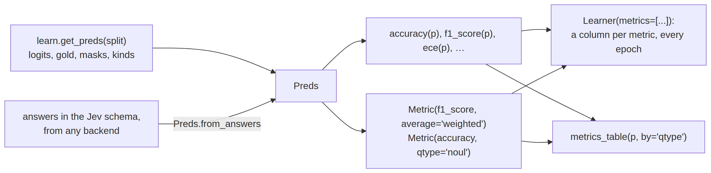
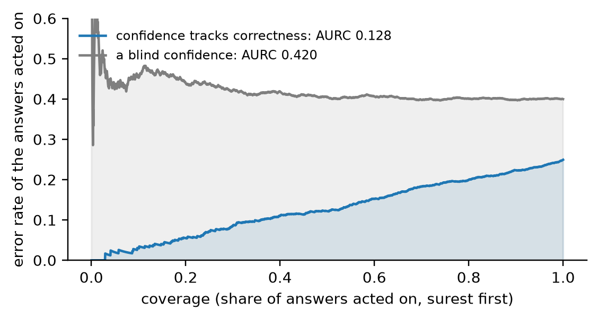

# metrics


<!-- WARNING: THIS FILE WAS AUTOGENERATED! DO NOT EDIT! -->

``` python
from sysone.losses import decision_metrics, answer_metrics, macro_f1
```

In fastai, a metric is a function of what the model predicted and what
the targets were. A learner takes a list of them,
`Learner(dls, model, metrics=[accuracy, F1Score()])`, and reports each
one after every epoch. Typed decisions need the same thing, with three
twists:

- **Rows have different numbers of options.** A batch pads every row to
  its widest, so a row’s prediction is its first `k` logits, not the
  whole vector.
- **Three kinds of questions share a batch, and they answer
  differently.** A choice answers with its likeliest option, a score
  with its expected level, and a noul with whether p(true) reaches a
  half. Some metrics only mean something for one kind, like the error of
  a level for a score, or an AUROC for a noul.
- **The gold can be a distribution, or say that no option is right.** A
  soft gold rewards spreading probability the way the annotators did,
  and an unanswerable row has no option to be right about.

[\[`decision_metrics`\](https://sgaseretto.github.io/sysonelib/losses.html#decision_metrics)](04_losses.ipynb#metrics)
handles all three, and returns the fixed set of Laya’s notebook. This
notebook opens the set up. Everything a metric reads about a split sits
in one object,
[`Preds`](https://sgaseretto.github.io/sysonelib/metrics.html#preds),
and a metric is any function of a
[`Preds`](https://sgaseretto.github.io/sysonelib/metrics.html#preds)
that returns a number.
[`Metric`](https://sgaseretto.github.io/sysonelib/metrics.html#metric)
binds a metric’s arguments, keeps it to one kind of question if asked,
and names the column it fills:

<div>

<figure class=''>

<div>



</div>

</figure>

</div>

## Preds

A [`Preds`](https://sgaseretto.github.io/sysonelib/metrics.html#preds)
is a `dict` of arrays with one row per decision: the logits padded with
−10<sup>4</sup>, the gold distributions padded with zeros, the option
masks, the question types and the gold labels. When they are known, it
also holds whether each row is answerable, the act head’s p(act), each
row’s question id and case index, and its options’ keys. Being a `dict`,
it still works for code that reads `learn.get_preds()` by key. Its
properties derive what metrics need. `probs` are the softmax over each
row’s own options, divided by the temperature of the row’s bucket when
the [`Preds`](https://sgaseretto.github.io/sysonelib/metrics.html#preds)
carries temperatures. `pred` is the option each row answers, and
`correct`, `conf` and `ok` say whether that answer is right, how sure it
is, and whether the row has an answer among its options at all.

------------------------------------------------------------------------

<a
href="https://github.com/sgaseretto/sysonelib/blob/main/sysone/metrics.py#L25"
target="_blank" style="float:right; font-size:smaller">source</a>

### Preds

``` python
def Preds(
    logits, targets, masks, qtypes, labels, answerable:NoneType=None, act:NoneType=None, qids:NoneType=None,
    case_idx:NoneType=None, temperatures:dict | None=None, option_keys:list | None=None
):
```

*Every row’s option logits beside its gold, option mask, question type
and gold label (and, when known, answerability, p(act), question id,
case index and option keys): what metrics and interpretations read*

------------------------------------------------------------------------

<a
href="https://github.com/sgaseretto/sysonelib/blob/main/sysone/metrics.py#L95"
target="_blank" style="float:right; font-size:smaller">source</a>

### Preds.of_type

``` python
def of_type(
    *names
)->__main__.Preds:
```

*The rows of the question types named*

------------------------------------------------------------------------

<a
href="https://github.com/sgaseretto/sysonelib/blob/main/sysone/metrics.py#L85"
target="_blank" style="float:right; font-size:smaller">source</a>

### Preds.select

``` python
def select(
    rows
)->__main__.Preds:
```

*The rows a boolean mask or a list of indices picks, with the same
temperatures*

------------------------------------------------------------------------

<a
href="https://github.com/sgaseretto/sysonelib/blob/main/sysone/metrics.py#L82"
target="_blank" style="float:right; font-size:smaller">source</a>

### Preds.conf

``` python
def conf()->numpy.ndarray:
```

*The probability of each row’s answer*

------------------------------------------------------------------------

<a
href="https://github.com/sgaseretto/sysonelib/blob/main/sysone/metrics.py#L79"
target="_blank" style="float:right; font-size:smaller">source</a>

### Preds.right

``` python
def right()->numpy.ndarray:
```

*Whether acting on each row’s answer would be right: an answerable row
answered correctly*

------------------------------------------------------------------------

<a
href="https://github.com/sgaseretto/sysonelib/blob/main/sysone/metrics.py#L76"
target="_blank" style="float:right; font-size:smaller">source</a>

### Preds.correct

``` python
def correct()->numpy.ndarray:
```

*Whether each row’s answer is its gold label*

------------------------------------------------------------------------

<a
href="https://github.com/sgaseretto/sysonelib/blob/main/sysone/metrics.py#L70"
target="_blank" style="float:right; font-size:smaller">source</a>

### Preds.pred

``` python
def pred()->numpy.ndarray:
```

*Each row’s answer, as an option index: the likeliest option, and for a
noul true when p(true) ≥ 0.5*

------------------------------------------------------------------------

<a
href="https://github.com/sgaseretto/sysonelib/blob/main/sysone/metrics.py#L67"
target="_blank" style="float:right; font-size:smaller">source</a>

### Preds.ok

``` python
def ok()->numpy.ndarray:
```

*Rows whose gold puts its mass on some option: an answer among the
options*

------------------------------------------------------------------------

<a
href="https://github.com/sgaseretto/sysonelib/blob/main/sysone/metrics.py#L60"
target="_blank" style="float:right; font-size:smaller">source</a>

### Preds.probs

``` python
def probs()->numpy.ndarray:
```

*Each row’s option probabilities, softmax(z / T) over its own options,
zero on padding*

------------------------------------------------------------------------

<a
href="https://github.com/sgaseretto/sysonelib/blob/main/sysone/metrics.py#L55"
target="_blank" style="float:right; font-size:smaller">source</a>

### Preds.temps

``` python
def temps()->numpy.ndarray:
```

*Each row’s temperature: its bucket’s, else its type’s, else 1*

------------------------------------------------------------------------

<a
href="https://github.com/sgaseretto/sysonelib/blob/main/sysone/metrics.py#L52"
target="_blank" style="float:right; font-size:smaller">source</a>

### Preds.k

``` python
def k()->numpy.ndarray:
```

*Each row’s number of options*

------------------------------------------------------------------------

<a
href="https://github.com/sgaseretto/sysonelib/blob/main/sysone/metrics.py#L49"
target="_blank" style="float:right; font-size:smaller">source</a>

### Preds.n

``` python
def n()->int:
```

*Number of rows*

A toy split of four rows: a four-option choice whose gold is its first
option, a noul whose gold is true, a four-level score whose gold is
spread over levels 1 and 2, and a three-option choice whose record says
none of its options is right. The noul has two options and the last
choice three, so their other slots are padding:

``` python
logits = np.array([[2.0, 0.5, -1.0, 0.0], [0.3, -0.3, -1e4, -1e4], [0.1, 1.2, 0.4, -0.5], [1.0, 0.0, 0.5, -1e4]])
targets = np.array([[1, 0, 0, 0], [0, 1, 0, 0], [0, 0.5, 0.5, 0], [0, 0, 0, 0]], dtype=float)
masks = np.array([[1, 1, 1, 1], [1, 1, 0, 0], [1, 1, 1, 1], [1, 1, 1, 0]], dtype=bool)
p = Preds(logits, targets, masks, qtypes=[0, 2, 1, 0], labels=[0, 1, 1, -1])
test_eq(p.k.tolist(), [4, 2, 4, 3])
test_eq(p.ok.tolist(), [True, True, True, False])
test_eq(p.pred.tolist(), [0, 0, 1, 0])               # the noul's p(true) is 0.35: it answers false
test_eq(p.correct.tolist(), [True, False, True, False])
test_close(p.probs.sum(1), np.ones(4))
p, p.probs.round(3)
```

    (Preds(4 rows: 2 choice, 1 score, 1 noul · 1 unanswerable · T = 1),
     array([[0.71 , 0.158, 0.035, 0.096],
            [0.646, 0.354, 0.   , 0.   ],
            [0.169, 0.509, 0.229, 0.093],
            [0.506, 0.186, 0.307, 0.   ]]))

## Metrics of the answers

The simplest metrics read only each row’s answer.
[`accuracy`](https://sgaseretto.github.io/sysonelib/metrics.html#accuracy)
is the share of answerable rows answered right, and
[`error_rate`](https://sgaseretto.github.io/sysonelib/metrics.html#error_rate)
is its complement, as in fastai.
[`top_k_accuracy`](https://sgaseretto.github.io/sysonelib/metrics.html#top_k_accuracy)
asks whether the gold is among the `k` likeliest options, which
separates a model that is nearly right from one that is lost. It counts
choice and score rows only, since a noul’s two options are always its
top two.

------------------------------------------------------------------------

<a
href="https://github.com/sgaseretto/sysonelib/blob/main/sysone/metrics.py#L115"
target="_blank" style="float:right; font-size:smaller">source</a>

### top_k_accuracy

``` python
def top_k_accuracy(
    p:__main__.Preds, k:int=2
)->float:
```

*Share of choice and score rows whose gold label is among the `k`
likeliest options*

------------------------------------------------------------------------

<a
href="https://github.com/sgaseretto/sysonelib/blob/main/sysone/metrics.py#L111"
target="_blank" style="float:right; font-size:smaller">source</a>

### error_rate

``` python
def error_rate(
    p:__main__.Preds
)->float:
```

*1 − accuracy*

------------------------------------------------------------------------

<a
href="https://github.com/sgaseretto/sysonelib/blob/main/sysone/metrics.py#L107"
target="_blank" style="float:right; font-size:smaller">source</a>

### accuracy

``` python
def accuracy(
    p:__main__.Preds
)->float:
```

*Share of answerable rows answered right: the likeliest option against
the gold label (for a noul, p(true) ≥ 0.5 against its truth)*

``` python
test_close(accuracy(p), 2 / 3)
test_close(error_rate(p), 1 / 3)
test_eq(top_k_accuracy(p, k=1), 1.0)                   # the two choice and score rows: both answered right
test_eq(top_k_accuracy(p.select([0, 1, 2]), k=4), 1.0)
```

Precision, recall and F1 need classes, and in a typed decision the
classes are a question’s options. They are computed per question, and
then averaged over questions, which is how
[\[`answer_metrics`\](https://sgaseretto.github.io/sysonelib/losses.html#answer_metrics)](04_losses.ipynb#metrics)
computes its macro-F1. A
[`Preds`](https://sgaseretto.github.io/sysonelib/metrics.html#preds)
that knows each row’s question id groups its rows by it. One that also
knows the option keys counts classes by key, since in typed-decisions
the same question id can offer different options in different cases;
without keys, an option’s position is its class. Within a question:

- `average="macro"` takes each gold label’s value and averages them, so
  that a rare label weighs as much as a frequent one, and a model that
  answers only the frequent labels can’t hide behind its accuracy;
- `average="weighted"` weights each label by its support;
- `average="micro"` pools every decision, which for single-label answers
  is the accuracy.

[`balanced_accuracy`](https://sgaseretto.github.io/sysonelib/metrics.html#balanced_accuracy)
is the macro recall.
[`matthews_corrcoef`](https://sgaseretto.github.io/sysonelib/metrics.html#matthews_corrcoef)
correlates answers with gold labels over the whole confusion matrix
(Gorodkin’s multiclass form), and it is 0 for a model that always
answers the same.
[`cohen_kappa`](https://sgaseretto.github.io/sysonelib/metrics.html#cohen_kappa)
measures agreement beyond chance. With `weights="linear"` or
`"quadratic"` a near miss counts as partly right, which suits a score’s
ordered levels. Weighted kappa needs the levels in their order, so it
always reads options by position.

------------------------------------------------------------------------

<a
href="https://github.com/sgaseretto/sysonelib/blob/main/sysone/metrics.py#L184"
target="_blank" style="float:right; font-size:smaller">source</a>

### cohen_kappa

``` python
def cohen_kappa(
    p:__main__.Preds, weights:str | None=None
)->float:
```

*Cohen’s kappa between answers and gold labels per question, averaged;
`weights` ‘linear’ or ‘quadratic’ count near misses between ordered
levels as partly right*

------------------------------------------------------------------------

<a
href="https://github.com/sgaseretto/sysonelib/blob/main/sysone/metrics.py#L176"
target="_blank" style="float:right; font-size:smaller">source</a>

### matthews_corrcoef

``` python
def matthews_corrcoef(
    p:__main__.Preds
)->float:
```

*Matthews correlation between answers and gold labels per question
(Gorodkin’s multiclass form), averaged over questions*

------------------------------------------------------------------------

<a
href="https://github.com/sgaseretto/sysonelib/blob/main/sysone/metrics.py#L169"
target="_blank" style="float:right; font-size:smaller">source</a>

### balanced_accuracy

``` python
def balanced_accuracy(
    p:__main__.Preds
)->float:
```

*The mean recall over each question’s gold labels, then over questions:
accuracy with every label weighing the same*

------------------------------------------------------------------------

<a
href="https://github.com/sgaseretto/sysonelib/blob/main/sysone/metrics.py#L165"
target="_blank" style="float:right; font-size:smaller">source</a>

### f1_score

``` python
def f1_score(
    p:__main__.Preds, average:str='macro'
)->float:
```

*F1 per gold label, averaged as
[`precision`](https://sgaseretto.github.io/sysonelib/metrics.html#precision)
is: with ‘macro’,
[`answer_metrics`](https://sgaseretto.github.io/sysonelib/losses.html#answer_metrics)’
macro-F1*

------------------------------------------------------------------------

<a
href="https://github.com/sgaseretto/sysonelib/blob/main/sysone/metrics.py#L161"
target="_blank" style="float:right; font-size:smaller">source</a>

### fbeta

``` python
def fbeta(
    p:__main__.Preds, beta:float=1.0, average:str='macro'
)->float:
```

*F-beta per gold label (recall weighing `beta` times as much as
precision), averaged as
[`precision`](https://sgaseretto.github.io/sysonelib/metrics.html#precision)
is*

------------------------------------------------------------------------

<a
href="https://github.com/sgaseretto/sysonelib/blob/main/sysone/metrics.py#L157"
target="_blank" style="float:right; font-size:smaller">source</a>

### recall

``` python
def recall(
    p:__main__.Preds, average:str='macro'
)->float:
```

*Recall per gold label, averaged as
[`precision`](https://sgaseretto.github.io/sysonelib/metrics.html#precision)
is*

------------------------------------------------------------------------

<a
href="https://github.com/sgaseretto/sysonelib/blob/main/sysone/metrics.py#L153"
target="_blank" style="float:right; font-size:smaller">source</a>

### precision

``` python
def precision(
    p:__main__.Preds, average:str='macro'
)->float:
```

*Precision per gold label, averaged (‘macro’, support-‘weighted’ or
‘micro’) within each question, then over questions*

On a question with three labels where the model always answers the
commonest one, accuracy is 0.6 while macro-F1, balanced accuracy and
both correlations show that it has learned nothing. A score whose
answers are always one level off gets no credit from plain kappa, and
most of it from quadratic kappa:

``` python
def toy(gold, pred, k=3, qtype=0):
    "A Preds whose rows answer `pred` (one-hot logits) to questions with gold labels `gold`"
    n = len(gold); z = np.full((n, k), -5.0); z[np.arange(n), pred] = 5.0
    return Preds(z, np.eye(k)[gold], np.ones((n, k), bool), [qtype] * n, gold, qids=["q"] * n)

lazy = toy([0, 0, 0, 1, 2], [0, 0, 0, 0, 0])
test_close(accuracy(lazy), 0.6)
test_close(f1_score(lazy), macro_f1([0, 0, 0, 1, 2], [0, 0, 0, 0, 0]))    # (0.75 + 0 + 0) / 3
test_close(balanced_accuracy(lazy), 1 / 3)
test_eq((matthews_corrcoef(lazy), cohen_kappa(lazy)), (0.0, 0.0))
perfect = toy([0, 1, 2, 1], [0, 1, 2, 1])
test_eq((f1_score(perfect), matthews_corrcoef(perfect), cohen_kappa(perfect)), (1.0, 1.0, 1.0))
near = toy([0, 1, 2, 3, 1, 2], [1, 2, 3, 2, 0, 1], k=4, qtype=1)                 # every answer one level off
assert cohen_kappa(near) < 0 < cohen_kappa(near, "quadratic")
{"lazy": {f.__name__: round(f(lazy), 3) for f in (accuracy, f1_score, balanced_accuracy, matthews_corrcoef, cohen_kappa)},
 "one level off": {"cohen_kappa": round(cohen_kappa(near), 3), "quadratic": round(cohen_kappa(near, "quadratic"), 3)}}
```

    {'lazy': {'accuracy': 0.6,
      'f1_score': 0.25,
      'balanced_accuracy': 0.333,
      'matthews_corrcoef': 0.0,
      'cohen_kappa': 0.0},
     'one level off': {'cohen_kappa': -0.385, 'quadratic': 0.455}}

## Metrics of the probabilities

A decision model reports probabilities, and a run judged only on its
answers can’t tell an honest 55% from a reckless 99%. These metrics read
the probabilities themselves, and they are the definitions of Laya’s
evaluation cell, so
[`decision_metrics`](https://sgaseretto.github.io/sysonelib/losses.html#decision_metrics)
and
[`answer_metrics`](https://sgaseretto.github.io/sysonelib/losses.html#answer_metrics)
give the same numbers:

- [`log_loss`](https://sgaseretto.github.io/sysonelib/metrics.html#log_loss)
  is the cross-entropy of each row’s probabilities against its gold
  distribution, the evaluation loss after calibration.
- [`brier_score`](https://sgaseretto.github.io/sysonelib/metrics.html#brier_score),
  [`soft_accuracy`](https://sgaseretto.github.io/sysonelib/metrics.html#soft_accuracy)
  (the probability given to the gold,
  ∑<sub>*i*</sub>*p*<sub>*i*</sub>*g*<sub>*i*</sub>),
  [`kl_div`](https://sgaseretto.github.io/sysonelib/metrics.html#kl_div)
  and
  [`tv_distance`](https://sgaseretto.github.io/sysonelib/metrics.html#tv_distance)
  cover choice and noul rows. Laya’s notebook scores a score question by
  its level instead (next section).
- [`ece`](https://sgaseretto.github.io/sysonelib/metrics.html#ece) bins
  the answers by their probability and averages, weighted by the bins’
  sizes, the gap between how sure the answers were and how often they
  were right;
  [`mce`](https://sgaseretto.github.io/sysonelib/metrics.html#mce) is
  the largest gap in any bin. A model whose 80% answers are right 80% of
  the time scores 0.

------------------------------------------------------------------------

<a
href="https://github.com/sgaseretto/sysonelib/blob/main/sysone/metrics.py#L220"
target="_blank" style="float:right; font-size:smaller">source</a>

### mce

``` python
def mce(
    p:__main__.Preds, bins:int=15
)->float:
```

*Maximum calibration error: the largest gap between confidence and
accuracy in any bin*

------------------------------------------------------------------------

<a
href="https://github.com/sgaseretto/sysonelib/blob/main/sysone/metrics.py#L216"
target="_blank" style="float:right; font-size:smaller">source</a>

### ece

``` python
def ece(
    p:__main__.Preds, bins:int=15
)->float:
```

*Expected calibration error: over equal-width bins of the answers’
probability, the size-weighted gap between confidence and accuracy*

------------------------------------------------------------------------

<a
href="https://github.com/sgaseretto/sysonelib/blob/main/sysone/metrics.py#L212"
target="_blank" style="float:right; font-size:smaller">source</a>

### tv_distance

``` python
def tv_distance(
    p:__main__.Preds
)->float:
```

*Mean total variation ½Σ|p − g| over choice and noul rows*

------------------------------------------------------------------------

<a
href="https://github.com/sgaseretto/sysonelib/blob/main/sysone/metrics.py#L207"
target="_blank" style="float:right; font-size:smaller">source</a>

### kl_div

``` python
def kl_div(
    p:__main__.Preds
)->float:
```

*Mean KL(gold ‖ p) over choice and noul rows*

------------------------------------------------------------------------

<a
href="https://github.com/sgaseretto/sysonelib/blob/main/sysone/metrics.py#L203"
target="_blank" style="float:right; font-size:smaller">source</a>

### soft_accuracy

``` python
def soft_accuracy(
    p:__main__.Preds
)->float:
```

*Mean Σ p·g, the probability given to the gold, over choice and noul
rows*

------------------------------------------------------------------------

<a
href="https://github.com/sgaseretto/sysonelib/blob/main/sysone/metrics.py#L199"
target="_blank" style="float:right; font-size:smaller">source</a>

### brier_score

``` python
def brier_score(
    p:__main__.Preds
)->float:
```

*Mean Σ(p − g)² over choice and noul rows*

------------------------------------------------------------------------

<a
href="https://github.com/sgaseretto/sysonelib/blob/main/sysone/metrics.py#L195"
target="_blank" style="float:right; font-size:smaller">source</a>

### log_loss

``` python
def log_loss(
    p:__main__.Preds
)->float:
```

*Mean cross-entropy of each answerable row’s probabilities against its
gold distribution*

## Metrics of the levels and of the nouls

A score question answers with its expected level, so its error is a
distance, not a hit or a miss.
[`score_mae`](https://sgaseretto.github.io/sysonelib/metrics.html#score_mae)
is the mean absolute error of the expected level, and
[`within_one`](https://sgaseretto.github.io/sysonelib/metrics.html#within_one)
the share within one level of the gold, both from Laya’s notebook.
[`rps`](https://sgaseretto.github.io/sysonelib/metrics.html#rps), the
ranked probability score, compares the two cumulative distributions over
the levels, and grows with how much probability sits how many levels
away.
[`noul_auroc`](https://sgaseretto.github.io/sysonelib/metrics.html#noul_auroc)
asks whether p(true) ranks the true statements above the false ones,
whatever threshold an answer then uses.

------------------------------------------------------------------------

<a
href="https://github.com/sgaseretto/sysonelib/blob/main/sysone/metrics.py#L246"
target="_blank" style="float:right; font-size:smaller">source</a>

### noul_auroc

``` python
def noul_auroc(
    p:__main__.Preds
)->float:
```

*AUROC of p(true) against the gold truth over noul rows: how well the
probability ranks true statements above false ones*

------------------------------------------------------------------------

<a
href="https://github.com/sgaseretto/sysonelib/blob/main/sysone/metrics.py#L241"
target="_blank" style="float:right; font-size:smaller">source</a>

### rps

``` python
def rps(
    p:__main__.Preds
)->float:
```

*Ranked probability score over score rows: the squared distance between
the cumulative distributions, per level gap (0 is perfect)*

------------------------------------------------------------------------

<a
href="https://github.com/sgaseretto/sysonelib/blob/main/sysone/metrics.py#L237"
target="_blank" style="float:right; font-size:smaller">source</a>

### within_one

``` python
def within_one(
    p:__main__.Preds
)->float:
```

*Share of score rows whose expected level is within one level of the
gold’s*

------------------------------------------------------------------------

<a
href="https://github.com/sgaseretto/sysonelib/blob/main/sysone/metrics.py#L233"
target="_blank" style="float:right; font-size:smaller">source</a>

### score_mae

``` python
def score_mae(
    p:__main__.Preds
)->float:
```

*Mean absolute error between the expected level and the gold’s, over
score rows*

Every metric so far agrees with
[`decision_metrics`](https://sgaseretto.github.io/sysonelib/losses.html#decision_metrics)
on random rows of all three kinds, with soft gold on some rows,
unanswerable rows, and temperatures per type and bucket:

``` python
rng = np.random.default_rng(0)
n, K = 400, 6
qt = rng.choice([0, 1, 2], n)
kk = np.where(qt == 2, 2, rng.integers(3, K + 1, n))
mk = np.arange(K)[None] < kk[:, None]
lab = np.array([rng.integers(0, k) for k in kk])
tg = np.eye(K)[lab]
for i in np.flatnonzero(rng.random(n) < 0.3):                      # soft gold on a third of the rows
    t = rng.dirichlet(np.ones(kk[i])); tg[i] = 0; tg[i, :kk[i]] = t; lab[i] = t.argmax()
un = rng.random(n) < 0.05; tg[un], lab[un] = 0, -1                   # a few unanswerable rows
temps = {"choice": 1.3, "noul": 0.8, "score:3-5": 2.0}
zz = rng.normal(0, 2, (n, K))
rp = Preds(zz, tg, mk, qt, lab, qids=[f"q{x}" for x in rng.integers(0, 5, n)], act=rng.random(n), temperatures=temps)
dm = decision_metrics(np.where(mk, zz, -1e4), tg, mk, qt, lab, temps)
mine = {"accuracy": accuracy, "soft_accuracy": soft_accuracy, "brier": brier_score, "kl": kl_div, "tv": tv_distance,
        "ece": ece, "score_mae": score_mae, "within_one": within_one}
for k, f in mine.items(): test_close(f(rp), dm[k], eps=1e-9)
rp
```

    Preds(400 rows: 121 choice, 128 score, 151 noul · 26 unanswerable · calibrated)

## Metrics of acting on the answers

A decision model can hand a case to a person instead of acting on its
answer (the act head, in [losses](04_losses.ipynb#the-act-head)). Acting
on the surest answers first, the *risk–coverage curve* traces the error
rate of the answers acted on against the share acted on. A model whose
confidence tracks its correctness keeps the error low until it runs out
of sure answers.

- [`aurc`](https://sgaseretto.github.io/sysonelib/metrics.html#aurc) is
  the area under that curve. Lower is better, and a confidence that is
  unrelated to correctness gives the plain error rate.
- [`accuracy_at_coverage`](https://sgaseretto.github.io/sysonelib/metrics.html#accuracy_at_coverage)
  is the accuracy on the surest `coverage` share.
- [`coverage_at_accuracy`](https://sgaseretto.github.io/sysonelib/metrics.html#coverage_at_accuracy)
  is the largest share that keeps
  [`accuracy`](https://sgaseretto.github.io/sysonelib/metrics.html#accuracy)
  on the answers acted on.
- [`act_auroc`](https://sgaseretto.github.io/sysonelib/metrics.html#act_auroc)
  measures how well the act head’s p(act) separates the answers to act
  on from the rest.

Each reads either each answer’s probability (`score="confidence"`) or
p(act) (`score="act"`). An unanswerable row counts as an error wherever
it is acted on, since none of its options is right.
[`coverage_at_accuracy`](https://sgaseretto.github.io/sysonelib/metrics.html#coverage_at_accuracy)
picks its threshold on the same rows it scores, so it flatters the
model; a threshold for use is fitted on held-out rows
([\[`fit_thresholds`\](https://sgaseretto.github.io/sysonelib/losses.html#fit_thresholds)](04_losses.ipynb#the-act-head)).

------------------------------------------------------------------------

<a
href="https://github.com/sgaseretto/sysonelib/blob/main/sysone/metrics.py#L277"
target="_blank" style="float:right; font-size:smaller">source</a>

### act_auroc

``` python
def act_auroc(
    p:__main__.Preds
)->float:
```

*How well p(act) separates the rows to act on (answered right) from the
rest*

------------------------------------------------------------------------

<a
href="https://github.com/sgaseretto/sysonelib/blob/main/sysone/metrics.py#L271"
target="_blank" style="float:right; font-size:smaller">source</a>

### coverage_at_accuracy

``` python
def coverage_at_accuracy(
    p:__main__.Preds, accuracy:float=0.9, score:str='confidence'
)->float:
```

*The largest share of rows the model can act on, surest first, keeping
[`accuracy`](https://sgaseretto.github.io/sysonelib/metrics.html#accuracy)
on them (fitted on these rows, so optimistic)*

------------------------------------------------------------------------

<a
href="https://github.com/sgaseretto/sysonelib/blob/main/sysone/metrics.py#L265"
target="_blank" style="float:right; font-size:smaller">source</a>

### accuracy_at_coverage

``` python
def accuracy_at_coverage(
    p:__main__.Preds, coverage:float=0.8, score:str='confidence'
)->float:
```

*Accuracy on the `coverage` share of rows the model is surest of*

------------------------------------------------------------------------

<a
href="https://github.com/sgaseretto/sysonelib/blob/main/sysone/metrics.py#L260"
target="_blank" style="float:right; font-size:smaller">source</a>

### aurc

``` python
def aurc(
    p:__main__.Preds, score:str='confidence'
)->float:
```

*Area under the risk–coverage curve: the error rate of the answers acted
on, averaged over every coverage from the surest answer to all (lower is
better)*

------------------------------------------------------------------------

<a
href="https://github.com/sgaseretto/sysonelib/blob/main/sysone/metrics.py#L252"
target="_blank" style="float:right; font-size:smaller">source</a>

### selection_scores

``` python
def selection_scores(
    p:__main__.Preds, score:str='confidence'
)->numpy.ndarray:
```

*The score a rule for acting thresholds, per row: each answer’s
probability (‘confidence’) or the act head’s p(act) (‘act’)*

``` python
n = 2000
conf_ = rng.uniform(0.5, 1.0, n); right_ = rng.uniform(size=n) < conf_         # confidence tracks correctness
blind = rng.uniform(size=n) < 0.6                                             # correct 60% of the time, whatever the confidence
mk_ = np.ones((n, 2), bool)
as_preds = lambda c, r: Preds(np.log(np.stack([1 - c, c], 1).clip(1e-6)), np.eye(2)[np.where(r, 1, 0)], mk_, [0] * n, np.where(r, 1, 0))
sure, unsure = as_preds(conf_, right_), as_preds(np.full(n, 0.6), blind)
test_close(aurc(unsure), 0.4, eps=0.03)                                       # a blind confidence: the error rate
assert aurc(sure) < error_rate(sure) - 0.05
test_close(accuracy_at_coverage(sure, 1.0), accuracy(sure))
assert 0 < coverage_at_accuracy(sure, 0.9) < 0.6
{"aurc": round(aurc(sure), 3), "error rate": round(error_rate(sure), 3), "accuracy on the surest 20%": round(accuracy_at_coverage(sure, 0.2), 3)}
```

    {'aurc': 0.128, 'error rate': 0.25, 'accuracy on the surest 20%': 0.945}

<details class="code-fold">
<summary>figure code</summary>

``` python
fig, ax = plt.subplots(figsize=(5.2, 2.8))
for q, name, color in ((sure, "confidence tracks correctness", "C0"), (unsure, "a blind confidence", "C7")):
    cv = coverage_curve(selection_scores(q), q.right)
    ax.plot(cv["coverage"], 1 - cv["accuracy"], color=color, lw=1.5, label=f"{name}: AURC {aurc(q):.3f}")
    ax.fill_between(cv["coverage"], 0, 1 - cv["accuracy"], color=color, alpha=0.12)
ax.set(xlabel="coverage (share of answers acted on, surest first)", ylabel="error rate of the answers acted on", ylim=(0, 0.6))
ax.legend(loc="upper left"); plt.tight_layout(); plt.show()
```

</details>



## Metric

Any function of a
[`Preds`](https://sgaseretto.github.io/sysonelib/metrics.html#preds) is
a metric, and its name names the column it fills.
[`Metric`](https://sgaseretto.github.io/sysonelib/metrics.html#metric)
wraps one when it needs more than that:

- It binds arguments, like `Metric(f1_score, average="weighted")`.
- It keeps the metric to one kind of question, like
  `Metric(accuracy, qtype="noul")`, which is
  [`decision_metrics`](https://sgaseretto.github.io/sysonelib/losses.html#decision_metrics)’
  `accuracy_noul`.
- It composes a name from the function and any argument that differs
  from its default, so two variants of a metric get two columns.

The CamelCase constructors are fastai’s names for the metrics that take
arguments:
[`F1Score`](https://sgaseretto.github.io/sysonelib/metrics.html#f1score),
[`FBeta`](https://sgaseretto.github.io/sysonelib/metrics.html#fbeta),
[`Precision`](https://sgaseretto.github.io/sysonelib/metrics.html#precision),
[`Recall`](https://sgaseretto.github.io/sysonelib/metrics.html#recall),
[`BalancedAccuracy`](https://sgaseretto.github.io/sysonelib/metrics.html#balancedaccuracy),
[`MatthewsCorrCoef`](https://sgaseretto.github.io/sysonelib/metrics.html#matthewscorrcoef),
[`CohenKappa`](https://sgaseretto.github.io/sysonelib/metrics.html#cohenkappa).
[`skm_to_sysone`](https://sgaseretto.github.io/sysonelib/metrics.html#skm_to_sysone)
is fastai’s `skm_to_fastai`. It turns a scikit-learn metric,
`func(y_true, y_pred)`, or with `proba=True`
`func(y_true, probabilities)`, into a sysone one, computed per question
and averaged.

------------------------------------------------------------------------

<a
href="https://github.com/sgaseretto/sysonelib/blob/main/sysone/metrics.py#L312"
target="_blank" style="float:right; font-size:smaller">source</a>

### skm_to_sysone

``` python
def skm_to_sysone(
    func, proba:bool=False, name:str | None=None, qtype:str | None=None, **kwargs
)->__main__.Metric:
```

*A scikit-learn style metric `func(y_true, y_pred, **kwargs)` as a
[`Metric`](https://sgaseretto.github.io/sysonelib/metrics.html#metric),
computed per question and averaged; with `proba` it gets each row’s
option probabilities instead of its answer*

------------------------------------------------------------------------

<a
href="https://github.com/sgaseretto/sysonelib/blob/main/sysone/metrics.py#L310"
target="_blank" style="float:right; font-size:smaller">source</a>

### CohenKappa

``` python
def CohenKappa(
    weights:str | None=None
)->__main__.Metric:
```

*fastai’s name:
[`cohen_kappa`](https://sgaseretto.github.io/sysonelib/metrics.html#cohen_kappa)*

------------------------------------------------------------------------

<a
href="https://github.com/sgaseretto/sysonelib/blob/main/sysone/metrics.py#L309"
target="_blank" style="float:right; font-size:smaller">source</a>

### MatthewsCorrCoef

``` python
def MatthewsCorrCoef()->__main__.Metric:
```

*fastai’s name:
[`matthews_corrcoef`](https://sgaseretto.github.io/sysonelib/metrics.html#matthews_corrcoef)*

------------------------------------------------------------------------

<a
href="https://github.com/sgaseretto/sysonelib/blob/main/sysone/metrics.py#L308"
target="_blank" style="float:right; font-size:smaller">source</a>

### BalancedAccuracy

``` python
def BalancedAccuracy()->__main__.Metric:
```

*fastai’s name:
[`balanced_accuracy`](https://sgaseretto.github.io/sysonelib/metrics.html#balanced_accuracy)*

------------------------------------------------------------------------

<a
href="https://github.com/sgaseretto/sysonelib/blob/main/sysone/metrics.py#L307"
target="_blank" style="float:right; font-size:smaller">source</a>

### Recall

``` python
def Recall(
    average:str='macro'
)->__main__.Metric:
```

*fastai’s name:
[`recall`](https://sgaseretto.github.io/sysonelib/metrics.html#recall)*

------------------------------------------------------------------------

<a
href="https://github.com/sgaseretto/sysonelib/blob/main/sysone/metrics.py#L306"
target="_blank" style="float:right; font-size:smaller">source</a>

### Precision

``` python
def Precision(
    average:str='macro'
)->__main__.Metric:
```

*fastai’s name:
[`precision`](https://sgaseretto.github.io/sysonelib/metrics.html#precision)*

------------------------------------------------------------------------

<a
href="https://github.com/sgaseretto/sysonelib/blob/main/sysone/metrics.py#L305"
target="_blank" style="float:right; font-size:smaller">source</a>

### FBeta

``` python
def FBeta(
    beta:float, average:str='macro'
)->__main__.Metric:
```

*fastai’s name:
[`fbeta`](https://sgaseretto.github.io/sysonelib/metrics.html#fbeta)*

------------------------------------------------------------------------

<a
href="https://github.com/sgaseretto/sysonelib/blob/main/sysone/metrics.py#L304"
target="_blank" style="float:right; font-size:smaller">source</a>

### F1Score

``` python
def F1Score(
    average:str='macro'
)->__main__.Metric:
```

*fastai’s name:
[`f1_score`](https://sgaseretto.github.io/sysonelib/metrics.html#f1_score)*

------------------------------------------------------------------------

<a
href="https://github.com/sgaseretto/sysonelib/blob/main/sysone/metrics.py#L300"
target="_blank" style="float:right; font-size:smaller">source</a>

### as_metric

``` python
def as_metric(
    m
)->__main__.Metric:
```

*A
[`Metric`](https://sgaseretto.github.io/sysonelib/metrics.html#metric)
from a metric or a plain function of a
[`Preds`](https://sgaseretto.github.io/sysonelib/metrics.html#preds)*

------------------------------------------------------------------------

<a
href="https://github.com/sgaseretto/sysonelib/blob/main/sysone/metrics.py#L287"
target="_blank" style="float:right; font-size:smaller">source</a>

### Metric

``` python
def Metric(
    func, name:str | None=None, qtype:str | None=None, **kwargs
):
```

*A metric of a
[`Preds`](https://sgaseretto.github.io/sysonelib/metrics.html#preds):
`func` with its arguments bound, over the rows of one question type when
`qtype` is given, reported as `name`*

``` python
test_eq([as_metric(m).name for m in (accuracy, Metric(top_k_accuracy, k=3), F1Score(), F1Score("weighted"), FBeta(2), CohenKappa("quadratic"),
                                     Metric(accuracy, qtype="noul"), Metric(ece, "ece_10_bins", bins=10))],
        ["accuracy", "top_k_accuracy_3", "f1_score", "f1_score_weighted", "fbeta_2", "cohen_kappa_quadratic", "accuracy_noul", "ece_10_bins"])
test_close(Metric(accuracy, qtype="noul")(rp), dm["accuracy_noul"])
test_eq(Metric(CohenKappa("quadratic"), qtype="score").name, "cohen_kappa_quadratic_score")
test_fail(lambda: Metric(accuracy, qtype="yes-no"), contains="qtype must be")
def hits(y_true, y_pred): return float((y_true == y_pred).mean())                   # a scikit-learn style function
test_close(skm_to_sysone(hits)(perfect), 1.0)
test_eq(skm_to_sysone(hits, name="hit_rate").name, "hit_rate")
```

[`metrics_table`](https://sgaseretto.github.io/sysonelib/metrics.html#metrics_table)
reports metrics as a table, over every row and, with `by`, per question
type, per question id, or per any label of the rows. With no metrics
named, it reports accuracy, macro-F1, log loss, Brier and ECE:

------------------------------------------------------------------------

<a
href="https://github.com/sgaseretto/sysonelib/blob/main/sysone/metrics.py#L323"
target="_blank" style="float:right; font-size:smaller">source</a>

### metrics_table

``` python
def metrics_table(
    p:__main__.Preds, metrics:NoneType=None, by:NoneType=None
):
```

*A DataFrame of metrics: a row over all rows, and with `by` (‘qtype’,
‘qid’ or one label per row) a row per group*

``` python
metrics_table(rp, [accuracy, F1Score(), BalancedAccuracy(), log_loss, ece, score_mae, noul_auroc, aurc], by="qtype").round(3)
```

<div>
<style scoped>
    .dataframe tbody tr th:only-of-type {
        vertical-align: middle;
    }
&#10;    .dataframe tbody tr th {
        vertical-align: top;
    }
&#10;    .dataframe thead th {
        text-align: right;
    }
</style>

<table class="dataframe" data-quarto-postprocess="true" data-border="1">
<thead>
<tr style="text-align: right;">
<th data-quarto-table-cell-role="th"></th>
<th data-quarto-table-cell-role="th">accuracy</th>
<th data-quarto-table-cell-role="th">f1_score</th>
<th data-quarto-table-cell-role="th">balanced_accuracy</th>
<th data-quarto-table-cell-role="th">log_loss</th>
<th data-quarto-table-cell-role="th">ece</th>
<th data-quarto-table-cell-role="th">score_mae</th>
<th data-quarto-table-cell-role="th">noul_auroc</th>
<th data-quarto-table-cell-role="th">aurc</th>
<th data-quarto-table-cell-role="th">rows</th>
</tr>
</thead>
<tbody>
<tr>
<td data-quarto-table-cell-role="th">all</td>
<td>0.334</td>
<td>0.271</td>
<td>0.282</td>
<td>1.932</td>
<td>0.344</td>
<td>1.024</td>
<td>0.469</td>
<td>0.655</td>
<td>374</td>
</tr>
<tr>
<td data-quarto-table-cell-role="th">choice</td>
<td>0.200</td>
<td>0.168</td>
<td>0.199</td>
<td>2.371</td>
<td>0.414</td>
<td>NaN</td>
<td>NaN</td>
<td>0.814</td>
<td>115</td>
</tr>
<tr>
<td data-quarto-table-cell-role="th">noul</td>
<td>0.496</td>
<td>0.506</td>
<td>0.524</td>
<td>1.520</td>
<td>0.355</td>
<td>NaN</td>
<td>0.469</td>
<td>0.613</td>
<td>139</td>
</tr>
<tr>
<td data-quarto-table-cell-role="th">score</td>
<td>0.275</td>
<td>0.252</td>
<td>0.275</td>
<td>1.990</td>
<td>0.281</td>
<td>1.024</td>
<td>NaN</td>
<td>0.744</td>
<td>120</td>
</tr>
</tbody>
</table>

</div>

## From any backend’s answers

[`Preds.from_answers`](https://sgaseretto.github.io/sysonelib/metrics.html#preds.from_answers)
builds a
[`Preds`](https://sgaseretto.github.io/sysonelib/metrics.html#preds)
from records with gold and the answers a backend gave them in the Jev
schema: a sysone
[`Decider`](https://sgaseretto.github.io/sysonelib/inference.html#decider),
a zero-shot decider, a GLiNER2 decider or Laya’s runtime. It reads each
answer back with
[`answer_probs`](https://sgaseretto.github.io/sysonelib/core.html#answer_probs),
the core’s [generic function](00_core.ipynb#the-answer-schema) on the
question’s kind. Every metric above then applies to any backend, and on
the answers of the fixture’s model the shared ones agree with
[`answer_metrics`](https://sgaseretto.github.io/sysonelib/losses.html#answer_metrics):

------------------------------------------------------------------------

<a
href="https://github.com/sgaseretto/sysonelib/blob/main/sysone/metrics.py#L337"
target="_blank" style="float:right; font-size:smaller">source</a>

### Preds.from_answers

``` python
def from_answers(
    records, answers
)->__main__.Preds:
```

*The
[`Preds`](https://sgaseretto.github.io/sysonelib/metrics.html#preds) of
answers in the Jev schema to records with gold: any backend’s answers,
ready for the metrics*

``` python
from sysone.data import TypedDecisions
from sysone.learner import decision_learner
```

``` python
recs = [json.loads(l) for l in Path("fixtures/typed_decisions_tiny.jsonl").read_text().splitlines()]
data = TypedDecisions.from_records(recs, calib=0)
torch.manual_seed(0)
learn = decision_learner(data, "fixtures/tiny-modernbert", train="head", preset="cpu", loss="soft_ce", calibrate_after_fit=False)
learn.fit(2, lr=3e-3)
answers = [learn.predict(r["state"], r["questions"]) for r in recs]
pa = Preds.from_answers(recs, answers)
am = answer_metrics([(r["questions"], a, r["gold"]) for r, a in zip(recs, answers)])
for k, f in {"accuracy": accuracy, "soft_accuracy": soft_accuracy, "brier": brier_score, "kl": kl_div, "tv": tv_distance, "ece": ece,
             "score_mae": score_mae, "within_one": within_one, "macro_f1": f1_score}.items(): test_close(f(pa), am[k], eps=1e-6)
pa, pa.option_keys[0]
```

    {'loss': '1.184', 'grad_norm': '0.3163', 'learning_rate': '0.003', 'epoch': '0.7692'}
    {'loss': '1.28', 'grad_norm': '0.2842', 'learning_rate': '0.003', 'epoch': '1.538'}
    {'train_runtime': '0.7053', 'train_samples_per_second': '283.6', 'train_steps_per_second': '36.87', 'train_loss': '1.22', 'epoch': '2'}

      0%|          | 0/26 [00:00<?, ?it/s]
     15%|#5        | 4/26 [00:00<00:00, 30.52it/s]
     31%|###       | 8/26 [00:00<00:00, 34.39it/s]
                                                  

     38%|###8      | 10/26 [00:00<00:00, 34.39it/s]
     50%|#####     | 13/26 [00:00<00:00, 38.11it/s]
     65%|######5   | 17/26 [00:00<00:00, 35.42it/s]
                                                   

     77%|#######6  | 20/26 [00:00<00:00, 35.42it/s]
     81%|########  | 21/26 [00:00<00:00, 36.31it/s]
     96%|#########6| 25/26 [00:00<00:00, 37.35it/s]
                                                   

    100%|##########| 26/26 [00:00<00:00, 37.35it/s]
    100%|##########| 26/26 [00:00<00:00, 36.86it/s]

    (Preds(100 rows: 30 choice, 40 score, 30 noul · 0 unanswerable · T = 1),
     ['continue', 'human_review', 'observe', 'stop'])

## Which metric for what

<table>
<colgroup>
<col style="width: 33%" />
<col style="width: 33%" />
<col style="width: 33%" />
</colgroup>
<thead>
<tr>
<th>metric</th>
<th>reads</th>
<th>rows it counts</th>
</tr>
</thead>
<tbody>
<tr>
<td><a
href="https://sgaseretto.github.io/sysonelib/metrics.html#accuracy"><code>accuracy</code></a>,
<a
href="https://sgaseretto.github.io/sysonelib/metrics.html#error_rate"><code>error_rate</code></a></td>
<td>each row’s answer</td>
<td>every answerable row</td>
</tr>
<tr>
<td><a
href="https://sgaseretto.github.io/sysonelib/metrics.html#top_k_accuracy"><code>top_k_accuracy</code></a></td>
<td>the options’ ranking</td>
<td>choice and score rows</td>
</tr>
<tr>
<td><a
href="https://sgaseretto.github.io/sysonelib/metrics.html#precision"><code>precision</code></a>,
<a
href="https://sgaseretto.github.io/sysonelib/metrics.html#recall"><code>recall</code></a>,
<a
href="https://sgaseretto.github.io/sysonelib/metrics.html#f1_score"><code>f1_score</code></a>,
<a
href="https://sgaseretto.github.io/sysonelib/metrics.html#fbeta"><code>fbeta</code></a>,
<a
href="https://sgaseretto.github.io/sysonelib/metrics.html#balanced_accuracy"><code>balanced_accuracy</code></a>,
<a
href="https://sgaseretto.github.io/sysonelib/metrics.html#matthews_corrcoef"><code>matthews_corrcoef</code></a>,
<a
href="https://sgaseretto.github.io/sysonelib/metrics.html#cohen_kappa"><code>cohen_kappa</code></a></td>
<td>answers, by class</td>
<td>per question, then averaged</td>
</tr>
<tr>
<td><a
href="https://sgaseretto.github.io/sysonelib/metrics.html#log_loss"><code>log_loss</code></a></td>
<td>the probabilities against the gold distribution</td>
<td>every answerable row</td>
</tr>
<tr>
<td><a
href="https://sgaseretto.github.io/sysonelib/metrics.html#brier_score"><code>brier_score</code></a>,
<a
href="https://sgaseretto.github.io/sysonelib/metrics.html#soft_accuracy"><code>soft_accuracy</code></a>,
<a
href="https://sgaseretto.github.io/sysonelib/metrics.html#kl_div"><code>kl_div</code></a>,
<a
href="https://sgaseretto.github.io/sysonelib/metrics.html#tv_distance"><code>tv_distance</code></a></td>
<td>the probabilities against the gold distribution</td>
<td>choice and noul rows</td>
</tr>
<tr>
<td><a
href="https://sgaseretto.github.io/sysonelib/metrics.html#ece"><code>ece</code></a>,
<a
href="https://sgaseretto.github.io/sysonelib/metrics.html#mce"><code>mce</code></a></td>
<td>the answer’s probability against being right</td>
<td>every answerable row</td>
</tr>
<tr>
<td><a
href="https://sgaseretto.github.io/sysonelib/metrics.html#score_mae"><code>score_mae</code></a>,
<a
href="https://sgaseretto.github.io/sysonelib/metrics.html#within_one"><code>within_one</code></a>,
<a
href="https://sgaseretto.github.io/sysonelib/metrics.html#rps"><code>rps</code></a>,
<code>cohen_kappa(weights="quadratic")</code></td>
<td>the levels</td>
<td>score rows</td>
</tr>
<tr>
<td><a
href="https://sgaseretto.github.io/sysonelib/metrics.html#noul_auroc"><code>noul_auroc</code></a></td>
<td>p(true)</td>
<td>noul rows</td>
</tr>
<tr>
<td><a
href="https://sgaseretto.github.io/sysonelib/metrics.html#aurc"><code>aurc</code></a>,
<a
href="https://sgaseretto.github.io/sysonelib/metrics.html#accuracy_at_coverage"><code>accuracy_at_coverage</code></a>,
<a
href="https://sgaseretto.github.io/sysonelib/metrics.html#coverage_at_accuracy"><code>coverage_at_accuracy</code></a>,
<a
href="https://sgaseretto.github.io/sysonelib/metrics.html#act_auroc"><code>act_auroc</code></a></td>
<td>a score to act on: confidence or p(act)</td>
<td>every row; acting on an unanswerable one is an error</td>
</tr>
</tbody>
</table>

The [learner](05_learner.ipynb#metrics) takes them as `metrics=[...]`,
[\[`evaluate`\](https://sgaseretto.github.io/sysonelib/evaluate.html#evaluate)](09_evaluate.ipynb)
takes them for any backend, and [interpret](09a_interpret.ipynb) puts
them beside the confusions and the worst cases.
