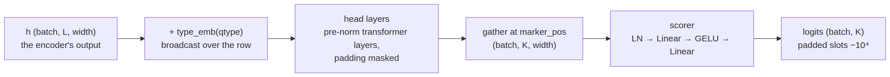
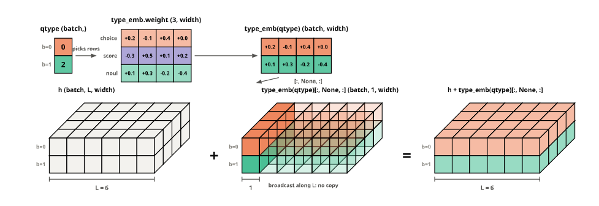
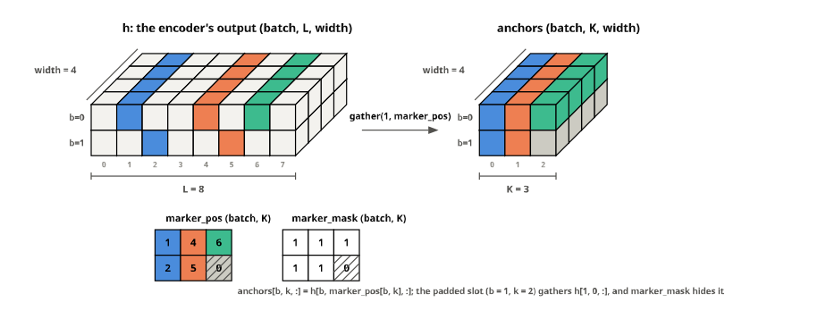
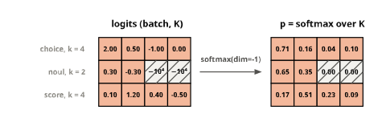
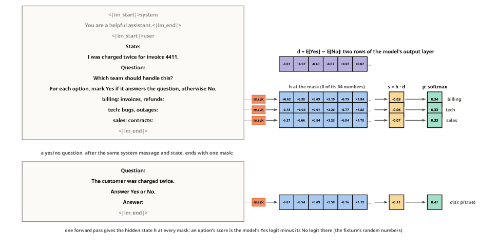

# models


<!-- WARNING: THIS FILE WAS AUTOGENERATED! DO NOT EDIT! -->

Everything downstream of the encoder needs only a hidden state per
position and the positions of the anchors. So an encoder is described by
a few facts, its width, its context, its family and modality, its
special tokens, and the head is sized from them. The tests use the
fixture encoder, a random four-layer, 64-wide ModernBERT:

``` python
FIX = "fixtures/tiny-modernbert"
AutoConfig.from_pretrained(FIX)
```

    ModernBertConfig {
      "architectures": [
        "ModernBertModel"
      ],
      "attention_bias": false,
      "attention_dropout": 0.0,
      "bos_token_id": 1,
      "classifier_activation": "gelu",
      "classifier_bias": false,
      "classifier_dropout": 0.0,
      "classifier_pooling": "cls",
      "cls_token_id": 1,
      "decoder_bias": true,
      "deterministic_flash_attn": false,
      "dtype": "float32",
      "embedding_dropout": 0.0,
      "eos_token_id": 2,
      "global_attn_every_n_layers": 2,
      "hidden_activation": "gelu",
      "hidden_size": 64,
      "initializer_cutoff_factor": 2.0,
      "initializer_range": 0.02,
      "intermediate_size": 96,
      "layer_types": [
        "full_attention",
        "sliding_attention",
        "full_attention",
        "sliding_attention"
      ],
      "local_attention": 64,
      "max_position_embeddings": 1024,
      "mlp_bias": false,
      "mlp_dropout": 0.0,
      "model_type": "modernbert",
      "norm_bias": false,
      "norm_eps": 1e-05,
      "num_attention_heads": 2,
      "num_hidden_layers": 4,
      "pad_token_id": 3,
      "rope_parameters": {
        "full_attention": {
          "rope_theta": 160000.0,
          "rope_type": "default"
        },
        "sliding_attention": {
          "rope_theta": 10000.0,
          "rope_type": "default"
        }
      },
      "sep_token_id": 2,
      "sparse_pred_ignore_index": -100,
      "sparse_prediction": false,
      "tie_word_embeddings": true,
      "transformers_version": "5.17.0",
      "vocab_size": 2048
    }

## EncoderSpec

[`EncoderSpec.from_pretrained`](https://sgaseretto.github.io/sysonelib/models.html#encoderspec.from_pretrained)
reads the config and the tokenizer (or processor) once. Known families
ship their row template and their LoRA targets; any other encoder whose
tokenizer defines cls, sep and mask gets Laya’s template through the
`auto` preset, and anything else must name a
[`RowTemplate`](https://sgaseretto.github.io/sysonelib/template.html#rowtemplate).
Checkpoints that are not plain transformers models (a GLiNER2
checkpoint, whose encoder sits inside it) are recognised by *sources*
registered in `ENCODER_SOURCES`; see the GLiNER encoder notebook. A
model type transformers doesn’t know but a sysone module registers
(`a2d-qwen3`, a [masked diffusion model](24_mdlm.ipynb)) is listed in
`MODEL_TYPES`;
[`ensure_model_type`](https://sgaseretto.github.io/sysonelib/models.html#ensure_model_type)
imports that module before the config is read, here and when an export
is loaded, so such checkpoints load with sysone’s classes and never with
remote code.

------------------------------------------------------------------------

<a
href="https://github.com/sgaseretto/sysonelib/blob/main/sysone/models.py#L60"
target="_blank" style="float:right; font-size:smaller">source</a>

### EncoderSpec

``` python
def EncoderSpec(
    id:str, config, tokenizer, processor:NoneType=None, revision:str | None=None, source:str='transformers',
    template:sysone.template.RowTemplate | None=None, loader:NoneType=None, streams:list | None=None
):
```

*What an encoder checkpoint offers: width, context, family, modality,
special tokens, default template, side streams*

------------------------------------------------------------------------

<a
href="https://github.com/sgaseretto/sysonelib/blob/main/sysone/models.py#L52"
target="_blank" style="float:right; font-size:smaller">source</a>

### ensure_model_type

``` python
def ensure_model_type(
    src:NoneType=None, revision:str | None=None, model_type:str | None=None
):
```

*Import the sysone module that registers a model type with transformers
(`model_type`, or the one `src`’s config names), when it is one of
sysone’s own*

------------------------------------------------------------------------

<a
href="https://github.com/sgaseretto/sysonelib/blob/main/sysone/models.py#L46"
target="_blank" style="float:right; font-size:smaller">source</a>

### ensure_source

``` python
def ensure_source(
    source:str | None
):
```

*Import the sysone module that registers `source`, when it is one of
sysone’s own*

------------------------------------------------------------------------

<a
href="https://github.com/sgaseretto/sysonelib/blob/main/sysone/models.py#L118"
target="_blank" style="float:right; font-size:smaller">source</a>

### EncoderSpec.to_json

``` python
def to_json()->dict:
```

*The encoder reference written to `sysone.json`*

------------------------------------------------------------------------

<a
href="https://github.com/sgaseretto/sysonelib/blob/main/sysone/models.py#L113"
target="_blank" style="float:right; font-size:smaller">source</a>

### EncoderSpec.builder

``` python
def builder(
    template:NoneType=None, tfms:NoneType=None
)->sysone.template.RowBuilder:
```

*A
[`RowBuilder`](https://sgaseretto.github.io/sysonelib/template.html#rowbuilder)
on this encoder’s tokenizer (or processor), with its side streams*

------------------------------------------------------------------------

<a
href="https://github.com/sgaseretto/sysonelib/blob/main/sysone/models.py#L106"
target="_blank" style="float:right; font-size:smaller">source</a>

### EncoderSpec.lora_targets

``` python
def lora_targets():
```

*Default LoRA target modules for this family*

------------------------------------------------------------------------

<a
href="https://github.com/sgaseretto/sysonelib/blob/main/sysone/models.py#L101"
target="_blank" style="float:right; font-size:smaller">source</a>

### EncoderSpec.specials

``` python
def specials()->dict:
```

*The tokenizer’s special tokens*

``` python
spec = EncoderSpec.from_pretrained(FIX)
spec
```

    EncoderSpec(fixtures/tiny-modernbert: modernbert, width 64, context 1024, text, template laya)

``` python
test_eq((spec.width, spec.context, spec.family, spec.modality), (64, 1024, "modernbert", "text"))
test_eq(spec.template.name, "laya")
test_eq(spec.specials["mask"], "[MASK]")
test_eq(spec.lora_targets, r".*\.attn\.(Wqkv|Wo)")
```

`load_encoder` loads the weights; the encoder is a plain `AutoModel`,
returning `last_hidden_state`. It loads in float32 by default, whatever
dtype the checkpoint was saved in (NeoMME’s is bf16), so the features a
head trains on are the features it is served; mixed precision is the
Trainer’s business. Sources that load differently set `loader`:

------------------------------------------------------------------------

<a
href="https://github.com/sgaseretto/sysonelib/blob/main/sysone/models.py#L125"
target="_blank" style="float:right; font-size:smaller">source</a>

### EncoderSpec.load_encoder

``` python
def load_encoder(
    dtype:torch.dtype=torch.float32, **kw
):
```

*The encoder model, returning one hidden state per position, in float32
unless told otherwise (‘auto’: the checkpoint’s)*

``` python
enc = spec.load_encoder()
type(enc).__name__, sum(p.numel() for p in enc.parameters())
```

    ('ModernBertModel', 270912)

## DecisionHead

Laya’s head: a type embedding (3 × width) added to every position,
`layers` pre-norm transformer layers (width / 64 heads, feed-forward 4 ×
width), and one shared scorer that maps each anchor vector to one logit,
LayerNorm → Linear → GELU → Linear. A softmax across a row’s anchors
gives the option probabilities. `layers=0` keeps only the scorer, the
cheapest regime and the one a cache of anchor vectors supports;
`scorer="linear"` is a single linear map, the logistic-regression
baseline.

*z*<sub>*i*</sub> = *w*<sub>2</sub><sup>⊤</sup> GELU (*W*<sub>1</sub> LN(*h*<sub>*m*<sub>*i*</sub></sub>) + *b*<sub>1</sub>) + *b*<sub>2</sub>,   *p* = softmax(*z*/*T*)

The modules are laid out as Laya lays them out, so the parameters map
one to one onto a Laya checkpoint (`blocks.i` is Laya’s
`head.layers.i`). The forward pass, in order:

<div>

<figure class=''>

<div>



</div>

</figure>

</div>

------------------------------------------------------------------------

<a
href="https://github.com/sgaseretto/sysonelib/blob/main/sysone/models.py#L161"
target="_blank" style="float:right; font-size:smaller">source</a>

### DecisionHead

``` python
def DecisionHead(
    width:int, # the encoder's hidden size
    layers:int=2, # transformer layers over the encoder output; 0 scores the anchors directly
    scorer:str='laya', # "laya", "mlp", "linear", "gliner2", "pair" or "yesno"
    dropout:float=0.1, # dropout in the transformer layers
    nhead:int | None=None, # attention heads; width // 64 by default
    init_from:str | None=None, # a Laya checkpoint, a sysone export or a GLiNER2 checkpoint to copy weights from
    standardize:bool=False, # standardise the encoder's output per dimension before anything else (see `fit_standardizer`)
    readout:str='anchor', # an option's vector: the one at its "anchor", or the mean over its own tokens ("span")
    query:str | None=None, # a vector the pair scorer and the act head read: "first" (the row's first position) or "stream:<name>"
    query_width:int | None=None, # a side stream query's width
    pair_dim:int=256, # the pair scorer's projection width
    act:bool=False, # an act head, Laya's: whether to act on the answer or escalate the case
):
```

*Type embedding, `layers` transformer layers and a shared scorer over
the options; optionally a query vector and an act head*

------------------------------------------------------------------------

<a
href="https://github.com/sgaseretto/sysonelib/blob/main/sysone/models.py#L150"
target="_blank" style="float:right; font-size:smaller">source</a>

### make_scorer

``` python
def make_scorer(
    kind:str, width:int, query_width:int | None=None, dim:int=256
)->torch.nn.modules.module.Module:
```

*The per-option scorer: `laya` (alias `mlp`), `linear`, `gliner2`
(GLiNER2’s classifier MLP), `pair` (against a query vector), or `yesno`
(a language model’s own Yes/No)*

------------------------------------------------------------------------

<a
href="https://github.com/sgaseretto/sysonelib/blob/main/sysone/models.py#L141"
target="_blank" style="float:right; font-size:smaller">source</a>

### YesNoScorer

``` python
def YesNoScorer(
    width:int
):
```

*A language model’s own answer at a slot: the log-odds of its Yes token
over its No token, h·(E_Yes − E_No), with a learned correction and
scale*

------------------------------------------------------------------------

<a
href="https://github.com/sgaseretto/sysonelib/blob/main/sysone/models.py#L131"
target="_blank" style="float:right; font-size:smaller">source</a>

### PairScorer

``` python
def PairScorer(
    width:int, query_width:int, dim:int=256
):
```

*Scores an option vector against a query vector: an MLP over \[o, q,
o·q\], both projected to `dim` first*

------------------------------------------------------------------------

<a
href="https://github.com/sgaseretto/sysonelib/blob/main/sysone/models.py#L285"
target="_blank" style="float:right; font-size:smaller">source</a>

### DecisionHead.fit_standardizer

``` python
def fit_standardizer(
    vectors, query:NoneType=None
):
```

*Set the per-dimension mean and standard deviation from encoder vectors
(…, width), and a stream query’s from `query` (n, query_width)*

------------------------------------------------------------------------

<a
href="https://github.com/sgaseretto/sysonelib/blob/main/sysone/models.py#L279"
target="_blank" style="float:right; font-size:smaller">source</a>

### DecisionHead.standardizer_fitted

``` python
def standardizer_fitted()->bool:
```

*Whether the standardisation’s statistics have been set (a head without
one needs none)*

------------------------------------------------------------------------

<a
href="https://github.com/sgaseretto/sysonelib/blob/main/sysone/models.py#L258"
target="_blank" style="float:right; font-size:smaller">source</a>

### DecisionHead.forward_anchors

``` python
def forward_anchors(
    anchors, marker_mask, qtype, query:NoneType=None, first:NoneType=None, marker_pos:NoneType=None
):
```

*Logits from cached option vectors (batch, K, width), with the cached
first position and query when the head reads them; only for `layers=0`*

------------------------------------------------------------------------

<a
href="https://github.com/sgaseretto/sysonelib/blob/main/sysone/models.py#L250"
target="_blank" style="float:right; font-size:smaller">source</a>

### DecisionHead.forward

``` python
def forward(
    h, attention_mask, marker_pos, marker_mask, qtype, spans:NoneType=None, query:NoneType=None
):
```

*Logits (batch, K) from the encoder’s hidden states (batch, L, width);
`(logits, act_logits)` with an act head*

------------------------------------------------------------------------

<a
href="https://github.com/sgaseretto/sysonelib/blob/main/sysone/models.py#L235"
target="_blank" style="float:right; font-size:smaller">source</a>

### shared_pairs

``` python
def shared_pairs(
    z, marker_pos, marker_mask
):
```

*Logits where a two-option row whose markers are one slot reads that
slot’s score s as the pair (0, s): its no, then its yes*

------------------------------------------------------------------------

<a
href="https://github.com/sgaseretto/sysonelib/blob/main/sysone/models.py#L218"
target="_blank" style="float:right; font-size:smaller">source</a>

### DecisionHead.score

``` python
def score(
    m, marker_mask, query:NoneType=None
):
```

*Logits from option vectors (batch, K, width), against `query` when the
scorer pairs; padded options get -1e4*

``` python
torch.manual_seed(0)
head = DecisionHead(64, layers=2)
h = torch.randn(3, 10, 64)
att = torch.ones(3, 10, dtype=torch.long); att[2, 7:] = 0
mpos = torch.tensor([[1, 4, 6], [2, 5, 0], [1, 3, 5]]); mmask = torch.tensor([[1, 1, 1], [1, 1, 0], [1, 1, 1]]).bool()
qt = torch.tensor([0, 2, 1])
logits = head(h, att, mpos, mmask, qt)
test_eq(logits.shape, (3, 3))
test_eq(logits[1, 2].item(), -1e4)
head
```

    DecisionHead(
      (type_emb): Embedding(3, 64)
      (blocks): ModuleList(
        (0-1): 2 x TransformerEncoderLayer(
          (self_attn): MultiheadAttention(
            (out_proj): NonDynamicallyQuantizableLinear(in_features=64, out_features=64, bias=True)
          )
          (linear1): Linear(in_features=64, out_features=256, bias=True)
          (dropout): Dropout(p=0.1, inplace=False)
          (linear2): Linear(in_features=256, out_features=64, bias=True)
          (norm1): LayerNorm((64,), eps=1e-05, elementwise_affine=True, bias=True)
          (norm2): LayerNorm((64,), eps=1e-05, elementwise_affine=True, bias=True)
          (dropout1): Dropout(p=0.1, inplace=False)
          (dropout2): Dropout(p=0.1, inplace=False)
        )
      )
      (scorer): Sequential(
        (0): LayerNorm((64,), eps=1e-05, elementwise_affine=True, bias=True)
        (1): Linear(in_features=64, out_features=64, bias=True)
        (2): GELU(approximate='none')
        (3): Linear(in_features=64, out_features=1, bias=True)
      )
    )

The three tensor operations of that pass, drawn from tensors the head’s
code produces (the drawings are in
[figures](90_figures.ipynb#the-type-embedding-broadcast-over-a-row)).
First, the type embedding: one row of `type_emb.weight` per example,
broadcast along the sequence without a copy, so the same anchors read
differently in a score row than in a choice row:

<figure>

<figcaption aria-hidden="true">The type embedding picked by qtype and
broadcast over the row</figcaption>
</figure>

Then the gather: one vector per option, the one at its anchor, picked by
`torch.gather` along the sequence axis. A padded option slot points at
position 0 and gathers a meaningless vector, which the mask hides in the
next step:

<figure>

<figcaption aria-hidden="true">torch.gather at marker_pos, from (batch,
L, width) to (batch, K, width)</figcaption>
</figure>

Last, the scorer turns each anchor vector into a logit, the padded slots
are set to −10<sup>4</sup>, and a softmax across the options, applied by
the loss or the
[`Decider`](https://sgaseretto.github.io/sysonelib/inference.html#decider),
gives them exactly zero probability:

<figure>

<figcaption aria-hidden="true">Logits with padded slots at -10^4 and
their softmax</figcaption>
</figure>

With no layers, scoring cached anchor vectors gives exactly what
gathering from the hidden states gives, because the type embedding is
the same for every position of a row:

``` python
h0 = DecisionHead(64, layers=0).eval()
full = h0(h, att, mpos, mmask, qt)
anchors = torch.gather(h, 1, mpos[:, :, None].expand(-1, -1, 64))
test_close(h0.forward_anchors(anchors, mmask, qt), full)
test_fail(lambda: head.forward_anchors(anchors, mmask, qt), contains="without layers")
```

### A language model’s own Yes and No

A generative model can score an option without a new head: write the
option with an answer slot after it, a mask, and read how much more the
model wants to put *Yes* there than *No*. Its output layer turns the
hidden state h at the slot into a logit per token, so that preference is

*s* = *z*<sub>Yes</sub> − *z*<sub>No</sub> = *h* ⋅ (*E*<sub>Yes</sub> − *E*<sub>No</sub>),

with E the output embeddings (the input embeddings, when they are tied).
It’s one linear direction. The `yesno` scorer holds it, plus a learned
correction δ and a learned scale:
*s* = *e*<sup>*λ*</sup> *h* ⋅ (*E*<sub>Yes</sub> − *E*<sub>No</sub> + *δ*),
δ and λ starting at 0. `init_yesno` copies the two rows in and zeroes
the type embedding, so before any training the head *is* the model’s own
answer, the zero-shot reading jev-dllm uses. The direction is a buffer,
not a parameter: it’s saved with the head, and a training regime that
makes every head parameter trainable leaves it alone.

A choice reads s at each option’s slot and takes the softmax across
options. A yes/no question asked at a single slot (a *shared slot*, see
[template](01_template.ipynb#options-blocks-per-kind-and-chat-rows)) has
both its options’ markers at that one position; the head reads such a
pair as (0, s), its no and its yes, so p(yes) = σ(s), exactly the
softmax over the model’s own logits for No and Yes at that mask.
[`shared_pairs`](https://sgaseretto.github.io/sysonelib/models.html#shared_pairs)
applies this rule for every scorer, on cached anchors too.

<figure>

<figcaption aria-hidden="true">A jev row’s masks, the hidden state at
each, its product with E[Yes] − E[No], and the softmax across the
options; a yes/no question’s one mask and σ(s)</figcaption>
</figure>

The [diffusion model](24_mdlm.ipynb#reading-a-decision-yes-against-no)
reads its decisions this way; the figure is its fixture’s
([figures](90_figures.ipynb#yes-against-no-at-each-mask)).

------------------------------------------------------------------------

<a
href="https://github.com/sgaseretto/sysonelib/blob/main/sysone/models.py#L299"
target="_blank" style="float:right; font-size:smaller">source</a>

### DecisionHead.init_yesno

``` python
def init_yesno(
    encoder, tokenizer, yes:str='Yes', no:str='No'
):
```

*Start a `yesno` head as the model’s own answer: copy its Yes and No
embedding rows (its tied output layer), and zero the type embedding*

``` python
fx_tok = AutoTokenizer.from_pretrained("fixtures/tiny-modernbert"); fx_enc = AutoModel.from_pretrained("fixtures/tiny-modernbert")
yes, no = " the", " of"                                        # two one-token words of the fixture's vocabulary stand in for Yes and No
yh = DecisionHead(64, layers=0, scorer="yesno").init_yesno(fx_enc, fx_tok, yes=yes, no=no).eval()
E = fx_enc.get_input_embeddings().weight
d = E[fx_tok(yes, add_special_tokens=False)["input_ids"][0]] - E[fx_tok(no, add_special_tokens=False)["input_ids"][0]]
z = yh(h, att, mpos, mmask, qt)
test_close(z[0], (anchors[0] @ d).detach(), eps=1e-4)                      # untrained: exactly the model's Yes−No logit at each slot
test_eq(float(yh.type_emb.weight.abs().sum()), 0.0)
test_eq(sorted(n for n, _ in yh.named_parameters() if n.startswith("scorer")), ["scorer.delta", "scorer.log_scale"])
test_eq("scorer.w0" in yh.state_dict(), True)                                # the direction is saved with the head
again = DecisionHead.from_config(yh.config()); again.load_state_dict(yh.state_dict())
test_close(again.eval()(h, att, mpos, mmask, qt), z)
test_fail(lambda: DecisionHead(64, layers=0).init_yesno(fx_enc, fx_tok), contains="scorer='yesno'")
test_fail(lambda: yh.init_yesno(fx_enc, fx_tok, yes="Yes, certainly"), contains="one token")
```

``` python
pos2 = torch.tensor([[3, 3, 0], [2, 5, 0], [1, 3, 5]]); mask2 = torch.tensor([[1, 1, 0], [1, 1, 0], [1, 1, 1]]).bool()
z2 = yh(h, att, pos2, mask2, qt)
s = (h[0, 3] @ d).item()
test_close(z2[0, :2], torch.tensor([0.0, s]), eps=1e-4)                     # one slot read twice: (no, yes) = (0, s)
test_close(z2[0, :2].softmax(-1)[1], torch.sigmoid(torch.tensor(s)), eps=1e-5)
test_close(z2[1:], yh(h[1:], att[1:], pos2[1:], mask2[1:], qt[1:]))          # other rows as before
anch2 = torch.gather(h, 1, pos2[:, :, None].expand(-1, -1, 64))
test_close(yh.forward_anchors(anch2, mask2, qt, marker_pos=pos2), z2)          # the cached path reads the pair the same way
```

### Readouts and queries

Two further choices shape how the head reads a row.

**The readout** is the vector an option is scored from. Laya’s is the
anchor’s (`readout="anchor"`): the `[MASK]` placed before the option, a
position a fine-tuned encoder learns to fill with what the option means
in context. A frozen encoder was never taught that, and its anchor
vector says more about what word could stand there than about the option
after it. `readout="span"` reads the option instead, as the mean of the
vectors over its own tokens (the row’s `spans`, recorded by the
builder). An empty span falls back to the anchor.

**The query** is a vector the options are scored against.
`scorer="pair"` scores option *o* against query *q* with an MLP over
\[*W*<sub>*o*</sub>*o*; *W*<sub>*q*</sub>*q*; *W*<sub>*o*</sub>*o* ⊙ *W*<sub>*q*</sub>*q*\],
both projected to `pair_dim` first. With `query="first"` the query is
the row’s first position, `[CLS]`, which has read the question and the
whole state. With `query="stream:<name>"` it is the pooled vector of a
side stream: the protein, for an encoder whose text stream never sees
the protein (see [side streams](#side-streams-two-tower-encoders)
below). That is late fusion, and the head is where the two streams meet.

``` {mermaid}
flowchart LR
    H["h (batch, L, width)"] --> R{"readout"}
    R -- anchor --> A["h at each anchor"]
    R -- span --> S["mean of h over<br/>each option's tokens"]
    Q["query: h[:, 0], or a side<br/>stream's pooled vector"] --> P["pair scorer<br/>MLP[W_o o; W_q q; W_o o ⊙ W_q q]"]
    A --> P
    S --> P
    P --> Z["logits (batch, K)"]
```

``` python
torch.manual_seed(0)
hs_ = torch.randn(2, 8, 64); att2 = torch.ones(2, 8, dtype=torch.long)
mp2 = torch.tensor([[1, 4], [2, 5]]); mm2 = torch.ones(2, 2, dtype=torch.bool); sp2 = torch.tensor([[[2, 4], [5, 8]], [[3, 5], [6, 6]]])
span_head = DecisionHead(64, layers=0, readout="span", scorer="linear").eval()
got = span_head._readout(hs_, mp2, sp2)
test_close(got[0, 0], hs_[0, 2:4].mean(0))
test_close(got[1, 1], hs_[1, 5])                      # an empty span (6, 6) falls back to its anchor at 5
test_fail(lambda: span_head(hs_, att2, mp2, mm2, torch.zeros(2, dtype=torch.long)), contains="option spans")
pair = DecisionHead(64, layers=0, scorer="pair", query="stream:protein", query_width=32).eval()
z = pair(hs_, att2, mp2, mm2, torch.zeros(2, dtype=torch.long), query=torch.randn(2, 32))
test_eq(z.shape, (2, 2))
test_fail(lambda: pair(hs_, att2, mp2, mm2, torch.zeros(2, dtype=torch.long)), contains="no such vector")
test_fail(lambda: DecisionHead(64, scorer="pair"), contains="give the head query")
test_eq(set(DecisionHead.from_config(pair.config()).state_dict()), set(pair.state_dict()))
```

### Acting or escalating

An answer is only useful if it can be trusted, and a decision model
should say when it can’t be. Laya’s act head does this. It is a small
MLP over the row’s first position (`[CLS]`, after the head’s layers) and
four numbers read off the option probabilities: the top probability, its
margin over the second, the entropy normalised by log *k*, and *k*/255.
Its two outputs are *act* (class 0) and *escalate*, and
[`act_probability`](https://sgaseretto.github.io/sysonelib/models.html#act_probability)
is the softmax’s first entry, Laya’s convention. `act=True` adds it;
with a side stream query, the query vector joins the first position, so
the act head sees the protein too. The learner trains it on whether
acting would have been right: the gold is among the options and the top
option is the gold (see [losses](04_losses.ipynb#the-act-head)). It is
not the only way to decide when to act:
`calibrate(act_score="confidence")` thresholds the model’s own
calibrated top probability instead, and on the [protein
tutorial](tutorials/04_protein_decisions.ipynb#acting-or-escalating)’s
questions that rule acted on more of them at the same target accuracy.

``` {mermaid}
flowchart LR
    Z["logits (batch, K)"] --> F["softmax (detached): top-1, margin,<br/>entropy / log k, k / 255"]
    C["h[:, 0], and a stream query"] --> M["MLP (width + 4 → 256 → 2)"]
    F --> M
    M --> A["p(act) = softmax[0]"]
```

------------------------------------------------------------------------

<a
href="https://github.com/sgaseretto/sysonelib/blob/main/sysone/models.py#L323"
target="_blank" style="float:right; font-size:smaller">source</a>

### act_probability

``` python
def act_probability(
    act_logits
):
```

*p(act) from act logits: the first class of a softmax over two, Laya’s
convention*

``` python
ha = DecisionHead(64, layers=2, act=True).eval()
logits_a, act_a = ha(h, att, mpos, mmask, qt)
test_eq((logits_a.shape, act_a.shape, tuple(ha.act_head[0].weight.shape)), ((3, 3), (3, 2), (256, 68)))   # Laya's shape: width + 4
test_eq(bool(((act_probability(act_a) >= 0) & (act_probability(act_a) <= 1)).all()), True)
hq = DecisionHead(64, layers=0, scorer="pair", query="stream:protein", query_width=32, act=True)
test_eq(tuple(hq.act_head[0].weight.shape), (256, 64 + 32 + 4))
test_fail(lambda: DecisionHead(64, layers=0, act=True).forward_anchors(anchors, mmask, qt), contains="first position")
```

### Standardising the encoder’s output

`standardize=True` subtracts a per-dimension mean from the encoder’s
vectors and divides by a per-dimension standard deviation before the
type embedding, with statistics set once by `fit_standardizer` (the
learner does it from the training rows before the first fit). It is an
affine map of each vector on its own, so applying it before the gather
or to the gathered anchors is the same, and the cached and the live
paths agree. The statistics are buffers: they are saved with the head
and restored with it, and a warm start from a checkpoint without them
leaves them to be fitted.

A side stream’s query has statistics of its own (`q_mean`, `q_std`),
fitted from the query vectors beside the text’s. It exists because of
NeoMME, whose vectors have one channel that carries about 97% of every
vector’s norm (see the [multimodal](20_neomme.ipynb) notebook): a
LayerNorm normalises each vector by its own spread, so after it the
dominant channel still dwarfs the rest, every anchor looks alike, and a
head trained by gradient descent barely moves. Standardising per
dimension, across vectors, puts every channel on the same scale first.
Off by default, it changes nothing for a Laya-shaped head, and a head
that standardises is never written in Laya’s format, whose runtime would
not apply it.

``` python
torch.manual_seed(0)
hs = DecisionHead(64, layers=0, standardize=True).eval()
test_eq(hs.standardizer_fitted, False)
vecs = torch.randn(200, 64) * 0.1; vecs[:, 5] += 50.0              # one channel carries nearly all of every vector's norm
hs.fit_standardizer(vecs)
test_eq(hs.standardizer_fitted, True)
test_close(((vecs - hs.in_mean) / hs.in_std).mean(0), torch.zeros(64), eps=1e-4)
test_close(hs.forward_anchors(anchors, mmask, qt), hs(h, att, mpos, mmask, qt))      # the same through both paths
test_eq({"in_mean", "in_std"} <= set(hs.state_dict()), True)
test_eq(set(DecisionHead(64, layers=0).state_dict()) & {"in_mean", "in_std"}, set())  # off: no extra state
test_fail(lambda: DecisionHead(64).fit_standardizer(vecs), contains="does not standardise")
hqs = DecisionHead(64, layers=0, scorer="pair", query="stream:protein", query_width=32, standardize=True)
test_fail(lambda: hqs.fit_standardizer(vecs), contains="query too")
hqs.fit_standardizer(vecs, query=torch.randn(50, 32) * 3 + 1)
test_eq(hqs.standardizer_fitted, True)
```

### Laya’s parameter names

`laya_names` maps the head’s parameters onto Laya’s (`blocks.i.` ↔
`head.layers.i.`); the scorer and type embedding already share Laya’s
names. A Laya checkpoint’s head loads into a
[`DecisionHead`](https://sgaseretto.github.io/sysonelib/models.html#decisionhead),
and a
[`DecisionHead`](https://sgaseretto.github.io/sysonelib/models.html#decisionhead)
exports into a Laya checkpoint.

------------------------------------------------------------------------

<a
href="https://github.com/sgaseretto/sysonelib/blob/main/sysone/models.py#L332"
target="_blank" style="float:right; font-size:smaller">source</a>

### from_laya_names

``` python
def from_laya_names(
    sd:dict
)->dict:
```

*Laya head keys renamed to
[`DecisionHead`](https://sgaseretto.github.io/sysonelib/models.html#decisionhead)’s,
the act head’s included (other keys dropped)*

------------------------------------------------------------------------

<a
href="https://github.com/sgaseretto/sysonelib/blob/main/sysone/models.py#L328"
target="_blank" style="float:right; font-size:smaller">source</a>

### to_laya_names

``` python
def to_laya_names(
    sd:dict
)->dict:
```

*Head state-dict keys renamed to Laya’s*

``` python
test_eq(sorted(from_laya_names(to_laya_names(head.state_dict()))), sorted(head.state_dict()))
[k for k in to_laya_names(head.state_dict()) if not k.startswith("head.layers.1")][:12]
```

    ['type_emb.weight',
     'head.layers.0.self_attn.in_proj_weight',
     'head.layers.0.self_attn.in_proj_bias',
     'head.layers.0.self_attn.out_proj.weight',
     'head.layers.0.self_attn.out_proj.bias',
     'head.layers.0.linear1.weight',
     'head.layers.0.linear1.bias',
     'head.layers.0.linear2.weight',
     'head.layers.0.linear2.bias',
     'head.layers.0.norm1.weight',
     'head.layers.0.norm1.bias',
     'head.layers.0.norm2.weight']

### Reading tensors without downloading the file

A warm start from Laya’s head needs 25M parameters out of an 842 MB
checkpoint. A safetensors file starts with a JSON header giving every
tensor’s dtype, shape and byte range, so
[`read_tensors`](https://sgaseretto.github.io/sysonelib/models.html#read_tensors)
reads the header and then only the byte ranges it needs, with HTTP range
requests, unless the file is already local or cached:

------------------------------------------------------------------------

<a
href="https://github.com/sgaseretto/sysonelib/blob/main/sysone/models.py#L357"
target="_blank" style="float:right; font-size:smaller">source</a>

### read_tensors

``` python
def read_tensors(
    repo:str, filename:str='model.safetensors', select:NoneType=None, revision:str | None=None
)->dict:
```

*Tensors of a safetensors file (local, cached, or on the Hub via range
requests) whose names pass `select`*

``` python
laya_head = read_tensors("convaiinnovations/laya", select=lambda k: not k.startswith("encoder."))
{k: tuple(v.shape) for k, v in laya_head.items() if not k.startswith("head.layers.1")}
```

    {'temperature': (3,), 'act_head.0.bias': (256,), 'act_head.0.weight': (256, 1028), 'act_head.2.bias': (2,),
     'act_head.2.weight': (2, 256), 'head.layers.0.linear1.bias': (4096,), ..., 'scorer.0.bias': (1024,),
     'scorer.0.weight': (1024,), 'scorer.1.bias': (1024,), 'scorer.1.weight': (1024, 1024), 'scorer.3.bias': (1,),
     'scorer.3.weight': (1, 1024), 'type_emb.weight': (3, 1024)}

`load_from` fills the head from a checkpoint. `checkpoint(src)`
recognises what a folder or a Hub repo holds (optionally a `subfolder`
of it) and returns it typed: a
[`SysoneExport`](https://sgaseretto.github.io/sysonelib/models.html#sysoneexport)
(`head.safetensors`), a
[`LayaCheckpoint`](https://sgaseretto.github.io/sysonelib/models.html#layacheckpoint)
(`rl_agent_config.json`), or a kind another module added to
`CHECKPOINTS` (a
[`GlinerCheckpoint`](https://sgaseretto.github.io/sysonelib/gliner_encoder.html#glinercheckpoint),
in the GLiNER encoder notebook). `warm_start(head, checkpoint)` then
dispatches on the checkpoint’s class (a [generic
function](00_core.ipynb#generic-functions-and-multiple-dispatch)). Its
default method reads `head_weights(checkpoint)` and checks every name
and shape against the head, and a kind with other needs brings its own
method. Shapes must match: Laya’s head is 1,024 wide, so the warm start
is meaningful for ModernBERT-large and nothing else.

------------------------------------------------------------------------

<a
href="https://github.com/sgaseretto/sysonelib/blob/main/sysone/models.py#L441"
target="_blank" style="float:right; font-size:smaller">source</a>

### DecisionHead.load_from

``` python
def load_from(
    src, subfolder:str | None=None, strict:bool=True
):
```

*Copy weights from a Laya checkpoint, a sysone export or any kind in
`CHECKPOINTS`*

------------------------------------------------------------------------

<a
href="https://github.com/sgaseretto/sysonelib/blob/main/sysone/models.py#L407"
target="_blank" style="float:right; font-size:smaller">source</a>

### checkpoint

``` python
def checkpoint(
    src, subfolder:str | None=None
)->__main__.Checkpoint:
```

*The checkpoint at `src`, typed by the first kind in `CHECKPOINTS` whose
files it holds*

------------------------------------------------------------------------

<a
href="https://github.com/sgaseretto/sysonelib/blob/main/sysone/models.py#L388"
target="_blank" style="float:right; font-size:smaller">source</a>

### split_repo

``` python
def split_repo(
    src:str
):
```

*A Hub id with an optional subfolder: ‘owner/repo/sub’ -\>
(‘owner/repo’, ‘sub’); local paths pass through*

------------------------------------------------------------------------

<a
href="https://github.com/sgaseretto/sysonelib/blob/main/sysone/models.py#L386"
target="_blank" style="float:right; font-size:smaller">source</a>

### LayaCheckpoint

``` python
def LayaCheckpoint(
    src:str, subfolder:str | None=None
):
```

*A Laya checkpoint: `rl_agent_config.json`, and the head beside the
encoder in `model.safetensors`*

------------------------------------------------------------------------

<a
href="https://github.com/sgaseretto/sysonelib/blob/main/sysone/models.py#L385"
target="_blank" style="float:right; font-size:smaller">source</a>

### SysoneExport

``` python
def SysoneExport(
    src:str, subfolder:str | None=None
):
```

*A sysone export: the head’s weights in `head.safetensors`*

------------------------------------------------------------------------

<a
href="https://github.com/sgaseretto/sysonelib/blob/main/sysone/models.py#L380"
target="_blank" style="float:right; font-size:smaller">source</a>

### Checkpoint

``` python
def Checkpoint(
    src:str, subfolder:str | None=None
):
```

*A head’s source, a folder or a Hub repo (optionally a `subfolder` of
it): its subclass says what its files hold*

## EncoderDecisionModel

`EncoderDecisionModel(encoder, head)` runs the encoder and the head:
`forward(input_ids, attention_mask, marker_pos, marker_mask, qtype, **encoder_kwargs)`
returns logits of shape (batch, K), or `(logits, act_logits)` with an
act head. A head whose query is a side stream gets it from the encoder’s
output (`encode_full`), and a span readout gets the batch’s `spans`.
Everything the encoder needs beyond ids rides in `encoder_kwargs`
(`pixel_values`, `position_ids`, `image_grid_hw`), so the head, the
gather and the losses never see the modality. Cached features skip the
encoder: `anchors` (batch, K, width) feed a head without layers,
`hidden` (batch, L, width) feed any head. With a frozen encoder
(`frozen=True`) the encoder runs under `no_grad` and stays in eval mode.
An encoder that wants its inputs reshaped, NeoMME’s two-axis positions
or ModernVBERT’s tiles, gets them through
[`encoder_inputs`](https://sgaseretto.github.io/sysonelib/models.html#encoder_inputs),
a [generic
function](00_core.ipynb#generic-functions-and-multiple-dispatch)
dispatched on the encoder’s config class, to which its adapter adds a
method.

------------------------------------------------------------------------

<a
href="https://github.com/sgaseretto/sysonelib/blob/main/sysone/models.py#L452"
target="_blank" style="float:right; font-size:smaller">source</a>

### EncoderDecisionModel

``` python
def EncoderDecisionModel(
    encoder:torch.nn.modules.module.Module, head:__main__.DecisionHead, spec:__main__.EncoderSpec | None=None
):
```

*An encoder and a
[`DecisionHead`](https://sgaseretto.github.io/sysonelib/models.html#decisionhead):
logits over each row’s options*

------------------------------------------------------------------------

<a
href="https://github.com/sgaseretto/sysonelib/blob/main/sysone/models.py#L504"
target="_blank" style="float:right; font-size:smaller">source</a>

### EncoderDecisionModel.n_params

``` python
def n_params()->dict:
```

*Total and trainable parameter counts, for the encoder and the head*

------------------------------------------------------------------------

<a
href="https://github.com/sgaseretto/sysonelib/blob/main/sysone/models.py#L501"
target="_blank" style="float:right; font-size:smaller">source</a>

### EncoderDecisionModel.device

``` python
def device():
```

------------------------------------------------------------------------

<a
href="https://github.com/sgaseretto/sysonelib/blob/main/sysone/models.py#L498"
target="_blank" style="float:right; font-size:smaller">source</a>

### EncoderDecisionModel.gradient_checkpointing_disable

``` python
def gradient_checkpointing_disable():
```

------------------------------------------------------------------------

<a
href="https://github.com/sgaseretto/sysonelib/blob/main/sysone/models.py#L492"
target="_blank" style="float:right; font-size:smaller">source</a>

### EncoderDecisionModel.gradient_checkpointing_enable

``` python
def gradient_checkpointing_enable(
    gradient_checkpointing_kwargs:NoneType=None, **kw
):
```

*Checkpoint the encoder’s layers (what
`TrainingArguments(gradient_checkpointing=True)` calls; newer
transformers adds `every_n_layers` and `offload`)*

``` python
from transformers import AutoTokenizer
```

``` python
tok = AutoTokenizer.from_pretrained(FIX)
recs = [json.loads(l) for l in Path("fixtures/typed_decisions_tiny.jsonl").read_text().splitlines()]
rows = spec.builder().build_record(recs[0])
batch = collate(rows, tok.pad_token_id)
model = EncoderDecisionModel(enc, DecisionHead(spec.width), spec)
out = model(**{k: v for k, v in batch.items() if k not in ("target", "label")})
test_eq(out.shape, (5, 4))
test_eq("spans" in batch and "answerable" in batch, True)          # both ride in the batch; the model reads spans, ignores answerable
span_model = EncoderDecisionModel(enc, DecisionHead(spec.width, layers=0, readout="span"), spec)
test_eq(span_model(**{k: v for k, v in batch.items() if k not in ("target", "label")}).shape, (5, 4))
test_eq([r.meta["qid"] for r in rows][1], "needs_review")
test_eq((out[1] == -1e4).sum().item(), 2)       # the noul row has two options
out.softmax(-1)[1]
```

    tensor([0.5045, 0.4955, 0.0000, 0.0000], grad_fn=<SelectBackward0>)

``` python
model.gradient_checkpointing_enable(gradient_checkpointing_kwargs=None, every_n_layers=1, offload=False)   # as transformers 5.17's Trainer calls it
test_eq(model.encoder.is_gradient_checkpointing, True)
model.gradient_checkpointing_disable()
```

<div>

> **Finding: newer transformers passes two more arguments to gradient
> checkpointing**
>
> The first T4 job on Colab stopped as training started. transformers
> 5.17’s `Trainer` calls
> `gradient_checkpointing_enable(gradient_checkpointing_kwargs=..., every_n_layers=..., offload=...)`,
> and sysone’s model took only the first argument. Every GPU preset
> turns checkpointing on, so every GPU run on that version stopped
> there. The same preset had trained on Kaggle’s two T4s, whose
> transformers 5.0 passes only the first argument. The model now hands
> every argument on to its encoder; the call above is the one the
> trainer makes.

</div>

## Side streams: two-tower encoders

Some encoders read two inputs with two towers: ProtST pairs ESM (a
protein language model) with PubMedBERT (a biomedical text model), and
CLIP-style models pair an image tower with a text tower.
`StreamEncoder(text, sides)` holds a text encoder and one
[`SideEncoder`](https://sgaseretto.github.io/sysonelib/models.html#sideencoder)
per side stream. The text encoder reads the row as always, and each side
encoder reads its stream’s tokens (the `{name}_input_ids` a
[`TokenStream`](https://sgaseretto.github.io/sysonelib/template.html#tokenstream)
put in the batch) and pools them to one vector, the mean over its
non-special tokens, optionally projected. The output carries the text’s
`last_hidden_state` for the anchors and each stream’s pooled vector in
`stream_vectors`, which a head reads as its query
(`query="stream:<name>"`).

Here the two towers do not talk (late fusion). The text stream never
sees the protein, so all the joining happens in the head, which is
cheap: both towers can stay frozen and cached.
[Cross-attention](#cross-attention-from-a-side-stream) below lets the
text attend to the stream inside the encoder instead.

A side stream is shared by every question about the same state, so one
batch often holds the same protein several times. The side encoder runs
once per distinct input in a batch and hands the result back to every
row that holds it.

<div>

<figure class=''>

<div>


</div>

</figure>

</div>

------------------------------------------------------------------------

<a
href="https://github.com/sgaseretto/sysonelib/blob/main/sysone/models.py#L573"
target="_blank" style="float:right; font-size:smaller">source</a>

### StreamEncoder

``` python
def StreamEncoder(
    text:torch.nn.modules.module.Module, sides:dict
):
```

*A text encoder beside side-stream encoders: with `late` fusion they run
apart and the head joins them; with `xattn` the text attends to a
stream*

------------------------------------------------------------------------

<a
href="https://github.com/sgaseretto/sysonelib/blob/main/sysone/models.py#L565"
target="_blank" style="float:right; font-size:smaller">source</a>

### stream_memo

``` python
def stream_memo(
    module:torch.nn.modules.module.Module
):
```

*While the block runs, every side encoder in `module` encodes each
distinct input once, however the rows are batched (no-grad passes)*

------------------------------------------------------------------------

<a
href="https://github.com/sgaseretto/sysonelib/blob/main/sysone/models.py#L531"
target="_blank" style="float:right; font-size:smaller">source</a>

### SideEncoder

``` python
def SideEncoder(
    model:torch.nn.modules.module.Module, special_ids:tuple=(), proj:__main__.ProjMLP | None=None
):
```

*A side stream’s encoder: a transformers model over its tokens, pooled
to one vector per input (the mean over its non-special tokens,
optionally projected), run once per distinct input of a batch*

------------------------------------------------------------------------

<a
href="https://github.com/sgaseretto/sysonelib/blob/main/sysone/models.py#L526"
target="_blank" style="float:right; font-size:smaller">source</a>

### ProjMLP

``` python
def ProjMLP(
    dims
):
```

*Linear → ReLU → Linear: the projection head of a CLIP-style tower*

------------------------------------------------------------------------

<a
href="https://github.com/sgaseretto/sysonelib/blob/main/sysone/models.py#L517"
target="_blank" style="float:right; font-size:smaller">source</a>

### distinct_rows

``` python
def distinct_rows(
    ids, mask
)->tuple:
```

*The first index of each distinct (ids, mask) row of a batch, and each
row’s distinct index*

------------------------------------------------------------------------

<a
href="https://github.com/sgaseretto/sysonelib/blob/main/sysone/models.py#L512"
target="_blank" style="float:right; font-size:smaller">source</a>

### StreamOutput

``` python
def StreamOutput(
    last_hidden_state:torch.Tensor, stream_vectors:dict=<factory>
)->None:
```

*A stream encoder’s output: the text’s hidden states, and each side
stream’s pooled vector*

On the fixture, the text tower is the tiny ModernBERT and the side tower
a tiny random ESM built from its config. Five questions about three
proteins: the protein tower runs on three rows, and rows with the same
protein get the same vector:

``` python
from transformers import EsmConfig, EsmModel
```

``` python
torch.manual_seed(0)
esm = EsmModel(EsmConfig(vocab_size=33, hidden_size=32, num_hidden_layers=2, num_attention_heads=2, intermediate_size=64,
                         max_position_embeddings=64, pad_token_id=1, mask_token_id=32, position_embedding_type="absolute",
                         token_dropout=False), add_pooling_layer=False).eval()
se = StreamEncoder(spec.load_encoder(), {"protein": SideEncoder(esm, special_ids=(0, 1, 2))}).eval()
EXTRA_COLLATE["protein_input_ids"], EXTRA_COLLATE["protein_attention_mask"] = ("pad_rows", 1), ("pad_rows", 0)
prot = lambda n: {"protein_input_ids": [0] + [4 + (i * 7) % 20 for i in range(n)] + [2], "protein_attention_mask": [1] * (n + 2)}
prows = spec.builder().build_record(recs[0])
for r, n in zip(prows, (10, 10, 6, 6, 14)): r.extras.update(prot(n))
pb = collate(prows, tok.pad_token_id)
pin = {k: v for k, v in pb.items() if k not in ("target", "label")}
enc_in = {k: pin[k] for k in ("input_ids", "attention_mask", "protein_input_ids", "protein_attention_mask")}
seen_rows = []
hook = esm.register_forward_pre_hook(lambda m, a, kw: seen_rows.append(kw["input_ids"].shape[0]), with_kwargs=True)
with torch.no_grad(): sout = se(**enc_in)
hook.remove()
test_eq((sout.last_hidden_state.shape[0], sout.stream_vectors["protein"].shape, seen_rows), (5, (5, 32), [3]))
test_close(sout.stream_vectors["protein"][0], sout.stream_vectors["protein"][1])
pm = EncoderDecisionModel(se, DecisionHead(spec.width, layers=0, scorer="pair", query="stream:protein", query_width=32), spec).eval()
with torch.no_grad(): test_eq(pm(**pin).shape, (5, 4))
test_fail(lambda: EncoderDecisionModel(spec.load_encoder(), pm.head, spec)(**{k: v for k, v in pin.items() if not k.startswith("protein")}),
          contains="did not return")
```

The distinct-input rule works within a batch. A pass over many rows,
such as a feature cache’s, batches them by length, so the rows of one
protein usually land in different batches and the protein tower would
run once per question. `stream_memo(encoder)` makes every side encoder
remember the vectors it has computed while the block runs, and so each
distinct input runs once per pass. It only applies to no-grad passes,
where a vector can be reused, and the feature cache encodes under it.
Here, a second pass over the same three proteins, in another order,
doesn’t run the protein tower at all:

``` python
calls = []
hook = esm.register_forward_pre_hook(lambda m, a, kw: calls.append(kw["input_ids"].shape[0]), with_kwargs=True)
with torch.no_grad(), stream_memo(se):
    first_pass = se(**enc_in).stream_vectors["protein"]
    second_pass = se(**{k: v[[4, 3, 2, 1, 0]] for k, v in enc_in.items()}).stream_vectors["protein"]
hook.remove()
test_eq(calls, [3])
test_close(first_pass, sout.stream_vectors["protein"], eps=1e-6); test_close(second_pass, first_pass[[4, 3, 2, 1, 0]], eps=1e-6)
test_eq(se.sides["protein"].memo, None)
```

## Regimes

The regime says what trains. `head` trains the head only, with the
encoder frozen; with a feature cache the encoder does not even run after
one pass. `lora` puts LoRA adapters on the attention projections, `mica`
is LoRA with MiCA’s initialisation (B from the smallest singular vectors
of the weight, frozen; A trains), and `full` trains everything, with
discriminative learning rates set by the learner. A `peft` config
instance works too. The adapters live in the encoder, which becomes a
`PeftModel`; nothing else changes.

<table>
<colgroup>
<col style="width: 20%" />
<col style="width: 20%" />
<col style="width: 20%" />
<col style="width: 20%" />
<col style="width: 20%" />
</colgroup>
<thead>
<tr>
<th><code>train=</code></th>
<th>encoder</th>
<th>adapters</th>
<th>head</th>
<th>feature cache</th>
</tr>
</thead>
<tbody>
<tr>
<td><code>"head"</code></td>
<td>frozen, eval mode, no gradient</td>
<td>none</td>
<td>trains</td>
<td>yes: the encoder runs once</td>
</tr>
<tr>
<td><code>"lora"</code></td>
<td>frozen</td>
<td>A and B train</td>
<td>trains</td>
<td>no</td>
</tr>
<tr>
<td><code>"mica"</code></td>
<td>frozen</td>
<td>A trains; B frozen at the weight’s minor singular vectors</td>
<td>trains</td>
<td>no</td>
</tr>
<tr>
<td><code>"full"</code></td>
<td>trains, at a quarter of the head’s learning rate</td>
<td>none</td>
<td>trains</td>
<td>no</td>
</tr>
<tr>
<td><code>"xattn"</code></td>
<td>frozen, but runs with gradients</td>
<td>the cross-attention blocks and their projection train</td>
<td>trains</td>
<td>no</td>
</tr>
</tbody>
</table>

------------------------------------------------------------------------

<a
href="https://github.com/sgaseretto/sysonelib/blob/main/sysone/models.py#L634"
target="_blank" style="float:right; font-size:smaller">source</a>

### thaw_adapters

``` python
def thaw_adapters(
    model:__main__.EncoderDecisionModel
)->__main__.EncoderDecisionModel:
```

*Make trainable again exactly the adapter parameters
[`set_regime`](https://sgaseretto.github.io/sysonelib/models.html#set_regime)
made trainable*

------------------------------------------------------------------------

<a
href="https://github.com/sgaseretto/sysonelib/blob/main/sysone/models.py#L609"
target="_blank" style="float:right; font-size:smaller">source</a>

### set_regime

``` python
def set_regime(
    model:__main__.EncoderDecisionModel, regime:str='head', **lora_kw
)->__main__.EncoderDecisionModel:
```

*Set what trains: ‘head’, ‘lora’, ‘mica’, ‘full’, ‘xattn’ (a stream
encoder’s cross-attention), or a peft config*

------------------------------------------------------------------------

<a
href="https://github.com/sgaseretto/sysonelib/blob/main/sysone/models.py#L601"
target="_blank" style="float:right; font-size:smaller">source</a>

### lora_config

``` python
def lora_config(
    regime:str='lora', spec:__main__.EncoderSpec | None=None, r:int=8, alpha:int=16, dropout:float=0.05,
    targets:NoneType=None, **kw
):
```

*The `peft.LoraConfig` of the `lora` or `mica` regime*

``` python
def fresh(regime, **kw):
    torch.manual_seed(0)
    return set_regime(EncoderDecisionModel(spec.load_encoder(), DecisionHead(spec.width), spec), regime, **kw)

m_head, m_lora, m_full = fresh("head"), fresh("lora"), fresh("full")
{n: m.n_params() for n, m in [("head", m_head), ("lora", m_lora), ("full", m_full)]}
```

    {'head': {'encoder': 270912, 'head': 104513, 'trainable': 104513},
     'lora': {'encoder': 283200, 'head': 104513, 'trainable': 116801},
     'full': {'encoder': 270912, 'head': 104513, 'trainable': 375425}}

``` python
test_eq(m_head.n_params()["trainable"], m_head.n_params()["head"])
assert m_head.n_params()["head"] < m_lora.n_params()["trainable"] < m_full.n_params()["trainable"]
lora_names = [n for n, p in m_lora.encoder.named_parameters() if p.requires_grad]
assert all("lora_" in n and ".attn." in n for n in lora_names)
m_head.train(); test_eq(m_head.encoder.training, False)
```

<div>

> **Finding: BERT’s LoRA targets match nothing in ModernBERT**
>
> The usual LoRA targets, `query`, `key` and `value`, are BERT’s names.
> ModernBERT projects queries, keys and values with one fused `Wqkv`,
> and it has a `Wo` twice per layer: the attention’s output (`attn.Wo`)
> and the MLP’s (`mlp.Wo`). So BERT’s list finds nothing and peft
> refuses the model, and a plain `["Wqkv", "Wo"]` would also put
> adapters on the MLP; the family table’s target is a regular expression
> that keeps them on the attention:

</div>

``` python
test_fail(lambda: set_regime(EncoderDecisionModel(spec.load_encoder(), DecisionHead(spec.width), spec), lora_config(targets=["query", "key", "value"])),
          contains="not found in the base model")
names = [n for n, _ in spec.load_encoder().named_modules()]
[n for n in names if n.startswith("layers.0.") and n.endswith(("Wqkv", "Wo"))], [n for n in names if re.fullmatch(spec.lora_targets, n)][:4]
```

    (['layers.0.attn.Wqkv', 'layers.0.attn.Wo', 'layers.0.mlp.Wo'],
     ['layers.0.attn.Wqkv',
      'layers.0.attn.Wo',
      'layers.1.attn.Wqkv',
      'layers.1.attn.Wo'])

A frozen encoder gets no gradient, a LoRA one only on its adapters:

``` python
inputs = {k: v for k, v in batch.items() if k not in ("target", "label")}
for m in (m_head, m_lora):
    m.train(); m.zero_grad()
    m(**inputs).logsumexp(-1).sum().backward()
test_eq(all(p.grad is None for p in m_head.encoder.parameters()), True)
assert all(p.grad is not None for n, p in m_lora.encoder.named_parameters() if p.requires_grad)
```

`freeze_to(n)` freezes the embeddings and the first n layers of the
encoder, fastai style, for partial fine-tuning; `unfreeze` undoes it.
The layers are found as the encoder’s longest `ModuleList` of identical
blocks, so it works across families:

------------------------------------------------------------------------

<a
href="https://github.com/sgaseretto/sysonelib/blob/main/sysone/models.py#L652"
target="_blank" style="float:right; font-size:smaller">source</a>

### freeze_to

``` python
def freeze_to(
    model:__main__.EncoderDecisionModel, n:int
):
```

*Freeze the encoder’s embeddings and its first n layers; train the rest
(on an adapter model, the rest’s adapters)*

------------------------------------------------------------------------

<a
href="https://github.com/sgaseretto/sysonelib/blob/main/sysone/models.py#L643"
target="_blank" style="float:right; font-size:smaller">source</a>

### encoder_layers

``` python
def encoder_layers(
    encoder:torch.nn.modules.module.Module
)->torch.nn.modules.container.ModuleList:
```

*The encoder’s stack of transformer layers*

``` python
m = freeze_to(fresh("full"), 2)
layers = encoder_layers(m.encoder)
test_eq([all(p.requires_grad for p in l.parameters()) for l in layers], [False, False, True, True])
test_eq(m.encoder.embeddings.tok_embeddings.weight.requires_grad, False)
```

MiCA trains fewer parameters than LoRA: B is set from the weight’s
smallest singular vectors and frozen, only A trains. On a square
projection that is half of LoRA’s count; ModernBERT’s fused `Wqkv` is
three times as wide as it is tall, so here it is less than half.

``` python
m_mica = fresh("mica")
mica_trainable = sum(p.numel() for p in m_mica.encoder.parameters() if p.requires_grad)
lora_trainable = sum(p.numel() for p in m_lora.encoder.parameters() if p.requires_grad)
assert mica_trainable < lora_trainable
test_eq(all("lora_A" in n for n, p in m_mica.encoder.named_parameters() if p.requires_grad), True)
mica_trainable, lora_trainable
```

    (4096, 12288)

<div>

> **Finding: unfreezing thawed MiCA’s frozen matrices**
>
> The first
> [`Learner.unfreeze`](https://sgaseretto.github.io/sysonelib/learner.html#learner.unfreeze)
> made every adapter parameter trainable again, and on a MiCA run that
> includes the B matrices MiCA keeps frozen: the run silently became
> LoRA with an unusual initialisation.
> [`set_regime`](https://sgaseretto.github.io/sysonelib/models.html#set_regime)
> now records exactly what peft left trainable (`adapter_params`), and
> [`thaw_adapters`](https://sgaseretto.github.io/sysonelib/models.html#thaw_adapters),
> `unfreeze` and
> [`freeze_to`](https://sgaseretto.github.io/sysonelib/models.html#freeze_to)
> restore that set and nothing more.

</div>

The regime remembers which adapter parameters it made trainable, so
thawing after a freeze, or freezing the lower layers, never unfreezes
MiCA’s B matrices:

``` python
set_regime(m_mica, "head"); thaw_adapters(m_mica)
test_eq((sum(p.numel() for p in m_mica.encoder.parameters() if p.requires_grad), m_mica.regime), (mica_trainable, "mica"))
freeze_to(m_mica, 2)
test_eq(any(p.requires_grad for n, p in m_mica.encoder.named_parameters() if "lora_B" in n), False)
test_eq(any(p.requires_grad for n, p in m_mica.encoder.named_parameters() if "layers.3." in n and "lora_A" in n), True)
```

## Cross-attention from a side stream

Late fusion keeps a text encoder that never reads the protein. Design B
in the protein note goes further: it keeps a trained text decision model
whole (Laya’s ModernBERT with its head) and lets its text attend to a
frozen protein encoder’s residue states, through new cross-attention
layers. `add_cross_attention(stream_encoder, stream, every=4)` inserts a
gated cross-attention block after every fourth layer of the text
encoder. Each block reads the side stream’s hidden states, projected to
the text’s width, and adds tanh (*g*) times what it reads. The gate *g*
starts at zero, as in Flamingo, so at the first step the model is
exactly the text model it was, and training opens the gates as the new
path starts to help. The `xattn` regime trains only the projection, the
blocks and the head.

``` {mermaid}
flowchart LR
    P["side stream<br/>(frozen ESM states)"] --> W["projection<br/>to the text width"]
    L1["text layer 4k"] --> X["gated cross-attention<br/>h + tanh(g) · attn(LN(h), memory)"]
    W --> X
    X --> L2["text layer 4k + 1"]
```

------------------------------------------------------------------------

<a
href="https://github.com/sgaseretto/sysonelib/blob/main/sysone/models.py#L702"
target="_blank" style="float:right; font-size:smaller">source</a>

### add_cross_attention

``` python
def add_cross_attention(
    encoder:__main__.StreamEncoder, stream:str, every:int=4, heads:int | None=None
)->__main__.StreamEncoder:
```

*Insert a gated cross-attention block over `stream` after every
`every`-th layer of the text encoder (in place)*

------------------------------------------------------------------------

<a
href="https://github.com/sgaseretto/sysonelib/blob/main/sysone/models.py#L683"
target="_blank" style="float:right; font-size:smaller">source</a>

### XAttnLayer

``` python
def XAttnLayer(
    layer:torch.nn.modules.module.Module, block:__main__.GatedCrossAttention, owner:torch.nn.modules.module.Module,
    stream:str
):
```

*An encoder layer followed by a gated cross-attention block over its
stream encoder’s current memory*

------------------------------------------------------------------------

<a
href="https://github.com/sgaseretto/sysonelib/blob/main/sysone/models.py#L673"
target="_blank" style="float:right; font-size:smaller">source</a>

### GatedCrossAttention

``` python
def GatedCrossAttention(
    width:int, heads:int
):
```

*Text states attend to a side stream’s states; `tanh(gate)` scales what
they read, and the gate starts at 0, so the block starts as the
identity*

On the fixture, cross-attention every second layer of the four-layer
text encoder adds two blocks. With the gates at zero, the text encoder’s
output is exactly what it was. One step of the `xattn` regime moves the
gates, trains only the new parts, and changes the output:

``` python
xse = add_cross_attention(copy.deepcopy(se), "protein", every=2).eval()
with torch.no_grad(): test_close(xse(**enc_in).last_hidden_state, sout.last_hidden_state, eps=1e-6)
test_eq(sum(getattr(l, "is_xattn", False) for l in encoder_layers(xse.text)), 2)
xm = set_regime(EncoderDecisionModel(xse, DecisionHead(spec.width, layers=0), spec), "xattn")
test_eq({n.split(".")[0] for n, p in xm.encoder.named_parameters() if p.requires_grad}, {"text", "proj"})
test_eq(all(".block." in n or n.startswith("proj.") for n, p in xm.encoder.named_parameters() if p.requires_grad), True)
opt = torch.optim.SGD([p for p in xm.parameters() if p.requires_grad], lr=1.0)
nn.functional.cross_entropy(xm(**pin), pb["label"]).backward(); opt.step()
gates = [l.block.gate.item() for l in encoder_layers(xse.text) if getattr(l, "is_xattn", False)]
test_eq(all(g != 0 for g in gates), True)
xm.eval()
with torch.no_grad(): test_ne(xse(**enc_in).last_hidden_state, sout.last_hidden_state)
gates
```

    [1.479590764574823e-06, 7.796261343173683e-07]

### Saving a stream encoder

A stream encoder saves as transformers folders, the text encoder
(without its cross-attention blocks, so any transformers version reads
it) and each side model, plus a small file holding what transformers
does not know: the projections and the cross-attention blocks.
[`load_stream_encoder`](https://sgaseretto.github.io/sysonelib/models.html#load_stream_encoder)
puts it back together. `save_pretrained` calls it, so an export writes a
stream encoder the way it writes any other encoder:

------------------------------------------------------------------------

<a
href="https://github.com/sgaseretto/sysonelib/blob/main/sysone/models.py#L736"
target="_blank" style="float:right; font-size:smaller">source</a>

### load_stream_encoder

``` python
def load_stream_encoder(
    path, dtype:torch.dtype=torch.float32
)->__main__.StreamEncoder:
```

*A stream encoder written by
[`save_stream_encoder`](https://sgaseretto.github.io/sysonelib/models.html#save_stream_encoder)*

------------------------------------------------------------------------

<a
href="https://github.com/sgaseretto/sysonelib/blob/main/sysone/models.py#L714"
target="_blank" style="float:right; font-size:smaller">source</a>

### save_stream_encoder

``` python
def save_stream_encoder(
    enc:__main__.StreamEncoder, path
)->pathlib.Path:
```

*Write a stream encoder: transformers folders for the text and the side
models, and a file for the projections and cross-attention blocks*

``` python
import tempfile
```

``` python
for e in (se, xse):
    back = load_stream_encoder(e.save_pretrained(Path(tempfile.mkdtemp()) / "se")).eval()
    with torch.no_grad():
        a, b = e.eval()(**enc_in), back(**enc_in)
        test_close(b.last_hidden_state, a.last_hidden_state, eps=1e-5)
        test_close(b.stream_vectors["protein"], a.stream_vectors["protein"], eps=1e-5)
test_eq(back.xattn, xse.xattn)
```

## Merging adapters

At export the adapters are merged into the encoder (`merge_and_unload`),
so a LoRA or MiCA run ships as a plain encoder and nothing downstream
needs `peft`:

------------------------------------------------------------------------

<a
href="https://github.com/sgaseretto/sysonelib/blob/main/sysone/models.py#L758"
target="_blank" style="float:right; font-size:smaller">source</a>

### merged_encoder

``` python
def merged_encoder(
    model:__main__.EncoderDecisionModel
)->torch.nn.modules.module.Module:
```

*The encoder with any adapters merged in (a copy; the model keeps its
adapters)*

``` python
m_lora.eval()
with torch.no_grad():
    for p in m_lora.encoder.parameters():
        if p.requires_grad: p.add_(torch.randn_like(p) * 0.05)   # pretend it trained
    before = m_lora(**inputs)
    plain = EncoderDecisionModel(merged_encoder(m_lora), m_lora.head, spec).eval()
    test_close(plain(**inputs), before, eps=1e-4)
test_eq(any("lora_" in n for n, _ in plain.encoder.named_parameters()), False)
```

## Laya checkpoints

A Laya checkpoint is an encoder config, a tokenizer,
`rl_agent_config.json` (head layers, budgets, temperatures) and one
`model.safetensors` holding the encoder (`encoder.*`), the head
(`head.layers.*`, `type_emb`, `scorer`), an action head and a
temperature buffer.
[`load_laya`](https://sgaseretto.github.io/sysonelib/models.html#load_laya)
reads one into an
[`EncoderDecisionModel`](https://sgaseretto.github.io/sysonelib/models.html#encoderdecisionmodel)
plus its template and temperatures, so a Laya checkpoint is also a
sysone model: `Decider.load("convaiinnovations/laya")` works, and
`init_from` can warm-start from it. The action head has no counterpart
in sysone and is dropped.

------------------------------------------------------------------------

<a
href="https://github.com/sgaseretto/sysonelib/blob/main/sysone/models.py#L796"
target="_blank" style="float:right; font-size:smaller">source</a>

### load_laya

``` python
def load_laya(
    src:str, subfolder:str | None=None, revision:str | None=None
):
```

*An
[`EncoderDecisionModel`](https://sgaseretto.github.io/sysonelib/models.html#encoderdecisionmodel),
its tokenizer, template and temperatures from a Laya checkpoint*

------------------------------------------------------------------------

<a
href="https://github.com/sgaseretto/sysonelib/blob/main/sysone/models.py#L765"
target="_blank" style="float:right; font-size:smaller">source</a>

### laya_temperatures

``` python
def laya_temperatures(
    cfg:dict
)->dict:
```

*Laya’s per-type and per-bucket temperatures in sysone’s form*

A Laya checkpoint is also an encoder source:
`EncoderSpec.from_pretrained("convaiinnovations/laya")` reads its
encoder config, tokenizer and budgets, and loads the encoder from its
single weights file. This is how Laya’s own fine-tuning notebook starts,
from the released checkpoint’s encoder and head, so reproducing it is
`decision_learner(data, "convaiinnovations/laya", init_from="convaiinnovations/laya", train="full")`.
A subfolder of a repo that bundles several checkpoints is written
`owner/repo/subfolder`.

Laya’s runtime builds rows with its own rules and runs no sysone
transforms, so the format is written only when the template is Laya’s
(with Laya’s rule of keeping a conversation’s end), the head is Laya’s
shape, and no transform runs at inference.
[`laya_state_dict`](https://sgaseretto.github.io/sysonelib/models.html#laya_state_dict)
goes the other way: the full model under Laya’s names, with a zeroed
one-output action head (Laya’s runtime then reports an action
probability of 1) and the per-type temperatures in the buffer, which is
what `laya.Agent` loads with `strict=True`. The export notebook writes
it next to `rl_agent_config.json`.

------------------------------------------------------------------------

<a
href="https://github.com/sgaseretto/sysonelib/blob/main/sysone/models.py#L839"
target="_blank" style="float:right; font-size:smaller">source</a>

### is_laya_compatible

``` python
def is_laya_compatible(
    model:__main__.EncoderDecisionModel, template:sysone.template.RowTemplate, tfms:tuple=(),
    tokenizer:NoneType=None
)->bool:
```

*Whether an export can also be written in Laya’s format: Laya’s row and
budgets, Laya’s head, no inference transforms*

------------------------------------------------------------------------

<a
href="https://github.com/sgaseretto/sysonelib/blob/main/sysone/models.py#L825"
target="_blank" style="float:right; font-size:smaller">source</a>

### laya_state_dict

``` python
def laya_state_dict(
    model:__main__.EncoderDecisionModel, temperatures:dict | None=None, dtype:NoneType=None
)->dict:
```

*The model’s weights under Laya’s parameter names, loadable by
`laya.Agent`*

Round trip on the fixture: the Laya-named state dict loads back into the
same model, and the `laya` package’s own `DecisionModel` computes the
same logits from it:

``` python
from laya.common import DecisionModel as LayaDecisionModel
```

``` python
torch.manual_seed(1)
ours = EncoderDecisionModel(spec.load_encoder(), DecisionHead(spec.width), spec).eval()
sd = laya_state_dict(ours, {"choice": 1.3})
theirs = LayaDecisionModel(spec.load_encoder(), head_layers=2, n_act=1).eval()
theirs.load_state_dict(sd, strict=True)
with torch.no_grad():
    lt, _ = theirs(batch["input_ids"], batch["attention_mask"], batch["marker_pos"], batch["marker_mask"], batch["qtype"])
    test_close(ours(**inputs), lt, eps=1e-5)
test_eq(is_laya_compatible(ours, spec.template, tokenizer=tok), True)
test_eq(is_laya_compatible(ours, spec.template.replace(mask="[L]"), tokenizer=tok), False)
```

A head with an act head is written with it, and Laya’s own model then
computes the same act logits too, so an act head trained by sysone runs
in Laya’s runtime, and one of Laya’s loads into sysone:

``` python
torch.manual_seed(2)
ours_act = EncoderDecisionModel(spec.load_encoder(), DecisionHead(spec.width, act=True), spec).eval()
theirs_act = LayaDecisionModel(spec.load_encoder(), head_layers=2, n_act=2).eval()
theirs_act.load_state_dict(laya_state_dict(ours_act), strict=True)
with torch.no_grad():
    lt2, at2 = theirs_act(batch["input_ids"], batch["attention_mask"], batch["marker_pos"], batch["marker_mask"], batch["qtype"])
    ol, oa = ours_act(**inputs)
test_close(ol, lt2, eps=1e-5); test_close(oa, at2, eps=1e-5)
test_eq(is_laya_compatible(EncoderDecisionModel(ours.encoder, DecisionHead(spec.width, readout="span"), spec), spec.template, tokenizer=tok), False)
```

Written out as a Laya checkpoint folder, the fixture model is an encoder
source and a head to warm-start from, and both come back exactly:

``` python
import tempfile
from safetensors.torch import save_file
```

``` python
ck = Path(tempfile.mkdtemp()) / "laya-ck"
ck.mkdir()
save_file(sd, str(ck / "model.safetensors"))
(ck / "rl_agent_config.json").write_text(json.dumps({"encoder": FIX, "head_layers": 2, "max_len": 256, "head_max_len": 96}))
ours.encoder.config.save_pretrained(ck / "encoder"); tok.save_pretrained(ck / "tokenizer")
ls = EncoderSpec.from_pretrained(str(ck))
test_eq((ls.source, ls.template.max_len, ls.template.head_max_len), ("laya-checkpoint", 256, 96))
warm = EncoderDecisionModel(ls.load_encoder(), DecisionHead(ls.width, init_from=str(ck)), ls).eval()
with torch.no_grad(): test_close(warm(**inputs), ours(**inputs), eps=1e-6)
test_eq(split_repo("convaiinnovations/laya/typed-decisions"), ("convaiinnovations/laya", "typed-decisions"))
test_eq(split_repo("answerdotai/ModernBERT-large"), ("answerdotai/ModernBERT-large", None))
test_eq(repr(checkpoint(str(ck))), f"LayaCheckpoint({str(ck)!r})")
test_fail(lambda: checkpoint(FIX), contains="is not a Laya checkpoint")
```

``` python
laya_model, laya_tok, laya_template, laya_temps = load_laya("convaiinnovations/laya", subfolder="typed-decisions")
laya_template, laya_temps
```
