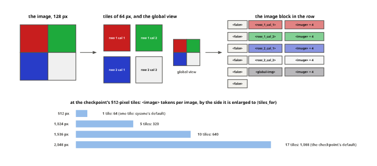

# modernvbert


<!-- WARNING: THIS FILE WAS AUTOGENERATED! DO NOT EDIT! -->

This notebook adds a second multimodal encoder the way the
[multimodal](20_neomme.ipynb) notebook added NeoMME, and follows its
outline: load and inspect, a row by hand, the template, the spec, one
forward pass, a head-only run, and what to watch. Adding an encoder
takes methods, not an application: ModernVBERT’s rows, its inputs and
its image defaults are methods of sysone’s [generic
functions](00_core.ipynb#generic-functions-and-multiple-dispatch), and
the multimodal application runs it as it runs NeoMME.

[ModernVBERT](https://arxiv.org/abs/2510.01149) (Illuin Technology,
2025; MIT) is a bidirectional vision-language encoder built for visual
document retrieval. It has 252M parameters. The text tower is a
ModernBERT (22 layers, width 768, with global attention every third
layer and a 128-token window in between), and the image tower is SigLIP2
(12 layers, 512-pixel tiles, 16-pixel patches). It fuses the two early.
A tile’s 32 × 32 patch vectors are pixel-shuffled into 64 vectors, each
projected to the text’s width, and they take the place of 64 `<image>`
tokens in the text. The text tower then reads text and image as one
sequence. Its pretraining was masked language modelling on image-text
pairs, mostly documents, before the contrastive stage that made the
retrievers.

For sysone this is the easy kind of multimodal encoder, for three
reasons:

- **Its text tower is ModernBERT, Laya’s own family.** The row uses
  Laya’s layout, with `[CLS]`, `[SEP]` and a `[MASK]` anchor before each
  option, as for any ModernBERT.
- **An image takes as many positions in the output as it has tokens in
  the input.** So the anchors sit where the row put them, and gathering
  them works as it does for text. NeoMME needed two-axis position ids
  built by hand.
- **Its processor, transformers’ `Idefics3Processor`, accepts text and
  images mixed in one prompt.** So sysone’s image block can be checked
  token for token against it. NeoMME’s processor refuses such rows.

<div>

<figure class=''>

<div>


</div>

</figure>

</div>

## 1. Load and inspect

The fixture is a random ModernVBERT: a 2-layer, 64-wide ModernBERT
beside a 2-layer, 32-wide SigLIP with 64-pixel tiles, whose 16 patches
pixel-shuffle into 4 image tokens. Its processor is a real
`Idefics3Processor` over the tiny ModernBERT tokenizer, with
ModernVBERT’s image tokens added. It loads by its config like any Hub
checkpoint:
[`EncoderSpec.from_pretrained`](https://sgaseretto.github.io/sysonelib/models.html#encoderspec.from_pretrained)
sees the vision config, loads the processor, and the family
`modernvbert` gives the template and the LoRA targets.

``` python
FIX = "fixtures/tiny-modernvbert"
spec = EncoderSpec.from_pretrained(FIX)
proc, tok = spec.processor, spec.tokenizer
ip = proc.image_processor
spec, type(proc).__name__, {t: tok.convert_tokens_to_ids(t) for t in ("<image>", "<fake_token_around_image>", "<global-img>", "[MASK]")}
```

    (EncoderSpec(fixtures/tiny-modernvbert: modernvbert, width 64, context 1024, multimodal, template modernvbert),
     'Idefics3Processor',
     {'<image>': 2049,
      '<fake_token_around_image>': 2048,
      '<global-img>': 2051,
      '[MASK]': 4})

``` python
test_eq((spec.family, spec.modality, spec.template.name, spec.width), ("modernvbert", "multimodal", "modernvbert", 64))
test_eq((proc.image_seq_len, ip.max_image_size["longest_edge"], ip.do_image_splitting), (4, 64, True))
```

The processor resizes an image so that its long side is
`size["longest_edge"]`, enlarging it if need be. It then cuts the result
into tiles of `max_image_size` and adds the whole image, shrunk to one
tile, as a global view. A single-tile image gets no global view: it is
its own. Each tile becomes `image_seq_len` `<image>` tokens, after a
`<fake_token_around_image>` and a tile tag:

``` python
img = PILImage.new("RGB", (28, 28), (20, 20, 20))
out = proc(text=["<image>"], images=[[img]], add_special_tokens=False, return_tensors="pt")
print(tok.decode(out["input_ids"][0]).replace("<image>" * 4, "<image>×4 "))
{k: tuple(v.shape) for k, v in out.items()}
```

    <fake_token_around_image><row_1_col_1><image>×4 <fake_token_around_image><row_1_col_2><image>×4 
    <fake_token_around_image><row_2_col_1><image>×4 <fake_token_around_image><row_2_col_2><image>×4 

    <fake_token_around_image><global-img><image>×4 <fake_token_around_image>

    {'input_ids': (1, 34),
     'attention_mask': (1, 34),
     'pixel_values': (1, 5, 3, 64, 64),
     'pixel_attention_mask': (1, 5, 64, 64)}

<figure>

<figcaption aria-hidden="true">A four-colour image cut into 2 × 2 tiles
and a global view, each tile’s tokens in the row’s image block, and the
image tokens at the checkpoint’s sizes</figcaption>
</figure>

The same layout, drawn for an image of four colours
([figures](90_figures.ipynb#an-image-as-tiles-and-tokens)): each tile’s
tokens open with `<fake_token_around_image>` and the tile’s position,
and the global view comes last, so the encoder reads every tile and the
whole picture. How large the image is made decides how many tiles it is
cut into, and so how many tokens it takes: 64 per tile at the
checkpoint’s 512-pixel tiles.

The real checkpoint’s processor enlarges every image to 2,048 pixels on
its long side. A 28-pixel MNIST digit therefore becomes 16 tiles of 512
pixels plus the global view, 17 × 64 = 1,088 image tokens, where a
single 512-pixel tile would read the same strokes with 64. Measured with
the checkpoint’s processor: So the multimodal application sets
`size["longest_edge"]` from its `image_side` (one 512-pixel tile by
default), and a small image becomes one tile:

<table>
<colgroup>
<col style="width: 33%" />
<col style="width: 33%" />
<col style="width: 33%" />
</colgroup>
<thead>
<tr>
<th><code>image_side</code></th>
<th>tiles of a square image</th>
<th>the image block’s tokens</th>
</tr>
</thead>
<tbody>
<tr>
<td>up to 512</td>
<td>1</td>
<td>67: 64 <code>&lt;image&gt;</code>, 3 markers</td>
</tr>
<tr>
<td>1,024</td>
<td>2 × 2 and the global view</td>
<td>333: 320 <code>&lt;image&gt;</code>, 13 markers and newlines</td>
</tr>
<tr>
<td>1,536</td>
<td>3 × 3 and the global view</td>
<td>664: 640 <code>&lt;image&gt;</code>, 24 others</td>
</tr>
<tr>
<td>2,048 (the checkpoint’s default)</td>
<td>4 × 4 and the global view</td>
<td>1,127: 1,088 <code>&lt;image&gt;</code>, 39 others</td>
</tr>
</tbody>
</table>

A 3:2 photo gets as many tiles as a square up to 1,536 pixels, because
the processor rounds both sides up to whole tiles, and 4 × 3 and the
global view at 2,048.

Below 512 the image gets no fewer tokens, only less detail: the
processor enlarges it back to the tile’s 512 pixels.

## 2. A row by hand

A decision row puts the image between the options and the state, as the
`modernvbert` preset lays it out. The image block is exactly what the
processor makes of an `<image>` in a prompt: the tiles’ tokens, row by
row, then the global view.
[`idefics3_block`](https://sgaseretto.github.io/sysonelib/modernvbert.html#idefics3_block)
asks the image processor for the tiles and the processor for their text,
and tokenizes that text without special tokens, as the rest of the row
is tokenized:

------------------------------------------------------------------------

<a
href="https://github.com/sgaseretto/sysonelib/blob/main/sysone/modernvbert.py#L33"
target="_blank" style="float:right; font-size:smaller">source</a>

### build_idefics3_rows

``` python
def build_idefics3_rows(
    processor:transformers.models.idefics3.processing_idefics3.Idefics3Processor, builder:sysone.template.RowBuilder,
    record:dict, *, skip_errors:bool=False
)->list:
```

*Rows of a transformed record for an Idefics3-style processor: text by
the builder’s budgets, the image as tiles of <image> tokens*

------------------------------------------------------------------------

<a
href="https://github.com/sgaseretto/sysonelib/blob/main/sysone/modernvbert.py#L26"
target="_blank" style="float:right; font-size:smaller">source</a>

### idefics3_block

``` python
def idefics3_block(
    builder:sysone.template.RowBuilder, image
)->tuple:
```

*The ids of one image as an Idefics3 processor lays it out (its tiles,
then the global view), and its pixels and pixel mask*

``` python
qs = {"digit": {"type": "choice", "instructions": "Which digit is written in the image?", "criteria": [str(d) for d in range(4)]}}
rec = {"id": "r0", "state": {"text": "", "image": img}, "questions": qs, "gold": {"digit": "3"}}
row = spec.builder(tfms=[Image(side=None)]).build_record(rec)[0]
print(show_row(row, tok, max_chars=400))
blk, pixels, pmask = idefics3_block(spec.builder(), img)
test_eq(blk, out["input_ids"][0].tolist())                              # the processor's own layout of the image
test_eq((torch.equal(pixels, out["pixel_values"][0]), torch.equal(pmask, out["pixel_attention_mask"][0])), (True, True))
at = row.markers[-1] + 3                                                    # past the last option and the [SEP] after it
test_eq(row.ids[at:at + len(blk)], blk)
test_eq((row.extras["image_tiles"], row.extras["pixel_values"].shape), (5, (5, 3, 64, 64)))
```

    [CLS] choice question: Which digit is written in the image? [SEP] [MASK] 0 [MASK] 1 [MASK] 2 [MASK] 3 [SEP] <fake_token_around_image> <row_1_col_1> <image>×4 <fake_token_around_image> <row_1_col_2> <image>×4 <fake_token_around_image> <row_2_col_1> <image>×4 <fake_token_around_image> <row_2_col_2> <image>×4 <fake_token_around_image> <global-img> <image>×4 <fake_token_around_image> [SEP]
    markers [25, 27, 29, 31] · qtype choice · 69 tokens

## 3. The template

The `modernvbert` preset (in [template](01_template.ipynb#presets)) is
Laya’s row with an `{image}` field between the options and the state:
`[CLS]`, the question, `[SEP]`, the anchored options, `[SEP]`, the image
block, the state’s text, `[SEP]`. Its budget is 2,048 tokens against
Laya’s 512, since an image at 2,048 pixels takes 1,127 positions.
ModernBERT’s 128-token local window is why the image sits right after
the options: the first anchors are within a window of the image’s first
tiles, and every third layer attends globally anyway.

A user’s text is scrubbed of the processor’s image tokens, as NeoMME’s
`<doc>` and `<row>` are, so text can’t open a fake image:

``` python
b = spec.builder(tfms=[Image(side=None)])
r2 = b.build_record({"state": {"text": "a note <global-img> with <row_1_col_1> tags", "image": img}, "questions": qs})[0]
test_eq(r2.ids.count(tok.convert_tokens_to_ids("<global-img>")), 1)          # the image's own, not the text's
test_eq(r2.ids.count(tok.convert_tokens_to_ids("<row_1_col_1>")), 1)
```

## 4. The spec

The family `modernvbert` names the template and the LoRA targets: the
text tower’s attention projections, `Wqkv` and `Wo` in each of
ModernBERT’s layers. The image tower and the connector stay frozen under
LoRA, as the retrievers built on ModernVBERT keep them. The multimodal
application sets the processor’s `size["longest_edge"]` to `image_side`,
through ModernVBERT’s method of
[`prepare_processor`](https://sgaseretto.github.io/sysonelib/template.html#prepare_processor),
and adds the
[`Image`](https://sgaseretto.github.io/sysonelib/template.html#image)
transform that loads each image and resizes it to the same side. An
export saves the processor with its size, so a loaded
[`Decider`](https://sgaseretto.github.io/sysonelib/inference.html#decider)
tiles images exactly as training did.

``` python
test_eq(spec.lora_targets, r"text_model\.layers\.\d+\.attn\.(Wqkv|Wo)")
```

## 5. One forward pass

sysone’s collate concatenates each row’s tiles, as it does NeoMME’s
patches. ModernVBERT wants them grouped, `(batch, tiles, 3, H, W)`, with
a pixel mask of the same shape and all-zero tiles as padding (its vision
tower drops them). ModernVBERT’s method of
[`encoder_inputs`](https://sgaseretto.github.io/sysonelib/models.html#encoder_inputs)
regroups a batch’s tiles by each row’s `image_tiles`:

------------------------------------------------------------------------

<a
href="https://github.com/sgaseretto/sysonelib/blob/main/sysone/modernvbert.py#L52"
target="_blank" style="float:right; font-size:smaller">source</a>

### modernvbert_inputs

``` python
def modernvbert_inputs(
    config:transformers.models.modernvbert.configuration_modernvbert.ModernVBertConfig, inputs:dict
)->dict:
```

*A batch’s concatenated tiles regrouped per row, (batch, max tiles, 3,
H, W), zero-padded, and the pixel mask alike*

A very wide image makes fewer tiles than a square one: at the fixture’s
128 pixels, a 400 × 50 banner is one row of two tiles plus the global
view. Batched with the square digit’s five tiles, the banner’s row is
padded with two empty tiles. Both rows’ anchors then match what the
model gives each row on its own, with the processor’s layout:

``` python
wide = PILImage.new("RGB", (400, 50), (200, 30, 30))
rows = [b.build_record(rec)[0], b.build_record(dict(rec, id="r1", state={"text": "a banner", "image": wide}))[0]]
test_eq([r.extras["image_tiles"] for r in rows], [5, 3])
enc = spec.load_encoder().eval()
model = EncoderDecisionModel(enc, DecisionHead(spec.width, layers=0, scorer="mlp"), spec).eval()
bt = collate(rows, tok.pad_token_id)
extra = {k: v for k, v in bt.items() if k in ("pixel_values", "pixel_attention_mask", "image_tiles")}
with torch.no_grad():
    h = model.encode(bt["input_ids"], bt["attention_mask"], **extra)
    for i, r in enumerate(rows):
        ids = torch.tensor([r.ids])
        alone = enc(input_ids=ids, attention_mask=torch.ones_like(ids), pixel_values=r.extras["pixel_values"][None],
                    pixel_attention_mask=r.extras["pixel_attention_mask"][None]).last_hidden_state[0]
        test_close(h[i, r.markers], alone[r.markers], eps=1e-5)
    logits = model(**{k: v for k, v in bt.items() if k not in ("target", "label")})
test_eq(logits.shape, (2, 4))
logits
```

    tensor([[-0.1916, -0.1916, -0.1916, -0.1916],
            [-0.1917, -0.1917, -0.1917, -0.1917]])

## 6. A head-only run

The multimodal application,
[`sysone.multimodal.decision_learner`](https://sgaseretto.github.io/sysonelib/neomme.html#decision_learner),
runs ModernVBERT by default since 2026-09-30 (the [NeoMME
notebook](20_neomme.ipynb#which-encoder-by-default) says why), so
`decision_learner(data)` is
`decision_learner(data, "ModernVBERT/modernvbert")`. The two methods
below give it ModernVBERT’s image defaults.
[`default_image_side`](https://sgaseretto.github.io/sysonelib/template.html#default_image_side)
is one tile, the processor’s own tile size (512 pixels for the
checkpoint), and
[`prepare_processor`](https://sgaseretto.github.io/sysonelib/template.html#prepare_processor)
sets the processor to tile at the chosen side and counts the tiles.
Everything else is the application’s, as for NeoMME: the
[`Image`](https://sgaseretto.github.io/sysonelib/template.html#image)
transform, a frozen encoder whose anchors are cached for the default
head (in float32), and Laya’s scorer on the standardised anchors. The
same defaults make the two encoders comparable, in the
[comparison](tutorials/03_neomme_vs_modernvbert.ipynb) notebook.

A batch of rows is a batch of tiles for the vision tower, so an
`image_side` above 512 multiplies SigLIP’s batch: 8 rows at 1,536 pixels
are 80 tiles of 1,024 patches each. The application therefore divides
the preset’s batch sizes by the tiles per image, unless they are given,
so the vision tower’s batch stays about the size it has at one tile.

<div>

> **Finding: eight rows at 1,536 pixels held 8 GB of GPU memory**
>
> The first run of the [ModernVBERT
> tutorial](tutorials/02_modernvbert_images.ipynb)’s image-size sweep
> cached the anchors in batches of 8 rows, as the laptop preset says. At
> 1,536 pixels that is 80 tiles in one SigLIP pass, and 10 GB of the M3
> Pro’s 18 GB was wired: GPU memory, which macOS can’t page out. Free
> memory fell to 16%, with swap all but full, and the run was stopped
> before it could take the machine down. Stopping it released 8.4 GB at
> once. Batches of one row at 1,536 pixels, 10 tiles, keep the vision
> tower’s batch close to what 8 one-tile rows make.

</div>

------------------------------------------------------------------------

<a
href="https://github.com/sgaseretto/sysonelib/blob/main/sysone/modernvbert.py#L84"
target="_blank" style="float:right; font-size:smaller">source</a>

### idefics3_prepare

``` python
def idefics3_prepare(
    processor:transformers.models.idefics3.processing_idefics3.Idefics3Processor, side:int | None
)->int:
```

*Tile at `side` pixels (None: the processor’s own size): the tiles a
square image then makes, the global view included*

------------------------------------------------------------------------

<a
href="https://github.com/sgaseretto/sysonelib/blob/main/sysone/modernvbert.py#L80"
target="_blank" style="float:right; font-size:smaller">source</a>

### idefics3_image_side

``` python
def idefics3_image_side(
    processor:transformers.models.idefics3.processing_idefics3.Idefics3Processor
)->int:
```

*An Idefics3 processor’s default image side: one tile, the processor’s
own tile size (512 pixels for ModernVBERT)*

------------------------------------------------------------------------

<a
href="https://github.com/sgaseretto/sysonelib/blob/main/sysone/modernvbert.py#L75"
target="_blank" style="float:right; font-size:smaller">source</a>

### tiles_for

``` python
def tiles_for(
    side:int | None, tile:int=512
)->int:
```

*The tiles a square image makes at `side` pixels (None: the checkpoint’s
2,048): one up to a tile, else a grid and the global view*

Going back, from a row to the picture, ModernVBERT’s method of
[\[`pixel_tiles`\](https://sgaseretto.github.io/sysonelib/template.html#pixel_tiles)](01_template.ipynb)
stitches the tiles back into the image they were cut from, reading the
grid off the row’s `<row_i_col_j>` tokens, and returns the global view
beside it. An image of one tile is that tile.

------------------------------------------------------------------------

<a
href="https://github.com/sgaseretto/sysonelib/blob/main/sysone/modernvbert.py#L93"
target="_blank" style="float:right; font-size:smaller">source</a>

### idefics3_tiles

``` python
def idefics3_tiles(
    processor:transformers.models.idefics3.processing_idefics3.Idefics3Processor, row:sysone.core.Row,
    values:NoneType=None
)->tuple:
```

*ModernVBERT’s pixels as the image they show: the tiles stitched back
into the image (from its `<row_i_col_j>` tokens), then the global view*

With NeoMME’s adapter imported as well, the multimodal application finds
a method for each encoder, and the fallback (`object`) for any other:

``` python
{f.__name__: methods(f) for f in (processor_rows, default_image_side, prepare_processor, encoder_inputs, pixel_tiles)}
```

    {'processor_rows': [('object', 'Any', 'dict'),
      ('NeoMMEProcessor', 'RowBuilder', 'dict'),
      ('Idefics3Processor', 'RowBuilder', 'dict')],
     'default_image_side': [('object',),
      ('NeoMMEProcessor',),
      ('Idefics3Processor',)],
     'prepare_processor': [('object', 'int | None'),
      ('Idefics3Processor', 'int | None')],
     'encoder_inputs': [('object', 'dict'),
      ('NeoMMEConfig', 'dict'),
      ('ModernVBertConfig', 'dict')],
     'pixel_tiles': [('object', 'Row', 'Any'),
      ('object', 'Row'),
      ('NeoMMEProcessor', 'Row', 'Any'),
      ('NeoMMEProcessor', 'Row'),
      ('Idefics3Processor', 'Row', 'Any'),
      ('Idefics3Processor', 'Row')]}

On the fixture, 24 images in three colours, and a choice among the
colours. The encoder is random, so what matters is the path, from
records to an exported
[`Decider`](https://sgaseretto.github.io/sysonelib/inference.html#decider)
that answers as the learner did:

``` python
tmp = Path(tempfile.mkdtemp())
COLOURS = {"red": (200, 30, 30), "green": (30, 170, 60), "blue": (40, 60, 200)}
cq = {"colour": {"type": "choice", "instructions": "Which colour fills the image?", "criteria": list(COLOURS)}}
crecs = []
for i in range(24):
    name = list(COLOURS)[i % 3]
    p = tmp / f"{i}.png"; PILImage.new("RGB", (40 + 7 * i, 40), COLOURS[name]).save(p)
    crecs.append({"id": f"c{i}", "state": {"text": "", "image": str(p)}, "questions": cq, "gold": {"colour": name}})
cdata = TypedDecisions.from_records(crecs, valid=0.25, calib=0.25, seed=0)
torch.manual_seed(0)
learn = decision_learner(cdata, FIX, image_side=64, preset="cpu", loss="soft_ce", cache_dir=tempfile.mkdtemp(), calibrate_after_fit=False)
test_eq((learn.cache, learn.model.head.scorer_kind, learn.model.head.layers), ("masks", "laya", 0))      # Laya's scorer on the anchors
test_eq((default_image_side(proc), learn.data.builder.template.name), (64, "modernvbert"))           # one of the fixture's 64-pixel tiles
test_eq(cdata.builder.processor.image_processor.size, {"longest_edge": 64})
learn.fit(3, lr=3e-3)
test_eq(learn.dataset("train")[0]["anchors"].shape, (3, 64))
r = crecs[1]
before = learn.predict(r["state"], r["questions"])
out = learn.export(tmp / "colour-jev")
jev = Decider.load(out, device="cpu")
test_eq(jev.predict(r["state"], r["questions"]), before)
test_eq(jev.builder.processor.image_processor.size["longest_edge"], 64)       # the export tiles as training did
before
```

    {'eval_loss': '1.096', 'eval_accuracy': '0.3333', 'eval_soft_accuracy': '0.3341', 'eval_brier': '0.6652', 'eval_kl': '1.096', 'eval_tv': '0.6659', 'eval_ece': '0.001701', 'eval_score_mae': 'nan', 'eval_within_one': 'nan', 'eval_n': 6, 'eval_accuracy_choice': '0.3333', 'eval_accuracy_score': 'nan', 'eval_accuracy_noul': 'nan', 'eval_n_unanswerable': 0, 'eval_runtime': '0.002', 'eval_samples_per_second': '3072', 'eval_steps_per_second': '512', 'epoch': '1'}
    {'eval_loss': '1.092', 'eval_accuracy': '0.5', 'eval_soft_accuracy': '0.3356', 'eval_brier': '0.6621', 'eval_kl': '1.092', 'eval_tv': '0.6644', 'eval_ece': '0.1638', 'eval_score_mae': 'nan', 'eval_within_one': 'nan', 'eval_n': 6, 'eval_accuracy_choice': '0.5', 'eval_accuracy_score': 'nan', 'eval_accuracy_noul': 'nan', 'eval_n_unanswerable': 0, 'eval_runtime': '0.0017', 'eval_samples_per_second': '3591', 'eval_steps_per_second': '598.4', 'epoch': '2'}
    {'eval_loss': '1.087', 'eval_accuracy': '0.5', 'eval_soft_accuracy': '0.3373', 'eval_brier': '0.6589', 'eval_kl': '1.087', 'eval_tv': '0.6627', 'eval_ece': '0.1621', 'eval_score_mae': 'nan', 'eval_within_one': 'nan', 'eval_n': 6, 'eval_accuracy_choice': '0.5', 'eval_accuracy_score': 'nan', 'eval_accuracy_noul': 'nan', 'eval_n_unanswerable': 0, 'eval_runtime': '0.002', 'eval_samples_per_second': '3061', 'eval_steps_per_second': '510.2', 'epoch': '3'}
    {'train_runtime': '0.0204', 'train_samples_per_second': '2063', 'train_steps_per_second': '294.8', 'train_loss': '1.093', 'epoch': '3'}

    {'colour': {'type': 'choice',
      'choice': 'blue',
      'probabilities': {'red': 0.3323, 'green': 0.3332, 'blue': 0.3345},
      'confidence': 0.0,
      'answer_confidence': 0.3345}}

``` python
test_eq([tiles_for(s) for s in (256, 512, 1024, 1536, None)], [1, 1, 5, 10, 17])
many = decision_learner(cdata, FIX, image_side=128, preset="cpu", cache_dir=tempfile.mkdtemp(), calibrate_after_fit=False)   # 2 × 2 tiles + the global view
test_eq((many.args.per_device_train_batch_size, many.args.per_device_eval_batch_size), (8, 16 // 5))    # cached: only the encoding batch shrinks
lora = decision_learner(cdata, FIX, train="lora", image_side=128, preset="cpu", calibrate_after_fit=False)
test_eq((lora.args.per_device_train_batch_size, lora.args.per_device_eval_batch_size), (8 // 5 or 1, 16 // 5))   # no cache: both do
del many, lora
```

At 128 pixels, a fixture image is cut into 2 × 2 tiles, and
[`pixel_tiles`](https://sgaseretto.github.io/sysonelib/template.html#pixel_tiles)
puts them back together: an image whose quarters are four colours comes
back with its quarters in place, beside the global view:

``` python
quarters = PILImage.new("RGB", (128, 128))
for c, xy in zip(list(COLOURS.values()) + [(240, 240, 240)], [(0, 0), (64, 0), (0, 64), (64, 64)]): quarters.paste(c, xy + (xy[0] + 64, xy[1] + 64))
p4 = AutoProcessor.from_pretrained(FIX); idefics3_prepare(p4, 128)                  # a processor of its own, tiling at 128 pixels
four = RowBuilder(p4, spec.template, [Image(side=128)])
qrow = four.build_record({"state": {"text": "", "image": quarters}, "questions": cq})[0]
qtiles, qvals = pixel_tiles(four.processor, qrow, np.ones((1,) + tuple(qrow.extras["pixel_values"].shape)))
test_eq([t.shape for t in qtiles], [(128, 128, 3), (64, 64, 3)])
test_eq([v.shape for v in qvals], [(1, 128, 128), (1, 64, 64)])
test_close(qtiles[0][32, 32], np.array(COLOURS["red"]) / 255, eps=0.02); test_close(qtiles[0][96, 96], np.full(3, 240 / 255), eps=0.02)
```

<div>

> **Finding: tiles shrank a cached head’s training batch**
>
> The application shrinks the batches for a tiling processor, since each
> row then carries several images through the vision tower. It shrank
> the training batch too, even when the head trains from cached anchors
> and the vision tower runs only to fill the cache. So at 1,024 pixels,
> five images a row, a cached head trained on batches of one row instead
> of four: a different recipe from the one it gets at 512. Now, with
> cached anchors, only the batches that encode images shrink. Without a
> cache (LoRA, full fine-tuning) the vision tower runs in every training
> step, and the training batch shrinks as before. The [ModernVBERT
> tutorial](tutorials/02_modernvbert_images.ipynb#one-more-setting-the-image-size)’s
> image-size sweep ran before the fix, so there the default head trained
> on batches of one row at 1,024 and 1,536 pixels. Its linear head,
> fitted in one full batch, is unaffected.

</div>

The LoRA regime puts adapters on the text tower’s `Wqkv` and `Wo` alone,
and trains them with the head:

``` python
torch.manual_seed(0)
ll = decision_learner(cdata, FIX, train="lora", image_side=64, preset="cpu", loss="soft_ce", calibrate_after_fit=False)
trainable = [n for n, q in ll.model.encoder.named_parameters() if q.requires_grad]
test_eq((ll.cache, len(trainable) > 0, all("text_model" in n and "lora_" in n for n in trainable)), (None, True, True))
ll.fit(1, lr=1e-3)
```

    {'eval_loss': '1.097', 'eval_accuracy': '0.3333', 'eval_soft_accuracy': '0.3338', 'eval_brier': '0.6658', 'eval_kl': '1.097', 'eval_tv': '0.6662', 'eval_ece': '0.001924', 'eval_score_mae': 'nan', 'eval_within_one': 'nan', 'eval_n': 6, 'eval_accuracy_choice': '0.3333', 'eval_accuracy_score': 'nan', 'eval_accuracy_noul': 'nan', 'eval_n_unanswerable': 0, 'eval_runtime': '0.0074', 'eval_samples_per_second': '805.9', 'eval_steps_per_second': '134.3', 'epoch': '1'}
    {'train_runtime': '0.0286', 'train_samples_per_second': '489.6', 'train_steps_per_second': '69.94', 'train_loss': '1.098', 'epoch': '1'}

    {'epoch': 1.0,
     'loss': 1.0973469018936157,
     'accuracy': 0.3333333333333333,
     'soft_accuracy': 0.33376070815662184,
     'brier': 0.6658196388733407,
     'kl': 1.0973469185878548,
     'tv': 0.6662392918433783,
     'ece': 0.001924100426870412,
     'score_mae': nan,
     'within_one': nan,
     'n': 6,
     'accuracy_choice': 0.3333333333333333,
     'accuracy_score': nan,
     'accuracy_noul': nan,
     'n_unanswerable': 0,
     'runtime': 0.0074,
     'samples_per_second': 805.874,
     'steps_per_second': 134.312}

## 7. Two small image tasks on the real checkpoint

The [ModernVBERT tutorial](tutorials/02_modernvbert_images.ipynb) runs
the multimodal application with `ModernVBERT/modernvbert` as its
encoder, with every output shown. It uses the NeoMME tutorial’s records
and recipes, and the whole run takes 23 minutes on an M3 Pro. Held-out
accuracy:

<table>
<colgroup>
<col style="width: 20%" />
<col style="width: 20%" />
<col style="width: 20%" />
<col style="width: 20%" />
<col style="width: 20%" />
</colgroup>
<thead>
<tr>
<th></th>
<th>default head</th>
<th>linear head</th>
<th>LoRA</th>
<th>probe on the image vectors</th>
</tr>
</thead>
<tbody>
<tr>
<td>digits (a 10-way choice, 100 test images)</td>
<td>0.84</td>
<td>0.77</td>
<td>0.84</td>
<td>0.92</td>
</tr>
<tr>
<td>hot dog (a noul, 80 test photos)</td>
<td>0.94</td>
<td>0.93</td>
<td>0.96</td>
<td>0.98</td>
</tr>
</tbody>
</table>

With the same recipes NeoMME scored 0.31, 0.41 and 0.33 on the digits,
and 0.74, 0.70 and 0.73 on the photos (see the
[comparison](tutorials/03_neomme_vs_modernvbert.ipynb)). Standardising
the anchors still matters: on the digits the head reaches 0.67 without
it, since ModernVBERT’s channel 256 carries 58% of every anchor’s
length. More tiles helped neither task. One 512-pixel tile, 102 tokens a
row, did as well as 5 or 10.

## 8. What to watch

- **The processor enlarges images.** The checkpoint’s processor resizes
  every image to 2,048 pixels on its long side before tiling it, so a
  thumbnail left at that size costs 1,127 positions. The multimodal
  application’s default is one tile, 512 pixels. A large page may need
  1,024 or more.
- **Below 512 pixels, `image_side` changes the detail, not the cost.**
  Every tile is 512 pixels when it reaches SigLIP, so a smaller side
  only blurs the image first.
- **The load report.** `ModernVBERT/modernvbert` holds its masked-LM
  head and a projection head beside the encoder, and transformers
  reports them as unused when it loads the encoder. The weights are the
  encoder’s all the same.
- **Tiles multiply the vision tower’s batch.** A row at `image_side`
  1,024 is 5 tiles and at 1,536 it is 10, each 1,024 SigLIP patches. The
  application divides the preset’s batch sizes by the tiles per image
  (the finding in [section 6](#a-head-only-run)). A batch size given by
  hand is kept as it is, so size it the same way.
- **Batches are not bit-for-bit.** On MPS a row’s anchors differ from
  those of the same row alone by up to 3 × 10⁻⁵, the reordering noise of
  float32 kernels. The feature cache and the
  [`Decider`](https://sgaseretto.github.io/sysonelib/inference.html#decider)
  see the same numbers only when they batch the same way.
