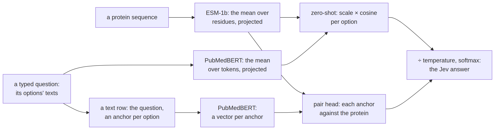

# protein


<!-- WARNING: THIS FILE WAS AUTOGENERATED! DO NOT EDIT! -->

This notebook adds a protein encoder the way the
[multimodal](20_neomme.ipynb) notebook added an image encoder: load it
and look at it, check it against its reference, write the spec, run one
forward pass, train a head, and write down what to watch.

[ProtST](https://arxiv.org/abs/2301.12040) (Xu et al., ICML 2023) has
two towers: ESM-1b, a protein language model (33 layers, width 1,280,
650M parameters), and PubMedBERT, a biomedical text encoder (12 layers,
width 768). They were trained together on ProtDescribe, Swiss-Prot
sequences paired with text about each protein’s function, location,
family and name. Among the training objectives is a CLIP-style
alignment. It pools each tower into one vector, projects both into a
512-wide space, and pulls a protein and its own description together
there. That joint space is what sysone uses, in two ways:

- **Zero-shot.** Embed the protein and each option’s text in the joint
  space. An option’s logit is ProtST’s logit scale times the cosine
  between the two. This is the
  [`SimilarityDecider`](https://sgaseretto.github.io/sysonelib/zeroshot.html#similaritydecider)
  of [zeroshot](11_zeroshot.ipynb), and it needs no training at all.
- **A decision model.** The protein is a *side stream*
  ([template](01_template.ipynb#side-stream-inputs)): ESM reads it and
  pools it to one vector. PubMedBERT reads a text row as for any sysone
  encoder (the question, and an anchor before each option). A pair head
  scores each option’s anchor against the protein’s vector. The towers
  don’t talk to each other (late fusion), so both can stay frozen and
  cached, and only the head trains.
  [Cross-attention](03_models.ipynb#cross-attention-from-a-side-stream)
  is the other design, where the text attends to the protein inside the
  encoder.

<div>

<figure class=''>

<div>



</div>

</figure>

</div>

## 1. Load and inspect

The Hub port of ProtST,
[MilaDeepGraph/ProtST-ESM1b](https://huggingface.co/MilaDeepGraph/ProtST-ESM1b),
keeps the two towers and their projection heads, and not the fusion
module used for multimodal mask prediction. Its tensors sit under
`protein_model.esm` and `text_model.bert`. Each tower has two heads
(dense → ReLU → out_proj, into the 512-wide space): `protein_mlp` and
`text_mlp` for the pooled vector, and `residue_mlp` and `word_mlp` for
each token’s vector. A scalar `logit_scale` completes the checkpoint.
The repo ships its own modeling code, which transformers runs only with
`trust_remote_code=True`.

sysone doesn’t run that code. The towers are transformers’ own
`EsmModel` and `BertModel`, so sysone builds them from the two configs
inside `config.json` and reads only the tensors. It uses
`model.safetensors` when the repo has one, and otherwise
`pytorch_model.bin` through `torch.load(weights_only=True)`, which
unpickles tensors and refuses anything else. The file is memory-mapped,
so the 1.5 GB bf16 checkpoint is read as the towers are filled, not held
in memory beside them. The towers are built straight from those tensors,
not initialised at random first, and are float32 unless asked otherwise.

The port has no tokenizer files. ProtST was trained with ESM-1b’s and
PubMedBERT’s, and those are the defaults. A folder with
`protein_tokenizer/` and `text_tokenizer/` inside, as the fixture has,
brings its own.

------------------------------------------------------------------------

<a
href="https://github.com/sgaseretto/sysonelib/blob/main/sysone/protein.py#L62"
target="_blank" style="float:right; font-size:smaller">source</a>

### protst_tokenizers

``` python
def protst_tokenizers(
    id:str='MilaDeepGraph/ProtST-ESM1b', protein:str | None=None, text:str | None=None
)->tuple:
```

*The protein and the text tokenizer: the folder’s own
(`protein_tokenizer/`, `text_tokenizer/`), else ESM-1b’s and
PubMedBERT’s*

------------------------------------------------------------------------

<a
href="https://github.com/sgaseretto/sysonelib/blob/main/sysone/protein.py#L53"
target="_blank" style="float:right; font-size:smaller">source</a>

### protst_tensors

``` python
def protst_tensors(
    id:str='MilaDeepGraph/ProtST-ESM1b', revision:str | None=None
)->dict:
```

*The checkpoint’s tensors: `model.safetensors` if there is one, else
`pytorch_model.bin` read with `weights_only=True` (tensors, no code),
memory-mapped*

------------------------------------------------------------------------

<a
href="https://github.com/sgaseretto/sysonelib/blob/main/sysone/protein.py#L48"
target="_blank" style="float:right; font-size:smaller">source</a>

### protst_config

``` python
def protst_config(
    id:str='MilaDeepGraph/ProtST-ESM1b', revision:str | None=None
)->types.SimpleNamespace:
```

*The checkpoint’s configuration: its model type, and the ESM and BERT
configs of its towers*

------------------------------------------------------------------------

<a
href="https://github.com/sgaseretto/sysonelib/blob/main/sysone/protein.py#L43"
target="_blank" style="float:right; font-size:smaller">source</a>

### is_protst

``` python
def is_protst(
    id:str, revision:str | None=None
)->bool:
```

*Whether `id` (a folder or a Hub repo) holds a ProtST checkpoint: a
config whose model_type is ‘protst’*

A tower is built by transformers’ `from_pretrained` from its config and
its tensors, with no pooling layer (ProtST pools by a mean, below). The
build checks that every weight the tower needs is in the checkpoint and
that nothing is left over. A projection head becomes a
[`ProjMLP`](https://sgaseretto.github.io/sysonelib/models.html#projmlp),
whose Linear → ReLU → Linear is exactly ProtST’s dense → ReLU →
out_proj.

------------------------------------------------------------------------

<a
href="https://github.com/sgaseretto/sysonelib/blob/main/sysone/protein.py#L109"
target="_blank" style="float:right; font-size:smaller">source</a>

### load_protst

``` python
def load_protst(
    id:str='MilaDeepGraph/ProtST-ESM1b', revision:str | None=None, dtype:torch.dtype=torch.float32,
    device:NoneType=None, protein_tokenizer:str | None=None, text_tokenizer:str | None=None
)->__main__.ProtST:
```

*ProtST from a Hub repo or a folder: transformers’ ESM and BERT filled
with the checkpoint’s tensors (its modeling code is not run)*

------------------------------------------------------------------------

<a
href="https://github.com/sgaseretto/sysonelib/blob/main/sysone/protein.py#L90"
target="_blank" style="float:right; font-size:smaller">source</a>

### ProtST

``` python
def ProtST(
    esm:torch.nn.modules.module.Module, bert:torch.nn.modules.module.Module, protein_proj:sysone.models.ProjMLP,
    text_proj:sysone.models.ProjMLP, logit_scale:float, protein_tokenizer, text_tokenizer, config:NoneType=None,
    id:str | None=None, revision:str | None=None
):
```

*ProtST’s two towers and the heads that project their pooled vectors
into one space: ESM over proteins, BERT over text*

The fixture is a random two-tower model laid out as the Hub port is: a
2-layer, 32-wide ESM and BERT, heads into a 16-wide space, and ESM’s own
33-token protein tokenizer beside a small WordPiece text tokenizer
(`python nbs/fixtures/make_fixtures.py protst` rebuilds it offline). It
loads the way the real checkpoint does:

``` python
FIX = "fixtures/tiny-protst"
p = load_protst(FIX)
p
```

``` python
test_eq(is_protst(FIX), True); test_eq(is_protst("fixtures/tiny-modernbert"), False)
test_close(p.logit_scale, float(np.exp(2.6592)), eps=1e-3)
test_eq((p.protein_proj.dims, p.text_proj.dims), ([32, 32, 16], [32, 32, 16]))
test_eq((p.protein_tokenizer.cls_token_id, p.protein_tokenizer.pad_token_id, p.protein_tokenizer.eos_token_id), (0, 1, 2))
test_eq(p.protein_tokenizer("MKTAY")["input_ids"], [0] + p.protein_tokenizer("M K T A Y", add_special_tokens=False)["input_ids"] + [2])
```

The real checkpoint, loaded the same way on an M3 Pro, gives
`ProtST(MilaDeepGraph/ProtST-ESM1b · protein: ESM 33 × 1280 · text: BERT 12 × 768 · joint space 512 · scale 14.2 · 762.9M params · torch.float32 on mps:0)`.
Every weight the two towers need is in the checkpoint and none is left
over, down to ESM’s contact head, which sysone never calls. Once the
file is in the cache, it loads in one to two seconds and holds 3.0 GB of
float32 weights. The logit scale is 2.656, which is ln (1/0.07) rounded
to bf16. That is where CLIP-style training starts the scale, so the
port’s zero-shot logits are the cosine times 14.2.

## 2. Zero-shot

ProtST pools a protein as the mean of ESM’s last hidden states over its
residues, leaving out `<cls>`, `<eos>` and padding, and projects the
mean with `protein_mlp`. A text is pooled the same way over its tokens
and projected with `text_mlp`. The port’s zero-shot example feeds a
label’s text as `[CLS]` followed by its tokens, without a `[SEP]`, and
sysone does the same. Both vectors are normalised, and an option’s logit
is the scale times their cosine.

[`SideEncoder`](https://sgaseretto.github.io/sysonelib/models.html#sideencoder)
already pools that way, so the two embedders are side encoders over
ProtST’s towers and heads, and the decision model below reuses the same
code. The protein embedder builds its input the way the `protein` stream
does, cropping at the ends (see [the spec](#the-spec)). Zero-shot and
the decision model therefore read the same residues. It also batches
proteins by length, so a batch is mostly residues rather than padding.

------------------------------------------------------------------------

<a
href="https://github.com/sgaseretto/sysonelib/blob/main/sysone/evaluate.py#L71"
target="_blank" style="float:right; font-size:smaller">source</a>

### zero_shot

``` python
def zero_shot(
    protst:__main__.ProtST, prompt:str='{text}', proteins:sysone.zeroshot.Embedder | None=None,
    texts:sysone.zeroshot.Embedder | None=None, state_key:str='sequence', max_len:int=1024, crop:str='ends', **kw
)->sysone.zeroshot.SimilarityDecider:
```

*A zero-shot decider on ProtST: an option’s logit is ProtST’s scale
times the cosine between the protein’s embedding and the option text’s*

------------------------------------------------------------------------

<a
href="https://github.com/sgaseretto/sysonelib/blob/main/sysone/protein.py#L158"
target="_blank" style="float:right; font-size:smaller">source</a>

### TextEmbedder

``` python
def TextEmbedder(
    protst:__main__.ProtST, max_len:int=128, batch_size:int=32
):
```

*Texts to ProtST’s text embeddings, as its zero-shot example makes them:
\[CLS\] and the text’s tokens (no \[SEP\]), their mean, projected*

------------------------------------------------------------------------

<a
href="https://github.com/sgaseretto/sysonelib/blob/main/sysone/protein.py#L147"
target="_blank" style="float:right; font-size:smaller">source</a>

### ProteinEmbedder

``` python
def ProteinEmbedder(
    protst:__main__.ProtST, max_len:int=1024, crop:str='ends', batch_size:int=8
):
```

*Protein sequences to ProtST’s protein embeddings: ESM over the residues
(cropped as the `protein` stream crops them), their mean, projected*

------------------------------------------------------------------------

<a
href="https://github.com/sgaseretto/sysonelib/blob/main/sysone/protein.py#L126"
target="_blank" style="float:right; font-size:smaller">source</a>

### protein_specials

``` python
def protein_specials(
    tok
)->tuple:
```

*The ids a protein’s mean leaves out: its tokenizer’s cls, eos and pad*

------------------------------------------------------------------------

<a
href="https://github.com/sgaseretto/sysonelib/blob/main/sysone/protein.py#L122"
target="_blank" style="float:right; font-size:smaller">source</a>

### clean_sequence

``` python
def clean_sequence(
    s
)->str:
```

*A protein sequence as ESM’s tokenizer reads it: one-letter codes in
capitals, no spaces*

To check the port’s protocol, here it is written from its modeling code:
the tower, the mean over the non-special tokens, then the head’s two
linear maps read straight from the checkpoint’s tensors. The embedders
give the same unit vectors:

``` python
sd = load_file(f"{FIX}/model.safetensors")

def hub_feature(model, head, ids, specials):
    "A pooled vector as the Hub port computes it: its tower, the mean over the non-special tokens, then its head (dense → ReLU → out_proj)"
    h = model(input_ids=ids, attention_mask=torch.ones_like(ids)).last_hidden_state
    keep = ~torch.isin(ids, torch.tensor(specials))
    pooled = (h * keep[..., None]).sum(1) / (keep.sum(1, keepdim=True) + 1e-6)
    x = torch.relu(pooled @ sd[head + "dense.weight"].T + sd[head + "dense.bias"])
    return F.normalize(x @ sd[head + "out_proj.weight"].T + sd[head + "out_proj.bias"], dim=-1)

seqs = ["MKTAYIAKQRQISFVKSHFSRQ", "MSDNGPQNQRNAPRITFGGPSDSTGSNQNGERSGARSKQRRPQGLPNNTASWFTALTQHGK"]
texts = ["SUBCELLULAR LOCATION: Nucleus.", "a membrane protein"]
with torch.no_grad():
    ref_p = torch.cat([hub_feature(p.esm, "protein_model.protein_mlp.", p.protein_tokenizer(s, return_tensors="pt")["input_ids"], (0, 1, 2)) for s in seqs])
    tt = p.text_tokenizer
    ref_t = torch.cat([hub_feature(p.bert, "text_model.text_mlp.", torch.tensor([[tt.cls_token_id] + tt(t, add_special_tokens=False)["input_ids"]]),
                                   (tt.cls_token_id, tt.sep_token_id, tt.pad_token_id)) for t in texts])
test_close(ProteinEmbedder(p)(seqs), ref_p.numpy(), eps=1e-5)
test_close(TextEmbedder(p)(texts), ref_t.numpy(), eps=1e-5)
test_close(ProteinEmbedder(p)([" ".join(seqs[0]).lower()]), ref_p[:1].numpy(), eps=1e-5)     # spaced or lower-case, the same protein
test_eq((p.esm.training, p.bert.training), (False, False))                                    # the towers keep their mode
```

<div>

> **Finding: an embedder switched the shared text tower into training
> mode**
>
> The first
> [`_pooled`](https://sgaseretto.github.io/sysonelib/protein.html#_pooled)
> put its side encoder in eval mode for the pass and restored the
> encoder’s own mode afterwards. A module built on the spot starts in
> training mode, though, so “restoring” it switched the towers it wraps,
> which are ProtST’s shared towers, into training mode. PubMedBERT has
> dropout (0.1) and ESM has none, so the protein vectors stayed right
> while every later text embedding came out noisy. It showed up as
> zero-shot logits that disagreed with the Hub port’s protocol computed
> by hand, but only when the hand computation ran after an embedder.
> [`_pooled`](https://sgaseretto.github.io/sysonelib/protein.html#_pooled)
> now gives every module back its own mode, and the test above checks
> that both towers are still in eval mode.

</div>

[`zero_shot`](https://sgaseretto.github.io/sysonelib/evaluate.html#zero_shot)
puts the two embedders under a
[`SimilarityDecider`](https://sgaseretto.github.io/sysonelib/zeroshot.html#similaritydecider).
The state holds the protein under `sequence`, and each question’s
options become texts through the prompt. A choice’s options become their
descriptions (or their keys), and a noul’s become its two sides,
`criteria={"false": …, "true": …}`. The fixture’s towers are random, so
the answers below are meaningless. What matters is their shape: the Jev
answers a trained sysone model would give.

``` python
LOCS = {"Nucleus": "SUBCELLULAR LOCATION: Nucleus.", "Cytoplasm": "SUBCELLULAR LOCATION: Cytoplasm.",
        "Cell membrane": "SUBCELLULAR LOCATION: Cell membrane.", "Extracellular": "SUBCELLULAR LOCATION: Secreted."}
QS = {"location": {"type": "choice", "instructions": "Where in the cell is this protein?", "criteria": LOCS},
      "membrane": {"type": "noul", "instructions": "The protein is bound to a membrane.",
                   "criteria": {"false": "a soluble protein", "true": "a membrane protein"}}}
zs = zero_shot(p)
ans = zs.predict({"sequence": seqs[0]}, QS)
test_eq((sorted(ans), ans["location"]["choice"] in LOCS, 0 <= ans["membrane"]["noul"] <= 1), (["location", "membrane"], True, True))
cos = ref_p[0] @ torch.cat([hub_feature(p.bert, "text_model.text_mlp.", torch.tensor([[tt.cls_token_id] + tt(t, add_special_tokens=False)["input_ids"]]),
                                        (tt.cls_token_id, tt.sep_token_id, tt.pad_token_id)) for t in LOCS.values()]).T
test_close(zs.row_logits([{"state": {"sequence": seqs[0]}}], [Question.from_dict(QS["location"], name="location")])[0], p.logit_scale * cos.detach().numpy(), eps=1e-4)
zs, ans
```

## 3. The spec

The decision model reads two inputs. PubMedBERT reads the text row,
built by the `auto` template (Laya’s layout on the tokenizer’s own
`[CLS]`, `[SEP]` and `[MASK]`): the question, and an anchor before each
option. ESM reads the `protein` stream, a
[`TokenStream`](https://sgaseretto.github.io/sysonelib/template.html#tokenstream)
on ESM’s tokenizer. ESM-1b has 1,026 positions and is trained on
1,024-token crops, so `protein_len` is at most 1,024 tokens, the two
special tokens included. A longer protein is cropped at the `ends`: the
stream keeps its start and its end and drops the middle. That’s where
most of what a localization question turns on sits: N-terminal signal
peptides and transit peptides, and C-terminal signals such as the
peroxisomal SKL and the ER’s KDEL.

[`protst_spec`](https://sgaseretto.github.io/sysonelib/protein.html#protst_spec)
builds the spec from a Hub id, a folder, or a
[`ProtST`](https://sgaseretto.github.io/sysonelib/protein.html#protst)
already loaded. The spec is cheap, since it reads only the config and
the two tokenizers, and its loader builds the encoder when a learner
asks for it. A spec made from a loaded
[`ProtST`](https://sgaseretto.github.io/sysonelib/protein.html#protst)
hands out that model’s own towers without loading them again, so a
notebook can run zero-shot and train a head over one copy of the
weights. Training the towers (LoRA, `full`) then changes that copy too,
so for those regimes load a fresh one.

`sysone.protein` registers ProtST as an encoder source, so
[`EncoderSpec.from_pretrained`](https://sgaseretto.github.io/sysonelib/models.html#encoderspec.from_pretrained)
recognises a ProtST checkpoint by its config, and an export that names
the source loads it back. The family’s LoRA targets are the text tower’s
attention projections, and the protein tower stays frozen. PubMedBERT is
the small tower, and it’s the one reading the question.

------------------------------------------------------------------------

<a
href="https://github.com/sgaseretto/sysonelib/blob/main/sysone/protein.py#L182"
target="_blank" style="float:right; font-size:smaller">source</a>

### protst_spec

``` python
def protst_spec(
    protst:__main__.ProtST | str='MilaDeepGraph/ProtST-ESM1b', revision:str | None=None, protein_len:int=1024,
    crop:str='ends', protein_tokenizer:str | None=None, text_tokenizer:str | None=None, **kw
)->sysone.models.EncoderSpec:
```

*The spec of ProtST: its text tokenizer for the row, a `protein` stream
on its protein tokenizer, and the stream encoder, loaded when asked for*

------------------------------------------------------------------------

<a
href="https://github.com/sgaseretto/sysonelib/blob/main/sysone/protein.py#L178"
target="_blank" style="float:right; font-size:smaller">source</a>

### stream_encoder

``` python
def stream_encoder(
    protst:__main__.ProtST
)->sysone.models.StreamEncoder:
```

*ProtST as a stream encoder: BERT reads the row, and ESM reads the
`protein` stream, pooled and projected as for zero-shot*

``` python
spec = protst_spec(p)
test_eq((spec.family, spec.width, spec.context, spec.source, list(spec.streams)), ("protst", 32, 512, "protst", ["protein"]))
test_eq(EncoderSpec.from_pretrained(FIX).source, "protst")             # recognised by its config
test_fail(lambda: protst_spec(p, protein_len=2), contains="no room")
spec
```

A record keeps the protein in its state. `Stream("sequence", "protein")`
moves it out of the text and into the stream, and the protein
application adds that transform when the data has none. Each row of a
record carries the same protein ids, so several questions about one
protein share one input:

``` python
rec = {"id": "p0", "state": {"sequence": seqs[1]}, "questions": QS, "gold": {"location": "Nucleus", "membrane": False}}
rows = spec.builder(tfms=[Stream("sequence", "protein")]).build_record(rec)
print(show_row(rows[0], spec.tokenizer, max_chars=400))
test_eq([len(r.extras["protein_input_ids"]) for r in rows], [len(seqs[1]) + 2] * 2)
test_eq(rows[0].extras["protein_input_ids"][:3], [0] + p.protein_tokenizer("MS", add_special_tokens=False)["input_ids"])
```

## 4. One forward pass

The stream encoder gives the text’s hidden states and the protein’s
pooled vector, which the head reads as its query
(`query="stream:protein"`). The protein vector is ProtST’s own protein
embedding before it’s normalised. So the head starts from the
representation zero-shot uses, and a cosine of 1 against the zero-shot
embedder confirms that:

``` python
b = collate(rows, spec.tokenizer.pad_token_id)
se = spec.load_encoder()
model = EncoderDecisionModel(se, DecisionHead(spec.width, layers=0, scorer="pair", query="stream:protein", query_width=16), spec).eval()
enc_in = {k: b[k] for k in ("input_ids", "attention_mask", "protein_input_ids", "protein_attention_mask")}
with torch.no_grad():
    out = se(**enc_in)
    logits = model(**{k: v for k, v in b.items() if k not in ("target", "label")})
test_eq((out.last_hidden_state.shape[0], out.stream_vectors["protein"].shape, logits.shape), (2, (2, 16), (2, 4)))
test_close(F.cosine_similarity(out.stream_vectors["protein"][:1], torch.tensor(ProteinEmbedder(p)([seqs[1]]))).item(), 1.0, eps=1e-5)
test_eq(se.text is p.bert and se.sides["protein"].model is p.esm, True)          # the loaded ProtST's own towers
logits
```

## 5. A head-only run

[`decision_learner`](https://sgaseretto.github.io/sysonelib/gliner_backend.html#decision_learner)
is the protein application. The encoder is a Hub id, a folder, a loaded
[`ProtST`](https://sgaseretto.github.io/sysonelib/protein.html#protst)
or its spec. By default it adds the `protein` stream, freezes both
towers, caches each row’s anchors and protein vector, and trains a pair
head on the standardised vectors. The cache is float32. Two questions
about one protein go through ESM once. The cache first encodes the
distinct proteins in order of length, under
[`stream_memo`](https://sgaseretto.github.io/sysonelib/models.html#stream_memo),
so the rows’ own batches find every protein already encoded.

------------------------------------------------------------------------

<a
href="https://github.com/sgaseretto/sysonelib/blob/main/sysone/gliner.py#L212"
target="_blank" style="float:right; font-size:smaller">source</a>

### decision_learner

``` python
def decision_learner(
    data:sysone.data.TypedDecisions, encoder:str='MilaDeepGraph/ProtST-ESM1b', train:str='head', cache:str='auto',
    head:str='pair', query:str | None='stream:protein', sequence_key:str='sequence', protein_len:int=1024,
    crop:str='ends', standardize:bool=True, cache_dtype:str='float32', **kw
)->sysone.learner.Learner:
```

*A protein
[`Learner`](https://sgaseretto.github.io/sysonelib/learner.html#learner):
ProtST with the protein as a side stream, a head that scores each option
against the protein, cached features for frozen towers*

On the fixture, 40 proteins with a location (a choice of four) and a
membrane noul. Each location draws half its residues from a pool of five
amino acids, so even a random ESM’s mean carries the location:

``` python
AA, rng = "ACDEFGHIKLMNPQRSTVWY", np.random.default_rng(0)
def fixture_protein(i):
    c = i % 4
    seq = "M" + "".join(rng.choice(list(AA[5 * c:5 * c + 5] if rng.random() < 0.5 else AA)) for _ in range(rng.integers(30, 90)))
    return {"id": f"p{i}", "state": {"sequence": seq}, "questions": QS, "gold": {"location": list(LOCS)[c], "membrane": c == 2}}

precs = [fixture_protein(i) for i in range(40)]
pdata = TypedDecisions.from_records(precs, valid=0.25, calib=0.25, seed=0)
cdir = tempfile.mkdtemp()
torch.manual_seed(0)
learn = decision_learner(pdata, p, preset="cpu", loss="soft_ce", cache_dir=cdir, calibrate_after_fit=False)
calls = []
hook = p.esm.register_forward_pre_hook(lambda m, a, kw: calls.append(tuple(kw["input_ids"].shape)), with_kwargs=True)
ctrain = learn.dataset("train")
hook.remove()
test_eq((len(ctrain), sum(n for n, _ in calls)), (2 * len(pdata.cases["train"]), len(pdata.cases["train"])))   # 2 rows per protein, 1 ESM pass
test_eq([L for _, L in calls], sorted(L for _, L in calls))                                                  # the proteins in order of length
test_eq((ctrain[0]["query"].shape, ctrain[0]["anchors"].shape[1]), ((16,), 32))
learn
```

``` python
learn.fit(8, lr=3e-3)
learn.calibrate(min_rows=4)
m = learn.validate()
test_eq(m["accuracy"] > 0.5, True)
{k: round(m[k], 3) for k in ("accuracy", "brier", "n")}
```

The learner answers like any sysone model, and its export loads back as
a
[`Decider`](https://sgaseretto.github.io/sysonelib/inference.html#decider).
A folder checkpoint, like the fixture, is bundled into the export. A Hub
checkpoint whose towers didn’t train is referenced by id and source, and
the loader rebuilds it through the registered `protst` source.
`bundle=False` takes that path here:

``` python
r = precs[1]
before = learn.predict(r["state"], r["questions"])
for bundle in (True, False):
    out = learn.export(Path(tempfile.mkdtemp()) / "protein-jev", bundle=bundle)
    jev = Decider.load(out, device="cpu")
    test_eq(jev.predict(r["state"], r["questions"]), before)
    test_eq(json.loads((out / "sysone.json").read_text())["encoder"]["weights"], "encoder" if bundle else "hub")
test_eq(sorted(q.name for q in (out / "streams").iterdir()), ["protein"])
before
```

An act head needs examples of questions it should not answer. Here a
third of the proteins also get a `shortlist` question whose options
leave out their true location, with the gold `{"answerable": False}`.
The rest get a shortlist that includes it. `act=True` adds the head, the
learner trains it beside the option loss, and `calibrate` sets the
threshold at which it acts:

``` python
def with_shortlist(r, i):
    gold, others = r["gold"]["location"], [k for k in LOCS if k != r["gold"]["location"]]
    keep = others[:3] if i % 3 == 0 else [gold] + others[:2]
    q = {"type": "choice", "instructions": "Which of these compartments holds the protein?", "criteria": {k: LOCS[k] for k in sorted(keep)}}
    return r | {"questions": r["questions"] | {"shortlist": q},
                "gold": r["gold"] | {"shortlist": {"answerable": False} if i % 3 == 0 else gold}}

arecs = [with_shortlist(r, i) for i, r in enumerate(precs)]
adata = TypedDecisions.from_records(arecs, valid=0.25, calib=0.25, seed=0)
torch.manual_seed(0)
la = decision_learner(adata, p, preset="cpu", loss="soft_ce", act=True, cache_dir=cdir, calibrate_after_fit=False)
la.fit(8, lr=3e-3)
la.calibrate(min_rows=4, act_accuracy=0.6)
a = la.predict(arecs[0]["state"], arecs[0]["questions"])
test_eq((sorted(a["shortlist"]["action"]), la.model.head.act), (["act", "act_probability"], True))
test_eq("first" in la.dataset("train").column_names, True)
a["shortlist"]
```

<div>

> **Finding: peft needs a base-model prefix on a stream encoder**
>
> peft treats any model with a `config.model_type` as a transformers
> model. On transformers 5 it then walks the model’s sub-models to adapt
> its targets to renamed modules, and reads the top model’s
> `base_model_prefix` for each nested one.
> [`StreamEncoder`](https://sgaseretto.github.io/sysonelib/models.html#streamencoder)
> borrows its text tower’s config, so peft took it for a transformers
> model and failed on the missing attribute. It now declares an empty
> prefix, since its towers sit at its top level.

</div>

The LoRA regime puts adapters on the text tower alone, following the
family’s targets. A fresh
[`ProtST`](https://sgaseretto.github.io/sysonelib/protein.html#protst)
is loaded for it, since adapters change the towers they wrap:

``` python
torch.manual_seed(0)
ll = decision_learner(pdata, load_protst(FIX), train="lora", preset="cpu", loss="soft_ce", calibrate_after_fit=False)
trainable = [n for n, q in ll.model.encoder.named_parameters() if q.requires_grad]
test_eq((ll.cache, len(trainable) > 0, all(".text." in n and "lora_" in n for n in trainable)), (None, True, True))
ll.fit(1, lr=1e-3)
test_eq(ll.model.encoder_trained, True)
```

## 6. On the real checkpoint

The [protein tutorial](tutorials/04_protein_decisions.ipynb) runs the
application on ProtST-ESM1b with every output shown, in 13 minutes on an
M3 Pro. It trains on 1,200 proteins from DeepLoc’s localization set and
asks each of 600 test proteins three questions:

<table>
<colgroup>
<col style="width: 25%" />
<col style="width: 25%" />
<col style="width: 25%" />
<col style="width: 25%" />
</colgroup>
<thead>
<tr>
<th>Question</th>
<th>Zero-shot ProtST</th>
<th>Head on the frozen towers</th>
<th>Baseline</th>
</tr>
</thead>
<tbody>
<tr>
<td>Location, a choice of 10</td>
<td>0.418 (ProtST’s label texts as options; 0.270 to 0.345 with other
wordings)</td>
<td>0.828</td>
<td>0.300, always <em>nucleus</em></td>
</tr>
<tr>
<td>Membrane-bound, a noul</td>
<td>0.758 (Swiss-Prot-style option texts)</td>
<td>0.906</td>
<td>0.578, always <em>soluble</em></td>
</tr>
<tr>
<td>A shortlist of 4, a third without the right answer</td>
<td>0.604 on the answerable ones</td>
<td>0.896</td>
<td>0.25, a guess</td>
</tr>
</tbody>
</table>

The head trains in seconds on vectors cached once, and loses to
zero-shot only on the three rarest compartments, which have 17 to 27
training examples each. For escalation, at a 90% target accuracy,
thresholds on the head’s calibrated top probability act on 70% of the
location questions and 31% of the shortlists, against 57% and 3% for the
act head’s p(act).

## 7. What to watch

- **The port has no tokenizers.**
  [`load_protst`](https://sgaseretto.github.io/sysonelib/protein.html#load_protst)
  falls back to ESM-1b’s and PubMedBERT’s, the ones ProtST was trained
  with. A checkpoint trained with others needs them named
  (`protein_tokenizer=`, `text_tokenizer=`).
- **Proteins over 1,022 residues are cropped.** ESM-1b has 1,026
  positions, and the stream crops at the ends by default. A task that
  turns on the middle of a long protein would need `crop` changed, or
  windows.
- **Zero-shot scores are relative.** The cosines between a protein and
  short texts are small, and ProtST’s scale of 14.2 makes them logits.
  The option texts matter as much as the model does: the port’s template
  names (*SUBCELLULAR LOCATION: Nucleus.*) are the texts ProtST saw in
  training, and a fluent sentence is not. Calibrate on held-out records
  before you read the probabilities.
- **The towers are shared.** A spec made from a loaded
  [`ProtST`](https://sgaseretto.github.io/sysonelib/protein.html#protst)
  reuses its modules, and so does every learner made from that spec. The
  head-only regime leaves them untouched, and LoRA or `full` training
  changes them for everyone holding them.
- **Acting on the act head.** Laya’s act head learns from the rows the
  option head trains on, where the option head is right far more often
  than on new proteins, so its p(act) crowds near 1. In the tutorial,
  thresholds on the head’s own calibrated confidence acted on more
  questions at the same target accuracy.
  `learn.calibrate(act_score="confidence")` switches the rule, and the
  export carries it.
- **Memory.** The float32 towers take 3.0 GB. ESM’s attention grows with
  the square of the protein’s length, so for 1,024-token proteins keep
  batches small (8 fits well in 18 GB of unified memory).
