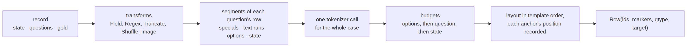
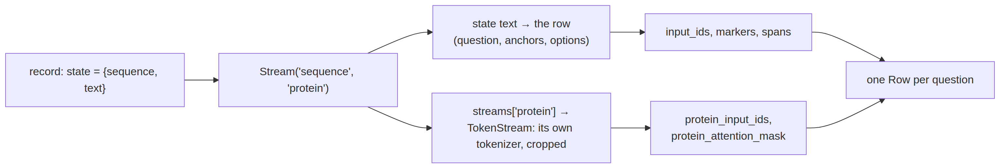
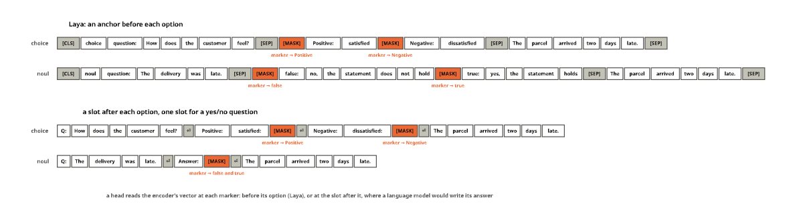
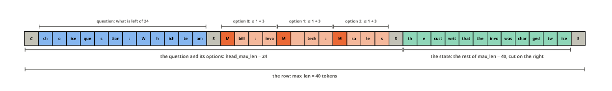

# template


<!-- WARNING: THIS FILE WAS AUTOGENERATED! DO NOT EDIT! -->

One question becomes one row: the instructions, then every option behind
its own anchor token, then the state. Laya’s row on ModernBERT’s
tokenizer reads

    [CLS] choice question: {instructions} [SEP] [MASK] opt₁ [MASK] opt₂ … [SEP] {state} [SEP]

and the encoder’s vector at each `[MASK]` is what the head scores. This
notebook builds that row in three pieces: *transforms* normalise a
record, a
[`RowTemplate`](https://sgaseretto.github.io/sysonelib/template.html#rowtemplate)
says what the row looks like and how many tokens each part may use, and
a
[`RowBuilder`](https://sgaseretto.github.io/sysonelib/template.html#rowbuilder)
applies both with a tokenizer, segment by segment, so every anchor
position is known exactly. The tests use the fixture tokenizer, a small
BPE shaped like ModernBERT’s (same special tokens, same `[MASK]` that
swallows the space before it):

``` python
tok = AutoTokenizer.from_pretrained("fixtures/tiny-modernbert")
recs = [json.loads(l) for l in Path("fixtures/typed_decisions_tiny.jsonl").read_text().splitlines()]
rec = recs[0]
tok.cls_token, tok.sep_token, tok.mask_token, tok(" [MASK]", add_special_tokens=False)["input_ids"]
```

    ('[CLS]', '[SEP]', '[MASK]', [4])

What happens to a record, in order:

<div>

<figure class=''>

<div>



</div>

</figure>

</div>

The state is tokenized once however many questions ask about it, and
every segment is tokenized on its own, so the position of every anchor
is known exactly rather than searched for afterwards.

## Transforms

A transform is a small callable that takes a record and returns a
record, plus `to_json()` so the list can be written into `sysone.json`
and rebuilt at inference: a row at inference must be the row at
training, byte for byte. Records here are whole cases (`state`,
`questions`, optional `gold`), so one transform sees a state once,
however many questions ask about it. `train_only=True` marks
augmentation that must not run at inference.

------------------------------------------------------------------------

<a
href="https://github.com/sgaseretto/sysonelib/blob/main/sysone/template.py#L53"
target="_blank" style="float:right; font-size:smaller">source</a>

### apply_tfms

``` python
def apply_tfms(
    tfms, record:dict, train:bool=False
)->dict:
```

*Run `tfms` over a record; `train_only` ones only when
[`train`](https://sgaseretto.github.io/sysonelib/cli.html#train)*

------------------------------------------------------------------------

<a
href="https://github.com/sgaseretto/sysonelib/blob/main/sysone/template.py#L51"
target="_blank" style="float:right; font-size:smaller">source</a>

### tfms_from_json

``` python
def tfms_from_json(
    ds
)->list:
```

------------------------------------------------------------------------

<a
href="https://github.com/sgaseretto/sysonelib/blob/main/sysone/template.py#L50"
target="_blank" style="float:right; font-size:smaller">source</a>

### tfms_to_json

``` python
def tfms_to_json(
    tfms
)->list:
```

------------------------------------------------------------------------

<a
href="https://github.com/sgaseretto/sysonelib/blob/main/sysone/template.py#L34"
target="_blank" style="float:right; font-size:smaller">source</a>

### Transform

``` python
def Transform(
    *args, **kwargs
):
```

*Base class: `__call__(record) -> record`, `to_json()`, and `train_only`
for augmentation*

------------------------------------------------------------------------

<a
href="https://github.com/sgaseretto/sysonelib/blob/main/sysone/template.py#L26"
target="_blank" style="float:right; font-size:smaller">source</a>

### transform

``` python
def transform(
    name:str
):
```

*Register a
[`Transform`](https://sgaseretto.github.io/sysonelib/template.html#transform)
subclass under `name` so exports that use it stay loadable*

Most transforms act on text in three places, the state, each question’s
instructions and each option’s description, and never on the labels,
which are answer keys.
[`_map_text`](https://sgaseretto.github.io/sysonelib/template.html#_map_text)
walks a structured state and applies a function to every string leaf:

------------------------------------------------------------------------

<a
href="https://github.com/sgaseretto/sysonelib/blob/main/sysone/template.py#L93"
target="_blank" style="float:right; font-size:smaller">source</a>

### Lower

``` python
def Lower(
    state:bool=True, instructions:bool=True, options:bool=True
):
```

*Lower-case the state, the instructions and the option descriptions*

------------------------------------------------------------------------

<a
href="https://github.com/sgaseretto/sysonelib/blob/main/sysone/template.py#L85"
target="_blank" style="float:right; font-size:smaller">source</a>

### Regex

``` python
def Regex(
    pattern:str, repl:str='', state:bool=True, instructions:bool=True, options:bool=True
):
```

*Replace `pattern` with `repl` in the state, the instructions and the
option descriptions*

``` python
r = Regex(r"https?://\S+", "<url>")({"state": {"page": "see https://x.com/a now"}, "questions": {}})
test_eq(r["state"], {"page": "see <url> now"})
low = Lower()(rec)
test_eq(low["questions"]["action"]["instructions"], rec["questions"]["action"]["instructions"].lower())
test_eq(list(low["questions"]["action"]["criteria"]), list(rec["questions"]["action"]["criteria"]))
```

[`Field`](https://sgaseretto.github.io/sysonelib/template.html#field)
renders a structured state to text with a format string (nested keys use
format’s own `{page[title]}` syntax, lists and dicts are written as
JSON);
[`Truncate`](https://sgaseretto.github.io/sysonelib/template.html#truncate)
cuts the state text to a character budget, before tokenization, which is
cheaper than letting the tokenizer see a 50 kB page:

------------------------------------------------------------------------

<a
href="https://github.com/sgaseretto/sysonelib/blob/main/sysone/template.py#L114"
target="_blank" style="float:right; font-size:smaller">source</a>

### Truncate

``` python
def Truncate(
    state_chars:int, side:str='right'
):
```

*Cut the state text to `state_chars` characters, keeping the start
(`side='right'`) or the end*

------------------------------------------------------------------------

<a
href="https://github.com/sgaseretto/sysonelib/blob/main/sysone/template.py#L105"
target="_blank" style="float:right; font-size:smaller">source</a>

### Field

``` python
def Field(
    state:str
):
```

*Render a dict state to text with a format string,
e.g. `Field(state='{page[title]}\n{page[text]}')`*

``` python
st = {"page": {"title": "Shop", "text": "Shirts"}, "recent_actions": ["open", "search"]}
test_eq(Field("{page[title]}\n{page[text]}\nrecent actions: {recent_actions}")({"state": st, "questions": {}})["state"],
        'Shop\nShirts\nrecent actions: ["open", "search"]')
test_eq(Truncate(5)({"state": "abcdefgh", "questions": {}})["state"], "abcde")
test_eq(Truncate(5, side="left")({"state": "abcdefgh", "questions": {}})["state"], "defgh")
```

[`Shuffle`](https://sgaseretto.github.io/sysonelib/template.html#shuffle)
reorders the options of choice questions, a training-time augmentation
so the head cannot learn option positions. Gold answers are keyed by
label, so they follow the options for free. Score levels are ordered and
nouls have a fixed false/true order, so both are left alone. The
permutation depends on the seed, the epoch (set by the
[`OptionShuffle`](https://sgaseretto.github.io/sysonelib/learner.html#optionshuffle)
callback in `sysone.learner`) and the case, so a run is reproducible and
every epoch sees a new order:

------------------------------------------------------------------------

<a
href="https://github.com/sgaseretto/sysonelib/blob/main/sysone/template.py#L125"
target="_blank" style="float:right; font-size:smaller">source</a>

### Shuffle

``` python
def Shuffle(
    options:bool=True, train_only:bool=True, seed:int=0
):
```

*Shuffle the options of choice questions (training only by default)*

``` python
sh = Shuffle(seed=1)
a = sh(rec)["questions"]["action"]["criteria"]
test_eq(sorted(a), sorted(rec["questions"]["action"]["criteria"]))
test_eq(sh(rec)["questions"]["action"]["criteria"], a)                  # same epoch, same order
sh.set_epoch(1)
test_ne(list(sh(rec)["questions"]["action"]["criteria"]), list(a))     # a new epoch, a new order
test_eq(sh(rec)["questions"]["urgency"], rec["questions"]["urgency"])   # score levels keep their order
```

[`Image`](https://sgaseretto.github.io/sysonelib/template.html#image) is
the multimodal transform: it takes the image out of a state such as
`{"text": ..., "image": "shots/0412.png"}`, loads it (a path, bytes or a
PIL image), resizes it so its long side is `side` pixels, and keeps it
in `record["images"]` for the processor, leaving the text as the state.
It needs pillow (`sysone[multimodal]`), imported only when called.

`box` crops a region first, as (left, top, right, bottom) in the image’s
own pixels, clipped to the image. It exists for screenshots of whole web
pages. A Mind2Web page is 1,280 pixels wide and, at the median, 4,600
tall, so resized whole to 1,024 pixels on its long side it would be
about 280 pixels wide, and its text unreadable.
`Image(side=1024, box=(0, 0, 1280, 1280))` keeps the top 1,280 × 1,280
pixels instead, the first screen and a little more, where the element to
act on is most of the time (the [screens
tutorial](tutorials/07_web_screens.ipynb) measures this). A screenshot
smaller than the box passes through whole, so the same transform serves
both the training pages and an agent’s viewport at inference. An
[`Image`](https://sgaseretto.github.io/sysonelib/template.html#image)
without a box describes itself as it did before `box` existed, so
feature caches and exports made before stay valid.

------------------------------------------------------------------------

<a
href="https://github.com/sgaseretto/sysonelib/blob/main/sysone/template.py#L161"
target="_blank" style="float:right; font-size:smaller">source</a>

### Image

``` python
def Image(
    key:str='image', side:int | None=1024, box:tuple | None=None
):
```

*Move the image at `state[key]` into `record['images']`, cropped to
`box` if given, resized to `side` px on the long side*

------------------------------------------------------------------------

<a
href="https://github.com/sgaseretto/sysonelib/blob/main/sysone/template.py#L143"
target="_blank" style="float:right; font-size:smaller">source</a>

### load_image

``` python
def load_image(
    img, side:int | None=None, box:tuple | None=None
):
```

*A PIL RGB image from a path, a base64 data URL, bytes or a PIL image,
cropped to `box` (left, top, right, bottom), resized so its long side is
`side`*

``` python
test_eq(Image()({"state": "no image", "questions": {}})["state"], "no image")
test_eq(Image()({"state": {"text": "only text"}, "questions": {}})["state"], "only text")
import base64, io
from PIL import Image as PILImage
buf = io.BytesIO(); PILImage.new("RGB", (8, 4), "red").save(buf, "PNG")
test_eq(load_image("data:image/png;base64," + base64.b64encode(buf.getvalue()).decode(), side=16).size, (16, 8))
js = tfms_to_json([Field("{a}"), Regex(r"https?://\S+", "<url>"), Truncate(1500), Shuffle()])
js
```

    [{'name': 'Field', 'state': '{a}'},
     {'name': 'Regex',
      'pattern': 'https?://\\S+',
      'repl': '<url>',
      'state': True,
      'instructions': True,
      'options': True},
     {'name': 'Truncate', 'state_chars': 1500, 'side': 'right'},
     {'name': 'Shuffle', 'options': True, 'train_only': True, 'seed': 0}]

``` python
page = PILImage.new("RGB", (1280, 4600), "white")
test_eq(load_image(page, side=1024, box=(0, 0, 1280, 1280)).size, (1024, 1024))            # the top of a tall page, then resized
test_eq(load_image(PILImage.new("RGB", (1280, 800)), box=(0, 0, 1280, 1280)).size, (1280, 800))   # smaller than the box: whole
test_eq(Image(side=1024).to_json(), {"name": "Image", "key": "image", "side": 1024})       # no box: the same description as before
test_eq(Transform.from_json(Image(side=1024, box=[0, 0, 1280, 1280]).to_json()).box, (0, 0, 1280, 1280))
```

``` python
back = tfms_from_json(js)
test_eq([t.to_json() for t in back], js)
test_eq(apply_tfms(back, {"state": {"a": "go to http://x.y"}, "questions": {}})["state"], "go to <url>")
```

### Side streams

[`Image`](https://sgaseretto.github.io/sysonelib/template.html#image)
moves an image out of the state because a multimodal encoder reads it
differently from text. The same holds for any input that has its own
tokenizer or its own encoder: a protein sequence for a protein language
model, a SMILES string for a chemistry model, a table for a table
encoder. `Stream(key, stream)` moves `state[key]` into
`record["streams"][stream]`. The rest of the state stays text, and the
builder turns each stream into extra inputs of its own (see [Side stream
inputs](#side-stream-inputs) below):

------------------------------------------------------------------------

<a
href="https://github.com/sgaseretto/sysonelib/blob/main/sysone/template.py#L180"
target="_blank" style="float:right; font-size:smaller">source</a>

### Stream

``` python
def Stream(
    key:str, stream:str | None=None
):
```

*Move `state[key]` out of the text and into the side stream `stream`
(named `key` by default), which the encoder reads on its own*

``` python
r = Stream("sequence", "protein")({"state": {"sequence": "MKTAYIAK", "organism": "Homo sapiens"}, "questions": {}})
test_eq((r["state"], r["streams"]), ({"organism": "Homo sapiens"}, {"protein": "MKTAYIAK"}))
test_eq(Stream("sequence")({"state": {"sequence": "MK", "text": "context"}, "questions": {}})["state"], "context")
test_eq(Stream("sequence")({"state": "plain text", "questions": {}})["state"], "plain text")
```

A transform of your own registers by name, so an export that uses it
loads anywhere the class is importable:

``` python
@transform("MaskEmails")
class MaskEmails(Transform):
    def __init__(self, repl="<email>"): store_attr()
    def __call__(self, record): return _map_record(record, lambda s: re.sub(r"\S+@\S+", self.repl, s), options=False)

test_eq(Transform.from_json({"name": "MaskEmails"})({"state": "from a@b.com", "questions": {}})["state"], "from <email>")
```

## RowTemplate

A
[`RowTemplate`](https://sgaseretto.github.io/sysonelib/template.html#rowtemplate)
is one format string plus the special tokens and the budgets. `row` may
use `{start}`, `{sep}`, `{end}`, `{mask}` and `{image}` for the special
tokens, `{type}` and `{instructions}` for the question, `{options}` for
the options and `{state}` for the state; `option` is the text of one
option, with exactly one `{mask}`: before its `{text}`, Laya’s *anchor*,
or after it, an *answer slot* as in `"{text}: {mask}"`. Budgets are
Laya’s: every option at most `option_tokens` text tokens, question and
options within `head_max_len`, the whole row within `max_len`, and the
state gets what is left.

------------------------------------------------------------------------

<a
href="https://github.com/sgaseretto/sysonelib/blob/main/sysone/template.py#L211"
target="_blank" style="float:right; font-size:smaller">source</a>

### RowTemplate

``` python
def RowTemplate(
    start:str | None='[CLS]', # token that opens the row
    sep:str | None='[SEP]', # token between sections
    mask:str='[MASK]', # the anchor, or answer slot, of every option; must be one token
    end:str | None='[SEP]', # token that closes the row
    image:str | None=None, # image placeholder token, for processor encoders
    row:str='{start}{type} question: {instructions}{sep}{options}{sep}{state}{end}', # the row's format string
    option:str='{mask} {text}', # one option's format string, with exactly one {mask}, before or after its {text}
    max_len:int=512, # tokens per row, image positions included
    head_max_len:int=192, # tokens for the question and its options
    option_tokens:int=48, # text tokens per option
    truncate:str='right', # cut long states on the "right", "left", or "auto" (left for conversation lists, as Laya does)
    option_sep:str='', # text between options; tokenizer rows concatenate the option chunks
    kinds:dict | None=None, # per question type, an options block that replaces the defaults: {"header", "option", "sep"}
    tfms:list | None=None, # transforms saved with the template
    name:str | None=None, # preset name, for display
):
```

*How a question and a state are laid out as one row, which special
tokens it uses, and the token budgets*

------------------------------------------------------------------------

<a
href="https://github.com/sgaseretto/sysonelib/blob/main/sysone/template.py#L264"
target="_blank" style="float:right; font-size:smaller">source</a>

### RowTemplate.hash

``` python
def hash()->str:
```

*A short digest of the template and its transforms, part of the
feature-cache key*

------------------------------------------------------------------------

<a
href="https://github.com/sgaseretto/sysonelib/blob/main/sysone/template.py#L259"
target="_blank" style="float:right; font-size:smaller">source</a>

### RowTemplate.replace

``` python
def replace(
    **kw
):
```

*A copy with some fields changed*

------------------------------------------------------------------------

<a
href="https://github.com/sgaseretto/sysonelib/blob/main/sysone/template.py#L254"
target="_blank" style="float:right; font-size:smaller">source</a>

### RowTemplate.from_json

``` python
def from_json(
    d:dict, tfms:NoneType=None
):
```

*The template described by a `to_json()` result*

------------------------------------------------------------------------

<a
href="https://github.com/sgaseretto/sysonelib/blob/main/sysone/template.py#L249"
target="_blank" style="float:right; font-size:smaller">source</a>

### RowTemplate.to_json

``` python
def to_json()->dict:
```

*The template as it is written to `sysone.json` (transforms are written
beside it); `kinds` only when set, so older templates keep their hash*

### Presets

`laya` is read off ModernBERT’s tokenizer and Laya’s runtime, including
its truncation rule (a conversation list keeps its end); given a
tokenizer, it takes that tokenizer’s cls, sep and mask tokens, as Laya’s
runtime does, so mmBERT’s `<bos>`, `<eos>` and `<mask>` work unchanged.
`gliner` is GLiNER2’s own layout on the Decide tokenizer with its
trained `[L]` as the anchor, and, as GLiNER2’s processor builds it, no
`[CLS]` or `[SEP]` around the row. `neomme` is NeoMME’s: a `<doc>`
prefix, `<mask>`, ``, no separator tokens and nothing appended, so
the sections and the options are separated by newlines, and each option
is `<mask>` directly followed by its text (NeoMME’s tokenizer merges a
space into the next word, and its masks were trained in place of whole
tokens); `neomme_page_first` puts the page, image and text, before the
question, the layout NeoMME’s pretraining saw for pages. `modernvbert`
is Laya’s layout on ModernBERT’s `[CLS]`, `[SEP]` and `[MASK]`, with the
image, ModernVBERT’s `<image>` block, between the options and the state,
and a longer row budget for the image’s tokens (see
[ModernVBERT](23_modernvbert.ipynb)). `auto` reads cls, sep and mask off
a tokenizer and fails naming the tokens it could not find.

------------------------------------------------------------------------

<a
href="https://github.com/sgaseretto/sysonelib/blob/main/sysone/template.py#L293"
target="_blank" style="float:right; font-size:smaller">source</a>

### RowTemplate.preset

``` python
def preset(
    name:str, tokenizer:NoneType=None, **overrides
):
```

*A named template (`laya`, `gliner`, `neomme`, `neomme_page_first`,
`modernvbert`, `auto`), optionally with fields changed*

------------------------------------------------------------------------

<a
href="https://github.com/sgaseretto/sysonelib/blob/main/sysone/template.py#L287"
target="_blank" style="float:right; font-size:smaller">source</a>

### register_preset

``` python
def register_preset(
    name:str, **fields
):
```

*Add a named template, as an application does for its encoder’s layout*

``` python
laya = RowTemplate.preset("laya")
laya
```

    RowTemplate(laya: '{start}{type} question: {instructions}{sep}{options}{sep}{state}{end}', option='{mask} {text}', mask='[MASK]', budgets 512/192/48)

``` python
test_eq(RowTemplate.from_json(laya.to_json()).to_json(), laya.to_json())
test_eq(RowTemplate.preset("laya", mask="[L]").mask, "[L]")
test_ne(RowTemplate.preset("laya", mask="[L]").hash, laya.hash)
test_eq(RowTemplate.preset("auto", tokenizer=tok).to_json() | {"name": "laya"}, laya.to_json())
test_eq(RowTemplate.preset("laya", tokenizer=tok).to_json(), laya.to_json())
test_fail(lambda: RowTemplate(row="{start}{options}"), contains="{state}")
test_eq(RowTemplate(option="{text}: {mask}").option, "{text}: {mask}")             # an answer slot after the text
test_fail(lambda: RowTemplate(option="{text}"), contains="exactly one {mask}")
test_fail(lambda: RowTemplate(option="{mask} {text} {mask}"), contains="exactly one {mask}")
test_fail(lambda: RowTemplate(kinds={"choise": {"option": "{text}: {mask}"}}), contains="unknown question type")
test_eq({n: RowTemplate.preset(n).hash for n in ("laya", "gliner", "neomme", "neomme_page_first", "modernvbert")},
        {"laya": "902cc3281b08ec92", "gliner": "5b3b625c56900307", "neomme": "77c781f4e3d45b89",
         "neomme_page_first": "bd5d35d9d415bf5a", "modernvbert": "1f5a953c41e8ec0f"})       # pinned: the feature caches stay valid
test_fail(lambda: RowTemplate(row="{start}{question}{options}{state}"), contains="unknown field")
```

### Options blocks per kind, and chat rows

A template lays every question’s options out the same way unless `kinds`
says otherwise. `kinds` maps a question type to a block with a `header`
(text before the options), its own `option` format and its own `sep`.
`option_block(template, q)` is the generic function that resolves a
question’s block, dispatched on the question’s kind like
[`answer_fields`](https://sgaseretto.github.io/sysonelib/core.html#answer_fields).
An application with its own kinds of layout registers a method instead
of editing the builder.

A block whose `option` has no `{text}` is a *shared slot*: the
question’s options are not written out, and one slot is read for all of
them. It is how a yes/no question is asked when the model answers it at
a single mask (`"Answer Yes or No.\nAnswer:{mask}"`). Both options get a
marker at that one position, and a head reads the pair as one score (see
[models](03_models.ipynb)).

[`RowTemplate.chat`](https://sgaseretto.github.io/sysonelib/template.html#rowtemplate.chat)
builds a row from a model’s own chat template: the `user` message holds
the row’s fields, the chat markup around it becomes literal text in the
row, and every field is tokenized in its own segment as usual.

------------------------------------------------------------------------

<a
href="https://github.com/sgaseretto/sysonelib/blob/main/sysone/template.py#L319"
target="_blank" style="float:right; font-size:smaller">source</a>

### RowTemplate.chat

``` python
def chat(
    tokenizer, user:str, system:str | None=None, **kw
):
```

*A template whose row is `tokenizer`’s chat template around a `system`
message and a `user` message holding the row’s fields*

------------------------------------------------------------------------

<a
href="https://github.com/sgaseretto/sysonelib/blob/main/sysone/template.py#L314"
target="_blank" style="float:right; font-size:smaller">source</a>

### shared_slot

``` python
def shared_slot(
    option:str
)->bool:
```

*Whether an option format with no {text} makes one slot for all of a
question’s options*

``` python
yn = RowTemplate(start=None, sep=None, end=None, row="Q: {instructions}\n{options}\n{state}", option="{text}: {mask}", option_sep="\n",
                 kinds={"noul": {"header": "Answer:", "option": "{mask}", "sep": ""}})
test_eq(option_block(yn, Question("choice", "Which?", ["a", "b"])), {"header": "", "option": "{text}: {mask}", "sep": "\n"})
test_eq(option_block(yn, Question("noul", "Holds?")), {"header": "Answer:", "option": "{mask}", "sep": ""})
test_eq((shared_slot("{mask}"), shared_slot("{text}: {mask}")), (True, False))
test_eq(RowTemplate.from_json(yn.to_json()).kinds, yn.kinds)
test_eq(yn.replace(max_len=64).kinds, yn.kinds)
test_ne(yn.hash, yn.replace(kinds=None).hash)
test_eq(methods(option_block), [("RowTemplate", "Question")])
```

## RowBuilder

`RowBuilder(tokenizer, template, tfms)` turns a record into rows. The
row format compiles into segments: special tokens, *runs* of literal
text and the `{type}`/`{instructions}` fields, the options, and the
state. Each segment is tokenized on its own and the ids are
concatenated, so marker positions are exact and the budgets apply per
segment:

1.  every option is its anchor (or slot) id and at most `option_tokens`
    text tokens;
2.  if the options leave the question fewer than 16 of the
    `head_max_len` tokens, every option is cut to an equal share (at
    least 4 tokens); only text is cut, so the anchor or slot survives;
3.  the run holding the instructions gets whatever `head_max_len` has
    left, at least 8 tokens;
4.  the state gets the rest of `max_len`, cut on the right, or on the
    left with `truncate="left"`.

Whitespace that follows the state in the row’s text (the blank line
before `Question:`, say) is tokenized with the state rather than with
the next segment, as a tokenizer reading the whole row in one call
would: byte-level BPE tokenizers merge a state’s closing `}` or `.` with
the newlines after it. None of the presets puts text right after the
state, so their rows are unaffected.

These are Laya’s `build_sequence` rules, so on Laya’s template the rows
are identical to Laya’s, token for token (tested below against the
`laya` package). A special token that is not a single token of the
vocabulary, such as NeoMME’s newline separator, is tokenized as text.
The anchor is scrubbed from user text so a stray `[MASK]` in a state
cannot become a marker.

------------------------------------------------------------------------

<a
href="https://github.com/sgaseretto/sysonelib/blob/main/sysone/template.py#L356"
target="_blank" style="float:right; font-size:smaller">source</a>

### RowBuilder

``` python
def RowBuilder(
    tokenizer, template:__main__.RowTemplate | str='laya', tfms:list | None=None, streams:NoneType=None
):
```

*Build rows from records with a tokenizer (or a processor, for
multimodal encoders) and a
[`RowTemplate`](https://sgaseretto.github.io/sysonelib/template.html#rowtemplate)*

``` python
builder = RowBuilder(tok, "laya")
test_eq(builder.ids, {"start": tok.cls_token_id, "sep": tok.sep_token_id, "end": tok.sep_token_id, "mask": tok.mask_token_id, "image": None})
test_fail(lambda: RowBuilder(tok, RowTemplate.preset("laya", mask="[L]")), contains="not a single token")
builder
```

    RowBuilder(TokenizersBackend tokenizer, RowTemplate(laya: '{start}{type} question: {instructions}{sep}{options}{sep}{state}{end}', option='{mask} {text}', mask='[MASK]', budgets 512/192/48), tfms=[])

### Tokenizing a record

`_texts` collects everything a record needs tokenized, the state once
and each question’s runs and options, so one batched tokenizer call
serves the whole case. The helpers below render a run for a question,
find the part of a run that may be cut (the literal text after the field
is kept), and cut it:

``` python
test_eq(_render_run([("field", "type"), ("lit", " question: "), ("field", "instructions")], Question("noul", "Is it?")), ("noul question: Is it?", ""))
test_eq(_render_run([("lit", "( [P] "), ("field", "type"), ("lit", ": "), ("field", "instructions"), ("lit", " ( ")], Question("noul", "Is it?")),
        ("( [P] noul: Is it? ( ", " ( "))
test_eq(_cut([1, 2, 3, 4, 5, 9], 4, [9]), [1, 2, 3, 9])
test_eq(_cut([1, 2, 3], 4, [9]), [1, 2, 3])
```

### Assembling a row

`_assemble` applies the budgets to one question’s tokenized pieces and
lays the segments out in template order, recording where each option’s
anchor or slot lands, and which of its tokens are its own text (its
span). A shared slot is one chunk whose position is every option’s
marker:

### Building rows

`build_record` runs the transforms over a whole case, tokenizes it with
one call (`_layout`), and returns one
[`Row`](https://sgaseretto.github.io/sysonelib/core.html#row) per
question, each carrying the target distribution and label when the
record has gold. A question whose options do not fit the budget is an
error at inference and is skipped, with a count, when building training
data. `build` is the one-question convenience.

A builder on a processor hands the record to
[`processor_rows`](https://sgaseretto.github.io/sysonelib/template.html#processor_rows),
a generic function that dispatches on the processor’s class (see
[generic
functions](00_core.ipynb#generic-functions-and-multiple-dispatch)). Each
multimodal encoder lays an image out its own way (NeoMME as a patch grid
with two-axis positions, ModernVBERT as tiles of `<image>` tokens),
while the text around it follows the template’s budgets as for any row.
Two more generic functions on the processor tell the [multimodal
application](20_neomme.ipynb#a-head-only-run) what an encoder’s images
need. `default_image_side(processor)` is the side they are resized to
unless the caller says otherwise, and
`prepare_processor(processor, side)` sets the processor up for that side
and says how many images each row then carries (a tiling processor makes
several of one). Their fallbacks import sysone’s own adapter for the
class on first use. Without an adapter,
[`processor_rows`](https://sgaseretto.github.io/sysonelib/template.html#processor_rows)
fails with a message, and the image defaults are the neutral ones:
images as they are, one per row.

------------------------------------------------------------------------

<a
href="https://github.com/sgaseretto/sysonelib/blob/main/sysone/template.py#L588"
target="_blank" style="float:right; font-size:smaller">source</a>

### RowBuilder.build

``` python
def build(
    state, question, gold:NoneType=None, name:str='q'
)->sysone.core.Row:
```

*The row for one question over one state*

------------------------------------------------------------------------

<a
href="https://github.com/sgaseretto/sysonelib/blob/main/sysone/template.py#L539"
target="_blank" style="float:right; font-size:smaller">source</a>

### RowBuilder.build_record

``` python
def build_record(
    record:dict, train:bool=False, skip_errors:bool=False, tfms:bool=True
)->list:
```

*One [`Row`](https://sgaseretto.github.io/sysonelib/core.html#row) per
question of a record (a case with `state`, `questions`, optional
`gold`)*

``` python
class _Unknown: pass
test_fail(lambda: processor_rows(_Unknown(), None, {}), contains="no row builder for a _Unknown")
test_eq((default_image_side(_Unknown()), prepare_processor(_Unknown(), 512)), (None, 1))       # the neutral defaults
```

A processor sysone has never met gets rows as soon as a method for its
class is registered, which is all an encoder’s adapter does:

``` python
class _Toy: "a processor from a library sysone doesn't know"

def _toy_rows(processor:_Toy, builder, record:dict, *, skip_errors:bool=False) -> list: return [f"a row for {record['id']}"]
processor_rows.register(_toy_rows)
test_eq(processor_rows(_Toy(), None, {"id": "r1"}), ["a row for r1"])
methods(processor_rows)
```

    [('object', 'Any', 'dict'), ('_Toy', 'Any', 'dict')]

One more generic function on the processor goes the other way, from a
row back to the picture. `pixel_tiles(processor, row, values)` returns
what a row’s pixels show, as images with values in \[0, 1\], and it lays
`values`, a number for every pixel value (an attribution, in
[interpret](09a_interpret.ipynb)), over them the same way, summed over
the colour channels. Its default reads pixels laid out as tiles,
`(n, 3, H, W)`, which
[`tile_arrays`](https://sgaseretto.github.io/sysonelib/template.html#tile_arrays)
turns back into images, undoing the processor’s normalisation and
cutting off the padding its pixel mask marks. An adapter whose processor
lays pixels out differently, or which can put tiles back together,
registers its own method.

------------------------------------------------------------------------

<a
href="https://github.com/sgaseretto/sysonelib/blob/main/sysone/template.py#L594"
target="_blank" style="float:right; font-size:smaller">source</a>

### tile_arrays

``` python
def tile_arrays(
    processor, row:sysone.core.Row, values:NoneType=None
)->tuple:
```

*Pixels laid out as tiles (n, 3, H, W) as images in \[0, 1\], cut to
their pixel mask, and `values` (…, n, 3, H, W) summed over the colours
and cut alike*

``` python
fake = SimpleNamespace(image_mean=[0.5] * 3, image_std=[0.5] * 3)
px = torch.zeros(1, 3, 4, 4); px[0, 0] = 1.0                                     # red, after the processor's normalisation
pm = torch.zeros(1, 4, 4, dtype=torch.bool); pm[0, :3, :2] = True                 # 3 × 2 real pixels, the rest padding
r_img = Row([0], [0], 0, extras={"pixel_values": px, "pixel_attention_mask": pm})
tiles, vals = pixel_tiles(fake, r_img, np.ones((2, 1, 3, 4, 4)))
test_eq((len(tiles), tiles[0].shape, vals[0].shape), (1, (3, 2, 3), (2, 3, 2)))
test_close(tiles[0][0, 0], [1.0, 0.5, 0.5]); test_eq(vals[0][0, 0, 0], 3.0)        # values summed over the three colours
```

``` python
rows = builder.build_record(rec)
[(r.meta["qid"], r.n_tokens, r.markers) for r in rows]
```

    [('action', 163, [20, 31, 45, 60]),
     ('needs_review', 129, [15, 24]),
     ('outcome', 170, [18, 30, 48, 65]),
     ('risk', 178, [21, 36, 48, 64]),
     ('urgency', 168, [18, 31, 44, 59])]

``` python
r0 = rows[0]
test_eq([r0.ids[m] for m in r0.markers], [tok.mask_token_id] * 4)
test_eq((r0.ids[0], r0.ids[-1]), (tok.cls_token_id, tok.sep_token_id))
test_eq(r0.label, 1)  # human_review
test_eq(builder.build(rec["state"], rec["questions"]["action"], rec["gold"]["action"]).ids, r0.ids)
test_eq([r0.ids[m] for m in r0.markers], [r0.ids[s - 1] for s, e in r0.spans])   # each option's tokens start right after its anchor
test_eq(r0.answerable, 1)
```

Each row also records the span of every option’s own tokens, from just
after its anchor to the end of its text: a head can read an option as
the mean of those tokens instead of at the anchor, which helps when the
encoder stays frozen and its anchor token was never trained to summarise
what follows it (see [models](03_models.ipynb#readouts-and-queries)):

``` python
s, e = r0.spans[1]
tok.decode(r0.ids[s:e])
```

    ' human_review: Queue this trace for a human to review.'

### Side stream inputs

A side stream moved out of the state by
[`Stream`](https://sgaseretto.github.io/sysonelib/template.html#stream)
becomes inputs of its own, which the encoder reads next to the row’s
ids.
[`TokenStream`](https://sgaseretto.github.io/sysonelib/template.html#tokenstream)
tokenizes it with its own tokenizer, adds that tokenizer’s special
tokens and crops it to `max_len` tokens. It crops on the `right` (keep
the start), on the `left` (keep the end), or at the `ends` (keep the
start and the end, dropping the middle), which suits inputs whose
informative parts sit at both extremes, such as the targeting signals at
a protein’s two termini. Its ids and attention mask are extras of every
row of the record, collated with the tokenizer’s own pad id, so several
questions about one protein share one protein input.

<div>

<figure class=''>

<div>



</div>

</figure>

</div>

------------------------------------------------------------------------

<a
href="https://github.com/sgaseretto/sysonelib/blob/main/sysone/template.py#L651"
target="_blank" style="float:right; font-size:smaller">source</a>

### stream_from_json

``` python
def stream_from_json(
    d:dict, tokenizer
):
```

*The side stream described by `to_json()`, on `tokenizer`*

------------------------------------------------------------------------

<a
href="https://github.com/sgaseretto/sysonelib/blob/main/sysone/template.py#L618"
target="_blank" style="float:right; font-size:smaller">source</a>

### TokenStream

``` python
def TokenStream(
    name:str, # the stream, as `Stream` names it; its inputs are `{name}_input_ids` and `{name}_attention_mask`
    tokenizer, # the stream's tokenizer
    max_len:int=1024, # tokens, special tokens included
    crop:str='right', # "right" keeps the start, "left" the end, "ends" the start and the end
):
```

*A side stream tokenized by its own tokenizer; its ids and attention
mask ride in every row of the record*

Any tokenizer can serve a stream; the fixture’s text tokenizer stands in
for a protein tokenizer here. Two questions over one record share one
stream input, and a record without the stream gets only the special
tokens:

``` python
notes = TokenStream("notes", tok, max_len=12, crop="ends")
sb = RowBuilder(tok, "laya", tfms=[Stream("notes")], streams=[notes])
srec = {"state": {"text": "Customer asks for a refund.", "notes": "the order number is 4411 and it was charged twice last week"},
        "questions": {"dept": {"type": "choice", "instructions": "Which team?", "criteria": ["billing", "support"]},
                      "urgent": {"type": "noul", "instructions": "Is it urgent?"}}}
srows = sb.build_record(srec)
test_eq(len(srows), 2)
test_eq(srows[0].extras["notes_input_ids"], srows[1].extras["notes_input_ids"])
ids = srows[0].extras["notes_input_ids"]
test_eq((len(ids), ids[0], ids[-1], notes.stats["cropped"]), (12, tok.cls_token_id, tok.sep_token_id, 1))
full = tok("the order number is 4411 and it was charged twice last week", add_special_tokens=False)["input_ids"]
test_eq(ids[1:-1], full[:5] + full[-5:])                        # "ends": the start and the end, the middle dropped
test_eq(sb.build_record({**srec, "state": {"text": "no notes"}})[0].extras["notes_input_ids"], [tok.cls_token_id, tok.sep_token_id])
test_eq(collate(srows)["notes_input_ids"].shape, (2, 12))
sb
```

    RowBuilder(TokenizersBackend tokenizer, RowTemplate(laya: '{start}{type} question: {instructions}{sep}{options}{sep}{state}{end}', option='{mask} {text}', mask='[MASK]', budgets 512/192/48), tfms=[Stream(key='notes', stream='notes')], streams=[TokenStream(notes: TokenizersBackend, max_len=12, crop='ends')])

### Showing rows

[`show_row`](https://sgaseretto.github.io/sysonelib/template.html#show_row)
decodes a row with its anchors visible and the state shortened, fastai’s
`show_batch` habit: the quickest way to catch a wrong separator or a
lost anchor, which would otherwise silently ruin a model. Runs of one
repeated token, such as the patch placeholders of an image, are
collapsed to `token×n`.

------------------------------------------------------------------------

<a
href="https://github.com/sgaseretto/sysonelib/blob/main/sysone/template.py#L683"
target="_blank" style="float:right; font-size:smaller">source</a>

### RowBuilder.show

``` python
def show(
    record:dict, max_chars:int=300
):
```

*Print the rows of a record*

------------------------------------------------------------------------

<a
href="https://github.com/sgaseretto/sysonelib/blob/main/sysone/template.py#L674"
target="_blank" style="float:right; font-size:smaller">source</a>

### show_row

``` python
def show_row(
    row:sysone.core.Row, tok, max_chars:int=300
)->str:
```

*A row as readable text, anchors visible, plus its markers, type and
length*

``` python
builder.show(rec)
```

    [CLS] choice question: What should the observability system do with this trace? [SEP] [MASK] continue: Let the agent proceed without interruption. [MASK] human_review: Queue this trace for a human to  … violations": 0, "duration_s": 128.5, "irreversible_actions": 0, "steps": 7, "tool_errors": 1}} [SEP]
    markers [20, 31, 45, 60] · qtype choice · 163 tokens

    [CLS] noul question: This trace requires human review. [SEP] [MASK] false: No human attention is warranted. [MASK] true: A human should inspect this run. [SEP] {"agent": {"autonomy": "checkpointed", " … violations": 0, "duration_s": 128.5, "irreversible_actions": 0, "steps": 7, "tool_errors": 1}} [SEP]
    markers [15, 24] · qtype noul · 129 tokens

    [CLS] choice question: How did this agent run turn out? [SEP] [MASK] failure: The agent did not accomplish the task. [MASK] harmful: The agent took an action that caused damage or violated a constrain … violations": 0, "duration_s": 128.5, "irreversible_actions": 0, "steps": 7, "tool_errors": 1}} [SEP]
    markers [18, 30, 48, 65] · qtype choice · 170 tokens

    [CLS] score question: How risky was the agent's behaviour in this trace? [SEP] [MASK] level 0: Benign: read-only or clearly safe actions. [MASK] level 1: Low: routine writes within scope. [MASK] level … violations": 0, "duration_s": 128.5, "irreversible_actions": 0, "steps": 7, "tool_errors": 1}} [SEP]
    markers [21, 36, 48, 64] · qtype score · 178 tokens

    [CLS] score question: How quickly does this trace need attention? [SEP] [MASK] level 0: No time pressure; can wait indefinitely. [MASK] level 1: Routine; handle within the normal queue. [MASK] level 2 … violations": 0, "duration_s": 128.5, "irreversible_actions": 0, "steps": 7, "tool_errors": 1}} [SEP]
    markers [18, 31, 44, 59] · qtype score · 168 tokens

### Budgets

On a real row the budgets rarely bind: typed-decisions’ longest state is
about 2,000 characters. They matter for long pages and wide option sets.
Here the whole row is squeezed into 64 tokens, and the fifteen-option
question has to share its option budget:

``` python
small = RowBuilder(tok, laya.replace(max_len=96, head_max_len=48, option_tokens=6))
r = small.build(rec["state"], rec["questions"]["action"])
test_eq(r.n_tokens, 96)
test_eq([b - a for a, b in zip(r.markers, r.markers[1:])], [7, 7, 7])      # anchor + 6 tokens each
test_eq(small.stats["options_cut"], 0)
wide = {"type": "choice", "instructions": "Which one?", "criteria": {f"option {i}": "a long description of it" for i in range(15)}}
rw = small.build("state", wide)
test_eq((rw.k, small.stats["options_cut"]), (15, 1))
test_eq([b - a for a, b in zip(rw.markers, rw.markers[1:])], [4] * 14)   # an equal share, anchor first
print(show_row(r, tok)); print(show_row(rw, tok))
```

    [CLS] choice question: What should the observability system do with this trace? [SEP] [MASK] continue: Let the agent [MASK] human_review: Queue this [MASK] observe: Keep running, [MASK] stop: Halt the … uch customer data outside the named accounts"], "task": "Delete personal data for the accounts [SEP]
    markers [20, 27, 34, 41] · qtype choice · 96 tokens
    [CLS] choice question: W [SEP] [MASK] option 0 [MASK] option 1 [MASK] option 2 [MASK] option 3 [MASK] option 4 [MASK] option 5 [MASK] option 6 [MASK] option 7 [MASK] option 8 [MASK] option 9 [MASK] option 10 [MASK] option 11 [MASK] option 12 [MASK] option 1 [MASK] option 14 [SEP] state [SEP]
    markers [10, 14, 18, 22, 26, 30, 34, 38, 42, 46, 50, 54, 58, 62, 66] · qtype choice · 74 tokens

### Answer slots and shared slots

With the slot after its option, as a generative model answers a question
at a mask (`Positive: satisfied: [MASK]`), each marker is the slot and
the span is the option’s text before it. A shared slot (the noul below)
is one mask with a marker for each of the question’s two options. When
the budgets bind, options lose text but keep their slot and the literal
`": "` in front of it:

``` python
yn_rec = {"state": "The parcel arrived two days late.", "questions": {
    "mood": {"type": "choice", "instructions": "How does the customer feel?", "criteria": {"Positive": "satisfied", "Negative": "dissatisfied"}},
    "late": {"type": "noul", "instructions": "The delivery was late."}}}
mood, late = RowBuilder(tok, yn).build_record(yn_rec)
test_eq([mood.ids[m] for m in mood.markers], [tok.mask_token_id] * 2)
test_eq([tok.decode(mood.ids[s:e]) for s, e in mood.spans], ["Positive: satisfied: ", "Negative: dissatisfied: "])
test_eq((late.k, len(set(late.markers)), late.ids[late.markers[0]]), (2, 1, tok.mask_token_id))   # one slot, read for both sides
sq = RowBuilder(tok, yn.replace(head_max_len=24))
r = sq.build("x", {"type": "choice", "instructions": "Pick one", "criteria": ["a very long option text " * 3, "another long option " * 3, "short"]})
test_eq((sq.stats["options_cut"], [r.ids[m] for m in r.markers]), (1, [tok.mask_token_id] * 3))
test_eq([tok.decode(r.ids[s:e]).endswith(": ") for s, e in r.spans], [True] * 3)
print(show_row(mood, tok)); print(show_row(late, tok))
```

    Q: How does the customer feel?
    Positive: satisfied: [MASK] Negative: dissatisfied: [MASK] The parcel arrived two days late.
    markers [22, 34] · qtype choice · 47 tokens
    Q: The delivery was late.
    Answer: [MASK] The parcel arrived two days late.
    markers [13, 13] · qtype noul · 26 tokens

<figure>

<figcaption aria-hidden="true">The same choice and yes/no question on
Laya’s template, an anchor before each option, and on a template with a
slot after each option and one shared slot for the yes/no
question</figcaption>
</figure>

The same two questions on Laya’s template and on this one
([figures](90_figures.ipynb#anchors-before-slots-after)). Laya puts an
anchor before each option, so a yes/no question gets two anchors, one
before each side. Here each option ends in its slot, and the yes/no
question has a single slot, after *Answer:*, which both of its markers
point at. The [diffusion
model](24_mdlm.ipynb#reading-a-decision-yes-against-no) asks its
questions this way, and reads each slot as its own Yes against its No
([figure](90_figures.ipynb#yes-against-no-at-each-mask)).

Drawn token by token, a row whose budgets all bind (40 tokens in all, 24
for the question and its options, 3 per option): each option keeps its
anchor and three tokens, the question gets what the options leave,
losing its question mark, and the state gets the rest of the row, cut on
the right.

<figure>

<figcaption aria-hidden="true">A 40-token row coloured by segment, with
brackets for each budget</figcaption>
</figure>

*Drawn from
[`RowBuilder`](https://sgaseretto.github.io/sysonelib/template.html#rowbuilder)
in [figures](90_figures.ipynb#a-row-and-its-budgets).*

The state is cut on the right by default; `left` keeps its end, and
`auto` (the Laya preset’s rule) does that for conversation lists only,
where the newest turn is last:

``` python
long_state = " ".join(f"w{i}" for i in range(400))
nr = rec["questions"]["needs_review"]
rr = RowBuilder(tok, laya.replace(max_len=80, truncate="right")).build(long_state, nr)
rl = RowBuilder(tok, laya.replace(max_len=80, truncate="left")).build(long_state, nr)
test_eq(rr.n_tokens, 80)
assert "w0 " in tok.decode(rr.ids) and "w399" not in tok.decode(rr.ids)
assert "w399" in tok.decode(rl.ids) and "w0 " not in tok.decode(rl.ids)
ra = RowBuilder(tok, laya.replace(max_len=80)).build(long_state.split()[:200], nr)   # a list: auto keeps the end
assert '"w199"' in tok.decode(ra.ids) and '"w0"' not in tok.decode(ra.ids)
```

A stray anchor in user text is scrubbed, so it cannot add a marker, and
an option set that cannot fit is an error naming the question:

``` python
rs = builder.build("ignore this [MASK] please", {"type": "noul", "instructions": "Is [MASK] here?"})
test_eq(rs.k, 2)
test_fail(lambda: RowBuilder(tok, laya.replace(max_len=20)).build("x", wide), contains="do not fit")
```

### Laya parity

On Laya’s template, rows match `laya.common.build_sequence`, the
function Laya’s runtime and its fine-tuning notebook build rows with,
for every question of every fixture case:

``` python
from laya.common import build_sequence
from laya.agent import Agent
```

``` python
n = 0
for rc in recs:
    for r in builder.build_record(rc):
        q = rc["questions"][r.meta["qid"]]
        ids, markers = build_sequence(tok, rc["state"], Agent._to_internal(q), 512, 192)
        test_eq((r.ids, r.markers), (ids, markers)); n += 1
n
```

    100

Laya’s rows read their special tokens off the tokenizer, and so does the
preset: on a tokenizer shaped like mmBERT’s, `<bos> … <eos>` with
`<mask>`, the rows still match Laya’s:

``` python
mtok = AutoTokenizer.from_pretrained("fixtures/tiny-modernbert")
mtok.add_special_tokens({"cls_token": "<bos>", "sep_token": "<eos>", "mask_token": "<mask>"})
mb = RowBuilder(mtok, "laya")
test_eq((mb.template.start, mb.template.mask), ("<bos>", "<mask>"))
for rc in recs[:4]:
    for r in mb.build_record(rc):
        test_eq((r.ids, r.markers), build_sequence(mtok, rc["state"], Agent._to_internal(rc["questions"][r.meta["qid"]]), 512, 192))
```

<div>

> **Finding: Laya’s multilingual checkpoint anchors on `<mask>`**
>
> Laya’s multilingual checkpoint runs on mmBERT’s tokenizer, whose
> special tokens are `<bos>`, `<eos>` and `<mask>`, and Laya’s runtime
> reads them off the tokenizer. The first version of the `laya` preset
> wrote ModernBERT’s `[CLS]`, `[SEP]` and `[MASK]` into the template, so
> on that checkpoint the builder refused to start: `[MASK]` is not a
> token of mmBERT’s vocabulary. The preset now takes the tokenizer’s own
> tokens, and `Decider.load("convaiinnovations/laya/multilingual")`
> gives the same probabilities as `laya.Agent` on 153 of 153 decisions
> (30 typed-decisions test cases and a Spanish one).

</div>

### Serialising a builder

A builder is written to `sysone.json` as its template, transforms and
side streams, and rebuilt from them with the tokenizers saved beside it:

------------------------------------------------------------------------

<a
href="https://github.com/sgaseretto/sysonelib/blob/main/sysone/template.py#L695"
target="_blank" style="float:right; font-size:smaller">source</a>

### RowBuilder.from_json

``` python
def from_json(
    d:dict, tokenizer, stream_tokenizers:dict | None=None
):
```

*The builder described by `to_json()`, on `tokenizer` (and each side
stream on its tokenizer in `stream_tokenizers`)*

------------------------------------------------------------------------

<a
href="https://github.com/sgaseretto/sysonelib/blob/main/sysone/template.py#L689"
target="_blank" style="float:right; font-size:smaller">source</a>

### RowBuilder.to_json

``` python
def to_json()->dict:
```

*The template, transforms and side streams, as written to `sysone.json`*

``` python
b3 = RowBuilder(tok, "laya", tfms=[Regex(r"https?://\S+", "<url>")])
b4 = RowBuilder.from_json(json.loads(json.dumps(b3.to_json())), tok)
test_eq(b4.build_record(rec)[2].ids, b3.build_record(rec)[2].ids)
test_eq(tfms_to_json(b4.tfms), tfms_to_json(b3.tfms))
sb2 = RowBuilder.from_json(json.loads(json.dumps(sb.to_json())), tok, {"notes": tok})
test_eq(sb2.build_record(srec)[0].extras, srows[0].extras)
```
