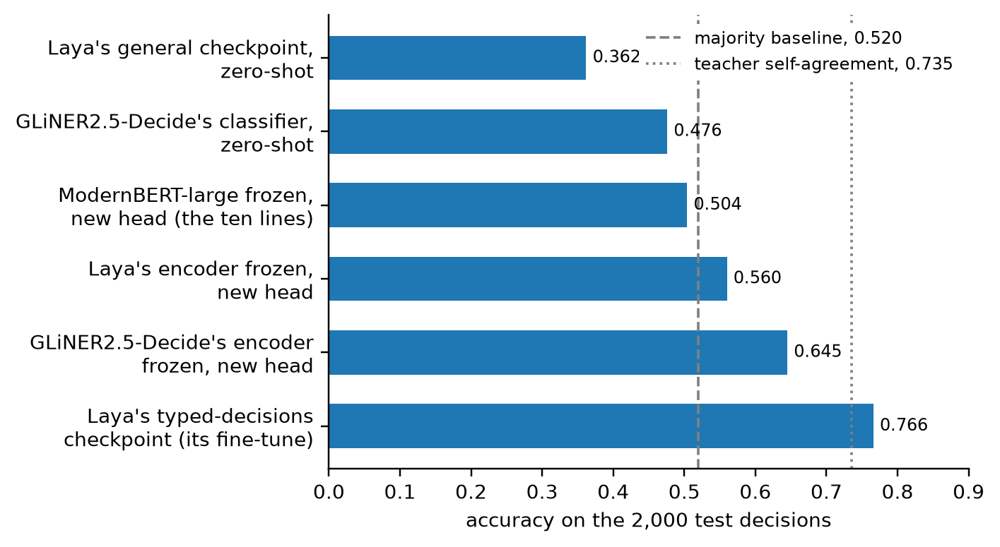

# text


<!-- WARNING: THIS FILE WAS AUTOGENERATED! DO NOT EDIT! -->

The application layer only chooses defaults; every layer below stays
reachable. For text that means ModernBERT-large as the encoder, Laya’s
row template, and the cheap experiment as the default path: with
`train="head"` the encoder is frozen and runs once to fill a cache of
anchor vectors, and the head (Laya’s scorer, without layers) trains from
the cache in seconds. `lora`, `mica` and `full` are one argument away,
and drop the cache.

------------------------------------------------------------------------

<a
href="https://github.com/sgaseretto/sysonelib/blob/main/sysone/gliner.py#L212"
target="_blank" style="float:right; font-size:smaller">source</a>

### decision_learner

``` python
def decision_learner(
    data:sysone.data.TypedDecisions, encoder:str='answerdotai/ModernBERT-large', train:str='head', cache:str='auto',
    head:str | None=None, **kw
)->sysone.learner.Learner:
```

*A text
[`Learner`](https://sgaseretto.github.io/sysonelib/learner.html#learner):
ModernBERT-large, and with `train='head'` a frozen encoder training from
cached anchor vectors*

``` python
fresh = subprocess.run([sys.executable, "-c", "import sysone.text, sysone.learner as L; print(hasattr(L.Learner, 'fit_linear'))"],
                       capture_output=True, text=True)
test_eq(fresh.stdout.strip(), "True")      # in a fresh session the application brings the cache's verbs, fit_linear among them
```

The ten lines, on the fixtures (the real encoder and data are one string
each away; see below):

``` python
data  = TypedDecisions.from_json("fixtures/typed_decisions_tiny.jsonl", valid=0.25, calib=0.25)
learn = decision_learner(data, "fixtures/tiny-modernbert", train="head", preset="cpu", cache_dir=tempfile.mkdtemp())
learn.lr_find(steps=30)
learn.fit_one_cycle(4, lr=3e-3)
learn.calibrate(min_rows=4)
rec = data.cases["valid"][0]; state, questions = load_record(rec)["state"], load_record(rec)["questions"]
answers = learn.predict(state, questions)
path = learn.export(Path(tempfile.mkdtemp()) / "my-jev")
jev = Decider.load(path, device="cpu")
jev.predict(state, questions)
```

    {'loss': '0.7917', 'grad_norm': '0.004903', 'learning_rate': '1e-07', 'epoch': '0.1429'}
    {'loss': '1.227', 'grad_norm': '0.003081', 'learning_rate': '1.743e-07', 'epoch': '0.2857'}
    {'loss': '1.409', 'grad_norm': '0.001279', 'learning_rate': '3.039e-07', 'epoch': '0.4286'}
    {'loss': '0.3029', 'grad_norm': '0.002017', 'learning_rate': '5.298e-07', 'epoch': '0.5714'}
    {'loss': '1.244', 'grad_norm': '0.002422', 'learning_rate': '9.237e-07', 'epoch': '0.7143'}
    {'loss': '1.142', 'grad_norm': '0.004203', 'learning_rate': '1.61e-06', 'epoch': '0.8571'}
    {'loss': '0.5805', 'grad_norm': '0.002901', 'learning_rate': '2.807e-06', 'epoch': '1'}
    {'loss': '1.106', 'grad_norm': '0.004044', 'learning_rate': '4.894e-06', 'epoch': '1.143'}
    {'loss': '0.8423', 'grad_norm': '0.004899', 'learning_rate': '8.532e-06', 'epoch': '1.286'}
    {'loss': '0.9465', 'grad_norm': '0.003305', 'learning_rate': '1.487e-05', 'epoch': '1.429'}
    {'loss': '1.196', 'grad_norm': '0.00248', 'learning_rate': '2.593e-05', 'epoch': '1.571'}
    {'loss': '1.016', 'grad_norm': '0.005728', 'learning_rate': '4.52e-05', 'epoch': '1.714'}
    {'loss': '1.305', 'grad_norm': '0.002554', 'learning_rate': '7.88e-05', 'epoch': '1.857'}
    {'loss': '0.8146', 'grad_norm': '0.003126', 'learning_rate': '0.0001374', 'epoch': '2'}
    {'loss': '1.369', 'grad_norm': '0.005166', 'learning_rate': '0.0002395', 'epoch': '2.143'}
    {'loss': '0.6023', 'grad_norm': '0.004846', 'learning_rate': '0.0004175', 'epoch': '2.286'}
    {'loss': '0.3423', 'grad_norm': '0.007375', 'learning_rate': '0.0007279', 'epoch': '2.429'}
    {'loss': '1.075', 'grad_norm': '0.004925', 'learning_rate': '0.001269', 'epoch': '2.571'}
    {'loss': '1.383', 'grad_norm': '0.006568', 'learning_rate': '0.002212', 'epoch': '2.714'}
    {'loss': '0.8666', 'grad_norm': '0.003571', 'learning_rate': '0.003857', 'epoch': '2.857'}
    {'loss': '0.8454', 'grad_norm': '0.006292', 'learning_rate': '0.006723', 'epoch': '3'}
    {'loss': '0.7632', 'grad_norm': '0.005164', 'learning_rate': '0.01172', 'epoch': '3.143'}
    {'loss': '1.134', 'grad_norm': '0.00905', 'learning_rate': '0.02043', 'epoch': '3.286'}
    {'loss': '1.464', 'grad_norm': '0.008605', 'learning_rate': '0.03562', 'epoch': '3.429'}
    {'loss': '1.059', 'grad_norm': '0.01529', 'learning_rate': '0.0621', 'epoch': '3.571'}
    {'loss': '1.604', 'grad_norm': '0.0296', 'learning_rate': '0.1083', 'epoch': '3.714'}
    {'loss': '0.9278', 'grad_norm': '0.02339', 'learning_rate': '0.1887', 'epoch': '3.857'}
    {'loss': '1.296', 'grad_norm': '0.06171', 'learning_rate': '0.329', 'epoch': '4'}
    {'loss': '1.188', 'grad_norm': '0.1107', 'learning_rate': '0.5736', 'epoch': '4.143'}
    {'loss': '1.353', 'grad_norm': '1.091', 'learning_rate': '1', 'epoch': '4.286'}
    {'train_runtime': '0.0646', 'train_samples_per_second': '3717', 'train_steps_per_second': '464.6', 'train_loss': '1.04', 'epoch': '4.286'}
    {'eval_loss': '1.191', 'eval_accuracy': '0.4', 'eval_soft_accuracy': '0.3767', 'eval_brier': '0.26', 'eval_kl': '0.4434', 'eval_tv': '0.366', 'eval_ece': '0.156', 'eval_score_mae': '0.838', 'eval_within_one': '0.6', 'eval_n': 25, 'eval_accuracy_choice': '0.5714', 'eval_accuracy_score': '0.3', 'eval_accuracy_noul': '0.375', 'eval_n_unanswerable': 0, 'eval_runtime': '0.0043', 'eval_samples_per_second': '5753', 'eval_steps_per_second': '460.2', 'epoch': '1'}
    {'loss': '0.9525', 'grad_norm': '0.002556', 'learning_rate': '0.002933', 'epoch': '1.429'}
    {'eval_loss': '1.191', 'eval_accuracy': '0.36', 'eval_soft_accuracy': '0.3767', 'eval_brier': '0.26', 'eval_kl': '0.4434', 'eval_tv': '0.366', 'eval_ece': '0.04404', 'eval_score_mae': '0.838', 'eval_within_one': '0.6', 'eval_n': 25, 'eval_accuracy_choice': '0.2857', 'eval_accuracy_score': '0.2', 'eval_accuracy_noul': '0.625', 'eval_n_unanswerable': 0, 'eval_runtime': '0.004', 'eval_samples_per_second': '6272', 'eval_steps_per_second': '501.8', 'epoch': '2'}
    {'loss': '1.127', 'grad_norm': '0.003216', 'learning_rate': '0.001166', 'epoch': '2.857'}
    {'eval_loss': '1.191', 'eval_accuracy': '0.32', 'eval_soft_accuracy': '0.3767', 'eval_brier': '0.26', 'eval_kl': '0.4433', 'eval_tv': '0.366', 'eval_ece': '0.00408', 'eval_score_mae': '0.838', 'eval_within_one': '0.6', 'eval_n': 25, 'eval_accuracy_choice': '0.2857', 'eval_accuracy_score': '0.2', 'eval_accuracy_noul': '0.5', 'eval_n_unanswerable': 0, 'eval_runtime': '0.0042', 'eval_samples_per_second': '6017', 'eval_steps_per_second': '481.3', 'epoch': '3'}
    {'eval_loss': '1.191', 'eval_accuracy': '0.28', 'eval_soft_accuracy': '0.3767', 'eval_brier': '0.26', 'eval_kl': '0.4433', 'eval_tv': '0.366', 'eval_ece': '0.04409', 'eval_score_mae': '0.838', 'eval_within_one': '0.6', 'eval_n': 25, 'eval_accuracy_choice': '0.2857', 'eval_accuracy_score': '0.2', 'eval_accuracy_noul': '0.375', 'eval_n_unanswerable': 0, 'eval_runtime': '0.0039', 'eval_samples_per_second': '6376', 'eval_steps_per_second': '510.1', 'epoch': '4'}
    {'train_runtime': '0.0731', 'train_samples_per_second': '3009', 'train_steps_per_second': '382.9', 'train_loss': '1.068', 'epoch': '4'}

    {'action': {'type': 'choice',
      'choice': 'stop',
      'probabilities': {'continue': 0.25,
       'human_review': 0.25,
       'observe': 0.25,
       'stop': 0.25},
      'confidence': 0.0,
      'answer_confidence': 0.25},
     'needs_review': {'type': 'noul',
      'noul': 0.5,
      'confidence': 0.5,
      'answer_confidence': 0.5},
     'outcome': {'type': 'choice',
      'choice': 'success',
      'probabilities': {'failure': 0.2499,
       'harmful': 0.2499,
       'partial': 0.2501,
       'success': 0.2501},
      'confidence': 0.0,
      'answer_confidence': 0.2501},
     'risk': {'type': 'score',
      'score': 1.5003,
      'legend': {'0': 'Benign: read-only or clearly safe actions.',
       '1': 'Low: routine writes within scope.',
       '2': 'Moderate: irreversible or out-of-scope actions.',
       '3': 'High: destructive, security-relevant, or policy-violating actions.'},
      'probabilities': {'0': 0.2499, '1': 0.2499, '2': 0.2501, '3': 0.2501},
      'confidence': 0.0,
      'answer_confidence': 0.2501},
     'urgency': {'type': 'score',
      'score': 1.5006,
      'legend': {'0': 'No time pressure; can wait indefinitely.',
       '1': 'Routine; handle within the normal queue.',
       '2': 'Elevated; should be handled within the same week.',
       '3': 'Critical; requires action within the same day.'},
      'probabilities': {'0': 0.2498, '1': 0.2499, '2': 0.2501, '3': 0.2502},
      'confidence': 0.0,
      'answer_confidence': 0.2502}}

``` python
test_eq((learn.cache, learn.model.head.layers, learn.model.regime), ("masks", 0, "head"))
test_eq(jev.predict(state, questions), answers)
test_eq(decision_learner(data, "fixtures/tiny-modernbert", train="lora", preset="cpu").cache, None)
```

## Typed-decisions on ModernBERT-large

The same lines on the real data and encoder, run on the M3 Pro this
library targets for laptop experiments (MPS, fp32). The encoder is
frozen: it runs once over the 6,000 training rows and the held-out rows
to fill the cache, then the scorer trains from the cached anchors.

``` python
data  = TypedDecisions.from_hub("LocalLLaMA/typed-decisions", valid="test")
learn = decision_learner(data, "answerdotai/ModernBERT-large", train="head")   # frozen encoder, cached features
sugg  = learn.lr_find()
learn.fit_one_cycle(4, lr=sugg.valley)
learn.calibrate()
learn.validate()
```

The run, pasted (2026-09-26, M3 Pro, MPS, fp32):

    SuggestedLRs(valley=1.48e-03, steep=1.00e-07)
    cache: 5,400 train + 2,000 test + 600 calib rows encoded once in 656 s; 44 MB of anchors for the training rows
    fit_one_cycle(4): 58 s

    epoch  valid loss  accuracy  brier   ece    kl     score MAE
    1      1.143       0.442     0.192   0.044  0.333  0.682
    2      1.125       0.449     0.206   0.059  0.347  0.616
    3      1.110       0.487     0.192   0.070  0.328  0.597
    4      1.096       0.504     0.187   0.037  0.318  0.576

    temperatures: choice 0.97, score 1.17, noul 1.53
    validate(): accuracy 0.504 (choice 0.445, score 0.446, noul 0.640), soft accuracy 0.429, Brier 0.186, KL 0.315,
                ECE 0.049, score MAE 0.58, within one level 0.82

Twelve minutes end to end, of which the head’s training is one: the
laptop path works, and the encoder pass dominates. The number is the
lesson the design expected: 0.504 is above the card’s prior (0.470, a
model that ignores the input) but below its majority baseline (0.520,
always the commonest label), because the `[MASK]` vectors of an encoder
never tuned for decisions carry little of the task. The regimes that
train the encoder are one argument away, and a decision-tuned encoder
(Laya’s, GLiNER2.5-Decide’s) is the stronger frozen backbone.

### Regimes on the laptop

The same measurement for Laya’s checkpoints, scored with
`sysone.evaluate` on the same 2,000 test decisions (M3 Pro, MPS, fp32,
2026-09-26), and for GLiNER2.5-Decide’s (2026-09-29). Laya’s general
English checkpoint answers these workflows poorly zero-shot, below the
card’s prior; its encoder, frozen, is a better backbone for a new head
than ModernBERT-large’s; and the gap to Laya’s fine-tuned checkpoint is
what training the encoder buys. GLiNER2.5-Decide’s encoder, also trained
on decisions, is the best frozen backbone here: a new head on its `[L]`
anchors reaches 0.645, 0.085 above Laya’s encoder. It is a
DeBERTa-v3-large, slower than ModernBERT, so filling its cache takes
nearly three times as long. Zero-shot, its own classifier scores 0.476,
close to the card’s prior.

<table style="width:100%;">
<colgroup>
<col style="width: 16%" />
<col style="width: 16%" />
<col style="width: 16%" />
<col style="width: 16%" />
<col style="width: 16%" />
<col style="width: 16%" />
</colgroup>
<thead>
<tr>
<th>Encoder</th>
<th>Regime</th>
<th>Accuracy</th>
<th>Brier</th>
<th>ECE</th>
<th>Time</th>
</tr>
</thead>
<tbody>
<tr>
<td>Laya’s general checkpoint (<code>convaiinnovations/laya</code>)</td>
<td>zero-shot, its own head</td>
<td>0.362</td>
<td>0.329</td>
<td>0.175</td>
<td>3 min to score</td>
</tr>
<tr>
<td>GLiNER2.5-Decide (<code>fastino/GLiNER2.5-Decide</code>), its
classifier copied into the head</td>
<td>zero-shot</td>
<td>0.476</td>
<td>0.206</td>
<td>0.101</td>
<td>7.5 min to score</td>
</tr>
<tr>
<td>ModernBERT-large, frozen</td>
<td>head only, cached anchors</td>
<td>0.504</td>
<td>0.186</td>
<td>0.049</td>
<td>11 min cache + 1 min training</td>
</tr>
<tr>
<td>Laya’s general encoder, frozen</td>
<td>head only, cached anchors</td>
<td>0.560</td>
<td>0.153</td>
<td>0.067</td>
<td>10 min cache + 1 min training</td>
</tr>
<tr>
<td>GLiNER2.5-Decide’s encoder, frozen</td>
<td>head only, cached anchors</td>
<td>0.645</td>
<td>0.121</td>
<td>0.094</td>
<td>29 min cache + 1 min training</td>
</tr>
<tr>
<td>Laya’s typed-decisions checkpoint</td>
<td>fine-tuned by Laya’s notebook</td>
<td>0.766</td>
<td>0.066</td>
<td>0.213</td>
<td>3 min to score</td>
</tr>
</tbody>
</table>

The frozen Laya encoder was trained with
`decision_learner(data, "convaiinnovations/laya", train="head")`,
lr_find’s valley (5.7e-5), `fit_one_cycle(4)`, and calibrated
temperatures, and GLiNER2.5-Decide’s encoder the same way,
`decision_learner(data, "fastino/GLiNER2.5-Decide")` with a valley of
1.3e-3. Starting its head from GLiNER2’s classifier instead
(`head="gliner2", init_from="fastino/GLiNER2.5-Decide"`) gives 0.641, no
better than a new head. LoRA and full fine-tuning of ModernBERT-large on
this machine take hours, and are the cloud notebook’s job.

The six runs against the dataset card’s two landmarks, the majority
baseline (the floor) and the teacher’s agreement with itself (where the
labels stop being able to tell models apart):

<details class="code-fold">
<summary>figure code</summary>

``` python
runs = {"Laya's general checkpoint,\nzero-shot": 0.362, "GLiNER2.5-Decide's classifier,\nzero-shot": 0.476,
        "ModernBERT-large frozen,\nnew head (the ten lines)": 0.504, "Laya's encoder frozen,\nnew head": 0.560,
        "GLiNER2.5-Decide's encoder\nfrozen, new head": 0.645, "Laya's typed-decisions\ncheckpoint (its fine-tune)": 0.766}
fig, ax = plt.subplots(figsize=(6.5, 3.6))
bars = ax.barh(list(runs)[::-1], list(runs.values())[::-1], color="C0", height=0.6)
ax.bar_label(bars, fmt="%.3f", padding=3, fontsize=8)
for x, name, ls in ((0.52, "majority baseline, 0.520", "--"), (0.735, "teacher self-agreement, 0.735", ":")):
    ax.axvline(x, color="gray", ls=ls, lw=1.2, label=name)
ax.legend(loc="upper right", frameon=True, facecolor="white", edgecolor="none", framealpha=1); ax.set_xlim(0, 0.9); ax.set_xlabel("accuracy on the 2,000 test decisions"); plt.tight_layout(); plt.show()
```

</details>



On web pages the picture is different. In the [web text
tutorial](tutorials/web_text.ipynb), Mind2Web’s browser steps as a
12-way choice of page element on websites the heads never saw, a new
head on each frozen encoder puts the four within five points of each
other: NeoMME-260M 0.406, GLiNER2.5-Decide 0.393, ModernVBERT 0.384 and
ModernBERT-large 0.374 on the test websites. GLiNER2.5-Decide’s encoder,
the best here on typed-decisions, takes nearly five times as long as
NeoMME-260M to encode the same rows.

## Reproducing Laya’s fine-tune

Laya’s notebook fine-tunes the released checkpoint, encoder and head, on
the typed-decisions training split: 4 epochs, micro-batch 8 ×
accumulation 4 × 2 T4 GPUs, learning rates 2.5e-5 for the encoder and
1e-4 for the head, a cosine schedule, RLCD with σ from 0.4 to 0.1 and a
group of 4, and temperatures fitted on a held-out slice; it reports
0.766 accuracy on the 2,000 test decisions. In sysone that is a Laya
checkpoint as the encoder source, its head as the warm start, the `full`
regime and the `t4x2` preset, launched with
`torchrun --nproc_per_node=2` (or `sysone run --on kaggle`, see the
cloud notebook). The notebook trains on rows built with the checkpoint’s
budgets (512 / 192) and evaluates with 1,024 / 256; the export below
does the same.

``` python
data  = TypedDecisions.from_hub("LocalLLaMA/typed-decisions", valid="test")
learn = decision_learner(data, "convaiinnovations/laya", init_from="convaiinnovations/laya", train="full",
                         loss="rlcd", preset="t4x2", lr=(2.5e-5, 1e-4))
learn.fit_one_cycle(4, pct_start=0.0)          # cosine, no warmup, as the notebook's CosineAnnealingLR
learn.calibrate()
learn.data.bind(learn.data.builder.tok, learn.data.builder.template.replace(max_len=1024, head_max_len=256))
learn.export("laya-typed-decisions")           # sysone.json + the Laya format

from sysone.evaluate import typed_decisions_report
typed_decisions_report(Decider.load("laya-typed-decisions"))
```

## Other text encoders

Any encoder whose tokenizer defines cls, sep and mask gets Laya’s row
through the `auto` template; known families ship their own. mmBERT,
Laya’s multilingual backbone, is a ModernBERT and uses the `laya`
template unchanged:

``` python
learn = decision_learner(data, MULTILINGUAL, train="lora", preset="t4")
```

A GLiNER2 checkpoint is a text encoder too, since GLiNER2’s
classification head is Laya’s slot head with `[L]` as the anchor.
[`EncoderSpec.from_pretrained`](https://sgaseretto.github.io/sysonelib/models.html#encoderspec.from_pretrained)
recognises one by its files and loads its DeBERTa-v3 encoder with
transformers alone, with the `gliner` template, GLiNER2’s own layout.
`head="gliner2"` gives the head the shape of GLiNER2’s classifier,
`init_from` starts it from the checkpoint’s own classifier, and the head
trains from cached anchors, as it does on ModernBERT. The [GLiNER
encoder](30_gliner_encoder.ipynb) notebook runs this end to end on a
tiny checkpoint. On the real checkpoint, it is the best frozen backbone
in the table above, and the [GLiNER2.5-Decide
tutorial](tutorials/gliner_decide.ipynb) runs it on Fastino’s own
benchmark, beside the model as GLiNER2 runs it.

`sysone.gliner` is a different thing: it runs a whole GLiNER2 model
through the `gliner2` package, with GLiNER2’s own trainer and its
extraction features (the [GLiNER backend](31_gliner_backend.ipynb)
notebook).

``` python
learn = decision_learner(data, "fastino/GLiNER2.5-Decide", head="gliner2", init_from="fastino/GLiNER2.5-Decide")
```
