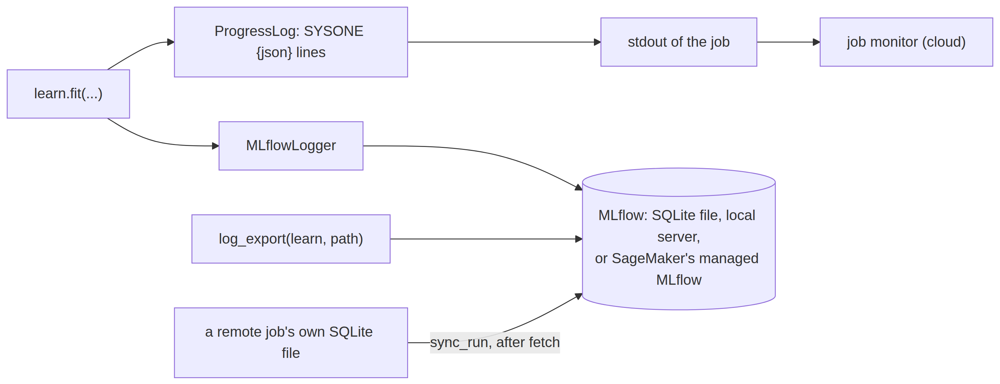

# track


<!-- WARNING: THIS FILE WAS AUTOGENERATED! DO NOT EDIT! -->

A training that runs on another machine (Colab, Kaggle, SageMaker) or in
the background on this one has to report on itself. Two channels do it
here:

- **Progress lines.**
  [`ProgressLog`](https://sgaseretto.github.io/sysonelib/track.html#progresslog)
  prints one line per logging step,
  `SYSONE {"event": "log", "step": 40, "loss": 0.71, ...}`, with the
  steps per second, the time left and the accelerator’s memory and
  utilisation. Every backend returns a job’s standard output somehow
  (SageMaker’s logs, Colab’s session, a local file), so a monitor that
  reads these lines works the same everywhere, with no server to reach.
- **MLflow.**
  [`MLflowLogger`](https://sgaseretto.github.io/sysonelib/track.html#mlflowlogger)
  keeps the history: parameters and tags once, the loss and the
  validation metrics at every step, MLflow’s system metrics (CPU,
  memory, disk, network and NVIDIA GPUs) while training, and, with
  [`log_export`](https://sgaseretto.github.io/sysonelib/track.html#log_export),
  the training record, the export and an MLflow model that answers like
  [`Decider`](https://sgaseretto.github.io/sysonelib/inference.html#decider).
  Locally the runs go to a SQLite file in `~/.cache/sysone/mlflow`
  (MLflow’s own file store is in maintenance mode); a server,
  SageMaker’s managed MLflow among them, is one
  [`tracking_uri`](https://sgaseretto.github.io/sysonelib/track.html#tracking_uri)
  away.

<div>

<figure class=''>

<div>



</div>

</figure>

</div>

The fixtures, with a learner that logs every step:

``` python
data = TypedDecisions.from_json("fixtures/typed_decisions_tiny.jsonl", valid=0.25, calib=0.2)
learn = decision_learner(data, "fixtures/tiny-modernbert", train="lora", preset="cpu", logging_steps=1, disable_tqdm=True)
```

## Progress lines

[`device_stats`](https://sgaseretto.github.io/sysonelib/track.html#device_stats)
reads the memory of the accelerator in use (CUDA’s allocated and peak,
the MPS allocator’s, a TPU’s through torch_xla when it is loaded) and
the host’s CPU and memory use, with `psutil`. GPU utilisation comes from
NVIDIA’s management library when `nvidia-ml-py` is installed.

------------------------------------------------------------------------

<a
href="https://github.com/sgaseretto/sysonelib/blob/main/sysone/track.py#L30"
target="_blank" style="float:right; font-size:smaller">source</a>

### device_stats

``` python
def device_stats()->dict:
```

*Memory (GB) and utilisation (%) of the accelerator in use and of the
host*

``` python
st = device_stats()
assert {"cpu_util", "ram_pct"} <= set(st)
st
```

A line is the prefix and a JSON object;
[`parse_progress`](https://sgaseretto.github.io/sysonelib/track.html#parse_progress)
reads them back out of any text, ignoring everything else a job prints.

------------------------------------------------------------------------

<a
href="https://github.com/sgaseretto/sysonelib/blob/main/sysone/track.py#L95"
target="_blank" style="float:right; font-size:smaller">source</a>

### Learner.progress

``` python
def progress(
    stream:NoneType=None, hardware:bool=True
)->sysone.learner.Learner:
```

*Print progress lines from now on (a sysone job turns this on through
`SYSONE_PROGRESS`)*

------------------------------------------------------------------------

<a
href="https://github.com/sgaseretto/sysonelib/blob/main/sysone/track.py#L84"
target="_blank" style="float:right; font-size:smaller">source</a>

### parse_progress

``` python
def parse_progress(
    text:str
)->list:
```

*The progress records in a job’s output, in order*

------------------------------------------------------------------------

<a
href="https://github.com/sgaseretto/sysonelib/blob/main/sysone/track.py#L59"
target="_blank" style="float:right; font-size:smaller">source</a>

### ProgressLog

``` python
def ProgressLog(
    stream:NoneType=None, hardware:bool=True
):
```

*Print a `SYSONE {json}` line when a fit starts and ends, at every
logging step and at every evaluation*

``` python
buf = io.StringIO()
learn.trainer.add_callback(ProgressLog(stream=buf))
learn.fit_one_cycle(1, lr=1e-3)
recs = parse_progress("pip noise\n" + buf.getvalue() + "more noise")
test_eq([r["event"] for r in recs][:2] + [recs[-1]["event"]], ["start", "log", "end"])
logs = [r for r in recs if r["event"] == "log"]
test_eq([r["step"] for r in logs], list(range(1, len(logs) + 1)))
assert all(isinstance(r["loss"], float) for r in logs) and any(r["event"] == "eval" for r in recs)
learn.trainer.remove_callback(ProgressLog)
print(buf.getvalue().splitlines()[1])
```

On several GPUs (`torchrun`) every process trains and calls the
callbacks; as transformers’ own progress bar,
[`ProgressLog`](https://sgaseretto.github.io/sysonelib/track.html#progresslog)
reports from the main process only, so a job’s log has one line per
step:

``` python
quiet, other = io.StringIO(), TrainerState(is_world_process_zero=False)
pl = ProgressLog(stream=quiet)
for hook, kw in (("on_train_begin", {}), ("on_log", {"logs": {"loss": 1.0}}), ("on_evaluate", {"metrics": {"eval_loss": 1.0}}), ("on_train_end", {})):
    getattr(pl, hook)(None, other, None, **kw)
test_eq(quiet.getvalue(), "")
```

<div>

> **Finding: every GPU of a job reported its progress, and wrote the
> export**
>
> On Kaggle’s two T4s, a job runs its script once per GPU (`torchrun`),
> and transformers calls the callbacks in every process. Each progress
> line came twice, and both processes wrote the export to the same
> folder at once.
> [`ProgressLog`](https://sgaseretto.github.io/sysonelib/track.html#progresslog)
> and
> [`MLflowLogger`](https://sgaseretto.github.io/sysonelib/track.html#mlflowlogger)
> now act in the main process only, as transformers’ own progress bar
> does, and `learn.export` writes from the main process while the others
> wait (see [learner](05_learner.ipynb#answers-and-exports)).

</div>

## MLflow

[`tracking_uri`](https://sgaseretto.github.io/sysonelib/track.html#tracking_uri)
decides where runs go: the one given, `MLFLOW_TRACKING_URI`, or a SQLite
file under `~/.cache/sysone/mlflow` (`SYSONE_MLFLOW_DIR` moves it). A
SageMaker MLflow tracking server or app is named by its ARN, and needs
the `sagemaker-mlflow` plugin, which signs the requests with your AWS
credentials; pin the MLflow client to the server’s version (3.0 for
tracking servers, 3.10 for MLflow apps as of 2026).

<div>

> **Finding: MLflow’s file store refuses to log, and a SQLite store
> keeps artifacts under the current folder**
>
> With MLflow 3.16, a `file:` tracking URI (the `./mlruns` folder of
> older versions) raises: the file store is in maintenance mode, and
> runs belong in a database. A SQLite store works, but its experiments
> put their artifacts in `./mlruns` under whatever folder the process
> runs in, so models logged from a notebook landed in the notebook’s
> folder. sysone makes each experiment with its artifacts beside the
> database
> ([`artifact_root`](https://sgaseretto.github.io/sysonelib/track.html#artifact_root)).

</div>

------------------------------------------------------------------------

<a
href="https://github.com/sgaseretto/sysonelib/blob/main/sysone/track.py#L126"
target="_blank" style="float:right; font-size:smaller">source</a>

### check_tracking_uri

``` python
def check_tracking_uri(
    uri:str
)->str:
```

*A SageMaker MLflow ARN needs the `sagemaker-mlflow` plugin; anything
else MLflow reads itself*

------------------------------------------------------------------------

<a
href="https://github.com/sgaseretto/sysonelib/blob/main/sysone/track.py#L122"
target="_blank" style="float:right; font-size:smaller">source</a>

### is_sagemaker_mlflow

``` python
def is_sagemaker_mlflow(
    uri:str
)->bool:
```

*Whether a tracking URI names SageMaker’s managed MLflow (a tracking
server’s or an MLflow app’s ARN)*

------------------------------------------------------------------------

<a
href="https://github.com/sgaseretto/sysonelib/blob/main/sysone/track.py#L115"
target="_blank" style="float:right; font-size:smaller">source</a>

### use_experiment

``` python
def use_experiment(
    name:str, uri:str
):
```

*Make `name` the active MLflow experiment, creating it with its
artifacts beside a SQLite store’s database*

------------------------------------------------------------------------

<a
href="https://github.com/sgaseretto/sysonelib/blob/main/sysone/track.py#L110"
target="_blank" style="float:right; font-size:smaller">source</a>

### artifact_root

``` python
def artifact_root(
    uri:str
)->str | None:
```

*Where a SQLite store keeps artifacts: a folder beside its database
(MLflow’s default, ./mlruns, would follow the current folder); None for
a server, which decides*

------------------------------------------------------------------------

<a
href="https://github.com/sgaseretto/sysonelib/blob/main/sysone/track.py#L103"
target="_blank" style="float:right; font-size:smaller">source</a>

### tracking_uri

``` python
def tracking_uri(
    uri:str | None=None
)->str:
```

*Where MLflow runs go: `uri`, MLFLOW_TRACKING_URI, else a SQLite file in
~/.cache/sysone/mlflow*

------------------------------------------------------------------------

<a
href="https://github.com/sgaseretto/sysonelib/blob/main/sysone/track.py#L101"
target="_blank" style="float:right; font-size:smaller">source</a>

### mlflow_dir

``` python
def mlflow_dir()->pathlib.Path:
```

``` python
os.environ["SYSONE_MLFLOW_DIR"] = tempfile.mkdtemp()
test_eq(tracking_uri().endswith("mlflow.db") and tracking_uri().startswith("sqlite:///"), True)
arn = "arn:aws:sagemaker:us-east-1:123456789012:mlflow-app/app-abc"
test_eq((is_sagemaker_mlflow(arn), is_sagemaker_mlflow("http://127.0.0.1:5000")), (True, False))
td = tempfile.mkdtemp()
test_eq(artifact_root(f"sqlite:///{td}/mlflow.db"), (Path(td).resolve() / "artifacts").as_uri())
```

[`MLflowLogger`](https://sgaseretto.github.io/sysonelib/track.html#mlflowlogger)
makes one run per learner. The first fit starts it and logs what does
not change (the encoder, regime, LoRA settings, head, loss, data, seed
and the `TrainingArguments` that differ from transformers’ defaults)
with the code’s commit as MLflow’s own `mlflow.source.git.commit` tag;
later fits resume it, so a head-then-encoder schedule reads as one
curve, its steps counted across the fits. Each fit’s summary (from
[`FitLog`](https://sgaseretto.github.io/sysonelib/learner.html#fitlog))
is logged at its end, and the learner keeps the run’s id in
`learn.tracking`, which the [training record](05a_record.ipynb) then
holds. The range test of `lr_find` is not logged.

------------------------------------------------------------------------

<a
href="https://github.com/sgaseretto/sysonelib/blob/main/sysone/track.py#L204"
target="_blank" style="float:right; font-size:smaller">source</a>

### Learner.track

``` python
def track(
    experiment:str | None=None, run_name:str | None=None, uri:str | None=None, system_metrics:bool=True, **tags
)->sysone.learner.Learner:
```

*Log this learner’s fits to MLflow (see
[`MLflowLogger`](https://sgaseretto.github.io/sysonelib/track.html#mlflowlogger));
a sysone job turns this on through `SYSONE_TRACK`*

------------------------------------------------------------------------

<a
href="https://github.com/sgaseretto/sysonelib/blob/main/sysone/track.py#L154"
target="_blank" style="float:right; font-size:smaller">source</a>

### MLflowLogger

``` python
def MLflowLogger(
    learn, experiment:str | None=None, run_name:str | None=None, uri:str | None=None, system_metrics:bool=True,
    tags:dict | None=None
):
```

*Log a learner’s fits to one MLflow run: parameters and tags, step
metrics, system metrics and fit summaries; later fits resume it*

------------------------------------------------------------------------

<a
href="https://github.com/sgaseretto/sysonelib/blob/main/sysone/track.py#L146"
target="_blank" style="float:right; font-size:smaller">source</a>

### learner_tags

``` python
def learner_tags(
    learn
)->dict:
```

*Tags of a run: the code’s commit (MLflow’s own tag), sysone’s version
and where the run happens*

------------------------------------------------------------------------

<a
href="https://github.com/sgaseretto/sysonelib/blob/main/sysone/track.py#L134"
target="_blank" style="float:right; font-size:smaller">source</a>

### learner_params

``` python
def learner_params(
    learn
)->dict:
```

*What a learner is, as MLflow parameters: model, data and the
non-default training arguments (prefixed `args.`)*

``` python
learn2 = decision_learner(data, "fixtures/tiny-modernbert", train="head", preset="cpu", logging_steps=1, disable_tqdm=True)
mlflow.set_system_metrics_sampling_interval(1); mlflow.set_system_metrics_samples_before_logging(1)
learn2.track(experiment="tiny", run_name="head then lora")
learn2.lr_find(start=1e-5, end=1, steps=10)
learn2.fit(1, lr=1e-3)
learn2.unfreeze()
learn2.fit(1, lr=1e-3)
run = MlflowClient(tracking_uri()).get_run(learn2.tracking["mlflow"]["run_id"])
test_eq((run.data.params["regime"], run.data.params["encoder"], run.data.params["data_train"]), ("head", "fixtures/tiny-modernbert", "12"))
test_eq(run.data.tags["mlflow.source.git.commit"], git_info()["commit"])
hist = MlflowClient(tracking_uri()).get_metric_history(run.info.run_id, "loss")
test_eq(sorted(m.step for m in hist), list(range(1, len(hist) + 1)))      # two fits, one curve, the range test left out
assert {"sysone.fit1", "sysone.fit2"} <= set(run.data.tags) and "valid.accuracy" in run.data.metrics
sorted(run.data.metrics)
```

Inside a job, the learner turns both on by itself: `SYSONE_PROGRESS`
adds the progress lines, and `SYSONE_TRACK` (`1`, or a JSON object of
`learn.track` options) the MLflow run. The [jobs](40_cloud.ipynb) set
them, so a training script needs no change to report from Colab, Kaggle
or SageMaker.

``` python
os.environ |= {"SYSONE_PROGRESS": "1", "SYSONE_TRACK": json.dumps({"experiment": "a job", "system_metrics": False})}
lj = decision_learner(data, "fixtures/tiny-modernbert", train="head", preset="cpu", disable_tqdm=True)
test_eq(sorted(type(c).__name__ for c in lj.trainer.callback_handler.callbacks if type(c).__name__ in ("ProgressLog", "MLflowLogger")),
        ["MLflowLogger", "ProgressLog"])
test_eq(next(c for c in lj.trainer.callback_handler.callbacks if type(c).__name__ == "MLflowLogger").experiment, "a job")
del os.environ["SYSONE_PROGRESS"], os.environ["SYSONE_TRACK"]
```

## The export as an MLflow model

[`log_export`](https://sgaseretto.github.io/sysonelib/track.html#log_export)
adds a training’s result to its run: `sysone.json` and `environment.txt`
as artifacts, and an MLflow model that answers like
[`Decider`](https://sgaseretto.github.io/sysonelib/inference.html#decider).
The model is logged as code, not pickled: a small module defines
`SysoneModel`, whose context loads the export, and sysone’s own source
travels with it, so the model loads wherever its requirements install,
sysone on PyPI or not. Its input is a list of records with a `state` and
`questions`, its output their answers; MLflow reads the signature from
the type hints. `register="name"` also puts it in MLflow’s model
registry.

------------------------------------------------------------------------

<a
href="https://github.com/sgaseretto/sysonelib/blob/main/sysone/track.py#L233"
target="_blank" style="float:right; font-size:smaller">source</a>

### log_export

``` python
def log_export(
    learn, path:NoneType=None, register:str | None=None, example:dict | None=None, uri:str | None=None
)->str:
```

*Log an export (made from `learn` if no `path`) to the learner’s MLflow
run: files, and an MLflow model answering like Decider*

------------------------------------------------------------------------

<a
href="https://github.com/sgaseretto/sysonelib/blob/main/sysone/track.py#L228"
target="_blank" style="float:right; font-size:smaller">source</a>

### model_requirements

``` python
def model_requirements()->list:
```

*What an MLflow model of an export installs: sysone’s own requirements
(its source travels with the model)*

``` python
rec = json.loads(Path("fixtures/typed_decisions_tiny.jsonl").read_text().splitlines()[0])
ex = {"state": rec["state"], "questions": rec["questions"]}
model_uri = log_export(learn2, example=ex, register="tiny-jev")
loaded = mlflow.pyfunc.load_model(model_uri)
test_eq(loaded.predict([ex]), [learn2.decider(device="cpu").predict(rec["state"], rec["questions"])])
test_eq(MlflowClient(tracking_uri()).get_registered_model("tiny-jev").name, "tiny-jev")
arts = [a.path for a in MlflowClient(tracking_uri()).list_artifacts(learn2.tracking["mlflow"]["run_id"], "export")]
test_eq(sorted(arts), ["export/environment.txt", "export/sysone.json"])
```

The export carries the run too: its training record names the run that
logged it.

``` python
meta = json.loads((learn2.export(Path(tempfile.mkdtemp()) / "tracked") / "sysone.json").read_text())
test_eq(meta["training"]["tracking"]["mlflow"]["run_id"], learn2.tracking["mlflow"]["run_id"])
test_eq(meta["training"]["tracking"]["mlflow"]["tracking_uri"], "sqlite")
```

## Runs logged elsewhere

A job on Colab or Kaggle cannot reach a server on your laptop, so it
logs to a SQLite file of its own, which comes back with the job’s other
outputs.
[`sync_run`](https://sgaseretto.github.io/sysonelib/track.html#sync_run)
copies its runs into your store: parameters, tags, every point of every
metric, and the artifacts (models logged with
[`log_export`](https://sgaseretto.github.io/sysonelib/track.html#log_export)
are re-logged from the export by the job’s fetch).

------------------------------------------------------------------------

<a
href="https://github.com/sgaseretto/sysonelib/blob/main/sysone/track.py#L249"
target="_blank" style="float:right; font-size:smaller">source</a>

### sync_run

``` python
def sync_run(
    src:str, dest:str | None=None, run_id:str | None=None, experiment:str | None=None
)->list:
```

*Copy runs (all of `src`’s, or `run_id`) with their parameters, tags,
metric histories and artifacts into `dest`; returns the new run ids*

``` python
remote = f"sqlite:///{tempfile.mkdtemp()}/job.db"
learn3 = decision_learner(data, "fixtures/tiny-modernbert", train="head", preset="cpu", logging_steps=1, disable_tqdm=True)
learn3.track(experiment="on colab", uri=remote, system_metrics=False)
learn3.fit(1, lr=1e-3)
new = sync_run(remote)
nr = MlflowClient(tracking_uri()).get_run(new[0])
test_eq((nr.data.tags["sysone.synced_from"], nr.data.params["regime"]), (learn3.tracking["mlflow"]["run_id"], "head"))
test_eq(len(MlflowClient(tracking_uri()).get_metric_history(new[0], "loss")), len(MlflowClient(remote).get_metric_history(learn3.tracking["mlflow"]["run_id"], "loss")))
```

## A local server

[`mlflow_server()`](https://sgaseretto.github.io/sysonelib/track.html#mlflow_server)
starts MLflow’s server over the same SQLite file in the background (the
UI at its address), and `.stop()` ends it; `MLFLOW_TRACKING_URI` then
points every run of the session at it.

------------------------------------------------------------------------

<a
href="https://github.com/sgaseretto/sysonelib/blob/main/sysone/track.py#L291"
target="_blank" style="float:right; font-size:smaller">source</a>

### mlflow_server

``` python
def mlflow_server(
    port:int=5000, store:NoneType=None, host:str='127.0.0.1', timeout:float=60, use:bool=True
)->__main__.MLflowServer:
```

*Start MLflow’s server in the background over a SQLite store
(~/.cache/sysone/mlflow by default); `use` points this session at it*

------------------------------------------------------------------------

<a
href="https://github.com/sgaseretto/sysonelib/blob/main/sysone/track.py#L275"
target="_blank" style="float:right; font-size:smaller">source</a>

### MLflowServer

``` python
def MLflowServer(
    proc, url:str, store:pathlib.Path
):
```

*A local MLflow server process over a SQLite store*

``` python
server = mlflow_server(port=5077, store=tempfile.mkdtemp())
learn4 = decision_learner(data, "fixtures/tiny-modernbert", train="head", preset="cpu", logging_steps=1, disable_tqdm=True).track(experiment="served")
learn4.fit(1, lr=1e-3)
test_eq(MlflowClient(server.url).get_run(learn4.tracking["mlflow"]["run_id"]).data.params["regime"], "head")
test_eq(learn4.tracking["mlflow"]["tracking_uri"], server.url)
server.stop()
server
```
