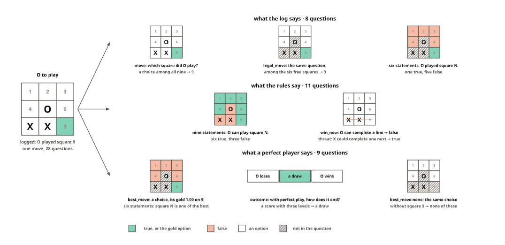
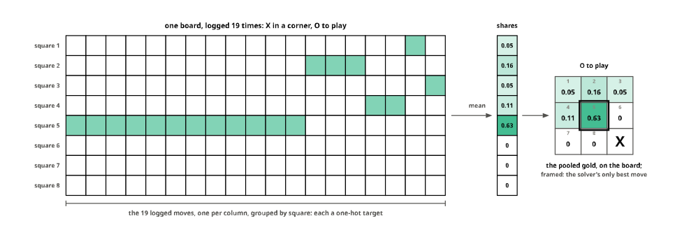
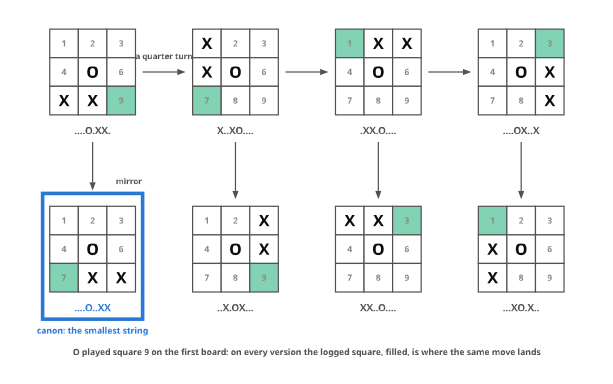
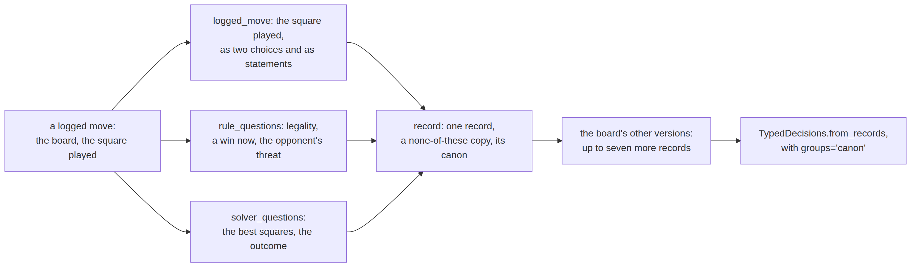
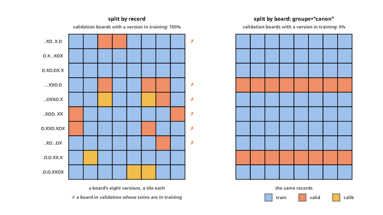
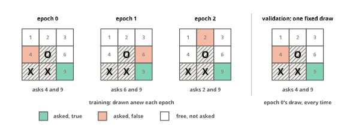

# Decisions from game logs


<!-- WARNING: THIS FILE WAS AUTOGENERATED! DO NOT EDIT! -->

Fine-tuning a decision model with sysone takes a few lines. The work
that remains is the dataset: questions about states, with their answers.
A log of a system that acts (a game, a form being filled in, a support
workflow, a robot’s steps) holds pairs of a state and the action taken
in it, and each pair can answer more than one question. The [previous
tutorial](09_reshaping_datasets.ipynb) reshaped labelled text; this one
starts from a log, where the structure of the state lets us write many
questions, and their answers, by program.

Tic-tac-toe keeps the game out of the way. Everyone knows its rules, and
the whole game has 5,478 positions, few enough to check every claim
against the truth: legality comes from the rules, and the best moves
from a solver that searches the whole game in a second. The same steps
apply to any game or process with rules a program can check. Everything
here runs in a few seconds on a laptop and downloads nothing.

<figure>

<figcaption aria-hidden="true">One logged move and its 28 questions:
what the log says, what the rules say, what a perfect player
says</figcaption>
</figure>

This is where the tutorial is going, for one logged move
([figures](../90_figures.ipynb#one-logged-move-many-questions)). O is to
play on the board at the left, and the log says O played square 9. Each
small board is one question about that move, or a family of statements,
one per square, and its colours are the answers: green for true, or for
a choice’s gold option, orange for false; hatched squares are not part
of the question. The log can only say which square was played. The rules
say which squares can be played and whether a line is about to be
completed, and a perfect player says which squares are best and how the
game ends. The sections below write these questions one family at a
time, then add each board’s symmetric twins and split the records.

``` python
import random
from collections import Counter, deque
from functools import lru_cache
import pandas as pd
from sysone.core import Question
from sysone.template import apply_tfms
from sysone.data import TypedDecisions, add_nouls, add_none_of_these, question_stats, Nouls, expand_records
```

## The whole game

A board is a string of nine characters, `X`, `O` or `.` for an empty
square, read row by row. X moves first, so the player to move is the one
with fewer marks. A model reads the board as text, the empty squares
numbered 1 to 9, the way people point at squares:

``` python
LINES = [(0, 1, 2), (3, 4, 5), (6, 7, 8), (0, 3, 6), (1, 4, 7), (2, 5, 8), (0, 4, 8), (2, 4, 6)]

def winner(b):
    "X or O when that player has three in a line, else None"
    for i, j, k in LINES:
        if b[i] != "." and b[i] == b[j] == b[k]: return b[i]

def mover(b): return "X" if b.count("X") == b.count("O") else "O"
def other(p): return "O" if p == "X" else "X"
def legal(b): return [] if winner(b) or "." not in b else [i for i, c in enumerate(b) if c == "."]
def play(b, i): return b[:i] + mover(b) + b[i + 1:]

def board_text(b) -> str:
    "The board as text, its empty squares numbered 1 to 9"
    cells = [c if c != "." else str(i + 1) for i, c in enumerate(b)]
    return "\n---+---+---\n".join(" " + " | ".join(cells[r:r + 3]) for r in (0, 3, 6))

def state(b) -> str: return f"{mover(b)} to play.\n{board_text(b)}"

print(state("....O.XX."))
```

    O to play.
     1 | 2 | 3
    ---+---+---
     4 | O | 6
    ---+---+---
     X | X | 9

A breadth-first walk from the empty board finds every position a game
can reach:

``` python
positions, todo = {"." * 9}, deque(["." * 9])
while todo:
    b = todo.popleft()
    for i in legal(b):
        if play(b, i) not in positions: positions.add(play(b, i)); todo.append(play(b, i))
to_play = [b for b in positions if legal(b)]
print(f"{len(positions):,} positions, {len(to_play):,} with a move to make")
```

    5,478 positions, 4,520 with a move to make

## A perfect player

Minimax gives every position its value for the player to move, with
perfect play by both sides from there: 1 for a win, 0 for a draw, −1 for
a loss. A move is best when it keeps that value. Cached, the search
covers the whole game once.

``` python
@lru_cache(maxsize=None)
def value(b) -> int:
    "What the position is worth to the player to move, with perfect play: 1 a win, 0 a draw, -1 a loss"
    if winner(b): return -1                       # the line was made by the other player's move
    return max((-value(play(b, i)) for i in legal(b)), default=0)

def best_moves(b) -> list:
    "The moves that keep the position's value"
    return [i for i in legal(b) if -value(play(b, i)) == value(b)]

n_best = Counter(min(len(best_moves(b)), 2) for b in to_play)
print(f"the empty board is worth {value('.' * 9)} (a draw), and all {len(best_moves('.' * 9))} first moves keep it")
print(f"{n_best[1]:,} positions have one best move, {n_best[2]:,} have several")
```

    the empty board is worth 0 (a draw), and all 9 first moves keep it
    2,406 positions have one best move, 2,114 have several

Nearly half the positions to play, 2,114 of 4,520, have more than one
best move, and on the empty board all nine squares are: every first move
draws. A log shows one move per position, so where several are equally
good it can’t say which is *the* right one. Keep that in mind for the
questions below.

## The logs

We don’t have real logs, so we make some: games between two players who
play a best move, except that 30% of the time they play any legal move
at random. Like people, they mostly play well, sometimes blunder, and
often pick one of several equally good moves. A log row is a move: the
game, the turn, the board before the move, who played and the square,
numbered as on the board.

``` python
def log_games(n:int, eps:float=0.3, seed:int=0) -> pd.DataFrame:
    "n games between two players who play a best move, or with probability eps any legal move; a row per move"
    rng, rows = random.Random(seed), []
    for g in range(n):
        b = "." * 9
        while legal(b):
            i = rng.choice(legal(b)) if rng.random() < eps else rng.choice(best_moves(b))
            rows.append({"game": g, "turn": 10 - b.count("."), "board": b, "player": mover(b), "square": i + 1})
            b = play(b, i)
    return pd.DataFrame(rows)

log = log_games(150)
log["best"] = [s - 1 in best_moves(b) for b, s in zip(log.board, log.square)]
print(f"{len(log):,} moves in 150 games, on {log.board.nunique():,} different boards; {log.best.mean():.0%} of them best moves")
log.head(6)
```

    1,160 moves in 150 games, on 579 different boards; 88% of them best moves

<div>
<style scoped>
    .dataframe tbody tr th:only-of-type {
        vertical-align: middle;
    }
&#10;    .dataframe tbody tr th {
        vertical-align: top;
    }
&#10;    .dataframe thead th {
        text-align: right;
    }
</style>

<table class="dataframe" data-quarto-postprocess="true" data-border="1">
<thead>
<tr style="text-align: right;">
<th data-quarto-table-cell-role="th"></th>
<th data-quarto-table-cell-role="th">game</th>
<th data-quarto-table-cell-role="th">turn</th>
<th data-quarto-table-cell-role="th">board</th>
<th data-quarto-table-cell-role="th">player</th>
<th data-quarto-table-cell-role="th">square</th>
<th data-quarto-table-cell-role="th">best</th>
</tr>
</thead>
<tbody>
<tr>
<td data-quarto-table-cell-role="th">0</td>
<td>0</td>
<td>1</td>
<td>.........</td>
<td>X</td>
<td>7</td>
<td>True</td>
</tr>
<tr>
<td data-quarto-table-cell-role="th">1</td>
<td>0</td>
<td>2</td>
<td>......X..</td>
<td>O</td>
<td>9</td>
<td>False</td>
</tr>
<tr>
<td data-quarto-table-cell-role="th">2</td>
<td>0</td>
<td>3</td>
<td>......X.O</td>
<td>X</td>
<td>3</td>
<td>True</td>
</tr>
<tr>
<td data-quarto-table-cell-role="th">3</td>
<td>0</td>
<td>4</td>
<td>..X...X.O</td>
<td>O</td>
<td>4</td>
<td>True</td>
</tr>
<tr>
<td data-quarto-table-cell-role="th">4</td>
<td>0</td>
<td>5</td>
<td>..XO..X.O</td>
<td>X</td>
<td>1</td>
<td>True</td>
</tr>
<tr>
<td data-quarto-table-cell-role="th">5</td>
<td>0</td>
<td>6</td>
<td>X.XO..X.O</td>
<td>O</td>
<td>6</td>
<td>True</td>
</tr>
</tbody>
</table>

</div>

## What the log says

A logged move answers one question exactly: which square did the player
choose? It can be asked among all nine squares, so the model must also
tell the free squares from the taken ones, or among the free squares
only. Both are choices, and each square’s option carries its name.
[`add_nouls`](https://sgaseretto.github.io/sysonelib/data.html#add_nouls)
then asks the second one again as statements, one per free square, of
which the played one is true.

``` python
SQUARES = {str(i + 1): s for i, s in enumerate(["top left", "top middle", "top right", "middle left", "centre",
                                                 "middle right", "bottom left", "bottom middle", "bottom right"])}

def logged_move(b, square, id=None) -> dict:
    "A record of one logged move: the square played, among all nine and among the free ones, and a statement per free square"
    p, free = mover(b), [str(i + 1) for i in legal(b)]
    ask = f"Which square did {p} play?"
    r = {"id": id, "board": b, "state": state(b),
         "questions": {"move": {"type": "choice", "instructions": ask, "criteria": SQUARES},
                       "legal_move": {"type": "choice", "instructions": ask, "criteria": {s: SQUARES[s] for s in free}}},
         "gold": {"move": {"label": str(square)}, "legal_move": {"label": str(square)}}}
    return add_nouls(r, "legal_move", statement=f"{p} played square {{label}}.")
```

A helper prints a record the way a person would read it: the state, then
each question with its options and its gold.

``` python
def gold_text(g) -> str:
    if g is None: return "-"
    if g.get("answerable") is False: return "none of these"
    if "probabilities" in g: return ", ".join(f"{k}: {v:.2f}" for k, v in g["probabilities"].items() if v)
    return f"true with p = {g['noul']:.2f}" if "noul" in g else str(g["label"])

def show(r, only=None):
    "The state, then each question (or those whose id starts with one of `only`), its options and its gold"
    print(r["state"], end="\n\n")
    for qid, q in r["questions"].items():
        if only and not qid.startswith(tuple(only)): continue
        opts = f" {list(q['criteria'])}" if q.get("criteria") else ""
        g = gold_text(r["gold"].get(qid))
        if q["type"] == "score" and g.isdigit(): g += f" ({q['criteria'][int(g)]})"
        print(f"{qid:<17}{q['type']:<7}{q['instructions']}{opts}  →  {g}")

show(logged_move("....O.XX.", 9))
```

    O to play.
     1 | 2 | 3
    ---+---+---
     4 | O | 6
    ---+---+---
     X | X | 9

    move             choice Which square did O play? ['1', '2', '3', '4', '5', '6', '7', '8', '9']  →  9
    legal_move       choice Which square did O play? ['1', '2', '3', '4', '6', '9']  →  9
    legal_move:noul0 noul   O played square 2.  →  false
    legal_move:noul1 noul   O played square 9.  →  true
    legal_move:noul2 noul   O played square 4.  →  false
    legal_move:noul3 noul   O played square 6.  →  false
    legal_move:noul4 noul   O played square 1.  →  false
    legal_move:noul5 noul   O played square 3.  →  false

Six free squares give six statements, one true and five false. The log
doesn’t know the best move; it knows what O did. Here O blocked X’s row,
the only move that keeps the draw, but the log would record a blunder
just as faithfully, and these questions would then teach the blunder. So
the statements say what was *played*, and the next two sections ask the
rules and the solver for the rest.

## What the rules say

Some questions don’t need the log at all. The rules answer them for any
board, exactly: which squares the player to move can take, whether one
move completes a line, whether the opponent threatens to complete one
next. These are nouls, and since they hold for every board, they could
be asked of boards no one ever played.

``` python
def rule_questions(b) -> tuple:
    "Questions the rules answer exactly, whatever was played: legality, a win on this move, the opponent's threat"
    p, free = mover(b), legal(b)
    qs, gold = {}, {}
    for i in range(9):
        qs[f"legal:{i + 1}"] = {"type": "noul", "instructions": f"{p} can play square {i + 1}."}
        gold[f"legal:{i + 1}"] = {"label": str(i in free).lower()}
    qs["win_now"] = {"type": "noul", "instructions": f"{p} can complete a line with this move."}
    gold["win_now"] = {"label": str(any(winner(play(b, i)) == p for i in free)).lower()}
    qs["threat"] = {"type": "noul", "instructions": f"{other(p)} could complete a line next move if {p} does not block it."}
    gold["threat"] = {"label": str(any(winner(b[:i] + other(p) + b[i + 1:]) == other(p) for i in free)).lower()}
    return qs, gold
```

## What a perfect player says

The solver knows more than the log: which moves are best, and how the
game ends from here. The best move is a choice whose gold is soft,
shared equally among the best squares, since the solver has no favourite
among them. How the game ends is a score with three ordered levels.

The wording of a statement decides its gold.
[`add_nouls`](https://sgaseretto.github.io/sysonelib/data.html#add_nouls)
asked of the best-move choice would say “the answer to *Which square is
best for O?* is square 5”, true with probability ½ when two squares are
equally best: a perfect player picks either. “Square 5 is one of the
best moves” is another statement, plainly true for both. We want the
second, so we write those nouls from the solver directly.

``` python
def solver_questions(b) -> tuple:
    "Questions only a perfect player answers: the best squares, whether each free square is one of them, how the game ends"
    p, free, best = mover(b), legal(b), best_moves(b)
    qs = {"best_move": {"type": "choice", "instructions": f"Which square is best for {p}?",
                        "criteria": {str(i + 1): SQUARES[str(i + 1)] for i in free}},
          "outcome": {"type": "score", "instructions": f"With perfect play from here, how does the game end for {p}?",
                      "criteria": [f"{p} loses", "a draw", f"{p} wins"]}}
    gold = {"best_move": {"probabilities": {str(i + 1): 1 / len(best) for i in best}}, "outcome": {"label": str(value(b) + 1)}}
    for i in free:
        qs[f"good:{i + 1}"] = {"type": "noul", "instructions": f"Square {i + 1} is one of the best moves for {p}."}
        gold[f"good:{i + 1}"] = {"label": str(i in best).lower()}
    return qs, gold

def merge(r, *parts) -> dict:
    "The record with more questions and their golds"
    for qs, gold in parts: r = {**r, "questions": {**r["questions"], **qs}, "gold": {**r["gold"], **gold}}
    return r

show(merge(logged_move("....O.XX.", 9), rule_questions("....O.XX."), solver_questions("....O.XX.")), only=["legal:", "win", "threat", "best", "outcome", "good"])
```

    O to play.
     1 | 2 | 3
    ---+---+---
     4 | O | 6
    ---+---+---
     X | X | 9

    legal:1          noul   O can play square 1.  →  true
    legal:2          noul   O can play square 2.  →  true
    legal:3          noul   O can play square 3.  →  true
    legal:4          noul   O can play square 4.  →  true
    legal:5          noul   O can play square 5.  →  false
    legal:6          noul   O can play square 6.  →  true
    legal:7          noul   O can play square 7.  →  false
    legal:8          noul   O can play square 8.  →  false
    legal:9          noul   O can play square 9.  →  true
    win_now          noul   O can complete a line with this move.  →  false
    threat           noul   X could complete a line next move if O does not block it.  →  true
    best_move        choice Which square is best for O? ['1', '2', '3', '4', '6', '9']  →  9: 1.00
    outcome          score  With perfect play from here, how does the game end for O? ['O loses', 'a draw', 'O wins']  →  1 (a draw)
    good:1           noul   Square 1 is one of the best moves for O.  →  false
    good:2           noul   Square 2 is one of the best moves for O.  →  false
    good:3           noul   Square 3 is one of the best moves for O.  →  false
    good:4           noul   Square 4 is one of the best moves for O.  →  false
    good:6           noul   Square 6 is one of the best moves for O.  →  false
    good:9           noul   Square 9 is one of the best moves for O.  →  true

The rules say O can take six squares, can’t complete a line, and must
deal with X’s threat. The solver says the game is a draw with perfect
play, that square 9 is the only best move, and the statements say it
square by square. None of these answers came from the log: any board,
logged or not, can be asked them.

## None of these

A choice whose options leave out every right answer has no right option,
and a model should say so rather than pick one.
[`add_none_of_these`](https://sgaseretto.github.io/sysonelib/data.html#add_none_of_these)
adds such a copy of the best-move question: the same instruction, the
free squares that are not best. Its gold is `answerable: False`, which
trains the act head to hand the case over instead of acting. Boards
where every free square is best get no copy.

``` python
show(add_none_of_these(merge(logged_move("....O.XX.", 9), solver_questions("....O.XX.")), "best_move"), only=["best_move"])
```

    O to play.
     1 | 2 | 3
    ---+---+---
     4 | O | 6
    ---+---+---
     X | X | 9

    best_move        choice Which square is best for O? ['1', '2', '3', '4', '6', '9']  →  9: 1.00
    best_move:none   choice Which square is best for O? ['1', '2', '3', '4', '6']  →  none of these

## Boards seen more than once

The 1,160 logged moves fall on only 579 different boards: every game
starts on the empty board, and the first moves repeat often. A board
logged several times is one state with several answers. As separate
records, each says that its square was *the* one played, and the others
contradict it. Pooled into one record, the counts become a soft gold:
the share of the logged moves that went to each square, which is what
the log can honestly say about that board.
[`add_nouls`](https://sgaseretto.github.io/sysonelib/data.html#add_nouls)
carries the shares over to the statements.

``` python
def pooled_move(b, squares: Counter, id=None) -> dict:
    "One record for a board logged several times: the squares played, as shares of its logged moves"
    r = logged_move(b, squares.most_common(1)[0][0], id)
    share = {str(s): c / sum(squares.values()) for s, c in squares.items()}
    r["gold"] = {"move": {"probabilities": share}, "legal_move": {"probabilities": share}}
    r["questions"] = {k: q for k, q in r["questions"].items() if ":" not in k}
    return add_nouls(r, "legal_move", statement=f"{mover(b)} played square {{label}}.")

played = log.groupby("board").square.agg(Counter)
b = played[played.map(lambda c: sum(c.values())).between(5, 40)].index[0]
print(f"logged {sum(played[b].values())} times; best squares {[i + 1 for i in best_moves(b)]}\n")
show(pooled_move(b, played[b]))
```

    logged 19 times; best squares [5]

    O to play.
     1 | 2 | 3
    ---+---+---
     4 | 5 | 6
    ---+---+---
     7 | 8 | X

    move             choice Which square did O play? ['1', '2', '3', '4', '5', '6', '7', '8', '9']  →  5: 0.63, 2: 0.16, 3: 0.05, 1: 0.05, 4: 0.11
    legal_move       choice Which square did O play? ['1', '2', '3', '4', '5', '6', '7', '8']  →  5: 0.63, 2: 0.16, 3: 0.05, 1: 0.05, 4: 0.11
    legal_move:noul0 noul   O played square 2.  →  true with p = 0.16
    legal_move:noul1 noul   O played square 3.  →  true with p = 0.05
    legal_move:noul2 noul   O played square 4.  →  true with p = 0.11
    legal_move:noul3 noul   O played square 5.  →  true with p = 0.63
    legal_move:noul4 noul   O played square 7.  →  false
    legal_move:noul5 noul   O played square 8.  →  false
    legal_move:noul6 noul   O played square 1.  →  true with p = 0.05
    legal_move:noul7 noul   O played square 6.  →  false

<figure>

<figcaption aria-hidden="true">The board logged 19 times: each logged
move a one-hot target over the free squares, their mean the pooled gold,
drawn on the board</figcaption>
</figure>

The same record as a picture
([figures](../90_figures.ipynb#a-board-logged-many-times)): each column
is one logged move, a one-hot target that puts all its weight on the
square played, and the pooled gold is their mean, the share of each
square.

O answered X’s corner opening 19 times: in the centre 12 times (63%),
the only square that keeps the draw, and elsewhere 7 times. The pooled
record says exactly that. As separate records, the log would have said
“O played square 5” twelve times and “O played square 2” three times,
each time as a certainty. What O *should* play is the solver’s question,
not the log’s.

## Eight boards for one

Rotate a board a quarter turn, or mirror it, and the game doesn’t
change: the same moves are best, turned the same way. A board has eight
such versions, the four rotations and their mirror images, and the log’s
move maps onto each. A board that is itself symmetric, like X in two
opposite corners, has fewer distinct versions, and its copies would be
exact duplicates, so only distinct ones are kept. They are new states,
exact and free, which text rarely offers: rewording a sentence costs a
model call and can change its meaning, a rotation can’t.

``` python
ROT, FLIP = [6, 3, 0, 7, 4, 1, 8, 5, 2], [2, 1, 0, 5, 4, 3, 8, 7, 6]     # the square each new square takes its mark from
SYMS, P = [], list(range(9))
for _ in range(4):
    SYMS += [P, [P[k] for k in FLIP]]
    P = [P[k] for k in ROT]

def transform(b, P) -> str: return "".join(b[k] for k in P)
def canon(b) -> str: return min(transform(b, P) for P in SYMS)       # one name for all eight versions

def side_by_side(boards) -> str:
    blocks = [board_text(b).splitlines() for b in boards]
    return "\n".join("     ".join(rows) for rows in zip(*blocks))

assert all(value(transform(b, P)) == value(b) for b in to_play for P in SYMS)
print(side_by_side([transform("....O.XX.", P) for P in SYMS[0::2]]), end="\n\n")      # the four rotations
print(side_by_side([transform("....O.XX.", P) for P in SYMS[1::2]]))                   # and their mirror images
print(f"\n{len(to_play):,} positions to play are {len({canon(b) for b in to_play})} up to symmetry")
```

     1 | 2 | 3      X | 2 | 3      1 | X | X      1 | 2 | 3
    ---+---+---     ---+---+---     ---+---+---     ---+---+---
     4 | O | 6      X | O | 6      4 | O | 6      4 | O | X
    ---+---+---     ---+---+---     ---+---+---     ---+---+---
     X | X | 9      7 | 8 | 9      7 | 8 | 9      7 | 8 | X

     1 | 2 | 3      1 | 2 | X      X | X | 3      1 | 2 | 3
    ---+---+---     ---+---+---     ---+---+---     ---+---+---
     4 | O | 6      4 | O | X      4 | O | 6      X | O | 6
    ---+---+---     ---+---+---     ---+---+---     ---+---+---
     7 | X | X      7 | 8 | 9      7 | 8 | 9      X | 8 | 9

    4,520 positions to play are 627 up to symmetry

<figure>

<figcaption aria-hidden="true">The running example’s eight versions, the
logged square mapped along, each with its string, and canon, the
smallest of them</figcaption>
</figure>

The same eight boards, drawn
([figures](../90_figures.ipynb#eight-boards-for-one)). The logged
square, filled, turns and flips with the board, so each version is a
correct record of its own. Each board is also a string, the way the code
stores it, and `canon` picks the smallest of the eight strings: a name
that all the versions of a board share, which the split below uses.

## Every logged move, every question

Putting it together, a logged move becomes a record with all its
questions, and each record keeps its board’s canonical form, `canon`,
for the split below. The symmetric versions repeat the record for the
seven other boards, the logged square mapped along.

<div>

<figure class=''>

<div>



</div>

</figure>

</div>

``` python
def record(b, square, id) -> dict:
    "Every question about one logged move"
    r = merge(logged_move(b, square, id), rule_questions(b), solver_questions(b))
    return add_none_of_these(r, "best_move") | {"canon": canon(b)}

records = [record(r.board, r.square, f"g{r.game:03d}/{r.turn}") for r in log.itertuples()]
twins = []
for r in log.itertuples():
    versions = sorted({(transform(r.board, P), P.index(r.square - 1) + 1) for P in SYMS})     # fewer than eight for a symmetric board
    twins += [record(b, s, f"g{r.game:03d}/{r.turn}~{k}") for k, (b, s) in enumerate(versions)]
print(f"{len(log):,} logged moves → {len(records):,} records with {sum(len(r['questions']) for r in records):,} questions; "
      f"with the symmetric boards {len(twins):,} records")
question_stats(records)
```

    1,160 logged moves → 1,160 records with 30,923 questions; with the symmetric boards 7,976 records

<div>
<style scoped>
    .dataframe tbody tr th:only-of-type {
        vertical-align: middle;
    }
&#10;    .dataframe tbody tr th {
        vertical-align: top;
    }
&#10;    .dataframe thead th {
        text-align: right;
    }
</style>

<table class="dataframe" data-quarto-postprocess="true" data-border="1">
<thead>
<tr style="text-align: right;">
<th data-quarto-table-cell-role="th"></th>
<th data-quarto-table-cell-role="th">questions</th>
<th data-quarto-table-cell-role="th">per record</th>
<th data-quarto-table-cell-role="th">options</th>
<th data-quarto-table-cell-role="th">gold true</th>
</tr>
<tr>
<th data-quarto-table-cell-role="th">kind</th>
<th data-quarto-table-cell-role="th"></th>
<th data-quarto-table-cell-role="th"></th>
<th data-quarto-table-cell-role="th"></th>
<th data-quarto-table-cell-role="th"></th>
</tr>
</thead>
<tbody>
<tr>
<td data-quarto-table-cell-role="th">choice</td>
<td>3480</td>
<td>3.000</td>
<td>6.681</td>
<td>NaN</td>
</tr>
<tr>
<td data-quarto-table-cell-role="th">noul from choice</td>
<td>6405</td>
<td>5.522</td>
<td>2.000</td>
<td>0.181</td>
</tr>
<tr>
<td data-quarto-table-cell-role="th">noul</td>
<td>19165</td>
<td>16.522</td>
<td>2.000</td>
<td>0.571</td>
</tr>
<tr>
<td data-quarto-table-cell-role="th">score</td>
<td>1160</td>
<td>1.000</td>
<td>3.000</td>
<td>NaN</td>
</tr>
<tr>
<td data-quarto-table-cell-role="th">choice from choice, none of
these</td>
<td>713</td>
<td>0.615</td>
<td>3.431</td>
<td>NaN</td>
</tr>
</tbody>
</table>

</div>

A logged move now asks about 27 questions: three choices (the square
played among all nine and among the free ones, and the best square), the
game’s outcome, about 5.5 statements about the square played, 16.5 from
the rules and the solver, and, on six boards in ten, a none-of-these
copy. The share of true statements differs by family: 18% for “O played
square N” (one true among the free squares), 57% for the rules’ and the
solver’s, most of them about legal squares. A model learns these shares
as its prior for each kind of statement, so they are worth choosing
rather than inheriting; the last section draws them per epoch.

## A split that keeps twins apart

Validation must hold states the model never trained on. With repeated
boards and symmetric twins, a split by record doesn’t do that: a board’s
twin, or the board itself from another game, lands on the other side.
`groups="canon"` keeps every version of a board on one side:

``` python
def leak(data) -> float:
    "The share of validation records whose board, in some version, is also in training"
    seen = set(data.cases["train"]["canon"])
    return sum(c in seen for c in data.cases["valid"]["canon"]) / len(data.cases["valid"])

by_record = TypedDecisions.from_records(twins, valid=0.2, calib=0.1)
by_board = TypedDecisions.from_records(twins, valid=0.2, calib=0.1, groups="canon")
print(f"split by record: {leak(by_record):.0%} of validation boards also in training; split by board: {leak(by_board):.0%}")
by_board
```

    split by record: 100% of validation boards also in training; split by board: 0%

    TypedDecisions(5716 train, 1604 valid, 656 calib cases · template default · 0 tfms)

<figure>

<figcaption aria-hidden="true">The two splits of the symmetric records
for ten boards: a row per board, a tile per version, coloured by the
side it lands on</figcaption>
</figure>

Ten boards of the log, a row each with a tile for each of their eight
versions, coloured by the side each split puts them on
([figures](../90_figures.ipynb#a-split-by-record-and-a-split-by-board)):

Split by record, every validation board has a twin, or the same board
from another game, in training, so validation would measure memory.
Split by board, none does.

## More negatives every epoch

A record asks every free square as a statement, so a board with six free
squares has five false ones for one true. To keep the mix closer to
even, the statements can be drawn instead, per epoch: the
[`Nouls`](https://sgaseretto.github.io/sysonelib/data.html#nouls)
transform asks the played square and one other, a different other each
epoch, under the same question ids. Its wording can quote the question,
`{instructions}`, which names the player, so one wording serves X’s
moves and O’s. It runs while training only; validation gets one fixed
draw from
[`expand_records`](https://sgaseretto.github.io/sysonelib/data.html#expand_records),
as
[`TypedDecisions.expand_eval`](https://sgaseretto.github.io/sysonelib/data.html#typeddecisions.expand_eval)
would give it.

``` python
r = logged_move("....O.XX.", 9)
r = {**r, "questions": {k: q for k, q in r["questions"].items() if ":" not in k}}     # the two choices, no statements yet
draw = Nouls("legal_move", negatives=1, statement="{instructions} Square {label}.")
for epoch in range(3):
    draw.set_epoch(epoch)
    x = apply_tfms([draw], r, train=True)
    print(f"epoch {epoch}:", [(x["questions"][k]["instructions"], gold_text(x["gold"][k])) for k in x["questions"] if ":" in k])
v = expand_records([r], [draw])[0]
print("validation:", [v["questions"][k]["instructions"] for k in v["questions"] if ":" in k])
```

    epoch 0: [('Which square did O play? Square 4.', 'false'), ('Which square did O play? Square 9.', 'true')]
    epoch 1: [('Which square did O play? Square 9.', 'true'), ('Which square did O play? Square 6.', 'false')]
    epoch 2: [('Which square did O play? Square 2.', 'false'), ('Which square did O play? Square 9.', 'true')]
    validation: ['Which square did O play? Square 4.', 'Which square did O play? Square 9.']

<figure>

<figcaption aria-hidden="true">The statements Nouls asks about one board
at three epochs, and the one fixed draw validation gets</figcaption>
</figure>

On the board
([figures](../90_figures.ipynb#statements-drawn-per-epoch)): every epoch
asks about the played square, 9, and one other, a different one each
time. Validation’s draw is fixed:
[`expand_records`](https://sgaseretto.github.io/sysonelib/data.html#expand_records)
draws as training does at epoch 0, so a validation record is asked the
same two statements at every evaluation.

## Exercises: train and compare

The records are ready. The cells below train a model on three versions
of them and compare them on boards none of them saw. They don’t run when
the tutorial is built; run them yourself. Each trains sysone’s text
application, ModernBERT-large with a frozen encoder whose features are
cached, so every version sees one fixed draw of its questions. The first
run downloads the encoder, about 1.6 GB, and computes its features once
for every question, which for the third version is eight times as many.

1.  **The log only**: the questions the log answers, which square was
    played, as two choices and as statements.
2.  **Every question**: the log’s, the rules’, and the solver’s.
3.  **Every question, eight boards**: the same, on the symmetric boards
    too.

All three are tested on the same held-out boards: a fifth of the
canonical forms, with every version of them kept out of training.

``` python
from sysone.text import decision_learner
from sysone.evaluate import evaluate

classes = sorted({r["canon"] for r in records}); random.Random(0).shuffle(classes)
held = set(classes[:len(classes) // 5])
test = [r for r in records if r["canon"] in held]

def only(rs, prefixes):
    "The records with only the questions whose ids start with one of `prefixes`"
    keep = lambda k: k.startswith(tuple(prefixes))
    return [{**r, "questions": {k: q for k, q in r["questions"].items() if keep(k)}, "gold": {k: g for k, g in r["gold"].items() if keep(k)}} for r in rs]

versions = {"the log only": only([r for r in records if r["canon"] not in held], ["move", "legal_move"]),
            "every question": [r for r in records if r["canon"] not in held],
            "every question, eight boards": [r for r in twins if r["canon"] not in held]}
learners = {}
for name, rs in versions.items():
    data = TypedDecisions.from_records(rs, valid=0.1, calib=0.1, groups="canon")
    learners[name] = decision_learner(data, preset="macbook")
    learners[name].fit_one_cycle(3, lr=1e-3)
```

On the held-out boards, three things to measure for each model: how
often it names the square that was played (accuracy on `legal_move`),
how often its pick for the square played is one of the best moves (since
the log mostly shows good play, a model that learned the game should
pick well even where the logged player didn’t), and, for the models that
saw them, legality and the game’s outcome.

``` python
def picks(decider, rs, qid):
    "The square the model picks for question `qid` of each record"
    return [decider.predict(r["state"], {qid: r["questions"][qid]})[qid]["choice"] for r in rs]

rows = []
for name, learn in learners.items():
    d = learn.decider()
    played = picks(d, test, "legal_move")
    row = {"model": name,
           "names the played square": sum(p == r["gold"]["legal_move"]["label"] for p, r in zip(played, test)) / len(test),
           "picks a best square": sum(p in r["gold"]["best_move"]["probabilities"] for p, r in zip(played, test)) / len(test)}
    if name != "the log only":
        legal_rs = only(test, ["legal:"])
        row["legality accuracy"] = evaluate(d, legal_rs)["accuracy"]
        row["outcome within one level"] = evaluate(d, only(test, ["outcome"]))["within_one"]
    rows.append(row)
pd.DataFrame(rows).set_index("model").round(3)
```

Some questions to take further:

- **Which questions help?** Train on the log’s questions plus one family
  at a time (the rules’, the solver’s) and see which moves the “picks a
  best square” column.
- **Balance.** The statements “O played square N” are mostly false.
  Build the records without them (leave
  [`add_nouls`](https://sgaseretto.github.io/sysonelib/data.html#add_nouls)
  out of `logged_move`) and put
  `Nouls("legal_move", negatives=1, statement="{instructions} Square {label}.")`
  in the data’s transforms, with `train="lora"` so the draws change
  every epoch (the frozen encoder’s cache fixes one), and compare.
- **None of these.** Give the deciders an act threshold
  (`learn.calibrate()`), then ask the `best_move:none` questions: how
  often does the model hand them over rather than pick a bad square?
- **More logs or more boards?** Log 1,200 games instead of 150, without
  the symmetric boards, and compare with 150 games and their twins:
  about the same number of records, but one is new positions and the
  other is the same positions turned.
