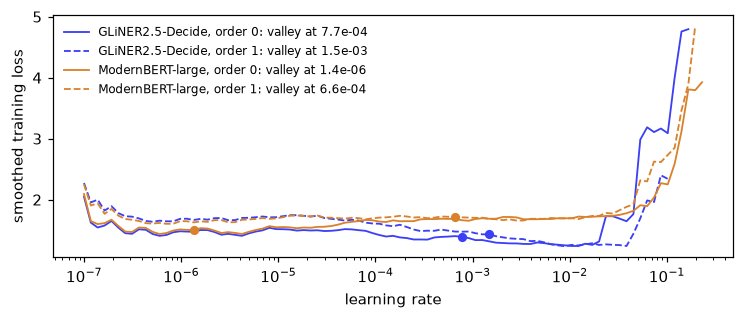

# GLiNER2.5-Decide under the sysone head


<!-- WARNING: THIS FILE WAS AUTOGENERATED! DO NOT EDIT! -->

[GLiNER2.5-Decide](https://huggingface.co/fastino/GLiNER2.5-Decide)
(Fastino, Apache-2.0) is a 340-million-parameter encoder,
DeBERTa-v3-large, trained to make decisions. You give it a text and one
or more *heads*. A head is a name and a set of labels, such as
`urgency: low, normal, high, critical`. The model writes the head into
the same row of tokens as the text, with a marker token, `[L]`, in front
of each label:

    ( [P] urgency ( [L] low [L] normal [L] high [L] critical ) ) [SEP_TEXT] my card was charged twice and …

It reads the row once. Because the labels sit in the row, each `[L]`
vector has read the label that follows it *and* the text. A small MLP
turns each `[L]` vector into a score, and a softmax over the scores
gives the probabilities. That is the shape of the sysone head, too, with
`[L]` in the part that `[MASK]` plays for ModernBERT: an anchor token in
front of each option, scored by a small network. So sysone can use this
model in two ways:

- **The GLiNER2 backend** (`sysone.gliner`, the `gliner` extra) runs the
  whole model through its own package, `gliner2`, and answers in the Jev
  schema like every other sysone model.
- **The text application** (`sysone.text`) loads only the encoder, with
  transformers, and puts it under the sysone head. `head="gliner2"`
  gives the head the classifier’s shape, and `init_from` copies the
  classifier’s weights in, so the model answers before any training. The
  encoder then stays frozen, and the head trains on cached anchor
  vectors like any other.

This notebook runs both on
[fast-decisions](https://huggingface.co/datasets/fastino/fast-decisions),
the benchmark Fastino built for the model: 17 domains of operational
decisions, from support intents and email triage to ticket routing and
clinic requests. It checks how closely the two routes agree before any
training, then trains the head on half of each domain and scores it on
the other half, beside a new head and beside ModernBERT-large, the text
application’s default encoder.

<div>

> **Jargon**
>
> - **Head**: in GLiNER2, one classification task, a name and its
>   labels. In sysone, the small network on top of the encoder that
>   scores the options. One GLiNER2 head becomes one sysone *choice*
>   question.
> - **Zero-shot**: answering with no training on this task’s examples.
> - **Warm start**: starting a model’s weights from another trained
>   model’s weights, here the head from GLiNER2’s classifier, instead of
>   from random numbers.
> - **Frozen encoder, cached anchors**: when only the head trains, the
>   encoder’s vector at each anchor never changes, so sysone computes it
>   once and stores it. Training then reads the stored vectors, which
>   takes seconds.
> - **Development and test splits**: Fastino publishes 100 rows per
>   domain (the development split) and keeps 300 per domain hidden to
>   report its scores on (the test split). Everything here runs on the
>   published 100, so none of these numbers is the benchmark’s score.
> - **Exact match**: a head counts as right when the predicted label is
>   the gold label.

</div>

<div>

> **Running this notebook**
>
> The test suite skips this notebook (`skip_exec`). It downloads
> GLiNER2.5-Decide (1.95 GB), the benchmark’s development split (1.9 MB)
> and ModernBERT-large (1.6 GB), and the GLiNER2 part needs sysone’s
> `gliner` extra, which the next cell installs when it’s missing. One
> model is in memory at a time. The whole run takes about 19 minutes on
> an M3 Pro (MPS, fp32), and the outputs below come from a run on
> 2026-09-29. It keeps its feature cache in `gliner-decide/`, next to
> the notebook.

</div>

``` python
# The GLiNER2 backend needs sysone's `gliner` extra: the gliner2 package, and peft.
import importlib.util, shutil, subprocess, sys
if any(importlib.util.find_spec(p) is None for p in ("gliner2", "peft")):   # install into this kernel's environment, with uv when there is one
    installer = ["uv", "pip", "install", "--python", sys.executable] if shutil.which("uv") else [sys.executable, "-m", "pip", "install"]
    subprocess.run(installer + ["-q", "gliner2>=2.0", "peft>=0.20"], check=True)
```

``` python
import gc, json, logging, random, resource, sys, time, warnings
from collections import defaultdict
from pathlib import Path
import numpy as np
import pandas as pd
import torch
import matplotlib.pyplot as plt
from matplotlib_inline.backend_inline import set_matplotlib_formats
import datasets, transformers
from huggingface_hub import snapshot_download
from transformers.trainer_callback import PrinterCallback, ProgressCallback
from gliner2 import AutoExtractor
from sysone.data import TypedDecisions
from sysone.gliner import GlinerDecider
from sysone.text import decision_learner, ENCODER
```

``` python
logging.getLogger("transformers").setLevel(logging.ERROR)
warnings.filterwarnings("ignore", message=r".*torch\.jit\.script", category=FutureWarning)   # DeBERTa-v2's modeling code on Python 3.14
datasets.disable_progress_bars(); transformers.utils.logging.disable_progress_bar()
set_matplotlib_formats("png"); plt.rcParams["figure.dpi"] = 110
pd.set_option("display.width", 200); pd.set_option("display.max_columns", 20); pd.set_option("display.max_colwidth", 90)
DECIDE = "fastino/GLiNER2.5-Decide"
work = Path("gliner-decide")
t_start = time.time()
device = "cuda" if torch.cuda.is_available() else "mps" if torch.backends.mps.is_available() else "cpu"
print(f"torch {torch.__version__} · transformers {transformers.__version__} · {device}")
```

    torch 2.14.0 · transformers 5.17.0 · mps

``` python
def quiet(learn):
    "The learner, without the Trainer's per-step log lines in the outputs"
    for cb in (PrinterCallback, ProgressCallback): learn.trainer.remove_callback(cb)
    return learn

def release():
    "Hand back the memory of deleted models"
    gc.collect()
    if torch.backends.mps.is_available(): torch.mps.empty_cache()
    if torch.cuda.is_available(): torch.cuda.empty_cache()

def memory_line():
    "The process's peak resident memory"
    return f"peak memory {resource.getrusage(resource.RUSAGE_SELF).ru_maxrss / (2**30 if sys.platform == 'darwin' else 2**20):.1f} GB"
```

## The benchmark

Each domain is one file of 100 rows. A row is a text and the decisions a
product would make about it: each head has a name, its candidate labels
and the gold label.

``` python
repo = Path(snapshot_download("fastino/fast-decisions", repo_type="dataset"))
DOMAINS = ["support_intent", "support_topic", "document_type", "review_sentiment", "agent_handoff", "email_triage",
           "ticket_route", "product_feedback", "banking_intent", "clinic_request", "travel_request", "news_topic",
           "paper_field", "sports_recap", "restaurant_review", "benefits_request", "screen_tags"]   # the dataset card's order
rows = {d: [json.loads(l) for l in (repo / f"{d}.jsonl").read_text().splitlines()] for d in DOMAINS}
row = rows["email_triage"][0]
print(row["input"][:420], "…")
pd.DataFrame(row["output"]["classifications"])
```

    From: Lydia Harper <lydia.harper@cogentware.example>
    To: admin@impulselectronics.example
    Subject: Coordination—rescheduling quarterly review deadline

    Hello Admin Team,

    Summary: The project review that was previously set for today must be moved to accommodate a late-breaking platform update. We request confirmation for a new time slot before 3 p.m. Eastern today so stakeholders can be notified on schedule. Attached, …

<div>
<style scoped>
    .dataframe tbody tr th:only-of-type {
        vertical-align: middle;
    }
&#10;    .dataframe tbody tr th {
        vertical-align: top;
    }
&#10;    .dataframe thead th {
        text-align: right;
    }
</style>

<table class="dataframe" data-quarto-postprocess="true" data-border="1">
<thead>
<tr style="text-align: right;">
<th data-quarto-table-cell-role="th"></th>
<th data-quarto-table-cell-role="th">task</th>
<th data-quarto-table-cell-role="th">true_label</th>
<th data-quarto-table-cell-role="th">labels</th>
<th data-quarto-table-cell-role="th">multi_label</th>
</tr>
</thead>
<tbody>
<tr>
<td data-quarto-table-cell-role="th">0</td>
<td>category</td>
<td>[calendar]</td>
<td>[billing, support, sales, legal, recruiting, calendar, newsletter,
security]</td>
<td>False</td>
</tr>
<tr>
<td data-quarto-table-cell-role="th">1</td>
<td>action</td>
<td>[escalate]</td>
<td>[reply, approve, fyi, escalate]</td>
<td>False</td>
</tr>
<tr>
<td data-quarto-table-cell-role="th">2</td>
<td>needs_reply</td>
<td>[yes]</td>
<td>[yes, no]</td>
<td>False</td>
</tr>
<tr>
<td data-quarto-table-cell-role="th">3</td>
<td>is_phishing</td>
<td>[no]</td>
<td>[yes, no]</td>
<td>False</td>
</tr>
</tbody>
</table>

</div>

Every row of a domain carries the same heads. Over the 17 domains there
are 29 heads, three of them multi-label: a product review can be about
several areas at once, and a film can have several genres.

``` python
heads = pd.DataFrame([{"domain": d, "head": h["task"], "labels": len(h["labels"]), "multi": h["multi_label"]}
                      for d in DOMAINS for h in rows[d][0]["output"]["classifications"]])
assert all([h["task"] for h in r["output"]["classifications"]] == list(heads[heads.domain == d]["head"]) for d in DOMAINS for r in rows[d])
heads.assign(head=heads["head"] + " (" + heads.labels.astype(str) + heads.multi.map({True: ", multi-label", False: ""}) + ")") \
     .groupby("domain", sort=False)["head"].agg(", ".join).to_frame("heads (number of labels)")
```

<div>
<style scoped>
    .dataframe tbody tr th:only-of-type {
        vertical-align: middle;
    }
&#10;    .dataframe tbody tr th {
        vertical-align: top;
    }
&#10;    .dataframe thead th {
        text-align: right;
    }
</style>

<table class="dataframe" data-quarto-postprocess="true" data-border="1">
<thead>
<tr style="text-align: right;">
<th data-quarto-table-cell-role="th"></th>
<th data-quarto-table-cell-role="th">heads (number of labels)</th>
</tr>
<tr>
<th data-quarto-table-cell-role="th">domain</th>
<th data-quarto-table-cell-role="th"></th>
</tr>
</thead>
<tbody>
<tr>
<td data-quarto-table-cell-role="th">support_intent</td>
<td>intent (28)</td>
</tr>
<tr>
<td data-quarto-table-cell-role="th">support_topic</td>
<td>topic (12)</td>
</tr>
<tr>
<td data-quarto-table-cell-role="th">document_type</td>
<td>doc_type (12)</td>
</tr>
<tr>
<td data-quarto-table-cell-role="th">review_sentiment</td>
<td>sentiment (3)</td>
</tr>
<tr>
<td data-quarto-table-cell-role="th">agent_handoff</td>
<td>should_handoff (2)</td>
</tr>
<tr>
<td data-quarto-table-cell-role="th">email_triage</td>
<td>category (8), action (4), needs_reply (2), is_phishing (2)</td>
</tr>
<tr>
<td data-quarto-table-cell-role="th">ticket_route</td>
<td>queue (16), urgency (4), contains_pii (2)</td>
</tr>
<tr>
<td data-quarto-table-cell-role="th">product_feedback</td>
<td>feedback_type (4), product_area (8, multi-label)</td>
</tr>
<tr>
<td data-quarto-table-cell-role="th">banking_intent</td>
<td>intent (16)</td>
</tr>
<tr>
<td data-quarto-table-cell-role="th">clinic_request</td>
<td>request (11), urgent (2)</td>
</tr>
<tr>
<td data-quarto-table-cell-role="th">travel_request</td>
<td>intent (12)</td>
</tr>
<tr>
<td data-quarto-table-cell-role="th">news_topic</td>
<td>topic (10)</td>
</tr>
<tr>
<td data-quarto-table-cell-role="th">paper_field</td>
<td>field (10)</td>
</tr>
<tr>
<td data-quarto-table-cell-role="th">sports_recap</td>
<td>sport (8), result (4), upset (2)</td>
</tr>
<tr>
<td data-quarto-table-cell-role="th">restaurant_review</td>
<td>sentiment (3), aspects (6, multi-label)</td>
</tr>
<tr>
<td data-quarto-table-cell-role="th">benefits_request</td>
<td>program (9), asking_status (2)</td>
</tr>
<tr>
<td data-quarto-table-cell-role="th">screen_tags</td>
<td>genres (8, multi-label), format (2)</td>
</tr>
</tbody>
</table>

</div>

## GLiNER2, as its authors score it

The dataset card gives the scoring loop: one `classify_text` call per
head, with the head’s name and labels and nothing else, and the
prediction compared with the gold as a set. Here it is as the card
writes it, over every head of every row.

``` python
model = AutoExtractor.from_pretrained(DECIDE).to(device).eval()

def card_loop(model, rows) -> dict:
    "The dataset card's loop: {(row id, head): (predicted labels, right?, multi-label?)}"
    out = {}
    for d, rs in rows.items():
        for i, r in enumerate(rs):
            for h in r["output"]["classifications"]:
                got = model.classify_text(r["input"], {h["task"]: h["labels"]})[h["task"]]
                got = [got] if isinstance(got, str) else [got["label"]] if isinstance(got, dict) else list(got or [])
                out[(f"{d}/{i:03d}", h["task"])] = (got, sorted(got) == sorted(h["true_label"]), h["multi_label"])
    return out

t = time.time(); card = card_loop(model, rows); t_card = time.time() - t
card_df = pd.DataFrame([{"domain": k[0].split("/")[0], "right": v[1], "multi": v[2]} for k, v in card.items()])
print(f"{len(card):,} decisions in {t_card / 60:.1f} min ({t_card / len(card) * 1000:.0f} ms each)")
print(f"mean over domains: every head {card_df.groupby('domain').right.mean().mean():.3f}, "
      f"single-label heads {card_df[~card_df.multi].groupby('domain').right.mean().mean():.3f}; "
      f"multi-label heads {card_df[card_df.multi].right.mean():.3f}")
```

    ============================================================
    🧠 Model Configuration
    ============================================================
    Encoder model      : microsoft/deberta-v3-large
    Counting layer     : count_lstm
    Token pooling      : first
    ============================================================
    2,900 decisions in 5.8 min (120 ms each)
    mean over domains: every head 0.629, single-label heads 0.685; multi-label heads 0.170

    /Users/sebastiangonzalezaseretto/computer-science/sysonelib/.venv/lib/python3.14/site-packages/gliner2/models/span/model.py:99: RuntimeWarning: Encoder rejected attn_implementation='sdpa'; falling back to 'eager' (DebertaV2Model does not support an attention implementation through torch.nn.functional.scaled_dot_product_attention yet. Please request the support for this architecture: https://github.com/huggingface/transformers/issues/28005. If you believe this error is a bug, please open an issue in Transformers GitHub repository and load your model with the argument `attn_implementation="eager"` meanwhile. Example: `model = AutoModel.from_pretrained("openai/whisper-tiny", attn_implementation="eager")`)
      self.encoder = self._load_encoder(

Over every head, scored as the card scores it, the model is right on
0.629 of the decisions, averaged over the domains. The card reports
0.602 on its hidden test split. That’s a different set of rows, so the
two numbers aren’t the same measurement, but they’re close. The three
multi-label heads pull the average down. The card’s loop asks each head
for one label, and most of their gold answers have several, so they
score 0.17. Over the 26 single-label heads, the mean is 0.685, and
that’s the number to compare with below, since every sysone question has
a single answer. Each call took 120 ms on the laptop’s GPU.

## Typed questions

sysone’s question types each have a single answer: a *choice* among
options, a *score* on a scale, a *noul* (true or false). So each
single-label head becomes a choice question, named after the head, and
the three multi-label heads are left out of everything that follows. The
benchmark gives a head no instructions beyond its name, so the name is
the question’s instructions too.

``` python
def to_record(d, i, r) -> dict:
    "A row as a sysone record: a choice question per single-label head"
    heads = [h for h in r["output"]["classifications"] if not h["multi_label"]]
    return {"id": f"{d}/{i:03d}", "domain": d, "state": r["input"],
            "questions": {h["task"]: {"type": "choice", "instructions": h["task"], "criteria": h["labels"]} for h in heads},
            "gold": {h["task"]: h["true_label"][0] for h in heads}}

records = [to_record(d, i, r) for d in DOMAINS for i, r in enumerate(rows[d])]
labels = {(r["id"], q): v["criteria"] for r in records for q, v in r["questions"].items()}     # every decision's options, in order
gold = {(r["id"], q): v["criteria"].index(r["gold"][q]) for r in records for q, v in r["questions"].items()}
print(f"{len(records):,} records, {len(gold):,} decisions")
{k: v for k, v in records[500].items() if k != "state"}
```

    1,700 records, 2,600 decisions

    {'id': 'email_triage/000',
     'domain': 'email_triage',
     'questions': {'category': {'type': 'choice',
       'instructions': 'category',
       'criteria': ['billing',
        'support',
        'sales',
        'legal',
        'recruiting',
        'calendar',
        'newsletter',
        'security']},
      'action': {'type': 'choice',
       'instructions': 'action',
       'criteria': ['reply', 'approve', 'fyi', 'escalate']},
      'needs_reply': {'type': 'choice',
       'instructions': 'needs_reply',
       'criteria': ['yes', 'no']},
      'is_phishing': {'type': 'choice',
       'instructions': 'is_phishing',
       'criteria': ['yes', 'no']}},
     'gold': {'category': 'calendar',
      'action': 'escalate',
      'needs_reply': 'yes',
      'is_phishing': 'no'}}

## The GLiNER2 backend

[`GlinerDecider`](https://sgaseretto.github.io/sysonelib/gliner_backend.html#glinerdecider)
wraps the loaded model. For each record, it turns the questions into
GLiNER2 heads, runs them, and reads each head’s full distribution back
into an answer in the Jev schema. Its call differs from the card’s in
two ways. When a record has several questions, the backend asks them in
one call, and GLiNER2 reads them all in one row, one head after another.
And each question’s instructions become the head’s prompt, so GLiNER2
reads `category: category` where the card’s loop sends `category` alone.

``` python
backend = GlinerDecider(model)
print(json.dumps(backend.predict(records[500]["state"], records[500]["questions"]), indent=1)[:600])
```

    {
     "category": {
      "type": "choice",
      "choice": "calendar",
      "probabilities": {
       "billing": 0.0347,
       "support": 0.0329,
       "sales": 0.0042,
       "legal": 0.0007,
       "recruiting": 0.0016,
       "calendar": 0.9194,
       "newsletter": 0.0054,
       "security": 0.0011
      },
      "confidence": 0.8171,
      "answer_confidence": 0.9194
     },
     "action": {
      "type": "choice",
      "choice": "reply",
      "probabilities": {
       "reply": 0.6659,
       "approve": 0.111,
       "fyi": 0.1553,
       "escalate": 0.0679
      },
      "confidence": 0.2884,
      "answer_confidence": 0.6659
     },
     "needs_reply": {
      "type": "choice",
      "choice": "yes",

``` python
t = time.time()
preds = {"GLiNER2 backend": {(r["id"], q): labels[(r["id"], q)].index(a["choice"])
                             for r in records for q, a in backend.predict(r["state"], r["questions"]).items()}}
t_backend = time.time() - t
card_pred = {k: labels[k].index(card[k][0][0]) if card[k][0] and card[k][0][0] in labels[k] else -1 for k in gold}
same = np.mean([preds["GLiNER2 backend"][k] == card_pred[k] for k in gold])
print(f"{len(gold):,} decisions in {t_backend / 60:.1f} min · the same label as the card's loop on {same:.1%} of them")
del model, backend; release()
```

    2,600 decisions in 3.6 min · the same label as the card's loop on 92.9% of them

The backend gives the card’s label on 92.9% of the decisions, and it’s
slightly more accurate: 0.693 against 0.685 on the mean over domains
(the results table below). The two differences in the call account for
the rest. Asked one question per call, with no instructions, the backend
makes exactly the card’s call and gives the card’s label on all 2,600
decisions (the [GLiNER
backend](../31_gliner_backend.ipynb#glinerdecider) notebook has that
check).

## The encoder under the sysone head

Now the text application. Only the encoder is loaded, with transformers:
the span and count heads GLiNER2 uses for extraction are dropped, and
the classifier’s two layers are copied into the sysone head. Everything
else is the application as it runs on any encoder: the `gliner` template
writes the row in GLiNER2’s layout, the encoder runs once over every
row, and the head reads the `[L]` anchors.

The data is split in two halves, 50 rows of every domain in each. The
head trains on one half and is scored on the other, then the halves
swap, so every decision gets a prediction from a head that never saw it.

``` python
def halves(records, seed=0):
    "Two halves of the records, 50 rows of every domain in each"
    by = defaultdict(list)
    for r in records: by[r["domain"]].append(r)
    a, b = [], []
    for d in DOMAINS:
        rs = by[d][:]; random.Random(f"{seed}:{d}").shuffle(rs)
        a += rs[:len(rs) // 2]; b += rs[len(rs) // 2:]
    return a, b

half_a, half_b = halves(records)
FOLDS = [(half_a, half_b), (half_b, half_a)]

def answers(learn) -> dict:
    "The predicted option of every held-out decision, from the cached anchors"
    p, ds = learn.get_preds("valid"), learn.dataset("valid")
    return {(c, q): int(i) for c, q, i in zip(ds["case"], ds["qid"], p["logits"].argmax(-1))}
```

One row as the encoder reads it. sysone’s `gliner` template writes the
question’s type, *choice*, where GLiNER2 writes the head’s name, and the
name follows as the question’s instructions:

``` python
data = TypedDecisions(half_a, valid=half_b)
learn = quiet(decision_learner(data, DECIDE, head="gliner2", init_from=DECIDE, cache_dir=work))
print(learn)
learn.show_batch(1, split="valid", max_chars=320)
```

    Learner(fastino/GLiNER2.5-Decide · regime head · head 0 layers/gliner2 · cache masks · loss soft_ce · 2,104,321 of 436,025,345 params train)
    ([P] choice: intent ([L] order_status[L] refund_request[L] cancel_subscription[L] update_payment[L] login_problem[L] password_reset[L] shipping_delay[L] missing_item[L] damaged_item[L] change_address[L] change_ord …  my billing or shipping preferences. I'm uncertain about the benefits but willing to make a change swiftly.
    markers [6, 10, 14, 18, 22, 26, 30, 34, 38, 42, 46, 50, 54, 58, 62, 66, 70, 74, 80, 82, 86, 90, 92, 94, 98, 102, 106, 110] · qtype choice · 248 tokens

### How fast to train

fastai’s way to pick a learning rate is `lr_find`: train for 100 steps
while the rate grows from 10⁻⁷ to 1, record the loss, and suggest a rate
from the curve. Its *valley* suggestion is the middle of the longest
stretch over which the loss keeps falling. Here are the curves for a new
head on each encoder’s anchors, on the first training half, each run
twice with the batches drawn in two different orders:

``` python
def lr_curve(encoder, seed):
    "lr_find's curve and suggestions for a new head on `encoder`'s cached anchors of the first training half, batches drawn in `seed`'s order"
    lf = quiet(decision_learner(TypedDecisions(half_a, valid=half_b), encoder, cache_dir=work, seed=seed))
    sugg = lf.lr_find(); curve = lf.lr_curve
    del lf; release()
    return curve, sugg

t = time.time()
curves = {(name, seed): lr_curve(enc, seed) for name, enc in (("GLiNER2.5-Decide", DECIDE), ("ModernBERT-large", ENCODER)) for seed in (0, 1)}
print(f"both encoders' training anchors cached, and four curves drawn, in {(time.time() - t) / 60:.1f} min")
fig, ax = plt.subplots(figsize=(7, 3))
for (name, seed), ((lrs, losses), sugg) in curves.items():
    color = "#3b3ff5" if name == "GLiNER2.5-Decide" else "#d9822b"
    ax.plot(lrs, losses, color=color, ls="-" if seed == 0 else "--", lw=1.2, label=f"{name}, order {seed}: valley at {sugg.valley:.1e}")
    ax.plot([sugg.valley], [np.interp(np.log(sugg.valley), np.log(lrs), losses)], "o", color=color, ms=5)
ax.set(xscale="log", xlabel="learning rate", ylabel="smoothed training loss"); ax.legend(frameon=False, fontsize=8)
plt.tight_layout(); plt.show()
```

    both encoders' training anchors cached, and four curves drawn, in 3.5 min



All four curves drop in their first few steps, at rates far too small
for a head to learn anything. That’s the smoothed loss settling after
its first batches, which are noisy: four rows each, with 2 to 28
options. After that, the loss of the Decide head falls between about
10⁻⁴ and 10⁻², and then blows up. Its valley lands in that fall, at
7.7·10⁻⁴ or 1.5·10⁻³ depending on the order. ModernBERT’s head barely
learns in 100 steps, so its curve stays flat until it blows up, and the
valley lands wherever the noise draws the longest descent. In one order
that’s 1.4·10⁻⁶, far too small to train anything in four epochs, and in
the other it’s 6.6·10⁻⁴. A suggestion from `lr_find` is a heuristic read
off a noisy curve, so look at the curve before you use it.

So every head here trains the same way: `fit_one_cycle(4, lr=1e-3)`,
four passes over the training half with the rate warming up to 10⁻³ and
then annealing, the rate the image tutorials train their heads at. Each
fold trains three heads. Two are on the Decide encoder: GLiNER2’s
classifier, starting from its copied weights, and a new head on the same
cached anchors. The third is a new head on ModernBERT-large, with
ModernBERT’s own template and its `[MASK]` anchors. Before training, the
copied classifier also answers the held-out half as it is, which gives
the zero-shot row.

``` python
fold_start = time.time()
for fold, (train, test) in enumerate(FOLDS):
    if fold: data = TypedDecisions(train, valid=test); learn = quiet(decision_learner(data, DECIDE, head="gliner2", init_from=DECIDE, cache_dir=work))
    preds.setdefault("Decide, its classifier, zero-shot", {}).update(answers(learn))
    learn.fit_one_cycle(4, lr=1e-3)
    preds.setdefault("Decide, its classifier, trained", {}).update(answers(learn))
    del learn; release()

    learn = quiet(decision_learner(data, DECIDE, cache_dir=work))             # a new head, on the same cached anchors
    learn.fit_one_cycle(4, lr=1e-3)
    preds.setdefault("Decide, a new head", {}).update(answers(learn))
    del learn, data; release()

    learn = quiet(decision_learner(TypedDecisions(train, valid=test), ENCODER, cache_dir=work))   # ModernBERT-large
    learn.fit_one_cycle(4, lr=1e-3)
    preds.setdefault("ModernBERT-large, a new head", {}).update(answers(learn))
    del learn; release()
    print(f"fold {fold + 1} of 2 done · {(time.time() - fold_start) / 60:.1f} min · {memory_line()}")
```

    fold 1 of 2 done · 4.1 min · peak memory 4.4 GB
    fold 2 of 2 done · 5.5 min · peak memory 4.4 GB

## Results

Accuracy on the 26 single-label heads: the mean over the 17 domains, as
the card reports it, and over all 2,600 decisions. The last column is
how often a model picks the same label as GLiNER2 does in the card’s
loop.

``` python
def summary(p:dict) -> dict:
    right = pd.Series({k: p[k] == gold[k] for k in gold})
    by_domain = right.groupby([k[0].split("/")[0] for k in right.index]).mean()
    return {"mean over domains": by_domain.mean(), "all decisions": right.mean(), "same label as the card's loop": np.mean([p[k] == card_pred[k] for k in gold])}

preds = {"the card's loop": card_pred} | preds
table = pd.DataFrame({name: summary(p) for name, p in preds.items()}).T
table.style.format("{:.3f}")
```

<style type="text/css">
</style>

<table id="T_602f8" data-quarto-postprocess="true">
<thead>
<tr>
<th class="blank level0" data-quarto-table-cell-role="th"> </th>
<th id="T_602f8_level0_col0" class="col_heading level0 col0"
data-quarto-table-cell-role="th">mean over domains</th>
<th id="T_602f8_level0_col1" class="col_heading level0 col1"
data-quarto-table-cell-role="th">all decisions</th>
<th id="T_602f8_level0_col2" class="col_heading level0 col2"
data-quarto-table-cell-role="th">same label as the card's loop</th>
</tr>
</thead>
<tbody>
<tr>
<td id="T_602f8_level0_row0" class="row_heading level0 row0"
data-quarto-table-cell-role="th">the card's loop</td>
<td id="T_602f8_row0_col0" class="data row0 col0">0.685</td>
<td id="T_602f8_row0_col1" class="data row0 col1">0.665</td>
<td id="T_602f8_row0_col2" class="data row0 col2">1.000</td>
</tr>
<tr>
<td id="T_602f8_level0_row1" class="row_heading level0 row1"
data-quarto-table-cell-role="th">GLiNER2 backend</td>
<td id="T_602f8_row1_col0" class="data row1 col0">0.693</td>
<td id="T_602f8_row1_col1" class="data row1 col1">0.675</td>
<td id="T_602f8_row1_col2" class="data row1 col2">0.929</td>
</tr>
<tr>
<td id="T_602f8_level0_row2" class="row_heading level0 row2"
data-quarto-table-cell-role="th">Decide, its classifier, zero-shot</td>
<td id="T_602f8_row2_col0" class="data row2 col0">0.684</td>
<td id="T_602f8_row2_col1" class="data row2 col1">0.665</td>
<td id="T_602f8_row2_col2" class="data row2 col2">0.950</td>
</tr>
<tr>
<td id="T_602f8_level0_row3" class="row_heading level0 row3"
data-quarto-table-cell-role="th">Decide, its classifier, trained</td>
<td id="T_602f8_row3_col0" class="data row3 col0">0.684</td>
<td id="T_602f8_row3_col1" class="data row3 col1">0.667</td>
<td id="T_602f8_row3_col2" class="data row3 col2">0.913</td>
</tr>
<tr>
<td id="T_602f8_level0_row4" class="row_heading level0 row4"
data-quarto-table-cell-role="th">Decide, a new head</td>
<td id="T_602f8_row4_col0" class="data row4 col0">0.690</td>
<td id="T_602f8_row4_col1" class="data row4 col1">0.670</td>
<td id="T_602f8_row4_col2" class="data row4 col2">0.901</td>
</tr>
<tr>
<td id="T_602f8_level0_row5" class="row_heading level0 row5"
data-quarto-table-cell-role="th">ModernBERT-large, a new head</td>
<td id="T_602f8_row5_col0" class="data row5 col0">0.420</td>
<td id="T_602f8_row5_col1" class="data row5 col1">0.429</td>
<td id="T_602f8_row5_col2" class="data row5 col2">0.482</td>
</tr>
</tbody>
</table>

- **One model, three ways.** The card’s loop, the GLiNER2 backend and
  the Decide encoder with the classifier copied into the sysone head all
  score within a point of each other, and the copied classifier gives
  the card’s label on 95% of the decisions. That checks the text
  application’s route: the encoder loaded with transformers alone, plus
  two layers copied from the checkpoint, reproduce GLiNER2.5-Decide. The
  [GLiNER encoder](../30_gliner_encoder.ipynb#the-template) notebook
  shows what closes most of the last 5%: a row written closer to
  GLiNER2’s own.
- **Training the head adds almost nothing here.** Trained on 50 rows of
  every domain, GLiNER2’s classifier scores what it scored before,
  0.684, though its answers drift away from GLiNER2’s (91% the same,
  down from 95%). A new head on the same anchors gains six tenths of a
  point. With a few dozen examples per domain, there’s little for a head
  to learn that the model’s own post-training hasn’t already taught it.
- **The encoder is what matters.** A new head learns to read the Decide
  encoder’s `[L]` vectors from 1,300 decisions as well as GLiNER2’s own
  classifier does. On ModernBERT-large’s `[MASK]` vectors, the same head
  scores 0.420: ModernBERT was never trained to put a decision into its
  anchors, and 1,300 examples over 17 domains are too few to find one
  there.

``` python
per_domain = pd.DataFrame({name: pd.Series({k: p[k] == gold[k] for k in gold}).groupby([k[0].split("/")[0] for k in gold]).mean()
                           for name, p in preds.items()}).loc[DOMAINS]
per_domain.insert(0, "decisions", pd.Series([k[0].split("/")[0] for k in gold]).value_counts())
per_domain.style.format("{:.2f}", subset=list(preds)).background_gradient(cmap="Blues", subset=list(preds), vmin=0, vmax=1)
```

<style type="text/css">
#T_b56f7_row0_col1, #T_b56f7_row0_col5, #T_b56f7_row4_col1, #T_b56f7_row13_col5 {
  background-color: #1f6eb3;
  color: #f1f1f1;
}
#T_b56f7_row0_col2, #T_b56f7_row0_col3, #T_b56f7_row0_col4, #T_b56f7_row4_col5, #T_b56f7_row7_col3, #T_b56f7_row7_col4, #T_b56f7_row7_col5, #T_b56f7_row13_col4, #T_b56f7_row15_col1 {
  background-color: #2070b4;
  color: #f1f1f1;
}
#T_b56f7_row0_col6 {
  background-color: #c6dbef;
  color: #000000;
}
#T_b56f7_row1_col1 {
  background-color: #84bcdb;
  color: #000000;
}
#T_b56f7_row1_col2, #T_b56f7_row1_col3, #T_b56f7_row1_col4, #T_b56f7_row3_col6, #T_b56f7_row7_col6 {
  background-color: #7fb9da;
  color: #000000;
}
#T_b56f7_row1_col5 {
  background-color: #6fb0d7;
  color: #f1f1f1;
}
#T_b56f7_row1_col6 {
  background-color: #bfd8ed;
  color: #000000;
}
#T_b56f7_row2_col1, #T_b56f7_row2_col2, #T_b56f7_row2_col4 {
  background-color: #1966ad;
  color: #f1f1f1;
}
#T_b56f7_row2_col3, #T_b56f7_row2_col5, #T_b56f7_row16_col5 {
  background-color: #1b69af;
  color: #f1f1f1;
}
#T_b56f7_row2_col6, #T_b56f7_row10_col5, #T_b56f7_row11_col5 {
  background-color: #3686c0;
  color: #f1f1f1;
}
#T_b56f7_row3_col1, #T_b56f7_row3_col2, #T_b56f7_row3_col3 {
  background-color: #0e59a2;
  color: #f1f1f1;
}
#T_b56f7_row3_col4, #T_b56f7_row3_col5 {
  background-color: #0a549e;
  color: #f1f1f1;
}
#T_b56f7_row4_col2, #T_b56f7_row14_col3, #T_b56f7_row14_col4 {
  background-color: #1561a9;
  color: #f1f1f1;
}
#T_b56f7_row4_col3, #T_b56f7_row4_col4, #T_b56f7_row15_col3 {
  background-color: #2676b8;
  color: #f1f1f1;
}
#T_b56f7_row4_col6 {
  background-color: #549fcd;
  color: #f1f1f1;
}
#T_b56f7_row5_col1, #T_b56f7_row5_col4, #T_b56f7_row5_col5 {
  background-color: #4d99ca;
  color: #f1f1f1;
}
#T_b56f7_row5_col2 {
  background-color: #4b98ca;
  color: #f1f1f1;
}
#T_b56f7_row5_col3 {
  background-color: #4f9bcb;
  color: #f1f1f1;
}
#T_b56f7_row5_col6 {
  background-color: #87bddc;
  color: #000000;
}
#T_b56f7_row6_col1 {
  background-color: #72b2d8;
  color: #f1f1f1;
}
#T_b56f7_row6_col2 {
  background-color: #6aaed6;
  color: #f1f1f1;
}
#T_b56f7_row6_col3 {
  background-color: #66abd4;
  color: #f1f1f1;
}
#T_b56f7_row6_col4 {
  background-color: #68acd5;
  color: #f1f1f1;
}
#T_b56f7_row6_col5 {
  background-color: #71b1d7;
  color: #f1f1f1;
}
#T_b56f7_row6_col6 {
  background-color: #b8d5ea;
  color: #000000;
}
#T_b56f7_row7_col1, #T_b56f7_row7_col2 {
  background-color: #2373b6;
  color: #f1f1f1;
}
#T_b56f7_row8_col1, #T_b56f7_row8_col3, #T_b56f7_row8_col4, #T_b56f7_row10_col4 {
  background-color: #3e8ec4;
  color: #f1f1f1;
}
#T_b56f7_row8_col2, #T_b56f7_row10_col1, #T_b56f7_row10_col2, #T_b56f7_row10_col3 {
  background-color: #4090c5;
  color: #f1f1f1;
}
#T_b56f7_row8_col5, #T_b56f7_row9_col2 {
  background-color: #3989c1;
  color: #f1f1f1;
}
#T_b56f7_row8_col6 {
  background-color: #cadef0;
  color: #000000;
}
#T_b56f7_row9_col1 {
  background-color: #3c8cc3;
  color: #f1f1f1;
}
#T_b56f7_row9_col3, #T_b56f7_row9_col4, #T_b56f7_row9_col5 {
  background-color: #3a8ac2;
  color: #f1f1f1;
}
#T_b56f7_row9_col6 {
  background-color: #75b4d8;
  color: #000000;
}
#T_b56f7_row10_col6 {
  background-color: #d0e1f2;
  color: #000000;
}
#T_b56f7_row11_col1, #T_b56f7_row11_col4 {
  background-color: #3181bd;
  color: #f1f1f1;
}
#T_b56f7_row11_col2 {
  background-color: #2979b9;
  color: #f1f1f1;
}
#T_b56f7_row11_col3 {
  background-color: #2c7cba;
  color: #f1f1f1;
}
#T_b56f7_row11_col6 {
  background-color: #a9cfe5;
  color: #000000;
}
#T_b56f7_row12_col1 {
  background-color: #77b5d9;
  color: #000000;
}
#T_b56f7_row12_col2, #T_b56f7_row12_col3 {
  background-color: #7cb7da;
  color: #000000;
}
#T_b56f7_row12_col4, #T_b56f7_row12_col5 {
  background-color: #74b3d8;
  color: #000000;
}
#T_b56f7_row12_col6 {
  background-color: #ccdff1;
  color: #000000;
}
#T_b56f7_row13_col1, #T_b56f7_row13_col3 {
  background-color: #206fb4;
  color: #f1f1f1;
}
#T_b56f7_row13_col2, #T_b56f7_row16_col4, #T_b56f7_row16_col6 {
  background-color: #1c6bb0;
  color: #f1f1f1;
}
#T_b56f7_row13_col6 {
  background-color: #60a7d2;
  color: #f1f1f1;
}
#T_b56f7_row14_col1 {
  background-color: #135fa7;
  color: #f1f1f1;
}
#T_b56f7_row14_col2, #T_b56f7_row16_col1, #T_b56f7_row16_col2, #T_b56f7_row16_col3 {
  background-color: #115ca5;
  color: #f1f1f1;
}
#T_b56f7_row14_col5 {
  background-color: #1764ab;
  color: #f1f1f1;
}
#T_b56f7_row14_col6 {
  background-color: #94c4df;
  color: #000000;
}
#T_b56f7_row15_col2, #T_b56f7_row15_col4 {
  background-color: #1e6db2;
  color: #f1f1f1;
}
#T_b56f7_row15_col5 {
  background-color: #1a68ae;
  color: #f1f1f1;
}
#T_b56f7_row15_col6 {
  background-color: #519ccc;
  color: #f1f1f1;
}
</style>

<table id="T_b56f7" data-quarto-postprocess="true">
<thead>
<tr>
<th class="blank level0" data-quarto-table-cell-role="th"> </th>
<th id="T_b56f7_level0_col0" class="col_heading level0 col0"
data-quarto-table-cell-role="th">decisions</th>
<th id="T_b56f7_level0_col1" class="col_heading level0 col1"
data-quarto-table-cell-role="th">the card's loop</th>
<th id="T_b56f7_level0_col2" class="col_heading level0 col2"
data-quarto-table-cell-role="th">GLiNER2 backend</th>
<th id="T_b56f7_level0_col3" class="col_heading level0 col3"
data-quarto-table-cell-role="th">Decide, its classifier, zero-shot</th>
<th id="T_b56f7_level0_col4" class="col_heading level0 col4"
data-quarto-table-cell-role="th">Decide, its classifier, trained</th>
<th id="T_b56f7_level0_col5" class="col_heading level0 col5"
data-quarto-table-cell-role="th">Decide, a new head</th>
<th id="T_b56f7_level0_col6" class="col_heading level0 col6"
data-quarto-table-cell-role="th">ModernBERT-large, a new head</th>
</tr>
</thead>
<tbody>
<tr>
<td id="T_b56f7_level0_row0" class="row_heading level0 row0"
data-quarto-table-cell-role="th">support_intent</td>
<td id="T_b56f7_row0_col0" class="data row0 col0">100</td>
<td id="T_b56f7_row0_col1" class="data row0 col1">0.76</td>
<td id="T_b56f7_row0_col2" class="data row0 col2">0.75</td>
<td id="T_b56f7_row0_col3" class="data row0 col3">0.75</td>
<td id="T_b56f7_row0_col4" class="data row0 col4">0.75</td>
<td id="T_b56f7_row0_col5" class="data row0 col5">0.76</td>
<td id="T_b56f7_row0_col6" class="data row0 col6">0.25</td>
</tr>
<tr>
<td id="T_b56f7_level0_row1" class="row_heading level0 row1"
data-quarto-table-cell-role="th">support_topic</td>
<td id="T_b56f7_row1_col0" class="data row1 col0">100</td>
<td id="T_b56f7_row1_col1" class="data row1 col1">0.44</td>
<td id="T_b56f7_row1_col2" class="data row1 col2">0.45</td>
<td id="T_b56f7_row1_col3" class="data row1 col3">0.45</td>
<td id="T_b56f7_row1_col4" class="data row1 col4">0.45</td>
<td id="T_b56f7_row1_col5" class="data row1 col5">0.49</td>
<td id="T_b56f7_row1_col6" class="data row1 col6">0.27</td>
</tr>
<tr>
<td id="T_b56f7_level0_row2" class="row_heading level0 row2"
data-quarto-table-cell-role="th">document_type</td>
<td id="T_b56f7_row2_col0" class="data row2 col0">100</td>
<td id="T_b56f7_row2_col1" class="data row2 col1">0.79</td>
<td id="T_b56f7_row2_col2" class="data row2 col2">0.79</td>
<td id="T_b56f7_row2_col3" class="data row2 col3">0.78</td>
<td id="T_b56f7_row2_col4" class="data row2 col4">0.79</td>
<td id="T_b56f7_row2_col5" class="data row2 col5">0.78</td>
<td id="T_b56f7_row2_col6" class="data row2 col6">0.67</td>
</tr>
<tr>
<td id="T_b56f7_level0_row3" class="row_heading level0 row3"
data-quarto-table-cell-role="th">review_sentiment</td>
<td id="T_b56f7_row3_col0" class="data row3 col0">100</td>
<td id="T_b56f7_row3_col1" class="data row3 col1">0.84</td>
<td id="T_b56f7_row3_col2" class="data row3 col2">0.84</td>
<td id="T_b56f7_row3_col3" class="data row3 col3">0.84</td>
<td id="T_b56f7_row3_col4" class="data row3 col4">0.86</td>
<td id="T_b56f7_row3_col5" class="data row3 col5">0.86</td>
<td id="T_b56f7_row3_col6" class="data row3 col6">0.45</td>
</tr>
<tr>
<td id="T_b56f7_level0_row4" class="row_heading level0 row4"
data-quarto-table-cell-role="th">agent_handoff</td>
<td id="T_b56f7_row4_col0" class="data row4 col0">100</td>
<td id="T_b56f7_row4_col1" class="data row4 col1">0.76</td>
<td id="T_b56f7_row4_col2" class="data row4 col2">0.81</td>
<td id="T_b56f7_row4_col3" class="data row4 col3">0.73</td>
<td id="T_b56f7_row4_col4" class="data row4 col4">0.73</td>
<td id="T_b56f7_row4_col5" class="data row4 col5">0.75</td>
<td id="T_b56f7_row4_col6" class="data row4 col6">0.57</td>
</tr>
<tr>
<td id="T_b56f7_level0_row5" class="row_heading level0 row5"
data-quarto-table-cell-role="th">email_triage</td>
<td id="T_b56f7_row5_col0" class="data row5 col0">400</td>
<td id="T_b56f7_row5_col1" class="data row5 col1">0.59</td>
<td id="T_b56f7_row5_col2" class="data row5 col2">0.59</td>
<td id="T_b56f7_row5_col3" class="data row5 col3">0.58</td>
<td id="T_b56f7_row5_col4" class="data row5 col4">0.59</td>
<td id="T_b56f7_row5_col5" class="data row5 col5">0.59</td>
<td id="T_b56f7_row5_col6" class="data row5 col6">0.43</td>
</tr>
<tr>
<td id="T_b56f7_level0_row6" class="row_heading level0 row6"
data-quarto-table-cell-role="th">ticket_route</td>
<td id="T_b56f7_row6_col0" class="data row6 col0">300</td>
<td id="T_b56f7_row6_col1" class="data row6 col1">0.48</td>
<td id="T_b56f7_row6_col2" class="data row6 col2">0.50</td>
<td id="T_b56f7_row6_col3" class="data row6 col3">0.51</td>
<td id="T_b56f7_row6_col4" class="data row6 col4">0.51</td>
<td id="T_b56f7_row6_col5" class="data row6 col5">0.49</td>
<td id="T_b56f7_row6_col6" class="data row6 col6">0.30</td>
</tr>
<tr>
<td id="T_b56f7_level0_row7" class="row_heading level0 row7"
data-quarto-table-cell-role="th">product_feedback</td>
<td id="T_b56f7_row7_col0" class="data row7 col0">100</td>
<td id="T_b56f7_row7_col1" class="data row7 col1">0.74</td>
<td id="T_b56f7_row7_col2" class="data row7 col2">0.74</td>
<td id="T_b56f7_row7_col3" class="data row7 col3">0.75</td>
<td id="T_b56f7_row7_col4" class="data row7 col4">0.75</td>
<td id="T_b56f7_row7_col5" class="data row7 col5">0.75</td>
<td id="T_b56f7_row7_col6" class="data row7 col6">0.45</td>
</tr>
<tr>
<td id="T_b56f7_level0_row8" class="row_heading level0 row8"
data-quarto-table-cell-role="th">banking_intent</td>
<td id="T_b56f7_row8_col0" class="data row8 col0">100</td>
<td id="T_b56f7_row8_col1" class="data row8 col1">0.64</td>
<td id="T_b56f7_row8_col2" class="data row8 col2">0.63</td>
<td id="T_b56f7_row8_col3" class="data row8 col3">0.64</td>
<td id="T_b56f7_row8_col4" class="data row8 col4">0.64</td>
<td id="T_b56f7_row8_col5" class="data row8 col5">0.66</td>
<td id="T_b56f7_row8_col6" class="data row8 col6">0.23</td>
</tr>
<tr>
<td id="T_b56f7_level0_row9" class="row_heading level0 row9"
data-quarto-table-cell-role="th">clinic_request</td>
<td id="T_b56f7_row9_col0" class="data row9 col0">200</td>
<td id="T_b56f7_row9_col1" class="data row9 col1">0.65</td>
<td id="T_b56f7_row9_col2" class="data row9 col2">0.66</td>
<td id="T_b56f7_row9_col3" class="data row9 col3">0.66</td>
<td id="T_b56f7_row9_col4" class="data row9 col4">0.66</td>
<td id="T_b56f7_row9_col5" class="data row9 col5">0.66</td>
<td id="T_b56f7_row9_col6" class="data row9 col6">0.47</td>
</tr>
<tr>
<td id="T_b56f7_level0_row10" class="row_heading level0 row10"
data-quarto-table-cell-role="th">travel_request</td>
<td id="T_b56f7_row10_col0" class="data row10 col0">100</td>
<td id="T_b56f7_row10_col1" class="data row10 col1">0.63</td>
<td id="T_b56f7_row10_col2" class="data row10 col2">0.63</td>
<td id="T_b56f7_row10_col3" class="data row10 col3">0.63</td>
<td id="T_b56f7_row10_col4" class="data row10 col4">0.64</td>
<td id="T_b56f7_row10_col5" class="data row10 col5">0.67</td>
<td id="T_b56f7_row10_col6" class="data row10 col6">0.20</td>
</tr>
<tr>
<td id="T_b56f7_level0_row11" class="row_heading level0 row11"
data-quarto-table-cell-role="th">news_topic</td>
<td id="T_b56f7_row11_col0" class="data row11 col0">100</td>
<td id="T_b56f7_row11_col1" class="data row11 col1">0.69</td>
<td id="T_b56f7_row11_col2" class="data row11 col2">0.72</td>
<td id="T_b56f7_row11_col3" class="data row11 col3">0.71</td>
<td id="T_b56f7_row11_col4" class="data row11 col4">0.69</td>
<td id="T_b56f7_row11_col5" class="data row11 col5">0.67</td>
<td id="T_b56f7_row11_col6" class="data row11 col6">0.34</td>
</tr>
<tr>
<td id="T_b56f7_level0_row12" class="row_heading level0 row12"
data-quarto-table-cell-role="th">paper_field</td>
<td id="T_b56f7_row12_col0" class="data row12 col0">100</td>
<td id="T_b56f7_row12_col1" class="data row12 col1">0.47</td>
<td id="T_b56f7_row12_col2" class="data row12 col2">0.46</td>
<td id="T_b56f7_row12_col3" class="data row12 col3">0.46</td>
<td id="T_b56f7_row12_col4" class="data row12 col4">0.48</td>
<td id="T_b56f7_row12_col5" class="data row12 col5">0.48</td>
<td id="T_b56f7_row12_col6" class="data row12 col6">0.22</td>
</tr>
<tr>
<td id="T_b56f7_level0_row13" class="row_heading level0 row13"
data-quarto-table-cell-role="th">sports_recap</td>
<td id="T_b56f7_row13_col0" class="data row13 col0">300</td>
<td id="T_b56f7_row13_col1" class="data row13 col1">0.76</td>
<td id="T_b56f7_row13_col2" class="data row13 col2">0.77</td>
<td id="T_b56f7_row13_col3" class="data row13 col3">0.76</td>
<td id="T_b56f7_row13_col4" class="data row13 col4">0.75</td>
<td id="T_b56f7_row13_col5" class="data row13 col5">0.76</td>
<td id="T_b56f7_row13_col6" class="data row13 col6">0.53</td>
</tr>
<tr>
<td id="T_b56f7_level0_row14" class="row_heading level0 row14"
data-quarto-table-cell-role="th">restaurant_review</td>
<td id="T_b56f7_row14_col0" class="data row14 col0">100</td>
<td id="T_b56f7_row14_col1" class="data row14 col1">0.82</td>
<td id="T_b56f7_row14_col2" class="data row14 col2">0.83</td>
<td id="T_b56f7_row14_col3" class="data row14 col3">0.81</td>
<td id="T_b56f7_row14_col4" class="data row14 col4">0.81</td>
<td id="T_b56f7_row14_col5" class="data row14 col5">0.80</td>
<td id="T_b56f7_row14_col6" class="data row14 col6">0.40</td>
</tr>
<tr>
<td id="T_b56f7_level0_row15" class="row_heading level0 row15"
data-quarto-table-cell-role="th">benefits_request</td>
<td id="T_b56f7_row15_col0" class="data row15 col0">200</td>
<td id="T_b56f7_row15_col1" class="data row15 col1">0.75</td>
<td id="T_b56f7_row15_col2" class="data row15 col2">0.77</td>
<td id="T_b56f7_row15_col3" class="data row15 col3">0.73</td>
<td id="T_b56f7_row15_col4" class="data row15 col4">0.77</td>
<td id="T_b56f7_row15_col5" class="data row15 col5">0.79</td>
<td id="T_b56f7_row15_col6" class="data row15 col6">0.58</td>
</tr>
<tr>
<td id="T_b56f7_level0_row16" class="row_heading level0 row16"
data-quarto-table-cell-role="th">screen_tags</td>
<td id="T_b56f7_row16_col0" class="data row16 col0">100</td>
<td id="T_b56f7_row16_col1" class="data row16 col1">0.83</td>
<td id="T_b56f7_row16_col2" class="data row16 col2">0.83</td>
<td id="T_b56f7_row16_col3" class="data row16 col3">0.83</td>
<td id="T_b56f7_row16_col4" class="data row16 col4">0.77</td>
<td id="T_b56f7_row16_col5" class="data row16 col5">0.78</td>
<td id="T_b56f7_row16_col6" class="data row16 col6">0.77</td>
</tr>
</tbody>
</table>

Domain by domain, the Decide rows move together, mostly within a few
points of each other, and the hard domains are hard for all of them:
`support_topic` (0.44 to 0.49), `paper_field` (0.46 to 0.48) and
`ticket_route` (0.48 to 0.51). The new head gains most on
`benefits_request`, `support_topic` and `travel_request`, four to six
points, and both trained heads lose most on `screen_tags`, whose
film-or-series head drops from 0.83 to 0.77 and 0.78. ModernBERT-large’s
head keeps up only on that head, and falls furthest where a head has
many labels: 0.25 on the 28 support intents, and 0.20 on the 12 travel
intents.

## What this shows

- **Which route to use.** Both routes run the same model. The GLiNER2
  backend keeps everything GLiNER2 has: its extraction features
  (entities, relations, structured records), its constrained decoding
  over several heads, and its own trainer. The text application gives
  the model sysone’s machinery: cached features, heads that train in
  seconds, calibrated temperatures, the act head, and the export. It
  runs on transformers alone, with no `gliner2` package.
- **A decision-tuned encoder beats a trained head.** On this benchmark,
  the choice of encoder moved accuracy by 27 points, and training the
  head moved it by less than one. It’s the same on sysone’s own
  benchmark, typed-decisions, where a new head on the Decide encoder
  scores 0.645, against 0.504 on ModernBERT-large and 0.560 on Laya’s
  encoder (the [text notebook’s
  table](../10_text.ipynb#regimes-on-the-laptop)).
- **What would move these numbers.** More examples per domain, or
  training the encoder itself (`train="lora"`). The two held-out halves
  are the way to measure either.
- **Caveats.** These are the 100 published rows of each domain, not the
  hidden 300 the card’s scores come from, and each head trained on half
  of them. A domain’s accuracy rests on its 100 rows, a standard error
  of about 0.05, so small differences between domains, and between the
  Decide rows, are noise. The three multi-label heads are left out,
  because sysone has no multi-label question type.

``` python
print(f"the whole notebook: {(time.time() - t_start) / 60:.1f} minutes · {memory_line()}")
```

    the whole notebook: 18.8 minutes · peak memory 4.4 GB
