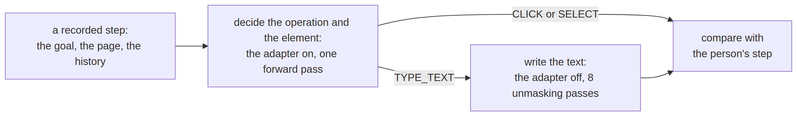
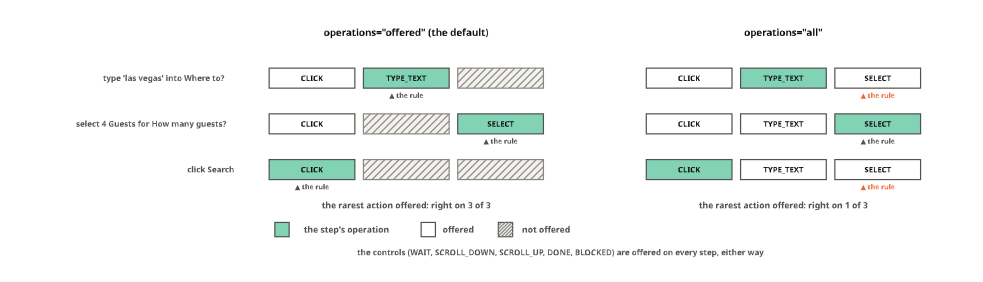

# A diffusion model as a browser agent


<!-- WARNING: THIS FILE WAS AUTOGENERATED! DO NOT EDIT! -->

[laya-ultrafast](https://github.com/cklxx/laya) drives a browser with
two models. A small encoder decides each step: which operation comes
next (click, type, select, or a control such as *done*) and on which
element of the page. When the operation is typing, a small language
model writes the text. The decider is fast because it never writes: one
forward pass gives a probability to every option.

A [masked diffusion language model](../24_mdlm.ipynb) can be both. It
reads the whole text at once, in both directions, as an encoder does, so
sysone’s head reads a decision off it in one pass: the model’s own *Yes*
against its *No* at a mask placed after each option. And it writes, by
filling a row of masks a few tokens at a time. Here
`dllm-hub/Qwen3-0.6B-diffusion-mdlm-v0.1` does both jobs. A LoRA
adapter, trained on Mind2Web steps, makes the decisions; with the
adapter switched off the weights are the published model’s again, and
they write.

The test is
[Multimodal-Mind2Web](https://huggingface.co/datasets/osunlp/Multimodal-Mind2Web)’s
`test_website` split (OpenRAIL): recorded steps of people doing tasks on
websites that none of the training steps came from. There is no browser
here. The agent’s loop runs over the recordings instead: at each step it
decides, writes when it types, and its step is compared with what the
person did.

## How the model decides and writes

<div>

<figure class=''>

<div>



</div>

</figure>

</div>

The decision is read off the model, not written by it. Each option ends
with a mask, under the instruction *mark Yes if it answers the question,
otherwise No*, and one forward pass gives the model’s logits for the
tokens *Yes* and *No* at every mask. An option’s score is its Yes minus
its No, and the softmax across a question’s options makes the scores
probabilities (the [diffusion model’s
notebook](../24_mdlm.ipynb#reading-a-decision-yes-against-no) explains
why that is a linear head on the model). Writing starts from a row of
masks and fills a few at each pass, the most confident first.

<figure>

<figcaption aria-hidden="true">A jev row’s masks, the hidden state at
each, its product with E[Yes] − E[No], and the softmax across the
options; a yes/no question’s one mask and σ(s)</figcaption>
</figure>

<div>

> **Jargon**
>
> - **Step, operation, element**: one action of a recorded task. The
>   operation is what to do (CLICK, TYPE_TEXT or SELECT, or a control:
>   WAIT, SCROLL_DOWN, SCROLL_UP, DONE, BLOCKED), and the element is
>   where to do it, one of up to 45 candidates from the page.
> - **System One, System Two**: the fast decision (one forward pass, a
>   probability for each option) and the slow writing (one forward pass
>   for every unmasking step).
> - **Adapter (LoRA)**: a few million weights added beside a model’s
>   layers and trained while the model’s own weights stay as they are.
>   Switched off, the model is the original one exactly.
> - **Exact match**: the text written is the text the person typed,
>   ignoring case, spacing and surrounding quotes.

</div>

<div>

> **Running this notebook**
>
> The test suite skips this notebook (`skip_exec`). It needs a GPU: it
> ran as a [Kaggle job](../40_cloud.ipynb) on a T4,
> `remote("11_mdlm_browser.ipynb", on="kaggle", hw="t4")`, and the
> outputs below come from that run. It downloads the model (1.5 GB), the
> adapter (40 MB) and the text columns of 300 `test_website` steps and
> 1,500 [`train`](https://sgaseretto.github.io/sysonelib/cli.html#train)
> steps. The outputs come from a run on 2026-10-06 with the first
> adapter, at `revision=FIRST`: the repo has held a better one since,
> and the last section has its scores.

</div>

``` python
import re, time
import numpy as np
import pandas as pd
import torch, transformers
import datasets
from sysone.datasets import from_mm_mind2web
from sysone.cloud import job_input
from sysone.inference import Decider
from sysone.mdlm import ENCODER, zero_shot
```

``` python
transformers.utils.logging.set_verbosity_error(); transformers.utils.logging.disable_progress_bar(); datasets.disable_progress_bars()
pd.set_option("display.width", 200); pd.set_option("display.max_columns", 20); pd.set_option("display.max_colwidth", 70)
ADAPTER = job_input("adapter") or "sgaseretto/diffcider-browser"      # the adapter a job was given, or the published one
FIRST = "b71cab6fe8b72faf6b2710fc3a8fe272af481d57"                   # the repo's revision with the first adapter, the one this notebook ran
device = "cuda" if torch.cuda.is_available() else "cpu"
t_start = time.time()
def rate(x) -> float: return float(np.mean(x)) if len(x) else np.nan        # a share, or NaN when there is nothing to count
print(f"torch {torch.__version__} · transformers {transformers.__version__} · {torch.cuda.get_device_name(0) if device == 'cuda' else device}")
```

    torch 2.11.0+cu128 · transformers 5.16.1 · Tesla T4

## The steps

[`from_mm_mind2web`](https://sgaseretto.github.io/sysonelib/screens.html#from_mm_mind2web)
reads Multimodal-Mind2Web shard by shard and makes a sysone record of
each recorded action; with `screenshots=False` it reads the text columns
only, a small part of the 13.6 GB set. A record asks two questions:
`operation`, which operation comes next, and a target question for the
operation the person used, asking which element it acts on. A typing
step also keeps what was typed, into which field, and whether the task’s
own wording contains it.

``` python
steps = from_mm_mind2web("test_website", n=300, screenshots=False)
s = next(s for s in steps if s["typed"] and s["typed"]["in_goal"])
q = s["questions"]
target = next(k for k in q if k.endswith("_target"))
print("goal:     ", q["operation"]["instructions"]["goal"])
print("operation:", " · ".join(q["operation"]["criteria"]))
print(f"{target}: {len(q[target]['criteria'])} elements, such as", " · ".join(list(q[target]["criteria"].values())[:3]))
print("the person:", s["gold"]["operation"]["label"], s["gold"][target]["label"], "and typed", repr(s["typed"]["value"]))
```

    goal:      What are the romantic reggae musics from BCD Studio that can be used in tik tok series in andorra
    operation: CLICK · TYPE_TEXT · WAIT · SCROLL_DOWN · SCROLL_UP · DONE · BLOCKED
    type_text_target: 1 elements, such as [26] Input artist name (textbox)
    the person: TYPE_TEXT 26 and typed 'BCD Studio'

The 300 steps come from tasks on 9 websites. Most steps are clicks, and
a recorded step is never a control: the people always did something.

``` python
def target_q(s): return next(k for k in s["questions"] if k.endswith("_target"))
pd.DataFrame({"steps": pd.Series([s["gold"]["operation"]["label"] for s in steps]).value_counts(),
              "elements per step": pd.Series({op: rate([len(s["questions"][target_q(s)]["criteria"]) for s in steps
                                                         if s["gold"]["operation"]["label"] == op])
                                              for op in ("CLICK", "TYPE_TEXT", "SELECT")}).round(1)})
```

<div>
<style scoped>
    .dataframe tbody tr th:only-of-type {
        vertical-align: middle;
    }
&#10;    .dataframe tbody tr th {
        vertical-align: top;
    }
&#10;    .dataframe thead th {
        text-align: right;
    }
</style>

<table class="dataframe" data-quarto-postprocess="true" data-border="1">
<thead>
<tr style="text-align: right;">
<th data-quarto-table-cell-role="th"></th>
<th data-quarto-table-cell-role="th">steps</th>
<th data-quarto-table-cell-role="th">elements per step</th>
</tr>
</thead>
<tbody>
<tr>
<td data-quarto-table-cell-role="th">CLICK</td>
<td>235</td>
<td>44.6</td>
</tr>
<tr>
<td data-quarto-table-cell-role="th">TYPE_TEXT</td>
<td>43</td>
<td>1.2</td>
</tr>
<tr>
<td data-quarto-table-cell-role="th">SELECT</td>
<td>22</td>
<td>8.0</td>
</tr>
</tbody>
</table>

</div>

A typing step offers 1.2 fields on average, so its element is nearly
given; a click step chooses among 45.

## The loop

An agent’s step is one call to decide and, when it types, one call to
write.
[`predict`](https://sgaseretto.github.io/sysonelib/cli.html#predict)
answers both questions of a step in one batch, the operation and the
element; `generate` writes the text, with the decider’s adapter switched
off (it does so unless asked otherwise). The text it writes is asked for
from the goal, the page and the field the decider chose:

``` python
SYSTEM = "You fill in web forms for a user. Answer with the exact text to type, nothing else."

def ask(step, field:str) -> str:
    "What the writer is asked: the goal, the page and the field"
    return (f"The user's goal: {step['questions']['operation']['instructions']['goal']}\n"
            f"The page: {step['state']['page']['title']}\nThe field: {field}\nWhat should be typed into this field?")

def norm(t) -> str: return " ".join(re.sub(r"^[\s\"'`.:]+|[\s\"'`.:]+$", "", str(t)).casefold().split())

def pick(probs:dict, prior:dict|None=None) -> str:
    "The likeliest operation; with `prior`, the likeliest once each one's share of the training steps is divided out (one they never had is never picked)"
    if prior is None: return max(probs, key=probs.get)
    return max((k for k in probs if prior.get(k)), key=lambda k: probs[k] / prior[k])

def agent(dec, steps, write_steps:int=8, prior:dict|None=None) -> pd.DataFrame:
    "Each recorded step: decide the operation and the element, write when the operation is TYPE_TEXT, and compare with the person's step"
    out = []
    for s in steps:
        q, tq = s["questions"], target_q(s)
        t0 = time.perf_counter(); ans = dec.predict(s["state"], q); ms = 1000 * (time.perf_counter() - t0)
        op, el = pick(ans["operation"]["probabilities"], prior), ans[tq]["choice"]
        row = {"gold": s["gold"]["operation"]["label"], "picked": op, "operation": op == s["gold"]["operation"]["label"],
               "element": el == s["gold"][tq]["label"], "decide ms": ms,
               "types": s["typed"] is not None, "wrote": None, "text": None, "write ms": np.nan}
        if op == "TYPE_TEXT":
            field = re.sub(r"^\[[^\]]*\]\s*", "", q[tq]["criteria"].get(el, ""))       # the element as the decider saw it
            t0 = time.perf_counter()
            row["wrote"] = dec.generate(ask(s, field), max_new_tokens=16, steps=write_steps, block_size=16, system=SYSTEM)
            row["write ms"] = 1000 * (time.perf_counter() - t0)
            if s["typed"]: row["text"] = norm(row["wrote"]) == norm(s["typed"]["value"])
        row["step"] = row["operation"] and row["element"] and (not row["types"] or row["text"] is True)
        out.append(row)
    return pd.DataFrame(out)

def by_operation(df:pd.DataFrame) -> pd.DataFrame:
    "Per operation the person performed: how many steps, how often the operation and the element are right; and how often each operation is picked"
    t = df.groupby("gold").agg(steps=("operation", "size"), operation=("operation", "mean"), element=("element", "mean"))
    return t.join(df["picked"].value_counts().rename("picked"), how="outer").fillna(0).astype({"steps": int, "picked": int}).round(3)

def summary(df:pd.DataFrame) -> dict:
    "Accuracy of the operation, of the element, of the text typed into the right field, and of the whole step; the median times"
    typed = df[df["types"] & df["operation"] & df["element"]]
    return {"operation": df["operation"].mean(), "element": df["element"].mean(), "text, right field": rate(typed["text"].astype(float)),
            "step": df["step"].mean(), "decide ms": df["decide ms"].median(), "write ms": df["write ms"].median()}
```

## Untrained

[`zero_shot`](https://sgaseretto.github.io/sysonelib/evaluate.html#zero_shot)
is the model as published, its own Yes against its No at each option’s
slot and nothing trained. On the steps:

``` python
zs = zero_shot(ENCODER, device=device)
runs = {"untrained": agent(zs, steps)}
pd.Series(summary(runs["untrained"])).round(3)
```

    operation              0.023
    element                0.247
    text, right field        NaN
    step                   0.000
    decide ms            409.866
    write ms                 NaN
    dtype: float64

The operations it picks:

``` python
by_operation(runs["untrained"])
```

<div>
<style scoped>
    .dataframe tbody tr th:only-of-type {
        vertical-align: middle;
    }
&#10;    .dataframe tbody tr th {
        vertical-align: top;
    }
&#10;    .dataframe thead th {
        text-align: right;
    }
</style>

<table class="dataframe" data-quarto-postprocess="true" data-border="1">
<thead>
<tr style="text-align: right;">
<th data-quarto-table-cell-role="th"></th>
<th data-quarto-table-cell-role="th">steps</th>
<th data-quarto-table-cell-role="th">operation</th>
<th data-quarto-table-cell-role="th">element</th>
<th data-quarto-table-cell-role="th">picked</th>
</tr>
</thead>
<tbody>
<tr>
<td data-quarto-table-cell-role="th">CLICK</td>
<td>235</td>
<td>0.03</td>
<td>0.115</td>
<td>12</td>
</tr>
<tr>
<td data-quarto-table-cell-role="th">DONE</td>
<td>0</td>
<td>0.00</td>
<td>0.000</td>
<td>288</td>
</tr>
<tr>
<td data-quarto-table-cell-role="th">SELECT</td>
<td>22</td>
<td>0.00</td>
<td>0.500</td>
<td>0</td>
</tr>
<tr>
<td data-quarto-table-cell-role="th">TYPE_TEXT</td>
<td>43</td>
<td>0.00</td>
<td>0.837</td>
<td>0</td>
</tr>
</tbody>
</table>

</div>

Untrained, the model answers DONE on 288 of the 300 steps: it puts its
Yes on *Every requirement is visibly satisfied* before any action, and
no recorded step is DONE. Its element is right a quarter of the time:
0.115 on the clicks, where 45 elements compete, and 0.84 on the typing
steps, which offer 1.2 fields.

## Writing, by itself

Writing needs no adapter, so the untrained model’s writing is all there
is to measure: on every typing step, given the field the person typed
into, two ways.

- `generate` answers in the model’s chat format. The fewer unmasking
  steps, the faster and the rougher the text: with `steps=16` each of
  the 16 tokens gets its own pass, with `steps=4` four are kept at each
  pass.
- `fill` writes into the slots of a fixed text and leaves the rest as it
  is, here a JSON string, `{"text": "{}"}`: the model sees the JSON
  around the slot, a way to get JSON without asking for it. A slot is 16
  masks, all filled, so the text ends at the string’s closing quote.

``` python
typing = [s for s in steps if s["typed"]]
in_goal = np.array([s["typed"]["in_goal"] for s in typing])

def measure(write) -> tuple:
    "How often `write(step)` types what the person typed, overall and by whether the goal says it, its median time, and what it wrote"
    said, ms = [], []
    for s in typing:
        t0 = time.perf_counter(); said.append(write(s)); ms.append(1000 * (time.perf_counter() - t0))
    right = np.array([norm(a) == norm(s["typed"]["value"]) for a, s in zip(said, typing)])
    return {"exact": rate(right), "exact, value in the goal": rate(right[in_goal]), "exact, value not in the goal": rate(right[~in_goal]),
            "ms": np.median(ms)}, said

rows, written = {}, {}
for n in (16, 8, 4):
    rows[f"generate, steps={n}"], written[n] = measure(lambda s: zs.generate(ask(s, s["typed"]["field"]), max_new_tokens=16, steps=n,
                                                                           block_size=16, system=SYSTEM))
rows["fill, a JSON string"], written["fill"] = measure(lambda s: zs.fill(ask(s, s["typed"]["field"]), '{"text": "{}"}', n=16, system=SYSTEM)[0])
print(f"{len(typing)} typing steps, {int(in_goal.sum())} of them typing words of the goal")
pd.DataFrame(rows).T.round(3)
```

    43 typing steps, 37 of them typing words of the goal

<div>
<style scoped>
    .dataframe tbody tr th:only-of-type {
        vertical-align: middle;
    }
&#10;    .dataframe tbody tr th {
        vertical-align: top;
    }
&#10;    .dataframe thead th {
        text-align: right;
    }
</style>

<table class="dataframe" data-quarto-postprocess="true" data-border="1">
<thead>
<tr style="text-align: right;">
<th data-quarto-table-cell-role="th"></th>
<th data-quarto-table-cell-role="th">exact</th>
<th data-quarto-table-cell-role="th">exact, value in the goal</th>
<th data-quarto-table-cell-role="th">exact, value not in the goal</th>
<th data-quarto-table-cell-role="th">ms</th>
</tr>
</thead>
<tbody>
<tr>
<td data-quarto-table-cell-role="th">generate, steps=16</td>
<td>0.349</td>
<td>0.405</td>
<td>0.0</td>
<td>752.802</td>
</tr>
<tr>
<td data-quarto-table-cell-role="th">generate, steps=8</td>
<td>0.326</td>
<td>0.378</td>
<td>0.0</td>
<td>382.304</td>
</tr>
<tr>
<td data-quarto-table-cell-role="th">generate, steps=4</td>
<td>0.302</td>
<td>0.351</td>
<td>0.0</td>
<td>197.371</td>
</tr>
<tr>
<td data-quarto-table-cell-role="th">fill, a JSON string</td>
<td>0.209</td>
<td>0.243</td>
<td>0.0</td>
<td>753.302</td>
</tr>
</tbody>
</table>

</div>

``` python
pd.DataFrame({"field": [s["typed"]["field"] for s in typing], "typed": [s["typed"]["value"] for s in typing],
              "generate, steps=8": written[8], "fill": written["fill"]}).head(12)
```

<div>
<style scoped>
    .dataframe tbody tr th:only-of-type {
        vertical-align: middle;
    }
&#10;    .dataframe tbody tr th {
        vertical-align: top;
    }
&#10;    .dataframe thead th {
        text-align: right;
    }
</style>

<table class="dataframe" data-quarto-postprocess="true" data-border="1">
<thead>
<tr style="text-align: right;">
<th data-quarto-table-cell-role="th"></th>
<th data-quarto-table-cell-role="th">field</th>
<th data-quarto-table-cell-role="th">typed</th>
<th data-quarto-table-cell-role="th">generate, steps=8</th>
<th data-quarto-table-cell-role="th">fill</th>
</tr>
</thead>
<tbody>
<tr>
<td data-quarto-table-cell-role="th">0</td>
<td>Input artist name</td>
<td>BCD Studio</td>
<td>BDC Studio</td>
<td>Romantic reggae music from BCD Studio for TikTok series in
Andorra</td>
</tr>
<tr>
<td data-quarto-table-cell-role="th">1</td>
<td>Search</td>
<td>Devin Booker</td>
<td>Devin Booker</td>
<td>Devin Booker jersey</td>
</tr>
<tr>
<td data-quarto-table-cell-role="th">2</td>
<td>Enter text to search for campgrounds, tours, or other recreation
a...</td>
<td>Brooks Camp</td>
<td>Brooks Camp, Katmai National Park, May 22</td>
<td>Check permit availability for Brooks Camp, Katmai National Park
on...</td>
</tr>
<tr>
<td data-quarto-table-cell-role="th">3</td>
<td>Entry Date</td>
<td>05/22/2023</td>
<td>May 22</td>
<td>2023-05-22T12:00</td>
</tr>
<tr>
<td data-quarto-table-cell-role="th">4</td>
<td>Number of Peoples</td>
<td>4</td>
<td>4</td>
<td>Number of Peoples</td>
</tr>
<tr>
<td data-quarto-table-cell-role="th">5</td>
<td>Search by name, location or state</td>
<td>Yosemite</td>
<td>Yosemite National Park</td>
<td>Private Vehicle Pass for Yosemite National Park</td>
</tr>
<tr>
<td data-quarto-table-cell-role="th">6</td>
<td>input</td>
<td>94587</td>
<td>Yes</td>
<td>Private Vehicle Pass for Yosemite National Park, Zip Code 94587</td>
</tr>
<tr>
<td data-quarto-table-cell-role="th">7</td>
<td>input</td>
<td>12345</td>
<td>Yes</td>
<td>Private Vehicle Pass for Yosemite National Park, Zip Code 94587</td>
</tr>
<tr>
<td data-quarto-table-cell-role="th">8</td>
<td>Search</td>
<td>Johannesburg</td>
<td>Johburg vegan</td>
<td>restaurants in Johannesburg</td>
</tr>
<tr>
<td data-quarto-table-cell-role="th">9</td>
<td>What are you looking for?</td>
<td>Google Pixel 7</td>
<td>snow cheapest snow Pixel 7 128gb storage</td>
<td>Find the cheapest snow colored Google Pixel 7 with 128gb
storage</td>
</tr>
<tr>
<td data-quarto-table-cell-role="th">10</td>
<td>What are you looking for?</td>
<td>Nest Hello Video Doorbell</td>
<td>Nest Hello Video Doorbell 1 star reviews</td>
<td>Find reviews of a Nest Hello Video Doorbell and filter by 1 star
r...</td>
</tr>
<tr>
<td data-quarto-table-cell-role="th">11</td>
<td>What are you looking for?</td>
<td>drip coffee maker</td>
<td>Black drip coffee makers black</td>
<td>drip coffee makers on sale, $25-60, black finish</td>
</tr>
</tbody>
</table>

</div>

On the 43 typing steps of these websites, the model types exactly what
the person typed 35% of the time with 16 unmasking steps (753 ms on the
T4) and 30% with 4 (197 ms): 41% when the goal’s wording contains the
value, and never when it does not, since a zip code, or a date in
another format, can’t be read off the goal. Its misses are mostly longer
than the person’s text: the park with its name (*Yosemite National Park*
for *Yosemite*), the search with its filters (*Nest Hello Video Doorbell
1 star reviews*). `fill` comes out lower, 21%, though its slot now ends
at the closing quote: inside the JSON string it writes the goal’s whole
phrase (*Romantic reggae music from BCD Studio…*), where `generate`
answers with the name.

## Trained

The adapter this notebook runs was trained as in the [diffusion model’s
notebook](../24_mdlm.ipynb#browser-steps-on-the-real-checkpoint):
[`decision_learner`](https://sgaseretto.github.io/sysonelib/gliner_backend.html#decision_learner)
on 1,500 steps of the
[`train`](https://sgaseretto.github.io/sysonelib/cli.html#train) split,
keeping their websites apart for validation and calibration
(`groups="website"`). It was the first one. The adapter published now
trained the same way with two changes, every action offered on every
step and the operations balanced, and that is what the cell shows (the
last section says why). On a laptop, the same few lines go to a Kaggle
T4 as a script with `remote("train_browser.py", on="kaggle", hw="t4")`:

``` python
from sysone.data import TypedDecisions, RowSampler
from sysone.mdlm import decision_learner
train = from_mm_mind2web("train", n=1500, screenshots=False, operations="all")          # every action offered on every step
data = TypedDecisions.from_records(train, valid=0.05, calib=0.1, groups="website", sampler=RowSampler("oversample"))
learn = decision_learner(data, per_device_train_batch_size=4, gradient_accumulation_steps=4)
learn.fit_one_cycle(1, max_steps=150, eval=False)
learn.calibrate()
learn.export("diffcider-browser")         # the adapter alone, and the model's id and commit
```

[`Decider.load`](https://sgaseretto.github.io/sysonelib/inference.html#decider.load)
takes the export, from the Hub or from a folder, downloads the model it
names, and puts the adapter on it; `revision=FIRST` takes the first
adapter from the repo’s history:

``` python
del zs
if device == "cuda": torch.cuda.empty_cache()
dec = Decider.load(ADAPTER, revision=FIRST, device=device)
runs["diffcider-browser"] = agent(dec, steps)
pd.Series(summary(runs["diffcider-browser"])).round(3)
```

    operation              0.783
    element                0.643
    text, right field        NaN
    step                   0.457
    decide ms            522.593
    write ms                 NaN
    dtype: float64

Per operation the person performed:

``` python
by_operation(runs["diffcider-browser"])
```

<div>
<style scoped>
    .dataframe tbody tr th:only-of-type {
        vertical-align: middle;
    }
&#10;    .dataframe tbody tr th {
        vertical-align: top;
    }
&#10;    .dataframe thead th {
        text-align: right;
    }
</style>

<table class="dataframe" data-quarto-postprocess="true" data-border="1">
<thead>
<tr style="text-align: right;">
<th data-quarto-table-cell-role="th"></th>
<th data-quarto-table-cell-role="th">steps</th>
<th data-quarto-table-cell-role="th">operation</th>
<th data-quarto-table-cell-role="th">element</th>
<th data-quarto-table-cell-role="th">picked</th>
</tr>
</thead>
<tbody>
<tr>
<td data-quarto-table-cell-role="th">CLICK</td>
<td>235</td>
<td>1.0</td>
<td>0.583</td>
<td>300</td>
</tr>
<tr>
<td data-quarto-table-cell-role="th">SELECT</td>
<td>22</td>
<td>0.0</td>
<td>0.818</td>
<td>0</td>
</tr>
<tr>
<td data-quarto-table-cell-role="th">TYPE_TEXT</td>
<td>43</td>
<td>0.0</td>
<td>0.884</td>
<td>0</td>
</tr>
</tbody>
</table>

</div>

The first adapter answers CLICK on every step. 78% of these steps are
clicks, and 85% of the training steps; trained on them as they come, it
learned that the answer is nearly always CLICK. Its operation is right
exactly as often as always clicking, and it never types, so the loop
never writes. The element is where it learned: 0.643, and 0.583 on the
clicks, among 45 elements.

## Dividing out the shares

A decision model learns how often each answer is right as well as when.
Its probability for an operation is, by Bayes’ rule, proportional to how
well the step fits the operation times the operation’s share of the
training steps; dividing the share out leaves the first factor, a
decision that no longer leans on how common an operation is. The shares
come from the operations of the 1,500 training steps, and an operation
they never had, a control, is never picked:

``` python
shares = pd.Series([s["gold"]["operation"]["label"] for s in from_mm_mind2web("train", n=1500, screenshots=False)]).value_counts(normalize=True)
print(shares.round(3).to_dict())
runs["diffcider-browser, shares divided out"] = agent(dec, steps, prior=shares.to_dict())
by_operation(runs["diffcider-browser, shares divided out"])
```

    {'CLICK': 0.847, 'TYPE_TEXT': 0.099, 'SELECT': 0.055}

<div>
<style scoped>
    .dataframe tbody tr th:only-of-type {
        vertical-align: middle;
    }
&#10;    .dataframe tbody tr th {
        vertical-align: top;
    }
&#10;    .dataframe thead th {
        text-align: right;
    }
</style>

<table class="dataframe" data-quarto-postprocess="true" data-border="1">
<thead>
<tr style="text-align: right;">
<th data-quarto-table-cell-role="th"></th>
<th data-quarto-table-cell-role="th">steps</th>
<th data-quarto-table-cell-role="th">operation</th>
<th data-quarto-table-cell-role="th">element</th>
<th data-quarto-table-cell-role="th">picked</th>
</tr>
</thead>
<tbody>
<tr>
<td data-quarto-table-cell-role="th">CLICK</td>
<td>235</td>
<td>0.749</td>
<td>0.583</td>
<td>176</td>
</tr>
<tr>
<td data-quarto-table-cell-role="th">SELECT</td>
<td>22</td>
<td>1.000</td>
<td>0.818</td>
<td>31</td>
</tr>
<tr>
<td data-quarto-table-cell-role="th">TYPE_TEXT</td>
<td>43</td>
<td>0.953</td>
<td>0.884</td>
<td>93</td>
</tr>
</tbody>
</table>

</div>

With the shares divided out it types on 93 steps and selects on 31, and
gets 41 of the 43 typing steps and all 22 select steps; but it now types
or selects on 59 click steps too, and the operation as a whole is right
79.7% of the time. That is exactly what the rule *the rarest action
offered* gets. A step offers the actions its candidate elements allow,
its own element always among them, so every typing step offers TYPE_TEXT
and every select step SELECT, while 176 of these 300 steps offer CLICK
alone: divided out, the adapter follows the actions on offer (the
[screens](../21_screens.ipynb#one-step-one-record) notebook has the
finding).

<figure>

<figcaption aria-hidden="true">Three steps’ operation menus with the
actions offered, and with every action offered: the rule the rarest
action offered reads the answer off the first, and says SELECT on every
step of the second</figcaption>
</figure>

The rule on three small steps
([figures](../90_figures.ipynb#what-the-operation-question-offers)):
offered the actions its candidates allow, each step’s menu holds its own
operation, and a click step whose candidates are all clickable offers
CLICK alone, so picking the rarest action on the menu is right every
time. Offered every action, the rule can only say SELECT.

When it types, the same decider writes with its adapter off, so what it
typed is what the untrained model writes:

``` python
done = runs["diffcider-browser, shares divided out"]
done[done["wrote"].notna()][["gold", "element", "wrote", "text"]].head(10)
```

<div>
<style scoped>
    .dataframe tbody tr th:only-of-type {
        vertical-align: middle;
    }
&#10;    .dataframe tbody tr th {
        vertical-align: top;
    }
&#10;    .dataframe thead th {
        text-align: right;
    }
</style>

<table class="dataframe" data-quarto-postprocess="true" data-border="1">
<thead>
<tr style="text-align: right;">
<th data-quarto-table-cell-role="th"></th>
<th data-quarto-table-cell-role="th">gold</th>
<th data-quarto-table-cell-role="th">element</th>
<th data-quarto-table-cell-role="th">wrote</th>
<th data-quarto-table-cell-role="th">text</th>
</tr>
</thead>
<tbody>
<tr>
<td data-quarto-table-cell-role="th">3</td>
<td>CLICK</td>
<td>True</td>
<td>BCD Studio</td>
<td>None</td>
</tr>
<tr>
<td data-quarto-table-cell-role="th">5</td>
<td>TYPE_TEXT</td>
<td>True</td>
<td>BDC Studio</td>
<td>False</td>
</tr>
<tr>
<td data-quarto-table-cell-role="th">6</td>
<td>CLICK</td>
<td>True</td>
<td>Romantic reggae music</td>
<td>None</td>
</tr>
<tr>
<td data-quarto-table-cell-role="th">8</td>
<td>CLICK</td>
<td>False</td>
<td>Trending songs</td>
<td>None</td>
</tr>
<tr>
<td data-quarto-table-cell-role="th">9</td>
<td>CLICK</td>
<td>False</td>
<td>Canada</td>
<td>None</td>
</tr>
<tr>
<td data-quarto-table-cell-role="th">14</td>
<td>CLICK</td>
<td>True</td>
<td>Rock playlist</td>
<td>None</td>
</tr>
<tr>
<td data-quarto-table-cell-role="th">15</td>
<td>CLICK</td>
<td>False</td>
<td>Rock</td>
<td>None</td>
</tr>
<tr>
<td data-quarto-table-cell-role="th">22</td>
<td>TYPE_TEXT</td>
<td>True</td>
<td>Devin Booker</td>
<td>True</td>
</tr>
<tr>
<td data-quarto-table-cell-role="th">26</td>
<td>CLICK</td>
<td>True</td>
<td>Add to Cart</td>
<td>None</td>
</tr>
<tr>
<td data-quarto-table-cell-role="th">38</td>
<td>TYPE_TEXT</td>
<td>True</td>
<td>Katmai National Park</td>
<td>False</td>
</tr>
</tbody>
</table>

</div>

Where it types into the right field, the text is right on 31% of the
steps (*text, right field* below), as writing by itself measured.

## Results

Step by step on the 300 steps:

``` python
clicks = rate([s["gold"]["operation"]["label"] == "CLICK" for s in steps])
pd.DataFrame({"always CLICK": {"operation": clicks}} | {k: summary(v) for k, v in runs.items()}).T.round(3)
```

<div>
<style scoped>
    .dataframe tbody tr th:only-of-type {
        vertical-align: middle;
    }
&#10;    .dataframe tbody tr th {
        vertical-align: top;
    }
&#10;    .dataframe thead th {
        text-align: right;
    }
</style>

<table class="dataframe" data-quarto-postprocess="true" data-border="1">
<thead>
<tr style="text-align: right;">
<th data-quarto-table-cell-role="th"></th>
<th data-quarto-table-cell-role="th">operation</th>
<th data-quarto-table-cell-role="th">element</th>
<th data-quarto-table-cell-role="th">text, right field</th>
<th data-quarto-table-cell-role="th">step</th>
<th data-quarto-table-cell-role="th">decide ms</th>
<th data-quarto-table-cell-role="th">write ms</th>
</tr>
</thead>
<tbody>
<tr>
<td data-quarto-table-cell-role="th">always CLICK</td>
<td>0.783</td>
<td>NaN</td>
<td>NaN</td>
<td>NaN</td>
<td>NaN</td>
<td>NaN</td>
</tr>
<tr>
<td data-quarto-table-cell-role="th">untrained</td>
<td>0.023</td>
<td>0.247</td>
<td>NaN</td>
<td>0.000</td>
<td>409.866</td>
<td>NaN</td>
</tr>
<tr>
<td data-quarto-table-cell-role="th">diffcider-browser</td>
<td>0.783</td>
<td>0.643</td>
<td>NaN</td>
<td>0.457</td>
<td>522.593</td>
<td>NaN</td>
</tr>
<tr>
<td data-quarto-table-cell-role="th">diffcider-browser, shares divided
out</td>
<td>0.797</td>
<td>0.643</td>
<td>0.306</td>
<td>0.447</td>
<td>520.765</td>
<td>485.217</td>
</tr>
</tbody>
</table>

</div>

For scale, [laya-ultrafast’s
write-up](https://github.com/cklxx/laya/blob/main/docs/finetune_browser_agent.md)
reports, for its fine-tuned encoders, the right operation 88 to 89% of
the time (54% untrained) and the right element 63% (322M parameters) and
66% (421M) of the time, against 10% untrained, in 17 to 23 ms and 41 to
50 ms a step. Those numbers are not on these steps: it also scored
held-out Mind2Web pages with about 45 candidates each, but it trained on
Mind2Web together with 5,244 generated goals, 700 real DONE pages and
on-policy corrections, and its operations include DONE.

## A better adapter

Two changes make an adapter that decides the operation: every action
offered on every step while it trains
(`from_mm_mind2web(..., operations="all")`), so that the offered actions
never give the answer away, and the operations balanced
(`RowSampler("oversample")`), so that clicking is not the safe answer.
The [diffusion model’s notebook](../24_mdlm.ipynb#every-action-offered)
trains it and three other variants and scores them all on these 300
steps; the published `sgaseretto/diffcider-browser` holds it, and
`Decider.load(ADAPTER)`, without a revision, runs it. On these steps:

<table>
<thead>
<tr>
<th></th>
<th>operation</th>
<th>element</th>
<th>step</th>
</tr>
</thead>
<tbody>
<tr>
<td>always CLICK</td>
<td>0.783</td>
<td></td>
<td></td>
</tr>
<tr>
<td>the rarest action offered</td>
<td>0.797</td>
<td></td>
<td></td>
</tr>
<tr>
<td>the first adapter (this notebook)</td>
<td>0.783</td>
<td>0.643</td>
<td>0.457</td>
</tr>
<tr>
<td>the published adapter</td>
<td><strong>0.853</strong></td>
<td><strong>0.647</strong></td>
<td><strong>0.470</strong></td>
</tr>
</tbody>
</table>

It picks the operation from the goal, the page and the steps before, and
beats the rule: CLICK on 96.6% of the click steps, TYPE_TEXT on 42% of
the typing steps, SELECT on half the select steps. Offered every action
on every step, it leans toward typing and selecting (57% right), having
trained on the operations in equal shares: offer it the actions the
page’s elements allow.

``` python
print(f"the whole notebook: {(time.time() - t_start) / 60:.1f} minutes")
```

    the whole notebook: 13.6 minutes
