# NeoMME on images: digits and hot dogs


<!-- WARNING: THIS FILE WAS AUTOGENERATED! DO NOT EDIT! -->

sysone’s multimodal application answers typed questions about images
with [NeoMME-260M](https://huggingface.co/Hcompany/NeoMME-260M), a
bidirectional encoder of text and page images. This tutorial trains it
on two small tasks and looks at each step on the way: the records, the
rows the encoder reads, the training, the answers, and where they go
wrong.

- **Digits**, a `choice` question. *Which digit is written in the
  image?* has ten options. There are 10 MNIST images of each digit to
  train on, and 10 others of each digit to score.
- **Hot dog, not hot dog**, a `noul` (a statement the model judges true
  or false). The statement is *The photo shows a hot dog.* There are 40
  photos of each class to train on, and 40 others of each class to
  score.

On both tasks it compares three ways to train: the application’s default
head on the frozen encoder, a linear head fitted by LBFGS, and LoRA
adapters that also train the encoder. The
[multimodal](../20_neomme.ipynb) notebook explains how NeoMME’s rows are
built. This one uses the application the way a user would.

<div>

> **Running this notebook**
>
> The test suite skips this notebook (`skip_exec`). It downloads
> NeoMME-260M (526 MB, Apache-2.0) and the two datasets from the Hugging
> Face Hub; after that, the whole run takes about nine minutes. The
> outputs below come from a run on 2026-09-27 on an M3 Pro (MPS, fp32).
> A CUDA GPU is faster and a CPU is several times slower. It needs the
> `multimodal` and `plots` extras
> (`pip install "sysone[multimodal,plots]"`), and it saves its images in
> `neomme-images/`, next to the notebook.

</div>

<div>

<figure class=''>

<div>

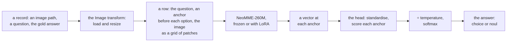

</div>

</figure>

</div>

``` python
import gc, io, json, logging, random, shutil, time
from pathlib import Path
import numpy as np
import pandas as pd
import torch
import torch.nn.functional as F
import matplotlib.pyplot as plt
from matplotlib.offsetbox import AnchoredOffsetbox, HPacker, TextArea
from matplotlib.patches import Rectangle
from matplotlib_inline.backend_inline import set_matplotlib_formats
from PIL import Image as PILImage
from IPython.display import Image as DisplayImage, display
import datasets, huggingface_hub, transformers
from huggingface_hub import snapshot_download
from transformers.trainer_callback import PrinterCallback, ProgressCallback
from sysone.core import collate
from sysone.data import TypedDecisions
from sysone.losses import answer_metrics
from sysone.multimodal import decision_learner
```

``` python
logging.getLogger("transformers").setLevel(logging.ERROR)
datasets.logging.set_verbosity_error(); huggingface_hub.utils.logging.set_verbosity_error()
datasets.disable_progress_bars(); transformers.utils.logging.disable_progress_bar()
set_matplotlib_formats("png"); plt.rcParams["figure.dpi"] = 110          # plain PNG plots, a third the size of retina ones
data_dir = Path("neomme-images")          # the images this notebook saves
t_start = time.time()
device = "cuda" if torch.cuda.is_available() else "mps" if torch.backends.mps.is_available() else "cpu"
print(f"torch {torch.__version__} · transformers {transformers.__version__} · {device}")
```

    torch 2.14.0 · transformers 5.17.0 · mps

Three small helpers. `quiet` removes the Trainer’s printer, which would
otherwise print a line of logs every ten steps. `learn.recorder` still
keeps those numbers for the plots. Each learner holds its own copy of
NeoMME, so the notebook deletes a learner once it’s done with it, and
`release` hands the memory back. `metrics` picks the numbers worth a
look out of `validate`.

``` python
def quiet(learn):
    "The learner, without the Trainer's per-step log lines in the outputs (`learn.recorder` still has them)"
    for cb in (PrinterCallback, ProgressCallback): learn.trainer.remove_callback(cb)
    return learn

def release():
    "Hand back the memory of deleted learners"
    gc.collect()
    if torch.backends.mps.is_available(): torch.mps.empty_cache()
    if torch.cuda.is_available(): torch.cuda.empty_cache()

def metrics(learn):
    "The held-out metrics worth a look, rounded"
    return {k: round(v, 3) for k, v in learn.validate().items() if k in ("accuracy", "soft_accuracy", "brier", "ece", "n")}
```

The plotting code is folded, since none of it is sysone’s API.
`show_cards` draws the prediction cards. Each card shows an image, the
probability the model gave its gold label, where that label ranks, and
the model’s most likely labels as bars.

<details class="code-fold">
<summary>plotting helpers</summary>

``` python
BLUE, LIGHT, TRACK, CARD, INK, GRAY = "#3b3ff5", "#9a9df7", "#d4d4d4", "#f2f2f2", "#111111", "#6b6b6b"

def show_figure(fig, fmt="png", dpi=90):
    "Display a figure as PNG, or as JPEG for photos, and close it"
    buf = io.BytesIO()
    fig.savefig(buf, format=fmt, dpi=dpi, **({"pil_kwargs": {"quality": 85}} if fmt == "jpeg" else {})); plt.close(fig)
    display(DisplayImage(buf.getvalue(), format=fmt))

def _line(ax, x, y, parts, size):
    "Pieces of text in their own weight and colour on one line, its top left corner at (x, y) in axes fraction"
    box = HPacker(children=[TextArea(s, textprops=dict(size=size, **kw)) for s, kw in parts], sep=size * 0.35, pad=0, align="baseline")
    ax.add_artist(AnchoredOffsetbox("upper left", child=box, bbox_to_anchor=(x, y), bbox_transform=ax.transAxes,
                                    frameon=False, pad=0, borderpad=0))

def square(im):
    "The centre square of a PIL image"
    w, h = im.size; s = min(w, h)
    return im.crop(((w - s) // 2, (h - s) // 2, (w - s) // 2 + s, (h - s) // 2 + s))

def _card(sf, image, gold, probs, top):
    "One card: the image, the gold label's probability and rank, and the most likely labels as bars"
    sf.set_facecolor(CARD)
    order = sorted(probs, key=probs.get, reverse=True)
    head = sf.add_axes([0.03, 0.84, 0.94, 0.12]); head.axis("off")
    _line(head, 0, 1, [(f"{gold} ({probs[gold]:.1%})", dict(weight="bold", color=INK)),
                       (f"Ranked {order.index(gold) + 1} out of {len(order)} labels", dict(color=GRAY))], 13)
    im = square(PILImage.open(image))
    ax = sf.add_axes([0.03, 0.06, 0.34, 0.74]); ax.axis("off")
    ax.imshow(im, cmap="gray" if im.mode == "L" else None, interpolation="nearest" if im.size[0] < 64 else "antialiased")
    bars = sf.add_axes([0.41, 0.06, 0.56, 0.74]); bars.axis("off"); bars.set_xlim(0, 1); bars.set_ylim(0, 1)
    for i, lab in enumerate(order[:top]):
        y, ok = 1 - i / 5, lab == gold
        bars.add_patch(Rectangle((0, y - 0.08), 1, 0.06, color=TRACK, lw=0))
        bars.add_patch(Rectangle((0, y - 0.08), max(probs[lab], 0.004), 0.06, color=BLUE if i == 0 else LIGHT, lw=0))
        _line(bars, 0, y - 0.11, [("✓" if ok else "✕", dict(color=INK if ok else GRAY)),
                                  (lab, dict(weight="bold", color=INK if ok else GRAY))], 11.5)

def show_cards(cards, ncols=2, top=5, fmt="png"):
    "Prediction cards in a grid, each a dict of an image path, the gold label and every label's probability"
    nrows = -(-len(cards) // ncols)
    fig = plt.figure(figsize=(6.2 * ncols, 2.8 * nrows))
    sfs = np.atleast_1d(fig.subfigures(nrows, ncols, wspace=0.02, hspace=0.04)).ravel()
    for sf, c in zip(sfs, cards): _card(sf, c["image"], c["gold"], c["probs"], top)
    for sf in sfs[len(cards):]: sf.set_facecolor("white")
    show_figure(fig, fmt)

def plot_history(learn, title, chance):
    "The training loss at every logged step, and the held-out loss and accuracy after every epoch"
    ms, tr = learn.recorder.metrics, learn.recorder.losses
    ep = [m["epoch"] for m in ms]; x = np.linspace(ep[-1] / len(tr), ep[-1], len(tr))
    fig, (a, b) = plt.subplots(1, 2, figsize=(10, 2.8))
    a.plot(x, tr, color="gray", lw=1, label="training rows"); a.plot(ep, [m["loss"] for m in ms], color="C0", lw=1.5, label="held-out rows")
    a.set(xlabel="epoch", ylabel="loss (soft CE)"); a.legend(frameon=False)
    b.plot(ep, [m["accuracy"] for m in ms], color="C0", lw=1.5); b.axhline(chance, ls="--", color="gray", lw=1)
    b.text(ep[-1], chance + 0.02, "chance", ha="right", va="bottom", color="gray", fontsize=9)
    b.set(xlabel="epoch", ylabel="held-out accuracy", ylim=(0, 1)); fig.suptitle(title, fontsize=11)
    plt.tight_layout(); plt.show()

def plot_confusion(panels, labels):
    "A confusion matrix per model: a row per gold label, a column per answer"
    fig, axs = plt.subplots(1, len(panels), figsize=(3.4 * len(panels), 3.4), squeeze=False)
    for ax, (name, (gold, pred)) in zip(axs[0], panels.items()):
        M = np.zeros((len(labels), len(labels)), int)
        for g, p in zip(gold, pred): M[labels.index(g), labels.index(p)] += 1
        top = M.sum() / len(labels)
        ax.imshow(M, cmap="Blues", vmin=0, vmax=top)
        for (r, c), v in np.ndenumerate(M):
            if v: ax.text(c, r, v, ha="center", va="center", fontsize=8, color="white" if v > top / 2 else INK)
        ax.set(xticks=range(len(labels)), yticks=range(len(labels)), xlabel="answer", ylabel="gold")
        ax.set_xticklabels(labels, fontsize=8); ax.set_yticklabels(labels, fontsize=8)
        ax.set_title(f"{name}: accuracy {np.trace(M) / M.sum():.2f}", fontsize=10)
    plt.tight_layout(); plt.show()

def show_grid(img, h, w, p=32, title="", fmt="png"):
    "An image with its grid of p-pixel patches drawn over it"
    fig, ax = plt.subplots(figsize=(0.45 * w + 0.4, 0.45 * h + 0.6))
    ax.imshow(img, interpolation="nearest")
    for r in range(1, h): ax.axhline(r * p - 0.5, color="C1", lw=0.8)
    for c in range(1, w): ax.axvline(c * p - 0.5, color="C1", lw=0.8)
    ax.set_xticks([]); ax.set_yticks([]); ax.set_title(title, fontsize=10)
    show_figure(fig, fmt, dpi=110)
```

</details>

## Digits: a choice question

MNIST’s digits are 28 × 28 grey images. A state is JSON, so an image
travels as a file path. `mnist_records` goes through each MNIST split in
a seeded random order and keeps the first 10 images of each digit: 100
from the train split and 100 from the test split. It saves them as PNG
files and builds one record per image, holding the question and the gold
answer. Because the order is seeded, every run draws the same images.

``` python
def mnist_records(per_class=10, seed=0, dest=data_dir / "mnist"):
    "Choice records over MNIST: `per_class` images of each digit from its train split, and as many from its test split"
    rng, ds = random.Random(seed), datasets.load_dataset("ylecun/mnist")
    q = {"digit": {"type": "choice", "instructions": "Which digit is written in the image?", "criteria": [str(d) for d in range(10)]}}
    out = {}
    for split in ("train", "test"):
        labels, by = ds[split]["label"], {d: [] for d in range(10)}
        for i in rng.sample(range(len(labels)), len(labels)):
            if len(by[labels[i]]) < per_class: by[labels[i]].append(i)
            if all(len(v) == per_class for v in by.values()): break
        (dest / split).mkdir(parents=True, exist_ok=True); out[split] = []
        for d, idx in by.items():
            for i in idx:
                p = dest / split / f"{i}.png"
                if not p.exists(): ds[split][i]["image"].save(p)     # saved once: the feature cache keys on each file's size and time
                out[split].append({"id": f"mnist-{split}-{i}", "state": {"text": "", "image": str(p)}, "questions": q,
                                   "gold": {"digit": {"label": str(d)}}})
        rng.shuffle(out[split])
    return out["train"], out["test"]

train, test = mnist_records()
print(len(train), "cases to train on,", len(test), "to score")
print(json.dumps(train[0], indent=1))
```

    100 cases to train on, 100 to score
    {
     "id": "mnist-train-27562",
     "state": {
      "text": "",
      "image": "neomme-images/mnist/train/27562.png"
     },
     "questions": {
      "digit": {
       "type": "choice",
       "instructions": "Which digit is written in the image?",
       "criteria": [
        "0",
        "1",
        "2",
        "3",
        "4",
        "5",
        "6",
        "7",
        "8",
        "9"
       ]
      }
     },
     "gold": {
      "digit": {
       "label": "8"
      }
     }
    }

<details class="code-fold">
<summary>figure code</summary>

``` python
fig, axs = plt.subplots(10, 10, figsize=(5.5, 5.8))
for d in range(10):
    for j, r in enumerate(r for r in train if r["gold"]["digit"]["label"] == str(d)):
        axs[d, j].imshow(PILImage.open(r["state"]["image"]), cmap="gray"); axs[d, j].axis("off")
fig.suptitle("the 100 digits to train on", y=0.93, fontsize=11); show_figure(fig, dpi=110)
```

</details>

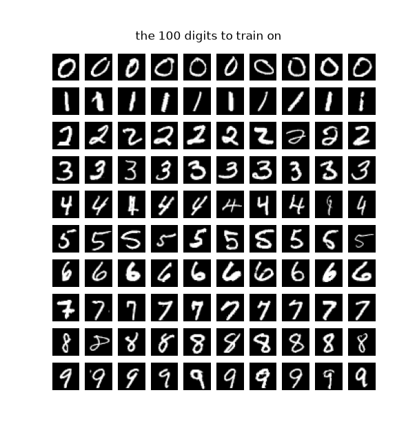

### A learner, and what it reads

[`TypedDecisions.from_records`](https://sgaseretto.github.io/sysonelib/data.html#typeddecisions.from_records)
takes the cases to train on and the cases to score (`valid`), and holds
out a fifth of the training cases (`calib=0.2`) to fit the temperatures.
[`decision_learner`](https://sgaseretto.github.io/sysonelib/gliner_backend.html#decision_learner)
then:

- binds the records to NeoMME’s tokenizer and image processor;
- adds the
  [`Image`](https://sgaseretto.github.io/sysonelib/template.html#image)
  transform, which loads each state’s image and resizes it so its long
  side is `image_side` pixels;
- loads the encoder and builds the head.

With `train="head"` the encoder stays frozen, and its vectors at the
anchors are cached, so the head trains on stored vectors.

``` python
data = TypedDecisions.from_records(train, valid=test, calib=0.2)
torch.manual_seed(0)
learn = quiet(decision_learner(data, "Hcompany/NeoMME-260M", train="head", image_side=224))
learn
```

    Learner(Hcompany/NeoMME-260M · regime head · head 0 layers/laya · cache masks · loss soft_ce · 1,055,745 of 263,993,651 params train)

Each case becomes one row per question. `show_batch` prints a training
row as the encoder reads it, with runs of image tokens counted:

``` python
learn.show_batch(1)
```

    <doc> choice question: Which digit is written in the image? <mask> 0 <mask> 1 <mask> 2 <mask> 3 <mask> 4 <mask> 5 <mask> 6 <mask> 7 <mask> 8 <mask> 9 <doc> ×8 <row> ×7 <row> ×7 <row> ×7 <row> ×7 <row> ×7 <row> ×7 <row>
    markers [12, 15, 18, 21, 24, 27, 30, 33, 36, 39] · qtype choice · 100 tokens

The row opens with the question. Then come the ten options, each after a
`<mask>`, the anchor where the head reads that option’s vector. The
image follows as a block: `<doc>`, then ``, then one `` per
32-pixel patch, with a `<row>` closing each row of the grid. At 224
pixels a digit is a 7 × 7 grid of 49 patches. NeoMME’s processor pads
the image with black to a multiple of 32 pixels and cuts it into
patches. Putting the patches back together shows exactly what the
encoder receives:

``` python
def row_image(learn, split="train", i=0):
    "The image of a row, put back together from its patches; its grid; the row's length"
    row, ip, tok = learn.data.lazy_rows(split)[i], learn.data.builder.processor.image_processor, learn.data.builder.tok
    ids, p = np.asarray(row["input_ids"]), ip.patch_size
    h = int((ids == tok.row_token_id).sum()); w = len(row["pixel_values"]) // h
    x = row["pixel_values"].reshape(h, w, p, p, 3).permute(0, 2, 1, 3, 4).reshape(h * p, w * p, 3)
    return (x * torch.tensor(ip.image_std) + torch.tensor(ip.image_mean)).clamp(0, 1).numpy(), h, w, len(ids)

img, h, w, n = row_image(learn)
print(f"{h} rows of {w} patches: {h * w} patches, and {h * w + h + 2} of the row's {n} tokens")
show_grid(img, h, w, title=f"what the encoder reads: {h} rows of {w} patches, 32 px each")
```

    7 rows of 7 patches: 49 patches, and 58 of the row's 100 tokens

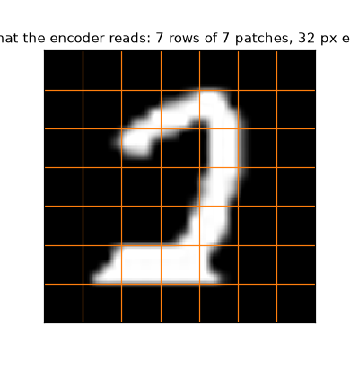

This layout is Laya’s, the decision model whose recipe sysone follows,
and it’s worth a moment to see why it works. NeoMME was trained to fill
in blanks, so its output at a `<mask>` is its guess at what belongs
there, drawn from the whole row: the question, the image, and the option
right after the mask. The vector at an anchor sums up *this option, for
this question, about this image*. The head scores every anchor with the
same weights, and a softmax across the options turns the scores into
probabilities. Nothing in the head is tied to the digits, so a question
with other options needs no new weights.

### Training the head

The encoder runs once over every row, and the anchor vectors are stored
(in `~/.cache/sysone/features`, so a second run of the notebook skips
this):

``` python
t0 = time.time()
for split in ("train", "calib", "valid"): learn.dataset(split)
print(f"the anchors of {sum(len(learn.dataset(s)) for s in ('train', 'calib', 'valid'))} rows, cached in {time.time() - t0:.0f} s")
```

    the anchors of 200 rows, cached in 4 s

Why keep the encoder frozen? Its vectors at the anchors don’t change
from one epoch to the next, so the slow part, NeoMME’s 263 million
weights, runs once per row: 4 seconds here for 200 rows. Each epoch is
then a small network over stored vectors, and trying another head,
learning rate or seed costs seconds. It’s like transcribing a recording
once and then studying the transcript, instead of replaying the tape
each time. The price is an encoder that can’t adapt to the task, which
the LoRA section below measures.

The application’s default head is Laya’s scorer on the anchors: a
LayerNorm, a 1,024 × 1,024 layer, a GELU and a layer down to one score
per anchor. That is about a million weights, with 80 examples to learn
them from. `lr_find` runs the learning-rate range test:

``` python
sugg = learn.lr_find()
learn.plot_lr_find(sugg); plt.show()
sugg
```

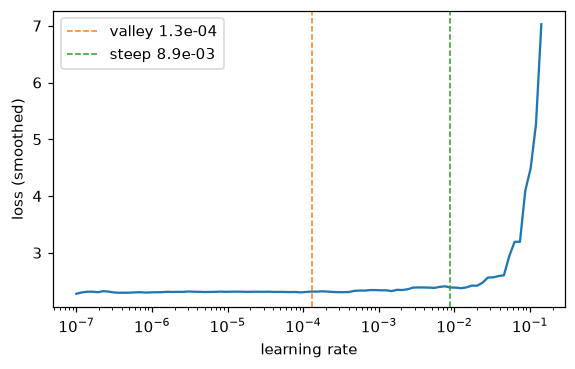

    SuggestedLRs(valley=1.29e-04, steep=8.90e-03)

On 80 examples the range test says little. Over its 100 steps the loss
stays flat until the rate is high enough to make it climb, and the
valley it suggests is too cautious: in the
[multimodal](../20_neomme.ipynb#two-small-image-tasks-on-the-real-checkpoint)
notebook’s runs, a head trained at the valley learned less than one
trained at 10⁻³. So this one trains for 30 epochs at 10⁻³, with warmup
and then cosine decay. After the fit, the learner fits a temperature on
the calib split:

``` python
t0 = time.time()
learn.fit_one_cycle(30, lr=1e-3)
print(f"trained in {time.time() - t0:.1f} s; temperatures {learn.temperatures}")
plot_history(learn, "the default head, on the frozen encoder", chance=0.1)
metrics(learn)
```

    trained in 6.0 s; temperatures {'choice': 2.3453, 'choice:6-10': 2.3453}

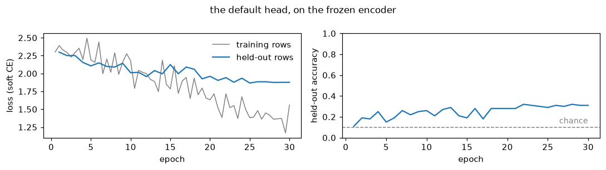

    {'accuracy': 0.31,
     'soft_accuracy': 0.195,
     'brier': 0.78,
     'ece': 0.112,
     'n': 100}

`validate` scores the 100 held-out images with the fitted temperature.
With 100 test images an accuracy is known to about ±0.05 (one standard
error), so a difference of a few points is noise.

<div>

> **Jargon: calibration**
>
> A model is **calibrated** when its probabilities mean what they say:
> of the answers it gives at 70%, about 70% are right. A **temperature**
> *T* is one number that divides the head’s scores before the softmax.
> *T* \> 1 flattens overconfident probabilities and *T* \< 1 sharpens
> timid ones, and the top answer never changes, so a temperature moves
> the Brier score and the ECE but not the accuracy. sysone fits one on
> the calib split for each question type and option count (`choice:6-10`
> is a choice among six to ten options), between 0.5 and 5.
>
> In `validate`’s numbers,
> [`soft_accuracy`](https://sgaseretto.github.io/sysonelib/metrics.html#soft_accuracy)
> is the mean probability given to the right answer. `brier` is the
> squared distance between the probabilities and the one-hot truth,
> summed over the options: 0 is perfect, and a uniform guess scores 0.9
> on ten options and 0.5 on a noul.
> [`ece`](https://sgaseretto.github.io/sysonelib/metrics.html#ece), the
> expected calibration error, sorts the answers into bins by their
> confidence and averages the gap between confidence and accuracy over
> the bins.

</div>

The same made-up scores for the ten digits, through three temperatures.
The tallest bar is the same digit in all three, and only its height
changes:

<details class="code-fold">
<summary>figure code</summary>

``` python
scores = np.array([1.2, -0.3, 0.4, 0.9, -1.0, 0.1, 2.0, 0.6, 1.5, -0.4])      # a head's scores for the digits 0 to 9, made up
fig, axs = plt.subplots(1, 3, figsize=(11, 2.4), sharey=True)
for ax, T in zip(axs, (0.5, 1.0, 2.35)):
    p = np.exp(scores / T) / np.exp(scores / T).sum()
    ax.bar(range(10), p, color=[BLUE if i == p.argmax() else LIGHT for i in range(10)])
    ax.set_title(f"T = {T:g}: the top digit gets {p.max():.0%}", fontsize=9.5, loc="left"); ax.set_xticks(range(10))
    for s in ("top", "right"): ax.spines[s].set_visible(False)
axs[0].set_ylabel("probability"); fig.tight_layout(); show_figure(fig)
```

</details>

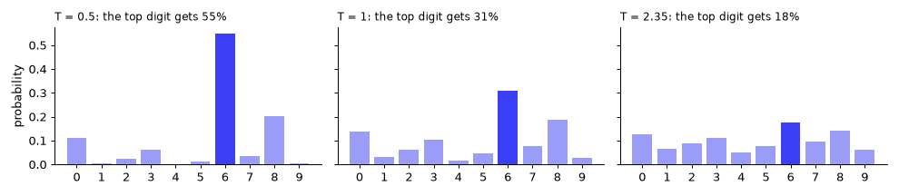

### The answers

`learn.decider()` answers in the Jev schema from the model in memory:
the chosen option, every option’s probability, and a confidence.

``` python
q = test[0]["questions"]
answers = {"default head": learn.decider().predict_batch([r["state"] for r in test], q)}
print(json.dumps(answers["default head"][0], indent=1))
m = answer_metrics([(q, a, r["gold"]) for a, r in zip(answers["default head"], test)])
print("the answers' metrics:", {k: round(m[k], 3) for k in ("accuracy", "soft_accuracy", "brier", "ece")})
```

    {
     "digit": {
      "type": "choice",
      "choice": "6",
      "probabilities": {
       "0": 0.0197,
       "1": 0.0306,
       "2": 0.1129,
       "3": 0.0891,
       "4": 0.1359,
       "5": 0.1258,
       "6": 0.1669,
       "7": 0.1192,
       "8": 0.0962,
       "9": 0.1038
      },
      "confidence": 0.0488,
      "answer_confidence": 0.1669
     }
    }
    the answers' metrics: {'accuracy': 0.31, 'soft_accuracy': 0.195, 'brier': 0.78, 'ece': 0.112}

The answers score what `validate` scored, because they are the same rows
read through the inference path. Here is the first test image of each
digit, with the probability the head gave the right digit and its five
most likely digits:

``` python
def digit_cards(answers, recs):
    "A card per record: its image, its gold digit and every digit's probability"
    return [{"image": r["state"]["image"], "gold": r["gold"]["digit"]["label"], "probs": a["digit"]["probabilities"]}
            for a, r in zip(answers, recs)]

firsts = [next(i for i, r in enumerate(test) if r["gold"]["digit"]["label"] == str(d)) for d in range(10)]
show_cards(digit_cards([answers["default head"][i] for i in firsts], [test[i] for i in firsts]))
```

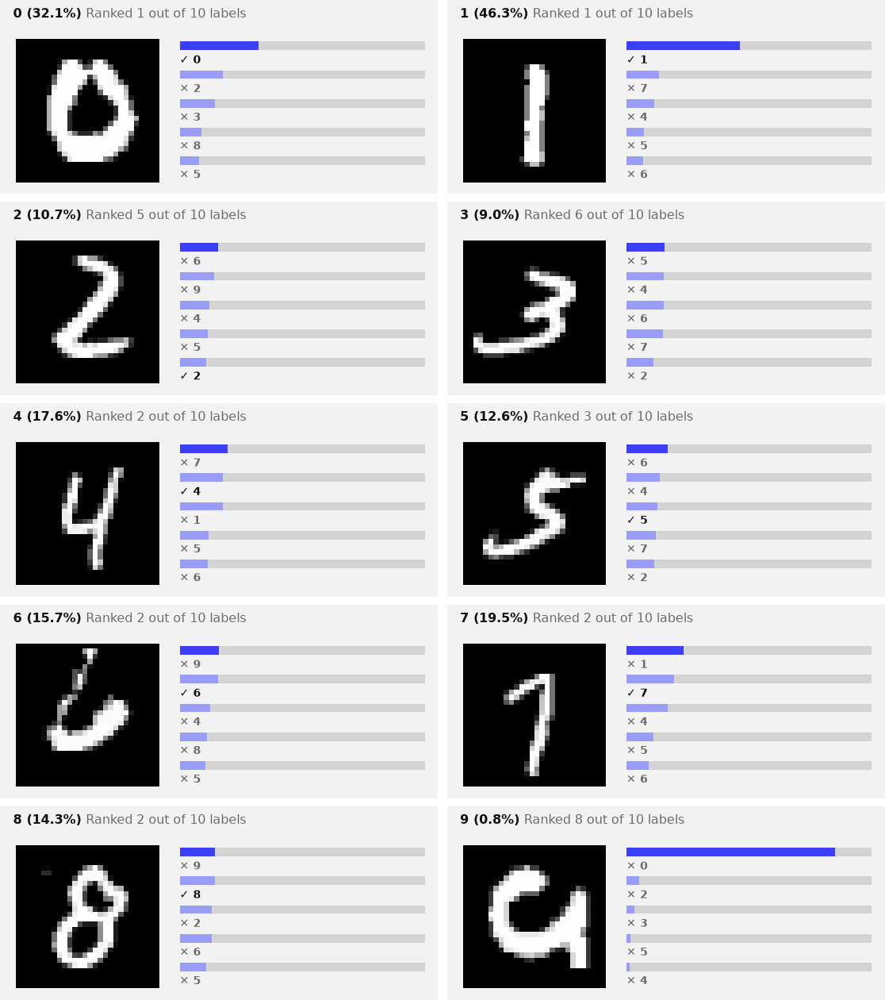

The head gets the 0 and the 1 right, and puts the right digit second for
the 4, 6, 7 and 8. It misses the 2, the 3 and the 5 by more, and reads
the 9 as a 0 with high confidence. Most of its probabilities are low,
which suits a head that is right about three times in ten: the
temperature fitted on the calib split, 2.3, spreads them out.

### Why the head standardises NeoMME’s vectors

To see what the head works with, look at the anchor vectors it trains
on: 80 training rows with 10 anchors each, every vector 1,024 wide.

``` python
A = np.concatenate([np.asarray(a, dtype=np.float32) for a in learn.dataset("train")["anchors"]])
norm, mu, sd = np.linalg.norm(A, axis=1), A.mean(0), A.std(0)
c = int(np.abs(mu).argmax())
print(f"{A.shape[0]} vectors of width {A.shape[1]}, norm {norm.mean():.2f} ± {norm.std():.3f}")
print(f"channel {c}: mean {mu[c]:.2f}, sd {sd[c]:.3f}, {np.mean(np.abs(A[:, c]) / norm):.1%} of every vector's norm")
print(f"the other {A.shape[1] - 1} channels: |mean| at most {np.sort(np.abs(mu))[-2]:.2f}, sd at most {np.delete(sd, c).max():.3f}")
```

    800 vectors of width 1024, norm 32.00 ± 0.000
    channel 139: mean 30.87, sd 0.018, 96.5% of every vector's norm
    the other 1023 channels: |mean| at most 1.26, sd at most 0.130

<details class="code-fold">
<summary>figure code</summary>

``` python
def cosines(X):
    X = X / np.linalg.norm(X, axis=1, keepdims=True); C = X @ X.T
    return C[np.triu_indices(len(X), 1)]
layer_norm = lambda X: (X - X.mean(1, keepdims=True)) / X.std(1, keepdims=True)
fig, axs = plt.subplots(1, 3, figsize=(12, 3))
axs[0].plot(mu, lw=0.8); axs[0].set(title="mean of each channel", xlabel="channel")
axs[0].annotate(f"channel {c}", (c, mu[c]), (c + 120, mu[c] * 0.75), arrowprops=dict(arrowstyle="->"), fontsize=9)
axs[1].plot(sd, lw=0.8, color="C2"); axs[1].set(title="spread (sd) of each channel", xlabel="channel")
for X, name, lw in ((A, "raw", 4), (layer_norm(A), "LayerNorm of each vector", 1.3), ((A - mu) / sd, "each channel standardised", 1.3)):
    axs[2].hist(cosines(X), bins=100, range=(-1, 1), histtype="step", lw=lw, label=name)
axs[2].set(title="cosine between two anchors", yscale="log", xlabel="cosine"); axs[2].legend(fontsize=8, frameon=False, loc="upper left")
plt.tight_layout(); plt.show()
```

</details>

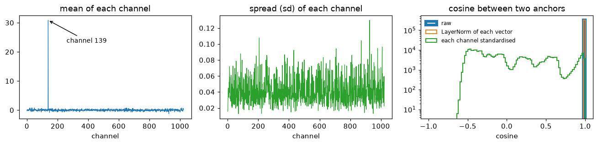

NeoMME’s last layer is a norm without a learned scale, so every vector
has the same length, √1024 = 32. Channel 139 holds 30.9 of it in every
vector and barely moves from one vector to the next (its spread is
0.018). It carries almost all of each vector’s length and almost nothing
that tells two vectors apart, so any two anchors have a cosine above
0.99.

A LayerNorm doesn’t change that. It centres and scales each vector by
that vector’s own mean and spread, and the same channel sets both, so
the layer-normed cosines sit on top of the raw ones. Standardising each
channel over the training vectors (subtract the channel’s mean, divide
by its spread) removes the constant and puts every channel on one scale,
and the cosines spread out between −0.6 and 1. That’s what
`DecisionHead(standardize=True)` does. It fits the per-channel
statistics on the training rows before the first fit, and the multimodal
application turns it on.

The same channel is why the application caches the anchors in float32:
float16’s step near 30.9 is about as large as the channel’s whole spread
(see the finding in the [multimodal](../20_neomme.ipynb#a-head-only-run)
notebook).

The same recipe, without the standardisation:

``` python
torch.manual_seed(0)
raw = quiet(decision_learner(data, "Hcompany/NeoMME-260M", train="head", image_side=224, standardize=False))
raw.fit_one_cycle(30, lr=1e-3)
print(f"accuracy without standardising: {raw.validate()['accuracy']:.2f}, with: {learn.validate()['accuracy']:.2f}")
del raw; release()
```

    accuracy without standardising: 0.14, with: 0.31

### The linear head

`head="linear"` scores every anchor with a single weight vector.
`fit_linear` fits it on the cached anchors by LBFGS. The problem is
convex, with one optimum, so there’s no learning rate or number of
epochs to pick:

``` python
torch.manual_seed(0)
lin = quiet(decision_learner(data, "Hcompany/NeoMME-260M", train="head", head="linear", image_side=224))
print(lin.fit_linear())
answers["linear head"] = lin.decider().predict_batch([r["state"] for r in test], q)
metrics(lin)
```

    {'train_loss': 0.4460946023464203, 'seconds': 0.23}

    {'accuracy': 0.41,
     'soft_accuracy': 0.292,
     'brier': 0.721,
     'ece': 0.169,
     'n': 100}

The linear head is a logistic regression turned sideways. The usual
kind, like the probe in the next section, has one weight vector per
class and can only answer those classes. The linear head has a single
weight vector *w* for all the options: option *k* scores
*w* ⋅ *a*<sub>*k*</sub>, where *a*<sub>*k*</sub> is its standardised
anchor vector, and a softmax across the options gives the probabilities.
The options differ only through their anchors, so the same *w* serves
any question.

### What NeoMME’s image representation holds

How much of the digit is in NeoMME’s representation of the image,
whatever the head does with it? A *probe* leaves out the question, the
options and the head. It averages the encoder’s output over the image’s
positions, giving one vector per image, and fits a logistic regression
from those vectors to the digit on the 100 training images (the train
and calib splits):

``` python
def image_vectors(learn, split):
    "One vector per case: the mean of the encoder's output over the image's positions"
    model, tok, rows = learn.model.eval(), learn.data.builder.tok, learn.data.lazy_rows(split)
    X, y = [], []
    with torch.no_grad():
        for i in range(len(rows)):
            b = collate([rows[i]], tok.pad_token_id or 0).to(model.device)
            h = model.encode(b["input_ids"], b["attention_mask"], position_ids=b["position_ids"], pixel_values=b["pixel_values"])
            X.append(h[0, b["input_ids"][0] == tok.image_token_id].float().mean(0).cpu()); y.append(int(rows[i]["label"]))
    return torch.stack(X), torch.tensor(y)

def probe(Xtr, ytr, Xte, yte, l2=1e-3):
    "The test accuracy of a multinomial logistic regression on standardised features, fitted by LBFGS"
    mu, sd = Xtr.mean(0), Xtr.std(0).clamp_min(1e-6); Xtr, Xte = (Xtr - mu) / sd, (Xte - mu) / sd
    W = torch.zeros(Xtr.shape[1], int(ytr.max()) + 1, requires_grad=True); b = torch.zeros(W.shape[1], requires_grad=True)
    opt = torch.optim.LBFGS([W, b], max_iter=300, line_search_fn="strong_wolfe")
    def closure():
        opt.zero_grad(); loss = F.cross_entropy(Xtr @ W + b, ytr) + l2 * (W ** 2).sum(); loss.backward(); return loss
    opt.step(closure)
    return ((Xte @ W + b).argmax(-1) == yte).float().mean().item()

(Xa, ya), (Xb, yb), (Xv, yv) = (image_vectors(lin, s) for s in ("train", "calib", "valid"))
probes = {"digits": probe(torch.cat([Xa, Xb]), torch.cat([ya, yb]), Xv, yv)}
print(f"the probe on NeoMME's image vectors: {probes['digits']:.2f}")
pixels = lambda recs: torch.stack([torch.from_numpy(np.asarray(PILImage.open(r["state"]["image"]), dtype=np.float32).ravel() / 255) for r in recs])
digits = lambda recs: torch.tensor([int(r["gold"]["digit"]["label"]) for r in recs])
pixel_probe = probe(pixels(train), digits(train), pixels(test), digits(test))
print(f"the same regression on the 784 raw pixels: {pixel_probe:.2f}")
del learn, lin; release()
```

    the probe on NeoMME's image vectors: 0.56
    the same regression on the 784 raw pixels: 0.77

The probe reads 0.56 from the image vectors, more than either head reads
from the anchors (0.31 and 0.41). The anchors sit on the options, and
what they know about the image reaches them through attention. The raw
pixels, at 0.77, beat everything. NeoMME was trained on pages, and a
28-pixel digit blown up to 224 pixels becomes 49 patches of blurred
strokes. The [last section](#one-more-setting-the-image-size) measures
how much of that is the size.

### LoRA: training the encoder too

`train="lora"` adds rank-8 LoRA adapters to the attention projections of
NeoMME’s 17 layers (`q_proj`, `k_proj`, `v_proj` and `o_proj`, 905,216
weights) and trains them together with the head. The encoder’s outputs
now change at every step, so there’s no cache: every epoch runs the
encoder over the 80 training rows. It trains for 20 epochs at 10⁻³:

``` python
torch.manual_seed(0)
lora = quiet(decision_learner(data, "Hcompany/NeoMME-260M", train="lora", image_side=224))
print(lora)
t0 = time.time(); lora.fit_one_cycle(20, lr=1e-3)
print(f"trained in {time.time() - t0:.0f} s; temperatures {lora.temperatures}")
answers["LoRA"] = lora.decider().predict_batch([r["state"] for r in test], q)
plot_history(lora, "LoRA: adapters in the encoder, and the head", chance=0.1)
metrics(lora)
```

    Learner(Hcompany/NeoMME-260M · regime lora · head 0 layers/laya · cache None · loss soft_ce · 1,960,961 of 264,898,867 params train)
    trained in 146 s; temperatures {'choice': 3.8516, 'choice:6-10': 3.8516}

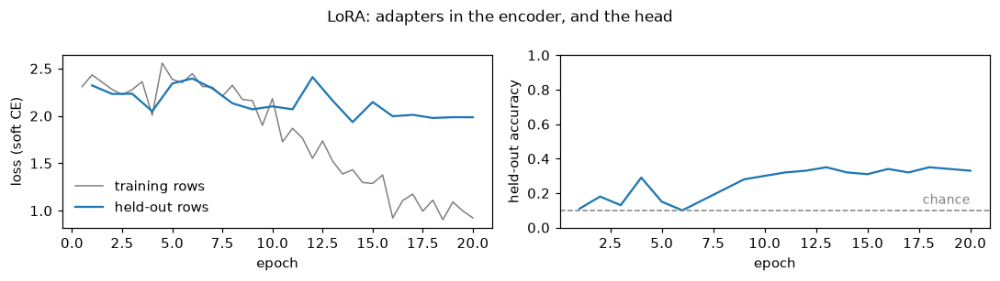

    {'accuracy': 0.33,
     'soft_accuracy': 0.178,
     'brier': 0.787,
     'ece': 0.105,
     'n': 100}

``` python
del lora; release()
gold = [r["gold"]["digit"]["label"] for r in test]
plot_confusion({name: (gold, [a["digit"]["choice"] for a in ans]) for name, ans in answers.items()}, [str(d) for d in range(10)])
```

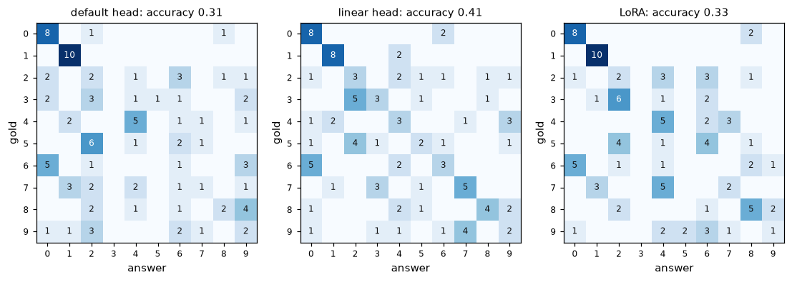

All three models read the 0s and the 1s (8 to 10 of 10 each) and confuse
most of the rest. All three send half the 6s to 0, and neither the
default head nor LoRA ever answers 3. LoRA trains 1.96 million weights
(the attention adapters and the head), yet it does no better than the
linear head’s single weight vector on the frozen encoder: 80 images are
few for that many weights. LoRA’s result also moves between runs,
because training through the encoder on MPS isn’t bit-for-bit
repeatable. Four runs of this LoRA fit gave between 0.32 and 0.36 on the
digits, while the heads’ accuracies repeat from one run to the next.

## Hot dog, not hot dog: a noul

A noul reads as two anchors, one for *false* and one for *true*. Its
answer is the probability that the statement is true. The photos come
from
[truepositive/hotdog_nothotdog](https://huggingface.co/datasets/truepositive/hotdog_nothotdog)
on the Hugging Face Hub: its train split holds 100 stock photos of hot
dogs and 100 of other food, each 224 pixels on its long side. It stands
in for Kaggle’s
[dansbecker/hot-dog-not-hot-dog](https://www.kaggle.com/datasets/dansbecker/hot-dog-not-hot-dog),
which needs a Kaggle account to download; [the last
section](#with-kaggles-photos) shows how to run on Kaggle’s copy.
`hotdog_records` shuffles each class with a seed, then takes 40 photos
to train on and 40 others to score. It copies them next to the notebook,
so the records hold short relative paths.

``` python
def hotdog_records(per_class=40, seed=0, src=None, dest=data_dir / "hotdog"):
    "Noul records over photos of hot dogs and of other food: `per_class` of each class to train on, `per_class` others to score"
    src = Path(src or snapshot_download("truepositive/hotdog_nothotdog", repo_type="dataset"))
    rng, q, train, test = random.Random(seed), {"hot_dog": {"type": "noul", "instructions": "The photo shows a hot dog."}}, [], []
    for cls, truth in (("hotdog", 1.0), ("not_hotdog", 0.0)):
        folder = next(p for p in sorted(src.rglob("*")) if p.is_dir() and p.parent.name == "train"
                      and p.name.replace("_", "") == cls.replace("_", ""))           # hotdog or hot_dog, not_hotdog or not_hot_dog
        files = sorted(folder.glob("*.jpg")); rng.shuffle(files)
        (dest / cls).mkdir(parents=True, exist_ok=True)
        for part, fs in ((train, files[:per_class]), (test, files[per_class:2 * per_class])):
            for f in fs:
                p = dest / cls / f.name
                if not p.exists(): shutil.copy2(f, p)                            # the copy keeps the file's time, which the cache keys on
                part.append({"id": f"{cls}-{f.stem}", "state": {"text": "", "image": str(p)}, "questions": q,
                             "gold": {"hot_dog": {"noul": truth}}})
    rng.shuffle(train); rng.shuffle(test)
    return train, test

htrain, htest = hotdog_records()
print(len(htrain), "cases to train on,", len(htest), "to score")
print(json.dumps(htrain[0], indent=1))
```

    80 cases to train on, 80 to score
    {
     "id": "hotdog-4518648",
     "state": {
      "text": "",
      "image": "neomme-images/hotdog/hotdog/4518648.jpg"
     },
     "questions": {
      "hot_dog": {
       "type": "noul",
       "instructions": "The photo shows a hot dog."
      }
     },
     "gold": {
      "hot_dog": {
       "noul": 1.0
      }
     }
    }

<details class="code-fold">
<summary>figure code</summary>

``` python
fig, axs = plt.subplots(2, 8, figsize=(12, 3.4))
for row, (truth, name) in enumerate(((1.0, "hot dog"), (0.0, "not hot dog"))):
    for ax, r in zip(axs[row], [r for r in htrain if r["gold"]["hot_dog"]["noul"] == truth][:8]):
        ax.imshow(square(PILImage.open(r["state"]["image"]))); ax.set_xticks([]); ax.set_yticks([])
    axs[row, 0].set_ylabel(name, fontsize=11)
fig.suptitle("photos to train on", fontsize=11); plt.tight_layout(); show_figure(fig, "jpeg")
```

</details>


The photos are enlarged to 384 pixels on their long side
(`image_side=384`). Most of them are 3:2, landscape or portrait, which
at 384 pixels makes 96 patches: 12 along the long side and 8 along the
short one.

``` python
hdata = TypedDecisions.from_records(htrain, valid=htest, calib=0.2)
torch.manual_seed(0)
hlearn = quiet(decision_learner(hdata, "Hcompany/NeoMME-260M", train="head", image_side=384))
hlearn.show_batch(1)
img, h, w, n = row_image(hlearn)
print(f"{h} rows of {w} patches: {h * w} patches, and {h * w + h + 2} of the row's {n} tokens")
show_grid(img, h, w, title=f"what the encoder reads: {h} rows of {w} patches, 32 px each", fmt="jpeg")
```

    <doc> noul question: The photo shows a hot dog. <mask> false: no, the statement does not hold <mask> true: yes, the statement holds <doc> ×9 <row> ×8 <row> ×8 <row> ×8 <row> × … w> ×8 <row> ×8 <row> ×8 <row> ×8 <row> ×8 <row> ×8 <row> ×8 <row>
    markers [12, 21] · qtype noul · 139 tokens

    12 rows of 8 patches: 96 patches, and 110 of the row's 139 tokens

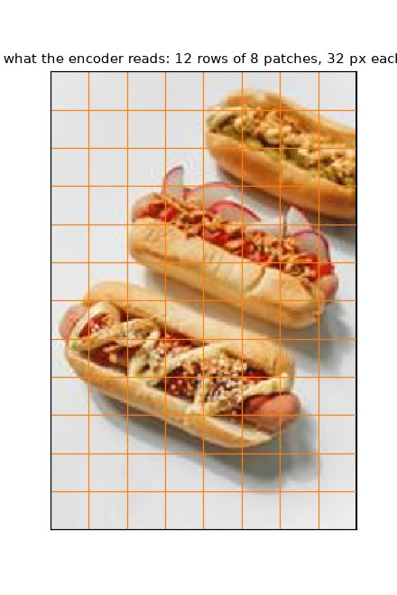

The same three ways to train, with the same settings as for the digits.
First the default head:

``` python
t0 = time.time()
hlearn.fit_one_cycle(30, lr=1e-3)
print(f"cached the anchors and trained in {time.time() - t0:.0f} s; temperatures {hlearn.temperatures}")
hq = htest[0]["questions"]
hanswers = {"default head": hlearn.decider().predict_batch([r["state"] for r in htest], hq)}
plot_history(hlearn, "the default head, on the frozen encoder", chance=0.5)
metrics(hlearn)
```

    cached the anchors and trained in 10 s; temperatures {'noul': 5.0, 'noul:2': 5.0}

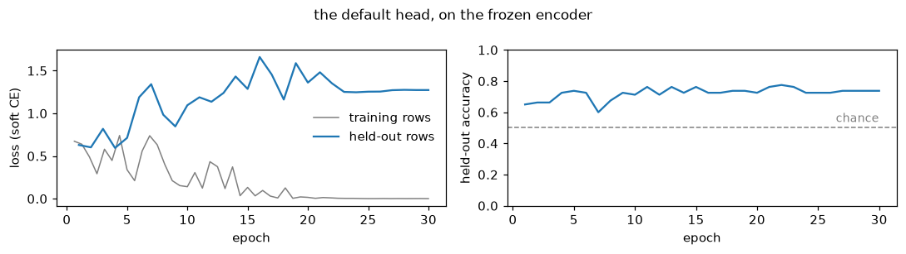

    {'accuracy': 0.738,
     'soft_accuracy': 0.687,
     'brier': 0.333,
     'ece': 0.13,
     'n': 80}

Then the linear head, and the probe on the image vectors, as for the
digits:

``` python
torch.manual_seed(0)
hlin = quiet(decision_learner(hdata, "Hcompany/NeoMME-260M", train="head", head="linear", image_side=384))
print(hlin.fit_linear())
hanswers["linear head"] = hlin.decider().predict_batch([r["state"] for r in htest], hq)
print(metrics(hlin))
(Xa, ya), (Xb, yb), (Xv, yv) = (image_vectors(hlin, s) for s in ("train", "calib", "valid"))
probes["hot dog"] = probe(torch.cat([Xa, Xb]), torch.cat([ya, yb]), Xv, yv)
print(f"the probe on NeoMME's image vectors: {probes['hot dog']:.2f}")
del hlearn, hlin; release()
```

    {'train_loss': 0.009446114301681519, 'seconds': 0.17}
    {'accuracy': 0.7, 'soft_accuracy': 0.634, 'brier': 0.36, 'ece': 0.086, 'n': 80}
    the probe on NeoMME's image vectors: 0.71

And LoRA, 20 epochs at 10⁻³:

``` python
torch.manual_seed(0)
hlora = quiet(decision_learner(hdata, "Hcompany/NeoMME-260M", train="lora", image_side=384))
t0 = time.time(); hlora.fit_one_cycle(20, lr=1e-3)
print(f"trained in {time.time() - t0:.0f} s; temperatures {hlora.temperatures}")
hanswers["LoRA"] = hlora.decider().predict_batch([r["state"] for r in htest], hq)
plot_history(hlora, "LoRA: adapters in the encoder, and the head", chance=0.5)
metrics(hlora)
```

    trained in 176 s; temperatures {'noul': 5.0, 'noul:2': 5.0}

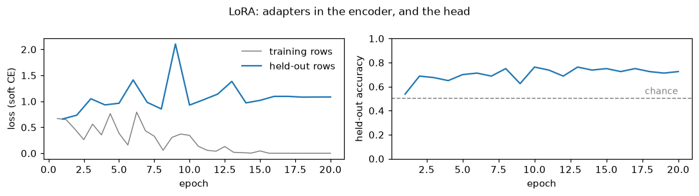

    {'accuracy': 0.725,
     'soft_accuracy': 0.702,
     'brier': 0.307,
     'ece': 0.102,
     'n': 80}

``` python
del hlora; release()
```

### The answers

A noul’s answer is a single number, `noul`: the probability that the
statement is true. The cards below show it as two bars, *hot dog* and
*not hot dog*, for the default head on the first four test photos of
each class:

``` python
print(json.dumps(hanswers["default head"][0], indent=1))
label = lambda truth: "hot dog" if truth else "not hot dog"
def hotdog_cards(answers, recs):
    "A card per record: its photo, its gold class, and the two classes' probabilities"
    return [{"image": r["state"]["image"], "gold": label(r["gold"]["hot_dog"]["noul"]),
             "probs": {"hot dog": a["hot_dog"]["noul"], "not hot dog": round(1 - a["hot_dog"]["noul"], 4)}} for a, r in zip(answers, recs)]

pick = [i for i, r in enumerate(htest) if r["gold"]["hot_dog"]["noul"] == 1][:4] + [i for i, r in enumerate(htest) if r["gold"]["hot_dog"]["noul"] == 0][:4]
show_cards(hotdog_cards([hanswers["default head"][i] for i in pick], [htest[i] for i in pick]), top=2, fmt="jpeg")
```

    {
     "hot_dog": {
      "type": "noul",
      "noul": 0.8999,
      "confidence": 0.8999,
      "answer_confidence": 0.8999
     }
    }


Across all 80 test photos, the probability each model gave *hot dog*,
split by what the photo shows. An answer of 0.5 or more reads as *hot
dog*, so an answer is right on its class’s side of the dashed line:

<details class="code-fold">
<summary>figure code</summary>

``` python
truth = [r["gold"]["hot_dog"]["noul"] for r in htest]
fig, axs = plt.subplots(1, len(hanswers), figsize=(3.8 * len(hanswers), 2.4), sharey=True)
jitter = np.random.default_rng(0).uniform(-0.2, 0.2, len(htest))
for ax, (name, ans) in zip(axs, hanswers.items()):
    p = np.array([a["hot_dog"]["noul"] for a in ans])
    for k, (t, col) in enumerate(((1.0, "C1"), (0.0, "C0"))):
        sel = np.array(truth) == t
        ax.scatter(p[sel], k + jitter[sel], s=14, color=col, alpha=0.8)
    ax.axvline(0.5, color="gray", ls="--", lw=1)
    ax.set(xlim=(0, 1), yticks=[0, 1], xlabel="p(the photo shows a hot dog)"); ax.set_yticklabels(["hot dog", "not hot dog"])
    ax.set_title(f"{name}: accuracy {np.mean((p >= 0.5) == (np.array(truth) == 1)):.2f}", fontsize=10)
plt.tight_layout(); plt.show()
```

</details>

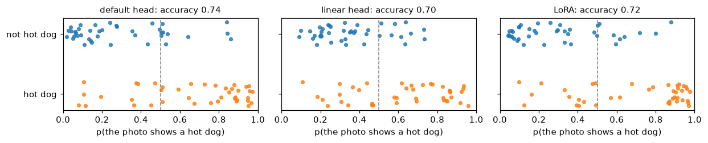

``` python
plot_confusion({name: ([label(t) for t in truth], [label(a["hot_dog"]["noul"] >= 0.5) for a in ans]) for name, ans in hanswers.items()},
               ["hot dog", "not hot dog"])
```

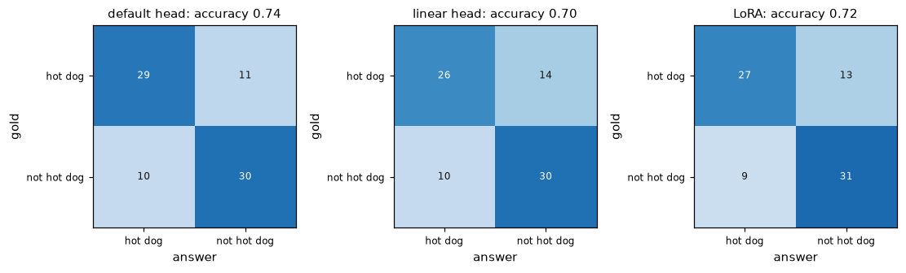

Most photos land on the right side of 0.5. The mistakes split about
evenly between the classes: the default head doubts 11 of the 40 hot
dogs, and calls 10 of the 40 other photos hot dogs. The default head and
LoRA are also sure of a few wrong ones, giving two or three other photos
more than 0.8. The training curves above show the models growing
overconfident: the training loss goes to zero while the held-out loss
climbs. The temperatures fitted on the 16 calib photos stop at sysone’s
upper bound, 5, for both the default head and LoRA.

### Photos from the same shoot

Stock photos come in series: several shots of one scene, whose file
names are nearly consecutive numbers. The seeded split doesn’t know
about them, so some held-out photos have a sibling from the same shoot
among the training photos. The top row below is held-out photos, and the
bottom row is the training photo whose number is closest:

``` python
num = lambda r: int(r["id"].split("-")[1])                       # the photo's file name, a number
sibling = np.array([min(abs(num(r) - num(s)) for s in htrain) <= 10 for r in htest])
hot = np.array(truth) == 1
print(f"{(sibling & hot).sum()} of the {hot.sum()} held-out hot dogs, and {(sibling & ~hot).sum()} of the {(~hot).sum()} other photos, "
      "have a training photo within 10 numbers of theirs")
pairs = [(r, min(htrain, key=lambda s: abs(num(r) - num(s)))) for r, s in zip(htest, sibling) if s][:6]
fig, axs = plt.subplots(2, len(pairs), figsize=(1.5 * len(pairs), 3.2))
for k, (r, s) in enumerate(pairs):
    for row, x in enumerate((r, s)):
        axs[row, k].imshow(square(PILImage.open(x["state"]["image"]))); axs[row, k].set_xticks([]); axs[row, k].set_yticks([])
        axs[row, k].set_xlabel(x["id"].split("-")[1], fontsize=7)
axs[0, 0].set_ylabel("held out", fontsize=9); axs[1, 0].set_ylabel("training", fontsize=9)
plt.tight_layout(); show_figure(fig, "jpeg")
```

    17 of the 40 held-out hot dogs, and 1 of the 40 other photos, have a training photo within 10 numbers of theirs

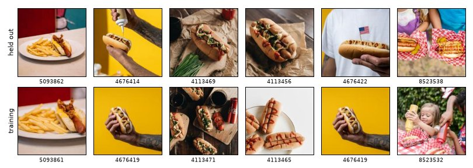

``` python
right = {name: (np.array([a["hot_dog"]["noul"] for a in ans]) >= 0.5) == hot for name, ans in hanswers.items()}
pd.DataFrame({name: {f"hot dogs with a sibling in training ({(sibling & hot).sum()})": r[sibling & hot].mean(),
                     f"hot dogs without one ({(~sibling & hot).sum()})": r[~sibling & hot].mean(),
                     f"other photos ({(~hot).sum()})": r[~hot].mean()} for name, r in right.items()}).round(2)
```

<div>
<style scoped>
    .dataframe tbody tr th:only-of-type {
        vertical-align: middle;
    }
&#10;    .dataframe tbody tr th {
        vertical-align: top;
    }
&#10;    .dataframe thead th {
        text-align: right;
    }
</style>

<table class="dataframe" data-quarto-postprocess="true" data-border="1">
<thead>
<tr style="text-align: right;">
<th data-quarto-table-cell-role="th"></th>
<th data-quarto-table-cell-role="th">default head</th>
<th data-quarto-table-cell-role="th">linear head</th>
<th data-quarto-table-cell-role="th">LoRA</th>
</tr>
</thead>
<tbody>
<tr>
<td data-quarto-table-cell-role="th">hot dogs with a sibling in training
(17)</td>
<td>0.76</td>
<td>0.76</td>
<td>0.76</td>
</tr>
<tr>
<td data-quarto-table-cell-role="th">hot dogs without one (23)</td>
<td>0.70</td>
<td>0.57</td>
<td>0.61</td>
</tr>
<tr>
<td data-quarto-table-cell-role="th">other photos (40)</td>
<td>0.75</td>
<td>0.75</td>
<td>0.78</td>
</tr>
</tbody>
</table>

</div>

All three models find more of the hot dogs that have a sibling in
training (0.76) than of those that don’t (0.57 to 0.70). The groups are
small, 17 and 23 photos, so each rate is only known to about ±0.1, but
the gap goes the same way for every model. So the accuracies above
flatter the task a little. An honest split would put a whole shoot on
one side, just as sysone splits by case rather than by row (see
[data](../02_data.ipynb#splits-by-case)).

## Both tasks side by side

``` python
def summary(answers, recs, qs):
    "Accuracy, Brier score and ECE of each model's answers"
    return pd.DataFrame({name: {k: v for k, v in answer_metrics([(qs, a, r["gold"]) for a, r in zip(ans, recs)]).items()
                                if k in ("accuracy", "brier", "ece")} for name, ans in answers.items()}).T

results = pd.concat({"digits": summary(answers, test, q), "hot dog": summary(hanswers, htest, hq)}).round(3)
results
```

<div>
<style scoped>
    .dataframe tbody tr th:only-of-type {
        vertical-align: middle;
    }
&#10;    .dataframe tbody tr th {
        vertical-align: top;
    }
&#10;    .dataframe thead th {
        text-align: right;
    }
</style>

<table class="dataframe" data-quarto-postprocess="true" data-border="1">
<thead>
<tr style="text-align: right;">
<th data-quarto-table-cell-role="th"></th>
<th data-quarto-table-cell-role="th"></th>
<th data-quarto-table-cell-role="th">accuracy</th>
<th data-quarto-table-cell-role="th">brier</th>
<th data-quarto-table-cell-role="th">ece</th>
</tr>
</thead>
<tbody>
<tr>
<td rowspan="3" data-quarto-table-cell-role="th"
data-valign="top">digits</td>
<td data-quarto-table-cell-role="th">default head</td>
<td>0.310</td>
<td>0.780</td>
<td>0.112</td>
</tr>
<tr>
<td data-quarto-table-cell-role="th">linear head</td>
<td>0.410</td>
<td>0.721</td>
<td>0.169</td>
</tr>
<tr>
<td data-quarto-table-cell-role="th">LoRA</td>
<td>0.330</td>
<td>0.787</td>
<td>0.105</td>
</tr>
<tr>
<td rowspan="3" data-quarto-table-cell-role="th" data-valign="top">hot
dog</td>
<td data-quarto-table-cell-role="th">default head</td>
<td>0.738</td>
<td>0.333</td>
<td>0.130</td>
</tr>
<tr>
<td data-quarto-table-cell-role="th">linear head</td>
<td>0.700</td>
<td>0.360</td>
<td>0.086</td>
</tr>
<tr>
<td data-quarto-table-cell-role="th">LoRA</td>
<td>0.725</td>
<td>0.307</td>
<td>0.102</td>
</tr>
</tbody>
</table>

</div>

<details class="code-fold">
<summary>figure code</summary>

``` python
fig, axs = plt.subplots(1, 2, figsize=(11, 2.9))
for ax, (task, chance) in zip(axs, (("digits", 0.1), ("hot dog", 0.5))):
    r = results.loc[task, "accuracy"][::-1]
    ax.barh(r.index, r.values, color="C0", height=0.6)
    for i, v in enumerate(r.values): ax.text(v + 0.01, i, f"{v:.2f}", va="center", fontsize=9)
    ax.axvline(chance, color="gray", ls="--", lw=1, label="chance")
    ax.axvline(probes[task], color="C2", ls=":", lw=1.5, label="probe on the image vectors")
    if task == "digits": ax.axvline(pixel_probe, color="C3", ls=":", lw=1.5, label="regression on raw pixels")
    ax.set(xlim=(0, 1), title=task, xlabel="held-out accuracy")
fig.legend(*axs[0].get_legend_handles_labels(), loc="lower center", ncol=3, fontsize=8, frameon=False)
plt.tight_layout(rect=(0, 0.1, 1, 1)); plt.show()
```

</details>

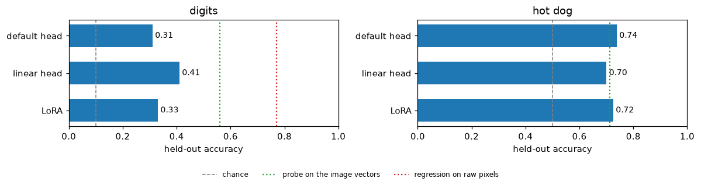

On neither task does LoRA beat the best head on the frozen encoder, and
the heads train in seconds from cached anchors where LoRA takes minutes.
So the application’s default, a frozen encoder with cached anchors, is
the right first thing to try. Which head wins depends on the task: the
linear head by 0.10 on the digits, twice the ±0.05 of a single accuracy,
and the default head by 0.04 on the photos, within it. The probe shows
how much the image vectors hold: on the digits more than any model reads
from the anchors, on the photos about what the heads reach.

## One more setting: the image size

`image_side` sets how many patches the encoder gets. At 32 pixels a
patch, a side of 224 gives 7 patches along it and 448 gives 14. The runs
above used 224 for the digits and 384 for the photos, the sizes of the
earlier runs in the multimodal notebook. Both heads train in seconds
from cached anchors, so a sweep over sizes is cheap. The encoder caches
the anchors afresh for every size, since the cache key includes the
transform:

``` python
sweep = {"digits": (train, test, (56, 84, 112, 140, 168, 224, 448)), "hot dog": (htrain, htest, (96, 128, 160, 224, 320, 384, 512))}
t0, sizes = time.time(), {}
for task, (tr, te, sides) in sweep.items():
    for side in sides:
        row = {}
        for head in ("linear", None):
            torch.manual_seed(0)
            l = quiet(decision_learner(TypedDecisions.from_records(tr, valid=te, calib=0.2), "Hcompany/NeoMME-260M", train="head",
                                       head=head, image_side=side))
            if head == "linear": l.fit_linear()
            else: l.fit_one_cycle(30, lr=1e-3)
            row["linear head" if head else "default head"] = round(l.validate()["accuracy"], 3)
            _, h, w, n = row_image(l)
            del l; release()
        sizes[(task, side)] = {"patches (first row)": f"{h} × {w}", "tokens per row": n, **row}
sizes = pd.DataFrame(sizes).T
print(f"{2 * len(sizes)} learners in {time.time() - t0:.0f} s")
sizes
```

    28 learners in 153 s

<div>
<style scoped>
    .dataframe tbody tr th:only-of-type {
        vertical-align: middle;
    }
&#10;    .dataframe tbody tr th {
        vertical-align: top;
    }
&#10;    .dataframe thead th {
        text-align: right;
    }
</style>

<table class="dataframe" data-quarto-postprocess="true" data-border="1">
<thead>
<tr style="text-align: right;">
<th data-quarto-table-cell-role="th"></th>
<th data-quarto-table-cell-role="th"></th>
<th data-quarto-table-cell-role="th">patches (first row)</th>
<th data-quarto-table-cell-role="th">tokens per row</th>
<th data-quarto-table-cell-role="th">linear head</th>
<th data-quarto-table-cell-role="th">default head</th>
</tr>
</thead>
<tbody>
<tr>
<td rowspan="7" data-quarto-table-cell-role="th"
data-valign="top">digits</td>
<td data-quarto-table-cell-role="th">56</td>
<td>2 × 2</td>
<td>50</td>
<td>0.54</td>
<td>0.57</td>
</tr>
<tr>
<td data-quarto-table-cell-role="th">84</td>
<td>3 × 3</td>
<td>56</td>
<td>0.48</td>
<td>0.48</td>
</tr>
<tr>
<td data-quarto-table-cell-role="th">112</td>
<td>4 × 4</td>
<td>64</td>
<td>0.57</td>
<td>0.35</td>
</tr>
<tr>
<td data-quarto-table-cell-role="th">140</td>
<td>5 × 5</td>
<td>74</td>
<td>0.44</td>
<td>0.37</td>
</tr>
<tr>
<td data-quarto-table-cell-role="th">168</td>
<td>6 × 6</td>
<td>86</td>
<td>0.41</td>
<td>0.32</td>
</tr>
<tr>
<td data-quarto-table-cell-role="th">224</td>
<td>7 × 7</td>
<td>100</td>
<td>0.41</td>
<td>0.31</td>
</tr>
<tr>
<td data-quarto-table-cell-role="th">448</td>
<td>14 × 14</td>
<td>254</td>
<td>0.5</td>
<td>0.35</td>
</tr>
<tr>
<td rowspan="7" data-quarto-table-cell-role="th" data-valign="top">hot
dog</td>
<td data-quarto-table-cell-role="th">96</td>
<td>3 × 2</td>
<td>40</td>
<td>0.6</td>
<td>0.675</td>
</tr>
<tr>
<td data-quarto-table-cell-role="th">128</td>
<td>4 × 3</td>
<td>47</td>
<td>0.662</td>
<td>0.688</td>
</tr>
<tr>
<td data-quarto-table-cell-role="th">160</td>
<td>5 × 4</td>
<td>56</td>
<td>0.713</td>
<td>0.675</td>
</tr>
<tr>
<td data-quarto-table-cell-role="th">224</td>
<td>7 × 5</td>
<td>73</td>
<td>0.775</td>
<td>0.75</td>
</tr>
<tr>
<td data-quarto-table-cell-role="th">320</td>
<td>10 × 7</td>
<td>111</td>
<td>0.675</td>
<td>0.775</td>
</tr>
<tr>
<td data-quarto-table-cell-role="th">384</td>
<td>12 × 8</td>
<td>139</td>
<td>0.7</td>
<td>0.738</td>
</tr>
<tr>
<td data-quarto-table-cell-role="th">512</td>
<td>16 × 11</td>
<td>223</td>
<td>0.762</td>
<td>0.8</td>
</tr>
</tbody>
</table>

</div>

<details class="code-fold">
<summary>figure code</summary>

``` python
fig, axs = plt.subplots(1, 2, figsize=(11, 3))
for ax, (task, used, chance) in zip(axs, (("digits", 224, 0.1), ("hot dog", 384, 0.5))):
    s = sizes.loc[task]
    for col, c in (("linear head", "C0"), ("default head", "C1")): ax.plot(s.index, s[col].astype(float), "o-", color=c, label=col, lw=1.5)
    ax.axvline(used, color="gray", ls=":", lw=1); ax.text(used, 0.03, " used above", color="gray", fontsize=8)
    if task == "hot dog": ax.axvline(224, color="C2", ls=":", lw=1); ax.text(224, 0.1, " the photos' own size", color="C2", fontsize=8)
    ax.axhline(chance, color="gray", ls="--", lw=1)
    ax.set(xscale="log", ylim=(0, 1), xlabel="image_side (pixels, log scale)", ylabel="held-out accuracy", title=task)
    ax.set_xticks(list(s.index)); ax.set_xticklabels([str(v) for v in s.index]); ax.minorticks_off(); ax.legend(frameon=False, fontsize=8)
plt.tight_layout(); plt.show()
```

</details>

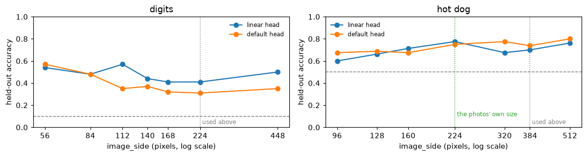

The two tasks respond differently.

- **The digits read best small.** At 56 to 112 pixels (2 × 2 to 4 × 4
  patches) the linear head reaches 0.54 to 0.57, against 0.41 at 224,
  and the default head reaches 0.57 at 56. One reading: NeoMME was
  trained on pages, whose characters are a fraction of a patch, and a
  digit shrunk to 56 pixels is closer to that than one enlarged to 224.
- **The photos lose accuracy below their own 224 pixels** (0.60 to 0.71
  at 96 to 160) and gain nothing clear above it. From 224 to 512 both
  heads stay between 0.68 and 0.80, with no trend.

These sizes were compared on the test split, which flatters the best of
them. Choosing an `image_side` for real takes a validation split of its
own. Here is the linear head at 112 pixels on the same ten test digits
as before:

``` python
torch.manual_seed(0)
small = quiet(decision_learner(TypedDecisions.from_records(train, valid=test, calib=0.2), "Hcompany/NeoMME-260M", train="head",
                               head="linear", image_side=112))
small.fit_linear()
print(metrics(small))
small_answers = small.decider().predict_batch([r["state"] for r in test], q)
show_cards(digit_cards([small_answers[i] for i in firsts], [test[i] for i in firsts]))
del small; release()
```

    {'accuracy': 0.57, 'soft_accuracy': 0.334, 'brier': 0.637, 'ece': 0.188, 'n': 100}

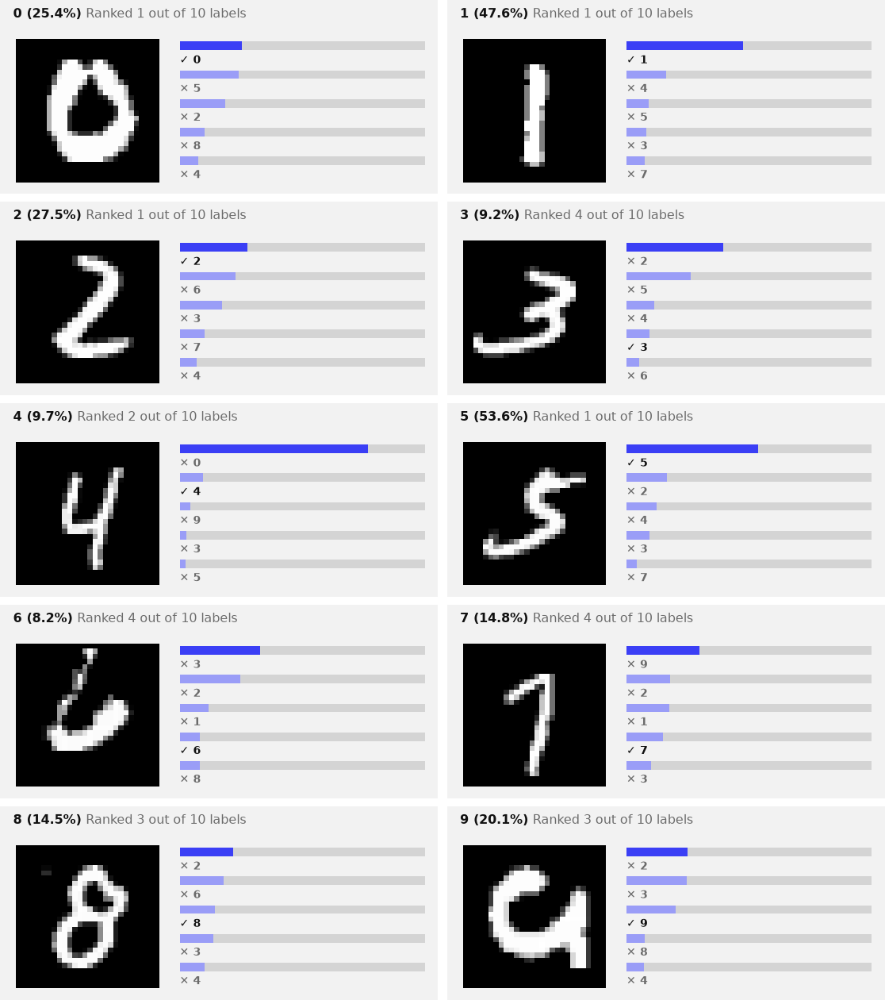

At 112 pixels the linear head gets four of the ten right, the 0, 1, 2
and 5, where the default head at 224 got two. The 9 it read as a 0 is
now its third guess.

## With Kaggle’s photos

The hot-dog task was set on Kaggle’s
[dansbecker/hot-dog-not-hot-dog](https://www.kaggle.com/datasets/dansbecker/hot-dog-not-hot-dog),
which needs a Kaggle account. With one, log in to the Kaggle CLI
(`pip install kaggle`, then `kaggle auth login`), download the dataset,
and point `hotdog_records` at its folder. It looks for a
[`train`](https://sgaseretto.github.io/sysonelib/cli.html#train) folder
that holds one folder per class, named `hotdog` and `not_hotdog`, with
or without underscores between the words:

``` python
# kaggle datasets download dansbecker/hot-dog-not-hot-dog -p hot-dog-not-hot-dog --unzip
htrain, htest = hotdog_records(src="hot-dog-not-hot-dog", dest=data_dir / "hotdog-kaggle")
```

Everything after that runs as above.

``` python
print(f"the whole notebook: {(time.time() - t_start) / 60:.1f} minutes")
```

    the whole notebook: 9.1 minutes
