# ProtST as a decision model: zero-shot, then a head


<!-- WARNING: THIS FILE WAS AUTOGENERATED! DO NOT EDIT! -->

[ProtST](https://arxiv.org/abs/2301.12040) pairs a protein language
model (ESM-1b) with a biomedical text encoder (PubMedBERT), trained so
that a protein and a description of it lie close together in one space.
That’s enough to answer questions about a protein without any training.
Embed the protein, embed each possible answer’s text, and pick the
closest. sysone turns this into a Laya-style decision model. You pass a
protein sequence and typed questions (choices, nouls), and get
calibrated answers back in the Jev schema, with an *act or escalate*
flag once a head has been trained.

This tutorial asks three questions about each protein:

- **location**, a `choice` of ten compartments: *Where in the cell is
  this protein found?* Localization is a standard ProtST benchmark
  (DeepLoc’s ten classes).
- **membrane**, a `noul`: *The protein is bound to a membrane.* True or
  false, for the proteins that DeepLoc also labels as membrane-bound or
  soluble.
- **shortlist**, a `choice` of four: *Which of these compartments is the
  protein found in?* For a third of the proteins, the right compartment
  is not on the list. A decision model should notice that and escalate
  instead of answering. Laya’s act head is trained for exactly this, and
  the last part of the notebook compares it with a simpler rule.

First, ProtST answers all three zero-shot, with a few ways of phrasing
the options. Then a head is trained on ProtST’s frozen towers, on 1,200
proteins, and the two are compared on 600 held-out proteins, first on
their answers and then on when they choose to act. The
[protein](../22_protein.ipynb) notebook explains the pieces: how sysone
loads ProtST without running the repo’s code, the embedders, and the
stream encoder. This one uses them the way a user would.

<div>

> **Running this notebook**
>
> The test suite skips this notebook (`skip_exec`). It downloads
> [MilaDeepGraph/ProtST-ESM1b](https://huggingface.co/MilaDeepGraph/ProtST-ESM1b),
> whose `pytorch_model.bin` is 1.53 GB. sysone reads the tensors with
> `torch.load(weights_only=True)` and never runs the repo’s
> `modeling_protst.py`. The notebook also downloads the ESM-1b and
> PubMedBERT tokenizers and three small datasets,
> [ProtST-SubcellularLocalization](https://huggingface.co/datasets/Jiqing/ProtST-SubcellularLocalization),
> [ProtST-BinaryLocalization](https://huggingface.co/datasets/Jiqing/ProtST-BinaryLocalization)
> and
> [subloc_template](https://huggingface.co/datasets/Jiqing/subloc_template)
> (about 14 MB together). The model card and the dataset cards state no
> licence, so check ProtST’s own repository before using them beyond
> research.
>
> Once the files are downloaded, the whole run takes about 16 minutes on
> an M3 Pro (MPS, float32), and its resident memory peaked at 5.0 GB.
> Free memory on the 18 GB machine never fell below 29%. The outputs
> below come from a run on 2026-09-27, and those of the cells added on
> 2026-09-28 (the tokens, the letters and the baseline, words or
> examples, the head’s worst mistakes and what the head reads) from a
> second run of the whole notebook, which reproduced the first run’s
> other outputs: one probability differs, in its fourth decimal. The
> float32 towers take 3 GB, and ProtST is loaded once and shared by
> everything below. Proteins go through ESM in batches of 8. The
> notebook keeps its feature cache and its export in
> `protein-decisions/`, next to the notebook. It needs the `plots` extra
> (`pip install "sysone[plots]"`), and
> [logomaker](https://logomaker.readthedocs.io) (MIT) for the sequence
> logos, which the first code cell installs.

</div>

<div>

<figure class=''>

<div>

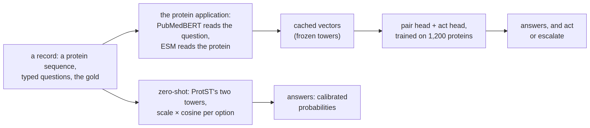

</div>

</figure>

</div>

## Proteins, for machine learners

A protein is a chain of small molecules called amino acids, of twenty
kinds. Write each kind as a letter and a protein becomes a string, like
`MKVAVVLIVVLVVMMIG…`. The cell builds the chain one amino acid at a
time, reading the recipe from a gene, from the chain’s start (the
*N-terminus*) to its end (the *C-terminus*), and sequences are always
written in that order. The chain then folds into a 3D shape, and the
shape does the work: cutting other molecules, carrying signals, opening
pores.

What a protein does also depends on where it is. Think of a cell as a
small city. The **nucleus** is the archive where the DNA is kept, and
**mitochondria** are the power plants. The **endoplasmic reticulum
(ER)** and the **Golgi apparatus** are the factory and the post office:
they fold, finish and ship proteins. **Lysosomes** (vacuoles in plants
and fungi) recycle, **peroxisomes** burn fats and neutralise peroxide,
and **plastids** (chloroplasts, in plants) collect sunlight. The **cell
membrane** is the city wall, with its gates, and some proteins are
shipped out of the city altogether, into the **extracellular space**.
Everything else floats in the **cytoplasm**. Nearly every protein is
made in the cytoplasm, so nearly every protein has to be delivered.

The address is written in the protein itself, as short stretches of
letters that the cell’s sorting machinery reads like a shipping label:

- About 15 to 30 letters at the very start with a greasy (*hydrophobic*)
  core, a **signal peptide**, send a protein into the ER. That is the
  entrance of the secretory route, which leads on to the Golgi, the
  lysosomes, the cell membrane or out of the cell.
- A start rich in positively charged letters (R, K) sends a protein into
  a mitochondrion, and a start rich in S and T into a plastid.
- A few positively charged letters in a row, such as `PKKKRKV`, let it
  into the nucleus, wherever they sit in the chain.
- `SKL` at the very end sends it to a peroxisome.
- A stretch of about 20 greasy letters further along the chain holds it
  in a membrane, like a nail through a wall.

So reading a protein’s location off its sequence is like reading a
parcel’s destination off its label, except that nobody has written down
the label format, and every protein writes it a little differently. That
is a job for a language model. ESM-1b learnt to read protein sequences
the way BERT learnt to read English, by filling in hidden letters, in
about 27 million sequences. A linear model on its attention maps can
even tell which residues touch in the folded protein, though ESM only
ever saw strings. ProtST then trained it next to a frozen biomedical
text model, PubMedBERT, so that each protein and the text that describes
it end up close together.

<div>

> **Jargon**
>
> - **Residue**: one amino acid of a chain. A protein of 420 residues is
>   a string of 420 letters.
> - **N-terminus, C-terminus**: the start and the end of the chain.
> - **Signal peptide, transit peptide**: address labels at the start of
>   a chain, for the secretory route, and for mitochondria or plastids.
> - **Membrane-bound, soluble**: held in a membrane, or free in the
>   watery inside of the cell or of an organelle.
> - **Secreted**: shipped out of the cell. The dataset calls the
>   destination the *extracellular space*.

</div>

### What zero-shot is good for

A zero-shot classifier answers questions nobody trained it for, because
its options are just texts. For proteins that fills a real gap:

- **Most proteins have never been studied.** UniProt, the main protein
  database, holds about 150 million sequences, and curators have
  reviewed about 576,000 of them. For the rest, the sequence is often
  all there is. A zero-shot model gives each one a first guess, with no
  labelled data for the question.
- **A new question needs no new dataset.** A lab that wants to know
  something no dataset labels (a location, a function, a family) can
  write the options as text and ask straight away, before paying for
  labels.
- **Triage.** Experiments take days. Ranking candidate proteins by how
  likely each is to be secreted, or membrane-bound, tells a lab what to
  test first. More than half of drug targets are membrane proteins, so
  *is it in the membrane?* is a question worth asking at scale.
- **Metagenomics.** Sequencing the DNA in seawater or soil turns up
  millions of proteins from organisms nobody has grown in a lab. The ESM
  Metagenomic Atlas holds over 600 million predicted structures of such
  proteins, and a zero-shot model is a cheap first sort.
- **A cold start.** Zero-shot answers can choose which proteins to label
  first. A few hundred labels then train a head, as this notebook does.

The notebook also shows the catch. Zero-shot ProtST is a weak classifier
of location, right 0.418 of the time on ten compartments, less often
than a logistic regression on letter counts trained on 1,200 proteins.
So its answers need a way to say *I’m not sure*, and the last part of
the notebook is about that.

``` python
# The sequence logos below need logomaker (MIT). Everything else comes with sysone's `plots` extra.
import importlib.util, shutil, subprocess, sys
if importlib.util.find_spec("logomaker") is None:        # install it into this kernel's environment, with uv when there is one
    installer = ["uv", "pip", "install", "--python", sys.executable] if shutil.which("uv") else [sys.executable, "-m", "pip", "install"]
    subprocess.run(installer + ["-q", "logomaker"], check=True)
```

``` python
import gc, io, json, logging, resource, sys, time
from pathlib import Path
import numpy as np
import pandas as pd
import torch
import matplotlib.pyplot as plt
from matplotlib.offsetbox import AnchoredOffsetbox, HPacker, TextArea
from matplotlib.patches import Rectangle
from matplotlib_inline.backend_inline import set_matplotlib_formats
from IPython.display import Image as DisplayImage, display
import datasets, huggingface_hub, transformers
from huggingface_hub import hf_hub_download
from transformers.trainer_callback import PrinterCallback, ProgressCallback
from sysone.core import Question, lookup_threshold
from sysone.data import TypedDecisions
from sysone.losses import answer_metrics, coverage_curve
from sysone.template import show_row
from sysone.zeroshot import CachedEmbedder
from sysone.inference import Decider
from sysone.protein import ProteinEmbedder, clean_sequence, decision_learner, load_protst, zero_shot
```

``` python
logging.getLogger("transformers").setLevel(logging.ERROR)
datasets.logging.set_verbosity_error(); huggingface_hub.utils.logging.set_verbosity_error()
datasets.disable_progress_bars(); transformers.utils.logging.disable_progress_bar()
set_matplotlib_formats("png"); plt.rcParams["figure.dpi"] = 110
pd.set_option("display.width", 200); pd.set_option("display.max_columns", 20)
work = Path("protein-decisions")          # the feature cache and the export
t_start = time.time()
device = "cuda" if torch.cuda.is_available() else "mps" if torch.backends.mps.is_available() else "cpu"
print(f"torch {torch.__version__} · transformers {transformers.__version__} · {device}")
```

    torch 2.14.0 · transformers 5.17.0 · mps

Two small helpers. `quiet` takes the Trainer’s printer off the learner,
so it doesn’t print a line of logs every few steps (`learn.recorder`
keeps the numbers). `memory` reports what the process holds: its peak
resident memory, and on MPS what the GPU driver has allocated. The
notebook calls it after each heavy step.

``` python
def quiet(learn):
    "The learner, without the Trainer's per-step log lines in the outputs (`learn.recorder` still has them)"
    for cb in (PrinterCallback, ProgressCallback): learn.trainer.remove_callback(cb)
    return learn

def memory() -> str:
    "The process's peak resident memory, and what the MPS driver holds"
    gc.collect()
    if torch.backends.mps.is_available(): torch.mps.empty_cache()
    rss = resource.getrusage(resource.RUSAGE_SELF).ru_maxrss / (2**30 if sys.platform == "darwin" else 2**20)   # bytes on macOS, KB on Linux
    mps = f" · MPS driver {torch.mps.driver_allocated_memory() / 2**30:.1f} GB" if torch.backends.mps.is_available() else ""
    return f"peak RSS {rss:.1f} GB{mps}"
```

## ProtST, loaded once

[`load_protst`](https://sgaseretto.github.io/sysonelib/protein.html#load_protst)
builds transformers’ own `EsmModel` and `BertModel` from the
checkpoint’s config and fills them with its tensors. The two projection
heads map each tower’s pooled vector into the 512-wide joint space.
Everything below shares this one copy: the zero-shot embedders, the
learner’s stream encoder and its
[`Decider`](https://sgaseretto.github.io/sysonelib/inference.html#decider).

``` python
t0 = time.time()
protst = load_protst(device=device)
print(protst)
print(f"loaded in {time.time() - t0:.0f} s · {memory()}")
```

    ProtST(MilaDeepGraph/ProtST-ESM1b · protein: ESM 33 × 1280 · text: BERT 12 × 768 · joint space 512 · scale 14.2 · 762.9M params · torch.float32 on mps:0)
    loaded in 1 s · peak RSS 4.8 GB · MPS driver 3.0 GB

## The data

The localization dataset gives each protein one of ten compartments,
from DeepLoc, and keeps DeepLoc’s train, validation and test splits. The
template file holds the ten label texts that ProtST’s zero-shot example
uses, and a longer description of each:

``` python
REPO_LOC, REPO_BIN, REPO_TPL = "Jiqing/ProtST-SubcellularLocalization", "Jiqing/ProtST-BinaryLocalization", "Jiqing/subloc_template"
loc = {s: pd.read_parquet(hf_hub_download(REPO_LOC, f"data/{s}-00000-of-00001.parquet", repo_type="dataset")) for s in ("train", "validation", "test")}
binary = pd.concat([pd.read_csv(hf_hub_download(REPO_BIN, f"binary-localization_{s}.csv", repo_type="dataset")) for s in ("train", "validation", "test")],
                   ignore_index=True)
template = pd.read_csv(hf_hub_download(REPO_TPL, "subloc_template.csv", repo_type="dataset"))
print({s: len(d) for s, d in loc.items()}, "proteins ·", len(binary), "with a membrane label")
with pd.option_context("display.max_colwidth", 120): display(template[["name", "description"]])
```

    {'train': 8420, 'validation': 2811, 'test': 2773} proteins · 8662 with a membrane label

<div>
<style scoped>
    .dataframe tbody tr th:only-of-type {
        vertical-align: middle;
    }
&#10;    .dataframe tbody tr th {
        vertical-align: top;
    }
&#10;    .dataframe thead th {
        text-align: right;
    }
</style>

<table class="dataframe" data-quarto-postprocess="true" data-border="1">
<thead>
<tr style="text-align: right;">
<th data-quarto-table-cell-role="th"></th>
<th data-quarto-table-cell-role="th">name</th>
<th data-quarto-table-cell-role="th">description</th>
</tr>
</thead>
<tbody>
<tr>
<td data-quarto-table-cell-role="th">0</td>
<td>SUBCELLULAR LOCATION: Cell membrane.</td>
<td>SUBCELLULAR LOCATION: Apical; apicolateral; basal; basolateral;
lateral; cell membrane; cell projection.</td>
</tr>
<tr>
<td data-quarto-table-cell-role="th">1</td>
<td>SUBCELLULAR LOCATION: Cytoplasm.</td>
<td>SUBCELLULAR LOCATION: Cytoplasm (cytosol and cytoskeleton).</td>
</tr>
<tr>
<td data-quarto-table-cell-role="th">2</td>
<td>SUBCELLULAR LOCATION: Endoplasmic reticulum (ER).</td>
<td>SUBCELLULAR LOCATION: ER membrane and lumen; microsome; rough ER;
smooth ER; Sarcoplasmic reticulum.</td>
</tr>
<tr>
<td data-quarto-table-cell-role="th">3</td>
<td>SUBCELLULAR LOCATION: Golgi apparatus.</td>
<td>SUBCELLULAR LOCATION: Golgi apparatus membrane and lumen.</td>
</tr>
<tr>
<td data-quarto-table-cell-role="th">4</td>
<td>SUBCELLULAR LOCATION: Lysosome/Vacuole.</td>
<td>SUBCELLULAR LOCATION: Contractile; lytic and protein storage
vacuole; vacuole lumen and membrane; lysosome lumen and...</td>
</tr>
<tr>
<td data-quarto-table-cell-role="th">5</td>
<td>SUBCELLULAR LOCATION: Mitochondrion.</td>
<td>SUBCELLULAR LOCATION: Envelope; inner and outer membrane; matrix;
intermembrane space.</td>
</tr>
<tr>
<td data-quarto-table-cell-role="th">6</td>
<td>SUBCELLULAR LOCATION: Nucleus.</td>
<td>SUBCELLULAR LOCATION: Envelope; inner and outer membrane; matrix;
lamina; chromosome; nucleus speckle.</td>
</tr>
<tr>
<td data-quarto-table-cell-role="th">7</td>
<td>SUBCELLULAR LOCATION: Peroxisome.</td>
<td>SUBCELLULAR LOCATION: Peroxisome matrix and membrane.</td>
</tr>
<tr>
<td data-quarto-table-cell-role="th">8</td>
<td>SUBCELLULAR LOCATION: Plastid.</td>
<td>SUBCELLULAR LOCATION: Plastid membrane; stroma and thylakoid.</td>
</tr>
<tr>
<td data-quarto-table-cell-role="th">9</td>
<td>SUBCELLULAR LOCATION: Extracellular.</td>
<td>SUBCELLULAR LOCATION: Extracellular.</td>
</tr>
</tbody>
</table>

</div>

The membrane labels are 0 and 1, and the dataset card doesn’t say which
is which. Every protein in the binary dataset is also in the
localization dataset, so their compartments settle it:

``` python
seq_loc = {clean_sequence(s): y for d in loc.values() for s, y in zip(d.prot_seq, d.localization)}
b = binary.assign(compartment=[template.name[seq_loc[clean_sequence(s)]].removeprefix("SUBCELLULAR LOCATION: ") for s in binary.prot_seq])
pd.crosstab(b.compartment, b.localization).rename(columns={0: "label 0", 1: "label 1"})
```

<div>
<style scoped>
    .dataframe tbody tr th:only-of-type {
        vertical-align: middle;
    }
&#10;    .dataframe tbody tr th {
        vertical-align: top;
    }
&#10;    .dataframe thead th {
        text-align: right;
    }
</style>

<table class="dataframe" data-quarto-postprocess="true" data-border="1">
<thead>
<tr style="text-align: right;">
<th data-quarto-table-cell-role="th">localization</th>
<th data-quarto-table-cell-role="th">label 0</th>
<th data-quarto-table-cell-role="th">label 1</th>
</tr>
<tr>
<th data-quarto-table-cell-role="th">compartment</th>
<th data-quarto-table-cell-role="th"></th>
<th data-quarto-table-cell-role="th"></th>
</tr>
</thead>
<tbody>
<tr>
<td data-quarto-table-cell-role="th">Cell membrane.</td>
<td>1340</td>
<td>0</td>
</tr>
<tr>
<td data-quarto-table-cell-role="th">Cytoplasm.</td>
<td>0</td>
<td>2542</td>
</tr>
<tr>
<td data-quarto-table-cell-role="th">Endoplasmic reticulum (ER).</td>
<td>720</td>
<td>61</td>
</tr>
<tr>
<td data-quarto-table-cell-role="th">Extracellular.</td>
<td>0</td>
<td>1973</td>
</tr>
<tr>
<td data-quarto-table-cell-role="th">Golgi apparatus.</td>
<td>301</td>
<td>2</td>
</tr>
<tr>
<td data-quarto-table-cell-role="th">Lysosome/Vacuole.</td>
<td>243</td>
<td>4</td>
</tr>
<tr>
<td data-quarto-table-cell-role="th">Mitochondrion.</td>
<td>516</td>
<td>233</td>
</tr>
<tr>
<td data-quarto-table-cell-role="th">Nucleus.</td>
<td>122</td>
<td>134</td>
</tr>
<tr>
<td data-quarto-table-cell-role="th">Peroxisome.</td>
<td>48</td>
<td>6</td>
</tr>
<tr>
<td data-quarto-table-cell-role="th">Plastid.</td>
<td>263</td>
<td>154</td>
</tr>
</tbody>
</table>

</div>

Every cell-membrane protein is labelled 0 and every cytoplasmic and
extracellular one is labelled 1, so **0 means membrane-bound** and 1
soluble. Most of the organelles’ proteins are on the membrane-bound
side, and the nucleus splits about evenly (122 to 134). The records
below store the noul’s gold as `True` for label 0. Had the labels been
read the other way round, every membrane result below would have been
inverted without any error to show for it.

Each record holds the protein’s sequence and the three questions. The
location question’s options carry ProtST’s label texts as descriptions.
Where DeepLoc has a membrane label the record asks the membrane noul,
and every record gets a shortlist of four compartments. A third of the
shortlists leave the true compartment out, and their gold is
`{"answerable": False}`. The splits follow the dataset’s: 1,200 proteins
from its train split to train on, 250 and 300 from its validation split
for validation and calibration, and 600 from its test split to score.
DeepLoc made its test split from clusters of similar sequences (at 30%
identity), so no test protein is a close relative of a training protein.

``` python
KEYS = ["cell membrane", "cytoplasm", "endoplasmic reticulum", "Golgi apparatus", "lysosome or vacuole", "mitochondrion",
        "nucleus", "peroxisome", "plastid", "extracellular space"]
NAMES = dict(zip(KEYS, template.name.str.strip()))     # "SUBCELLULAR LOCATION: Nucleus.": ProtST's label texts
DESCRIPTIONS = dict(zip(KEYS, template.description.str.strip()))
SHORT = dict(zip(KEYS, ["membrane", "cytoplasm", "ER", "Golgi", "lysosome", "mitochondrion", "nucleus", "peroxisome", "plastid", "extracellular"]))
MEMBRANE_GOLD = {clean_sequence(s): y == 0 for s, y in zip(binary.prot_seq, binary.localization)}
LOCATION = {"type": "choice", "instructions": "Where in the cell is this protein found?", "criteria": NAMES}
MEMBRANE = {"type": "noul", "instructions": "The protein is bound to a membrane.",
            "criteria": {"false": "a soluble protein", "true": "a membrane protein"}}

def make_records(df, n, seed, split):
    "n proteins of a split as records: the location, the membrane noul where known, and a shortlist that leaves the answer out a third of the time"
    rng, rows = np.random.default_rng(seed), df.sample(n, random_state=seed)
    out = []
    for i, (s, y) in enumerate(zip(rows.prot_seq, rows.localization)):
        seq, gold = clean_sequence(s), KEYS[y]
        qs, g = {"location": LOCATION}, {"location": gold}
        if seq in MEMBRANE_GOLD: qs["membrane"], g["membrane"] = MEMBRANE, MEMBRANE_GOLD[seq]
        answerable = rng.random() >= 1 / 3
        picks = list(rng.choice([k for k in KEYS if k != gold], 3 if answerable else 4, replace=False)) + ([gold] if answerable else [])
        qs["shortlist"] = {"type": "choice", "instructions": "Which of these compartments is the protein found in?",
                           "criteria": {k: NAMES[k] for k in sorted(picks, key=KEYS.index)}}
        g["shortlist"] = gold if answerable else {"answerable": False}
        out.append({"id": f"{split}-{i}", "state": {"sequence": seq}, "questions": qs, "gold": g})
    return out

valid_calib = make_records(loc["validation"], 550, 1, "validation")
train_recs, valid_recs, calib_recs = make_records(loc["train"], 1200, 0, "train"), valid_calib[:250], valid_calib[250:]
test_recs = make_records(loc["test"], 600, 2, "test")
shown = test_recs[0] | {"state": {"sequence": test_recs[0]["state"]["sequence"][:50] + "…"}}
print(json.dumps(shown, indent=1)[:1600])
```

    {
     "id": "test-0",
     "state": {
      "sequence": "MNNARTNAKRRRLSSKQGGLSISEGKESNIPSVVEESKDNLEQASADDRL\u2026"
     },
     "questions": {
      "location": {
       "type": "choice",
       "instructions": "Where in the cell is this protein found?",
       "criteria": {
        "cell membrane": "SUBCELLULAR LOCATION: Cell membrane.",
        "cytoplasm": "SUBCELLULAR LOCATION: Cytoplasm.",
        "endoplasmic reticulum": "SUBCELLULAR LOCATION: Endoplasmic reticulum (ER).",
        "Golgi apparatus": "SUBCELLULAR LOCATION: Golgi apparatus.",
        "lysosome or vacuole": "SUBCELLULAR LOCATION: Lysosome/Vacuole.",
        "mitochondrion": "SUBCELLULAR LOCATION: Mitochondrion.",
        "nucleus": "SUBCELLULAR LOCATION: Nucleus.",
        "peroxisome": "SUBCELLULAR LOCATION: Peroxisome.",
        "plastid": "SUBCELLULAR LOCATION: Plastid.",
        "extracellular space": "SUBCELLULAR LOCATION: Extracellular."
       }
      },
      "shortlist": {
       "type": "choice",
       "instructions": "Which of these compartments is the protein found in?",
       "criteria": {
        "cell membrane": "SUBCELLULAR LOCATION: Cell membrane.",
        "endoplasmic reticulum": "SUBCELLULAR LOCATION: Endoplasmic reticulum (ER).",
        "Golgi apparatus": "SUBCELLULAR LOCATION: Golgi apparatus.",
        "plastid": "SUBCELLULAR LOCATION: Plastid."
       }
      }
     },
     "gold": {
      "location": "nucleus",
      "shortlist": {
       "answerable": false
      }
     }
    }

A record is what a caller passes in. The two towers read tokens. ESM’s
vocabulary has 33 entries: the 20 amino acids, five letters for rare or
unknown ones (X means unknown), and a few special tokens. So every
residue is one token, between a `<cls>` at the start and an `<eos>` at
the end. PubMedBERT reads the question and the option texts as word
pieces, from a vocabulary built from PubMed abstracts:

``` python
ptok, ttok = protst.protein_tokenizer, protst.text_tokenizer
seq = test_recs[0]["state"]["sequence"]
ids = ptok(seq[:12])["input_ids"]
print(f"ESM ({len(ptok)} tokens): the first 12 residues of {test_recs[0]['id']} become {len(ids)} tokens")
print("  ", " ".join(ptok.convert_ids_to_tokens(ids)), "\n  ", ids)
for text in (LOCATION["instructions"], NAMES["nucleus"]):
    ids = ttok(text)["input_ids"]
    print(f"PubMedBERT ({len(ttok):,} word pieces): {text!r} becomes {len(ids)} tokens")
    print("  ", " ".join(ttok.convert_ids_to_tokens(ids)))
```

    ESM (33 tokens): the first 12 residues of test-0 become 14 tokens
       <cls> M N N A R T N A K R R R <eos> 
       [0, 20, 17, 17, 5, 10, 11, 17, 5, 15, 10, 10, 10, 2]
    PubMedBERT (28,895 word pieces): 'Where in the cell is this protein found?' becomes 11 tokens
       [CLS] where in the cell is this protein found ? [SEP]
    PubMedBERT (28,895 word pieces): 'SUBCELLULAR LOCATION: Nucleus.' becomes 7 tokens
       [CLS] subcellular location : nucleus . [SEP]

One letter, one token: to ESM a protein is a long sentence in a small
vocabulary. The median protein here is a sentence of about 420 tokens,
and ESM-1b reads at most 1,024 (1,022 residues and the two special
tokens). When a protein is longer, sysone’s protein stream cuts residues
from the middle (`crop="ends"`), as DeepLoc did, rather than from the
end, since many addresses sit at the ends. PubMedBERT’s vocabulary was
built from biomedical text, so it keeps words like *subcellular* whole.

``` python
def split_summary(recs):
    "How many proteins, membrane nouls and unanswerable shortlists a split holds, and its commonest compartment's share"
    gold = pd.Series([r["gold"]["location"] for r in recs])
    return {"proteins": len(recs), "membrane nouls": sum("membrane" in r["questions"] for r in recs),
            "unanswerable shortlists": sum(isinstance(r["gold"]["shortlist"], dict) for r in recs),
            "median length": int(np.median([len(r["state"]["sequence"]) for r in recs])),
            "commonest": f"{gold.value_counts().index[0]} ({gold.value_counts(normalize=True).iloc[0]:.0%})"}

pd.DataFrame({n: split_summary(r) for n, r in [("train", train_recs), ("valid", valid_recs), ("calib", calib_recs), ("test", test_recs)]}).T
```

<div>
<style scoped>
    .dataframe tbody tr th:only-of-type {
        vertical-align: middle;
    }
&#10;    .dataframe tbody tr th {
        vertical-align: top;
    }
&#10;    .dataframe thead th {
        text-align: right;
    }
</style>

<table class="dataframe" data-quarto-postprocess="true" data-border="1">
<thead>
<tr style="text-align: right;">
<th data-quarto-table-cell-role="th"></th>
<th data-quarto-table-cell-role="th">proteins</th>
<th data-quarto-table-cell-role="th">membrane nouls</th>
<th data-quarto-table-cell-role="th">unanswerable shortlists</th>
<th data-quarto-table-cell-role="th">median length</th>
<th data-quarto-table-cell-role="th">commonest</th>
</tr>
</thead>
<tbody>
<tr>
<td data-quarto-table-cell-role="th">train</td>
<td>1200</td>
<td>745</td>
<td>386</td>
<td>420</td>
<td>nucleus (29%)</td>
</tr>
<tr>
<td data-quarto-table-cell-role="th">valid</td>
<td>250</td>
<td>140</td>
<td>80</td>
<td>401</td>
<td>nucleus (32%)</td>
</tr>
<tr>
<td data-quarto-table-cell-role="th">calib</td>
<td>300</td>
<td>188</td>
<td>103</td>
<td>419</td>
<td>nucleus (25%)</td>
</tr>
<tr>
<td data-quarto-table-cell-role="th">test</td>
<td>600</td>
<td>360</td>
<td>198</td>
<td>439</td>
<td>nucleus (30%)</td>
</tr>
</tbody>
</table>

</div>

The nucleus is the commonest compartment in every split, a quarter to a
third of the proteins, so always answering *nucleus* is the bar to beat
on the location question: 0.30 on the test proteins. About three
proteins in five carry the membrane noul, and a third of the shortlists
are unanswerable by construction. The median protein has about 420
residues, and 66 of the 600 test proteins have exactly 1,000. The
dataset cut longer proteins to 1,000 residues before release (DeepLoc,
where they come from, keeps the first and last 500), so none needs
cropping to fit ESM-1b’s 1,022.

The rare compartments are rare indeed: the 1,200 training proteins
include 17 peroxisomal, 24 lysosomal and 27 Golgi proteins, against 346
nuclear ones.

### What a protein looks like

A protein is a string of amino acids, and a few features of it can be
read by eye. The plots below show the Kyte–Doolittle hydropathy of each
protein, the hydrophobicity of its residues averaged over a window of
19. A stretch that stays above 1.6 over the window is long and
hydrophobic enough to cross a membrane as a helix. A short hydrophobic
stretch at the very start is typical of a signal peptide, which sends a
protein into the secretory pathway. These are the kind of features ESM
has learnt to read, among many others that no scale shows.

<details class="code-fold">
<summary>plotting helpers</summary>

``` python
BLUE, LIGHT, TRACK, CARD, INK, GRAY, RED = "#3b3ff5", "#9a9df7", "#d4d4d4", "#f2f2f2", "#111111", "#6b6b6b", "#d62728"
KD = dict(A=1.8, R=-4.5, N=-3.5, D=-3.5, C=2.5, Q=-3.5, E=-3.5, G=-0.4, H=-3.2, I=4.5, L=3.8, K=-3.9, M=1.9, F=2.8,
          P=-1.6, S=-0.8, T=-0.7, W=-0.9, Y=-1.3, V=4.2)

def hydropathy(seq, window=19):
    "Kyte–Doolittle hydropathy, averaged over a sliding window of residues"
    v = np.array([KD.get(a, 0.0) for a in seq])
    return np.convolve(v, np.ones(window) / window, mode="valid") if len(v) >= window else v

def show_figure(fig, dpi=90):
    "Display a figure as PNG and close it"
    buf = io.BytesIO(); fig.savefig(buf, format="png", dpi=dpi); plt.close(fig)
    display(DisplayImage(buf.getvalue(), format="png"))

def _line(ax, x, y, parts, size):
    "Pieces of text in their own weight and colour on one line, its top left corner at (x, y) in axes fraction"
    box = HPacker(children=[TextArea(s, textprops=dict(size=size, **kw)) for s, kw in parts], sep=size * 0.35, pad=0, align="baseline")
    ax.add_artist(AnchoredOffsetbox("upper left", child=box, bbox_to_anchor=(x, y), bbox_transform=ax.transAxes,
                                    frameon=False, pad=0, borderpad=0))

def _profile(ax, seq):
    "A protein's hydropathy profile, the stretches above 1.6 filled"
    h = hydropathy(seq); x = np.arange(len(h)) + 9
    ax.plot(x, h, color=GRAY, lw=0.8); ax.axhline(1.6, color=RED, lw=0.6, ls=":")
    ax.fill_between(x, 1.6, h, where=h > 1.6, color=RED, alpha=0.5, lw=0)
    ax.set_xlim(0, max(len(seq), 20)); ax.set_ylim(-3.5, 3.5); ax.set_yticks([]); ax.tick_params(labelsize=7)
    for s in ("top", "right", "left"): ax.spines[s].set_visible(False)

def _card(sf, seq, gold, probs, top, note=""):
    "One card: the gold compartment's probability and rank, the protein's hydropathy, and the most likely compartments as bars"
    sf.set_facecolor(CARD)
    order = sorted(probs, key=probs.get, reverse=True)
    head = sf.add_axes([0.03, 0.83, 0.94, 0.13]); head.axis("off")
    rank = order.index(gold) + 1 if gold in probs else None
    _line(head, 0, 1, [(f"{gold} ({probs.get(gold, 0):.1%})", dict(weight="bold", color=INK)),
                       (f"ranked {rank} of {len(order)}" if rank else "not an option", dict(color=GRAY)), (note, dict(color=GRAY))], 11)
    ax = sf.add_axes([0.04, 0.16, 0.34, 0.6]); _profile(ax, seq)
    ax.set_xlabel(f"{len(seq)} residues", fontsize=8, color=GRAY)
    bars = sf.add_axes([0.43, 0.06, 0.54, 0.72]); bars.axis("off"); bars.set_xlim(0, 1); bars.set_ylim(0, 1)
    for i, lab in enumerate(order[:top]):
        y, ok = 1 - i / top, lab == gold
        bars.add_patch(Rectangle((0, y - 0.08), 1, 0.055, color=TRACK, lw=0))
        bars.add_patch(Rectangle((0, y - 0.08), max(probs[lab], 0.004), 0.055, color=BLUE if i == 0 else LIGHT, lw=0))
        _line(bars, 0, y - 0.1, [("✓" if ok else "✕", dict(color=INK if ok else GRAY)),
                                 (f"{lab} {probs[lab]:.0%}", dict(weight="bold", color=INK if ok else GRAY))], 10.5)

def show_cards(cards, ncols=2, top=4):
    "Prediction cards in a grid, each a dict of the sequence, the gold compartment and every compartment's probability"
    nrows = -(-len(cards) // ncols)
    fig = plt.figure(figsize=(6.4 * ncols, 2.7 * nrows))
    sfs = np.atleast_1d(fig.subfigures(nrows, ncols, wspace=0.02, hspace=0.05)).ravel()
    for sf, c in zip(sfs, cards): _card(sf, c["seq"], c["gold"], c["probs"], top, c.get("note", ""))
    for sf in sfs[len(cards):]: sf.set_facecolor("white")
    show_figure(fig)

def show_profiles(recs, ncols=3):
    "Hydropathy profiles of a few proteins, each titled with its compartment and membrane label"
    nrows = -(-len(recs) // ncols)
    fig, axs = plt.subplots(nrows, ncols, figsize=(4.2 * ncols, 1.7 * nrows), squeeze=False)
    for ax, r in zip(axs.ravel(), recs):
        _profile(ax, r["state"]["sequence"])
        m = r["gold"].get("membrane"); tag = "" if m is None else " · membrane-bound" if m else " · soluble"
        ax.set_title(f"{r['gold']['location']}{tag} · {len(r['state']['sequence'])} aa", fontsize=9, loc="left")
    for ax in axs.ravel()[len(recs):]: ax.axis("off")
    fig.tight_layout(); show_figure(fig)
```

</details>

``` python
picks = {}
for r in test_recs:
    if r["gold"]["location"] in ("cell membrane", "extracellular space", "nucleus", "mitochondrion", "endoplasmic reticulum", "cytoplasm"):
        picks.setdefault(r["gold"]["location"], r)
card_recs = list(picks.values())
show_profiles(card_recs)
```

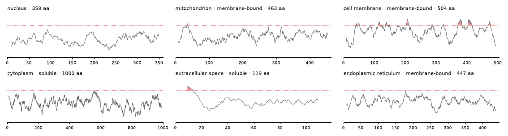

The cell-membrane protein rises above 1.6 again and again along its
length (up to 2.6), where its transmembrane helices would be. The
secreted protein is hydrophobic only at its very start
(*MKVAVVLIVVLVVMMIG…*), where its signal peptide sits. Hydropathy is
only a hint, though. The ER protein is labelled membrane-bound but never
reaches 1.6, and the mitochondrial one crosses it only briefly, near
residue 35. A model has to read more than hydrophobicity to place these.

<details class="code-fold">
<summary>sequence strips</summary>

``` python
GROUPS = {"hydrophobic": ("AVLIMFWC", "#f2c14e"), "polar": ("STNQY", "#8cc084"), "positive": ("KRH", "#9a9df7"),
          "negative": ("DE", "#f28b82"), "G and P": ("GP", "#cfcfcf")}
AA_COLOR = {a: color for letters, color in GROUPS.values() for a in letters}

def show_strips(recs, n=60):
    "The first `n` residues of each record's protein, a tile per residue coloured by its chemistry, under a key of the groups"
    fig = plt.figure(figsize=(12, 0.42 * len(recs) + 0.9))
    ax = fig.add_axes([0.14, 0.02, 0.85, 0.96]); ax.set_xlim(0, n); ax.set_ylim(len(recs) + 1.5, -0.1); ax.axis("off")
    x = 0
    for name, (letters, color) in GROUPS.items():
        for a in letters:
            ax.add_patch(Rectangle((x, 0.1), 0.92, 0.8, color=color, lw=0))
            ax.text(x + 0.46, 0.5, a, ha="center", va="center", fontsize=8, family="monospace", weight="bold"); x += 1
        ax.text(x + 0.2, 0.5, name, va="center", fontsize=8.5, color=GRAY); x += 1.4 + 0.42 * len(name)
    for i, r in enumerate(recs):
        y, s = i + 1.4, r["state"]["sequence"]
        ax.text(-0.8, y + 0.4, r["gold"]["location"], ha="right", va="center", fontsize=9)
        for j, a in enumerate(s[:n]):
            ax.add_patch(Rectangle((j, y), 0.92, 0.8, color=AA_COLOR.get(a, TRACK), lw=0))
            ax.text(j + 0.46, y + 0.4, a, ha="center", va="center", fontsize=7, family="monospace")
    show_figure(fig)

show_strips(card_recs)
```

</details>

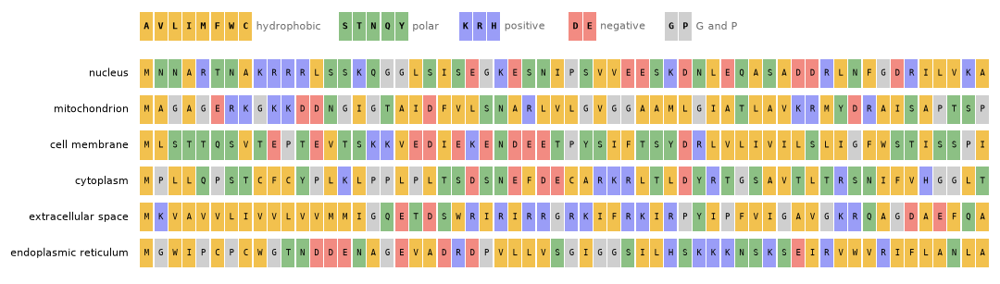

The same six proteins as letters, the first 60 of each. The colours
group the letters roughly by chemistry: greasy, polar, positive,
negative, and the two odd ones: G, which lets the chain bend easily, and
P, which kinks it. The secreted protein’s signal peptide is the run of
greasy letters at its start (`MKVAVVLIVVLVVMMIG`). The nuclear protein
has `KRRR` at positions 9 to 12, a cluster of positive charges of the
kind nuclear import signals are made of. The mitochondrial protein shows
why reading by eye doesn’t go far: its start mixes positive charges
(`RKGKK`) with negative ones (`DD`), which a textbook mitochondrial
signal would lack. Many proteins don’t follow the textbook.

### The letters of each compartment

One protein at a time only shows examples. Averaging over the 8,420
proteins of DeepLoc’s train split shows the patterns. The left panel
compares each compartment’s mix of letters with the mix over all
proteins. A letter at twice its usual share scores +1 (a log₂ ratio),
and one at half its usual share −1. The right panels follow two numbers
along the first 60 positions of the chain, averaged over each
compartment’s proteins: the hydropathy, and the net charge (+1 for K and
R, −1 for D and E).

<details class="code-fold">
<summary>letters by compartment</summary>

``` python
AA = "IVLFCMAWGPTSYHNQDEKR"          # from the most hydrophobic to the most charged, as the Kyte–Doolittle scale orders them
dl = loc["train"].assign(seq=loc["train"].prot_seq.map(clean_sequence), comp=loc["train"].localization.map(KEYS.__getitem__))
shares = np.stack([[s.count(a) / len(s) for a in AA] for s in dl.seq])
enrich = pd.DataFrame({k: np.log2(shares[dl.comp.values == k].mean(0) / shares.mean(0)) for k in KEYS}, index=list(AA)).T

def along(seqs, f, n=60, smooth=5):
    "The mean of f(residue) at each of the first n positions, over the sequences, smoothed over `smooth` positions"
    M = np.full((len(seqs), n), np.nan)
    for i, s in enumerate(seqs): M[i, :min(n, len(s))] = [f(a) for a in s[:n]]
    return pd.Series(np.nanmean(M, 0)).rolling(smooth, center=True, min_periods=1).mean().values

charge = lambda a: 1.0 if a in "KR" else -1.0 if a in "DE" else 0.0
fig = plt.figure(figsize=(12.5, 4.3))
ax = fig.add_axes([0.1, 0.13, 0.4, 0.8])
im = ax.imshow(enrich.values, cmap="RdBu_r", vmin=-0.8, vmax=0.8, aspect="auto")
ax.set_xticks(range(len(AA)), list(AA), family="monospace", fontsize=9); ax.set_yticks(range(len(KEYS)), [SHORT[k] for k in KEYS], fontsize=9)
for t, a in zip(ax.get_xticklabels(), AA): t.set_color({"#f2c14e": "#b07d00", "#8cc084": "#2e7d32", "#9a9df7": BLUE, "#f28b82": RED}.get(AA_COLOR[a], GRAY))
for i in range(len(KEYS)):
    for j in range(len(AA)):
        if abs(enrich.values[i, j]) >= 0.4: ax.text(j, i, f"{enrich.values[i, j]:+.1f}", ha="center", va="center", fontsize=6.5, color="white" if abs(enrich.values[i, j]) > 0.7 else INK)
ax.set_title("each compartment's letters, log₂ share against all proteins", fontsize=9.5, loc="left")
fig.colorbar(im, ax=ax, fraction=0.035, pad=0.02)
SHOWN = {"extracellular space": RED, "mitochondrion": BLUE, "nucleus": INK}
for k, (axis, f, title) in enumerate(((fig.add_axes([0.62, 0.6, 0.3, 0.33]), lambda a: KD.get(a, 0.0), "hydropathy, position by position"),
                                      (fig.add_axes([0.62, 0.13, 0.3, 0.33]), charge, "net charge, position by position"))):
    for comp in sorted(KEYS, key=lambda c: c in SHOWN):
        y = along(dl.seq[dl.comp == comp].tolist(), f)
        axis.plot(range(1, 61), y, color=SHOWN.get(comp, TRACK), lw=1.6 if comp in SHOWN else 0.9, label=SHORT[comp] if comp in SHOWN else None)
    axis.set_title(title, fontsize=9.5, loc="left"); axis.set_xlim(1, 60); axis.tick_params(labelsize=8)
    for s in ("top", "right"): axis.spines[s].set_visible(False)
axis.set_xlabel("position from the start of the chain (the other compartments in grey)", fontsize=8.5)
fig.axes[2].legend(frameon=False, fontsize=8, loc="upper right")
show_figure(fig)
```

</details>

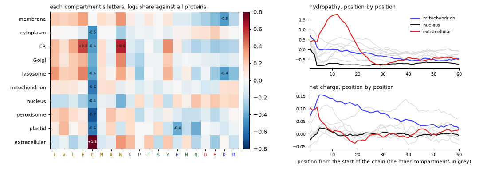

Each compartment has its own mix of letters. The column that stands out
is cysteine (C): secreted proteins carry 2.5 times its usual share.
Outside the cell, pairs of cysteines lock a protein’s fold with
disulfide bonds, which rarely survive the reducing inside of the cell.
Membrane proteins and the proteins of the secretory route (ER, Golgi,
lysosome) are rich in greasy letters (I, L, F, W) and poor in charged
ones (D, E, K, R). Nuclear proteins lean the other way, towards charged
letters and S, P and Q, though that is a tendency, not a rule.

The start of the chain carries more. Secreted proteins average a
hydropathy near 1.8 around position 10, in red: their signal peptides.
Some grey lines rise there too, less: the ER, Golgi and lysosomal
proteins, which enter the same route. Mitochondrial proteins, in blue,
stay positively charged over their first 30 or so positions, their
presequences. Nuclear proteins, in black, show neither. These are
averages over hundreds of proteins, and a single protein may not follow
its compartment’s pattern, as the mitochondrial protein above didn’t.

A sequence logo shows the labels themselves, position by position. At
each position the letters are stacked, each as tall as its share there,
and the stack is as tall as the position is informative: its information
in bits against the letters’ usual mix, where 0 means nothing special.
It’s the standard picture of a sequence motif, and
[logomaker](https://logomaker.readthedocs.io) draws it from the
sequences. The first two logos skip position 1, since nearly every
protein starts with M:

``` python
import logomaker
LOGO_COLOR = {**dict.fromkeys("AVLIMFWC", "#c98f00"), **dict.fromkeys("STNQY", "#2e7d32"), **dict.fromkeys("KRH", BLUE),
              **dict.fromkeys("DE", RED), **dict.fromkeys("GP", GRAY)}
usual = pd.Series(list("".join(dl.seq))).value_counts(normalize=True).reindex(list(AA)).fillna(0).values   # the letters' mix over all proteins

def logo(ax, seqs, start, end, title):
    "A sequence logo of the residues [start:end] of each sequence, in bits against the letters' usual mix"
    window = [s[start:end] for s in seqs if len(s) >= 40 and set(s[start:end]) <= set(AA)]
    counts = logomaker.alignment_to_matrix(window).reindex(columns=list(AA), fill_value=0)
    bits = logomaker.transform_matrix(counts, from_type="counts", to_type="information", background=usual)
    bits.index = range(start + 1, end + 1) if start >= 0 else range(start, 0)
    logomaker.Logo(bits, ax=ax, color_scheme=LOGO_COLOR, vpad=0.05, width=0.85)
    ax.set_title(f"{title} ({len(window):,} proteins)", fontsize=9.5, loc="left"); ax.set_ylabel("bits", fontsize=8)
    for s in ("top", "right"): ax.spines[s].set_visible(False)

fig, axs = plt.subplots(3, 1, figsize=(10, 6.6))
logo(axs[0], dl.seq[dl.comp == "extracellular space"], 1, 31, "secreted proteins, positions 2 to 31")
logo(axs[1], dl.seq[dl.comp == "mitochondrion"], 1, 31, "mitochondrial proteins, positions 2 to 31")
logo(axs[2], dl.seq[dl.comp == "peroxisome"], -12, None, "peroxisomal proteins, the last 12 positions")
fig.tight_layout(); show_figure(fig)
```

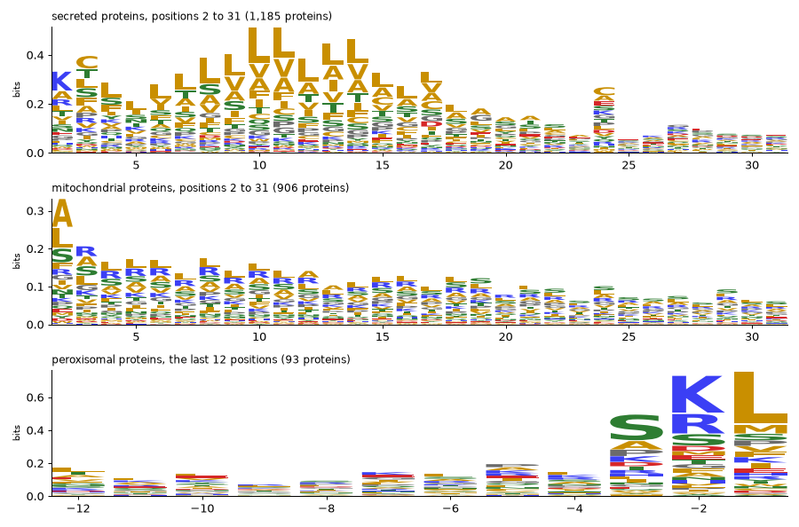

The logos show the labels themselves. Many secreted proteins start with
a positive charge (K or R at position 2). Then comes the greasy core of
the signal peptide, mostly L, V, A and F, from about position 7 to 17,
and small letters (A, C) near position 24, around where the signal
peptide is cut off once the protein is inside the ER. Mitochondrial
proteins are rich in R over their first 20 positions, with little D or
E. And peroxisomal proteins end in S–K–L, or a variant of it (A for S, R
for K, M for L): the peroxisome’s address, three letters long. Not every
peroxisomal protein carries it. 25 of the dataset’s 154 end in exactly
SKL and 11 more in AKL, and a few use a second signal near their start
instead.

### A baseline that counts letters

Letter counts carry signal, so how far do they go? It’s a good habit to
fit the simplest model that could work before any deep learning, so that
every later number has something to be compared with. Here that’s a
logistic regression, one linear layer and a softmax, on the shares of
the 20 letters, fitted on the 1,200 training proteins by LBFGS and
scored on the 600 test proteins. A second version adds the letter shares
of the first 50 and the last 50 residues, where most labels sit:

``` python
def letter_shares(seq, ends=False):
    "The share of each of the 20 letters in the protein, and with `ends` in its first and last 50 residues too"
    return np.concatenate([[p.count(a) / len(p) for a in AA] for p in ([seq, seq[:50], seq[-50:]] if ends else [seq])])

def logistic_regression(X, y, Xt, weight_decay=1e-3):
    "A linear layer and a softmax on standardised features, fitted by LBFGS (the problem is convex): the classes it picks for Xt"
    torch.manual_seed(0)
    mu, sd = X.mean(0), X.std(0) + 1e-6
    X, Xt = (torch.tensor((a - mu) / sd, dtype=torch.float32) for a in (X, Xt))
    lin, y = torch.nn.Linear(X.shape[1], len(KEYS)), torch.tensor(y)
    opt = torch.optim.LBFGS(lin.parameters(), max_iter=500, line_search_fn="strong_wolfe")
    def closure():
        opt.zero_grad(); loss = torch.nn.functional.cross_entropy(lin(X), y) + weight_decay * lin.weight.pow(2).sum(); loss.backward()
        return loss
    opt.step(closure)
    with torch.no_grad(): return lin(Xt).argmax(1).numpy()

def macro_f1(pred, gold):
    return np.mean([2 * ((pred == c) & (gold == c)).sum() / max((pred == c).sum() + (gold == c).sum(), 1) for c in range(len(KEYS))])

y_train, y_test = (np.array([KEYS.index(r["gold"]["location"]) for r in recs]) for recs in (train_recs, test_recs))
baseline = {}
for name, ends in (("letter shares", False), ("letter shares, whole and ends", True)):
    X, Xt = (np.stack([letter_shares(r["state"]["sequence"], ends) for r in recs]) for recs in (train_recs, test_recs))
    pred = logistic_regression(X, y_train, Xt)
    baseline[name] = {"features": X.shape[1], "accuracy": round((pred == y_test).mean(), 3), "macro_f1": round(macro_f1(pred, y_test), 3)}
pd.DataFrame(baseline).T.astype({"features": int})
```

<div>
<style scoped>
    .dataframe tbody tr th:only-of-type {
        vertical-align: middle;
    }
&#10;    .dataframe tbody tr th {
        vertical-align: top;
    }
&#10;    .dataframe thead th {
        text-align: right;
    }
</style>

<table class="dataframe" data-quarto-postprocess="true" data-border="1">
<thead>
<tr style="text-align: right;">
<th data-quarto-table-cell-role="th"></th>
<th data-quarto-table-cell-role="th">features</th>
<th data-quarto-table-cell-role="th">accuracy</th>
<th data-quarto-table-cell-role="th">macro_f1</th>
</tr>
</thead>
<tbody>
<tr>
<td data-quarto-table-cell-role="th">letter shares</td>
<td>20</td>
<td>0.462</td>
<td>0.345</td>
</tr>
<tr>
<td data-quarto-table-cell-role="th">letter shares, whole and ends</td>
<td>60</td>
<td>0.497</td>
<td>0.367</td>
</tr>
</tbody>
</table>

</div>

Letter counts alone reach 0.462 (macro-F1 0.345), against 0.300 for
always answering *nucleus*, and adding the letters of the two ends lifts
that to 0.497 (0.367). With 600 test proteins an accuracy is known to
about ±0.02, so the ends’ 0.035 is suggestive rather than proven. Keep
these numbers in mind for what follows. They are what 1,200 labelled
proteins buy with 20 or 60 hand-made features and a linear model, and a
model with 650 million weights has to beat them to earn its cost.

## Zero-shot

Zero-shot works like a matching game. In pretraining, ProtST saw about
550,000 proteins from Swiss-Prot, each with the text of its database
entry: its name, its function, its location, its family. It trained ESM
to pull each protein’s vector towards its own text’s vector, and away
from the other texts’ vectors, with the text model frozen. That is the
recipe CLIP uses for images and their captions. To ask it something it
was never trained for, write each option as a text, and see which text’s
vector points most nearly the same way as the protein’s. For a protein
vector *p* and option texts *t*<sub>*i*</sub>:

*P*(option *i*) = softmax<sub>*i*</sub>(14.2 ⋅ cos (*p*, *t*<sub>*i*</sub>) / *T*)

where 14.2 is ProtST’s learnt logit scale, and *T* a temperature fitted
on labelled proteins, one per question type and option count (see the
jargon box below).

`zero_shot(protst, prompt)` is a
[`SimilarityDecider`](https://sgaseretto.github.io/sysonelib/zeroshot.html#similaritydecider)
over ProtST’s two towers. It embeds the protein with ESM, then each
option’s text with PubMedBERT, and an option’s logit is ProtST’s logit
scale (14.2) times the cosine between the two. The prompt decides the
option texts. `{text}` is an option’s description (for the location
question, ProtST’s label text) and `{key}` is its name.

Every prompt embeds the same proteins, so they share one protein
embedder behind a
[`CachedEmbedder`](https://sgaseretto.github.io/sysonelib/zeroshot.html#cachedembedder).
Each protein goes through ESM once, and each prompt only embeds its ten
option texts. The calibration and test proteins are embedded first, in
length order, so that each batch of 8 is mostly residues rather than
padding.

``` python
proteins = CachedEmbedder(ProteinEmbedder(protst, max_len=1024, batch_size=8))
t0 = time.time()
seqs = sorted({r["state"]["sequence"] for r in calib_recs + test_recs}, key=len)
for i in range(0, len(seqs), 150): proteins(seqs[i:i + 150])
print(f"{len(seqs)} proteins embedded in {time.time() - t0:.0f} s ({(time.time() - t0) / len(seqs) * 1000:.0f} ms each) · {memory()}")
```

    900 proteins embedded in 203 s (226 ms each) · peak RSS 4.8 GB · MPS driver 3.0 GB

The helpers below take a decider and records, and score one question at
a time. `only` keeps the questions asked, optionally with other option
texts. `answer_all` answers every record, and `scores` gives the
accuracy, the macro-F1 (the mean over the classes of each class’s F1,
which a model can’t raise by favouring the common classes), the Brier
score and the expected calibration error (ECE) for each question.

<div>

> **Jargon: calibration**
>
> A model is **calibrated** when its probabilities mean what they say:
> of the answers it gives at 70%, about 70% are right. **Temperature
> scaling** divides the logits by one number *T*, fitted on held-out
> proteins. *T* \> 1 softens overconfident probabilities and *T* \< 1
> sharpens timid ones, and the order of the options never changes. The
> **Brier score** is the squared distance between the probability vector
> and the one-hot truth, so 0 is perfect. The **ECE** sorts the answers
> into bins by their confidence, and averages the gap between confidence
> and accuracy over the bins, weighted by their sizes.

</div>

``` python
def only(recs, *qids, criteria=None):
    "The records with only the questions `qids` and their gold; `criteria` replaces a question's option texts"
    out = []
    for r in recs:
        qs = {q: r["questions"][q] | ({"criteria": criteria[q]} if criteria and q in criteria else {}) for q in qids if q in r["questions"]}
        if qs: out.append(r | {"questions": qs, "gold": {q: r["gold"][q] for q in qs}})
    return out

def answer_all(model, recs):
    "Every record's answers, one `predict` per record"
    return [model.predict(r["state"], r["questions"]) for r in recs]

def scores(recs, answers, qids=("location", "membrane", "shortlist")):
    "Accuracy, macro-F1, Brier and ECE per question, over the rows whose gold is among the options"
    out = {}
    for qid in qids:
        trip = [({qid: r["questions"][qid]}, a, {qid: r["gold"][qid]}) for r, a in zip(recs, answers) if qid in r["questions"] and qid in a]
        m = answer_metrics(trip) if trip else None
        if m and m["n"]: out[qid] = {k: round(m[k], 3) for k in ("accuracy", "macro_f1", "brier", "ece")} | {"n": m["n"]}
    return pd.DataFrame(out).T.astype({"n": int})
```

Four ways to write the location question’s options. ProtST’s label texts
are the port’s own zero-shot choice (*SUBCELLULAR LOCATION: Nucleus.*).
The compartment names alone and a plain sentence test how much that
wording matters. The descriptions are the template’s longer texts
(*SUBCELLULAR LOCATION: Envelope; inner and outer membrane; matrix; …*).
Each decider is calibrated on the 300 calibration proteins, which fits
one temperature per question type and option count (and, with
`act_accuracy=0.9`, the thresholds used in [the last
part](#acting-or-escalating)), then scored on the 600 test proteins:

``` python
PROMPTS = {"ProtST's label texts": ("{text}", None), "compartment names": ("{key}", None),
           "a sentence": ("A protein located in the {key}.", None), "the descriptions": ("{text}", {"location": DESCRIPTIONS})}
zs_scores, zs_answers, deciders = {}, {}, {}
for name, (prompt, crit) in PROMPTS.items():
    zs = zero_shot(protst, prompt=prompt, proteins=proteins)
    zs.calibrate(only(calib_recs, "location", criteria=crit), act_accuracy=0.9)
    test_q = only(test_recs, "location", criteria=crit)
    zs_answers[name] = answer_all(zs, test_q); deciders[name] = zs
    zs_scores[name] = dict(scores(test_q, zs_answers[name]).loc["location"]) | {"temperature": round(zs.temperatures.get("choice", 1.0), 2)}
zs_table = pd.DataFrame(zs_scores).T.astype({"n": int})
gold_counts = pd.Series([r["gold"]["location"] for r in test_recs]).value_counts(normalize=True)
print(f"majority class (nucleus) on the test proteins: accuracy {gold_counts.iloc[0]:.3f} · average over the four prompts: "
      f"accuracy {zs_table.accuracy.mean():.3f}, macro-F1 {zs_table.macro_f1.mean():.3f}")
zs_table
```

    majority class (nucleus) on the test proteins: accuracy 0.300 · average over the four prompts: accuracy 0.334, macro-F1 0.284

<div>
<style scoped>
    .dataframe tbody tr th:only-of-type {
        vertical-align: middle;
    }
&#10;    .dataframe tbody tr th {
        vertical-align: top;
    }
&#10;    .dataframe thead th {
        text-align: right;
    }
</style>

<table class="dataframe" data-quarto-postprocess="true" data-border="1">
<thead>
<tr style="text-align: right;">
<th data-quarto-table-cell-role="th"></th>
<th data-quarto-table-cell-role="th">accuracy</th>
<th data-quarto-table-cell-role="th">macro_f1</th>
<th data-quarto-table-cell-role="th">brier</th>
<th data-quarto-table-cell-role="th">ece</th>
<th data-quarto-table-cell-role="th">n</th>
<th data-quarto-table-cell-role="th">temperature</th>
</tr>
</thead>
<tbody>
<tr>
<td data-quarto-table-cell-role="th">ProtST's label texts</td>
<td>0.418</td>
<td>0.348</td>
<td>0.716</td>
<td>0.067</td>
<td>600</td>
<td>0.85</td>
</tr>
<tr>
<td data-quarto-table-cell-role="th">compartment names</td>
<td>0.270</td>
<td>0.235</td>
<td>0.841</td>
<td>0.033</td>
<td>600</td>
<td>2.18</td>
</tr>
<tr>
<td data-quarto-table-cell-role="th">a sentence</td>
<td>0.345</td>
<td>0.286</td>
<td>0.809</td>
<td>0.087</td>
<td>600</td>
<td>1.40</td>
</tr>
<tr>
<td data-quarto-table-cell-role="th">the descriptions</td>
<td>0.305</td>
<td>0.269</td>
<td>0.816</td>
<td>0.030</td>
<td>600</td>
<td>1.33</td>
</tr>
</tbody>
</table>

</div>

ProtST’s own label texts are by far the best way to write the options:
0.418 accuracy and 0.348 macro-F1, against 0.300 for always answering
*nucleus*, though still short of the letter-count baseline’s 0.462,
which needed 1,200 labelled proteins where zero-shot needs none. The
ProtST paper reports 43.5% for this model, zero-shot on the same task.
Every other phrasing lands near the majority baseline. The compartment
names alone reach 0.270, a sentence 0.345 and the long descriptions
0.305. The label texts are the Swiss-Prot lines ProtST read in training
(*SUBCELLULAR LOCATION: …*), so its text tower places them where the
proteins are. The descriptions have a problem of their own. The
mitochondrion’s never names the mitochondrion (*Envelope; inner and
outer membrane; matrix; intermembrane space*), and it shares its first
three items with the nucleus’s.

The calibration differs with the phrasing too. The label texts’ logits
needed sharpening (a temperature of 0.85) and the bare names’ flattening
(2.18). The ECE is low for every prompt (0.03 to 0.09), which only says
that the probabilities are honest about being unsure. It says nothing
about being right.

Before looking, a guess from the biology above: which compartments
should be easy, and which should be confused with each other? Where do
the zero-shot answers go? The confusion matrix of the best prompt, each
row a gold compartment and normalised to 1:

<details class="code-fold">
<summary>confusion matrix</summary>

``` python
def confusion(recs, answers, qid="location"):
    "Row-normalised confusion matrix over the location compartments"
    m = np.zeros((len(KEYS), len(KEYS)))
    for r, a in zip(recs, answers): m[KEYS.index(r["gold"][qid]), KEYS.index(a[qid]["choice"])] += 1
    return m / np.clip(m.sum(1, keepdims=True), 1, None), m.sum(1)

def plot_confusions(pairs):
    "Confusion matrices side by side, one per (title, recs, answers)"
    fig, axs = plt.subplots(1, len(pairs), figsize=(5.6 * len(pairs), 5), squeeze=False)
    for ax, (title, recs, answers) in zip(axs[0], pairs):
        m, n = confusion(recs, answers)
        ax.imshow(m, cmap="Blues", vmin=0, vmax=1)
        for i in range(len(KEYS)):
            for j in range(len(KEYS)):
                if m[i, j] >= 0.1: ax.text(j, i, f"{m[i, j]:.1f}".lstrip("0"), ha="center", va="center", fontsize=7, color="white" if m[i, j] > 0.5 else INK)
        ax.set_xticks(range(len(KEYS)), [SHORT[k] for k in KEYS], rotation=60, ha="right", fontsize=8)
        ax.set_yticks(range(len(KEYS)), [f"{k} ({int(c)})" for k, c in zip(KEYS, n)], fontsize=8)
        ax.set_xlabel("answer", fontsize=9); ax.set_title(title, fontsize=10, loc="left")
    fig.tight_layout(); show_figure(fig)

best_prompt = zs_table.macro_f1.idxmax()
plot_confusions([(f"zero-shot, {best_prompt}", only(test_recs, "location", criteria=PROMPTS[best_prompt][1]), zs_answers[best_prompt])])
```

</details>

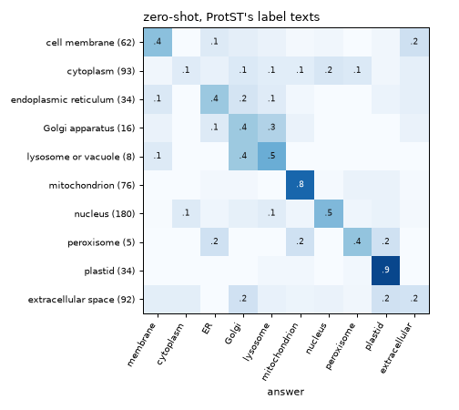

Zero-shot ProtST is good where a protein carries a targeting signal its
training texts describe. It places 0.8 of the mitochondrial proteins and
0.9 of the plastid ones, both imported through an N-terminal transit
peptide. It is poor on the two commonest compartments after the nucleus.
It finds 0.1 of the cytoplasmic proteins, scattering the rest over six
other compartments, and 0.2 of the secreted ones, sending as many to the
Golgi and to plastids. The nucleus sits in between at 0.5. The ER, the
Golgi and the lysosome are confused with each other, which fits: their
proteins travel the same secretory route.

### The membrane noul and the shortlist

A noul has two option texts, one per side:
`criteria={"false": …, "true": …}`. Three phrasings are tried. The first
is two plain descriptions. The second is two Swiss-Prot-style location
lines (what ProtST read in training). The third gives the noul no
criteria at all, so the statement is compared with its negation, *It is
not the case that the protein is bound to a membrane.*:

``` python
NOULS = {"plain descriptions": {"false": "a soluble protein", "true": "a membrane protein"},
         "Swiss-Prot lines": {"false": "SUBCELLULAR LOCATION: Cytoplasm. Secreted.", "true": "SUBCELLULAR LOCATION: Membrane; Multi-pass membrane protein."},
         "the statement and its negation": None}
def noul_records(recs, crit):
    "The records' membrane nouls with these two option texts (None: no criteria, so the statement is weighed against its negation)"
    q = {k: v for k, v in MEMBRANE.items() if k != "criteria"} | ({"criteria": crit} if crit else {})
    return [r | {"questions": {"membrane": q}} for r in only(recs, "membrane")]

noul_scores = {}
for name, crit in NOULS.items():
    zs = zero_shot(protst, proteins=proteins)
    zs.calibrate(noul_records(calib_recs, crit))
    test_m = noul_records(test_recs, crit)
    noul_scores[name] = dict(scores(test_m, answer_all(zs, test_m)).loc["membrane"]) | {"temperature": round(zs.temperatures.get("noul", 1.0), 2)}
membrane_share = np.mean([r["gold"]["membrane"] for r in only(test_recs, "membrane")])
print(f"membrane-bound share of the test nouls: {membrane_share:.3f} (always answering 'soluble' scores {1 - membrane_share:.3f})")
pd.DataFrame(noul_scores).T.astype({"n": int})
```

    membrane-bound share of the test nouls: 0.422 (always answering 'soluble' scores 0.578)

<div>
<style scoped>
    .dataframe tbody tr th:only-of-type {
        vertical-align: middle;
    }
&#10;    .dataframe tbody tr th {
        vertical-align: top;
    }
&#10;    .dataframe thead th {
        text-align: right;
    }
</style>

<table class="dataframe" data-quarto-postprocess="true" data-border="1">
<thead>
<tr style="text-align: right;">
<th data-quarto-table-cell-role="th"></th>
<th data-quarto-table-cell-role="th">accuracy</th>
<th data-quarto-table-cell-role="th">macro_f1</th>
<th data-quarto-table-cell-role="th">brier</th>
<th data-quarto-table-cell-role="th">ece</th>
<th data-quarto-table-cell-role="th">n</th>
<th data-quarto-table-cell-role="th">temperature</th>
</tr>
</thead>
<tbody>
<tr>
<td data-quarto-table-cell-role="th">plain descriptions</td>
<td>0.633</td>
<td>0.633</td>
<td>0.459</td>
<td>0.059</td>
<td>360</td>
<td>3.58</td>
</tr>
<tr>
<td data-quarto-table-cell-role="th">Swiss-Prot lines</td>
<td>0.758</td>
<td>0.755</td>
<td>0.312</td>
<td>0.078</td>
<td>360</td>
<td>1.08</td>
</tr>
<tr>
<td data-quarto-table-cell-role="th">the statement and its negation</td>
<td>0.536</td>
<td>0.536</td>
<td>0.507</td>
<td>0.055</td>
<td>360</td>
<td>5.00</td>
</tr>
</tbody>
</table>

</div>

The Swiss-Prot lines win again: 0.758 accuracy against 0.578 for always
answering *soluble*, with a temperature near 1 (1.08), so their logits
were about right as they were. Plain descriptions reach 0.633 and needed
their logits flattened (3.58). The statement against its negation is
barely better than a coin (0.536), and its temperature hits sysone’s
upper bound of 5. The text tower hardly tells *The protein is bound to a
membrane.* from *It is not the case that the protein is bound to a
membrane.*, which is what the
[zeroshot](../11_zeroshot.ipynb#two-towers-similarity) notebook warns
about for two-tower models.

The shortlist question asks for the right compartment among four, and a
third of the time none of the four is right. A zero-shot decider has no
way to say so: it always answers. Its only signal is its own confidence,
its top probability. The next cell scores the answerable shortlists
(with ProtST’s label texts), and then shows how that confidence splits
the answerable questions from the unanswerable ones:

``` python
zs_short = zero_shot(protst, proteins=proteins)
zs_short.calibrate(only(calib_recs, "shortlist"), act_accuracy=0.9)
test_s = only(test_recs, "shortlist")
zs_short_answers = answer_all(zs_short, test_s)
answerable = np.array([not isinstance(r["gold"]["shortlist"], dict) for r in test_s])
zs_conf = np.array([a["shortlist"]["answer_confidence"] for a in zs_short_answers])
print(scores(test_s, zs_short_answers).to_string())
print(f"mean top probability: {zs_conf[answerable].mean():.3f} when the answer is on the list, {zs_conf[~answerable].mean():.3f} when it isn't")
```

               accuracy  macro_f1  brier    ece    n
    shortlist     0.604     0.493  0.506  0.087  402
    mean top probability: 0.572 when the answer is on the list, 0.517 when it isn't

On the answerable shortlists, zero-shot is right 0.604 of the time,
against 0.25 for a guess among four. Its confidence barely moves when
the right answer is missing, though. Its top probability averages 0.572
when the answer is on the list and 0.517 when it isn’t, too close for a
threshold to tell the two apart, as [the last
part](#acting-or-escalating) confirms.

Six test proteins as prediction cards, each with its hydropathy profile
and the zero-shot probabilities of its most likely compartments:

``` python
zs_best = deciders[best_prompt]
def cards_for(model, recs, criteria=None, note=None):
    "A card per record: its sequence, gold compartment and the model's location probabilities"
    out = []
    for r in only(recs, "location", criteria=criteria):
        a = model.predict(r["state"], r["questions"])["location"]
        out.append({"seq": r["state"]["sequence"], "gold": r["gold"]["location"], "probs": a["probabilities"], "note": note(a) if note else ""})
    return out
show_cards(cards_for(zs_best, card_recs, criteria=PROMPTS[best_prompt][1]))
```

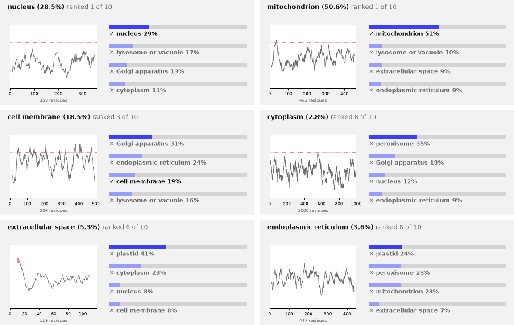

``` python
print("the zero-shot answer to the location question for the first card's protein:")
print(json.dumps(zs_best.predict(card_recs[0]["state"], {"location": LOCATION}), indent=1))
```

    the zero-shot answer to the location question for the first card's protein:
    {
     "location": {
      "type": "choice",
      "choice": "nucleus",
      "probabilities": {
       "cell membrane": 0.0464,
       "cytoplasm": 0.1139,
       "endoplasmic reticulum": 0.1,
       "Golgi apparatus": 0.1304,
       "lysosome or vacuole": 0.1707,
       "mitochondrion": 0.0653,
       "nucleus": 0.2854,
       "peroxisome": 0.0667,
       "plastid": 0.0114,
       "extracellular space": 0.0099
      },
      "confidence": 0.1312,
      "answer_confidence": 0.2854,
      "action": {
       "act_probability": 0.2854,
       "act": false
      }
     }
    }

Two of the six are right, the nuclear and the mitochondrial protein, and
the probabilities are low throughout. The top option passes 50% only
once, which suits a model that is right about four times in ten. The
secreted protein shows the failure from the confusion matrix: its
N-terminal signal peptide is the textbook mark of secretion, yet the
answer is *plastid* at 41%. The JSON is the answer as a caller gets it.
The decider was calibrated with `act_accuracy=0.9`, so it also says
whether to act (`action`). At 28% it doesn’t.

### Words or examples?

Zero-shot describes each compartment in words: the vector of
*SUBCELLULAR LOCATION: Nucleus.* stands for the nucleus. The other way
to describe a compartment is by examples. Average the vectors of the
calibration proteins found in the nucleus, and use that average, a
*prototype*, in place of the text. A protein then gets the compartment
whose prototype points most nearly its way. Nothing is trained, and the
calibration proteins are already embedded:

``` python
from sysone.protein import TextEmbedder
calib_by = {k: [r["state"]["sequence"] for r in calib_recs if r["gold"]["location"] == k] for k in KEYS}
unit = lambda X: X / np.linalg.norm(X, axis=-1, keepdims=True)
prototypes = unit(np.stack([proteins(calib_by[k]).mean(0) for k in KEYS]))       # one vector per compartment: its calibration proteins' mean
words = TextEmbedder(protst)([NAMES[k] for k in KEYS])                           # zero-shot's ten vectors, ProtST's label texts
P_test = proteins([r["state"]["sequence"] for r in test_recs])                   # unit vectors, from the embedder's memo
for name, V in (("words: ProtST's label texts", words), ("examples: prototypes of the calibration proteins", prototypes)):
    print(f"{name:48} accuracy {((P_test @ V.T).argmax(1) == y_test).mean():.3f}")
print("calibration proteins per compartment:", {SHORT[k]: len(v) for k, v in calib_by.items()})
pairs = (words @ words.T)[np.triu_indices(len(KEYS), 1)]
print(f"cosine between two label texts: {pairs.min():.2f} to {pairs.max():.2f} · a test protein's cosine to its own label text: "
      f"{np.mean(np.sum(P_test * words[y_test], 1)):.2f} on average, to its own prototype: {np.mean(np.sum(P_test * prototypes[y_test], 1)):.2f}")
```

    words: ProtST's label texts                      accuracy 0.418
    examples: prototypes of the calibration proteins accuracy 0.760
    calibration proteins per compartment: {'membrane': 27, 'cytoplasm': 64, 'ER': 17, 'Golgi': 8, 'lysosome': 6, 'mitochondrion': 41, 'nucleus': 76, 'peroxisome': 4, 'plastid': 13, 'extracellular': 44}
    cosine between two label texts: 0.52 to 0.90 · a test protein's cosine to its own label text: 0.13 on average, to its own prototype: 0.49

<details class="code-fold">
<summary>the map</summary>

``` python
centre = P_test.mean(0)
_, _, Vt = np.linalg.svd(P_test - centre, full_matrices=False)
flat = lambda V: (V - centre) @ Vt[:2].T                  # onto the two directions along which the test proteins vary most
fig, ax = plt.subplots(figsize=(8.5, 6.2))
colors = plt.get_cmap("tab10").colors
for c, k in enumerate(KEYS):
    xy = flat(P_test[y_test == c]); ax.scatter(xy[:, 0], xy[:, 1], s=9, color=colors[c], alpha=0.45, lw=0, label=SHORT[k])
for V, marker, size, edge in ((prototypes, "X", 150, "white"), (words, "*", 230, INK)):
    xy = flat(V)
    for c, k in enumerate(KEYS):
        ax.scatter(*xy[c], s=size, marker=marker, color=colors[c], edgecolor=edge, lw=1, zorder=3)
        ax.annotate(SHORT[k], xy[c], xytext=(5, 4), textcoords="offset points", fontsize=7.5, color=INK if marker == "X" else GRAY)
ax.legend(frameon=False, fontsize=7.5, markerscale=1.6, loc="upper left", bbox_to_anchor=(1.0, 1.0))
ax.set_title("the test proteins (dots), the prototypes (×) and the label texts (★), flattened by PCA", fontsize=9.5, loc="left")
ax.set_xticks([]); ax.set_yticks([])
fig.tight_layout(); show_figure(fig)
```

</details>

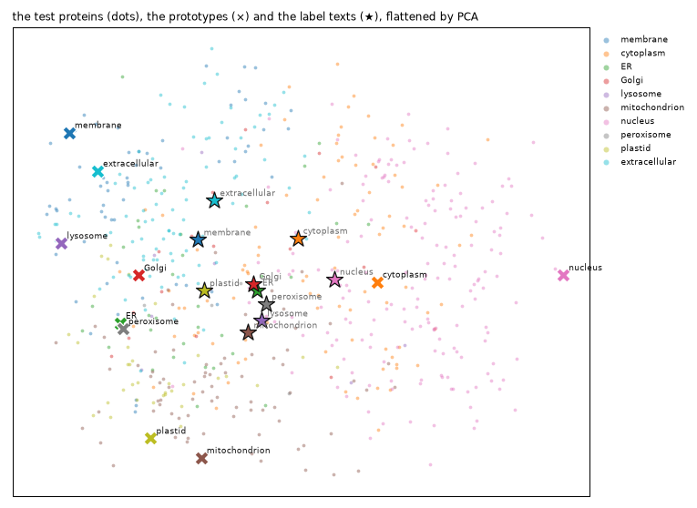

Examples beat words by a wide margin: 0.760 against 0.418, from 300
labelled proteins and no training at all. The head trained below on
1,200 proteins reaches 0.828, so most of what it will know is already in
ProtST’s frozen vectors. The map shows why the words fall short. It
flattens the 512-dimensional vectors onto the two directions along which
the test proteins vary most. Each compartment’s proteins gather in a
region of their own, nuclear proteins on the right, secreted and
membrane proteins on the left, mitochondrial and plastid proteins at the
bottom, and each prototype (×) sits among its own. The ten label texts
(★) crowd together near the middle. They share most of their words, so
their vectors point nearly the same way (cosines of 0.52 to 0.90 between
them), and a test protein’s cosine with its own label text averages
0.13, against 0.49 with its own prototype. Zero-shot has to decide on
small differences between ten similar vectors, while the prototypes sit
apart, out where the proteins are. A map of 512 dimensions in two hides
a lot, but the cosines say the same.

That is the idea behind training a head, too: compare the protein with
each option, but learn the comparison from labelled examples instead of
fixing it in advance.

## Training a head

The protein application,
[`sysone.protein.decision_learner`](https://sgaseretto.github.io/sysonelib/protein.html#decision_learner),
keeps both towers frozen. PubMedBERT reads a text row per question (the
question, and an anchor before each option), and ESM reads the protein
as a side stream. A pair head scores each option’s anchor against the
protein’s vector. `act=True` adds Laya’s act head. It reads the row’s
first position, the protein’s vector, and four numbers about the option
probabilities, and it learns whether answering would be right. That
covers questions whose right answer isn’t an option, like the
unanswerable shortlists.

The towers are frozen, so the learner encodes every row once and caches
the vectors (float32, on disk). Each protein goes through ESM once,
however many questions ask about it. This is the slow step of the
notebook. After it, training runs on the cached vectors in seconds. The
learner reuses the loaded ProtST, so no second copy is made.

A text row, as PubMedBERT reads it:

``` python
data = TypedDecisions(train_recs, valid_recs, calib_recs)
torch.manual_seed(0)
learn = quiet(decision_learner(data, protst, act=True, preset="macbook", loss="soft_ce", cache_dir=work / "cache",
                               calibrate_after_fit=False, per_device_train_batch_size=32))
print(show_row(data.builder.build_record(train_recs[0])[-1], data.builder.tok, max_chars=500))
print(learn)          # printed, not displayed: IPython's output cache would keep the learner, and ProtST, alive
```

    [CLS] choice question : which of these compartments is the protein found in? [SEP] [MASK] endoplasmic reticulum : subcellular location : endoplasmic reticulum ( er ). [MASK] golgi apparatus : subcellular location : golgi apparatus. [MASK] plastid : subcellular location : plastid. [MASK] extracellular space : subcellular location : extracellular. [SEP]×2
    markers [15, 28, 38, 46] · qtype choice · 57 tokens · protein 275 tokens
    Learner(MilaDeepGraph/ProtST-ESM1b · regime head · head 0 layers/pair · cache masks · loss soft_ce · 858,627 of 762,762,648 params train)

``` python
t0 = time.time()
for split in ("train", "valid", "calib"): learn.dataset(split)
n_rows = sum(len(learn.dataset(s)) for s in ("train", "valid", "calib"))
print(f"{n_rows} rows of {len(train_recs) + len(valid_recs) + len(calib_recs)} proteins encoded in {time.time() - t0:.0f} s · {memory()}")
```

    4573 rows of 1750 proteins encoded in 410 s · peak RSS 4.8 GB · MPS driver 3.0 GB

The head trains for 4 epochs on the cached vectors, with a learning rate
warmed up and then annealed. A first run trained for 12: its validation
loss was lowest after the third epoch and then rose, while the training
loss went to zero. `calibrate` then fits the temperatures on the
calibration proteins, and the act thresholds, one per question type and
option count: the lowest act probability at which the answers acted on
there are still 90% right.

``` python
t0 = time.time()
learn.fit_one_cycle(4, lr=1e-3)
learn.calibrate(act_accuracy=0.9)
head_rule = dict(learn.act_threshold)
print(f"trained and calibrated in {time.time() - t0:.0f} s · temperatures {learn.temperatures}")
print("act-head thresholds:", {k: round(v, 3) for k, v in head_rule.items()})
```

    trained and calibrated in 11 s · temperatures {'choice': 1.5685, 'choice:3-5': 1.6028, 'choice:6-10': 1.5578, 'noul': 1.4716, 'noul:2': 1.4716}
    act-head thresholds: {'all': 0.932, 'choice': 0.93, 'noul': 0.942, 'choice:3-5': 0.879, 'choice:6-10': 0.93, 'noul:2': 0.942}

<details class="code-fold">
<summary>training curves</summary>

``` python
ms, tr = learn.recorder.metrics, learn.recorder.losses
ep = [m["epoch"] for m in ms]; x = np.linspace(ep[-1] / len(tr), ep[-1], len(tr))
fig, (a, b) = plt.subplots(1, 2, figsize=(10, 2.8))
a.plot(x, tr, color="gray", lw=1, label="training rows"); a.plot(ep, [m["loss"] for m in ms], color="C0", lw=1.5, label="validation rows")
a.set(xlabel="epoch", ylabel="loss (soft CE + act)"); a.legend(frameon=False)
b.plot(ep, [m["accuracy"] for m in ms], color="C0", lw=1.5, label="accuracy"); b.plot(ep, [m["act_auroc"] for m in ms], color="C1", lw=1.5, label="act AUROC")
b.set(xlabel="epoch", ylim=(0, 1)); b.legend(frameon=False)
fig.tight_layout(); show_figure(fig)
```

</details>

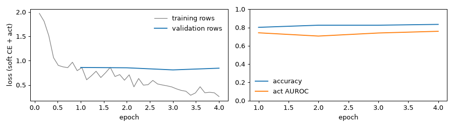

The validation loss stays flat around 0.85 while the training loss keeps
falling, and validation accuracy climbs from 0.80 to 0.83. The act
head’s AUROC stays near 0.75 throughout, meaning it separates the
answers worth acting on from the rest, but not by much. The first,
12-epoch run showed where more training leads: the validation loss rose
from its low at epoch 3 to 1.5, the fitted temperatures grew to about 3
to undo the head’s overconfidence, and its accuracy on the test
proteins’ location question was 0.790, against this run’s 0.828.

## Zero-shot or a head?

The learner’s `decider()` answers the test records the way its export
would, with the act head’s verdict in each answer (`action`). The
zero-shot rows use the best prompt for the location question, ProtST’s
label texts for the shortlist, and the best phrasing for the noul:

``` python
jev = learn.decider()                    # the act head's rule, as calibrated
t0 = time.time()
head_answers = answer_all(jev, test_recs)
print(f"{len(test_recs)} proteins answered in {time.time() - t0:.0f} s · {memory()}")
print(json.dumps(head_answers[0], indent=1)[:1200])
```

    600 proteins answered in 162 s · peak RSS 4.8 GB · MPS driver 3.1 GB
    {
     "location": {
      "type": "choice",
      "choice": "nucleus",
      "probabilities": {
       "cell membrane": 0.0003,
       "cytoplasm": 0.0405,
       "endoplasmic reticulum": 0.0009,
       "Golgi apparatus": 0.0009,
       "lysosome or vacuole": 0.0001,
       "mitochondrion": 0.0035,
       "nucleus": 0.9509,
       "peroxisome": 0.0024,
       "plastid": 0.0004,
       "extracellular space": 0.0002
      },
      "confidence": 0.899,
      "answer_confidence": 0.9509,
      "action": {
       "act_probability": 0.9742,
       "act": true
      }
     },
     "shortlist": {
      "type": "choice",
      "choice": "endoplasmic reticulum",
      "probabilities": {
       "cell membrane": 0.2416,
       "endoplasmic reticulum": 0.2827,
       "Golgi apparatus": 0.2189,
       "plastid": 0.2568
      },
      "confidence": 0.0031,
      "answer_confidence": 0.2827,
      "action": {
       "act_probability": 0.7393,
       "act": false
      }
     }
    }

``` python
best_noul = max(noul_scores, key=lambda k: noul_scores[k]["accuracy"])
zs_noul = zero_shot(protst, proteins=proteins)
zs_noul.calibrate(noul_records(calib_recs, NOULS[best_noul]), act_accuracy=0.9)
test_m = noul_records(test_recs, NOULS[best_noul])
zs_noul_answers = answer_all(zs_noul, test_m)
zs_rows = {"location": scores(only(test_recs, "location", criteria=PROMPTS[best_prompt][1]), zs_answers[best_prompt]).loc["location"],
           "membrane": scores(test_m, zs_noul_answers).loc["membrane"],
           "shortlist": scores(test_s, zs_short_answers).loc["shortlist"]}
head_rows = scores(test_recs, head_answers)
comparison = pd.concat({"zero-shot": pd.DataFrame(zs_rows).T, "head": head_rows}, axis=1).swaplevel(0, 1, axis=1)
comparison[[(m, w) for m in ("accuracy", "macro_f1", "brier", "ece") for w in ("zero-shot", "head")]]
```

<div>
<style scoped>
    .dataframe tbody tr th:only-of-type {
        vertical-align: middle;
    }
&#10;    .dataframe tbody tr th {
        vertical-align: top;
    }
&#10;    .dataframe thead tr th {
        text-align: left;
    }
</style>

<table class="dataframe" data-quarto-postprocess="true" data-border="1">
<thead>
<tr>
<th data-quarto-table-cell-role="th"></th>
<th colspan="2" data-quarto-table-cell-role="th"
data-halign="left">accuracy</th>
<th colspan="2" data-quarto-table-cell-role="th"
data-halign="left">macro_f1</th>
<th colspan="2" data-quarto-table-cell-role="th"
data-halign="left">brier</th>
<th colspan="2" data-quarto-table-cell-role="th"
data-halign="left">ece</th>
</tr>
<tr>
<th data-quarto-table-cell-role="th"></th>
<th data-quarto-table-cell-role="th">zero-shot</th>
<th data-quarto-table-cell-role="th">head</th>
<th data-quarto-table-cell-role="th">zero-shot</th>
<th data-quarto-table-cell-role="th">head</th>
<th data-quarto-table-cell-role="th">zero-shot</th>
<th data-quarto-table-cell-role="th">head</th>
<th data-quarto-table-cell-role="th">zero-shot</th>
<th data-quarto-table-cell-role="th">head</th>
</tr>
</thead>
<tbody>
<tr>
<td data-quarto-table-cell-role="th">location</td>
<td>0.418</td>
<td>0.828</td>
<td>0.348</td>
<td>0.631</td>
<td>0.716</td>
<td>0.267</td>
<td>0.067</td>
<td>0.033</td>
</tr>
<tr>
<td data-quarto-table-cell-role="th">membrane</td>
<td>0.758</td>
<td>0.906</td>
<td>0.755</td>
<td>0.904</td>
<td>0.312</td>
<td>0.140</td>
<td>0.078</td>
<td>0.031</td>
</tr>
<tr>
<td data-quarto-table-cell-role="th">shortlist</td>
<td>0.604</td>
<td>0.896</td>
<td>0.493</td>
<td>0.726</td>
<td>0.506</td>
<td>0.164</td>
<td>0.087</td>
<td>0.029</td>
</tr>
</tbody>
</table>

</div>

The head roughly doubles zero-shot’s accuracy on the location question
(0.828 against 0.418), and nearly doubles its macro-F1 (0.631 against
0.348). It gains less on the membrane noul (0.906 against 0.758) and on
the shortlist (0.896 against 0.604). Its probabilities are better
calibrated too, with an ECE of about 0.03 on every question. That’s what
1,200 labelled proteins buy with the towers frozen, in 11 seconds of
training and calibration on cached vectors. On the location question the
head’s macro-F1 trails its accuracy by 0.2, a sign that it is weaker on
the rare compartments. The next plot shows it.

Recall per compartment, the share of each compartment’s proteins
answered right, for the best zero-shot prompt and the head:

<details class="code-fold">
<summary>recall per compartment</summary>

``` python
def recall(recs, answers):
    ok = pd.DataFrame({"gold": [r["gold"]["location"] for r in recs], "ok": [a["location"]["choice"] == r["gold"]["location"] for r, a in zip(recs, answers)]})
    return ok.groupby("gold").ok.mean().reindex(KEYS)

rz, rh = recall(test_recs, zs_answers[best_prompt]), recall(test_recs, head_answers)
counts = pd.Series([r["gold"]["location"] for r in test_recs]).value_counts().reindex(KEYS)
fig, ax = plt.subplots(figsize=(8, 4))
y = np.arange(len(KEYS))
ax.barh(y + 0.2, rz, 0.38, color=LIGHT, label=f"zero-shot ({best_prompt})"); ax.barh(y - 0.2, rh, 0.38, color=BLUE, label="head")
ax.set_yticks(y, [f"{k} ({c})" for k, c in zip(KEYS, counts)], fontsize=9); ax.invert_yaxis(); ax.set_xlim(0, 1)
ax.set_xlabel("recall on the test proteins"); ax.legend(frameon=False, loc="lower center", bbox_to_anchor=(0.5, 1.0), ncol=2)
for s in ("top", "right"): ax.spines[s].set_visible(False)
fig.tight_layout(); show_figure(fig)
```

</details>

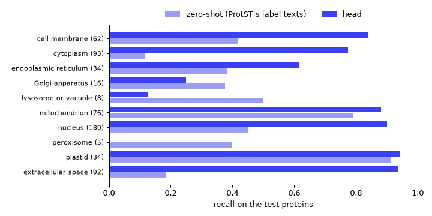

The head’s gains come from the common compartments. It finds 0.78 of the
cytoplasmic proteins where zero-shot found 0.12, 0.94 of the secreted
ones (zero-shot: 0.18) and 0.90 of the nuclear ones (zero-shot: 0.45).
On the three rarest it does worse than zero-shot. It misses all five
peroxisomal proteins (zero-shot found two), finds one lysosomal protein
in eight (zero-shot: four) and four Golgi proteins in sixteen
(zero-shot: six). With 17 to 27 training examples each, those
compartments are too thin for a head trained from scratch, while
zero-shot needs no examples at all. More examples of the rare
compartments, or a loss that weighs them up, would be the next thing to
try.

The same six proteins, now answered by the head. The note gives the act
head’s verdict:

``` python
verdict = lambda a: f"· p(act) {a['action']['act_probability']:.2f}, {'acts' if a['action']['act'] else 'escalates'}"
show_cards(cards_for(jev, card_recs, note=verdict))
```

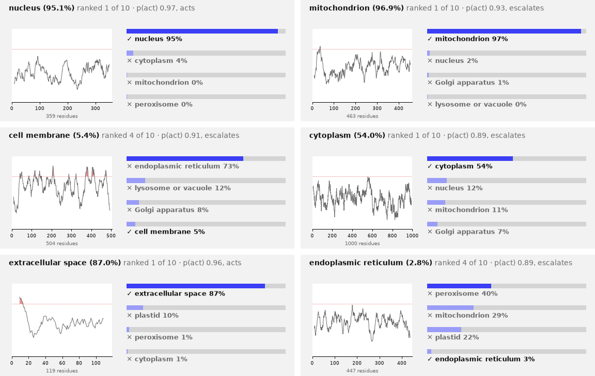

Four of the six are right now, three of them above 85%. The two wrong
ones are the proteins zero-shot also missed, the cell-membrane and the
ER protein, and the act head escalates both. It also escalates the
mitochondrial protein, answered right at 97%, because its p(act) of 0.93
sits just under the threshold for choices of six to ten options (0.930).
p(act) runs high for nearly every answer, so its threshold has little
room to work in.

### The head’s worst mistakes

After training a model, look at the examples it gets most confidently
wrong, its *top losses*. They show what the model can’t see, and
sometimes what’s wrong with the labels. Here are the six test proteins
to whose right compartment the head gave the lowest probability. The
note gives the protein’s id and, where the dataset has it, the membrane
noul’s gold:

``` python
p_gold = np.array([a["location"]["probabilities"][r["gold"]["location"]] for r, a in zip(test_recs, head_answers)])
p_top = np.array([a["location"]["answer_confidence"] for a in head_answers])
wrong = p_gold < p_top
print(f"{wrong.sum()} of {len(test_recs)} location answers are wrong, {(wrong & (p_top > 0.9)).sum()} of them given more than 90%")
membrane = lambda r: {True: " · membrane-bound", False: " · soluble"}.get(r["gold"].get("membrane"), "")
show_cards([{"seq": test_recs[i]["state"]["sequence"], "gold": test_recs[i]["gold"]["location"],
             "probs": head_answers[i]["location"]["probabilities"], "note": f"· {test_recs[i]['id']}{membrane(test_recs[i])}"}
            for i in np.argsort(p_gold)[:6]])
```

    103 of 600 location answers are wrong, 8 of them given more than 90%

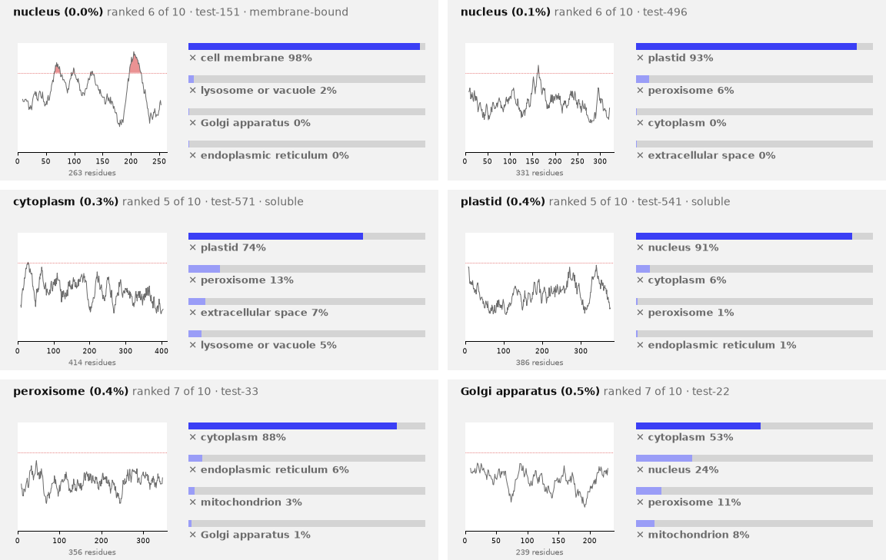

103 of the 600 answers are wrong, 8 of them given more than 90%. The
worst is a nuclear protein that the membrane dataset calls
membrane-bound, and its hydropathy shows why: two stretches rise above
1.6, two helices that cross a membrane. It most likely sits in the
nuclear envelope, the double membrane around the nucleus, and the head
calls it a cell-membrane protein at 98%, the right kind of protein in
the wrong membrane. Two more are the nucleus and the plastid mistaken
for each other, one each way, and a third sends a cytoplasmic protein to
the plastid. The last two belong to the rare compartments the head was
seen to miss above, a peroxisomal and a Golgi protein, both answered
*cytoplasm*.

Some of these may not be mistakes at all. DeepLoc gives each protein one
compartment, but the Human Protein Atlas found about half of human
proteins in more than one, and a protein that works in two places has to
be filed under one of them.

## Acting or escalating

A junior doctor who is right on nine in ten of the cases they take, and
refers the rest to a specialist, is more useful than one who takes every
case and is right on seven in ten. A decision model should likewise say
when it doesn’t know. Laya’s rule is its act head’s p(act) against a
threshold, and the act head is trained on whether answering would have
been right. A simpler rule thresholds the model’s own calibrated top
probability, and it works for any model, a zero-shot one included.
sysone fits either kind of threshold on the calibration proteins, one
per question type and option count, for a target accuracy on the answers
acted on (90% here). `calibrate(act_score="confidence")` switches the
learner to the second rule, and every zero-shot decider above already
fitted its own thresholds with `act_accuracy=0.9`.

Each rule is judged by what it lets through. Sort the test questions by
the score and act on the top share. The curve plots the accuracy of the
answers acted on against that share (the coverage), and a good score
keeps the accuracy high while the coverage grows. An unanswerable
shortlist counts as wrong whenever it is acted on. The dots mark where
each rule’s fitted thresholds land:

``` python
learn.calibrate(act_accuracy=0.9, act_score="confidence")
conf_rule = dict(learn.act_threshold)
print("confidence thresholds:", {k: round(v, 3) for k, v in conf_rule.items()})

def is_right(q, ans, gold) -> bool:
    "Whether acting on an answer is right: the gold is among the options and the answer is the gold"
    if q.answerable(gold) != 1: return False
    return (ans["noul"] >= 0.5) == bool(gold) if q.type == "noul" else ans["choice"] == gold

def question_rows(recs, answers, zero_shot_answers):
    "One row per test question: whether acting is right, and each rule's score and verdict (zero-shot confidence, head confidence, act head)"
    zs = {(r["id"], qid): a[qid] for rs, ans in zero_shot_answers for r, a in zip(rs, ans) for qid in a}
    out = []
    for r, a in zip(recs, answers):
        for qid, ans in a.items():
            q, g, z = Question.from_dict(r["questions"][qid], name=qid), r["gold"][qid], zs[(r["id"], qid)]
            out.append({"qid": qid, "answerable": q.answerable(g) == 1, "right": is_right(q, ans, g), "zs_right": is_right(q, z, g),
                        "p_act": ans["action"]["act_probability"], "acts": ans["action"]["act"],
                        "head_conf": ans["answer_confidence"], "conf_acts": ans["answer_confidence"] >= lookup_threshold(conf_rule, q.qtype, q.k),
                        "zs_conf": z["answer_confidence"], "zs_acts": z["action"]["act"]})
    return pd.DataFrame(out)

acts = question_rows(test_recs, head_answers, [(only(test_recs, "location"), zs_answers[best_prompt]), (test_m, zs_noul_answers),
                                               (test_s, zs_short_answers)])
RULES = {"zero-shot: its top probability": ("zs_conf", "zs_acts", "zs_right", GRAY),
         "head: its top probability": ("head_conf", "conf_acts", "right", BLUE),
         "head: its act head": ("p_act", "acts", "right", "C1")}
fig, axs = plt.subplots(1, 2, figsize=(11, 3.4))
for label, (score, verdict, right, color) in RULES.items():
    cv = coverage_curve(acts[score].values, acts[right].values.astype(float))
    axs[0].plot(cv["coverage"], cv["accuracy"], color=color, lw=1.5, label=label)
    axs[0].plot([acts[verdict].mean()], [acts[right][acts[verdict]].mean()], "o", color=color, ms=6)
axs[0].set(xlabel="coverage (share of questions acted on)", ylabel="accuracy of the acted answers", ylim=(0.3, 1.01)); axs[0].legend(frameon=False, fontsize=8)
sh = acts[acts.qid == "shortlist"]
axs[1].hist([sh.head_conf[sh.answerable], sh.head_conf[~sh.answerable]], bins=20, range=(0, 1), color=[BLUE, RED], label=["answer on the list", "answer not on the list"])
axs[1].axvline(lookup_threshold(conf_rule, "choice", 4), color=INK, ls=":", lw=1)
axs[1].set(xlabel="the head's top probability on the shortlist questions", ylabel="questions"); axs[1].legend(frameon=False, fontsize=8)
fig.tight_layout(); show_figure(fig)

def rule_table(df):
    "Per question and rule: the share acted on, the accuracy when acting, and the share of unanswerable questions acted on"
    out = {}
    for qid, d in df.groupby("qid", sort=False):
        for label, (_, verdict, right, _) in RULES.items():
            a = d[verdict].astype(bool)
            out[(qid, label.split(":")[0] + ", " + label.split(": ")[1].replace("its ", ""))] = {
                "acts on": round(a.mean(), 3), "right when it acts": round(d[right][a].mean(), 3) if a.any() else np.nan,
                "acts on the unanswerable": round(a[~d.answerable].mean(), 3) if (~d.answerable).any() else np.nan}
    return pd.DataFrame(out).T

rule_table(acts)
```

    confidence thresholds: {'all': 0.852, 'choice': 0.907, 'noul': 0.547, 'choice:3-5': 0.974, 'choice:6-10': 0.73, 'noul:2': 0.547}

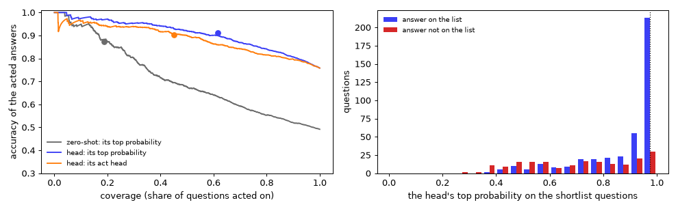

<div>
<style scoped>
    .dataframe tbody tr th:only-of-type {
        vertical-align: middle;
    }
&#10;    .dataframe tbody tr th {
        vertical-align: top;
    }
&#10;    .dataframe thead th {
        text-align: right;
    }
</style>

<table class="dataframe" data-quarto-postprocess="true" data-border="1">
<thead>
<tr style="text-align: right;">
<th data-quarto-table-cell-role="th"></th>
<th data-quarto-table-cell-role="th"></th>
<th data-quarto-table-cell-role="th">acts on</th>
<th data-quarto-table-cell-role="th">right when it acts</th>
<th data-quarto-table-cell-role="th">acts on the unanswerable</th>
</tr>
</thead>
<tbody>
<tr>
<td rowspan="3" data-quarto-table-cell-role="th"
data-valign="top">location</td>
<td data-quarto-table-cell-role="th">zero-shot, top probability</td>
<td>0.030</td>
<td>0.944</td>
<td>NaN</td>
</tr>
<tr>
<td data-quarto-table-cell-role="th">head, top probability</td>
<td>0.703</td>
<td>0.915</td>
<td>NaN</td>
</tr>
<tr>
<td data-quarto-table-cell-role="th">head, act head</td>
<td>0.572</td>
<td>0.910</td>
<td>NaN</td>
</tr>
<tr>
<td rowspan="3" data-quarto-table-cell-role="th"
data-valign="top">shortlist</td>
<td data-quarto-table-cell-role="th">zero-shot, top probability</td>
<td>0.043</td>
<td>1.000</td>
<td>0.000</td>
</tr>
<tr>
<td data-quarto-table-cell-role="th">head, top probability</td>
<td>0.310</td>
<td>0.892</td>
<td>0.091</td>
</tr>
<tr>
<td data-quarto-table-cell-role="th">head, act head</td>
<td>0.028</td>
<td>0.647</td>
<td>0.030</td>
</tr>
<tr>
<td rowspan="3" data-quarto-table-cell-role="th"
data-valign="top">membrane</td>
<td data-quarto-table-cell-role="th">zero-shot, top probability</td>
<td>0.694</td>
<td>0.856</td>
<td>NaN</td>
</tr>
<tr>
<td data-quarto-table-cell-role="th">head, top probability</td>
<td>0.981</td>
<td>0.915</td>
<td>NaN</td>
</tr>
<tr>
<td data-quarto-table-cell-role="th">head, act head</td>
<td>0.958</td>
<td>0.910</td>
<td>NaN</td>
</tr>
</tbody>
</table>

</div>

The head’s own top probability is the better escalation score on every
question. At the 90% target it acts on 70% of the location questions
(0.915 of them right), where the act head acts on 57% (0.910). It acts
on 31% of the shortlists (0.892 right), where the act head acts on 3%,
and gets only 0.647 of those right, well below the target. In the left
plot its curve lies above the act head’s almost everywhere. The
histogram shows why the shortlists are hard. When the right compartment
is on the list, the head usually gives it a top probability near 1. The
unanswerable shortlists spread out lower, but a tail of them still
reaches 0.97. At the fitted threshold (0.974) the head acts on 9% of the
unanswerable shortlists, so about one question in eleven that has no
right answer still gets one. Zero-shot rarely acts: its confidence
seldom reaches its thresholds, so it acts on 3% of the location
questions and 4% of the shortlists, though on 69% of the nouls.

Laya’s act head learns from the rows the option head trains on. On those
rows the option head is right far more often than on new proteins, so
the act head learns that acting is nearly always right, and its p(act)
crowds near 1. Fitting the act head on the calibration rows instead did
not fix it: in a separate test on the same cached vectors, its AUROC on
the validation split was 0.71 to 0.74, against the top probability’s
0.81. So the export below uses `act_score="confidence"`. The act head is
still there for tasks where it earns its place, and `calibrate` fits
either rule per question type and option count.

## The export

`learn.export` writes the head, the two tokenizers and the calibration,
which now holds the confidence rule and its thresholds. ProtST’s towers
didn’t train, so the export refers to the Hub checkpoint by id and by
its source, `protst`, instead of copying 3 GB. The ProtST copy in memory
is released first, since
[`Decider.load`](https://sgaseretto.github.io/sysonelib/inference.html#decider.load)
loads the checkpoint again, through the same tensors-only path:

``` python
out = learn.export(work / "protein-jev")
size = sum(f.stat().st_size for f in out.rglob("*") if f.is_file())
print(f"{out}: {size / 1e6:.1f} MB · encoder {json.loads((out / 'sysone.json').read_text())['encoder']}")
probe = test_recs[5]
before = learn.predict(probe["state"], probe["questions"])          # with the rule the export carries
del jev, learn, deciders, zs, zs_best, zs_noul, zs_short, proteins, protst
print(memory())
```

    protein-decisions/protein-jev: 4.1 MB · encoder {'id': 'MilaDeepGraph/ProtST-ESM1b', 'revision': None, 'source': 'protst', 'hidden_size': 768, 'family': 'protst', 'modality': 'text', 'dtype': 'float32', 'weights': 'hub'}
    peak RSS 4.8 GB · MPS driver 0.0 GB

``` python
t0 = time.time()
loaded = Decider.load(out, device=device)
after = loaded.predict(probe["state"], probe["questions"])
print(f"loaded in {time.time() - t0:.0f} s · same answers: {after == before}")
print(json.dumps({"state": {"sequence": probe["state"]["sequence"][:40] + "…"}, "questions": list(probe["questions"]),
                  "gold": probe["gold"], "answers": after}, indent=1)[:2000])
```

    loaded in 3 s · same answers: True
    {
     "state": {
      "sequence": "MPLLQPSTCFCYPLKLPPLPLTSDSNEFDECARKRLTLDY\u2026"
     },
     "questions": [
      "location",
      "membrane",
      "shortlist"
     ],
     "gold": {
      "location": "cytoplasm",
      "membrane": false,
      "shortlist": "cytoplasm"
     },
     "answers": {
      "location": {
       "type": "choice",
       "choice": "cytoplasm",
       "probabilities": {
        "cell membrane": 0.0203,
        "cytoplasm": 0.5405,
        "endoplasmic reticulum": 0.0653,
        "Golgi apparatus": 0.066,
        "lysosome or vacuole": 0.0399,
        "mitochondrion": 0.1147,
        "nucleus": 0.1229,
        "peroxisome": 0.0275,
        "plastid": 0.0022,
        "extracellular space": 0.0008
       },
       "confidence": 0.3391,
       "answer_confidence": 0.5405,
       "action": {
        "act_probability": 0.5405,
        "act": false
       }
      },
      "membrane": {
       "type": "noul",
       "noul": 0.3594,
       "confidence": 0.6406,
       "answer_confidence": 0.6406,
       "action": {
        "act_probability": 0.6406,
        "act": true
       }
      },
      "shortlist": {
       "type": "choice",
       "choice": "cytoplasm",
       "probabilities": {
        "cytoplasm": 0.826,
        "endoplasmic reticulum": 0.0634,
        "mitochondrion": 0.1067,
        "extracellular space": 0.0038
       },
       "confidence": 0.5725,
       "answer_confidence": 0.826,
       "action": {
        "act_probability": 0.826,
        "act": false
       }
      }
     }
    }

The export is 4.1 MB: the head’s weights, the two tokenizers and
`sysone.json`, which names the encoder by its Hub id and its `protst`
source.
[`Decider.load`](https://sgaseretto.github.io/sysonelib/inference.html#decider.load)
rebuilt ProtST from the Hub checkpoint through the same tensors-only
loader, in 3 seconds from the cache, and gives the same answers as the
learner. Its `action` now follows the confidence rule.
[`act_probability`](https://sgaseretto.github.io/sysonelib/models.html#act_probability)
is the answer’s calibrated top probability, and `act` compares it with
the threshold for its question type and option count. This protein is
cytoplasmic and the head says so, but at 54%, below the 10-way threshold
of 0.73, so it escalates. It acts on the membrane noul, whose threshold
is 0.547, and answers *soluble* at 64%, which is right. It also names
the right compartment on the shortlist, at 83%, but escalates it, since
shortlists need 0.974.

## What the head reads

The primer said that a protein’s address is written in short stretches
of its letters, mostly at its ends. Does the head read them? Biologists
found the addresses by taking a label away, or moving it to another
protein, and seeing where the protein went, work that won Günter Blobel
the 1999 Nobel Prize in Physiology or Medicine. The same two experiments
work on the exported decider.

First, take the label away. For four compartments, 30 test proteins the
head gets right are answered three ways: intact, with the 25 residues
after the first M cut (30 for mitochondria, whose labels are longer),
and with 25 cut from the middle. If the head reads the label at the
start, cutting the start should hurt the secreted and the mitochondrial
proteins more than cutting the middle. The nuclear and the cytoplasmic
proteins are the controls: their labels, if they have any, can sit
anywhere.

``` python
def location_probs(model, seqs, batch=8):
    "The location question's probabilities for many sequences, in batches of similar lengths"
    order, out = sorted(range(len(seqs)), key=lambda i: len(seqs[i])), [None] * len(seqs)
    for b in range(0, len(order), batch):
        idx = order[b:b + batch]
        for i, a in zip(idx, model.predict_batch([{"sequence": seqs[i]} for i in idx], {"location": LOCATION})): out[i] = a["location"]["probabilities"]
    return out

def middle_cut(s, n): a = len(s) // 2 - n // 2; return s[:a] + s[a + n:]
CUTS = {"intact": lambda s, n: s, "start cut": lambda s, n: "M" + s[1 + n:], "middle cut": middle_cut}
right = [r for r, a in zip(test_recs, head_answers) if a["location"]["choice"] == r["gold"]["location"]]
t0, ablation = time.time(), {}
for comp, n in (("extracellular space", 25), ("mitochondrion", 30), ("nucleus", 25), ("cytoplasm", 25)):
    seqs = [r["state"]["sequence"] for r in right if r["gold"]["location"] == comp][:30]
    ablation[f"{comp} ({len(seqs)})"] = {cut: np.mean([p[comp] for p in location_probs(loaded, [f(s, n) for s in seqs])]) for cut, f in CUTS.items()}
print(f"answered in {time.time() - t0:.0f} s · {memory()}")
pd.DataFrame(ablation).T.round(3).rename_axis("mean probability of the right compartment")
```

    answered in 94 s · peak RSS 5.0 GB · MPS driver 3.1 GB

<div>
<style scoped>
    .dataframe tbody tr th:only-of-type {
        vertical-align: middle;
    }
&#10;    .dataframe tbody tr th {
        vertical-align: top;
    }
&#10;    .dataframe thead th {
        text-align: right;
    }
</style>

<table class="dataframe" data-quarto-postprocess="true" data-border="1">
<thead>
<tr style="text-align: right;">
<th data-quarto-table-cell-role="th"></th>
<th data-quarto-table-cell-role="th">intact</th>
<th data-quarto-table-cell-role="th">start cut</th>
<th data-quarto-table-cell-role="th">middle cut</th>
</tr>
<tr>
<th data-quarto-table-cell-role="th">mean probability of the right
compartment</th>
<th data-quarto-table-cell-role="th"></th>
<th data-quarto-table-cell-role="th"></th>
<th data-quarto-table-cell-role="th"></th>
</tr>
</thead>
<tbody>
<tr>
<td data-quarto-table-cell-role="th">extracellular space (30)</td>
<td>0.928</td>
<td>0.879</td>
<td>0.933</td>
</tr>
<tr>
<td data-quarto-table-cell-role="th">mitochondrion (30)</td>
<td>0.941</td>
<td>0.740</td>
<td>0.925</td>
</tr>
<tr>
<td data-quarto-table-cell-role="th">nucleus (30)</td>
<td>0.878</td>
<td>0.866</td>
<td>0.846</td>
</tr>
<tr>
<td data-quarto-table-cell-role="th">cytoplasm (30)</td>
<td>0.687</td>
<td>0.645</td>
<td>0.583</td>
</tr>
</tbody>
</table>

</div>

The head reads some of the addresses. Cutting the 30 residues after the
first M of mitochondrial proteins lowers its probability of
*mitochondrion* from 0.941 to 0.740, while cutting 30 from the middle
costs only 0.016: the presequence at the start matters. Signal peptides
count for less. Cutting the start of secreted proteins lowers
*extracellular space* from 0.928 to 0.879, and cutting the middle
doesn’t lower it at all. The controls lose 0.01 to 0.10 wherever the cut
is, so cutting 25 residues anywhere costs a little. What stands out is
the start of the mitochondrial proteins.

Second, move a label. The first 25 residues of two secreted proteins the
head gets right, each with its signal peptide, are grafted onto the
start of 60 cytoplasmic proteins the head gets right, in place of their
first M. If the head reads signal peptides, the grafted proteins should
look secreted. In the same way, `SKL` is added to the end of each, which
in a cell is enough to send a cytoplasmic protein to a peroxisome:

``` python
donors = [r["state"]["sequence"] for r in right if r["gold"]["location"] == "extracellular space"][:2]
hosts = [r["state"]["sequence"] for r in right if r["gold"]["location"] == "cytoplasm"][:60]
before = location_probs(loaded, hosts)
grafted = location_probs(loaded, [d[:25] + h[1:] for h in hosts for d in donors])
skl = location_probs(loaded, [h + "SKL" for h in hosts])
print("signal peptides:", " · ".join(d[:25] for d in donors))
print(f"SKL at the end: mean p(peroxisome) {np.mean([b['peroxisome'] for b in before]):.3f} before, "
      f"{np.mean([p['peroxisome'] for p in skl]):.3f} after · answered peroxisome: {np.mean([max(p, key=p.get) == 'peroxisome' for p in skl]):.3f}")
grafts = pd.DataFrame({"length": [len(h) for h in hosts for _ in donors], "before": [b["extracellular space"] for b in before for _ in donors],
                       "after": [p["extracellular space"] for p in grafted], "now secreted": [max(p, key=p.get) == "extracellular space" for p in grafted]})
grafts.groupby(pd.cut(grafts.length, [0, 300, 600, 1000], labels=["under 300", "300 to 600", "600 to 1,000"]), observed=True).agg(
    grafts=("after", "size"), **{"p(secreted) before": ("before", "mean"), "p(secreted) after": ("after", "mean"),
                                 "answered secreted": ("now secreted", "mean")}).round(3).rename_axis("host length")
```

    signal peptides: MKVAVVLIVVLVVMMIGQETDSWRI · MLAATVLTLALLGNAHACSKGTSHE
    SKL at the end: mean p(peroxisome) 0.024 before, 0.025 after · answered peroxisome: 0.000

<div>
<style scoped>
    .dataframe tbody tr th:only-of-type {
        vertical-align: middle;
    }
&#10;    .dataframe tbody tr th {
        vertical-align: top;
    }
&#10;    .dataframe thead th {
        text-align: right;
    }
</style>

<table class="dataframe" data-quarto-postprocess="true" data-border="1">
<thead>
<tr style="text-align: right;">
<th data-quarto-table-cell-role="th"></th>
<th data-quarto-table-cell-role="th">grafts</th>
<th data-quarto-table-cell-role="th">p(secreted) before</th>
<th data-quarto-table-cell-role="th">p(secreted) after</th>
<th data-quarto-table-cell-role="th">answered secreted</th>
</tr>
<tr>
<th data-quarto-table-cell-role="th">host length</th>
<th data-quarto-table-cell-role="th"></th>
<th data-quarto-table-cell-role="th"></th>
<th data-quarto-table-cell-role="th"></th>
<th data-quarto-table-cell-role="th"></th>
</tr>
</thead>
<tbody>
<tr>
<td data-quarto-table-cell-role="th">under 300</td>
<td>28</td>
<td>0.035</td>
<td>0.271</td>
<td>0.286</td>
</tr>
<tr>
<td data-quarto-table-cell-role="th">300 to 600</td>
<td>40</td>
<td>0.004</td>
<td>0.076</td>
<td>0.075</td>
</tr>
<tr>
<td data-quarto-table-cell-role="th">600 to 1,000</td>
<td>52</td>
<td>0.004</td>
<td>0.004</td>
<td>0.000</td>
</tr>
</tbody>
</table>

</div>

Moving a label works only on short proteins. Grafted onto the 14 hosts
under 300 residues, the signal peptides raise the probability of
*secreted* from 0.035 to 0.271 on average, and turn 29% of the answers
to *secreted*. On the 20 hosts of 300 to 600 residues they turn 7.5%,
and on the 26 longer ones none at all. `SKL` at the end changes nothing:
the probability of *peroxisome* goes from 0.024 to 0.025, which fits a
head that found none of the five peroxisomal test proteins.

The reason is the way ProtST makes a protein’s vector: the mean of ESM’s
outputs over all its residues. A 25-residue label is a sixth of a
150-residue protein, and a thirty-sixth of a 900-residue one. ESM’s
attention lets every position see the label, and the grafts onto short
proteins show that some of it gets through, but mostly the head decides
from what kind of protein the whole chain looks like. That works well
enough on natural proteins, 0.828 here, and it would fail on a protein
given a new label by design. A head that read the residues themselves,
not their mean, could do better at this, and sysone’s cross-attention
from the text to the protein’s residues ([Design
B](../03_models.ipynb#cross-attention-from-a-side-stream)) is built for
it.

## What this shows

- **Zero-shot works, and the wording decides how well.** With ProtST’s
  own label texts, zero-shot ProtST answers the 10-way location question
  0.418 of the time, against 0.300 for always answering *nucleus*, and
  other wordings stay near that baseline. The membrane noul is the same
  story: 0.758 with Swiss-Prot-style lines, against 0.578 for always
  answering *soluble*, and 0.536 for the statement against its negation.
  Zero-shot is strongest where a protein’s targeting signal is well
  described in text (mitochondria and plastids) and weakest on
  cytoplasmic and secreted proteins.
- **A head on the frozen towers is worth training.** Trained on 1,200
  proteins in seconds, from vectors cached once, it reaches 0.828 on
  location, 0.906 on the noul and 0.896 on the shortlists, with an ECE
  near 0.03. It loses to zero-shot only on the three rarest
  compartments, which have 17 to 27 training examples each.
- **Most of what the head knows is already in the frozen vectors.** On
  the location question, letter counts reach 0.462, zero-shot’s ten
  label texts 0.418, prototypes averaged from 300 labelled proteins
  0.760, and the trained head 0.828. The head reads some addresses:
  cutting the first 30 residues of mitochondrial proteins lowers its
  *mitochondrion* from 0.94 to 0.74. But it decides mostly from the mean
  over the whole chain, so a signal peptide grafted onto a long protein
  doesn’t move it.
- **For escalation, the simple rule won.** Thresholds on the head’s
  calibrated top probability, fitted per question type and option count
  on the calibration proteins, act on more questions at the 90% target
  than Laya’s act head: 70% against 57% of the location questions, 31%
  against 3% of the shortlists. Neither rule catches every unanswerable
  shortlist, and the confidence rule acts on 9% of them. In the first
  run of this notebook, a single threshold for all questions, which is
  how sysone fitted it until then, acted on none of the shortlists.
- **It fits a laptop.** One float32 copy of ProtST (3 GB) serves every
  step: the zero-shot embedders, the learner’s stream encoder and its
  [`Decider`](https://sgaseretto.github.io/sysonelib/inference.html#decider).
  Proteins go through ESM once per step, in batches of 8 sorted by
  length, and the whole run takes 16 minutes on an M3 Pro.

This notebook doesn’t train ProtST’s towers. LoRA on the text tower
(`train="lora"`) and cross-attention from the text to the protein’s
residues ([Design
B](../03_models.ipynb#cross-attention-from-a-side-stream)) are both
available in sysone, but both need gradients through the towers and more
memory than a head on cached vectors.

``` python
print(f"total run time {(time.time() - t_start) / 60:.1f} min · {memory()}")
```

    total run time 16.4 min · peak RSS 5.0 GB · MPS driver 3.1 GB

## Check your understanding

1.  What does a greasy stretch of about 20 residues at the very start of
    a protein suggest about where it goes? And a greasy stretch of 20 in
    the middle?
2.  Why does zero-shot ProtST do better with the options written as
    *SUBCELLULAR LOCATION: Nucleus.* than as *nucleus*?
3.  Why do the ten label texts make weaker prototypes than the averages
    of 300 labelled proteins?
4.  A logistic regression on letter counts beats zero-shot ProtST here.
    Why would anyone still use zero-shot?
5.  The head trails zero-shot on the three rarest compartments. What
    would you try first?
6.  What would have gone wrong, silently, had the membrane labels been
    read the other way round, and which table caught it?
7.  Why can a 25-residue signal peptide barely move the head’s answer
    for a protein of 800 residues?
8.  The confidence rule acts on 9% of the unanswerable shortlists. What
    does that cost in a real deployment, and which number would you
    change to lower it?
