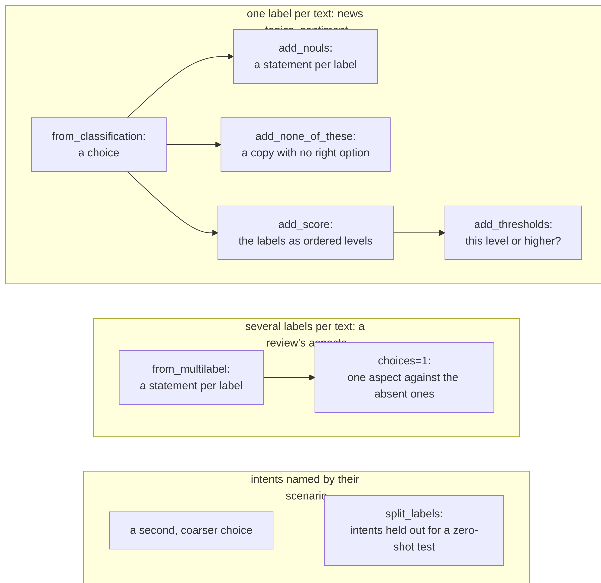

# Reshaping datasets: one label, many questions


<!-- WARNING: THIS FILE WAS AUTOGENERATED! DO NOT EDIT! -->

Fine-tuning a decision model with sysone takes a few lines; the work is
the dataset. sysone’s models answer three kinds of question about a
state: a **choice** among labels, a **noul**, a statement judged true or
false, and a **score**, a level on an ordered scale. Most datasets
weren’t written as questions. They have a text and a label column, made
for a classifier with a fixed set of outputs.

This tutorial turns such datasets into questions, and then asks each
label in more than one shape. A news topic is a choice among four
topics, but also four statements, one per topic, of which one is true. A
sentiment is a choice, but its labels have an order, so it is also a
score and a pair of thresholds. Reshaping like this adds no new fact
(every question is answered by the same label), but it lets a model meet
each label’s name in several sentences, which is what a model that must
read labels it was never trained on needs. It also changes how many
questions each text gets, and how many of them are true, and the
sections below count both.

Three datasets, all on the Hugging Face Hub: [AG
News](https://huggingface.co/datasets/fancyzhx/ag_news) (news topics,
about 30 MB), the restaurant reviews of
[fast-decisions](https://huggingface.co/datasets/fastino/fast-decisions)
(2 MB, also used in [the GLiNER2 tutorial](05_gliner_decide.ipynb)), and
[MASSIVE](https://huggingface.co/datasets/mteb/amazon_massive_intent)’s
English voice-assistant requests (1.4 MB). After the downloads,
everything runs in a few seconds.

<figure>

<figcaption aria-hidden="true">A news article’s choice asked as four
statements and as a copy with no right option; a review’s sentiment
asked as a score and as two thresholds</figcaption>
</figure>

Here are those shapes on two short records
([figures](../90_figures.ipynb#a-label-asked-in-several-shapes)): each
small box is an option or a statement, coloured by the gold the
reshaping wrote, green for true or the gold option and orange for false.
The sections below build them on real datasets, with these functions:

<div>

<figure class=''>

<div>



</div>

</figure>

</div>

``` python
import json, random
from pathlib import Path
import pandas as pd
import datasets
from huggingface_hub import snapshot_download
from sysone.core import Question
from sysone.template import apply_tfms
from sysone.data import (TypedDecisions, case_record, add_nouls, add_none_of_these, add_score, add_thresholds, question_stats,
                         Nouls, NoneOfThese, Rephrase, expand_records)
from sysone.datasets import from_classification, from_multilabel, split_labels
datasets.disable_progress_bars()
```

A record is a state, its questions and their gold answers. A helper
prints one the way a person would read it:

``` python
def gold_text(g) -> str:
    if g is None: return "-"
    if not isinstance(g, dict): return str(g)
    if g.get("answerable") is False: return "none of these"
    if "probabilities" in g: return ", ".join(f"{k}: {v:.2f}" for k, v in g["probabilities"].items() if v)
    return f"true with p = {g['noul']:.2f}" if "noul" in g else str(g["label"])

def show(r, width=110):
    "The state, shortened, then each question: its id, type, wording, options and gold"
    s = " ".join(str(r["state"]).split())
    print(s if len(s) <= width else s[:width] + "…", end="\n\n")
    for qid, q in r["questions"].items():
        opts = Question.from_dict(q).options if q["type"] == "choice" else q.get("criteria") or []
        opts = f" {opts[:6] + [f'… {len(opts) - 6} more'] if len(opts) > 20 else opts}" if opts else ""
        g = gold_text(r["gold"].get(qid))
        if q["type"] == "score" and g.isdigit(): g += f" ({q['criteria'][int(g)]})"
        print(f"{qid:<26}{q['type']:<7}{q['instructions']}{opts}  →  {g}")
```

## A label column is a choice

[`from_classification`](https://sgaseretto.github.io/sysonelib/datasets.html#from_classification)
turns each row of a classification dataset into a record with one choice
question, its options the label names. We take 2,000 news articles:

``` python
ag = datasets.load_dataset("fancyzhx/ag_news", split="train").shuffle(seed=0).select(range(2000))
news = from_classification(ag, instructions="What is this news article about?", qid="topic", prefix="ag")
show(news[0])
```

    India Warns U.S. on Arms Sales to Pakistan WASHINGTON (Reuters) - India warned on Friday that new American arm…

    topic                     choice What is this news article about? ['World', 'Sports', 'Business', 'Sci/Tech']  →  World

The options are the names the dataset gives its labels, and a model
reads them: an option called `LABEL_2` would teach it nothing about
business. When names are terse, `labels={name: description}` adds a
description to each option.

## One choice, four statements

[`add_nouls`](https://sgaseretto.github.io/sysonelib/data.html#add_nouls)
asks the choice again as statements, one per label, true for the gold
label. The default wording quotes the question, so each statement claims
what the annotator claimed: that this label is *the* answer.

``` python
show(add_nouls(news[0]))
```

    India Warns U.S. on Arms Sales to Pakistan WASHINGTON (Reuters) - India warned on Friday that new American arm…

    topic                     choice What is this news article about? ['World', 'Sports', 'Business', 'Sci/Tech']  →  World
    topic:noul0               noul   The answer to "What is this news article about?" is Sports.  →  false
    topic:noul1               noul   The answer to "What is this news article about?" is Sci/Tech.  →  false
    topic:noul2               noul   The answer to "What is this news article about?" is Business.  →  false
    topic:noul3               noul   The answer to "What is this news article about?" is World.  →  true

The wording is yours. A shorter statement reads more naturally, but it
should still claim one answer: “This article mentions Business” would be
a different claim, true of many articles about something else.

``` python
show(add_nouls(news[0], statement="This news article is mainly about {label}.", keep=False))
```

    India Warns U.S. on Arms Sales to Pakistan WASHINGTON (Reuters) - India warned on Friday that new American arm…

    topic:noul0               noul   This news article is mainly about Sports.  →  false
    topic:noul1               noul   This news article is mainly about Sci/Tech.  →  false
    topic:noul2               noul   This news article is mainly about Business.  →  false
    topic:noul3               noul   This news article is mainly about World.  →  true

## How many statements are true

Four statements per article, one of them true: a quarter of the
statements are true. A model learns that share as its prior for
statements of this kind, and calibration can’t undo it: temperature
scaling sharpens or softens the model’s probabilities, but it can’t
shift the point at which it says yes. So the share is worth choosing.
`negatives=1` keeps the gold label’s statement and one other, drawn at
random, so half are true.
[`question_stats`](https://sgaseretto.github.io/sysonelib/data.html#question_stats)
counts the questions of each kind and the share of true golds:

``` python
pd.concat({"every label": question_stats([add_nouls(r) for r in news]),
           "the gold and one other": question_stats([add_nouls(r, negatives=1) for r in news])})
```

<div>
<style scoped>
    .dataframe tbody tr th:only-of-type {
        vertical-align: middle;
    }
&#10;    .dataframe tbody tr th {
        vertical-align: top;
    }
&#10;    .dataframe thead th {
        text-align: right;
    }
</style>

<table class="dataframe" data-quarto-postprocess="true" data-border="1">
<thead>
<tr style="text-align: right;">
<th data-quarto-table-cell-role="th"></th>
<th data-quarto-table-cell-role="th"></th>
<th data-quarto-table-cell-role="th">questions</th>
<th data-quarto-table-cell-role="th">per record</th>
<th data-quarto-table-cell-role="th">options</th>
<th data-quarto-table-cell-role="th">gold true</th>
</tr>
<tr>
<th data-quarto-table-cell-role="th"></th>
<th data-quarto-table-cell-role="th">kind</th>
<th data-quarto-table-cell-role="th"></th>
<th data-quarto-table-cell-role="th"></th>
<th data-quarto-table-cell-role="th"></th>
<th data-quarto-table-cell-role="th"></th>
</tr>
</thead>
<tbody>
<tr>
<td rowspan="2" data-quarto-table-cell-role="th" data-valign="top">every
label</td>
<td data-quarto-table-cell-role="th">choice</td>
<td>2000</td>
<td>1.0</td>
<td>4.0</td>
<td>NaN</td>
</tr>
<tr>
<td data-quarto-table-cell-role="th">noul from choice</td>
<td>8000</td>
<td>4.0</td>
<td>2.0</td>
<td>0.25</td>
</tr>
<tr>
<td rowspan="2" data-quarto-table-cell-role="th" data-valign="top">the
gold and one other</td>
<td data-quarto-table-cell-role="th">choice</td>
<td>2000</td>
<td>1.0</td>
<td>4.0</td>
<td>NaN</td>
</tr>
<tr>
<td data-quarto-table-cell-role="th">noul from choice</td>
<td>4000</td>
<td>2.0</td>
<td>2.0</td>
<td>0.50</td>
</tr>
</tbody>
</table>

</div>

With four labels the difference is modest. With 77, as in banking77, one
statement in 77 would be true, and the model would learn that almost
every statement is false.

## Labels that overlap

A single-label dataset says which label fits best. Turned into
statements, it says the other labels don’t fit at all, which is a
stronger claim. AG News’s Business and Sci/Tech overlap: this article is
labelled Business, and it is also about computers.

``` python
lenovo = news[17]
show(add_nouls(lenovo, keep=False))
```

    Lenovo to buy IBM PC arm IBM said late Tuesday that it will sell its personal computer division, transferring …

    topic:noul0               noul   The answer to "What is this news article about?" is Business.  →  true
    topic:noul1               noul   The answer to "What is this news article about?" is Sci/Tech.  →  false
    topic:noul2               noul   The answer to "What is this news article about?" is Sports.  →  false
    topic:noul3               noul   The answer to "What is this news article about?" is World.  →  false

“Sci/Tech” is false here only because the annotator had to pick one
label. `soft` softens such statements: `{"Business": {"Sci/Tech": 0.2}}`
makes the Sci/Tech statement true with probability 0.2 whenever the gold
is Business, and the reverse pair does the same for Sci/Tech articles.

``` python
OVERLAP = {"Business": {"Sci/Tech": 0.2}, "Sci/Tech": {"Business": 0.2}}
show(add_nouls(lenovo, soft=OVERLAP, keep=False))
```

    Lenovo to buy IBM PC arm IBM said late Tuesday that it will sell its personal computer division, transferring …

    topic:noul0               noul   The answer to "What is this news article about?" is Business.  →  true
    topic:noul1               noul   The answer to "What is this news article about?" is Sci/Tech.  →  true with p = 0.20
    topic:noul2               noul   The answer to "What is this news article about?" is Sports.  →  false
    topic:noul3               noul   The answer to "What is this news article about?" is World.  →  false

Which pairs overlap, and by how much, is for the data to say. After
training a first model,
[`Interpretation.most_confused()`](https://sgaseretto.github.io/sysonelib/interpret.html#interpretation.most_confused)
lists the pairs it mixes up most, a good place to start.

## None of these

[`add_none_of_these`](https://sgaseretto.github.io/sysonelib/data.html#add_none_of_these)
copies a choice without its gold option. No option of the copy is right,
so its gold is `answerable: False`. Those rows don’t train the options.
They train the act head, which learns to hand a case over when none of
the options fits. `frac` picks the share of records that get a copy.

``` python
show(add_none_of_these(news[0]))
```

    India Warns U.S. on Arms Sales to Pakistan WASHINGTON (Reuters) - India warned on Friday that new American arm…

    topic                     choice What is this news article about? ['World', 'Sports', 'Business', 'Sci/Tech']  →  World
    topic:none                choice What is this news article about? ['Sports', 'Business', 'Sci/Tech']  →  none of these

## Several labels at once

The restaurant reviews of fast-decisions mark which aspects each review
talks about, any number of six. A choice can’t hold that, since it has
one answer, but a statement per aspect can.
[`from_multilabel`](https://sgaseretto.github.io/sysonelib/datasets.html#from_multilabel)
makes one, true for each aspect the review talks about. `choices=1` adds
a choice made of one aspect the review talks about and the aspects it
doesn’t, a shape with exactly one right option.

``` python
repo = Path(snapshot_download("fastino/fast-decisions", repo_type="dataset"))
heads = lambda r: {c["task"]: c for c in r["output"]["classifications"]}
rows = [json.loads(l) for l in (repo / "restaurant_review.jsonl").read_text().splitlines()]
reviews = [{"text": r["input"], "aspects": heads(r)["aspects"]["true_label"], "sentiment": heads(r)["sentiment"]["true_label"][0]} for r in rows]
ASPECTS, SENTIMENTS = heads(rows[0])["aspects"]["labels"], heads(rows[0])["sentiment"]["labels"]

aspects = from_multilabel(reviews, labels="aspects", names=ASPECTS, statement="The review talks about the {label}.", qid="aspect",
                          choices=1, instructions="Which of these does the review talk about?", prefix="review")
show(aspects[0])
```

    [place] Trattoria Lucca, Orvieto Crossing [text] Compared with my last visit, our drive-through stop at Tratto…

    aspect:food               noul   The review talks about the food.  →  true
    aspect:service            noul   The review talks about the service.  →  false
    aspect:price              noul   The review talks about the price.  →  false
    aspect:ambiance           noul   The review talks about the ambiance.  →  false
    aspect:wait               noul   The review talks about the wait.  →  false
    aspect:cleanliness        noul   The review talks about the cleanliness.  →  false
    aspect:choice0            choice Which of these does the review talk about? ['food', 'wait', 'service', 'cleanliness']  →  food

[The GLiNER2 tutorial](05_gliner_decide.ipynb) left these multi-label
questions out, since a choice can’t hold them; as statements they fit.
Every question made from a label inherits its mistakes, so it pays to
read a sample first: `show(aspects[1])` is a review of a burger, marked
as not talking about the food.

The share of true statements is now the share of aspects a review talks
about:

``` python
question_stats(aspects)
```

<div>
<style scoped>
    .dataframe tbody tr th:only-of-type {
        vertical-align: middle;
    }
&#10;    .dataframe tbody tr th {
        vertical-align: top;
    }
&#10;    .dataframe thead th {
        text-align: right;
    }
</style>

<table class="dataframe" data-quarto-postprocess="true" data-border="1">
<thead>
<tr style="text-align: right;">
<th data-quarto-table-cell-role="th"></th>
<th data-quarto-table-cell-role="th">questions</th>
<th data-quarto-table-cell-role="th">per record</th>
<th data-quarto-table-cell-role="th">options</th>
<th data-quarto-table-cell-role="th">gold true</th>
</tr>
<tr>
<th data-quarto-table-cell-role="th">kind</th>
<th data-quarto-table-cell-role="th"></th>
<th data-quarto-table-cell-role="th"></th>
<th data-quarto-table-cell-role="th"></th>
<th data-quarto-table-cell-role="th"></th>
</tr>
</thead>
<tbody>
<tr>
<td data-quarto-table-cell-role="th">noul</td>
<td>600</td>
<td>6.00</td>
<td>2.000</td>
<td>0.672</td>
</tr>
<tr>
<td data-quarto-table-cell-role="th">choice</td>
<td>79</td>
<td>0.79</td>
<td>3.051</td>
<td>NaN</td>
</tr>
</tbody>
</table>

</div>

Two statements in three are true (0.67): most reviews talk about most
aspects, the food above all (89 of the 100). That share belongs to this
dataset, and a model trained on it would carry it to reviews that say
much less. 79 reviews got a choice; the other 21 talk about all six
aspects, which leaves nothing to choose against.

## Labels in order

The same reviews have a sentiment: negative, neutral or positive. As a
choice, the three are unrelated options, and mistaking negative for
positive costs the same as mistaking it for neutral.
[`add_score`](https://sgaseretto.github.io/sysonelib/data.html#add_score)
asks it as a score as well, whose levels are ordered, and
[`add_thresholds`](https://sgaseretto.github.io/sysonelib/data.html#add_thresholds)
asks the score as one statement per step up the scale (Frank and Hall’s
reduction of ordered labels to yes/no questions): “neutral or better”,
“positive or better”.

``` python
mood = from_classification(reviews, label="sentiment", labels=SENTIMENTS, qid="sentiment",
                           instructions="What is the sentiment of this review?", prefix="review")
mood = [add_thresholds(add_score(r, "sentiment"), statement="The sentiment of this review is {level} or better.") for r in mood]
show(mood[0])
```

    [place] Trattoria Lucca, Orvieto Crossing [text] Compared with my last visit, our drive-through stop at Tratto…

    sentiment                 choice What is the sentiment of this review? ['negative', 'neutral', 'positive']  →  negative
    sentiment:score           score  What is the sentiment of this review? ['negative', 'neutral', 'positive']  →  0 (negative)
    sentiment:score:atleast1  noul   The sentiment of this review is neutral or better.  →  false
    sentiment:score:atleast2  noul   The sentiment of this review is positive or better.  →  false

The two converters numbered the reviews alike, so a review’s aspects and
its sentiment can share one record: one state, every question about it.

``` python
def merge(a, b) -> dict:
    "One record with both records' questions; they must be about the same state"
    assert a["state"] == b["state"]
    return {**a, "questions": {**a["questions"], **b["questions"]}, "gold": {**a["gold"], **b["gold"]}}

review_records = [merge(a, m) for a, m in zip(aspects, mood)]
print(f"{len(review_records)} reviews, {sum(len(r['questions']) for r in review_records) / len(review_records):.0f} questions each")
question_stats(review_records)
```

    100 reviews, 11 questions each

<div>
<style scoped>
    .dataframe tbody tr th:only-of-type {
        vertical-align: middle;
    }
&#10;    .dataframe tbody tr th {
        vertical-align: top;
    }
&#10;    .dataframe thead th {
        text-align: right;
    }
</style>

<table class="dataframe" data-quarto-postprocess="true" data-border="1">
<thead>
<tr style="text-align: right;">
<th data-quarto-table-cell-role="th"></th>
<th data-quarto-table-cell-role="th">questions</th>
<th data-quarto-table-cell-role="th">per record</th>
<th data-quarto-table-cell-role="th">options</th>
<th data-quarto-table-cell-role="th">gold true</th>
</tr>
<tr>
<th data-quarto-table-cell-role="th">kind</th>
<th data-quarto-table-cell-role="th"></th>
<th data-quarto-table-cell-role="th"></th>
<th data-quarto-table-cell-role="th"></th>
<th data-quarto-table-cell-role="th"></th>
</tr>
</thead>
<tbody>
<tr>
<td data-quarto-table-cell-role="th">noul</td>
<td>600</td>
<td>6.00</td>
<td>2.000</td>
<td>0.672</td>
</tr>
<tr>
<td data-quarto-table-cell-role="th">choice</td>
<td>179</td>
<td>1.79</td>
<td>3.022</td>
<td>NaN</td>
</tr>
<tr>
<td data-quarto-table-cell-role="th">score from choice</td>
<td>100</td>
<td>1.00</td>
<td>3.000</td>
<td>NaN</td>
</tr>
<tr>
<td data-quarto-table-cell-role="th">noul from score</td>
<td>200</td>
<td>2.00</td>
<td>2.000</td>
<td>0.470</td>
</tr>
</tbody>
</table>

</div>

## A hierarchy is a second label

MASSIVE’s 60 intents name their scenario: `alarm_set` and `alarm_query`
belong to *alarm*, `play_music` and `play_radio` to *play*. The scenario
is a second, coarser question whose answer follows from the intent, so
it costs nothing to add, and it gives the model a second view of every
request. The two answers must agree, which is worth checking later: a
model that says *alarm set* but not *alarm* contradicts itself. Three
scenario names are terse, so their options get a description.

``` python
massive = datasets.load_dataset("mteb/amazon_massive_intent", "en", split="train")
human = lambda s: s.replace("_", " ")
INTENTS = sorted(set(massive["label"]))
TERSE = {"iot": "smart-home devices", "qa": "questions to answer", "general": "small talk and commands"}
SCENARIOS = {s: TERSE.get(s) for s in sorted({i.split("_")[0] for i in INTENTS})}

def request(i, r) -> dict:
    "A request with two questions: its scenario among 18, and its intent among 60"
    return {"id": f"massive_{i:05d}", "state": r["text"],
            "questions": {"scenario": {"type": "choice", "instructions": "What area is this request about?", "criteria": SCENARIOS},
                          "intent": {"type": "choice", "instructions": "What does the user want?", "criteria": [human(x) for x in INTENTS]}},
            "gold": {"scenario": r["label"].split("_")[0], "intent": human(r["label"])}}

requests = [request(i, r) for i, r in enumerate(massive)]
show(requests[0], width=60)
```

    wake me up at nine am on friday

    scenario                  choice What area is this request about? ['alarm', 'audio', 'calendar', 'cooking', 'datetime', 'email', 'general: small talk and commands', 'iot: smart-home devices', 'lists', 'music', 'news', 'play', 'qa: questions to answer', 'recommendation', 'social', 'takeaway', 'transport', 'weather']  →  alarm
    intent                    choice What does the user want? ['alarm query', 'alarm remove', 'alarm set', 'audio volume down', 'audio volume mute', 'audio volume other', '… 54 more']  →  alarm set

## Labels the model never sees

A zero-shot model is meant to answer with labels it was never trained
on, and measuring that needs labels held out of training entirely.
Holding out requests isn’t enough, since every intent would still turn
up in training, as an answer or as an option.
[`split_labels`](https://sgaseretto.github.io/sysonelib/datasets.html#split_labels)
holds out labels: requests whose intent is held go to the test side, and
every other request loses the held intents from its options. We hold out
a third of the intents:

``` python
held = random.Random(0).sample([human(x) for x in INTENTS], len(INTENTS) // 3)
seen, unseen = split_labels(requests, "intent", held)
assert not any(h in r["questions"]["intent"]["criteria"] for r in seen for h in held)
print(f"{len(seen):,} requests to train on, with {len(INTENTS) - len(held)} intents as options; "
      f"{len(unseen):,} held-out requests whose intent is one of the {len(held)} held out, e.g. {held[:3]}")
```

    8,257 requests to train on, with 40 intents as options; 3,257 held-out requests whose intent is one of the 20 held out, e.g. ['takeaway query', 'iot hue lightdim', 'recommendation events']

Held-out requests are asked among all 60 intents, so the right answer is
one the model never saw, next to 40 it knows. The scenario question
needs no change: 16 of the 20 held-out intents share their scenario with
intents that stay in training (*takeaway query* with *takeaway order*),
so a model can know what a request is about even when its intent is new.
Only *lists* and *news* lose all their intents, and their requests are
new at both levels.

## Training data that changes every epoch

The functions above reshape a record once. For training, the same
reshapings exist as transforms that run while rows are built, drawing
anew every epoch, like the random flips and crops of image augmentation.
[`Rephrase`](https://sgaseretto.github.io/sysonelib/data.html#rephrase)
asks the topic question in one of several wordings,
[`Nouls`](https://sgaseretto.github.io/sysonelib/data.html#nouls) draws
the statements’ negatives and wording, and
[`NoneOfThese`](https://sgaseretto.github.io/sysonelib/data.html#noneofthese)
adds its copies. None of them runs at inference. Validation gets one
fixed draw instead, from `expand_eval`, so its metrics compare across
epochs and cover every kind of question; calibration gets the same draw,
so the temperatures, fitted per kind and number of options, cover them
too.

``` python
tfms = [Rephrase({"topic": ["What is this news article about?", "Which section of a newspaper would print this story?", "What is the topic of this article?"]}),
        Nouls(negatives=1, statement=["This news article is mainly about {label}.", 'The answer to "{instructions}" is {option}.']),
        NoneOfThese(frac=0.2)]
data = TypedDecisions.from_records(news, valid=0.2, calib=0.1, tfms=tfms).expand_eval()
data
```

    TypedDecisions(1440 train, 400 valid, 160 calib cases · template default · 3 tfms)

Training records stay as they were; the transforms reshape them as their
rows are built. The same record, in three epochs:

``` python
r = case_record(data.cases["train"], 27)
for epoch in range(3):
    for t in tfms: t.set_epoch(epoch)
    print(f"epoch {epoch}"); show(apply_tfms(tfms, r, train=True)); print()
for t in tfms: t.set_epoch(0)
```

    epoch 0
    Belichick adjusts as coordinator takes Notre Dame job Bill Belichick took a few minutes Monday to convey his c…

    topic                     choice Which section of a newspaper would print this story? ['World', 'Sports', 'Business', 'Sci/Tech']  →  Sports
    topic:noul0               noul   The answer to "Which section of a newspaper would print this story?" is Business.  →  false
    topic:noul1               noul   The answer to "Which section of a newspaper would print this story?" is Sports.  →  true
    topic:none                choice Which section of a newspaper would print this story? ['World', 'Business', 'Sci/Tech']  →  none of these

    epoch 1
    Belichick adjusts as coordinator takes Notre Dame job Bill Belichick took a few minutes Monday to convey his c…

    topic                     choice What is the topic of this article? ['World', 'Sports', 'Business', 'Sci/Tech']  →  Sports
    topic:noul0               noul   This news article is mainly about Sports.  →  true
    topic:noul1               noul   This news article is mainly about Sci/Tech.  →  false
    topic:none                choice What is the topic of this article? ['World', 'Business', 'Sci/Tech']  →  none of these

    epoch 2
    Belichick adjusts as coordinator takes Notre Dame job Bill Belichick took a few minutes Monday to convey his c…

    topic                     choice What is this news article about? ['World', 'Sports', 'Business', 'Sci/Tech']  →  Sports
    topic:noul0               noul   The answer to "What is this news article about?" is World.  →  false
    topic:noul1               noul   The answer to "What is this news article about?" is Sports.  →  true
    topic:none                choice What is this news article about? ['World', 'Business', 'Sci/Tech']  →  none of these

<figure>

<figcaption aria-hidden="true">Nouls(negatives=1) on a training record
at four epochs, the same two statement ids asking other labels, and a
validation record’s one fixed draw</figcaption>
</figure>

The statements alone, on a short article
([figures](../90_figures.ipynb#drawn-every-epoch-fixed-for-evaluation)):
`topic:noul0` and `topic:noul1` keep their ids while the label each
names is drawn anew every epoch, and a validation record keeps one draw.

From one epoch to the next, the topic question changes its wording, the
statements change theirs, and the second statement names another wrong
topic. The none-of-these copy stays, since whether a record gets one is
decided once, by its id. The model reads the same article each epoch,
asked a little differently each time.

The validation split has its fixed draw, counted as before:

``` python
question_stats([case_record(data.cases["valid"], i) for i in range(len(data.cases["valid"]))])
```

<div>
<style scoped>
    .dataframe tbody tr th:only-of-type {
        vertical-align: middle;
    }
&#10;    .dataframe tbody tr th {
        vertical-align: top;
    }
&#10;    .dataframe thead th {
        text-align: right;
    }
</style>

<table class="dataframe" data-quarto-postprocess="true" data-border="1">
<thead>
<tr style="text-align: right;">
<th data-quarto-table-cell-role="th"></th>
<th data-quarto-table-cell-role="th">questions</th>
<th data-quarto-table-cell-role="th">per record</th>
<th data-quarto-table-cell-role="th">options</th>
<th data-quarto-table-cell-role="th">gold true</th>
</tr>
<tr>
<th data-quarto-table-cell-role="th">kind</th>
<th data-quarto-table-cell-role="th"></th>
<th data-quarto-table-cell-role="th"></th>
<th data-quarto-table-cell-role="th"></th>
<th data-quarto-table-cell-role="th"></th>
</tr>
</thead>
<tbody>
<tr>
<td data-quarto-table-cell-role="th">choice</td>
<td>400</td>
<td>1.000</td>
<td>4.0</td>
<td>NaN</td>
</tr>
<tr>
<td data-quarto-table-cell-role="th">noul from choice</td>
<td>800</td>
<td>2.000</td>
<td>2.0</td>
<td>0.5</td>
</tr>
<tr>
<td data-quarto-table-cell-role="th">choice from choice, none of
these</td>
<td>79</td>
<td>0.198</td>
<td>3.0</td>
<td>NaN</td>
</tr>
</tbody>
</table>

</div>

And this is how a model reads two of those questions: one row each, the
question and its options first, a `[MASK]` anchor before each option,
then the article.

``` python
data.show_batch(2, "valid", max_chars=420)
```

    [CLS]choice question: What is this news article about?[SEP][MASK] World[MASK] Sports[MASK] Business[MASK] Sci/Tech[SEP]India Warns U.S. on Arms Sales to Pakistan  WASHINGTON (Reuters) - India warned on Friday that new  American arms sales to Pakistan could harm improving New  Delhi-Washington ties as well as a promising dialogue between  the South Asia's two nuclear rivals.[SEP]

    [CLS]noul question: The answer to "What is this news article about?" is World.[SEP][MASK] false: no, the statement does not hold[MASK] true: yes, the statement holds[SEP]India Warns U.S. on Arms Sales to Pakistan  WASHINGTON (Reuters) - India warned on Friday that new  American a …  Pakistan could harm improving New  Delhi-Washington ties as well as a promising dialogue between  the South Asia's two nuclear rivals.[SEP]

## Exercises: train and compare

The datasets are ready. The cells below train models on them and compare
them; they don’t run when the tutorial is built. Each uses sysone’s text
application, ModernBERT-large, which the first run downloads (about 1.6
GB). With `train="lora"` its rows are built every epoch, so the
transforms’ draws change; the default, a frozen encoder with cached
features, reads one fixed draw.

**1. Does reshaping help the choice?** Train on the news as plain
choices, and on the reshaped data, then evaluate both on the same fixed
validation draw, kind by kind.

``` python
from sysone.text import decision_learner
from sysone.evaluate import evaluate

def only(records, keep):
    "The records with only the questions `keep(qid)` accepts"
    return [{**r, "questions": {k: q for k, q in r["questions"].items() if keep(k)},
             "gold": {k: g for k, g in r["gold"].items() if keep(k)}} for r in records]

valid = [case_record(data.cases["valid"], i) for i in range(len(data.cases["valid"]))]
kinds = {"choice": lambda k: k == "topic", "statements": lambda k: ":noul" in k}
results = {}
for name, d in {"choices only": TypedDecisions.from_records(news, valid=0.2, calib=0.1),
                "reshaped": TypedDecisions.from_records(news, valid=0.2, calib=0.1, tfms=tfms).expand_eval()}.items():
    learn = decision_learner(d, train="lora", preset="macbook")
    learn.fit_one_cycle(2, lr=1e-4)
    decider = learn.decider()
    results[name] = {kind: evaluate(decider, only(valid, keep))["accuracy"] for kind, keep in kinds.items()}
pd.DataFrame(results).T.round(3)
```

The same split seed gives both datasets the same validation articles.
The choices-only model never trained on statements, so its statement
accuracy is zero-shot; the reshaped one’s choice accuracy shows whether
the statements cost the choice anything.

**2. Unseen intents.** Train on the `seen` requests, then ask the
`unseen` ones, whose intents the model never met, among all 60, and
their scenarios, which it mostly did meet. Then add
`Nouls(qid="intent", negatives=3)` to the training data’s transforms and
see whether statements about seen intents help with unseen ones.

``` python
learn = decision_learner(TypedDecisions.from_records(seen, valid=0.1, calib=0.1), preset="macbook")
learn.fit_one_cycle(3, lr=1e-3)
decider = learn.decider()
{q: evaluate(decider, only(unseen[:1000], lambda k, q=q: k == q))["accuracy"] for q in ("intent", "scenario")}
```

**3. Overlaps from the data.** Train on the reshaped news, list
`Interpretation.from_learner(learn).most_confused("topic")`, and set
`soft` from it in place of `OVERLAP`’s guess.

**4. One model, every question.** Train on `review_records`: the
aspects, the sentiment and its thresholds, together. With only 100
reviews, compare a model trained on the sentiment choice alone against
one trained on all the questions, on the sentiment choice.
