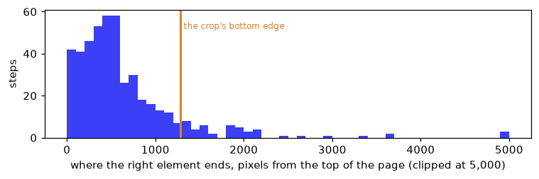

# Web pages as screenshots


<!-- WARNING: THIS FILE WAS AUTOGENERATED! DO NOT EDIT! -->

sysone’s multimodal application exists for decisions over screens: a
browser agent looking at a page and choosing what to do next. Its
default encoder was NeoMME-260M, which H company built for screenshots
and documents. On the only real images tested so far, small ones,
ModernVBERT won by a wide margin: 0.84 against 0.31 on a digit choice
and 0.94 against 0.74 on photos. But the [comparison
tutorial](neomme_vs_modernvbert.ipynb) pointed out that tiny digits and
stock photos favour an image tower trained on natural photos, and that
pages are the test that decides between the two. This notebook runs that
test, at pilot scale.

The data is
[Multimodal-Mind2Web](https://huggingface.co/datasets/osunlp/Multimodal-Mind2Web)
(OpenRAIL): one row per recorded browser action, with a screenshot of
the page and the elements a person could have acted on. sysone’s
[screens](../21_screens.ipynb) converter turns each action into two
questions:

- **`operation`**: which kind of action comes next, among the page’s
  operations (click, type, select) and the controls (wait, scroll, done,
  blocked);
- **the target**: which element to act on, among the right one and up to
  44 others from the page.

Five heads answer them, each on a frozen encoder: NeoMME-260M and
ModernVBERT with the screenshot, the same two without it, and
ModernBERT-large, the text application’s default, without it. The
text-only runs answer the question under the question: if the page’s
text alone does as well, the screenshot isn’t worth its cost. The [text
tutorial](web_text.ipynb) compares the same encoders, and
GLiNER2.5-Decide, on 3,000 more steps in text alone.

This is a pilot: 276 training steps from 30 websites, and 191 test steps
from 9 websites none of them saw. Differences of a few points between
runs are within the noise. What it can show is the direction, the cost
of each encoder on real pages, and what a full run would need.

<div>

> **Jargon**
>
> - **Parquet, row group, column**: Multimodal-Mind2Web is stored as
>   Parquet files, which keep each column of a block of rows (a *row
>   group*) together. A reader can fetch one block and only the columns
>   it needs, over HTTP, without downloading the file.
> - **Crop**: cutting a region out of an image. Here, the top of a page
>   that can be 20,000 pixels tall.
> - **Patch, tile**: NeoMME cuts an image into 32-pixel patches, one
>   token each. ModernVBERT cuts it into 512-pixel tiles, and its vision
>   tower turns each tile into 64 tokens, plus 64 for a small copy of
>   the whole image.
> - **Operation, target**: the two questions of a step, what kind of
>   action and on which element.
> - **Held-out websites**: websites none of whose steps were used for
>   training.

</div>

<div>

> **Running this notebook**
>
> The test suite skips this notebook (`skip_exec`). The first run
> streams about 0.5 GB of Multimodal-Mind2Web and saves the 467 steps
> and their screenshots in `web-screens/`, next to the notebook; later
> runs read them from there. It uses NeoMME-260M (526 MB), ModernVBERT
> (1.2 GB) and ModernBERT-large (1.6 GB), one at a time. The whole run
> takes about 32 minutes on an M3 Pro (MPS, fp32), and the outputs below
> come from a run on 2026-09-30. Multimodal-Mind2Web’s licence
> (OpenRAIL) restricts what may be done with derived data, so this
> notebook shows no screenshot: it describes them.

</div>

``` python
import gc, json, random, resource, sys, time, logging, warnings
from collections import Counter
from pathlib import Path
import numpy as np
import pandas as pd
import torch
import matplotlib.pyplot as plt
from matplotlib_inline.backend_inline import set_matplotlib_formats
import pyarrow.parquet as pq
import datasets, transformers
from huggingface_hub import HfFileSystem
from PIL import Image as PILImage
from transformers.trainer_callback import PrinterCallback, ProgressCallback
from sysone.data import TypedDecisions
from sysone.datasets import mm_mind2web_record, MM_COLUMNS, WEB_TFMS
from sysone.models import EncoderSpec
from sysone.template import Image, apply_tfms, prepare_processor
import sysone.text as text_app
import sysone.multimodal as multimodal_app
```

``` python
logging.getLogger("transformers").setLevel(logging.ERROR)
datasets.disable_progress_bars(); transformers.utils.logging.disable_progress_bar()
set_matplotlib_formats("png"); plt.rcParams["figure.dpi"] = 110
pd.set_option("display.width", 200); pd.set_option("display.max_columns", 20); pd.set_option("display.max_colwidth", 90)
work = Path("web-screens"); work.mkdir(exist_ok=True)
t_start = time.time()
device = "cuda" if torch.cuda.is_available() else "mps" if torch.backends.mps.is_available() else "cpu"
print(f"torch {torch.__version__} · transformers {transformers.__version__} · {device}")
```

    torch 2.14.0 · transformers 5.17.0 · mps

``` python
def quiet(learn):
    "The learner, without the Trainer's per-step log lines in the outputs"
    for cb in (PrinterCallback, ProgressCallback): learn.trainer.remove_callback(cb)
    return learn

def release():
    "Hand back the memory of deleted models"
    gc.collect()
    if torch.backends.mps.is_available(): torch.mps.empty_cache()
    if torch.cuda.is_available(): torch.cuda.empty_cache()

def memory_line():
    "The process's peak resident memory, and what the MPS driver holds now"
    rss = resource.getrusage(resource.RUSAGE_SELF).ru_maxrss / (2**30 if sys.platform == "darwin" else 2**20)
    mps = f" · MPS {torch.mps.driver_allocated_memory() / 2**30:.1f} GB" if torch.backends.mps.is_available() else ""
    return f"peak memory {rss:.1f} GB{mps}"
```

## Reading only what we need

The whole dataset is 13.6 GB, of which the pilot needs about 0.5. Each
file holds about 290 rows in row groups of 100, so one row group is the
smallest piece a reader fetches. The footer of a file says what each
column of each row group weighs:

``` python
REPO = "datasets/osunlp/Multimodal-Mind2Web/data"
fs = HfFileSystem()
pf = pq.ParquetFile(fs.open(sorted(fs.glob(f"{REPO}/train-*.parquet"))[0]))       # reads the footer only
rg = pf.metadata.row_group(0)
cols = [rg.column(i) for i in range(rg.num_columns)]
size = pd.Series([c.total_compressed_size for c in cols], index=[c.path_in_schema.split(".")[0] for c in cols]).groupby(level=0).sum()   # a column's parts summed
print(f"{pf.metadata.num_rows} rows in {pf.metadata.num_row_groups} row groups; the first holds {rg.num_rows} rows")
(size / rg.num_rows / 1e6).sort_values(ascending=False).head(5).round(3).to_frame("MB per row")
```

    288 rows in 3 row groups; the first holds 100 rows

<div>
<style scoped>
    .dataframe tbody tr th:only-of-type {
        vertical-align: middle;
    }
&#10;    .dataframe tbody tr th {
        vertical-align: top;
    }
&#10;    .dataframe thead th {
        text-align: right;
    }
</style>

<table class="dataframe" data-quarto-postprocess="true" data-border="1">
<thead>
<tr style="text-align: right;">
<th data-quarto-table-cell-role="th"></th>
<th data-quarto-table-cell-role="th">MB per row</th>
</tr>
</thead>
<tbody>
<tr>
<td data-quarto-table-cell-role="th">screenshot</td>
<td>0.885</td>
</tr>
<tr>
<td data-quarto-table-cell-role="th">raw_html</td>
<td>0.058</td>
</tr>
<tr>
<td data-quarto-table-cell-role="th">cleaned_html</td>
<td>0.029</td>
</tr>
<tr>
<td data-quarto-table-cell-role="th">neg_candidates</td>
<td>0.021</td>
</tr>
<tr>
<td data-quarto-table-cell-role="th">pos_candidates</td>
<td>0.000</td>
</tr>
</tbody>
</table>

</div>

The screenshot is 90% of a row. The HTML comes in two versions, and the
converter reads only the cleaned one, so the raw HTML column is never
fetched: sysone’s `MM_COLUMNS` lists the columns the converter reads.
The rows of a split are shuffled by task, so a row group holds about 13
tasks from 5 to 10 websites. To cover as many websites as 500 rows can,
the pilot first reads the `website` column of every row group, which
costs a few megabytes, and then picks greedily: each chosen row group is
the one that adds the most websites not yet covered. It takes three row
groups from the training split and two from `test_website`, whose
websites none of the training ones share.

``` python
def chunk_index(split):
    "Every row group of a split and the websites in it, read from two small columns, and saved"
    path = work / f"chunks-{split}.json"
    if path.exists(): return json.loads(path.read_text())
    out = []
    for f in sorted(fs.glob(f"{REPO}/{split}-*.parquet")):
        pf = pq.ParquetFile(fs.open(f))
        for g in range(pf.num_row_groups):
            t = pf.read_row_group(g, columns=["website", "annotation_id"]).to_pylist()
            out.append({"split": split, "file": f, "group": g, "rows": len(t), "tasks": len({r["annotation_id"] for r in t}),
                        "websites": sorted({r["website"] for r in t})})
    path.write_text(json.dumps(out))
    return out

def pick(chunks, n):
    "n full row groups, each the one that adds the most websites not yet covered"
    picked, covered = [], set()
    for _ in range(n):
        c = max((c for c in chunks if c not in picked and c["rows"] == 100), key=lambda c: len(set(c["websites"]) - covered))
        picked.append(c); covered |= set(c["websites"])
    return picked

chosen = {"train": pick(chunk_index("train"), 3), "test_website": pick(chunk_index("test_website"), 2)}
for split, cs in chosen.items():
    print(f"{split}: row groups {[(Path(c['file']).name.split('-')[1], c['group']) for c in cs]} · {sum(c['tasks'] for c in cs)} tasks · "
          f"{len({w for c in cs for w in c['websites']})} websites")
```

    train: row groups [('00015', 0), ('00001', 1), ('00010', 0)] · 49 tasks · 30 websites
    test_website: row groups [('00000', 0), ('00001', 1)] · 31 tasks · 9 websites

Each chosen row group is then fetched once, with only the converter’s
columns, and turned into sysone records by
[`mm_mind2web_record`](https://sgaseretto.github.io/sysonelib/screens.html#mm_mind2web_record),
which saves each screenshot as a JPEG file and puts its path in the
state. Two more facts per step are kept for the analysis below: the
page’s height, and where the right element ends on the page.

``` python
def read_chunk(c):
    "A row group's rows as sysone records, their screenshots saved as JPEG files: fetched once, then read from disk"
    path = work / f"{Path(c['file']).stem}-{c['group']}.jsonl"
    if not path.exists():
        rows = pq.ParquetFile(fs.open(c["file"])).read_row_group(c["group"], columns=MM_COLUMNS).to_pylist()
        rng, recs = random.Random(0), []
        for row in rows:
            r = mm_mind2web_record(row, work / "shots", rng)
            if r is None: continue                                          # no usable target in the cleaned HTML
            pos = json.loads(row["pos_candidates"][0])
            x, y, w, h = map(float, json.loads(pos["attributes"])["bounding_box_rect"].split(","))
            r["page"] = {"height": PILImage.open(r["state"]["image"]).size[1], "gold_bottom": round(y + h)}
            recs.append(r)
        path.write_text("\n".join(json.dumps(r) for r in recs) + "\n")
    return [json.loads(l) for l in path.read_text().splitlines()]

t = time.time()
train, test = [r for c in chosen["train"] for r in read_chunk(c)], [r for c in chosen["test_website"] for r in read_chunk(c)]
print(f"{len(train)} training steps and {len(test)} test steps, of 500 rows, in {time.time() - t:.0f} s")
```

    276 training steps and 191 test steps, of 500 rows, in 0 s

The converter drops a row that has no usable target. When these rows
were first read, 30 of the 500 had no right element listed in the
dataset at all, and 3 had one that was missing from the cleaned HTML.
One test step, without its screenshot:

``` python
r = test[0]
q = next(k for k in r["questions"] if k != "operation")
print(f"website: {r['website']} · goal: {r['questions']['operation']['instructions']['goal']}")
print(f"page text: {r['state']['page']['text'][:300]} …")
print(f"recent actions: {[a['action'] for a in r['state']['recent_actions']]}")
print(f"operation options: {list(r['questions']['operation']['criteria'])} · gold {r['gold']['operation']['label']}")
print(f"{q}: {len(r['questions'][q]['criteria'])} options, such as {list(r['questions'][q]['criteria'].values())[:4]} · gold {r['gold'][q]['label']}")
```

    website: tiktok.music · goal: What are the romantic reggae musics from BCD Studio that can be used in tik tok series in andorra
    page text: Inspiration Top Ads Dashboard Keyword Insights Creative Insights Creative Strategies Showcases Trends Hashtags Songs Creators TikTok Videos About TikTok Trends Content Hub Creative Tools Tools Overview Video Editor Video Templates Audio Library Music Playlist Top Products New English Log in Audio Li …
    recent actions: []
    operation options: ['CLICK', 'WAIT', 'SCROLL_DOWN', 'SCROLL_UP', 'DONE', 'BLOCKED'] · gold CLICK
    click_target: 45 options, such as ['[1] Audio Library (heading)', '[2] Ready (generic)', '[3] Memories Use in TikTok Video Editor Lux-Inspir (generic)', '[4] Lazy Sunday Use in TikTok Video Editor BCD Stu (generic)'] · gold 42

``` python
Counter(next(k for k in r["questions"] if k != "operation") for r in train + test)
```

    Counter({'click_target': 385, 'type_text_target': 54, 'select_target': 28})

## The screenshots, and where to crop them

A screenshot here is the whole page, 1,280 pixels wide and, at the
median, several thousand tall. Resized whole so its long side fits an
encoder, say 1,024 pixels, a page 4,600 pixels tall would be 285 pixels
wide, and its text unreadable. The page has to be cropped. Cropping
around the right element isn’t allowed, since the crop would give the
answer away. So every page gets the same crop: its top 1,280 × 1,280
pixels, the first screen and a little more, resized to 1,024. The
question is how often the right element is inside it:

``` python
steps = pd.DataFrame([{"split": s, "height": r["page"]["height"], "gold_bottom": r["page"]["gold_bottom"]} for s, rs in (("train", train), ("test", test)) for r in rs])
print(steps.groupby("split").height.describe(percentiles=[0.5, 0.9])[["min", "50%", "90%", "max"]].round(0))
print(f"the right element ends inside the top 1,280 pixels on {np.mean(steps.gold_bottom <= 1280):.0%} of the steps")
fig, ax = plt.subplots(figsize=(7, 2.4))
ax.hist(steps.gold_bottom.clip(upper=5000), bins=np.arange(0, 5100, 100), color="#3b3ff5")
ax.axvline(1280, color="#d9822b", lw=2); ax.text(1320, ax.get_ylim()[1] * 0.85, "the crop's bottom edge", color="#d9822b", fontsize=8)
ax.set(xlabel="where the right element ends, pixels from the top of the page (clipped at 5,000)", ylabel="steps"); plt.tight_layout(); plt.show()
```

              min     50%      90%      max
    split                                  
    test   1080.0  3874.0   9608.0  18991.0
    train  1080.0  4358.0  14132.0  40680.0
    the right element ends inside the top 1,280 pixels on 90% of the steps



Nine steps in ten have the element inside the crop, most of them within
the first 700 pixels, although half the test pages are taller than 3,800
pixels and one in ten taller than 9,600. A single square at the top
keeps nearly every answer, and keeps the text legible: 1,280 pixels
shrunk to 1,024 is 80% of the original size. In sysone, the crop is a
box on the
[`Image`](https://sgaseretto.github.io/sysonelib/template.html#image)
transform, `Image(side=1024, box=(0, 0, 1280, 1280))`. A screenshot
smaller than the box passes through whole, so a model trained this way
reads an agent’s viewport the same way.

## How long a row gets

Each question is one row: the image’s tokens, then the question with its
options, then the page’s text. The converter’s questions are long. Each
carries laya-browser’s rules for choosing an action, about 300 tokens of
text that are the same for every step, and a target question lists 45
elements. So the question part needs up to about 1,500 tokens. The
multimodal presets leave it 384, and to fit 45 options into that,
sysone’s row builder, following Laya’s budget rules, cuts each option to
8 tokens, its index and anchor included. That leaves a few words of each
element’s label, and the rules get cut to a handful of tokens. Nothing
is dropped, but most of what a target row says is gone. All five runs
therefore get room for everything: rows of up to 3,072 tokens, 1,536 of
them for the question. Every encoder here takes rows that long: NeoMME
reads 16,384 positions, ModernVBERT’s text tower 7,999, ModernBERT-large
8,192. The row lengths each encoder then gets, on the test steps:

``` python
BOX = (0, 0, 1280, 1280)
BUDGET = dict(max_len=3072, head_max_len=1536)
text_only = lambda rs: [dict(r, state={k: v for k, v in r["state"].items() if k != "image"}) for r in rs]
RUNS = {"NeoMME-260M, screenshot": (multimodal_app, "Hcompany/NeoMME-260M", True),
        "ModernVBERT, screenshot": (multimodal_app, "ModernVBERT/modernvbert", True),
        "NeoMME-260M, text only": (multimodal_app, "Hcompany/NeoMME-260M", False),
        "ModernVBERT, text only": (multimodal_app, "ModernVBERT/modernvbert", False),
        "ModernBERT-large, text only": (text_app, "answerdotai/ModernBERT-large", False)}

def make_data(shot):
    "The pilot's steps, with or without the screenshot, and the transforms of the screens notebook: the crop, and URLs masked"
    return TypedDecisions(train if shot else text_only(train), valid=test if shot else text_only(test),
                          tfms=([Image(side=1024, box=BOX)] if shot else []) + WEB_TFMS)

lengths = {}
for name, (app, encoder, shot) in RUNS.items():
    spec = EncoderSpec.from_pretrained(encoder)
    if shot and spec.processor is not None: prepare_processor(spec.processor, 1024)
    data = make_data(shot); data.bind(spec.processor or spec.tokenizer, spec.template.replace(**BUDGET))
    n = [row.n_tokens for r in test for row in data.builder.build_record(apply_tfms(data.tfms, r), train=False, skip_errors=True)]
    lengths[name] = {"rows": len(n), "median tokens": int(np.median(n)), "longest": max(n), "dropped": data.builder.stats["dropped"]}
    del spec, data; release()
pd.DataFrame(lengths).T
```

<div>
<style scoped>
    .dataframe tbody tr th:only-of-type {
        vertical-align: middle;
    }
&#10;    .dataframe tbody tr th {
        vertical-align: top;
    }
&#10;    .dataframe thead th {
        text-align: right;
    }
</style>

<table class="dataframe" data-quarto-postprocess="true" data-border="1">
<thead>
<tr style="text-align: right;">
<th data-quarto-table-cell-role="th"></th>
<th data-quarto-table-cell-role="th">rows</th>
<th data-quarto-table-cell-role="th">median tokens</th>
<th data-quarto-table-cell-role="th">longest</th>
<th data-quarto-table-cell-role="th">dropped</th>
</tr>
</thead>
<tbody>
<tr>
<td data-quarto-table-cell-role="th">NeoMME-260M, screenshot</td>
<td>382</td>
<td>1923</td>
<td>3049</td>
<td>0</td>
</tr>
<tr>
<td data-quarto-table-cell-role="th">ModernVBERT, screenshot</td>
<td>382</td>
<td>1198</td>
<td>2111</td>
<td>0</td>
</tr>
<tr>
<td data-quarto-table-cell-role="th">NeoMME-260M, text only</td>
<td>382</td>
<td>906</td>
<td>2031</td>
<td>0</td>
</tr>
<tr>
<td data-quarto-table-cell-role="th">ModernVBERT, text only</td>
<td>382</td>
<td>902</td>
<td>1816</td>
<td>0</td>
</tr>
<tr>
<td data-quarto-table-cell-role="th">ModernBERT-large, text only</td>
<td>382</td>
<td>902</td>
<td>1816</td>
<td>0</td>
</tr>
</tbody>
</table>

</div>

Nothing is dropped. NeoMME’s screenshot rows are the longest, a median
of 1,923 tokens: at 1,024 pixels its image alone takes 1,058 positions,
one per 32-pixel patch plus a marker at the end of each row of patches.
ModernVBERT’s image at 1,024 pixels is four 512-pixel tiles and the
global view, 5 × 64 = 320 image tokens and a few markers, so its
screenshot rows are about 300 tokens longer than its text-only ones.

## Five heads

Each run is its application with that application’s defaults, the
budgets above, and the same head recipe: `fit_one_cycle(10, lr=1e-3)` on
the 276 training steps, in batches of 4 rows. Ten passes over 552 rows
is about as many steps as the other tutorials’ heads take. At 1,024
pixels each ModernVBERT row carries five images, so the application
encodes one row at a time. It used to shrink the training batch to one
row as well, although a head that trains from cached anchors never runs
the vision tower. This pilot found that, and every head here trains on
the same batches (the finding is in the
[ModernVBERT](../23_modernvbert.ipynb#a-head-only-run) notebook).

``` python
def answers(learn) -> dict:
    "Every held-out decision's predicted option and gold, from the cached anchors"
    p, ds = learn.get_preds("valid"), learn.dataset("valid")
    return {(c, q): (int(i), int(l)) for c, q, i, l in zip(ds["case"], ds["qid"], p["logits"].argmax(-1), p["labels"])}

preds, cost = {}, {}
for name, (app, encoder, shot) in RUNS.items():
    spec = EncoderSpec.from_pretrained(encoder)
    kw = {"image_side": 1024} if shot and app is multimodal_app else {}
    t = time.time()
    torch.manual_seed(0)                                     # the same starting head in every run, and on every run of the notebook
    learn = quiet(app.decision_learner(make_data(shot), spec, template=spec.template.replace(**BUDGET), cache_dir=work / "features", **kw))
    n = len(learn.dataset("train")) + len(learn.dataset("valid"))           # every row through the encoder once, into the cache
    t_encode = time.time() - t
    learn.fit_one_cycle(10, lr=1e-3)
    preds[name] = answers(learn)
    cost[name] = {"seconds per row to encode": t_encode / n, "minutes to encode": t_encode / 60, "seconds to train": time.time() - t - t_encode}
    print(f"{name}: {n} rows encoded in {t_encode / 60:.1f} min · {memory_line()}")
    del learn, spec; release()
```

    NeoMME-260M, screenshot: 934 rows encoded in 9.0 min · peak memory 3.1 GB · MPS 1.1 GB
    ModernVBERT, screenshot: 934 rows encoded in 9.5 min · peak memory 3.1 GB · MPS 1.4 GB
    NeoMME-260M, text only: 934 rows encoded in 3.6 min · peak memory 3.1 GB · MPS 1.1 GB
    ModernVBERT, text only: 934 rows encoded in 2.1 min · peak memory 3.1 GB · MPS 1.4 GB
    ModernBERT-large, text only: 934 rows encoded in 4.9 min · peak memory 3.1 GB · MPS 2.0 GB

## Results

Accuracy on each question on the 191 test steps, and on both at once (a
step is right when its operation and its target are). The first row is
what always answering the commonest operation, and picking one of 45
elements at random, would get.

``` python
gold_bottom = {r["id"]: r["page"]["gold_bottom"] for r in test}
def summary(p) -> dict:
    op = {c: pr == g for (c, q), (pr, g) in p.items() if q == "operation"}
    tg = {c: pr == g for (c, q), (pr, g) in p.items() if q != "operation"}
    inside = [tg[c] for c in tg if gold_bottom[c] <= 1280]; outside = [tg[c] for c in tg if gold_bottom[c] > 1280]
    return {"operation": np.mean(list(op.values())), "target": np.mean(list(tg.values())),
            "both": np.mean([op[c] and tg[c] for c in tg]), "target, element in the crop": np.mean(inside),
            "target, element below it": np.mean(outside)}

commonest = Counter(r["gold"]["operation"]["label"] for r in train).most_common(1)[0][0]
guess = {"operation": np.mean([r["gold"]["operation"]["label"] == commonest for r in test]), "target": np.mean([1 / len(r["questions"][next(k for k in r["questions"] if k != "operation")]["criteria"]) for r in test])}
table = pd.DataFrame({"guessing": guess} | {name: summary(p) for name, p in preds.items()}).T
print(f"{sum(gold_bottom[r['id']] <= 1280 for r in test)} test steps have the element in the crop, {sum(gold_bottom[r['id']] > 1280 for r in test)} below it")
table.style.format("{:.3f}", na_rep="")
```

    167 test steps have the element in the crop, 24 below it

<style type="text/css">
</style>

<table id="T_5d3a7" data-quarto-postprocess="true">
<thead>
<tr>
<th class="blank level0" data-quarto-table-cell-role="th"> </th>
<th id="T_5d3a7_level0_col0" class="col_heading level0 col0"
data-quarto-table-cell-role="th">operation</th>
<th id="T_5d3a7_level0_col1" class="col_heading level0 col1"
data-quarto-table-cell-role="th">target</th>
<th id="T_5d3a7_level0_col2" class="col_heading level0 col2"
data-quarto-table-cell-role="th">both</th>
<th id="T_5d3a7_level0_col3" class="col_heading level0 col3"
data-quarto-table-cell-role="th">target, element in the crop</th>
<th id="T_5d3a7_level0_col4" class="col_heading level0 col4"
data-quarto-table-cell-role="th">target, element below it</th>
</tr>
</thead>
<tbody>
<tr>
<td id="T_5d3a7_level0_row0" class="row_heading level0 row0"
data-quarto-table-cell-role="th">guessing</td>
<td id="T_5d3a7_row0_col0" class="data row0 col0">0.801</td>
<td id="T_5d3a7_row0_col1" class="data row0 col1">0.117</td>
<td id="T_5d3a7_row0_col2" class="data row0 col2"></td>
<td id="T_5d3a7_row0_col3" class="data row0 col3"></td>
<td id="T_5d3a7_row0_col4" class="data row0 col4"></td>
</tr>
<tr>
<td id="T_5d3a7_level0_row1" class="row_heading level0 row1"
data-quarto-table-cell-role="th">NeoMME-260M, screenshot</td>
<td id="T_5d3a7_row1_col0" class="data row1 col0">0.812</td>
<td id="T_5d3a7_row1_col1" class="data row1 col1">0.136</td>
<td id="T_5d3a7_row1_col2" class="data row1 col2">0.105</td>
<td id="T_5d3a7_row1_col3" class="data row1 col3">0.144</td>
<td id="T_5d3a7_row1_col4" class="data row1 col4">0.083</td>
</tr>
<tr>
<td id="T_5d3a7_level0_row2" class="row_heading level0 row2"
data-quarto-table-cell-role="th">ModernVBERT, screenshot</td>
<td id="T_5d3a7_row2_col0" class="data row2 col0">0.885</td>
<td id="T_5d3a7_row2_col1" class="data row2 col1">0.209</td>
<td id="T_5d3a7_row2_col2" class="data row2 col2">0.136</td>
<td id="T_5d3a7_row2_col3" class="data row2 col3">0.210</td>
<td id="T_5d3a7_row2_col4" class="data row2 col4">0.208</td>
</tr>
<tr>
<td id="T_5d3a7_level0_row3" class="row_heading level0 row3"
data-quarto-table-cell-role="th">NeoMME-260M, text only</td>
<td id="T_5d3a7_row3_col0" class="data row3 col0">0.880</td>
<td id="T_5d3a7_row3_col1" class="data row3 col1">0.173</td>
<td id="T_5d3a7_row3_col2" class="data row3 col2">0.147</td>
<td id="T_5d3a7_row3_col3" class="data row3 col3">0.174</td>
<td id="T_5d3a7_row3_col4" class="data row3 col4">0.167</td>
</tr>
<tr>
<td id="T_5d3a7_level0_row4" class="row_heading level0 row4"
data-quarto-table-cell-role="th">ModernVBERT, text only</td>
<td id="T_5d3a7_row4_col0" class="data row4 col0">0.869</td>
<td id="T_5d3a7_row4_col1" class="data row4 col1">0.199</td>
<td id="T_5d3a7_row4_col2" class="data row4 col2">0.141</td>
<td id="T_5d3a7_row4_col3" class="data row4 col3">0.198</td>
<td id="T_5d3a7_row4_col4" class="data row4 col4">0.208</td>
</tr>
<tr>
<td id="T_5d3a7_level0_row5" class="row_heading level0 row5"
data-quarto-table-cell-role="th">ModernBERT-large, text only</td>
<td id="T_5d3a7_row5_col0" class="data row5 col0">0.843</td>
<td id="T_5d3a7_row5_col1" class="data row5 col1">0.194</td>
<td id="T_5d3a7_row5_col2" class="data row5 col2">0.141</td>
<td id="T_5d3a7_row5_col3" class="data row5 col3">0.198</td>
<td id="T_5d3a7_row5_col4" class="data row5 col4">0.167</td>
</tr>
</tbody>
</table>

- **No head learned to pick the element.** With 276 training steps,
  every run’s target accuracy stays within ten points of guessing
  (0.117): from 0.136 to 0.209. On 191 steps, one standard error is
  about 0.03, so the pilot can’t rank the encoders on this question with
  any confidence. The [text tutorial](web_text.ipynb)’s heads, trained
  on 2,000 steps with 12 candidates each, reach about 0.40, so a 45-way
  choice needs many more examples than a pilot has.
- **The operation question does move.** Answering CLICK every time gets
  0.801. ModernVBERT with the screenshot gets 0.885, NeoMME without it
  0.880, ModernVBERT without it 0.869, and ModernBERT-large 0.843.
  NeoMME with the screenshot gets 0.812, barely above always answering
  CLICK.
- **The screenshot didn’t help.** ModernVBERT gains about a point on
  each question with it, within the noise. NeoMME loses with it: 0.812
  against 0.880 on the operation, and 0.136 against 0.173 on the target.
  At this scale the page’s text carries what the heads can learn, and
  NeoMME’s thousand image tokens get in the way.
- **Below the crop.** Only 24 test steps have their element below the
  crop, too few to say much. ModernVBERT with the screenshot scores the
  same on them as on the rest (0.208 and 0.210), and NeoMME lower (0.083
  and 0.144).

``` python
pd.DataFrame(cost).T.round(2)
```

<div>
<style scoped>
    .dataframe tbody tr th:only-of-type {
        vertical-align: middle;
    }
&#10;    .dataframe tbody tr th {
        vertical-align: top;
    }
&#10;    .dataframe thead th {
        text-align: right;
    }
</style>

<table class="dataframe" data-quarto-postprocess="true" data-border="1">
<thead>
<tr style="text-align: right;">
<th data-quarto-table-cell-role="th"></th>
<th data-quarto-table-cell-role="th">seconds per row to encode</th>
<th data-quarto-table-cell-role="th">minutes to encode</th>
<th data-quarto-table-cell-role="th">seconds to train</th>
</tr>
</thead>
<tbody>
<tr>
<td data-quarto-table-cell-role="th">NeoMME-260M, screenshot</td>
<td>0.58</td>
<td>9.00</td>
<td>19.40</td>
</tr>
<tr>
<td data-quarto-table-cell-role="th">ModernVBERT, screenshot</td>
<td>0.61</td>
<td>9.48</td>
<td>32.11</td>
</tr>
<tr>
<td data-quarto-table-cell-role="th">NeoMME-260M, text only</td>
<td>0.23</td>
<td>3.62</td>
<td>16.75</td>
</tr>
<tr>
<td data-quarto-table-cell-role="th">ModernVBERT, text only</td>
<td>0.13</td>
<td>2.08</td>
<td>18.61</td>
</tr>
<tr>
<td data-quarto-table-cell-role="th">ModernBERT-large, text only</td>
<td>0.32</td>
<td>4.91</td>
<td>17.49</td>
</tr>
</tbody>
</table>

</div>

The screenshot is what costs. At 1,024 pixels, both image encoders take
about 0.6 seconds a row, against 0.13 for ModernVBERT reading text
alone, 0.23 for NeoMME and 0.32 for ModernBERT-large. ModernVBERT’s
image takes fewer tokens than NeoMME’s, 320 against 1,058, but its
vision tower encodes five images for every row. Training takes seconds
either way, since the heads read the cache.

## What this means for the default

Three comparisons now bear on which encoder the multimodal application
should use by default, each with the same records and recipe for both
encoders:

<table>
<colgroup>
<col style="width: 33%" />
<col style="width: 33%" />
<col style="width: 33%" />
</colgroup>
<thead>
<tr>
<th></th>
<th>NeoMME-260M</th>
<th>ModernVBERT</th>
</tr>
</thead>
<tbody>
<tr>
<td>100 MNIST digits, a 10-way choice (<a
href="neomme_vs_modernvbert.ipynb">comparison tutorial</a>)</td>
<td>0.31</td>
<td>0.84</td>
</tr>
<tr>
<td>80 photos, a hot-dog noul (the same tutorial)</td>
<td>0.74</td>
<td>0.94</td>
</tr>
<tr>
<td>Web pages as text: the 12-way element choice on the test and
<code>ood</code> websites (<a href="web_text.ipynb">text
tutorial</a>)</td>
<td>0.406 and 0.446</td>
<td>0.384 and 0.446</td>
</tr>
<tr>
<td>Web pages with the screenshot, a pilot: the operation question (<a
href="web_screens.ipynb">screens tutorial</a>)</td>
<td>0.812</td>
<td>0.885</td>
</tr>
<tr>
<td>The same pilot: the element to act on</td>
<td>0.136</td>
<td>0.209</td>
</tr>
<tr>
<td>Seconds to encode a screenshot row at 1,024 pixels</td>
<td>0.58</td>
<td>0.61</td>
</tr>
</tbody>
</table>

ModernVBERT wins every comparison that uses an image. On text the two
are level: NeoMME is two points ahead on the test websites, and they’re
even on the `ood` ones. NeoMME was built for pages and screenshots, so
this pilot was the comparison that could have turned the small-image
results around, and it didn’t: with its screenshot, NeoMME’s heads did
worse than with the page’s text alone. The evidence points to
ModernVBERT as the better default, and on it the default moved to
ModernVBERT on 2026-09-30 (the [NeoMME
notebook](../20_neomme.ipynb#which-encoder-by-default)). The pilot is
small, though, and its element question stayed near chance for every
encoder, so the full run below could still revise that.

## What a full run needs

A run that could settle the element question, and the default with it,
would use all of both splits: the 7,775 training steps (81 row groups,
7.6 GB) and the 1,019 `test_website` steps (12 row groups, 1.1 GB).

- **Download and disk.** At the pilot’s pace, about half a minute per
  row group, streaming takes under an hour. The screenshots take about
  10 GB once saved, and the anchor caches about 1.3 GB per run: long
  target rows with 45 anchors, in float32.
- **Encoding.** At 0.6 seconds a row and two rows a step, each image
  encoder needs about three hours on this laptop for the screenshot
  runs. The text-only runs need between 40 minutes and 1.6 hours each.
  That is a job for a cloud GPU, or for a night.
- **One more run.** NeoMME’s template has a variant that puts the page
  before the question, `neomme_page_first`. Since NeoMME did worse with
  its screenshot than without it, a full run should try the page first
  too, in case the order of the row is what held it back.

``` python
print(f"the whole notebook: {(time.time() - t_start) / 60:.1f} minutes · {memory_line()}")
```

    the whole notebook: 31.9 minutes · peak memory 3.1 GB · MPS 0.0 GB
