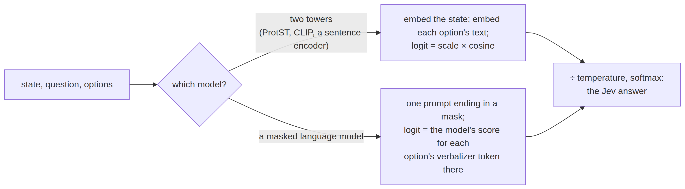

# zeroshot


<!-- WARNING: THIS FILE WAS AUTOGENERATED! DO NOT EDIT! -->

A sysone head learns to score anchors, and before it has seen labelled
data it knows nothing. Some models can answer a typed question without
any head, and such a zero-shot answer is worth having for two reasons:
it is the baseline a trained head has to beat, and it is all a new task
has before anyone labels anything. Two kinds of model can do it, and
this module turns each into a backend shaped like a
[`Decider`](https://sgaseretto.github.io/sysonelib/inference.html#decider):
[`predict`](https://sgaseretto.github.io/sysonelib/cli.html#predict) and
`predict_batch` return answers in the Jev schema, `calibrate` fits
temperatures on held-out records, and
[`evaluate`](https://sgaseretto.github.io/sysonelib/evaluate.html#evaluate)
scores it like any other backend.

<div>

<figure class=''>

<div>



</div>

</figure>

</div>

## Two towers: similarity

A two-tower model embeds its two inputs into one space, trained so that
a state and a text that describe each other lie close together: CLIP for
images and captions, ProtST for proteins and their Swiss-Prot
descriptions, a sentence encoder for two texts. Each option becomes a
text, its description or else its key, and its logit is the cosine
between the state’s embedding and the option text’s, times the model’s
`scale` (the logit scale CLIP and ProtST learn; 1 for a plain sentence
encoder). This is how ProtST and ProTrek classify proteins without
training, and how CLIP classifies images.

A noul needs two texts, one per answer. With descriptions of its own
(`criteria={"false": "a soluble protein", "true": "a membrane protein"}`)
the two are compared directly. Without them the statement is compared
with its negation, which two-tower models read poorly, since contrastive
pre-training rarely sees a “not”. The texts come from
[`option_texts`](https://sgaseretto.github.io/sysonelib/zeroshot.html#option_texts),
a [generic
function](00_core.ipynb#generic-functions-and-multiple-dispatch) with a
method per kind of question: a choice’s descriptions (or keys), a
score’s levels, a noul’s two sides. A backend that wants other texts for
one kind adds a method for it.

------------------------------------------------------------------------

<a
href="https://github.com/sgaseretto/sysonelib/blob/main/sysone/zeroshot.py#L94"
target="_blank" style="float:right; font-size:smaller">source</a>

### SimilarityDecider

``` python
def SimilarityDecider(
    state_embedder, # states (or their `state_key` part) to unit vectors
    text_embedder, # option texts to unit vectors, in the same space
    scale:float=1.0, # the model's logit scale (CLIP's, ProtST's)
    prompt:str='{text}', # how an option becomes a text: {text} is its description or key, {key} its key
    state_key:str | None=None, # embed state[state_key] of a dict state (a protein's sequence); the whole state otherwise
    temperatures:dict | None=None, # per type and option-count bucket, as `calibrate` fits them
    act_threshold:float | dict | None=None, # act where the calibrated top probability ≥ this (`calibrate(act_accuracy=...)` fits them)
    digits:int | None=4, # rounding of reported numbers
    batch_size:int=16, # states per embedding call
    name:str='similarity'
):
```

*Zero-shot typed answers from a two-tower model: `scale` times the
cosine between a state’s embedding and each option text’s*

------------------------------------------------------------------------

<a
href="https://github.com/sgaseretto/sysonelib/blob/main/sysone/zeroshot.py#L38"
target="_blank" style="float:right; font-size:smaller">source</a>

### CachedEmbedder

``` python
def CachedEmbedder(
    embedder:__main__.Embedder
):
```

*An embedder that remembers each item’s vector, so deciders sharing it
(one per prompt, say) embed each state once*

------------------------------------------------------------------------

<a
href="https://github.com/sgaseretto/sysonelib/blob/main/sysone/zeroshot.py#L29"
target="_blank" style="float:right; font-size:smaller">source</a>

### SentenceTransformerEmbedder

``` python
def SentenceTransformerEmbedder(
    model:str='BAAI/bge-small-en-v1.5', prefix:str=''
):
```

*A sentence-transformers model (install `sysone[shortlist]`)*

------------------------------------------------------------------------

<a
href="https://github.com/sgaseretto/sysonelib/blob/main/sysone/zeroshot.py#L22"
target="_blank" style="float:right; font-size:smaller">source</a>

### Embedder

``` python
def Embedder(
    *args, **kwargs
):
```

*Items to unit vectors, one row per item: states (texts, proteins,
images) or option texts*

The tests use a stand-in two-tower model: character trigrams hashed into
64 dimensions, the same function for both towers, so a text is close to
the texts it shares trigrams with:

``` python
class HashEmbedder(Embedder):
    "Character trigrams hashed into 64 dimensions: a stand-in two-tower model"
    def embed(self, items):
        out = np.zeros((len(items), 64), np.float32)
        for i, s in enumerate(items):
            s = f"  {str(s).lower()}  "
            for j in range(len(s) - 2): out[i, int(hashlib.md5(s[j:j + 3].encode()).hexdigest(), 16) % 64] += 1
        return out

he = HashEmbedder()
zs = SimilarityDecider(he, he, scale=10)
qs = {"dept": {"type": "choice", "instructions": "Which team?", "criteria": {"billing": "invoices and refunds", "tech": "bugs and crashes"}},
      "urgent": {"type": "noul", "instructions": "It is urgent.", "criteria": {"false": "it can wait", "true": "urgent, today"}}}
ans = zs.predict("the app crashes with a bug on start, fix it today, urgent", qs)
test_eq((ans["dept"]["choice"], ans["urgent"]["noul"] > 0.5), ("tech", True))
test_eq(option_texts(Question.from_dict({"type": "noul", "instructions": "The photo shows a hot dog."})),
        ["It is not the case that the photo shows a hot dog.", "The photo shows a hot dog."])
test_eq(zs.predict_batch(["refund my invoice", "it crashes"], qs)[0]["dept"]["choice"], "billing")
ans
```

    {'dept': {'type': 'choice',
      'choice': 'tech',
      'probabilities': {'billing': 0.1959, 'tech': 0.8041},
      'confidence': 0.2864,
      'answer_confidence': 0.8041},
     'urgent': {'type': 'noul',
      'noul': 0.8952,
      'confidence': 0.8952,
      'answer_confidence': 0.8952}}

A state held as a dict can hand one part to the state tower
(`state_key`), the way a protein’s sequence goes to the protein tower.
`calibrate` fits temperatures on labelled records exactly as a learner
does, and
[`evaluate`](https://sgaseretto.github.io/sysonelib/evaluate.html#evaluate)
scores the result like any other backend:

``` python
qd = {"dept": qs["dept"]}
recs = [{"state": {"sequence": s, "note": "n/a"}, "questions": qd, "gold": {"dept": {"label": g}}}
        for s, g in [("invoice refund please", "billing"), ("crash bug on login", "tech"), ("refunds for invoices", "billing"),
                     ("bugs and crashes today", "tech")] * 4]
zk = SimilarityDecider(he, he, scale=10, state_key="sequence")
temps = zk.calibrate(recs, min_rows=4)
test_eq(set(temps) >= {"choice", "choice:2"}, True)
```

A zero-shot decider has no act head, but it can still say when to
escalate. `calibrate(act_accuracy=...)` also fits act thresholds on its
calibrated top probability, per question type and option-count bucket,
and its answers then carry `action`:

``` python
za = SimilarityDecider(he, he, scale=10, state_key="sequence")
za.calibrate(recs, min_rows=4, act_accuracy=0.9)
aa = za.predict(recs[0]["state"], qd)["dept"]
test_eq((sorted(aa["action"]), aa["action"]["act_probability"]), (["act", "act_probability"], aa["answer_confidence"]))
test_eq("action" in zk.predict(recs[0]["state"], qd)["dept"], False)            # calibrated without act_accuracy: no action
aa["action"]
```

    {'act_probability': 0.9999, 'act': True}

``` python
m = evaluate(zk, recs)
test_eq(m["accuracy"], 1.0)
{k: round(m[k], 3) for k in ("accuracy", "brier", "ece", "macro_f1")} | {"temperatures": temps}
```

    {'accuracy': 1.0,
     'brier': 0.001,
     'ece': 0.008,
     'macro_f1': 1.0,
     'temperatures': {'choice': 0.5, 'choice:2': 0.5}}

The state tower is usually the expensive one (a protein language model,
an image tower), and the option texts are few. So a decider embeds each
distinct state once per call, however many questions ask about it, and
remembers each option text. Comparing prompts means one decider per
prompt over the same states. Wrapping the state tower in
[`CachedEmbedder`](https://sgaseretto.github.io/sysonelib/zeroshot.html#cachedembedder)
lets them share its vectors, so each state is embedded once for all of
them:

``` python
class CountingEmbedder(HashEmbedder):
    "A HashEmbedder that counts what it embeds"
    n = 0
    def embed(self, items): self.n += len(items); return super().embed(items)

ce = CountingEmbedder()
SimilarityDecider(ce, he, scale=10, state_key="sequence").calibrate(recs, min_rows=4)
test_eq(ce.n, 4)                                      # 16 records, 4 distinct sequences
shared = CachedEmbedder(ce := CountingEmbedder())
for prompt in ("{text}", "a ticket about {text}", "{key}"):
    SimilarityDecider(shared, he, scale=10, prompt=prompt, state_key="sequence").predict_batch([r["state"] for r in recs], qd)
test_eq(ce.n, 4)                                      # three prompts, each sequence embedded once
```

## A masked language model: verbalizers

A masked language model already predicts words: put the options in the
prompt with a label each, end the prompt with a mask, and read what the
model would write there. Each option is represented by one *verbalizer*
token, its letter (A, B, C…) for a choice, its digit for a score level,
*yes* or *no* for a noul, and its logit is the model’s logit for that
token at the mask. The softmax over the verbalizers is the answer, and a
temperature fitted on held-out records calibrates it. This is
prompt-based classification (PET), and the zero-shot path the protein
note calls Path 1. Which letters or digits stand for the options depends
on the kind, through
[`verbalizer_options`](https://sgaseretto.github.io/sysonelib/zeroshot.html#verbalizer_options),
a generic function like
[`option_texts`](https://sgaseretto.github.io/sysonelib/zeroshot.html#option_texts).

It works to the extent that the model saw prompts of this shape in
pre-training, and its answers move with the prompt’s wording: try a few
phrasings and report the best and the average. Letters are used because
an option’s own words often break into several tokens, while a mask
predicts one.

------------------------------------------------------------------------

<a
href="https://github.com/sgaseretto/sysonelib/blob/main/sysone/zeroshot.py#L182"
target="_blank" style="float:right; font-size:smaller">source</a>

### VerbalizerDecider

``` python
def VerbalizerDecider(
    model, # a transformers `...ForMaskedLM`
    tokenizer, # its tokenizer, with a mask token
    prompt:str='{state}\nQuestion: {instructions}\n{options}\nAnswer: {mask}', # {state}, {instructions}, {options} and {mask}
    temperatures:dict | None=None, act_threshold:float | dict | None=None, digits:int | None=4, max_len:int=512,
    batch_size:int=8, device:NoneType=None, name:str='verbalizer'
):
```

*Zero-shot typed answers from a masked language model’s head: each
option’s logit is the model’s logit for its verbalizer token at the
prompt’s mask*

On the fixture’s tiny ModernBERT, whose masked-LM head is untrained, the
answers are noise, but the prompt, the verbalizers and the schema are
the real ones:

``` python
from transformers import AutoModelForMaskedLM, AutoTokenizer
```

``` python
FIX = "fixtures/tiny-modernbert"
vd = VerbalizerDecider(AutoModelForMaskedLM.from_pretrained(FIX), AutoTokenizer.from_pretrained(FIX), device="cpu")
qv = {"dept": {"type": "choice", "instructions": "Which team?", "criteria": {"billing": "invoices", "tech": "bugs", "sales": "pricing"}},
      "urgent": {"type": "noul", "instructions": "Is it urgent?"},
      "level": {"type": "score", "instructions": "How angry?", "criteria": ["calm", "annoyed", "furious"]}}
ids, m, v = vd._ids("The app crashes when I pay.", Question.from_dict(qv["dept"], name="dept"))
test_eq(ids[m], vd.tokenizer.mask_token_id)
print(vd.tokenizer.decode(ids))
va = vd.predict("The app crashes when I pay.", qv)
test_close(sum(va["dept"]["probabilities"].values()), 1.0, eps=1e-3)
test_eq((set(va["dept"]["probabilities"]), va["urgent"]["type"], va["level"]["type"]), ({"billing", "tech", "sales"}, "noul", "score"))
long = vd._ids("word " * 2000, Question.from_dict(qv["dept"], name="dept"))[0]
test_eq(len(long) <= vd.max_len, True)                                        # a long state is cut, the question and the mask kept
va
```

    [CLS]The app crashes when I pay.
    Question: Which team?
    Options: A. billing: invoices; B. tech: bugs; C. sales: pricing
    Answer:[MASK][SEP]

    {'dept': {'type': 'choice',
      'choice': 'tech',
      'probabilities': {'billing': 0.3078, 'tech': 0.3612, 'sales': 0.331},
      'confidence': 0.002,
      'answer_confidence': 0.3612},
     'urgent': {'type': 'noul',
      'noul': 0.5005,
      'confidence': 0.5005,
      'answer_confidence': 0.5005},
     'level': {'type': 'score',
      'score': 1.0302,
      'legend': {'0': 'calm', '1': 'annoyed', '2': 'furious'},
      'probabilities': {'0': 0.3372, '1': 0.2954, '2': 0.3674},
      'confidence': 0.0036,
      'answer_confidence': 0.3674}}
